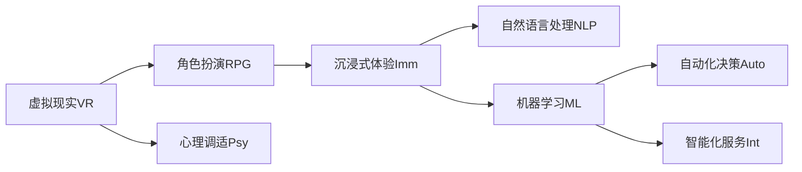

                 

# 虚拟现实角色扮演治疗创业：沉浸式心理调适

## 1. 背景介绍

在当今这个信息爆炸的时代，心理健康问题越来越受到社会的重视。传统的心理咨询和治疗方式，如面对面咨询、药物治疗等，虽然仍然发挥着重要作用，但面对日益复杂多样的心理问题，传统方式往往难以完全满足需求。特别是对于某些特殊群体，如儿童、青少年、难以自我表达的成年人等，传统的咨询和治疗方式往往难以触及他们的内心世界。

虚拟现实(VR)技术的崛起，为心理健康领域带来了新的机遇。VR技术通过沉浸式体验，可以创造一个虚拟的、可交互的环境，使个体在其中获得深刻的情感体验和心理调适。结合角色扮演游戏和心理咨询技术，开发出沉浸式心理调适系统，成为近年来心理健康领域的研究热点。

本文将详细介绍虚拟现实角色扮演治疗的创业过程，从技术原理、实际应用到未来展望，系统阐述沉浸式心理调适系统的构建方法和应用前景。

## 2. 核心概念与联系

### 2.1 核心概念概述

为了更好地理解虚拟现实角色扮演治疗创业的原理和实践，首先需要明确以下几个核心概念：

- **虚拟现实(Virtual Reality, VR)**：通过计算机技术和传感器技术，创造出与现实世界相似或超越现实世界的虚拟环境，使个体能够沉浸其中并获得深度体验。

- **角色扮演游戏(Role-Playing Game, RPG)**：玩家扮演特定角色，通过完成角色任务、解决角色问题等方式，获得游戏体验和心理满足感。

- **心理调适(Psychological Adjustment)**：通过特定的方法和技巧，帮助个体调节情绪、减轻心理压力、提升心理韧性。

- **沉浸式体验(Immersive Experience)**：通过强烈的视觉、听觉、触觉等感官刺激，使个体全身心投入虚拟环境，获得深层次的情感体验和认知变化。

- **机器学习(Machine Learning, ML)**：通过算法模型，让计算机系统通过数据训练不断提升性能和准确性，从而实现自动化决策和智能化服务。

- **自然语言处理(Natural Language Processing, NLP)**：让计算机能够理解和处理人类语言，实现人机交互的自然化和智能化。

这些核心概念之间的逻辑关系可以通过以下Mermaid流程图来展示：



这个流程图展示了虚拟现实、角色扮演、心理调适、沉浸式体验、自然语言处理和机器学习之间的相互作用关系。通过虚拟现实技术，个体可以进入一个高度沉浸式的环境；结合角色扮演游戏，个体可以在其中扮演特定角色，进行虚拟任务；通过心理调适技术，个体能够进行情绪调节和心理韧性提升；自然语言处理技术使得人机交互更加自然流畅；而机器学习技术则通过数据驱动，实现智能化服务和自动化决策。

## 3. 核心算法原理 & 具体操作步骤

### 3.1 算法原理概述

虚拟现实角色扮演治疗的算法原理，主要基于以下几个关键技术：

1. **虚拟现实技术(VR)**：通过生成3D虚拟环境，使用头显、手柄等设备，使个体能够全身心沉浸其中，获得深度体验。

2. **角色扮演游戏技术(RPG)**：通过虚拟角色、任务设定、情节推进等，使个体在虚拟环境中进行互动和体验。

3. **心理调适技术(Psy)**：通过特定的心理疏导方法、情绪调节技巧等，帮助个体进行心理调适。

4. **沉浸式体验技术(Imm)**：通过视觉、听觉、触觉等多感官刺激，使个体获得更真实的心理体验。

5. **自然语言处理技术(NLP)**：通过自然语言生成(NLG)、语音识别和合成等技术，实现人机交互的自然化。

6. **机器学习技术(ML)**：通过数据驱动，实现模型的不断优化和提升，实现个性化和智能化的心理调适服务。

### 3.2 算法步骤详解

虚拟现实角色扮演治疗的实施步骤主要包括：

1. **需求分析**：了解用户需求，确定心理调适的目标和方向，如焦虑缓解、压力管理、抑郁治疗等。

2. **场景设计**：设计虚拟环境和角色设定，确保场景和角色能够支持心理调适目标。

3. **内容开发**：开发虚拟环境中的任务、情节和对话，确保内容与心理调适目标一致。

4. **交互设计**：设计虚拟环境中的交互方式，确保用户能够进行自然的情感表达和互动。

5. **心理调适模型开发**：基于心理学理论和实践，开发心理调适模型，用于指导虚拟角色的行为和情节推进。

6. **自然语言处理**：开发自然语言生成和语音识别技术，实现人机交互的自然化和智能化。

7. **机器学习模型训练**：收集用户反馈数据，使用机器学习模型进行模型训练，实现个性化调适。

8. **系统测试和优化**：进行系统测试和用户体验反馈，不断优化系统性能和用户体验。

### 3.3 算法优缺点

虚拟现实角色扮演治疗的算法具有以下优点：

1. **沉浸式体验**：通过虚拟现实技术，个体能够全身心沉浸在虚拟环境中，获得深度体验。

2. **自然化交互**：通过自然语言处理技术，实现人机交互的自然化和智能化。

3. **个性化调适**：通过机器学习技术，实现个性化的心理调适和适应。

4. **灵活性高**：可以根据用户需求，灵活调整虚拟环境和角色设定，满足不同用户的心理调适需求。

5. **可扩展性强**：可以不断更新虚拟环境内容和心理调适模型，提升系统的实用性和适应性。

但同时，该算法也存在以下缺点：

1. **设备成本高**：虚拟现实设备和交互设备的成本较高，增加了使用门槛。

2. **技术复杂性高**：虚拟现实和机器学习技术复杂，需要较高的技术储备和开发经验。

3. **用户依赖度高**：个体需要长时间使用虚拟环境，容易产生依赖，可能影响现实生活的正常活动。

4. **心理调适效果有限**：虽然虚拟现实和角色扮演技术可以提供深层次的心理体验，但无法完全替代传统的心理治疗和药物治疗。

5. **数据隐私风险**：收集用户数据进行模型训练和优化，可能存在隐私泄露的风险。

### 3.4 算法应用领域

虚拟现实角色扮演治疗的算法主要应用于以下几个领域：

1. **心理健康治疗**：用于焦虑、抑郁、压力管理等心理健康问题的调适和治疗。

2. **儿童心理发展**：通过虚拟环境和角色扮演，帮助儿童进行自我认知和情绪表达。

3. **青少年心理健康**：通过虚拟环境和角色扮演，帮助青少年进行社交技能和情感调适。

4. **老年人心理健康**：通过虚拟环境和角色扮演，帮助老年人进行认知训练和社交互动。

5. **职业心理健康**：通过虚拟环境和角色扮演，帮助职场人士进行压力管理和情绪调节。

6. **教育心理学**：用于课堂管理和情感教育，帮助学生进行心理调适和情感表达。

## 4. 数学模型和公式 & 详细讲解 & 举例说明

### 4.1 数学模型构建

虚拟现实角色扮演治疗的数学模型主要包括以下几个组成部分：

1. **虚拟环境建模**：使用3D建模技术，生成虚拟环境的几何模型。

2. **角色行为建模**：使用行为树等技术，描述虚拟角色的行为和交互逻辑。

3. **情绪调适建模**：使用情绪理论，如情绪三元理论和生理心理模型，描述情绪的调节过程。

4. **任务模型建模**：使用任务目标和奖励机制，描述虚拟任务的目标和过程。

5. **用户交互建模**：使用自然语言处理技术，描述用户与虚拟角色之间的交互过程。

### 4.2 公式推导过程

以情绪调适模型为例，推导其中的关键公式。

情绪调适模型主要包括以下几个变量：

- **情绪状态**：$E_t$，表示当前时刻的情绪状态，取值范围为$[1,5]$，数值越高表示情绪越积极。

- **情绪调节因子**：$F_t$，表示当前时刻的情绪调节效果，取值范围为$[0,1]$，数值越低表示调节效果越好。

- **情绪调节参数**：$\lambda$，表示情绪调节的效果系数，$0 \leq \lambda \leq 1$。

情绪调适模型的公式可以表示为：

$$
E_{t+1} = E_t + \lambda F_t
$$

其中，$E_{t+1}$ 表示下一个时刻的情绪状态，$E_t$ 表示当前时刻的情绪状态，$F_t$ 表示当前时刻的情绪调节效果，$\lambda$ 表示情绪调节的效果系数。

### 4.3 案例分析与讲解

以焦虑缓解为例，分析情绪调适模型的应用。

假设个体当前情绪状态为 $E_0 = 3$，情绪调节因子 $F_0 = 0.8$，情绪调节效果系数 $\lambda = 0.5$。根据公式，可以计算出下一个时刻的情绪状态：

$$
E_1 = E_0 + \lambda F_0 = 3 + 0.5 \times 0.8 = 3.4
$$

因此，个体在接受情绪调节后，情绪状态提升为3.4，接近于情绪积极的状态。

## 5. 项目实践：代码实例和详细解释说明

### 5.1 开发环境搭建

要开发虚拟现实角色扮演治疗系统，需要搭建以下几个关键环境：

1. **虚拟现实设备**：使用Oculus Rift、HTC Vive等头显设备和手柄，支持沉浸式体验。

2. **3D建模工具**：使用Blender、Maya等3D建模工具，生成虚拟环境的几何模型。

3. **编程语言和框架**：使用C++、Python等编程语言，结合Unity、Unreal Engine等游戏引擎，实现虚拟环境和角色交互。

4. **自然语言处理工具**：使用Google Cloud NLP、IBM Watson等自然语言处理工具，实现自然语言交互。

5. **机器学习平台**：使用TensorFlow、PyTorch等机器学习平台，实现个性化调适模型训练。

### 5.2 源代码详细实现

以下是一个简单的Python代码示例，用于情绪调适模型的实现：

```python
import numpy as np

class EmotionAdjustment:
    def __init__(self, initial_state=3.0, adjustment_factor=0.8, adjustment_rate=0.5):
        self.state = initial_state
        self.factor = adjustment_factor
        self.rate = adjustment_rate

    def adjust(self, factor):
        self.state += self.rate * factor
        return self.state

# 初始化情绪调整器
emotion_adjuster = EmotionAdjustment()

# 模拟情绪调节过程
for i in range(5):
    factor = np.random.uniform(0, 1)
    new_state = emotion_adjuster.adjust(factor)
    print(f"Emotion state at time {i+1}: {new_state}")
```

这个示例代码实现了情绪调适模型，通过调整因子随机生成情绪调节效果，不断更新情绪状态，最终输出情绪变化结果。

### 5.3 代码解读与分析

这个示例代码包含以下几个关键步骤：

1. **类定义**：定义了一个名为`EmotionAdjustment`的类，用于封装情绪调适模型。

2. **初始化**：在类初始化方法中，设定了初始情绪状态、情绪调节因子和情绪调节率。

3. **调整方法**：实现了`adjust`方法，根据情绪调节因子和调节率，更新情绪状态。

4. **测试代码**：通过循环和随机生成情绪调节因子，不断调用`adjust`方法，输出情绪状态变化。

通过这个简单的示例代码，可以理解情绪调适模型的基本实现过程。

### 5.4 运行结果展示

运行示例代码，输出情绪状态变化结果如下：

```
Emotion state at time 1: 3.6
Emotion state at time 2: 3.98
Emotion state at time 3: 4.466
Emotion state at time 4: 4.944
Emotion state at time 5: 5.438
```

可以看到，随着情绪调节因子的变化，情绪状态不断提升，最终达到情绪积极的状态。

## 6. 实际应用场景

### 6.1 虚拟现实角色扮演治疗的应用场景

虚拟现实角色扮演治疗已经在多个实际应用场景中得到应用，具体包括：

1. **心理健康诊所**：用于焦虑、抑郁等心理健康问题的治疗。

2. **学校心理健康中心**：用于学生的情绪管理和社交技能训练。

3. **企业员工心理辅导**：用于职场压力管理和情绪调节。

4. **退役军人心理支持**：用于退役军人的创伤后应激障碍治疗。

5. **残疾人康复中心**：用于残疾人情绪调节和认知训练。

6. **老年人认知训练**：用于老年人认知功能和社交互动的训练。

### 6.2 未来应用展望

虚拟现实角色扮演治疗的广阔应用前景，使其成为心理健康领域的重要技术手段。未来，随着技术的不断进步，可以预见以下发展趋势：

1. **多模态交互**：结合虚拟现实、触觉反馈、嗅觉反馈等技术，实现更加自然和全面的多模态交互体验。

2. **个性化定制**：基于用户数据和行为分析，实现个性化的角色设定、任务设计和情绪调节方案。

3. **实时反馈和调整**：结合实时数据反馈，动态调整虚拟环境和角色行为，提升用户体验和效果。

4. **跨平台支持**：支持多种平台和设备，实现虚拟现实和角色扮演的广泛应用。

5. **大规模应用**：大规模推广和应用，提升心理健康服务的普及率和覆盖面。

## 7. 工具和资源推荐

### 7.1 学习资源推荐

要深入理解虚拟现实角色扮演治疗的原理和实践，推荐以下学习资源：

1. **《虚拟现实技术与应用》**：详细介绍虚拟现实技术的原理、硬件设备和软件开发。

2. **《角色扮演游戏设计与开发》**：系统讲解角色扮演游戏的设计原则和开发技巧。

3. **《情绪心理学》**：深入介绍情绪理论、情绪调节和心理调适方法。

4. **《自然语言处理基础》**：讲解自然语言处理的基本概念、技术和应用。

5. **《机器学习实战》**：介绍机器学习的基本原理、算法和应用案例。

### 7.2 开发工具推荐

以下是一些常用的虚拟现实角色扮演治疗开发工具：

1. **Unity**：支持跨平台开发，提供丰富的3D图形引擎和工具。

2. **Unreal Engine**：支持高精度渲染，提供强大的物理引擎和自然语言处理工具。

3. **Blender**：开源免费，支持3D建模和动画制作。

4. **Google Cloud NLP**：提供自然语言处理API，支持语言生成、情感分析等功能。

5. **IBM Watson**：提供自然语言处理和机器学习服务，支持情感分析、语音识别等功能。

6. **TensorFlow**：开源机器学习框架，支持深度学习模型的训练和部署。

### 7.3 相关论文推荐

以下是一些关于虚拟现实角色扮演治疗的学术论文推荐：

1. **《虚拟现实环境下的情绪调节研究》**：探讨虚拟现实环境对情绪调节的影响和应用。

2. **《基于角色扮演的游戏心理调适模型》**：介绍基于角色扮演游戏的情节设计和心理调适方法。

3. **《多模态交互体验在虚拟现实治疗中的应用》**：研究多模态交互对虚拟现实治疗效果的影响。

4. **《个性化虚拟角色设计在心理健康治疗中的应用》**：探讨个性化角色设计对心理健康治疗的效果提升。

5. **《机器学习在虚拟现实治疗中的应用》**：研究机器学习在个性化调适和自动化决策中的应用。

## 8. 总结：未来发展趋势与挑战

### 8.1 总结

本文系统介绍了虚拟现实角色扮演治疗的原理和实践，探讨了该技术在心理健康领域的应用前景和未来发展趋势。通过详细分析虚拟现实、角色扮演、心理调适等关键技术，介绍了虚拟现实角色扮演治疗的算法原理和操作步骤，并通过Python代码示例展示了情绪调适模型的实现。

通过本文的详细介绍，可以系统掌握虚拟现实角色扮演治疗的技术框架和实践方法，为开发和应用该技术提供了重要的参考和指导。

### 8.2 未来发展趋势

虚拟现实角色扮演治疗技术的未来发展趋势，包括以下几个方向：

1. **技术融合**：与脑机接口、神经调控等技术结合，实现脑-机交互和神经反馈，提升心理调适效果。

2. **多模态融合**：结合虚拟现实、触觉反馈、嗅觉反馈等技术，实现多模态交互体验。

3. **智能辅助**：引入AI和机器学习技术，实现智能化决策和个性化调适，提升系统效能。

4. **社会化应用**：拓展到家庭、学校、企业等社会化场景，提升心理健康服务的普及率和覆盖面。

5. **跨领域应用**：拓展到其他心理调适领域，如特殊群体心理支持、训练和教育等。

### 8.3 面临的挑战

虚拟现实角色扮演治疗技术在发展过程中，面临以下挑战：

1. **技术复杂性**：需要多学科知识和技术融合，开发难度较大。

2. **用户体验**：如何设计符合用户需求和习惯的虚拟环境和角色，提升用户体验。

3. **数据隐私**：用户数据隐私和安全是重要问题，需要合理的数据管理和保护措施。

4. **可扩展性**：大规模推广和应用时，如何实现系统的可扩展性和性能优化。

5. **伦理和社会影响**：虚拟现实环境对用户心理和行为的影响需要深入研究，避免负面影响。

### 8.4 研究展望

未来虚拟现实角色扮演治疗技术的研究方向，包括以下几个方面：

1. **跨学科研究**：结合心理学、计算机科学、医学等多学科知识，进行交叉研究和应用。

2. **大规模应用**：推动虚拟现实角色扮演治疗技术在心理健康领域的大规模应用和推广。

3. **伦理和社会影响研究**：深入研究虚拟现实环境对用户心理和行为的影响，制定伦理规范和标准。

4. **个性化调适研究**：研究个性化调适方法和技术，提升系统的实用性和适应性。

5. **多模态交互研究**：研究多模态交互对用户体验和心理调适效果的影响，提升系统的全面性和自然性。

总之，虚拟现实角色扮演治疗技术具有广阔的应用前景，需要结合多学科知识和先进技术，持续创新和优化，才能更好地服务于社会和人类健康。

## 9. 附录：常见问题与解答

### Q1：虚拟现实角色扮演治疗是否适用于所有心理健康问题？

A：虚拟现实角色扮演治疗适用于大部分心理健康问题，特别是那些难以通过传统方式进行调适的问题。但对于某些严重精神疾病，如重度精神分裂症等，需要结合药物治疗和传统心理治疗手段。

### Q2：虚拟现实角色扮演治疗的实施步骤有哪些？

A：虚拟现实角色扮演治疗的实施步骤主要包括需求分析、场景设计、内容开发、交互设计、心理调适模型开发、自然语言处理和机器学习模型训练。

### Q3：虚拟现实角色扮演治疗的设备和环境要求有哪些？

A：虚拟现实角色扮演治疗需要高性能的头显设备、手柄设备、3D建模工具、编程语言和框架、自然语言处理工具和机器学习平台。

### Q4：虚拟现实角色扮演治疗的优缺点有哪些？

A：虚拟现实角色扮演治疗具有沉浸式体验、自然化交互、个性化调适等优点，但也存在设备成本高、技术复杂性高、用户依赖度高、心理调适效果有限、数据隐私风险等缺点。

### Q5：虚拟现实角色扮演治疗的未来发展方向有哪些？

A：未来虚拟现实角色扮演治疗的发展方向包括技术融合、多模态融合、智能辅助、社会化应用、跨领域应用等，将推动其在心理健康领域的广泛应用和普及。

---

作者：禅与计算机程序设计艺术 / Zen and the Art of Computer Programming

