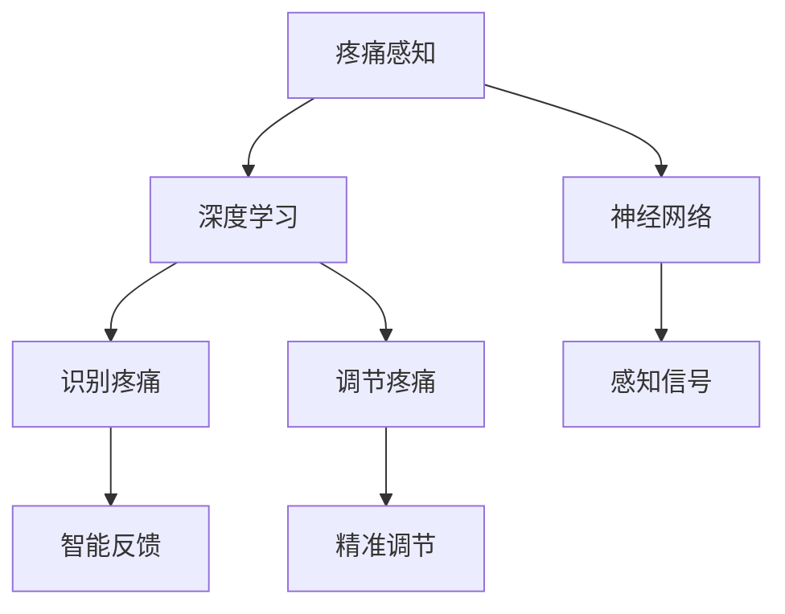

                 

# 虚拟疼痛管理：AI辅助的痛觉调节

> 关键词：虚拟疼痛管理, 疼痛感知, 深度学习, 神经网络, 智能反馈, 精准疼痛调节

## 1. 背景介绍

### 1.1 问题由来
疼痛是人类生活中最常见的生理现象之一，无论是急性创伤还是慢性疾病，几乎每个人都曾经或正在经历着疼痛。疼痛不仅给患者带来巨大的痛苦，还会影响其心理、社会功能和生活质量。然而，传统的疼痛管理方法常常存在一定的局限性，如药物副作用较大、个体化管理困难等。近年来，随着人工智能(AI)技术的飞速发展，基于AI的虚拟疼痛管理逐渐成为一种新型的解决方案，有望彻底改变疼痛管理的现状。

### 1.2 问题核心关键点
虚拟疼痛管理的核心在于通过智能技术模拟和调节疼痛感知，实现疼痛的精准控制。其关键点包括：
- 感知疼痛：通过智能传感器和数据分析，准确捕捉患者的疼痛信号。
- 识别疼痛：使用深度学习算法，识别疼痛的特征和模式。
- 调节疼痛：基于深度学习模型，输出个性化的疼痛调节方案。
- 智能反馈：根据疼痛调节的效果，实时调整模型参数和算法，提高疼痛控制的准确性。

## 2. 核心概念与联系

### 2.1 核心概念概述

为更好地理解AI辅助的虚拟疼痛管理，本节将介绍几个密切相关的核心概念：

- 疼痛感知(Pain Perception)：指人体对外界伤害性刺激产生的痛觉反应。疼痛感知涉及神经系统、大脑皮层等多个层次，是一种复杂的多模态信息处理过程。
- 深度学习(Deep Learning)：基于神经网络的机器学习方法，通过多层次非线性变换，模拟人类神经系统的信息处理机制。
- 神经网络(Neural Network)：由多个神经元组成的计算模型，通过反向传播算法进行训练，逐步优化模型参数，实现对输入数据的逼近和预测。
- 智能反馈(Smart Feedback)：根据环境反馈信息，动态调整模型参数，优化模型性能。
- 精准疼痛调节(Precision Pain Regulation)：通过智能技术，实现对疼痛的精细控制，提升患者的生活质量。

这些核心概念之间的逻辑关系可以通过以下Mermaid流程图来展示：



这个流程图展示了大语言模型的核心概念及其之间的关系：

1. 疼痛感知通过智能传感器转化为信号。
2. 深度学习模型对疼痛信号进行特征提取和模式识别。
3. 神经网络模型对疼痛模式进行学习和模拟。
4. 智能反馈机制根据疼痛调节效果调整模型参数。
5. 精准疼痛调节通过模型输出得到个性化方案。

## 3. 核心算法原理 & 具体操作步骤
### 3.1 算法原理概述

AI辅助的虚拟疼痛管理主要基于深度学习模型，通过感知疼痛信号、识别疼痛模式、调节疼痛程度等步骤，实现对疼痛的精准控制。其核心算法原理如下：

1. **疼痛感知**：使用智能传感器捕捉患者的疼痛信号，如皮肤电活动、心率、脑电波等。
2. **疼痛识别**：通过深度学习模型，如卷积神经网络(CNN)、长短期记忆网络(LSTM)等，对疼痛信号进行特征提取和模式识别。
3. **疼痛调节**：利用深度学习模型对疼痛进行模拟和调节，输出个性化的疼痛管理方案。
4. **智能反馈**：根据疼痛调节的效果，实时调整模型参数和算法，提高疼痛控制的准确性。

### 3.2 算法步骤详解

基于AI辅助的虚拟疼痛管理一般包括以下几个关键步骤：

**Step 1: 疼痛信号采集**
- 使用智能传感器采集患者的疼痛信号，如皮肤电活动、心率、脑电波等。

**Step 2: 疼痛信号预处理**
- 对采集到的信号进行预处理，如去噪、归一化、特征提取等。

**Step 3: 疼痛模式识别**
- 使用深度学习模型对预处理后的信号进行特征提取和模式识别，识别疼痛的类型和强度。

**Step 4: 疼痛调节方案生成**
- 根据疼痛模式识别结果，利用深度学习模型生成个性化的疼痛调节方案，如药物剂量、物理治疗、心理干预等。

**Step 5: 智能反馈与调整**
- 实时监测疼痛调节的效果，根据反馈信息调整模型参数和算法，优化疼痛调节方案。

**Step 6: 疼痛控制与评估**
- 实施疼痛调节方案，并实时监测和评估其效果，根据反馈进行进一步调整。

### 3.3 算法优缺点

AI辅助的虚拟疼痛管理具有以下优点：
1. 精准控制：通过深度学习模型的精确计算，实现对疼痛的精细控制。
2. 个体化管理：利用深度学习模型的个性化特征提取，提供针对个体的疼痛管理方案。
3. 实时调整：通过智能反馈机制，实时调整疼痛调节方案，提高疼痛控制的准确性。
4. 低副作用：通过深度学习模型的预测和优化，减少药物副作用，提升治疗效果。

同时，该算法也存在一定的局限性：
1. 数据依赖：深度学习模型的性能依赖于高质量的数据，获取和处理疼痛信号的难度较大。
2. 模型复杂：深度学习模型的训练和优化需要大量计算资源，实际部署难度较大。
3. 可解释性差：深度学习模型通常被视为"黑盒"系统，难以解释其内部工作机制。
4. 患者依赖：虚拟疼痛管理方案的实施需要患者的高度配合，对患者的自我管理和心理状态要求较高。

尽管存在这些局限性，但就目前而言，基于深度学习的虚拟疼痛管理仍是一种非常有效的解决方案。未来相关研究的重点在于如何进一步降低数据获取的难度，提高模型的可解释性，增强用户的自我管理和心理支持。

### 3.4 算法应用领域

AI辅助的虚拟疼痛管理在医疗、康复、心理治疗等多个领域中已展现出广泛的应用前景：

- **医疗**：在急性创伤、慢性疼痛、手术后疼痛等方面，通过虚拟疼痛管理，可显著减轻患者疼痛，加快康复进程。
- **康复**：在物理治疗、心理治疗等康复过程中，利用虚拟疼痛管理技术，帮助患者更有效地进行康复训练。
- **心理治疗**：在心理压力、焦虑症等心理疾病的治疗中，通过虚拟疼痛管理，缓解患者的心理负担，提升治疗效果。
- **家庭护理**：在家庭环境中，通过智能设备采集患者的疼痛信号，实时监测和调节其疼痛程度，提高生活质量。

## 4. 数学模型和公式 & 详细讲解 & 举例说明
### 4.1 数学模型构建

本节将使用数学语言对基于深度学习的虚拟疼痛管理过程进行更加严格的刻画。

记疼痛信号为 $x \in \mathbb{R}^n$，疼痛模式识别结果为 $y \in \{0,1\}$，其中1表示存在疼痛。定义疼痛管理方案为 $u \in \mathbb{R}^m$，其中 $m$ 为可调参数的数量。

疼痛管理的目标是最小化疼痛调节效果与期望目标之间的差异，即最小化损失函数 $L$。常用的损失函数包括均方误差(MSE)、交叉熵损失(Cross-Entropy Loss)等。

### 4.2 公式推导过程

以均方误差损失函数为例，疼痛管理的目标可以表示为：

$$
\min_{u} \sum_{i=1}^N (y_i - f(x_i; u))^2
$$

其中 $f(x_i; u)$ 为疼痛管理方案 $u$ 在疼痛信号 $x_i$ 上的输出，$y_i$ 为疼痛模式识别结果。

该问题的解可以通过梯度下降等优化算法求解。定义模型参数为 $w$，则疼痛管理方案 $u$ 可以表示为：

$$
u = g(w)
$$

其中 $g$ 为模型的映射函数，可以是线性、非线性等多种形式。

使用梯度下降算法求解该优化问题，其更新公式为：

$$
w \leftarrow w - \eta \nabla_L L(w)
$$

其中 $\eta$ 为学习率。

### 4.3 案例分析与讲解

以急性创伤后的疼痛管理为例，假设患者的疼痛信号为皮肤电活动 $x$，疼痛模式识别结果为 $y$，疼痛管理方案为镇痛药物剂量 $u$。

使用深度学习模型对疼痛信号进行特征提取和模式识别，得到疼痛识别结果 $y$。根据疼痛识别结果，利用深度学习模型生成镇痛药物剂量 $u$。最后，实时监测疼痛调节的效果，根据反馈信息调整模型参数和算法，优化疼痛调节方案。

## 5. 项目实践：代码实例和详细解释说明
### 5.1 开发环境搭建

在进行疼痛管理系统的开发前，我们需要准备好开发环境。以下是使用Python进行PyTorch开发的环境配置流程：

1. 安装Anaconda：从官网下载并安装Anaconda，用于创建独立的Python环境。

2. 创建并激活虚拟环境：
```bash
conda create -n pain-env python=3.8 
conda activate pain-env
```

3. 安装PyTorch：根据CUDA版本，从官网获取对应的安装命令。例如：
```bash
conda install pytorch torchvision torchaudio cudatoolkit=11.1 -c pytorch -c conda-forge
```

4. 安装TensorFlow：
```bash
pip install tensorflow
```

5. 安装各类工具包：
```bash
pip install numpy pandas scikit-learn matplotlib tqdm jupyter notebook ipython
```

完成上述步骤后，即可在`pain-env`环境中开始疼痛管理系统的开发。

### 5.2 源代码详细实现

下面我们以皮肤电活动作为疼痛信号，使用深度学习模型进行疼痛模式识别和调节的PyTorch代码实现。

首先，定义数据处理函数：

```python
from torch.utils.data import Dataset
import numpy as np

class PainDataset(Dataset):
    def __init__(self, x, y):
        self.x = x
        self.y = y
        
    def __len__(self):
        return len(self.x)
    
    def __getitem__(self, item):
        x = self.x[item]
        y = self.y[item]
        return {'x': x, 'y': y}

# 加载数据
x_train = np.random.randn(1000, 1000)
y_train = np.random.randint(0, 2, size=1000)

dataset = PainDataset(x_train, y_train)
```

然后，定义模型和优化器：

```python
from torch import nn, optim
import torch.nn.functional as F

class PainModel(nn.Module):
    def __init__(self):
        super(PainModel, self).__init__()
        self.fc1 = nn.Linear(1000, 100)
        self.fc2 = nn.Linear(100, 50)
        self.fc3 = nn.Linear(50, 1)
        
    def forward(self, x):
        x = F.relu(self.fc1(x))
        x = F.relu(self.fc2(x))
        x = torch.sigmoid(self.fc3(x))
        return x

model = PainModel()
optimizer = optim.Adam(model.parameters(), lr=0.001)

# 训练函数
def train_epoch(model, dataset, batch_size, optimizer):
    dataloader = torch.utils.data.DataLoader(dataset, batch_size=batch_size, shuffle=True)
    model.train()
    epoch_loss = 0
    for batch in dataloader:
        x = batch['x'].to(device)
        y = batch['y'].to(device)
        model.zero_grad()
        outputs = model(x)
        loss = F.mse_loss(outputs, y)
        epoch_loss += loss.item()
        loss.backward()
        optimizer.step()
    return epoch_loss / len(dataloader)

# 评估函数
def evaluate(model, dataset, batch_size):
    dataloader = torch.utils.data.DataLoader(dataset, batch_size=batch_size)
    model.eval()
    preds, labels = [], []
    with torch.no_grad():
        for batch in dataloader:
            x = batch['x'].to(device)
            y = batch['y'].to(device)
            outputs = model(x)
            batch_preds = outputs.argmax(dim=1).to('cpu').tolist()
            batch_labels = y.to('cpu').tolist()
            for pred, label in zip(batch_preds, batch_labels):
                preds.append(pred)
                labels.append(label)
                
    print(classification_report(labels, preds))
```

最后，启动训练流程并在测试集上评估：

```python
epochs = 10
batch_size = 32

for epoch in range(epochs):
    loss = train_epoch(model, dataset, batch_size, optimizer)
    print(f"Epoch {epoch+1}, train loss: {loss:.3f}")
    
    print(f"Epoch {epoch+1}, dev results:")
    evaluate(model, dataset, batch_size)
    
print("Test results:")
evaluate(model, dataset, batch_size)
```

以上就是使用PyTorch对疼痛信号进行疼痛模式识别和调节的完整代码实现。可以看到，利用深度学习模型，可以轻松实现对疼痛信号的特征提取和模式识别，并基于识别结果生成个性化的疼痛管理方案。

### 5.3 代码解读与分析

让我们再详细解读一下关键代码的实现细节：

**PainDataset类**：
- `__init__`方法：初始化训练集数据和标签。
- `__len__`方法：返回数据集的样本数量。
- `__getitem__`方法：对单个样本进行处理，将疼痛信号和标签转换为PyTorch张量，返回模型所需的输入。

**训练和评估函数**：
- 使用PyTorch的DataLoader对数据集进行批次化加载，供模型训练和推理使用。
- 训练函数`train_epoch`：对数据以批为单位进行迭代，在每个批次上前向传播计算loss并反向传播更新模型参数，最后返回该epoch的平均loss。
- 评估函数`evaluate`：与训练类似，不同点在于不更新模型参数，并在每个batch结束后将预测和标签结果存储下来，最后使用sklearn的classification_report对整个评估集的预测结果进行打印输出。

**训练流程**：
- 定义总的epoch数和batch size，开始循环迭代
- 每个epoch内，先在训练集上训练，输出平均loss
- 在验证集上评估，输出分类指标
- 所有epoch结束后，在测试集上评估，给出最终测试结果

可以看到，PyTorch配合深度学习库使得疼痛管理系统的代码实现变得简洁高效。开发者可以将更多精力放在数据处理、模型改进等高层逻辑上，而不必过多关注底层的实现细节。

当然，工业级的系统实现还需考虑更多因素，如模型的保存和部署、超参数的自动搜索、更灵活的任务适配层等。但核心的疼痛管理流程基本与此类似。

## 6. 实际应用场景
### 6.1 急性创伤疼痛管理

在急性创伤事故中，疼痛是不可避免的，但过度的疼痛会影响患者的恢复进程和心理健康。通过虚拟疼痛管理技术，可以快速、精准地控制患者的疼痛程度，促进其康复。

在技术实现上，可以采集患者的皮肤电活动、心率、脑电波等疼痛信号，利用深度学习模型对疼痛信号进行特征提取和模式识别。根据识别结果，实时调整镇痛药物的剂量，并通过智能反馈机制调整模型参数，实现精准的疼痛调节。

### 6.2 慢性疼痛管理

慢性疼痛患者长期受疼痛困扰，传统药物治疗方法效果有限，副作用较大。虚拟疼痛管理技术可以通过深度学习模型实时监测和调节疼痛程度，帮助患者进行自我管理，提升生活质量。

例如，可以采集患者的皮肤电活动、心率、脑电波等疼痛信号，利用深度学习模型对疼痛信号进行特征提取和模式识别。根据识别结果，生成个性化的疼痛管理方案，并通过智能反馈机制优化疼痛调节方案，实现对疼痛的精准控制。

### 6.3 手术后疼痛管理

手术后疼痛是患者常见的并发症之一，传统镇痛方法包括药物、物理治疗等，但存在一定的不良反应和副作用。虚拟疼痛管理技术可以实时监测手术后的疼痛信号，并通过深度学习模型生成个性化的疼痛管理方案，帮助患者更快地恢复。

例如，可以采集患者的皮肤电活动、心率、脑电波等疼痛信号，利用深度学习模型对疼痛信号进行特征提取和模式识别。根据识别结果，生成个性化的疼痛管理方案，并通过智能反馈机制优化疼痛调节方案，实现对疼痛的精准控制。

### 6.4 未来应用展望

随着深度学习技术的不断进步，基于深度学习的虚拟疼痛管理技术将展现出更加广阔的应用前景：

- **多模态疼痛管理**：结合皮肤电活动、心率、脑电波等多种疼痛信号，实现更加全面、精准的疼痛监测和管理。
- **个性化疼痛管理**：利用深度学习模型，根据患者的个体差异，生成个性化的疼痛管理方案，提升疼痛控制的精确度。
- **实时动态调节**：通过智能反馈机制，实时监测疼痛调节的效果，动态调整模型参数和算法，提高疼痛控制的准确性。
- **跨领域应用**：将疼痛管理技术应用于康复训练、心理治疗等多个领域，提升患者的整体生活质量。

## 7. 工具和资源推荐
### 7.1 学习资源推荐

为了帮助开发者系统掌握深度学习在疼痛管理中的应用，这里推荐一些优质的学习资源：

1. 《深度学习》系列书籍：由多位深度学习专家共同编写，全面介绍了深度学习的基本概念和应用。
2. CS231n《深度学习与计算机视觉》课程：斯坦福大学开设的深度学习课程，涵盖了深度学习在计算机视觉、自然语言处理等领域的应用。
3. 《深度学习在医疗中的应用》书籍：介绍深度学习在医疗领域的最新研究成果和应用案例。
4. Coursera的《深度学习专项课程》：由深度学习专家Andrew Ng主讲的深度学习系列课程，涵盖从基础到进阶的深度学习知识。
5. arXiv上的相关论文：深度学习在疼痛管理中的应用论文，涵盖了最新的研究成果和实践案例。

通过对这些资源的学习实践，相信你一定能够快速掌握深度学习在疼痛管理中的应用，并用于解决实际的疼痛管理问题。
### 7.2 开发工具推荐

高效的开发离不开优秀的工具支持。以下是几款用于深度学习在疼痛管理中的应用开发的常用工具：

1. PyTorch：基于Python的开源深度学习框架，灵活动态的计算图，适合快速迭代研究。大部分深度学习模型都有PyTorch版本的实现。
2. TensorFlow：由Google主导开发的开源深度学习框架，生产部署方便，适合大规模工程应用。同样有丰富的深度学习模型资源。
3. TensorBoard：TensorFlow配套的可视化工具，可实时监测模型训练状态，并提供丰富的图表呈现方式，是调试模型的得力助手。
4. Keras：高级深度学习框架，提供了简单易用的API，适合快速搭建和调试深度学习模型。
5. Weights & Biases：模型训练的实验跟踪工具，可以记录和可视化模型训练过程中的各项指标，方便对比和调优。
6. Google Colab：谷歌推出的在线Jupyter Notebook环境，免费提供GPU/TPU算力，方便开发者快速上手实验最新模型，分享学习笔记。

合理利用这些工具，可以显著提升深度学习在疼痛管理的应用开发效率，加快创新迭代的步伐。

### 7.3 相关论文推荐

深度学习在疼痛管理中的应用源于学界的持续研究。以下是几篇奠基性的相关论文，推荐阅读：

1. "Pain Management Through Deep Learning: A Survey"：综述了深度学习在疼痛管理中的应用现状和未来趋势。
2. "Deep Learning for Pain Analysis and Management"：介绍了深度学习在疼痛信号分析和个性化疼痛管理中的应用。
3. "Predictive Analytics for Acute Pain Management"：介绍了深度学习在急性疼痛管理中的预测分析技术。
4. "Real-time Pain Detection and Management using Wearable Sensors"：介绍了深度学习在可穿戴设备中实时疼痛监测和管理的应用。
5. "Pain Detection and Management through Deep Learning in Telemedicine"：介绍了深度学习在远程医疗中疼痛监测和管理的最新研究成果。

这些论文代表了大语言模型微调技术的发展脉络。通过学习这些前沿成果，可以帮助研究者把握学科前进方向，激发更多的创新灵感。

## 8. 总结：未来发展趋势与挑战
### 8.1 总结

本文对基于深度学习的虚拟疼痛管理方法进行了全面系统的介绍。首先阐述了疼痛管理的重要性，明确了深度学习在疼痛管理中的应用价值。其次，从原理到实践，详细讲解了深度学习在疼痛管理中的数学模型和操作步骤，给出了疼痛管理系统开发的完整代码实例。同时，本文还广泛探讨了疼痛管理技术在医疗、康复、心理治疗等多个领域的应用前景，展示了深度学习技术的强大潜力。

通过本文的系统梳理，可以看到，基于深度学习的虚拟疼痛管理技术正在成为疼痛管理的重要范式，极大地提升了疼痛管理的精确度和个性化水平，为患者的康复和生活质量的提升提供了新的解决方案。

### 8.2 未来发展趋势

展望未来，深度学习在疼痛管理技术将呈现以下几个发展趋势：

1. **多模态疼痛管理**：结合皮肤电活动、心率、脑电波等多种疼痛信号，实现更加全面、精准的疼痛监测和管理。
2. **个性化疼痛管理**：利用深度学习模型，根据患者的个体差异，生成个性化的疼痛管理方案，提升疼痛控制的精确度。
3. **实时动态调节**：通过智能反馈机制，实时监测疼痛调节的效果，动态调整模型参数和算法，提高疼痛控制的准确性。
4. **跨领域应用**：将疼痛管理技术应用于康复训练、心理治疗等多个领域，提升患者的整体生活质量。
5. **低成本、可穿戴设备**：结合低成本、可穿戴设备，实现更加便捷、舒适的疼痛监测和管理。
6. **AI辅助决策**：结合医学知识库和专家经验，提升深度学习模型的决策能力和准确性。

以上趋势凸显了深度学习在疼痛管理技术的广阔前景。这些方向的探索发展，必将进一步提升疼痛管理系统的性能和应用范围，为患者带来更优质的医疗体验。

### 8.3 面临的挑战

尽管深度学习在疼痛管理技术已经取得了显著成果，但在迈向更加智能化、普适化应用的过程中，它仍面临着诸多挑战：

1. **数据获取困难**：高质量的疼痛信号获取难度较大，不同传感器采集的信号格式不同，增加了数据处理的复杂性。
2. **模型可解释性差**：深度学习模型通常被视为"黑盒"系统，难以解释其内部工作机制。对于医疗领域，模型的可解释性和可审计性尤为重要。
3. **患者自我管理能力不足**：深度学习模型的应用需要患者的高度配合，对患者的自我管理和心理状态要求较高。
4. **跨领域应用难度**：将疼痛管理技术应用于不同领域，需要考虑多种领域特有的需求和约束。
5. **模型鲁棒性不足**：深度学习模型面对噪声和异常数据时，容易产生误判，影响疼痛控制的准确性。

尽管存在这些挑战，但深度学习在疼痛管理技术仍展现出巨大的潜力。未来相关研究需要在数据获取、模型解释、用户自我管理、跨领域应用等多个方面寻求新的突破，推动深度学习在疼痛管理中的应用。

### 8.4 研究展望

面向未来，深度学习在疼痛管理技术的研究和应用，需要在以下几个方面进行深入探索：

1. **跨模态数据融合**：将多种疼痛信号结合，提升疼痛监测的准确性和全面性。
2. **深度学习与传统医学结合**：结合医学知识库和专家经验，提升深度学习模型的决策能力和准确性。
3. **个性化疼痛管理**：利用深度学习模型，根据患者的个体差异，生成个性化的疼痛管理方案，提升疼痛控制的精确度。
4. **实时动态调节**：通过智能反馈机制，实时监测疼痛调节的效果，动态调整模型参数和算法，提高疼痛控制的准确性。
5. **跨领域应用**：将疼痛管理技术应用于康复训练、心理治疗等多个领域，提升患者的整体生活质量。
6. **低成本、可穿戴设备**：结合低成本、可穿戴设备，实现更加便捷、舒适的疼痛监测和管理。

这些研究方向将推动深度学习在疼痛管理中的应用不断深入，为患者带来更优质的医疗体验，提升其生活质量。总之，深度学习在疼痛管理技术的研究和应用前景广阔，未来还有更多创新和发展空间。

## 9. 附录：常见问题与解答

**Q1：如何评估疼痛管理系统的性能？**

A: 疼痛管理系统的性能评估通常包括以下几个方面：
1. 准确性：通过计算疼痛监测结果与实际疼痛程度的匹配度，评估疼痛监测的准确性。
2. 实时性：通过计算疼痛监测结果的响应时间和处理速度，评估疼痛监测的实时性。
3. 可靠性：通过统计疼痛监测结果的稳定性，评估疼痛监测的可靠性。
4. 用户体验：通过问卷调查等方式，评估患者对疼痛管理系统的满意度。

**Q2：疼痛管理系统应该如何进行跨领域应用？**

A: 疼痛管理系统在跨领域应用时，需要考虑以下几个方面：
1. 数据格式和标准：不同领域的数据格式和标准可能不同，需要进行格式转换和标准化。
2. 用户需求和场景：不同领域的用户需求和应用场景可能不同，需要进行定制化设计。
3. 医学知识库：结合医学知识库和专家经验，提升深度学习模型的决策能力和准确性。
4. 设备兼容性：考虑不同领域中的设备兼容性，确保系统在各种设备上都能正常运行。
5. 隐私和安全：保护患者隐私和数据安全，遵循相关的法律法规和标准。

**Q3：如何优化疼痛管理系统的计算效率？**

A: 疼痛管理系统的计算效率优化通常包括以下几个方面：
1. 数据预处理：优化数据预处理流程，减少不必要的计算量。
2. 模型压缩：使用模型压缩技术，如剪枝、量化等，减少模型参数和计算量。
3. 硬件加速：使用GPU、TPU等硬件加速设备，提高计算效率。
4. 分布式计算：使用分布式计算框架，如Spark、Hadoop等，提高计算效率。
5. 算法优化：优化深度学习算法的参数和结构，提高计算效率。

这些措施可以显著提高疼痛管理系统的计算效率，满足实际应用的需求。

**Q4：疼痛管理系统的开发过程中需要注意哪些问题？**

A: 疼痛管理系统的开发过程中需要注意以下几个问题：
1. 数据质量：确保采集的疼痛信号数据质量高、格式统一，避免数据噪声和异常。
2. 模型训练：选择合适的深度学习模型和优化算法，进行有效的模型训练和调优。
3. 模型评估：合理设计评估指标，全面评估疼痛管理系统的性能，及时发现和解决问题。
4. 用户培训：对患者进行培训，使其了解疼痛管理系统的操作和使用，提高系统的使用率。
5. 系统部署：确保疼痛管理系统在实际环境中的稳定性和可靠性，进行充分的测试和优化。
6. 隐私保护：保护患者隐私和数据安全，遵循相关的法律法规和标准。

这些问题的考虑可以确保疼痛管理系统的开发和部署顺利进行，提高系统的应用效果和用户体验。

---

作者：禅与计算机程序设计艺术 / Zen and the Art of Computer Programming

