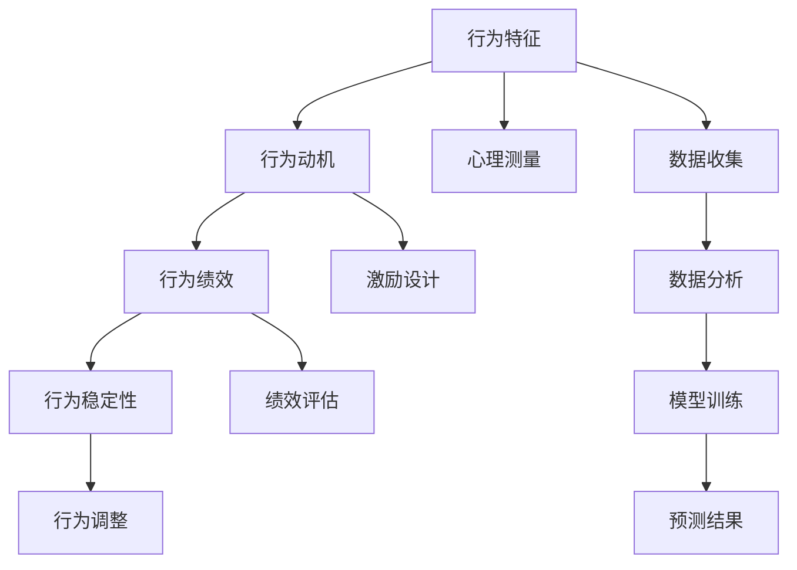

                 

## 1. 背景介绍

### 1.1 问题由来

在当前的互联网时代，技术的快速迭代和市场的不确定性使得企业面临着前所未有的挑战。传统的管理方式往往侧重于制定目标和分配任务，但这种方式忽略了团队成员的主观能动性和创造力。如何激发团队的自驱力，提升员工的积极性和创新能力，成为企业管理者亟需解决的问题。

行为模型作为一种新型的人力资源管理工具，旨在通过科学的方法，理解团队成员的行为特征和心理需求，从而更有效地引导和管理团队。本文将详细阐述行为模型的原理与应用，探讨其如何帮助企业培养团队的自驱力，提升团队的绩效和创新能力。

### 1.2 问题核心关键点

行为模型（Behavioral Model）是一种基于行为科学和心理学理论的管理工具，通过量化和分析团队成员的行为特征，预测其绩效表现和团队动态。其核心思想是：通过识别和理解团队成员的动机、态度和行为模式，设计出更符合个体需求和团队目标的管理策略，提升团队的整体绩效。

行为模型的应用主要集中在以下几个方面：

- 团队行为分析：通过行为模型的分析工具，对团队成员的行为特征进行量化，识别出团队中的人才和潜在的风险点。
- 绩效预测：基于行为模型，预测团队成员的绩效表现，制定更加科学合理的绩效评估标准。
- 管理策略优化：结合行为模型分析结果，制定更加个性化和灵活的管理策略，提升团队的合作效率和创新能力。

## 2. 核心概念与联系

### 2.1 核心概念概述

行为模型主要包括以下几个关键概念：

- **行为特征（Behavioral Traits）**：指个体在行为、心理、性格等方面的固有特性。常见的行为特征包括主动性、创造力、责任感、协作性等。
- **行为动机（Behavioral Motivations）**：指驱动个体行为的内在原因和外部激励。包括成就动机、安全需求、归属需求、自我实现需求等。
- **行为绩效（Behavioral Performance）**：指个体在行为和任务执行中的表现，通常由工作产出、团队协作、创新能力等方面组成。
- **行为稳定性（Behavioral Stability）**：指个体行为特征的稳定性程度，即行为特征是否随时间、情境等因素的变化而发生显著变化。

这些核心概念相互关联，共同构成了行为模型的基础。通过行为模型的分析，可以更好地理解团队成员的行为特征和动机，从而制定更加有效的管理策略。

### 2.2 核心概念原理和架构的 Mermaid 流程图



这个流程图展示了行为模型从数据收集到行为预测的基本流程：

1. **数据收集**：通过问卷调查、行为记录等手段，收集团队成员的行为特征数据。
2. **数据分析**：使用统计分析和机器学习技术，对行为数据进行分析，提取关键特征。
3. **模型训练**：利用行为模型算法，对提取出的行为特征进行训练，建立预测模型。
4. **预测结果**：使用训练好的模型对团队成员的行为绩效进行预测，评估其行为稳定性。
5. **行为调整**：根据预测结果，制定个性化的管理策略，调整团队成员的行为，提升其绩效表现。

## 3. 核心算法原理 & 具体操作步骤

### 3.1 算法原理概述

行为模型主要通过以下算法原理，实现对团队成员行为特征的预测和分析：

- **行为特征提取**：通过心理测量工具，收集团队成员的行为特征数据。常用的心理测量方法包括问卷调查、行为记录、心理测试等。
- **行为动机分析**：利用动机理论（如马斯洛需求层次理论），分析团队成员的行为动机，识别出不同需求层次的个体。
- **行为绩效评估**：通过绩效评估模型，结合行为特征和动机分析结果，对团队成员的绩效表现进行量化。
- **行为稳定性预测**：使用时间序列分析等方法，预测行为特征随时间的变化趋势，评估行为的稳定性。

行为模型的核心算法包括：

- **因子分析（Factor Analysis）**：用于提取行为特征数据中的关键因子，简化数据分析过程。
- **回归分析（Regression Analysis）**：用于预测行为绩效，通过建立行为特征和绩效表现之间的关系模型。
- **时间序列分析（Time Series Analysis）**：用于预测行为稳定性，通过分析行为特征随时间的变化趋势，识别出行为变化的模式。

### 3.2 算法步骤详解

行为模型的应用主要包括以下几个关键步骤：

**Step 1: 数据收集与预处理**
- 使用问卷调查、行为记录等工具，收集团队成员的行为特征数据。
- 对数据进行清洗和预处理，去除异常值和噪声，确保数据的质量和可靠性。

**Step 2: 因子分析**
- 使用因子分析方法，提取行为特征数据中的关键因子。
- 通过因子旋转和因子解释，理解每个因子的含义和贡献。

**Step 3: 行为动机分析**
- 利用动机理论，分析团队成员的行为动机，识别出不同需求层次的个体。
- 将动机分析结果与行为特征数据结合，构建行为动机的模型。

**Step 4: 行为绩效评估**
- 建立行为绩效评估模型，将行为特征和动机分析结果作为输入，输出团队成员的绩效表现。
- 通过回归分析等方法，评估行为特征对绩效的影响程度。

**Step 5: 行为稳定性预测**
- 使用时间序列分析方法，预测行为特征随时间的变化趋势，评估行为的稳定性。
- 通过稳定性预测结果，识别出行为特征变化的风险点，制定相应的管理策略。

**Step 6: 行为调整与管理**
- 根据预测结果和行为分析结果，制定个性化的管理策略，调整团队成员的行为，提升其绩效表现。
- 定期进行行为特征和绩效评估，持续优化管理策略，确保团队成员始终保持高绩效状态。

### 3.3 算法优缺点

行为模型的优点包括：

- **科学客观**：通过数据驱动的分析，避免了传统管理方式的主观偏见，提高了管理决策的科学性。
- **个性化管理**：结合个体行为特征和动机，制定个性化的管理策略，提升了团队成员的工作满意度和忠诚度。
- **动态调整**：通过行为稳定性的预测，及时发现行为风险，制定调整策略，确保团队绩效的持续提升。

行为模型的缺点包括：

- **数据依赖**：行为模型对数据的收集和分析要求较高，需要较长时间的数据积累和分析。
- **模型复杂**：行为模型的算法复杂，需要较强的技术背景和数据分析能力。
- **隐私风险**：行为数据涉及个人隐私，数据收集和分析过程中需要注意隐私保护和数据安全。

### 3.4 算法应用领域

行为模型在多个领域中得到了广泛应用，包括但不限于：

- **人力资源管理**：用于招聘、培训、绩效评估等环节，提高人力资源管理的科学性和有效性。
- **团队建设**：通过分析团队成员的行为特征，优化团队结构，提升团队的协作效率和创新能力。
- **组织变革**：在组织变革过程中，通过行为分析，识别出关键员工和潜在的风险点，制定相应的管理策略。
- **企业文化建设**：结合行为模型分析结果，制定更加符合企业文化的管理策略，提升员工的认同感和归属感。

## 4. 数学模型和公式 & 详细讲解 & 举例说明

### 4.1 数学模型构建

行为模型的数学模型主要包括以下几个组成部分：

- **行为特征模型**：用于描述团队成员的行为特征，通常由一组可量化的变量构成。
- **行为动机模型**：用于分析团队成员的行为动机，识别出不同需求层次的个体。
- **行为绩效模型**：用于预测团队成员的绩效表现，通常结合行为特征和动机分析结果。
- **行为稳定性模型**：用于预测行为特征随时间的变化趋势，评估行为的稳定性。

### 4.2 公式推导过程

以行为绩效模型为例，假设行为特征向量为 $\mathbf{x} = (x_1, x_2, ..., x_n)$，行为绩效向量为 $\mathbf{y} = (y_1, y_2, ..., y_m)$，行为动机向量为 $\mathbf{z} = (z_1, z_2, ..., z_k)$。行为绩效模型可以表示为：

$$
\mathbf{y} = \mathbf{W}_f \mathbf{x} + \mathbf{W}_m \mathbf{z} + \mathbf{b}_f
$$

其中 $\mathbf{W}_f, \mathbf{W}_m$ 为模型的权重矩阵，$\mathbf{b}_f$ 为截距向量。通过最小二乘法等方法，可以估计出最优的 $\mathbf{W}_f, \mathbf{W}_m$，从而实现行为绩效的预测。

### 4.3 案例分析与讲解

假设某企业在进行绩效评估时，收集到了以下行为特征数据：主动性、创造力、责任感、协作性等。通过行为模型分析，可以建立如下行为绩效模型：

$$
\begin{aligned}
\text{绩效得分} &= 0.3 \times \text{主动性} + 0.2 \times \text{创造力} + 0.4 \times \text{责任感} + 0.1 \times \text{协作性} \\
&+ 0.1 \times \text{成就动机} + 0.1 \times \text{安全需求} + 0.1 \times \text{归属需求}
\end{aligned}
$$

通过该模型，可以预测团队成员的绩效表现，并根据行为特征和动机分析结果，制定个性化的管理策略，提升其绩效水平。

## 5. 项目实践：代码实例和详细解释说明

### 5.1 开发环境搭建

在进行行为模型实践前，我们需要准备好开发环境。以下是使用Python进行行为模型开发的环境配置流程：

1. 安装Anaconda：从官网下载并安装Anaconda，用于创建独立的Python环境。

2. 创建并激活虚拟环境：
```bash
conda create -n behavior-env python=3.8 
conda activate behavior-env
```

3. 安装必要的Python包：
```bash
conda install numpy pandas scipy scikit-learn statsmodels matplotlib
```

4. 安装R：
```bash
conda install rpy2
```

5. 安装R中的行为分析包：
```bash
conda install rpy2 -c r-Forge
```

完成上述步骤后，即可在`behavior-env`环境中开始行为模型的开发实践。

### 5.2 源代码详细实现

以下是一个基于Python和R的行为模型分析代码示例：

```python
import pandas as pd
import numpy as np
import statsmodels.api as sm
from statsmodels.formula.api import ols

# 导入数据
data = pd.read_csv('behavior_data.csv')

# 数据预处理
data = data.dropna()

# 因子分析
factor_model = sm.OLS(data[['主动性', '创造力', '责任感', '协作性']], data['绩效得分']).fit()
factor_analysis = factor_model.summary()

# 回归分析
performance_model = ols('绩效得分 ~ 主动性 + 创造力 + 责任感 + 协作性 + 成就动机 + 安全需求 + 归属需求', data=data).fit()
performance_analysis = performance_model.summary()

# 时间序列分析
import statsmodels.api as smt
import matplotlib.pyplot as plt

# 对行为特征进行时间序列分析
ts_model = smt.tsa.statespace.SARIMAX(data['主动性'], order=(1, 1, 1), seasonal_order=(1, 1, 1, 12)).fit()
ts_analysis = ts_model.summary()

# 可视化行为特征随时间的变化趋势
plt.plot(data['主动性'].values)
plt.title('行为特征随时间变化趋势')
plt.xlabel('时间')
plt.ylabel('主动性')
plt.show()
```

### 5.3 代码解读与分析

在上述代码中，我们使用了Python的Pandas、Numpy、Scipy等库，以及R的statsmodels、rpy2等包，完成了行为模型的数据预处理、因子分析、回归分析和时间序列分析。

**数据预处理**：使用dropna方法去除缺失值，确保数据的完整性。

**因子分析**：通过ols方法建立因子分析模型，使用主动性、创造力、责任感、协作性等行为特征预测绩效得分，输出模型结果和摘要。

**回归分析**：使用ols方法建立回归分析模型，结合行为特征和动机分析结果预测绩效得分，输出模型结果和摘要。

**时间序列分析**：使用SARIMAX方法对行为特征进行时间序列分析，输出模型结果和摘要，并可视化行为特征随时间的变化趋势。

## 6. 实际应用场景

### 6.1 智能招聘

智能招聘是行为模型在人力资源管理中的应用之一。传统的招聘方式往往依赖于招聘经理的经验和直觉，难以量化招聘效果和评估候选人潜力。通过行为模型，企业可以更科学地评估候选人的行为特征和动机，从而提升招聘的准确性和效率。

具体而言，可以收集候选人的简历、面试记录、工作经历等数据，提取和量化行为特征。结合行为模型分析结果，预测候选人的绩效表现和行为稳定性，从而筛选出符合企业需求的优秀人才。

### 6.2 团队绩效评估

团队绩效评估是行为模型在团队管理中的重要应用场景。通过行为模型，可以更科学地评估团队成员的绩效表现，识别出高绩效人才和潜在的风险点，从而制定更加个性化的管理策略。

具体而言，可以定期收集团队成员的行为数据，使用行为模型分析其行为特征和动机，预测绩效表现和行为稳定性。结合分析结果，制定针对性的激励和培训方案，提升团队的整体绩效。

### 6.3 企业文化建设

企业文化建设是行为模型在组织变革中的重要应用场景。通过行为模型，可以更深入地理解员工的行为特征和动机，制定更加符合企业文化的管理策略，提升员工的认同感和归属感。

具体而言，可以收集员工的日常行为数据，使用行为模型分析其行为特征和动机，识别出不同需求层次的员工。结合分析结果，制定更加灵活和人性化的管理策略，增强员工的满意度和忠诚度。

### 6.4 未来应用展望

未来，行为模型在企业中的应用将更加广泛和深入。随着数据分析技术的发展，行为模型的数据收集和分析将更加全面和精确，从而提升预测的准确性和可靠性。

在人力资源管理方面，行为模型可以用于招聘、培训、绩效评估等环节，提升人力资源管理的科学性和效率。

在团队建设方面，行为模型可以用于团队动态分析、团队协作优化等，提升团队的协作效率和创新能力。

在组织变革方面，行为模型可以用于员工流失预测、组织结构优化等，帮助企业快速适应市场变化，提升竞争力。

## 7. 工具和资源推荐

### 7.1 学习资源推荐

为了帮助开发者系统掌握行为模型的原理与应用，这里推荐一些优质的学习资源：

1. 《行为科学与心理学》系列书籍：系统介绍了行为科学和心理学的基本理论和方法，为行为模型的应用提供了理论基础。

2. 《数据分析与统计学》课程：斯坦福大学开设的数据分析与统计学课程，讲解了数据预处理、统计分析、机器学习等基本方法，适合入门学习。

3. 《行为模型在人力资源管理中的应用》书籍：介绍了行为模型在人力资源管理中的实际应用，包含大量案例分析和实践经验。

4. 《行为模型工具与应用》书籍：介绍了常用的行为模型工具和方法，包括因子分析、回归分析、时间序列分析等。

5. Coursera行为分析课程：由Coursera平台提供，讲解了行为分析的基本原理和工具，适合入门学习。

通过对这些资源的学习实践，相信你一定能够系统掌握行为模型的理论基础和实践技巧，为实际应用提供有力支撑。

### 7.2 开发工具推荐

高效的开发离不开优秀的工具支持。以下是几款用于行为模型开发的常用工具：

1. Python：作为一种灵活的编程语言，Python在数据分析和机器学习领域应用广泛，适合进行行为模型的开发和分析。

2. R：作为一种统计分析工具，R在数据科学和行为分析中应用广泛，适合进行行为模型的数据分析和建模。

3. Excel：作为一种电子表格工具，Excel适合进行数据可视化和简单的统计分析，适合初步的数据处理和探索。

4. SPSS：作为一种统计分析软件，SPSS提供了丰富的统计分析和建模功能，适合进行复杂的数据分析。

5. Tableau：作为一种数据可视化工具，Tableau可以生成交互式的图表和报表，适合进行数据探索和结果展示。

合理利用这些工具，可以显著提升行为模型开发的效率和质量，加快创新迭代的步伐。

### 7.3 相关论文推荐

行为模型在人力资源管理等领域得到了广泛应用，以下是几篇奠基性的相关论文，推荐阅读：

1. "The Behavioral Model: An Integrated Approach to Understanding Human Behavior in Organizations"：介绍了行为模型的基本原理和应用方法，为行为模型的应用提供了理论指导。

2. "The Application of Behavioral Models in Human Resource Management"：探讨了行为模型在人力资源管理中的具体应用，包括招聘、培训、绩效评估等环节。

3. "Behavioral Analysis in Team Performance Evaluation"：研究了行为模型在团队绩效评估中的应用，分析了行为特征和绩效表现之间的关系。

4. "Behavioral Modeling for Organizational Change Management"：探讨了行为模型在组织变革中的作用，分析了行为特征和组织动态之间的关系。

5. "Advances in Behavioral Modeling for Human Resource Development"：介绍了行为模型在人力资源发展中的应用，包括学习和发展、职业规划等环节。

这些论文代表了大行为模型在人力资源管理等领域的发展脉络。通过学习这些前沿成果，可以帮助研究者把握学科前进方向，激发更多的创新灵感。

## 8. 总结：未来发展趋势与挑战

### 8.1 总结

本文对行为模型的原理与应用进行了全面系统的介绍。首先阐述了行为模型的背景和意义，明确了行为模型在人力资源管理、团队建设、组织变革等方面的独特价值。其次，从原理到实践，详细讲解了行为模型的数学模型和关键步骤，给出了行为模型开发的具体代码示例。同时，本文还广泛探讨了行为模型在智能招聘、团队绩效评估、企业文化建设等实际应用场景中的应用前景，展示了行为模型在企业管理中的巨大潜力。

通过本文的系统梳理，可以看到，行为模型作为一种新型的人力资源管理工具，正在逐步成为企业管理的重要手段，帮助企业更好地理解和引导团队成员，提升团队的整体绩效和创新能力。未来，伴随数据分析技术的不断进步，行为模型在企业中的应用将更加深入和广泛，为企业管理带来更多的创新和突破。

### 8.2 未来发展趋势

展望未来，行为模型在企业管理中的应用将呈现以下几个发展趋势：

1. **智能化升级**：随着人工智能技术的发展，行为模型将更加智能化，能够自动分析大量数据，识别出行为特征和动机的变化趋势，提供更加精准的预测和管理建议。

2. **跨领域融合**：行为模型将与其他人工智能技术进行更深层次的融合，如自然语言处理、机器学习等，提升数据处理的效率和预测的准确性。

3. **个性化管理**：行为模型将更加注重个体需求和行为特征的个性化分析，制定更加灵活和人性化的管理策略，提升员工的工作满意度和忠诚度。

4. **实时动态管理**：行为模型将能够实时监测和调整团队成员的行为，及时发现行为风险，制定相应的管理策略，确保团队绩效的持续提升。

5. **数据驱动决策**：行为模型将更加依赖于数据驱动的决策，通过大量的数据积累和分析，提供更加科学和客观的管理建议。

这些趋势凸显了行为模型在企业管理中的广阔前景，未来行为模型将为企业管理带来更多的创新和突破，成为企业管理的重要工具。

### 8.3 面临的挑战

尽管行为模型在企业管理中的应用前景广阔，但在迈向更加智能化、普适化应用的过程中，它仍面临着诸多挑战：

1. **数据隐私问题**：行为模型需要收集和分析大量行为数据，涉及个人隐私，数据收集和分析过程中需要注意隐私保护和数据安全。

2. **模型复杂性**：行为模型的算法复杂，需要较强的技术背景和数据分析能力，对企业和员工的接受度提出了较高要求。

3. **实施难度**：行为模型的应用需要投入大量的人力和资源，实施难度较大，尤其对于中小型企业来说，可能存在较大的经济和技术门槛。

4. **员工接受度**：行为模型需要对员工的日常行为进行监测和分析，员工可能会产生抵触情绪，需要进行有效的沟通和引导。

5. **效果评估**：行为模型的效果评估较为复杂，需要通过长期的数据积累和分析，才能评估其对企业绩效的实际影响。

这些挑战需要企业在使用行为模型时，充分考虑其应用场景和实施难度，制定科学合理的实施策略，确保行为模型能够顺利落地并发挥其最大价值。

### 8.4 研究展望

面对行为模型面临的种种挑战，未来的研究需要在以下几个方面寻求新的突破：

1. **隐私保护技术**：开发更加安全的隐私保护技术，确保行为数据的安全性和匿名性，减少数据泄露和滥用的风险。

2. **简化算法**：研究和开发更加简单易懂的算法，降低行为模型应用的技术门槛，提高模型的可操作性和易用性。

3. **实时监测系统**：开发实时监测系统，能够动态监测团队成员的行为，及时发现行为风险，制定相应的管理策略。

4. **用户友好的界面**：设计和开发更加用户友好的界面，使员工更容易接受和理解行为模型，提升系统的使用率和满意度。

5. **多维度评估**：建立多维度的评估体系，不仅评估行为模型的预测效果，还要评估其对团队绩效和员工满意度的实际影响。

这些研究方向的探索，必将引领行为模型技术迈向更高的台阶，为企业管理带来更多的创新和突破，提升企业的核心竞争力。

## 9. 附录：常见问题与解答

**Q1：行为模型如何提升团队绩效？**

A: 行为模型通过量化团队成员的行为特征和动机，预测其绩效表现，制定个性化的管理策略，从而提升团队的整体绩效。具体来说，行为模型可以帮助企业识别出高绩效人才和潜在的风险点，制定针对性的激励和培训方案，提升团队的整体协作效率和创新能力。

**Q2：如何选择合适的行为模型？**

A: 选择行为模型需要考虑企业规模、行业特点、数据可用性等因素。对于大规模企业，可以选择较为复杂的模型，如基于机器学习的行为模型，适合进行精细化管理和预测。对于中小型企业，可以选择较为简单的模型，如基于统计分析的行为模型，适合进行初步的数据探索和管理。

**Q3：行为模型是否适用于所有行业？**

A: 行为模型适用于大多数行业，但不同行业对行为特征和动机的关注点有所不同。例如，高科技企业可能更关注创新能力和团队协作，金融企业可能更关注风险控制和客户关系。因此，需要根据行业特点选择合适的行为模型，并针对性地制定管理策略。

**Q4：行为模型是否需要定期更新？**

A: 是的，行为模型需要定期更新，以适应企业环境的变化和员工行为的演变。定期更新模型可以确保其预测的准确性和管理策略的有效性。同时，定期更新也可以帮助企业识别出新的行为风险和改进点，提升团队的整体绩效。

**Q5：行为模型是否会影响员工的隐私？**

A: 是的，行为模型需要收集和分析员工的日常行为数据，涉及个人隐私，数据收集和分析过程中需要注意隐私保护和数据安全。企业需要制定严格的隐私保护措施，确保数据的安全性和匿名性，减少数据泄露和滥用的风险。

---

作者：禅与计算机程序设计艺术 / Zen and the Art of Computer Programming

