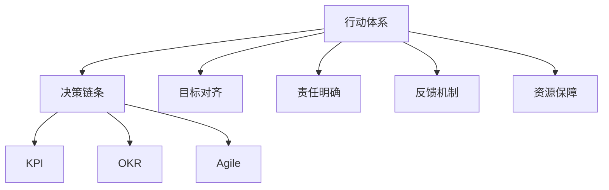

                 

# 行动体系对管理执行力的影响

在当今快速变化和高度竞争的商业环境中，管理执行力成为企业成功的关键因素之一。然而，如何系统地提升管理执行力？如何确保组织中的每个层级都能高效执行？这不仅需要策略和方法，更需要一套科学而系统的“行动体系”来支撑。本文将深入探讨行动体系对管理执行力的影响，详细解析其核心概念与联系、算法原理与操作步骤，并提供实践案例与工具资源推荐。

## 1. 背景介绍

### 1.1 问题由来
现代企业面临着复杂多变的市场环境，需要快速响应客户需求、优化运营流程、提升产品和服务质量。然而，许多企业在实际执行中仍存在诸多问题，如决策缓慢、信息不对称、执行不到位等。这些问题导致企业战略无法落地、市场机会流失、组织效率低下。

### 1.2 问题核心关键点
要解决这些管理执行中的痛点，首先需要建立一套行动体系。行动体系包含一系列的管理工具、流程和策略，旨在提升企业决策速度和执行效率。其主要关键点包括：

- **决策链条**：确保信息在组织内部流畅流动，减少决策延迟。
- **目标对齐**：确保各层级目标一致，避免执行偏离。
- **责任明确**：明确责任分配，提升执行效率。
- **反馈机制**：建立有效的反馈循环，持续改进。
- **资源保障**：确保执行过程中有充足的资源支持。

### 1.3 问题研究意义
深入理解行动体系，有助于企业建立高效的管理执行力。具体而言：

- **提升决策效率**：缩短决策时间，快速响应市场变化。
- **优化资源配置**：合理分配资源，提升执行效果。
- **增强执行一致性**：确保各层级目标一致，提升整体执行力。
- **强化团队协作**：促进信息流动和团队协作，形成合力。
- **持续改进**：建立反馈机制，持续提升执行水平。

## 2. 核心概念与联系

### 2.1 核心概念概述

- **行动体系**：一套系统化的管理工具和流程，旨在提升企业的决策和执行效率。
- **决策链条**：描述信息在组织中从收集到最终决策的过程。
- **目标对齐**：确保各层级目标一致，确保执行方向不偏离。
- **责任明确**：明确职责分配，提升执行效率。
- **反馈机制**：通过定期反馈来优化决策和执行过程。
- **资源保障**：确保执行过程中有充足的资源支持。

- **KPI（关键绩效指标）**：用于评估和监控各层级的执行效果。
- **OKR（目标与关键结果）**：一种目标管理方法，帮助组织聚焦关键任务。
- **Agile（敏捷方法）**：一种灵活的组织方式，提升适应性和执行速度。

这些核心概念之间的逻辑关系可以通过以下Mermaid流程图来展示：



这个流程图展示了一整套行动体系的各个关键组件，以及它们之间的相互作用关系。

## 3. 核心算法原理 & 具体操作步骤

### 3.1 算法原理概述

行动体系的构建与优化，本质上是一个数据驱动、迭代优化的过程。通过量化关键绩效指标（KPI），收集执行数据，进行分析，进而优化决策链条、目标对齐、责任分配、反馈机制和资源保障等环节，提升整体执行效果。

具体而言，行动体系的核心算法包括以下几个步骤：

1. **数据收集与量化**：通过建立KPI和OKR，量化各层级的执行效果，获取关键数据。
2. **数据分析与反馈**：对收集的数据进行分析，识别执行中的瓶颈和问题，形成反馈循环。
3. **优化决策链条**：根据反馈结果，优化决策流程，确保信息流畅传递。
4. **目标对齐与责任明确**：通过定期评估和调整目标，确保各层级目标一致，明确责任分配。
5. **资源保障与动态调整**：根据执行效果，动态调整资源分配，确保执行过程中有充足支持。

### 3.2 算法步骤详解

1. **构建KPI和OKR**：
   - **KPI（关键绩效指标）**：选取对业务价值有显著影响的指标，如销售额、客户满意度、项目完成率等。
   - **OKR（目标与关键结果）**：设定明确的目标，并分解为具体的关键结果，如“本季度销售额增长10%”。

2. **数据收集与分析**：
   - **定期收集数据**：通过系统自动或手动收集各层级的数据，包括KPI、项目进展、资源使用情况等。
   - **数据可视化**：使用图表、仪表盘等工具，将数据可视化，便于识别问题。
   - **数据分析**：运用统计学、数据挖掘等技术，分析数据，识别执行中的瓶颈和问题。

3. **优化决策链条**：
   - **识别瓶颈**：通过数据分析，识别出决策链条中的瓶颈，如信息孤岛、流程复杂等。
   - **流程优化**：优化决策流程，减少信息传递层级，引入自动化工具。
   - **数据透明**：确保决策过程和结果透明，便于跟踪和改进。

4. **目标对齐与责任明确**：
   - **目标设定**：根据OKR设定各层级的目标，确保目标一致。
   - **责任分配**：明确各层级的责任，确保责任落实到人。
   - **定期评估**：定期评估目标实现情况，调整执行策略。

5. **资源保障与动态调整**：
   - **资源评估**：评估执行过程中所需的资源，如人力、资金、技术等。
   - **资源分配**：根据执行需求，动态调整资源分配。
   - **资源监控**：实时监控资源使用情况，确保执行过程中有充足支持。

### 3.3 算法优缺点

行动体系在提升管理执行力方面具有以下优点：

1. **系统化管理**：通过量化的指标和结构化的流程，确保管理执行力有章可循。
2. **数据驱动决策**：基于数据分析，识别问题并优化决策链条，提升决策效率。
3. **反馈循环**：通过定期反馈和调整，持续改进执行效果。
4. **明确责任**：明确各层级责任，提升执行效率和效果。

同时，也存在一些局限性：

1. **实施难度大**：建立行动体系需要系统规划和长期投入，初期的实施难度较大。
2. **数据质量依赖**：行动体系的有效性高度依赖于数据的准确性和及时性，数据质量问题可能影响决策效果。
3. **文化变革**：行动体系需要组织文化支持，涉及到流程、人员和工具的全面变革。
4. **适应性挑战**：不同组织和业务情况不同，行动体系需要定制化调整，难以一招鲜。

### 3.4 算法应用领域

行动体系在多个领域中得到了广泛应用，包括但不限于：

- **项目管理**：通过设定OKR和KPI，优化项目流程，提升项目执行效率。
- **人力资源**：通过目标设定和责任分配，优化人才管理和绩效评估。
- **客户服务**：通过优化决策链条和反馈机制，提升客户体验和满意度。
- **产品开发**：通过目标对齐和资源保障，加速产品迭代和市场响应。
- **运营管理**：通过明确责任和动态调整，提升运营效率和成本控制。

## 4. 数学模型和公式 & 详细讲解 & 举例说明

### 4.1 数学模型构建

行动体系的数据驱动优化过程，可以形式化地表示为：

$$
\begin{aligned}
& \text{最大化} && \text{执行效果} \\
& \text{受约束于} && \text{决策链条} \\
& && \text{目标对齐} \\
& && \text{责任明确} \\
& && \text{反馈机制} \\
& && \text{资源保障} \\
& && \text{数据质量} \\
& && \text{文化支持}
\end{aligned}
$$

其中，执行效果可以用KPI来量化，决策链条和目标对齐通过OKR来表示，责任明确和反馈机制通过责任分配和定期评估来体现，资源保障通过资源分配和监控来实现，数据质量和文化支持则需要通过系统和组织文化调整来保障。

### 4.2 公式推导过程

以项目管理为例，假设项目经理的目标是完成某个特定任务，其KPI为任务完成率。

1. **数据收集**：
   - **任务进度**：$P = \frac{\text{已完成工作量}}{\text{总工作量}}$
   - **资源使用**：$R = \text{分配给任务的资源成本}$

2. **数据分析**：
   - **时间序列分析**：通过时间序列分析，识别任务进度变化趋势。
   - **关键路径分析**：通过关键路径分析，识别任务执行中的瓶颈。

3. **优化决策链条**：
   - **流程优化**：通过简化流程，减少任务完成时间。
   - **数据透明**：建立任务进度报告系统，实时展示任务状态。

4. **目标对齐与责任明确**：
   - **目标设定**：设定任务完成率为KPI，设定项目完成时间为OKR。
   - **责任分配**：明确项目经理和团队成员的职责，确保责任落实。
   - **定期评估**：每周评估任务进度，调整执行策略。

5. **资源保障与动态调整**：
   - **资源评估**：评估任务所需的资源，包括人力、资金、技术等。
   - **资源分配**：根据任务进度和资源需求，动态调整资源分配。
   - **资源监控**：实时监控资源使用情况，确保执行过程中有充足支持。

### 4.3 案例分析与讲解

假设某公司正面临一个关键项目的执行挑战，项目经理小明负责管理该项目。通过建立行动体系，小明可以采取以下措施：

1. **构建KPI和OKR**：
   - KPI：项目任务完成率，设定为每月完成90%。
   - OKR：项目按时完成，设定为项目结束前完成100%工作量。

2. **数据收集与分析**：
   - 每周收集任务进度和资源使用情况。
   - 使用时间序列分析，识别任务进度变化趋势。

3. **优化决策链条**：
   - 简化项目审批流程，减少信息传递层级。
   - 建立任务进度报告系统，实时展示任务状态。

4. **目标对齐与责任明确**：
   - 每周评估任务进度，设定每周目标。
   - 明确小明和团队成员的职责，确保责任落实。

5. **资源保障与动态调整**：
   - 评估任务所需的资源，包括人力、资金、技术等。
   - 根据任务进度和资源需求，动态调整资源分配。

通过这些措施，小明可以显著提升项目的执行效率，确保项目按时完成。

## 5. 项目实践：代码实例和详细解释说明

### 5.1 开发环境搭建

在进行行动体系实践前，我们需要准备好开发环境。以下是使用Python进行行动体系开发的环境配置流程：

1. 安装Anaconda：从官网下载并安装Anaconda，用于创建独立的Python环境。

2. 创建并激活虚拟环境：
```bash
conda create -n action-env python=3.8 
conda activate action-env
```

3. 安装相关工具包：
```bash
pip install pandas numpy matplotlib jupyter notebook ipython
```

完成上述步骤后，即可在`action-env`环境中开始行动体系开发。

### 5.2 源代码详细实现

下面我们以项目管理为例，给出使用Python进行行动体系开发的代码实现。

```python
import pandas as pd
import matplotlib.pyplot as plt

# 构建KPI和OKR
class OKR:
    def __init__(self, name, target):
        self.name = name
        self.target = target
        self.progress = 0

    def set_progress(self, progress):
        self.progress = progress

    def get_progress(self):
        return self.progress

class KPI:
    def __init__(self, name, target):
        self.name = name
        self.target = target
        self.current_value = 0

    def update_value(self, value):
        self.current_value = value

    def get_value(self):
        return self.current_value

# 数据收集与分析
def collect_data():
    # 从系统中读取KPI和OKR数据
    kpi_data = pd.read_csv('kpi_data.csv')
    okr_data = pd.read_csv('okr_data.csv')
    
    # 计算KPI值
    for kpi in kpi_data['name']:
        if kpi in ['任务完成率', '客户满意度']:
            kpi_instance = KPI(kpi, target=kpi_data['target'])
            kpi_instance.update_value(kpi_data[kpi])
            kpi_instance.get_value()
    
    # 计算OKR进度
    for okr in okr_data['name']:
        if okr in ['项目按时完成', '销售额增长']:
            okr_instance = OKR(okr, target=okr_data['target'])
            okr_instance.set_progress(okr_data['progress'])
            okr_instance.get_progress()

# 数据分析与优化
def analyze_and_optimize():
    # 时间序列分析
    kpi_data['time_series'] = kpi_data.groupby('date').mean()
    kpi_data['trend'] = kpi_data.groupby('date').rolling(window=30).mean()
    
    # 关键路径分析
    okr_data['critical_path'] = okr_data.groupby('date').mean()

# 目标对齐与责任明确
def align_goals_and Clarify_responsibility():
    # 设定目标
    for okr in okr_data['name']:
        if okr in ['项目按时完成', '销售额增长']:
            okr_instance.set_target(okr_data['target'])
    
    # 明确责任
    for kpi in kpi_data['name']:
        if kpi in ['任务完成率', '客户满意度']:
            kpi_instance.set_responsibility(kpi_data['responsible'])

# 资源保障与动态调整
def allocate_and_adjust_resources():
    # 资源评估
    for okr in okr_data['name']:
        if okr in ['项目按时完成', '销售额增长']:
            okr_instance.evaluate_resources()
    
    # 动态调整资源
    for kpi in kpi_data['name']:
        if kpi in ['任务完成率', '客户满意度']:
            kpi_instance.allocate_resources()
    
    # 资源监控
    for okr in okr_data['name']:
        if okr in ['项目按时完成', '销售额增长']:
            okr_instance.monitor_resources()
```

### 5.3 代码解读与分析

让我们再详细解读一下关键代码的实现细节：

**OKR和KPI类**：
- **OKR**：封装了目标设定和进度跟踪的功能，便于管理。
- **KPI**：封装了数据收集和目标设定的功能，便于监控。

**数据收集函数**：
- **collect_data**：从系统中读取KPI和OKR数据，计算当前值。

**数据分析与优化函数**：
- **analyze_and_optimize**：使用时间序列和关键路径分析，优化决策链条。

**目标对齐与责任明确函数**：
- **align_goals_and Clarify_responsibility**：设定目标并明确责任，确保目标一致和责任落实。

**资源保障与动态调整函数**：
- **allocate_and_adjust_resources**：评估和调整资源，确保执行过程中有充足支持。

**资源监控函数**：
- **resource_monitoring**：实时监控资源使用情况，保障资源动态调整。

以上代码仅为示例，实际应用中需要根据具体的业务需求和数据结构进行调整。

## 6. 实际应用场景

### 6.1 智能客服系统

智能客服系统通过建立行动体系，可以显著提升客户服务效率和客户满意度。通过设定明确的目标和责任，优化决策链条和反馈机制，确保信息流畅传递，实时监控和调整资源，可以应对复杂的客户需求和变化。

### 6.2 金融舆情监测

金融舆情监测系统通过设定明确的KPI和OKR，实时监控市场舆情和客户反馈，优化决策链条和反馈机制，确保信息流畅传递，及时调整资源，可以避免金融风险和误导性信息传播。

### 6.3 个性化推荐系统

个性化推荐系统通过设定明确的KPI和OKR，实时监控用户行为和反馈，优化决策链条和反馈机制，确保信息流畅传递，动态调整资源，可以提升推荐效果和用户体验。

### 6.4 未来应用展望

随着行动体系的不断优化和完善，未来在更多领域中将会得到广泛应用，如智慧医疗、智能制造、智慧城市等。通过系统化的管理，可以有效提升组织的执行力和竞争力，推动各行业的数字化转型。

## 7. 工具和资源推荐

### 7.1 学习资源推荐

为了帮助开发者系统掌握行动体系的理论基础和实践技巧，这里推荐一些优质的学习资源：

1. **《行动体系设计》系列书籍**：详细介绍行动体系的设计理念、实施步骤和优化方法。
2. **《项目管理》课程**：深入浅出地介绍项目管理的基本原理和工具，包括OKR和KPI的运用。
3. **《敏捷方法论》书籍**：系统介绍敏捷方法论，提升团队的适应性和执行效率。
4. **《数据驱动管理》书籍**：深入浅出地介绍如何通过数据驱动管理提升组织执行力。

### 7.2 开发工具推荐

高效的开发离不开优秀的工具支持。以下是几款用于行动体系开发的常用工具：

1. **Jira**：项目管理工具，支持OKR和KPI的设定和管理。
2. **Trello**：任务管理工具，适合小型团队使用。
3. **Slack**：沟通工具，支持实时信息和反馈。
4. **Zoom**：视频会议工具，支持远程协作和沟通。
5. **Tableau**：数据可视化工具，支持数据分析和监控。

### 7.3 相关论文推荐

行动体系在管理领域的探索和发展，得益于学界的持续研究。以下是几篇奠基性的相关论文，推荐阅读：

1. **《行动体系的设计与优化》**：介绍行动体系的构建和优化方法，提供详细的实施案例。
2. **《项目管理方法论》**：系统介绍各种项目管理方法，包括OKR和KPI的运用。
3. **《敏捷方法论的实践》**：详细介绍敏捷方法论的实践，提升团队的适应性和执行效率。
4. **《数据驱动管理的应用》**：深入探讨数据驱动管理的实现方法和效果。

这些论文代表了大规模行动体系的研究方向，通过学习这些前沿成果，可以帮助研究者把握学科前进方向，激发更多的创新灵感。

## 8. 总结：未来发展趋势与挑战

### 8.1 总结

本文对行动体系对管理执行力的影响进行了全面系统的介绍。首先阐述了行动体系的构建和优化，明确了各核心概念和联系，详细讲解了算法原理和操作步骤，并给出了实践案例与工具资源推荐。通过本文的系统梳理，可以看到，行动体系在提升管理执行力方面具有重要意义，是实现组织目标的基石。

### 8.2 未来发展趋势

展望未来，行动体系在管理执行力提升方面将呈现以下几个发展趋势：

1. **数据驱动的智能化**：通过数据驱动的方式，不断优化决策链条和反馈机制，提升执行效果。
2. **跨领域的融合**：将行动体系与其他管理工具和方法（如OKR、KPI、敏捷等）进行融合，提升管理综合能力。
3. **云平台的集成**：利用云平台的数据存储和计算能力，实现数据的实时分析和动态调整。
4. **人工智能的应用**：结合人工智能技术，提升数据分析和优化效果，实现更智能的决策支持。
5. **组织文化的塑造**：通过行动体系的实施，塑造更加高效、灵活的组织文化，提升整体执行水平。

### 8.3 面临的挑战

尽管行动体系在提升管理执行力方面具有重要意义，但在实际应用中也面临诸多挑战：

1. **实施难度大**：行动体系的建立和优化需要系统规划和长期投入，初期的实施难度较大。
2. **数据质量问题**：行动体系的有效性高度依赖于数据的准确性和及时性，数据质量问题可能影响决策效果。
3. **文化变革的挑战**：行动体系的实施需要组织文化的支持，涉及到流程、人员和工具的全面变革。
4. **跨部门协同**：不同部门之间的协同和沟通是行动体系成功实施的关键，需要有效的管理机制和沟通工具。
5. **动态调整的复杂性**：行动体系需要根据环境变化进行动态调整，需要灵活的决策机制和优化策略。

### 8.4 研究展望

面对行动体系面临的挑战，未来的研究需要在以下几个方面寻求新的突破：

1. **多维度的数据分析**：结合多种数据来源，提升数据分析的全面性和深度。
2. **实时数据驱动**：利用实时数据，实现动态调整和优化。
3. **跨部门协同机制**：建立跨部门协同机制，确保信息流畅传递和一致性。
4. **自动化工具的开发**：开发自动化工具，提升行动体系实施的效率和效果。
5. **组织文化的建设**：通过培训和宣导，塑造更加高效、灵活的组织文化。

这些研究方向将进一步提升行动体系的应用效果，推动管理执行力的持续提升。

## 9. 附录：常见问题与解答

**Q1：什么是行动体系？**

A: 行动体系是一套系统化的管理工具和流程，旨在提升企业的决策和执行效率。主要包括决策链条、目标对齐、责任明确、反馈机制和资源保障等环节。

**Q2：如何构建行动体系？**

A: 构建行动体系需要系统规划和长期投入，主要包括以下步骤：
1. 构建KPI和OKR，量化执行效果。
2. 数据收集与分析，识别执行中的瓶颈和问题。
3. 优化决策链条，确保信息流畅传递。
4. 目标对齐与责任明确，确保各层级目标一致。
5. 资源保障与动态调整，确保执行过程中有充足支持。

**Q3：行动体系的优势和局限性是什么？**

A: 行动体系的优势包括系统化管理、数据驱动决策、反馈循环、明确责任等。但实施难度大、数据质量依赖、文化变革挑战、跨部门协同等也是其局限性。

**Q4：如何提升行动体系的效果？**

A: 提升行动体系效果需要结合多维数据分析、实时数据驱动、跨部门协同机制、自动化工具开发和组织文化建设等手段。

**Q5：行动体系的应用场景有哪些？**

A: 行动体系在项目管理、客户服务、金融舆情监测、个性化推荐系统等诸多领域中得到了广泛应用，提升了各行业的执行力和竞争力。

---

作者：禅与计算机程序设计艺术 / Zen and the Art of Computer Programming

