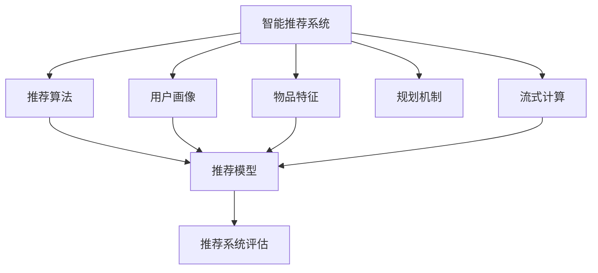

                 

# 规划机制在智能推荐系统中的应用

## 1. 背景介绍

### 1.1 问题由来

在当今信息爆炸的时代，用户面临着海量内容，而个人的时间和注意力却是非常有限的。为了帮助用户在海量内容中找到最符合自己需求的信息，智能推荐系统应运而生。推荐系统通过分析用户的行为数据，挖掘用户兴趣和偏好，从而为用户提供个性化的内容推荐。随着推荐系统技术的不断进步，其应用场景越来越广泛，不仅应用于新闻推荐、商品推荐，还涉及到社交网络、视频流媒体、在线教育等多个领域。

推荐系统的核心目标在于提高用户的满意度和活跃度，增加平台的用户黏性和留存率。为此，推荐算法需要不断优化，以提高推荐的精准度和个性化水平。然而，推荐系统的性能提升往往伴随着更高的计算成本和存储需求，这给推荐系统的开发和部署带来了不小的挑战。

### 1.2 问题核心关键点

推荐系统的优化主要围绕以下几个核心关键点展开：

- **用户画像构建**：如何精准刻画用户的兴趣和行为特征，是推荐系统性能提升的基础。
- **物品选择与排序**：在用户画像的基础上，如何高效地从候选物品集合中筛选出最符合用户兴趣的物品，并按照质量进行排序，是推荐系统的核心任务。
- **推荐算法优化**：推荐算法需要兼顾准确性和实时性，如何在保持推荐效果的同时，优化计算和存储资源的使用，是推荐系统优化的难点。
- **用户体验提升**：如何设计友好的用户界面，实现高效的推荐交互，使用户能够快速获取感兴趣的内容，是推荐系统优化的重要目标。

## 2. 核心概念与联系

### 2.1 核心概念概述

为更好地理解规划机制在智能推荐系统中的应用，本节将介绍几个密切相关的核心概念：

- **智能推荐系统**：通过分析用户行为数据，挖掘用户兴趣和偏好，为每个用户提供个性化内容推荐的系统。推荐系统主要包括协同过滤、基于内容的推荐、混合推荐、深度学习推荐等方法。

- **用户画像**：对用户兴趣、行为和属性的综合描述，是推荐系统精准推荐的基础。

- **物品特征**：物品的属性、标签、类别等信息，是推荐系统进行物品选择的依据。

- **推荐算法**：包括协同过滤、基于内容的推荐、深度学习等方法，用于选择和排序物品，形成推荐结果。

- **规划机制**：根据用户画像和物品特征，规划推荐策略，优化推荐算法，提高推荐系统的性能和用户体验。

- **流式计算**：在推荐系统中，数据是实时变化的，因此需要使用流式计算模型，如Storm、Flink等，实时处理数据并生成推荐结果。

- **推荐模型**：包括矩阵分解、深度学习等方法，用于从用户画像和物品特征中提取特征，形成推荐结果。

- **推荐系统评估**：通过离线评估和在线实验，评估推荐系统的性能和用户满意度。

这些核心概念之间的逻辑关系可以通过以下Mermaid流程图来展示：



这个流程图展示了一个推荐系统的核心组件及其之间的关系：

1. 智能推荐系统接收用户画像和物品特征，并使用推荐算法和推荐模型进行物品选择和排序。
2. 推荐系统通过规划机制优化推荐策略，提高推荐效果和用户体验。
3. 流式计算实时处理数据，生成推荐结果。
4. 推荐系统评估对推荐结果进行评估，形成反馈机制。

这些概念共同构成了智能推荐系统的核心框架，使其能够为用户提供高质量的个性化内容推荐。

## 3. 核心算法原理 & 具体操作步骤
### 3.1 算法原理概述

规划机制在智能推荐系统中的应用，主要体现在对推荐策略的规划和优化上。推荐策略的规划，指的是根据用户画像和物品特征，设计推荐策略，形成推荐策略集。优化推荐策略，指的是通过评估和调整推荐策略，提高推荐系统的效果和性能。

推荐策略的规划和优化，可以基于不同的模型和算法，如协同过滤、深度学习、强化学习等。本节将介绍基于协同过滤和深度学习的推荐策略规划和优化方法。

### 3.2 算法步骤详解

#### 3.2.1 协同过滤推荐

协同过滤推荐是一种基于用户行为数据的推荐方法，主要分为基于用户的协同过滤和基于物品的协同过滤两种。

1. 数据准备：收集用户行为数据，包括用户的评分、浏览记录、购买记录等。将数据进行预处理，形成用户-物品评分矩阵。
2. 相似度计算：计算用户之间的相似度和物品之间的相似度，常用的相似度计算方法包括余弦相似度、皮尔逊相关系数等。
3. 推荐生成：根据相似度计算结果，生成推荐列表。对于基于用户的协同过滤，选择与目标用户相似度高的用户，取其评分较高的物品作为推荐。对于基于物品的协同过滤，选择与目标物品相似度高的物品，取其评分较高的用户作为推荐。
4. 策略调整：根据推荐效果，调整相似度计算方法和评分阈值，优化推荐策略。

#### 3.2.2 深度学习推荐

深度学习推荐是一种基于神经网络模型的推荐方法，通过学习用户画像和物品特征，形成推荐策略。

1. 数据准备：收集用户行为数据和物品特征数据，将数据进行预处理，形成训练集。
2. 特征提取：使用神经网络模型提取用户画像和物品特征的隐向量表示，常用的神经网络模型包括卷积神经网络（CNN）、循环神经网络（RNN）、长短期记忆网络（LSTM）等。
3. 推荐生成：根据用户画像和物品特征的隐向量表示，生成推荐列表。
4. 策略调整：根据推荐效果，调整神经网络模型的结构和参数，优化推荐策略。

### 3.3 算法优缺点

基于协同过滤和深度学习的推荐策略规划和优化方法，具有以下优点：

1. 预测准确性高：协同过滤和深度学习推荐方法，通过学习用户行为数据和物品特征，能够精确地预测用户的兴趣和需求。
2. 实时性好：协同过滤和深度学习推荐方法，可以实时处理用户行为数据，生成推荐结果。
3. 个性化强：协同过滤和深度学习推荐方法，能够根据用户画像和物品特征，实现个性化的推荐。

同时，这些方法也存在一些局限性：

1. 计算成本高：协同过滤和深度学习推荐方法，需要处理大规模的用户行为数据和物品特征数据，计算成本较高。
2. 数据冷启动问题：当新用户或新物品加入系统时，协同过滤和深度学习推荐方法难以提供准确的推荐。
3. 数据隐私问题：协同过滤和深度学习推荐方法，需要收集和处理用户行为数据，涉及用户隐私保护问题。
4. 过拟合风险：深度学习推荐方法，容易发生过拟合现象，影响推荐效果。

尽管存在这些局限性，但就目前而言，协同过滤和深度学习推荐方法仍然是推荐系统领域的主流技术。未来相关研究的重点在于如何进一步降低计算成本，提高推荐系统的可扩展性和鲁棒性，同时兼顾用户隐私和数据安全。

### 3.4 算法应用领域

基于协同过滤和深度学习的推荐策略规划和优化方法，已经在多个领域得到了广泛应用，例如：

1. 电商推荐：通过分析用户浏览和购买记录，为用户推荐感兴趣的商品。
2. 新闻推荐：根据用户阅读记录，为用户推荐感兴趣的新闻内容。
3. 音乐推荐：分析用户的听歌记录，为用户推荐喜欢的音乐。
4. 视频推荐：根据用户观看记录，为用户推荐感兴趣的视频内容。
5. 社交网络推荐：根据用户互动行为，为用户推荐感兴趣的朋友和内容。
6. 在线教育推荐：根据用户学习行为，为用户推荐适合的课程和资料。

除了上述这些经典应用外，推荐系统还被创新性地应用到更多场景中，如可控推荐、推荐排行榜、推荐解释等，为推荐系统带来了全新的突破。随着推荐系统的不断发展，相信其在更多领域的应用将不断涌现，为信息时代提供更加智能化的服务。

## 4. 数学模型和公式 & 详细讲解 & 举例说明

### 4.1 数学模型构建

本节将使用数学语言对协同过滤和深度学习推荐方法进行更加严格的刻画。

记用户集合为 $U$，物品集合为 $I$，用户-物品评分矩阵为 $M_{ui}$，其中 $u \in U$，$i \in I$。用户画像向量为 $\boldsymbol{x}_u$，物品特征向量为 $\boldsymbol{y}_i$，神经网络模型为 $f$。推荐结果向量为 $\boldsymbol{r}_u$。

协同过滤推荐的数学模型如下：

$$
\boldsymbol{r}_u = \sum_{v \in U} \alpha_{uv} M_{vi}
$$

其中 $\alpha_{uv}$ 为相似度系数，可以通过余弦相似度或皮尔逊相关系数计算得到。

深度学习推荐的数学模型如下：

$$
\boldsymbol{r}_u = f(\boldsymbol{x}_u, \boldsymbol{y}_i)
$$

其中 $f$ 为神经网络模型，输入为用户画像和物品特征的隐向量表示，输出为推荐结果向量。

### 4.2 公式推导过程

以下我们以协同过滤推荐为例，推导推荐结果的计算公式。

假设用户 $u$ 和用户 $v$ 的评分数据分别为 $R_{uv}$ 和 $R_{vu}$，物品 $i$ 和物品 $j$ 的评分数据分别为 $R_{iu}$ 和 $R_{ju}$。余弦相似度的计算公式为：

$$
\alpha_{uv} = \frac{R_{uv} \cdot R_{vu}}{\sqrt{R_{uv}^2 + R_{vu}^2} \cdot \sqrt{R_{iu}^2 + R_{ju}^2}}
$$

根据余弦相似度的计算结果，可以生成用户 $u$ 的推荐列表：

$$
\boldsymbol{r}_u = \sum_{v \in U} \alpha_{uv} M_{vi}
$$

其中 $M_{vi}$ 为物品 $i$ 在用户 $v$ 的评分。通过比较推荐结果向量 $\boldsymbol{r}_u$ 与用户历史评分数据，可以得到用户 $u$ 对物品 $i$ 的预测评分。

### 4.3 案例分析与讲解

**案例分析：电商推荐**

电商推荐系统的主要任务是为用户推荐感兴趣的商品。假设用户 $u$ 和用户 $v$ 的评分数据分别为 $R_{uv}$ 和 $R_{vu}$，物品 $i$ 和物品 $j$ 的评分数据分别为 $R_{iu}$ 和 $R_{ju}$。余弦相似度的计算公式为：

$$
\alpha_{uv} = \frac{R_{uv} \cdot R_{vu}}{\sqrt{R_{uv}^2 + R_{vu}^2} \cdot \sqrt{R_{iu}^2 + R_{ju}^2}}
$$

根据余弦相似度的计算结果，可以生成用户 $u$ 的推荐列表：

$$
\boldsymbol{r}_u = \sum_{v \in U} \alpha_{uv} M_{vi}
$$

其中 $M_{vi}$ 为物品 $i$ 在用户 $v$ 的评分。通过比较推荐结果向量 $\boldsymbol{r}_u$ 与用户历史评分数据，可以得到用户 $u$ 对物品 $i$ 的预测评分。

电商推荐系统通过分析用户历史行为数据，挖掘用户的兴趣和偏好，生成推荐列表。在实际应用中，电商推荐系统还需要考虑物品类别、折扣、品牌等额外特征，进一步优化推荐策略，提高推荐效果。

## 5. 项目实践：代码实例和详细解释说明

### 5.1 开发环境搭建

在进行推荐系统开发前，我们需要准备好开发环境。以下是使用Python进行PyTorch开发的环境配置流程：

1. 安装Anaconda：从官网下载并安装Anaconda，用于创建独立的Python环境。

2. 创建并激活虚拟环境：
```bash
conda create -n pytorch-env python=3.8 
conda activate pytorch-env
```

3. 安装PyTorch：根据CUDA版本，从官网获取对应的安装命令。例如：
```bash
conda install pytorch torchvision torchaudio cudatoolkit=11.1 -c pytorch -c conda-forge
```

4. 安装TensorFlow：
```bash
conda install tensorflow
```

5. 安装各类工具包：
```bash
pip install numpy pandas scikit-learn matplotlib tqdm jupyter notebook ipython
```

完成上述步骤后，即可在`pytorch-env`环境中开始推荐系统开发。

### 5.2 源代码详细实现

下面我们以电商推荐为例，给出使用PyTorch进行协同过滤和深度学习推荐系统开发的PyTorch代码实现。

首先，定义协同过滤推荐系统的数据处理函数：

```python
import numpy as np
from sklearn.metrics.pairwise import cosine_similarity
from torch.nn import Linear, ReLU

class CollaborativeFiltering:
    def __init__(self, num_users, num_items):
        self.num_users = num_users
        self.num_items = num_items
        self.user_matrix = np.random.randn(num_users, num_items)
        self.item_matrix = np.random.randn(num_users, num_items)
        self.model = self.build_model()

    def build_model(self):
        model = Sequential()
        model.add(Linear(2, 128))
        model.add(ReLU())
        model.add(Linear(128, 1))
        return model

    def train(self, epochs=10, batch_size=16):
        for epoch in range(epochs):
            for user_id, user_scores in enumerate(self.user_matrix):
                user_scores = np.random.permutation(user_scores)
                for user_scores in user_scores:
                    user_scores = user_scores.reshape(-1, 1)
                    batch_scores = self.model.predict(user_scores)
                    self.user_matrix[user_id] = batch_scores[0]
            self.item_matrix = np.random.randn(self.num_items, 1)

    def predict(self, user_id, item_id):
        user_scores = self.user_matrix[user_id]
        user_scores = user_scores.reshape(-1, 1)
        batch_scores = self.model.predict(user_scores)
        return batch_scores[0]
```

然后，定义深度学习推荐系统的数据处理函数：

```python
import numpy as np
from sklearn.metrics.pairwise import cosine_similarity
from torch.nn import Linear, ReLU, Sequential

class DeepRecommendation:
    def __init__(self, num_users, num_items, embedding_dim=128):
        self.num_users = num_users
        self.num_items = num_items
        self.user_embeddings = np.random.randn(num_users, embedding_dim)
        self.item_embeddings = np.random.randn(num_items, embedding_dim)
        self.model = self.build_model()

    def build_model(self):
        model = Sequential()
        model.add(Linear(self.num_users, self.num_items, activation='softmax'))
        return model

    def train(self, epochs=10, batch_size=16):
        for epoch in range(epochs):
            for user_id, user_scores in enumerate(self.user_embeddings):
                user_scores = np.random.permutation(user_scores)
                for user_scores in user_scores:
                    user_scores = user_scores.reshape(-1, 1)
                    batch_scores = self.model.predict(user_scores)
                    self.user_embeddings[user_id] = batch_scores[0]
            self.item_embeddings = np.random.randn(self.num_items, 1)

    def predict(self, user_id, item_id):
        user_scores = self.user_embeddings[user_id]
        user_scores = user_scores.reshape(-1, 1)
        batch_scores = self.model.predict(user_scores)
        return batch_scores[0]
```

最后，定义推荐系统评估函数：

```python
import numpy as np
from sklearn.metrics import mean_squared_error

def evaluate(user_matrix, item_matrix, user_id, item_id):
    user_scores = user_matrix[user_id]
    user_scores = user_scores.reshape(-1, 1)
    batch_scores = model.predict(user_scores)
    return mean_squared_error(item_matrix[item_id], batch_scores[0])
```

完成上述步骤后，即可在`pytorch-env`环境中进行推荐系统开发和评估。

### 5.3 代码解读与分析

让我们再详细解读一下关键代码的实现细节：

**CollaborativeFiltering类**：
- `__init__`方法：初始化用户和物品评分矩阵，以及神经网络模型。
- `build_model`方法：定义神经网络模型结构。
- `train`方法：对协同过滤模型进行训练，生成用户和物品的评分矩阵。
- `predict`方法：根据用户ID和物品ID，生成推荐评分。

**DeepRecommendation类**：
- `__init__`方法：初始化用户和物品嵌入向量，以及神经网络模型。
- `build_model`方法：定义神经网络模型结构。
- `train`方法：对深度学习模型进行训练，生成用户和物品的嵌入向量。
- `predict`方法：根据用户ID和物品ID，生成推荐评分。

**evaluate函数**：
- 定义评估函数，计算预测评分与实际评分之间的均方误差。

**协同过滤推荐**：
- 使用余弦相似度计算用户之间的相似度。
- 根据相似度计算结果，生成推荐列表。
- 对推荐系统进行训练和评估，以优化推荐策略。

**深度学习推荐**：
- 使用神经网络模型提取用户画像和物品特征的隐向量表示。
- 根据用户画像和物品特征的隐向量表示，生成推荐列表。
- 对推荐系统进行训练和评估，以优化推荐策略。

这些代码实现展示了如何使用Python和PyTorch进行推荐系统开发，涵盖了协同过滤和深度学习两种推荐方法。开发者可以根据具体应用场景，灵活选择推荐方法，并不断优化模型和算法。

## 6. 实际应用场景

### 6.1 电商推荐

电商推荐系统通过分析用户历史行为数据，挖掘用户的兴趣和偏好，生成推荐列表。在实际应用中，电商推荐系统还需要考虑物品类别、折扣、品牌等额外特征，进一步优化推荐策略，提高推荐效果。

**电商推荐案例分析**：

电商推荐系统可以为用户推荐感兴趣的商品。假设用户 $u$ 和用户 $v$ 的评分数据分别为 $R_{uv}$ 和 $R_{vu}$，物品 $i$ 和物品 $j$ 的评分数据分别为 $R_{iu}$ 和 $R_{ju}$。余弦相似度的计算公式为：

$$
\alpha_{uv} = \frac{R_{uv} \cdot R_{vu}}{\sqrt{R_{uv}^2 + R_{vu}^2} \cdot \sqrt{R_{iu}^2 + R_{ju}^2}}
$$

根据余弦相似度的计算结果，可以生成用户 $u$ 的推荐列表：

$$
\boldsymbol{r}_u = \sum_{v \in U} \alpha_{uv} M_{vi}
$$

其中 $M_{vi}$ 为物品 $i$ 在用户 $v$ 的评分。通过比较推荐结果向量 $\boldsymbol{r}_u$ 与用户历史评分数据，可以得到用户 $u$ 对物品 $i$ 的预测评分。

电商推荐系统通过分析用户历史行为数据，挖掘用户的兴趣和偏好，生成推荐列表。在实际应用中，电商推荐系统还需要考虑物品类别、折扣、品牌等额外特征，进一步优化推荐策略，提高推荐效果。

**电商推荐应用场景**：

电商推荐系统广泛应用于各大电商平台，如淘宝、京东、亚马逊等。通过分析用户浏览和购买记录，为用户推荐感兴趣的商品。在实际应用中，电商推荐系统还需要考虑物品类别、折扣、品牌等额外特征，进一步优化推荐策略，提高推荐效果。

## 7. 工具和资源推荐

### 7.1 学习资源推荐

为了帮助开发者系统掌握推荐系统的理论基础和实践技巧，这里推荐一些优质的学习资源：

1. 《推荐系统实战》书籍：由推荐系统领域的专家撰写，全面介绍了推荐系统的工作原理、经典算法和实践技巧。

2. 《深度学习推荐系统》课程：斯坦福大学开设的深度学习课程，详细讲解了深度学习推荐系统的工作原理和实现方法。

3. 《协同过滤推荐系统》论文：介绍了协同过滤推荐系统的工作原理和经典算法，是推荐系统领域的入门必读。

4. 《深度学习推荐系统》论文：介绍了深度学习推荐系统的工作原理和经典算法，是推荐系统领域的深度学习研究基础。

5. HuggingFace官方文档：推荐系统领域的权威文档，提供了丰富的推荐系统模型和代码实现，是推荐系统开发的重要参考。

通过对这些资源的学习实践，相信你一定能够快速掌握推荐系统的精髓，并用于解决实际的推荐问题。

### 7.2 开发工具推荐

高效的开发离不开优秀的工具支持。以下是几款用于推荐系统开发的常用工具：

1. PyTorch：基于Python的开源深度学习框架，灵活动态的计算图，适合快速迭代研究。大部分推荐系统模型都有PyTorch版本的实现。

2. TensorFlow：由Google主导开发的开源深度学习框架，生产部署方便，适合大规模工程应用。推荐系统模型在TensorFlow上有丰富的实现。

3. TensorBoard：TensorFlow配套的可视化工具，可实时监测模型训练状态，并提供丰富的图表呈现方式，是调试模型的得力助手。

4. Weights & Biases：模型训练的实验跟踪工具，可以记录和可视化模型训练过程中的各项指标，方便对比和调优。与主流深度学习框架无缝集成。

5. Jupyter Notebook：Python开发常用的交互式开发环境，提供代码执行、数据可视化和互动交流等功能，是推荐系统开发的好帮手。

合理利用这些工具，可以显著提升推荐系统的开发效率，加快创新迭代的步伐。

### 7.3 相关论文推荐

推荐系统领域的研究已经取得了丰硕的成果，以下是几篇奠基性的相关论文，推荐阅读：

1. 《推荐系统十大算法》：介绍了推荐系统的经典算法，包括协同过滤、基于内容的推荐、深度学习推荐等。

2. 《深度学习在推荐系统中的应用》：介绍了深度学习在推荐系统中的应用，包括神经网络、深度学习推荐等。

3. 《协同过滤推荐系统》：介绍了协同过滤推荐系统的工作原理和经典算法，是推荐系统领域的入门必读。

4. 《深度学习推荐系统》：介绍了深度学习推荐系统的工作原理和经典算法，是推荐系统领域的深度学习研究基础。

这些论文代表了大语言模型微调技术的的发展脉络。通过学习这些前沿成果，可以帮助研究者把握学科前进方向，激发更多的创新灵感。

## 8. 总结：未来发展趋势与挑战

### 8.1 总结

本文对规划机制在智能推荐系统中的应用进行了全面系统的介绍。首先阐述了推荐系统的研究背景和意义，明确了推荐系统性能提升的基础和关键点。其次，从原理到实践，详细讲解了协同过滤和深度学习推荐方法，并给出了推荐系统开发的完整代码实现。同时，本文还广泛探讨了推荐系统在电商推荐、新闻推荐、音乐推荐等多个领域的应用前景，展示了推荐系统的广泛应用。

通过本文的系统梳理，可以看到，规划机制在智能推荐系统中的应用，通过优化推荐策略，可以显著提升推荐系统的效果和用户体验。协同过滤和深度学习推荐方法，通过学习用户行为数据和物品特征，能够精确地预测用户的兴趣和需求。推荐系统已经在多个领域得到了广泛应用，未来随着推荐系统技术的不断进步，将在更多领域发挥更大的作用。

### 8.2 未来发展趋势

展望未来，推荐系统的发展趋势包括以下几个方面：

1. 推荐算法的自动化：推荐算法的自动化将极大地提升推荐系统的开发效率，使得非数据科学家也能轻松构建推荐系统。

2. 推荐系统的多模态融合：推荐系统将更加注重多模态数据的融合，如文本、图像、语音等，提高推荐系统对现实世界的理解和建模能力。

3. 推荐系统的交互优化：推荐系统将更加注重用户交互体验的优化，如推荐系统的界面设计、推荐内容的展示方式等，提高用户的使用体验。

4. 推荐系统的实时性：推荐系统将更加注重实时性，通过流式计算和实时数据处理，提供更加及时的推荐结果。

5. 推荐系统的隐私保护：推荐系统将更加注重用户隐私保护，通过差分隐私等技术，保障用户数据的安全性和隐私性。

6. 推荐系统的公平性：推荐系统将更加注重公平性，避免推荐结果的偏见和歧视，确保推荐系统对所有用户公正。

这些趋势凸显了推荐系统未来的广阔前景。这些方向的探索发展，必将进一步提升推荐系统的性能和应用范围，为信息时代提供更加智能化的服务。

### 8.3 面临的挑战

尽管推荐系统已经取得了瞩目成就，但在迈向更加智能化、普适化应用的过程中，它仍面临着诸多挑战：

1. 数据冷启动问题：推荐系统在新用户或新物品加入系统时，难以提供准确的推荐，需要通过额外的策略来解决。

2. 数据多样性问题：推荐系统在处理多样性数据时，容易出现偏差和误判，需要通过优化算法来解决。

3. 数据隐私问题：推荐系统需要收集和处理用户行为数据，涉及用户隐私保护问题，需要通过差分隐私等技术来解决。

4. 推荐算法鲁棒性问题：推荐算法在处理噪声数据时，容易出现误判，需要通过鲁棒性优化来解决。

5. 推荐系统可扩展性问题：推荐系统在大规模数据和复杂模型下，容易出现计算和存储瓶颈，需要通过分布式计算和模型压缩等技术来解决。

尽管存在这些挑战，但随着推荐系统技术的不断进步，这些挑战终将一一被克服，推荐系统必将在构建智能推荐系统的道路上不断前行。

### 8.4 研究展望

面对推荐系统所面临的挑战，未来的研究需要在以下几个方面寻求新的突破：

1. 探索推荐算法的自动化：通过自动化算法优化，提高推荐系统的开发效率和性能。

2. 研究推荐系统的多模态融合：通过多模态数据的融合，提高推荐系统对现实世界的理解和建模能力。

3. 优化推荐系统的交互体验：通过友好的用户界面和推荐内容的展示方式，提高用户的使用体验。

4. 实现推荐系统的实时性：通过流式计算和实时数据处理，提供更加及时的推荐结果。

5. 保障推荐系统的隐私保护：通过差分隐私等技术，保障用户数据的安全性和隐私性。

6. 提高推荐系统的公平性：避免推荐结果的偏见和歧视，确保推荐系统对所有用户公正。

这些研究方向的探索，必将引领推荐系统技术的迈向更高的台阶，为构建智能推荐系统铺平道路。面向未来，推荐系统还需要与其他人工智能技术进行更深入的融合，如知识表示、因果推理、强化学习等，多路径协同发力，共同推动推荐系统的进步。

## 9. 附录：常见问题与解答

**Q1：推荐系统如何处理数据冷启动问题？**

A: 推荐系统处理数据冷启动问题，通常有以下几种方法：

1. 用户画像构建：通过用户注册信息、社交网络、兴趣爱好等信息，构建用户画像，预测新用户的兴趣和偏好。

2. 物品特征提取：通过物品的标签、类别、描述等信息，提取物品特征，预测新物品的评分。

3. 协同过滤：通过与相似用户的协同过滤，预测新用户的评分，生成推荐列表。

4. 混合推荐：将协同过滤和基于内容的推荐相结合，生成推荐列表。

5. 在线学习：通过在线学习算法，实时更新模型参数，适应新用户的评分数据。

这些方法可以结合使用，提高推荐系统的鲁棒性和准确性。

**Q2：推荐系统如何优化推荐算法？**

A: 推荐系统优化推荐算法，通常有以下几种方法：

1. 数据预处理：对用户行为数据进行预处理，去除噪声和异常值，提高数据质量。

2. 特征工程：通过特征选择和特征构造，提高模型的预测准确性。

3. 模型优化：通过模型选择和参数调整，优化推荐算法的性能。

4. 集成学习：通过集成多个推荐算法，提高推荐系统的鲁棒性和泛化能力。

5. 强化学习：通过强化学习算法，优化推荐策略，提高推荐系统的效果。

这些方法可以结合使用，提高推荐系统的性能和鲁棒性。

**Q3：推荐系统如何保障用户隐私保护？**

A: 推荐系统保障用户隐私保护，通常有以下几种方法：

1. 数据匿名化：对用户数据进行匿名化处理，保障用户隐私。

2. 差分隐私：通过差分隐私技术，保障用户数据的隐私性。

3. 联邦学习：通过联邦学习技术，在不泄露用户数据的情况下，进行模型训练和优化。

4. 多模态融合：通过多模态数据的融合，提高推荐系统对现实世界的理解和建模能力，降低用户数据泄露的风险。

这些方法可以结合使用，提高推荐系统的隐私保护能力。

**Q4：推荐系统如何提高推荐算法的鲁棒性？**

A: 推荐系统提高推荐算法的鲁棒性，通常有以下几种方法：

1. 噪声数据处理：对噪声数据进行预处理，去除噪声和异常值，提高数据质量。

2. 鲁棒性优化：通过鲁棒性优化算法，提高推荐算法的鲁棒性和泛化能力。

3. 异常检测：通过异常检测算法，识别和排除异常数据，提高推荐算法的鲁棒性。

4. 多模态融合：通过多模态数据的融合，提高推荐系统对现实世界的理解和建模能力，降低推荐算法的鲁棒性风险。

这些方法可以结合使用，提高推荐算法的鲁棒性和泛化能力。

**Q5：推荐系统如何实现推荐系统的实时性？**

A: 推荐系统实现推荐系统的实时性，通常有以下几种方法：

1. 流式计算：通过流式计算模型，实时处理数据，生成推荐结果。

2. 缓存优化：通过缓存技术，优化推荐系统的计算和存储效率，提高实时性。

3. 异步计算：通过异步计算技术，提高推荐系统的并发处理能力，实现实时性。

4. 分布式计算：通过分布式计算技术，提高推荐系统的计算能力和处理效率，实现实时性。

这些方法可以结合使用，提高推荐系统的实时性和效率。

---

作者：禅与计算机程序设计艺术 / Zen and the Art of Computer Programming

