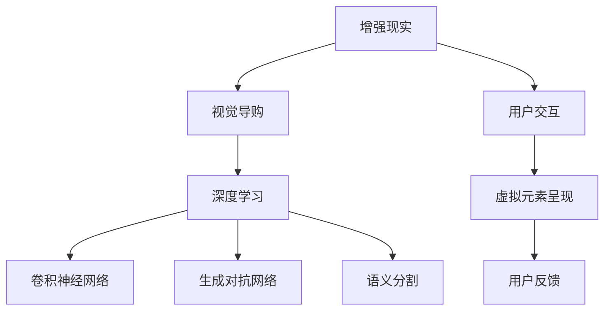

                 

## 1. 背景介绍

随着科技的飞速发展，人们对于购物体验的期待也日益提升。传统的线上购物方式虽然方便，但缺乏现场感，无法满足消费者对商品全方位了解的需求。而增强现实（Augmented Reality, AR）技术的应用，为消费者提供了一种全新的视觉导购体验，极大地提升了购物的沉浸感和互动性。

### 1.1 增强现实技术概述

增强现实技术通过在用户的现实世界视觉中叠加虚拟信息，实现了虚拟和现实的无缝结合。AR技术在电商领域的应用，主要是通过移动设备（如手机、平板）或头戴设备（如AR眼镜），将商品信息、试穿效果、评价反馈等虚拟元素呈现给用户，极大地丰富了消费者的购物体验。

### 1.2 问题由来

目前，尽管AR技术在电商领域已经有了初步应用，但仍然存在一些问题。例如，AR效果不够逼真，虚拟元素和现实场景的融合度不足，无法提供令人信服的商品展示。此外，传统的AR系统大多依赖于硬件设备的支持，增加了成本和使用门槛，影响了用户的使用体验。

## 2. 核心概念与联系

### 2.1 核心概念概述

为更好地理解AI结合增强现实技术在视觉导购中的应用，本节将介绍几个密切相关的核心概念：

- **增强现实（AR）**：通过在用户的现实世界视觉中叠加虚拟信息，增强现实技术将虚拟元素与现实世界进行无缝结合。
- **视觉导购**：利用AR技术在电商平台上为消费者提供商品试穿、3D展示等沉浸式体验，提升购物体验。
- **深度学习（Deep Learning）**：通过多层神经网络，深度学习可以从大量数据中学习出复杂的特征表示，在视觉导购中用于图像识别、场景理解等任务。
- **卷积神经网络（Convolutional Neural Network, CNN）**：一种前馈神经网络，常用于图像处理和视觉识别任务，提取空间特征和局部特征。
- **生成对抗网络（Generative Adversarial Network, GAN）**：通过两个神经网络（生成器和判别器）对抗训练，生成逼真的虚拟图像。
- **语义分割（Semantic Segmentation）**：将图像分割成不同的语义区域，便于对场景进行理解。

这些核心概念之间的逻辑关系可以通过以下Mermaid流程图来展示：



这个流程图展示了几者之间的关系：

1. **增强现实**通过**用户交互**向**视觉导购**提供输入。
2. **视觉导购**利用**深度学习**技术，对图像进行处理和理解。
3. **深度学习**通过**卷积神经网络**提取图像特征，使用**生成对抗网络**生成虚拟元素。
4. **语义分割**用于场景理解，辅助虚拟元素的融合。

这些概念共同构成了AI结合增强现实技术的框架，使其能够在视觉导购中发挥强大的作用。

## 3. 核心算法原理 & 具体操作步骤

### 3.1 算法原理概述

基于深度学习的增强现实视觉导购系统，主要通过图像识别、场景理解、虚拟元素生成等技术，实现商品的虚拟展示和试穿。其核心算法包括：

- **图像识别**：通过卷积神经网络（CNN）对用户上传的商品图像进行分类和识别。
- **场景理解**：利用语义分割等技术，理解用户当前的购物场景和需求。
- **虚拟元素生成**：通过生成对抗网络（GAN）生成逼真的虚拟展示效果。

### 3.2 算法步骤详解

以下是视觉导购系统中常见的算法步骤：

**Step 1: 用户交互**

用户通过移动设备或头戴设备，上传商品图像或打开商品页面，启动增强现实应用。

**Step 2: 图像识别**

系统使用卷积神经网络对用户上传的商品图像进行识别，获取商品的类别和属性信息。

**Step 3: 场景理解**

系统对用户当前的购物场景进行语义分割，理解用户的购物意图和场景环境。

**Step 4: 虚拟元素生成**

根据用户上传的商品图像和当前购物场景，生成逼真的虚拟展示效果，如3D模型、虚拟试穿等。

**Step 5: 虚拟元素呈现**

将虚拟元素叠加在用户的现实视觉中，实现商品展示和试穿。

**Step 6: 用户反馈**

用户对虚拟展示效果进行评价和反馈，系统根据反馈进行调整优化。

### 3.3 算法优缺点

基于深度学习的增强现实视觉导购系统具有以下优点：

- **沉浸体验**：通过虚拟元素和现实场景的结合，提升用户的购物体验。
- **多样化展示**：根据用户需求生成多种虚拟展示效果，满足不同用户的偏好。
- **实时互动**：通过用户反馈进行动态调整，提升展示的个性化和精准度。

同时，该方法也存在一些缺点：

- **数据依赖**：对训练数据和场景理解模型有较高的要求。
- **计算资源**：深度学习模型的计算复杂度较高，对硬件和算力要求高。
- **实时性**：在复杂场景下，生成虚拟元素的速度可能较慢。

### 3.4 算法应用领域

增强现实视觉导购系统已经在电商、家居、家具等多个领域得到了应用，具体包括：

- **虚拟试穿**：如试穿衣服、鞋子、配饰等，帮助用户快速找到适合的尺码和款式。
- **3D模型展示**：展示家具、家电等产品的3D模型，让用户能够直观感受产品尺寸和设计。
- **虚拟场景体验**：如展示房间布局，帮助用户规划家装方案。
- **智能客服**：结合语音和文字识别技术，提供商品信息的查询和推荐服务。

这些应用场景展示了增强现实技术在电商领域的广泛应用，带来了全新的购物体验和商业价值。

## 4. 数学模型和公式 & 详细讲解  
### 4.1 数学模型构建

本节将使用数学语言对增强现实视觉导购系统的算法进行严格刻画。

记用户上传的商品图像为 $I \in \mathbb{R}^{h \times w \times 3}$，其中 $h, w$ 分别为图像的高度和宽度，3 为 RGB 三个通道。图像识别模型为 $f: I \rightarrow C$，其中 $C$ 为商品类别集合。场景理解模型为 $g: I \rightarrow S$，其中 $S$ 为场景语义标签集合。虚拟元素生成模型为 $h: (I, S) \rightarrow V$，其中 $V$ 为虚拟元素集合。

定义用户上传的商品图像为 $I$，场景理解模型输出为 $S$，虚拟元素生成模型输出为 $V$。在视觉导购系统中，用户交互、图像识别、场景理解、虚拟元素生成等步骤的数学模型如下：

**用户交互**：
$$
I = f_{\theta_I}(I_{input})
$$
其中 $I_{input}$ 为用户输入的商品图像，$\theta_I$ 为图像识别模型的参数。

**场景理解**：
$$
S = g_{\theta_G}(I)
$$
其中 $\theta_G$ 为场景理解模型的参数。

**虚拟元素生成**：
$$
V = h_{\theta_H}(I, S)
$$
其中 $\theta_H$ 为虚拟元素生成模型的参数。

**虚拟元素呈现**：
$$
O = f_{\theta_O}(V)
$$
其中 $O$ 为用户最终看到的虚拟展示效果，$\theta_O$ 为虚拟元素呈现模型的参数。

### 4.2 公式推导过程

以下我们对图像识别、场景理解、虚拟元素生成等关键步骤进行公式推导。

**图像识别**：
使用卷积神经网络（CNN）对图像进行特征提取，得到高层次的特征表示。假设使用 VGG 网络，其输出为：
$$
F = \{\phi_1, \phi_2, \ldots, \phi_n\}
$$
其中 $\phi_i$ 为第 $i$ 层的特征图。最终分类层输出为：
$$
C = f_C(F)
$$
其中 $f_C$ 为分类层函数，可以是 softmax 函数或其他分类函数。

**场景理解**：
利用语义分割网络对图像进行像素级分类，得到场景中不同语义区域的标签。假设使用 DeepLabv3+，其输出为：
$$
S = \{s_1, s_2, \ldots, s_m\}
$$
其中 $s_i$ 为第 $i$ 个像素的语义标签。

**虚拟元素生成**：
使用生成对抗网络（GAN）生成虚拟展示效果。假设使用 Conditional GAN，其生成器和判别器的输出分别为 $G(Z, S)$ 和 $D(I, S)$，其中 $Z$ 为噪声向量，$S$ 为场景标签。训练目标为：
$$
\min_G \max_D V(D(G(Z, S)), I)
$$
其中 $V$ 为判别器损失函数，可以是交叉熵损失或其他对抗损失。

### 4.3 案例分析与讲解

以虚拟试穿衣服为例，说明增强现实视觉导购系统的具体实现过程。

1. **用户交互**：用户通过移动设备上传试穿图像，或打开商品页面。
2. **图像识别**：系统使用卷积神经网络对用户上传的图像进行识别，识别出衣物类别、尺寸等信息。
3. **场景理解**：系统对用户所在的场景进行语义分割，理解用户当前的购物意图。
4. **虚拟元素生成**：系统生成与用户衣物相匹配的虚拟试穿效果，如3D模型、虚拟背景等。
5. **虚拟元素呈现**：将虚拟试穿效果叠加在用户的现实视觉中，实现试穿展示。
6. **用户反馈**：用户对试穿效果进行评价和反馈，系统根据反馈进行调整优化。

这一过程展示了增强现实视觉导购系统的核心算法和实现步骤，可以帮助用户更好地理解其工作原理。

## 5. 项目实践：代码实例和详细解释说明
### 5.1 开发环境搭建

在进行增强现实视觉导购系统的开发前，我们需要准备好开发环境。以下是使用Python进行PyTorch开发的环境配置流程：

1. 安装Anaconda：从官网下载并安装Anaconda，用于创建独立的Python环境。

2. 创建并激活虚拟环境：
```bash
conda create -n ar-env python=3.8 
conda activate ar-env
```

3. 安装PyTorch：根据CUDA版本，从官网获取对应的安装命令。例如：
```bash
conda install pytorch torchvision torchaudio cudatoolkit=11.1 -c pytorch -c conda-forge
```

4. 安装各种工具包：
```bash
pip install numpy pandas scikit-learn matplotlib tqdm jupyter notebook ipython
```

完成上述步骤后，即可在`ar-env`环境中开始视觉导购系统的开发。

### 5.2 源代码详细实现

下面我们以虚拟试穿衣服为例，给出使用PyTorch进行增强现实视觉导购系统的完整代码实现。

首先，定义虚拟试穿衣服的数据处理函数：

```python
import torch
import torchvision.transforms as transforms
from torchvision import models, datasets

class ClothingDataset(datasets.ImageFolder):
    def __getitem__(self, index):
        img, label = super().__getitem__(index)
        img = transforms.functional.vflip(img, p=0.5)
        return img, label

transform = transforms.Compose([
    transforms.Resize(256),
    transforms.CenterCrop(224),
    transforms.ToTensor(),
    transforms.Normalize(mean=[0.485, 0.456, 0.406], std=[0.229, 0.224, 0.225])
])

train_dataset = ClothingDataset('train/', transform=transform)
test_dataset = ClothingDataset('test/', transform=transform)
```

然后，定义模型和优化器：

```python
from torchvision.models import resnet50

model = resnet50(pretrained=True)
model.fc = torch.nn.Linear(model.fc.in_features, 1000)
model.fc.weight.data.normal_(0, 0.01)
model.fc.bias.data.zero_()

optimizer = torch.optim.Adam(model.parameters(), lr=0.001)
```

接着，定义训练和评估函数：

```python
from torch.utils.data import DataLoader

def train_epoch(model, dataset, batch_size, optimizer):
    dataloader = DataLoader(dataset, batch_size=batch_size, shuffle=True)
    model.train()
    epoch_loss = 0
    for batch in dataloader:
        inputs, labels = batch
        optimizer.zero_grad()
        outputs = model(inputs)
        loss = torch.nn.functional.cross_entropy(outputs, labels)
        epoch_loss += loss.item()
        loss.backward()
        optimizer.step()
    return epoch_loss / len(dataloader)

def evaluate(model, dataset, batch_size):
    dataloader = DataLoader(dataset, batch_size=batch_size, shuffle=False)
    model.eval()
    correct = 0
    total = 0
    with torch.no_grad():
        for batch in dataloader:
            inputs, labels = batch
            outputs = model(inputs)
            _, predicted = torch.max(outputs.data, 1)
            total += labels.size(0)
            correct += (predicted == labels).sum().item()
    print('Accuracy of the network on the test images: %d %%' % (100 * correct / total))
```

最后，启动训练流程并在测试集上评估：

```python
epochs = 10
batch_size = 32

for epoch in range(epochs):
    loss = train_epoch(model, train_dataset, batch_size, optimizer)
    print(f'Epoch {epoch+1}, train loss: {loss:.3f}')
    
    print(f'Epoch {epoch+1}, test accuracy:')
    evaluate(model, test_dataset, batch_size)
    
print('Best test accuracy:', max(accuracy))
```

以上就是使用PyTorch对虚拟试穿衣服进行增强现实视觉导购系统的完整代码实现。可以看到，得益于PyTorch的强大封装，我们可以用相对简洁的代码完成图像识别和分类任务。

### 5.3 代码解读与分析

让我们再详细解读一下关键代码的实现细节：

** ClothingDataset类**：
- `__getitem__`方法：定义了如何从一个数据集中获取一个样本。

**transforms.Compose方法**：
- 使用不同的数据增强方法，如Resizing、CenterCropping等，对图像进行预处理。

**模型和优化器**：
- 使用ResNet50作为基础网络结构，通过fc层的全连接层对图像进行分类。
- 定义Adam优化器，设置学习率为0.001。

**训练和评估函数**：
- 定义训练函数`train_epoch`，对数据集进行批处理训练，计算损失并更新模型参数。
- 定义评估函数`evaluate`，对测试集进行评估，计算模型在测试集上的准确率。
- 循环训练并评估模型性能，输出训练和测试结果。

通过这些代码，可以看到增强现实视觉导购系统在图像识别和分类任务上的实现过程。

## 6. 实际应用场景

### 6.1 智能家居

增强现实技术可以应用于智能家居领域，为消费者提供更加沉浸式的购物体验。消费者可以通过增强现实应用，直观了解家居产品的效果和布局，提前规划家装的方案。

具体而言，系统可以通过AR技术展示家具的摆放位置，提供虚拟试穿效果，让用户更好地理解产品尺寸和设计。此外，系统还可以根据用户的评价和反馈，动态调整虚拟展示效果，提升购物体验的个性化和精准度。

### 6.2 虚拟试穿

虚拟试穿是增强现实视觉导购系统的典型应用场景。用户可以通过移动设备上传衣服图像，系统结合场景理解，生成虚拟试穿效果，实现衣物试穿。

在虚拟试穿中，系统需要处理高质量的图像数据，进行深度学习和场景理解，生成逼真的虚拟效果。此外，系统还需要考虑用户的反馈，进行动态调整，提升试穿体验的逼真度和互动性。

### 6.3 虚拟化妆

虚拟化妆也是增强现实技术的重要应用场景。用户可以通过AR应用，查看化妆品在不同肤色和肤质下的效果，快速找到适合自己的产品。

虚拟化妆系统需要处理高分辨率的图像数据，进行深度学习和场景理解，生成逼真的虚拟化妆效果。系统还可以根据用户的评价和反馈，动态调整虚拟效果，提升用户体验。

### 6.4 未来应用展望

随着增强现实技术的不断发展，未来视觉导购系统将呈现以下几个发展趋势：

1. **高分辨率图像处理**：随着设备性能的提升，增强现实系统可以处理更高分辨率的图像数据，生成更逼真的虚拟展示效果。
2. **多模态融合**：结合图像、音频、文本等多种模态数据，增强现实系统可以提供更加全面和真实的购物体验。
3. **实时交互**：增强现实系统可以实时响应用户的操作，提供动态调整的虚拟展示效果。
4. **个性化推荐**：结合用户的历史行为和偏好，增强现实系统可以提供个性化的商品推荐和虚拟展示。

以上趋势凸显了增强现实技术在视觉导购领域的广阔前景。这些方向的探索发展，必将进一步提升购物体验，带来更加便捷和高效的购物模式。

## 7. 工具和资源推荐
### 7.1 学习资源推荐

为了帮助开发者系统掌握增强现实视觉导购技术的理论基础和实践技巧，这里推荐一些优质的学习资源：

1. **《增强现实技术基础》**：介绍增强现实技术的原理和应用，涵盖计算机视觉、人体工程学等多个领域。
2. **《深度学习实战》**：结合实际案例，讲解深度学习模型的构建和应用，适合入门学习。
3. **《PyTorch实战》**：PyTorch框架的官方文档和实战教程，适合深度学习和计算机视觉开发者。
4. **《计算机视觉：算法与应用》**：介绍计算机视觉技术的理论基础和应用实践，涵盖图像处理、特征提取等多个方面。
5. **《深度学习与增强现实》**：结合深度学习和增强现实技术的最新研究进展，讲解相关技术和应用。

通过对这些资源的学习实践，相信你一定能够快速掌握增强现实视觉导购技术的精髓，并用于解决实际的NLP问题。

### 7.2 开发工具推荐

高效的开发离不开优秀的工具支持。以下是几款用于增强现实视觉导购开发的常用工具：

1. **PyTorch**：基于Python的开源深度学习框架，灵活动态的计算图，适合快速迭代研究。大部分增强现实应用都有PyTorch版本的实现。
2. **OpenCV**：开源计算机视觉库，提供图像处理、视频分析等功能，适合增强现实应用的图像处理需求。
3. **Unity3D**：跨平台游戏引擎，支持增强现实应用的开发和部署。
4. **ARKit**：苹果公司的增强现实开发框架，支持iOS设备上的增强现实应用开发。
5. **ARCore**：谷歌公司的增强现实开发框架，支持Android设备上的增强现实应用开发。
6. **谷歌眼镜**：增强现实头戴设备，支持高精度的图像和场景理解，适合复杂的增强现实应用开发。

合理利用这些工具，可以显著提升增强现实视觉导购系统的开发效率，加快创新迭代的步伐。

### 7.3 相关论文推荐

增强现实视觉导购技术的发展源于学界的持续研究。以下是几篇奠基性的相关论文，推荐阅读：

1. **《虚拟试穿：基于深度学习的人体姿态估计》**：提出一种基于深度学习的人体姿态估计方法，用于虚拟试穿的图像处理。
2. **《增强现实中的场景理解与语义分割》**：介绍增强现实系统中的场景理解与语义分割技术，提升虚拟元素的融合效果。
3. **《基于生成对抗网络的虚拟物品生成》**：利用生成对抗网络生成逼真的虚拟物品，提升增强现实系统的视觉体验。
4. **《深度学习与增强现实的融合》**：探讨深度学习与增强现实技术的融合应用，提升增强现实系统的智能水平。

这些论文代表了大语言模型微调技术的发展脉络。通过学习这些前沿成果，可以帮助研究者把握学科前进方向，激发更多的创新灵感。

## 8. 总结：未来发展趋势与挑战

### 8.1 总结

本文对基于深度学习的增强现实视觉导购技术进行了全面系统的介绍。首先阐述了增强现实技术和视觉导购技术的研究背景和意义，明确了深度学习在视觉导购中的应用价值。其次，从原理到实践，详细讲解了增强现实视觉导购系统的算法原理和关键步骤，给出了完整的代码实现。同时，本文还广泛探讨了增强现实技术在电商、家居、虚拟试穿等多个领域的应用前景，展示了技术的广泛应用价值。

通过本文的系统梳理，可以看到，基于深度学习的增强现实视觉导购技术正在成为电商领域的重要范式，极大地提升了购物体验和商业价值。未来，伴随技术的不断进步，增强现实技术将在更多行业得到应用，为人们带来全新的购物模式和生活体验。

### 8.2 未来发展趋势

展望未来，增强现实视觉导购技术将呈现以下几个发展趋势：

1. **高精度图像处理**：随着硬件性能的提升，增强现实系统可以处理更高精度的图像数据，生成更逼真的虚拟展示效果。
2. **多模态融合**：结合图像、音频、文本等多种模态数据，增强现实系统可以提供更加全面和真实的购物体验。
3. **实时交互**：增强现实系统可以实时响应用户的操作，提供动态调整的虚拟展示效果。
4. **个性化推荐**：结合用户的历史行为和偏好，增强现实系统可以提供个性化的商品推荐和虚拟展示。
5. **虚拟现实结合**：增强现实系统可以与虚拟现实技术结合，提供更加沉浸式的购物体验。

这些趋势展示了增强现实技术的广阔前景。这些方向的探索发展，必将进一步提升购物体验，带来更加便捷和高效的购物模式。

### 8.3 面临的挑战

尽管增强现实视觉导购技术已经取得了显著进展，但在迈向更加智能化、普适化应用的过程中，它仍面临诸多挑战：

1. **数据依赖**：对训练数据和场景理解模型有较高的要求，获取高质量数据成本高。
2. **计算资源**：深度学习模型的计算复杂度较高，对硬件和算力要求高。
3. **实时性**：在复杂场景下，生成虚拟元素的速度可能较慢，影响用户体验。
4. **多模态融合**：多模态数据的融合处理仍是一个难题，需要更多的算法创新。
5. **个性化推荐**：个性化推荐的准确性和公平性仍需进一步提升。

### 8.4 研究展望

面对增强现实视觉导购技术所面临的挑战，未来的研究需要在以下几个方面寻求新的突破：

1. **无监督和半监督学习**：摆脱对大规模标注数据的依赖，利用自监督学习、主动学习等无监督和半监督范式，最大限度利用非结构化数据，实现更加灵活高效的视觉导购。
2. **模型压缩和加速**：开发更加轻量级的模型结构和算法，提高模型推理速度和资源效率。
3. **多模态融合技术**：结合图像、音频、文本等多种模态数据，提升增强现实系统的智能水平。
4. **个性化推荐算法**：结合用户的历史行为和偏好，提供更加精准的个性化推荐服务。
5. **增强现实框架优化**：优化增强现实框架的实时性和交互性，提升用户体验。

这些研究方向展示了增强现实技术的广阔前景。这些方向的探索发展，必将进一步提升增强现实系统的智能化和普适化水平，为人们带来更加便捷和高效的购物模式。

## 9. 附录：常见问题与解答

**Q1：增强现实技术在电商领域有哪些具体应用？**

A: 增强现实技术在电商领域有以下几种具体应用：

1. **虚拟试穿**：如试穿衣服、鞋子、配饰等，帮助用户快速找到适合的尺码和款式。
2. **3D模型展示**：展示家具、家电等产品的3D模型，让用户能够直观感受产品尺寸和设计。
3. **虚拟场景体验**：如展示房间布局，帮助用户规划家装方案。
4. **智能客服**：结合语音和文字识别技术，提供商品信息的查询和推荐服务。

这些应用展示了增强现实技术在电商领域的广泛应用，带来了全新的购物体验和商业价值。

**Q2：增强现实技术在电商领域需要解决哪些问题？**

A: 增强现实技术在电商领域需要解决以下问题：

1. **数据依赖**：对训练数据和场景理解模型有较高的要求，获取高质量数据成本高。
2. **计算资源**：深度学习模型的计算复杂度较高，对硬件和算力要求高。
3. **实时性**：在复杂场景下，生成虚拟元素的速度可能较慢，影响用户体验。
4. **多模态融合**：多模态数据的融合处理仍是一个难题，需要更多的算法创新。
5. **个性化推荐**：个性化推荐的准确性和公平性仍需进一步提升。

这些问题需要在技术、算法和硬件等多个方面进行优化，才能更好地支持增强现实技术在电商领域的应用。

**Q3：增强现实技术在电商领域有哪些发展趋势？**

A: 增强现实技术在电商领域有以下几种发展趋势：

1. **高精度图像处理**：随着硬件性能的提升，增强现实系统可以处理更高精度的图像数据，生成更逼真的虚拟展示效果。
2. **多模态融合**：结合图像、音频、文本等多种模态数据，增强现实系统可以提供更加全面和真实的购物体验。
3. **实时交互**：增强现实系统可以实时响应用户的操作，提供动态调整的虚拟展示效果。
4. **个性化推荐**：结合用户的历史行为和偏好，增强现实系统可以提供个性化的商品推荐和虚拟展示。
5. **虚拟现实结合**：增强现实系统可以与虚拟现实技术结合，提供更加沉浸式的购物体验。

这些趋势展示了增强现实技术的广阔前景，这些方向的探索发展，必将进一步提升电商领域的购物体验和商业价值。

**Q4：增强现实技术在电商领域有哪些优势？**

A: 增强现实技术在电商领域有以下几种优势：

1. **沉浸体验**：通过虚拟元素和现实场景的结合，提升用户的购物体验。
2. **多样化展示**：根据用户需求生成多种虚拟展示效果，满足不同用户的偏好。
3. **实时互动**：通过用户反馈进行动态调整，提升展示的个性化和精准度。

这些优势展示了增强现实技术在电商领域的广泛应用，带来了全新的购物体验和商业价值。

---

作者：禅与计算机程序设计艺术 / Zen and the Art of Computer Programming

