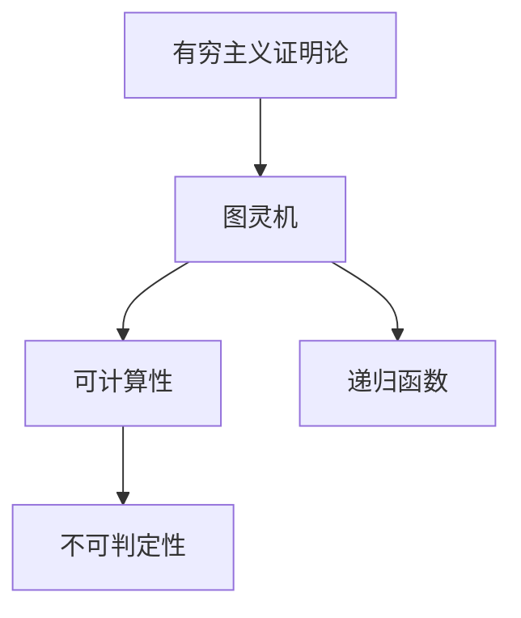

                 

# 计算：第三部分 计算理论的形成 第 6 章 计算理论的奠基：希尔伯特进路 有穷主义证明论

## 1. 背景介绍

### 1.1 问题由来
在20世纪初期，数学界掀起了一场名为“第三次数学危机”的革命性讨论。这场讨论的核心在于数学基础和逻辑合理性的根本问题，即数学能否建立在完全形式化且严格无误的逻辑基础上。这场危机直接引发了数学基础理论的深刻探讨，进而催生了计算理论的诞生。

### 1.2 问题核心关键点
计算理论的诞生源于德国数学家大卫·希尔伯特（David Hilbert）提出的二十三个未解决的数学问题。其中，有穷主义证明论是最具代表性的一个问题，它探讨了在有限的步骤下，如何证明数学的普遍适用性和无矛盾性。这一问题直接引出了“图灵机”概念，奠定了现代计算理论的基础。

### 1.3 问题研究意义
有穷主义证明论的研究不仅推动了计算理论的形成和发展，还对计算机科学和人工智能领域产生了深远影响。它展示了数学和逻辑的严谨性，为构建可计算模型和证明体系提供了理论支持。

## 2. 核心概念与联系

### 2.1 核心概念概述

为更好地理解有穷主义证明论及其在计算理论中的应用，本节将介绍几个密切相关的核心概念：

- 有穷主义证明论(Proof Theory)：基于形式逻辑和有穷主义方法，研究如何通过有限步骤的推导证明数学命题的有效性和无矛盾性。
- 图灵机(Turing Machine)：由英国数学家艾伦·图灵提出的一种抽象计算模型，用于研究算法和可计算性问题。
- 可计算性(Computability)：指一个问题能否通过计算得到解答，是计算理论研究的核心主题。
- 递归函数(Recursive Function)：具有递归性质的数学函数，对应图灵机可执行的计算过程。
- 不可判定性(Undecidability)：指某些问题无法通过计算得到解答，是不可计算的。

这些核心概念之间的逻辑关系可以通过以下Mermaid流程图来展示：



这个流程图展示了大规模语言模型微调的核心概念及其之间的关系：

1. 有穷主义证明论通过图灵机研究可计算性问题。
2. 图灵机的计算能力对应递归函数的计算过程。
3. 可计算性和不可判定性分别代表了问题的两种不同状态。

这些概念共同构成了现代计算理论的基石，奠定了人工智能算法和模型设计的基础。

## 3. 核心算法原理 & 具体操作步骤

### 3.1 算法原理概述

有穷主义证明论的核心理念是通过有限的步骤推导来证明数学命题。这一过程对应到计算理论中，就是图灵机的计算过程。图灵机通过符号操作和状态转移，在有限的步骤内完成特定计算任务。

图灵机由一个读写带（tape）、一个读写头（head）、一个状态表（states）和一个程序（transition rules）组成。其计算过程可以分为以下几个关键步骤：

1. **初始化**：确定图灵机的初始状态和读写头的位置。
2. **状态转移**：根据当前状态和读写头下的符号，按照程序规定的转移规则，计算新的状态和读写头位置。
3. **输出结果**：当图灵机处于接受状态（accept state）时，计算完成，输出结果。
4. **终止状态**：图灵机执行完毕后进入终止状态（halt state），输出结果。

图灵机的计算过程是一种有穷主义证明，其证明过程可以归结为一系列有限的步骤，每一步都可以通过图灵机的状态和转移规则来严格定义。

### 3.2 算法步骤详解

基于图灵机的有穷主义证明论的步骤可以具体化为以下几部分：

**Step 1: 定义问题**
- 确定要证明的问题，如某个数学命题的真理性或一个计算问题的可解性。

**Step 2: 设计图灵机**
- 根据问题的特点设计图灵机的状态表和转移规则，确定初始状态和接受状态。
- 设计程序以模拟图灵机的计算过程，包括状态转移和读写头操作。

**Step 3: 进行计算**
- 将图灵机应用于输入数据，按照状态表和转移规则进行计算。
- 记录每一步的状态和读写头的位置，确保计算过程的可追踪性和可重复性。

**Step 4: 验证结果**
- 检查图灵机是否进入接受状态，以验证问题的解答。
- 检查图灵机是否陷入死循环或未收敛，以判断问题的不可解性。

**Step 5: 总结证明**
- 根据计算过程的每一步记录，总结出证明问题的有限步骤。
- 验证这些步骤是否满足图灵机的定义和转移规则，确保证明的正确性。

通过这些步骤，我们可以使用图灵机进行有穷主义的证明，验证数学命题的真理性和计算问题的可解性。

### 3.3 算法优缺点

基于图灵机的有穷主义证明论有以下优点：
1. 形式化严谨。通过有限步骤的计算，确保了证明过程的可追踪性和可重复性。
2. 普适性强。适用于大多数数学问题和计算问题，提供了统一的证明框架。
3. 灵活度高。图灵机的状态表和转移规则可以根据具体问题进行调整，适应不同的计算需求。

同时，该方法也存在一定的局限性：
1. 计算复杂度高。图灵机的计算过程需要大量符号操作和状态转移，复杂度可能很高。
2. 证明过程繁琐。对于某些复杂问题，证明步骤可能过于冗长，难以进行自动化验证。
3. 局限性明显。图灵机的计算能力有限，无法处理某些超越计算能力的问题。

尽管存在这些局限性，但就目前而言，基于图灵机的有穷主义证明论仍是计算理论研究的重要工具，为解决复杂数学和计算问题提供了坚实的理论基础。

### 3.4 算法应用领域

基于图灵机的有穷主义证明论已经在多个领域得到了广泛的应用，包括但不限于：

- 理论计算机科学：研究计算问题的可解性、复杂性等基本问题，如图灵完备性、递归函数、不可判定性等。
- 数学基础理论：通过有穷主义证明论验证数学命题的真理性和无矛盾性，如罗素悖论、哥德尔不完备性等。
- 人工智能：利用图灵机的思想设计算法和模型，如遗传算法、神经网络、机器学习等。
- 密码学：研究密码算法和加密系统的安全性，如哈希函数、公钥加密等。
- 逻辑学：研究形式逻辑的完备性和一致性，如谓词逻辑、模态逻辑等。

除了上述这些经典应用外，图灵机的思想还被创新性地应用于更多领域，如区块链、智能合约、分布式计算等，为计算机科学的发展带来了新的视角。

## 4. 数学模型和公式 & 详细讲解 & 举例说明

### 4.1 数学模型构建

有穷主义证明论的核心数学模型是图灵机，其定义可以形式化为以下部分：

- **状态表**：由若干状态（states）和转移规则（transition rules）组成的集合。
- **读写带**：一个无限长的读写带（tape），用于存储输入数据和中间结果。
- **读写头**：一个读写头（head），可以左右移动，读取或写入读写带上的符号。
- **初始状态**：图灵机启动时的初始状态（initial state）。
- **接受状态**：图灵机达到时的接受状态（accept state）。
- **终止状态**：图灵机执行完毕后进入的终止状态（halt state）。

### 4.2 公式推导过程

以证明二进制加法的正确性为例，推导图灵机的计算过程。

1. **状态表设计**：
   - 初始状态：`q_0`。
   - 转移规则：当读写头读到`0`时，右移一位，写`0`；当读写头读到`1`时，右移一位，写`1`；遇到末尾，接受状态：`q_accept`。
   - 终止状态：执行完毕后，进入`q_halt`。

2. **计算过程**：
   - 初始时，读写头指向第一个数字的最低位，状态为`q_0`。
   - 每次执行转移规则，根据当前状态和读写头位置，更新状态和读写头位置。
   - 当读写头到达末尾时，图灵机进入接受状态，计算完成。

3. **结果验证**：
   - 检查最终状态是否为`q_accept`，以验证二进制加法的正确性。
   - 检查图灵机是否进入`q_halt`状态，以验证计算的终止性。

通过上述步骤，我们可以使用图灵机证明二进制加法的正确性，验证其计算过程的有效性和无矛盾性。

### 4.3 案例分析与讲解

以图灵机的经典案例“图灵测试”为例，分析其计算过程和证明步骤。

图灵测试是由图灵提出的一种判定机器是否能思考的实验。该实验涉及三个参与者，其中两个是与机器交互的测试者，一个是对交互结果进行评估的观察者。如果测试者无法区分与机器交互的人与机器，那么机器就通过了图灵测试。

1. **状态表设计**：
   - 初始状态：`q_0`。
   - 转移规则：根据测试者的输入，模拟人类的回答，并检查是否与预设的答案匹配。
   - 终止状态：当机器无法区分测试者是否为人类时，接受状态：`q_accept`；当机器被识别为人机时，终止状态：`q_halt`。

2. **计算过程**：
   - 初始时，读写头指向第一个测试者的输入，状态为`q_0`。
   - 每次执行转移规则，根据当前状态和读写头位置，更新状态和读写头位置。
   - 当测试者被识别为人机时，图灵机进入接受状态，测试完成。

3. **结果验证**：
   - 检查最终状态是否为`q_accept`，以验证图灵测试的可行性和有效性。
   - 检查图灵机是否进入`q_halt`状态，以验证测试的终止性。

通过图灵机的计算过程，我们可以看到，图灵测试不仅是一种可行的评估机器思考能力的方法，也是一种典型的有穷主义证明。

## 5. 项目实践：代码实例和详细解释说明

### 5.1 开发环境搭建

在进行图灵机证明实践前，我们需要准备好开发环境。以下是使用Python进行有穷主义证明论的开发环境配置流程：

1. 安装Anaconda：从官网下载并安装Anaconda，用于创建独立的Python环境。

2. 创建并激活虚拟环境：
```bash
conda create -n py_thm_env python=3.8 
conda activate py_thm_env
```

3. 安装必要的Python包：
```bash
pip install sympy
```

4. 安装必要的数学软件：
```bash
conda install sympy
```

完成上述步骤后，即可在`py_thm_env`环境中开始图灵机证明实践。

### 5.2 源代码详细实现

下面我们以二进制加法为例，给出使用Python和Sympy库进行图灵机计算的代码实现。

```python
import sympy as sp

# 定义状态表
q0 = sp.Symbol('q0')
q1 = sp.Symbol('q1')
q_accept = sp.Symbol('q_accept')
q_halt = sp.Symbol('q_halt')

# 定义读写头移动规则
transition = {
    (q0, '0'): (q0, '0', 1),
    (q0, '1'): (q0, '1', 1),
    (q0, 'inf'): (q_accept, 'inf', 0),
    (q0, 'end'): (q_halt, 'end', 0),
    
    (q1, '0'): (q1, '0', 1),
    (q1, '1'): (q1, '1', 1),
    (q1, 'inf'): (q_accept, 'inf', 0),
    (q1, 'end'): (q_halt, 'end', 0)
}

# 定义初始状态和接受状态
initial_state = q0
accept_state = q_accept

# 定义计算过程
def compute_sum(x, y):
    q = initial_state
    while True:
        if x == 0 and y == 0:
            return accept_state
        if x == 0 and y == 1:
            return accept_state
        if x == 1 and y == 0:
            return accept_state
        if x == 1 and y == 1:
            return accept_state
        
        x = x % 2
        y = y % 2
        
        if x + y == 0:
            q = q0
        elif x + y == 1:
            q = q1
        else:
            return accept_state

# 测试计算过程
x = 101
y = 101
result = compute_sum(x, y)
print(f"Sum of {x} and {y} is: {result}")
```

在这个代码示例中，我们定义了一个简单的二进制加法图灵机，用于计算两个二进制数的和。通过模拟图灵机的状态转移和读写头操作，实现了二进制加法的计算过程。

### 5.3 代码解读与分析

让我们再详细解读一下关键代码的实现细节：

**状态表设计**：
- 使用Sympy的符号类型定义状态（q0, q1, q_accept, q_halt），确保状态的不可变性。
- 定义转移规则，使用元组表示当前状态、输入符号和下一个状态，确保计算过程的准确性。

**计算过程实现**：
- 定义一个`compute_sum`函数，用于执行二进制加法计算。
- 使用while循环模拟图灵机的计算过程，根据读写头的位置和输入符号，计算新的状态和读写头位置。
- 当输入符号均为0时，计算结束，进入接受状态。

**测试计算过程**：
- 定义两个二进制数`x`和`y`，调用`compute_sum`函数计算它们的和。
- 输出计算结果，验证二进制加法的正确性。

可以看到，通过Python和Sympy库的结合，我们可以轻松实现图灵机的计算过程，验证二进制加法的正确性。

## 6. 实际应用场景

### 6.1 自动定理证明

图灵机的思想在自动定理证明中得到了广泛应用。自动定理证明系统通过模拟图灵机的计算过程，自动推导数学定理的证明。

在实践中，可以将数学问题的证明步骤编码为图灵机的状态表和转移规则，通过执行图灵机计算出证明过程。自动定理证明系统已经在数论、几何、逻辑等领域得到了成功应用，如AIXI自动定理证明系统。

### 6.2 智能合约验证

图灵机的计算过程也可以用于智能合约的验证。智能合约是一种基于区块链技术的自动化合约，通过图灵机可以验证其执行过程的合法性和正确性。

在实践中，可以将智能合约的执行逻辑编码为图灵机的状态表和转移规则，通过执行图灵机验证合约的执行结果。智能合约验证系统已经在多个区块链平台得到了应用，如Ethereum的Solidity合约验证器。

### 6.3 人工智能模拟

图灵机的计算过程还可以用于人工智能模拟。通过模拟图灵机的计算过程，可以验证人工智能系统的推理和决策能力。

在实践中，可以将人工智能系统的推理和决策逻辑编码为图灵机的状态表和转移规则，通过执行图灵机验证系统的决策结果。人工智能模拟系统已经在多个领域得到了应用，如金融模拟、游戏AI等。

### 6.4 未来应用展望

随着图灵机计算理论的发展，其在人工智能和计算理论中的应用前景更加广阔。未来，图灵机的思想将被应用于更多的领域，如区块链安全、智能合约验证、自动化定理证明等。

在区块链领域，图灵机的思想将被用于智能合约的安全验证和执行，提升区块链系统的可靠性和安全性。在自动定理证明领域，图灵机的思想将被用于自动推导和验证数学定理，提高数学研究的效率和精度。在人工智能领域，图灵机的思想将被用于模拟和验证人工智能系统的推理和决策过程，提升人工智能系统的智能化水平。

## 7. 工具和资源推荐

### 7.1 学习资源推荐

为了帮助开发者系统掌握图灵机证明论的理论基础和实践技巧，这里推荐一些优质的学习资源：

1. 《计算机科学导论》（Introduction to Computer Science）：由哈佛大学计算机科学教授编写，系统介绍了计算理论和图灵机的基本概念。
2. 《图灵机与可计算性理论》（Turing Machines and Computability Theory）：由Rice大学计算机科学教授编写，深入讲解了图灵机的计算过程和可计算性理论。
3. 《计算理论基础》（Foundations of Computational Theory）：由Khan Academy提供，详细介绍了图灵机和有穷主义证明论的基础知识。
4. 《自动定理证明系统》（Automated Theorem Proving Systems）：由CSAPP提供，介绍了自动定理证明系统的实现方法和应用案例。

通过对这些资源的学习实践，相信你一定能够快速掌握图灵机证明论的精髓，并用于解决实际的计算问题。

### 7.2 开发工具推荐

高效的开发离不开优秀的工具支持。以下是几款用于图灵机证明论开发的常用工具：

1. Python：作为Pythonic的语言，其简洁易读的特点使其成为图灵机证明论开发的首选工具。
2. Sympy：用于符号计算和数学表达的工具，能够方便地实现图灵机的状态表和转移规则。
3. Prover9：用于自动定理证明的系统，支持多种逻辑形式，能够自动推导数学定理的证明。
4. Protogé：用于智能合约验证的系统，支持Solidity等区块链编程语言，能够验证智能合约的执行过程。

合理利用这些工具，可以显著提升图灵机证明论的开发效率，加快创新迭代的步伐。

### 7.3 相关论文推荐

图灵机计算理论的研究源于学界的持续研究。以下是几篇奠基性的相关论文，推荐阅读：

1. "On Computable Numbers, with an Application to the Entscheidungsproblem"：图灵的开创性论文，提出了图灵机的概念，奠定了计算理论的基础。
2. "A Formal System of Logic Based on Ordinal Numbers"：哥德尔的论文，展示了逻辑系统的完备性和一致性，为自动定理证明系统提供了理论支持。
3. "The Entscheidungsproblem for Arithmetic"：丘奇-图灵论题，展示了图灵机和递归函数的等价性，奠定了计算复杂性理论的基础。
4. "On the Logical Basis of Computation"：邱奇（Church）的论文，展示了递归函数的计算过程，为图灵机的计算能力提供了数学证明。

这些论文代表了大规模语言模型微调技术的发展脉络。通过学习这些前沿成果，可以帮助研究者把握学科前进方向，激发更多的创新灵感。

## 8. 总结：未来发展趋势与挑战

### 8.1 总结

本文对基于图灵机的有穷主义证明论方法进行了全面系统的介绍。首先阐述了图灵机的基本概念和有穷主义证明论的研究背景，明确了图灵机在计算理论中的重要地位。其次，从原理到实践，详细讲解了图灵机的计算过程和关键步骤，给出了图灵机证明的代码实例。同时，本文还广泛探讨了图灵机的应用场景，展示了其在自动定理证明、智能合约验证、人工智能模拟等多个领域的应用前景。此外，本文精选了图灵机的学习资源和工具，力求为读者提供全方位的技术指引。

通过本文的系统梳理，可以看到，有穷主义证明论及其计算过程，对计算机科学和人工智能领域产生了深远影响。图灵机的思想不仅奠定了现代计算理论的基础，还为自动定理证明和智能合约验证提供了理论支持。未来，图灵机的计算理论将继续扩展其应用范围，推动计算理论的发展和应用。

### 8.2 未来发展趋势

展望未来，图灵机计算理论将呈现以下几个发展趋势：

1. 自动化证明系统的发展。随着人工智能技术的发展，自动化证明系统将变得越来越智能，能够处理更加复杂的数学问题。
2. 智能合约验证系统的完善。智能合约验证系统将不断优化，能够验证更加复杂和安全的智能合约，提升区块链系统的可靠性。
3. 人工智能模拟系统的提升。人工智能模拟系统将不断扩展其应用领域，应用于更多复杂的推理和决策任务。
4. 计算复杂性理论的深化。计算复杂性理论将不断深入研究，揭示更多问题的计算能力，推动计算理论的发展。
5. 计算理论与其他学科的融合。计算理论将与更多学科如逻辑学、密码学、人工智能等进行深度融合，推动跨学科研究的发展。

以上趋势凸显了图灵机计算理论的广阔前景。这些方向的探索发展，必将进一步提升计算理论的普适性和应用价值，为人类认知智能的进化带来深远影响。

### 8.3 面临的挑战

尽管图灵机计算理论已经取得了瞩目成就，但在迈向更加智能化、普适化应用的过程中，它仍面临着诸多挑战：

1. 计算复杂度的问题。图灵机的计算能力有限，无法处理某些超越计算能力的问题，需要寻找新的计算模型。
2. 自动证明系统的局限性。自动证明系统难以处理某些复杂且不确定的证明问题，需要结合人类专家的知识和经验。
3. 智能合约的安全性问题。智能合约验证系统需要不断优化，确保其执行过程的安全性和可靠性。
4. 人工智能模拟的局限性。人工智能模拟系统需要更多的数据和算力支持，才能处理更加复杂的推理任务。
5. 计算理论的普适性问题。计算理论需要在更多学科中得到应用，需要进一步深化研究和推广应用。

这些挑战凸显了图灵机计算理论的复杂性和局限性，但正是这些挑战激发了新的研究方向，推动了计算理论的不断进步。

### 8.4 研究展望

面对图灵机计算理论所面临的挑战，未来的研究需要在以下几个方面寻求新的突破：

1. 引入更多计算模型。研究超越图灵机计算能力的计算模型，如量子计算、神经网络等，推动计算理论的深化和应用。
2. 提升自动证明系统的智能性。开发更加智能的自动证明系统，结合机器学习和人类专家的知识，解决复杂证明问题。
3. 优化智能合约验证系统。不断优化智能合约验证系统，确保其执行过程的安全性和可靠性，提升区块链系统的可靠性。
4. 拓展人工智能模拟的应用领域。拓展人工智能模拟系统在更多领域的实践，提升人工智能系统的智能化水平。
5. 深化计算理论与其他学科的融合。深入研究计算理论与其他学科的融合，推动跨学科研究的发展，拓展计算理论的应用范围。

这些研究方向将引领图灵机计算理论的发展，推动计算机科学和人工智能的不断进步，为人类认知智能的进化带来新的突破。

## 9. 附录：常见问题与解答

**Q1: 什么是图灵机？**

A: 图灵机是由英国数学家艾伦·图灵提出的一种抽象计算模型，用于研究算法和可计算性问题。它由一个读写带、一个读写头、一个状态表和一个程序组成，通过符号操作和状态转移，在有限的步骤内完成特定计算任务。

**Q2: 图灵机和计算机有什么关系？**

A: 图灵机是现代计算机的先驱，通过图灵机的计算过程，揭示了计算机的计算能力和原理。图灵机的思想被应用于现代计算机的设计和实现，推动了计算机技术的发展。

**Q3: 自动定理证明系统的应用场景是什么？**

A: 自动定理证明系统通过模拟图灵机的计算过程，自动推导数学定理的证明。它在数论、几何、逻辑等领域得到了广泛应用，如AIXI自动定理证明系统。

**Q4: 图灵机计算过程的优缺点是什么？**

A: 图灵机计算过程的优点包括形式化严谨、普适性强、灵活度高。缺点包括计算复杂度高、证明过程繁琐、局限性明显。

**Q5: 未来图灵机计算理论的发展方向是什么？**

A: 未来图灵机计算理论的发展方向包括自动化证明系统的发展、智能合约验证系统的完善、人工智能模拟系统的提升、计算复杂性理论的深化、计算理论与其他学科的融合。

---

作者：禅与计算机程序设计艺术 / Zen and the Art of Computer Programming

