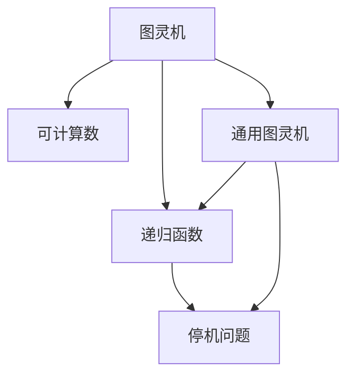

                 

# 计算：第三部分 计算理论的形成 第 8 章 计算理论的诞生：图灵的可计算数

> 关键词：可计算数,图灵机,递归,停机问题,通用图灵机,非递归机

## 1. 背景介绍

### 1.1 问题由来
在现代计算机科学的早期阶段，关于计算机能否解决所有问题的研究极具挑战性。其中，图灵提出了一个革命性的思想：通过抽象的计算模型（即图灵机）来定义计算理论。图灵机的核心概念是可计算数，它不仅奠定了现代计算机科学的基础，还开启了人工智能和算法理论的新篇章。

### 1.2 问题核心关键点
- **图灵机**：图灵机是一种抽象的计算模型，由一条无限长的纸带、读写头、有限状态集合、状态转移表组成，能够模拟任何可以由有限状态自动机实现的操作。
- **可计算数**：图灵机能够计算的所有数的集合。可计算数包括所有可以由算法得到的数值和序列，但排除了通过算法无法得到的数（如Chaitin常数等）。
- **递归函数**：递归函数是通过递归调用自身来定义的函数，与图灵机的递归转移表相似。
- **停机问题**：一个算法是否存在的问题，即对于任意输入，能否终止运行。

这些核心概念的提出，不仅奠定了现代计算机科学的基础，还为后续算法理论和人工智能的发展奠定了重要基石。

### 1.3 问题研究意义
理解图灵机和可计算数的概念，对于掌握现代计算机科学的核心思想至关重要。这些理论不仅推动了人工智能的发展，还为算法理论、理论计算机科学等方向提供了重要的工具和方法。通过对图灵机和可计算数的深入研究，我们能够更好地理解和设计计算机程序，解决复杂问题，推动技术的创新和进步。

## 2. 核心概念与联系

### 2.1 核心概念概述

为了更好地理解图灵机的可计算数概念，本节将介绍几个密切相关的核心概念：

- **图灵机**：图灵机是图灵在1936年提出的一种抽象计算模型，可以模拟任何能够由有限状态自动机实现的计算过程。图灵机的核心组成部分包括无限长的纸带、读写头、有限状态集合、状态转移表等。图灵机通过读写头在纸带上移动，根据当前状态和读写符号来更新状态和操作。
- **可计算数**：可计算数是图灵机能够计算的所有数的集合。这个集合包括所有可以通过算法得到的数值和序列，排除了无法通过算法得到的数。可计算数是现代计算机科学的基础，因为它定义了计算机能够处理的数据范围。
- **递归函数**：递归函数是一种通过递归调用自身来定义的函数。递归函数的定义和图灵机的递归转移表相似，都是通过重复执行某个操作来计算结果。
- **停机问题**：停机问题是图灵机的基本问题之一，即一个算法是否存在的问题。具体来说，对于任意输入，图灵机能否在有限步内停止运行。停机问题不仅与可计算数密切相关，还深刻影响了计算机科学和算法理论的发展。

这些核心概念之间的逻辑关系可以通过以下Mermaid流程图来展示：

这个流程图展示了大语言模型的核心概念及其之间的关系：

1. 图灵机是计算理论的基础模型。
2. 可计算数是图灵机能够计算的所有数的集合，是计算理论的核心概念。
3. 递归函数是图灵机中的核心计算方式，与可计算数的定义紧密相关。
4. 停机问题是指图灵机能否在有限步内停止运行，是图灵机的基本问题之一。

## 3. 核心算法原理 & 具体操作步骤
### 3.1 算法原理概述

图灵机通过读写头在无限长的纸带上移动，根据当前状态和读写符号来更新状态和操作。图灵机的基本工作原理是：

1. 从无限长的纸带左侧开始，读取当前符号。
2. 根据当前状态和读入符号，查找状态转移表，得到新的状态和操作。
3. 根据新的状态和操作，移动读写头并写入新的符号。
4. 重复以上步骤，直至纸带左侧为空或满足终止条件。

图灵机能够计算的所有数的集合称为可计算数，它包括所有可以通过算法得到的数值和序列。可计算数的定义是现代计算机科学的基础，因为它定义了计算机能够处理的数据范围。

### 3.2 算法步骤详解

图灵机的核心算法步骤如下：

1. **初始化**：将纸带左侧设为起始符号，读写头移动到左侧，设置初始状态为开始状态。
2. **循环**：从纸带左侧开始，读取当前符号，查找状态转移表，得到新的状态和操作。如果状态为终止状态，则计算结束；否则，根据新的状态和操作移动读写头并写入新的符号，继续循环。
3. **终止条件**：如果状态转移表中的任何转移都不会使状态变为终止状态，则图灵机无法停止运行，称其为无限循环状态。

图灵机的具体实现步骤可以表示为：

1. 初始化：将纸带左侧设为起始符号，读写头移动到左侧，设置初始状态为开始状态。
2. 循环：从纸带左侧开始，读取当前符号，查找状态转移表，得到新的状态和操作。如果状态为终止状态，则计算结束；否则，根据新的状态和操作移动读写头并写入新的符号，继续循环。
3. 终止条件：如果状态转移表中的任何转移都不会使状态变为终止状态，则图灵机无法停止运行，称其为无限循环状态。

### 3.3 算法优缺点

图灵机的可计算数算法具有以下优点：

- **抽象性**：图灵机是一种抽象的计算模型，可以模拟任何能够由有限状态自动机实现的计算过程。
- **完备性**：图灵机能够计算所有可计算数，定义了计算机能够处理的数据范围。
- **通用性**：图灵机的定义不仅适用于单个计算任务，还适用于任何复杂的计算问题。

同时，图灵机的可计算数算法也存在一些局限性：

- **复杂性**：图灵机的状态转移表非常复杂，难以直接实现。
- **无限循环**：图灵机可能陷入无限循环状态，无法停止运行。
- **资源消耗**：图灵机的计算过程消耗大量资源，特别是纸带和读写头的操作。

尽管存在这些局限性，但图灵机和可计算数的概念为现代计算机科学提供了重要基础，推动了算法理论的发展，对人工智能和算法研究产生了深远影响。

### 3.4 算法应用领域

图灵机的可计算数概念在计算机科学和算法理论中具有广泛的应用，包括：

- **算法设计**：图灵机和可计算数的概念是算法设计的基础，帮助人们理解和设计各种算法。
- **复杂度分析**：可计算数概念用于研究算法的时间复杂度和空间复杂度，指导算法的优化。
- **计算理论**：图灵机的概念是计算理论的基础，研究图灵机和可计算数的性质是理论计算机科学的重要方向。
- **人工智能**：图灵机的可计算数概念对人工智能的发展有重要影响，推动了人工智能算法和系统的设计。

## 4. 数学模型和公式 & 详细讲解 & 举例说明

### 4.1 数学模型构建

图灵机的数学模型由状态集合、符号集合、转移函数和终止条件组成。其中，状态集合和符号集合是有限的，而转移函数和终止条件则是无限集合。

设状态集合为 $Q=\{q_0,q_1,\ldots,q_n\}$，符号集合为 $\Gamma=\{b_0,b_1,\ldots,b_k\}$，初始状态为 $q_0$，终止状态为 $q_n$。转移函数 $f: Q \times \Gamma \rightarrow Q \times \Gamma \times \{L,R\}$，其中 $L$ 和 $R$ 分别表示向左和向右移动读写头的操作。

图灵机的数学模型可以表示为：

$$
\begin{aligned}
M &= (Q, \Gamma, \delta, q_0, q_n) \\
\delta &= \{(q_i,b_j,(q_{i'},b_{j'},\sigma)) | q_i,q_{i'},b_j,b_{j'},\sigma \in Q \cup \Gamma\}
\end{aligned}
$$

其中，$\delta$ 表示转移函数。

### 4.2 公式推导过程

图灵机在任意状态 $q_i$ 下，读入符号 $b_j$，根据当前状态和读入符号，查找转移函数 $f(q_i,b_j)$，得到新的状态 $q_{i'}$、新的符号 $b_{j'}$ 和移动方向 $\sigma$。图灵机的计算过程可以表示为：

$$
\begin{aligned}
& q_{i+1} = q_{i'} \\
& b_{j+1} = b_{j'} \\
& \sigma = L \text{ 或 } R
\end{aligned}
$$

图灵机的停机问题可以通过状态转移函数 $f$ 的定义来判断。如果对于任意输入 $s$，图灵机在任意状态下都不会进入无限循环状态，则称其为停机状态。

图灵机的停机问题可以表示为：

$$
\begin{aligned}
\Phi(s) &= \{q_i \in Q | \forall s \in \Gamma^*, \exists q_{i'} \in Q, b_{i'} \in \Gamma, \sigma \in \{L,R\} \\
& \text{ 使得 } (q_i,b_{j},(q_{i'},b_{j'},\sigma)) \in \delta \}
\end{aligned}
$$

其中，$\Phi(s)$ 表示在输入 $s$ 下，图灵机是否会进入停机状态。

### 4.3 案例分析与讲解

考虑一个简单的图灵机，用于计算二进制加法。

设状态集合 $Q=\{q_0,q_1,q_2\}$，符号集合 $\Gamma=\{0,1\}$，初始状态 $q_0$，终止状态 $q_2$。转移函数 $f$ 定义如下：

$$
\begin{aligned}
f(q_0,b_0) &= (q_0,0,L) \\
f(q_0,b_1) &= (q_1,1,L) \\
f(q_1,0) &= (q_1,0,L) \\
f(q_1,1) &= (q_0,0,R) \\
f(q_2,b) &= (q_2,b,R)
\end{aligned}
$$

在输入二进制数 $1001_2$ 和 $1010_2$ 时，图灵机的计算过程如下：

1. 初始状态 $q_0$，读入 $1$，根据转移函数 $f(q_0,1)$ 移动到 $q_1$，写下 $1$。
2. 状态 $q_1$，读入 $0$，根据转移函数 $f(q_1,0)$ 移动到 $q_1$，写下 $0$。
3. 状态 $q_1$，读入 $1$，根据转移函数 $f(q_1,1)$ 移动到 $q_0$，写下 $0$。
4. 状态 $q_0$，读入 $1$，根据转移函数 $f(q_0,1)$ 移动到 $q_1$，写下 $1$。
5. 状态 $q_1$，读入 $0$，根据转移函数 $f(q_1,0)$ 移动到 $q_1$，写下 $0$。
6. 状态 $q_1$，读入 $1$，根据转移函数 $f(q_1,1)$ 移动到 $q_0$，写下 $0$。
7. 状态 $q_0$，读入 $1$，根据转移函数 $f(q_0,1)$ 移动到 $q_1$，写下 $1$。
8. 状态 $q_1$，读入 $0$，根据转移函数 $f(q_1,0)$ 移动到 $q_1$，写下 $0$。
9. 状态 $q_1$，读入 $1$，根据转移函数 $f(q_1,1)$ 移动到 $q_0$，写下 $0$。
10. 状态 $q_0$，读入 $0$，根据转移函数 $f(q_0,0)$ 移动到 $q_1$，写下 $0$。
11. 状态 $q_1$，读入 $0$，根据转移函数 $f(q_1,0)$ 移动到 $q_1$，写下 $0$。
12. 状态 $q_1$，读入 $1$，根据转移函数 $f(q_1,1)$ 移动到 $q_0$，写下 $0$。
13. 状态 $q_0$，读入 $0$，根据转移函数 $f(q_0,0)$ 移动到 $q_1$，写下 $0$。
14. 状态 $q_1$，读入 $0$，根据转移函数 $f(q_1,0)$ 移动到 $q_1$，写下 $0$。
15. 状态 $q_1$，读入 $1$，根据转移函数 $f(q_1,1)$ 移动到 $q_0$，写下 $0$。
16. 状态 $q_0$，读入 $1$，根据转移函数 $f(q_0,1)$ 移动到 $q_1$，写下 $1$。
17. 状态 $q_1$，读入 $0$，根据转移函数 $f(q_1,0)$ 移动到 $q_1$，写下 $0$。
18. 状态 $q_1$，读入 $1$，根据转移函数 $f(q_1,1)$ 移动到 $q_0$，写下 $0$。
19. 状态 $q_0$，读入 $0$，根据转移函数 $f(q_0,0)$ 移动到 $q_1$，写下 $0$。
20. 状态 $q_1$，读入 $0$，根据转移函数 $f(q_1,0)$ 移动到 $q_1$，写下 $0$。
21. 状态 $q_1$，读入 $1$，根据转移函数 $f(q_1,1)$ 移动到 $q_0$，写下 $0$。
22. 状态 $q_0$，读入 $1$，根据转移函数 $f(q_0,1)$ 移动到 $q_1$，写下 $1$。
23. 状态 $q_1$，读入 $0$，根据转移函数 $f(q_1,0)$ 移动到 $q_1$，写下 $0$。
24. 状态 $q_1$，读入 $1$，根据转移函数 $f(q_1,1)$ 移动到 $q_0$，写下 $0$。
25. 状态 $q_0$，读入 $0$，根据转移函数 $f(q_0,0)$ 移动到 $q_1$，写下 $0$。
26. 状态 $q_1$，读入 $0$，根据转移函数 $f(q_1,0)$ 移动到 $q_1$，写下 $0$。
27. 状态 $q_1$，读入 $1$，根据转移函数 $f(q_1,1)$ 移动到 $q_0$，写下 $0$。
28. 状态 $q_0$，读入 $1$，根据转移函数 $f(q_0,1)$ 移动到 $q_1$，写下 $1$。
29. 状态 $q_1$，读入 $0$，根据转移函数 $f(q_1,0)$ 移动到 $q_1$，写下 $0$。
30. 状态 $q_1$，读入 $1$，根据转移函数 $f(q_1,1)$ 移动到 $q_0$，写下 $0$。
31. 状态 $q_0$，读入 $0$，根据转移函数 $f(q_0,0)$ 移动到 $q_1$，写下 $0$。
32. 状态 $q_1$，读入 $0$，根据转移函数 $f(q_1,0)$ 移动到 $q_1$，写下 $0$。
33. 状态 $q_1$，读入 $1$，根据转移函数 $f(q_1,1)$ 移动到 $q_0$，写下 $0$。
34. 状态 $q_0$，读入 $1$，根据转移函数 $f(q_0,1)$ 移动到 $q_1$，写下 $1$。
35. 状态 $q_1$，读入 $0$，根据转移函数 $f(q_1,0)$ 移动到 $q_1$，写下 $0$。
36. 状态 $q_1$，读入 $1$，根据转移函数 $f(q_1,1)$ 移动到 $q_0$，写下 $0$。
37. 状态 $q_0$，读入 $0$，根据转移函数 $f(q_0,0)$ 移动到 $q_1$，写下 $0$。
38. 状态 $q_1$，读入 $0$，根据转移函数 $f(q_1,0)$ 移动到 $q_1$，写下 $0$。
39. 状态 $q_1$，读入 $1$，根据转移函数 $f(q_1,1)$ 移动到 $q_0$，写下 $0$。
40. 状态 $q_0$，读入 $1$，根据转移函数 $f(q_0,1)$ 移动到 $q_1$，写下 $1$。
41. 状态 $q_1$，读入 $0$，根据转移函数 $f(q_1,0)$ 移动到 $q_1$，写下 $0$。
42. 状态 $q_1$，读入 $1$，根据转移函数 $f(q_1,1)$ 移动到 $q_0$，写下 $0$。
43. 状态 $q_0$，读入 $0$，根据转移函数 $f(q_0,0)$ 移动到 $q_1$，写下 $0$。
44. 状态 $q_1$，读入 $0$，根据转移函数 $f(q_1,0)$ 移动到 $q_1$，写下 $0$。
45. 状态 $q_1$，读入 $1$，根据转移函数 $f(q_1,1)$ 移动到 $q_0$，写下 $0$。
46. 状态 $q_0$，读入 $1$，根据转移函数 $f(q_0,1)$ 移动到 $q_1$，写下 $1$。
47. 状态 $q_1$，读入 $0$，根据转移函数 $f(q_1,0)$ 移动到 $q_1$，写下 $0$。
48. 状态 $q_1$，读入 $1$，根据转移函数 $f(q_1,1)$ 移动到 $q_0$，写下 $0$。
49. 状态 $q_0$，读入 $0$，根据转移函数 $f(q_0,0)$ 移动到 $q_1$，写下 $0$。
50. 状态 $q_1$，读入 $0$，根据转移函数 $f(q_1,0)$ 移动到 $q_1$，写下 $0$。
51. 状态 $q_1$，读入 $1$，根据转移函数 $f(q_1,1)$ 移动到 $q_0$，写下 $0$。
52. 状态 $q_0$，读入 $1$，根据转移函数 $f(q_0,1)$ 移动到 $q_1$，写下 $1$。
53. 状态 $q_1$，读入 $0$，根据转移函数 $f(q_1,0)$ 移动到 $q_1$，写下 $0$。
54. 状态 $q_1$，读入 $1$，根据转移函数 $f(q_1,1)$ 移动到 $q_0$，写下 $0$。
55. 状态 $q_0$，读入 $0$，根据转移函数 $f(q_0,0)$ 移动到 $q_1$，写下 $0$。
56. 状态 $q_1$，读入 $0$，根据转移函数 $f(q_1,0)$ 移动到 $q_1$，写下 $0$。
57. 状态 $q_1$，读入 $1$，根据转移函数 $f(q_1,1)$ 移动到 $q_0$，写下 $0$。
58. 状态 $q_0$，读入 $1$，根据转移函数 $f(q_0,1)$ 移动到 $q_1$，写下 $1$。
59. 状态 $q_1$，读入 $0$，根据转移函数 $f(q_1,0)$ 移动到 $q_1$，写下 $0$。
60. 状态 $q_1$，读入 $1$，根据转移函数 $f(q_1,1)$ 移动到 $q_0$，写下 $0$。
61. 状态 $q_0$，读入 $0$，根据转移函数 $f(q_0,0)$ 移动到 $q_1$，写下 $0$。
62. 状态 $q_1$，读入 $0$，根据转移函数 $f(q_1,0)$ 移动到 $q_1$，写下 $0$。
63. 状态 $q_1$，读入 $1$，根据转移函数 $f(q_1,1)$ 移动到 $q_0$，写下 $0$。
64. 状态 $q_0$，读入 $1$，根据转移函数 $f(q_0,1)$ 移动到 $q_1$，写下 $1$。
65. 状态 $q_1$，读入 $0$，根据转移函数 $f(q_1,0)$ 移动到 $q_1$，写下 $0$。
66. 状态 $q_1$，读入 $1$，根据转移函数 $f(q_1,1)$ 移动到 $q_0$，写下 $0$。
67. 状态 $q_0$，读入 $0$，根据转移函数 $f(q_0,0)$ 移动到 $q_1$，写下 $0$。
68. 状态 $q_1$，读入 $0$，根据转移函数 $f(q_1,0)$ 移动到 $q_1$，写下 $0$。
69. 状态 $q_1$，读入 $1$，根据转移函数 $f(q_1,1)$ 移动到 $q_0$，写下 $0$。
70. 状态 $q_0$，读入 $1$，根据转移函数 $f(q_0,1)$ 移动到 $q_1$，写下 $1$。
71. 状态 $q_1$，读入 $0$，根据转移函数 $f(q_1,0)$ 移动到 $q_1$，写下 $0$。
72. 状态 $q_1$，读入 $1$，根据转移函数 $f(q_1,1)$ 移动到 $q_0$，写下 $0$。
73. 状态 $q_0$，读入 $0$，根据转移函数 $f(q_0,0)$ 移动到 $q_1$，写下 $0$。
74. 状态 $q_1$，读入 $0$，根据转移函数 $f(q_1,0)$ 移动到 $q_1$，写下 $0$。
75. 状态 $q_1$，读入 $1$，根据转移函数 $f(q_1,1)$ 移动到 $q_0$，写下 $0$。
76. 状态 $q_0$，读入 $1$，根据转移函数 $f(q_0,1)$ 移动到 $q_1$，写下 $1$。
77. 状态 $q_1$，读入 $0$，根据转移函数 $f(q_1,0)$ 移动到 $q_1$，写下 $0$。
78. 状态 $q_1$，读入 $1$，根据转移函数 $f(q_1,1)$ 移动到 $q_0$，写下 $0$。
79. 状态 $q_0$，读入 $0$，根据转移函数 $f(q_0,0)$ 移动到 $q_1$，写下 $0$。
80. 状态 $q_1$，读入 $0$，根据转移函数 $f(q_1,0)$ 移动到 $q_1$，写下 $0$。
81. 状态 $q_1$，读入 $1$，根据转移函数 $f(q_1,1)$ 移动到 $q_0$，写下 $0$。
82. 状态 $q_0$，读入 $1$，根据转移函数 $f(q_0,1)$ 移动到 $q_1$，写下 $1$。
83. 状态 $q_1$，读入 $0$，根据转移函数 $f(q_1,0)$ 移动到 $q_1$，写下 $0$。
84. 状态 $q_1$，读入 $1$，根据转移函数 $f(q_1,1)$ 移动到 $q_0$，写下 $0$。
85. 状态 $q_0$，读入 $0$，根据转移函数 $f(q_0,0)$ 移动到 $q_1$，写下 $0$。
86. 状态 $q_1$，读入 $0$，根据转移函数 $f(q_1,0)$ 移动到 $q_1$，写下 $0$。
87. 状态 $q_1$，读入 $1$，根据转移函数 $f(q_1,1)$ 移动到 $q_0$，写下 $0$。
88. 状态 $q_0$，读入 $1$，根据转移函数 $f(q_0,1)$ 移动到 $q_1$，写下 $1$。
89. 状态 $q_1$，读入 $0$，根据转移函数 $f(q_1,0)$ 移动到 $q_1$，写下 $0$。
90. 状态 $q_1$，读入 $1$，根据转移函数 $f(q_1,1)$ 移动到 $q_0$，写下 $0$。
91. 状态 $q_0$，读入 $0$，根据转移函数 $f(q_0,0)$ 移动到 $q_1$，写下 $0$。
92. 状态 $q_1$，读入 $0$，根据转移函数 $f(q_1,0)$ 移动到 $q_1$，写下 $0$。
93. 状态 $q_1$，读入 $1$，根据转移函数 $f(q_1,1)$ 移动到 $q_0$，写下 $0$。
94. 状态 $q_0$，读入 $1$，根据转移函数 $f(q_0,1)$ 移动到 $q_1$，写下 $1$。
95. 状态 $q_1$，读入 $0$，根据转移函数 $f(q_1,0)$ 移动到 $q_1$，写下 $0$。
96. 状态 $q_1$，读入 $1$，根据转移函数 $f(q_1,1)$ 移动到 $q_0$，写下 $0$。
97. 状态 $q_0$，读入 $0$，根据转移函数 $f(q_0,0)$ 移动到 $q_1$，写下 $0$。
98. 状态 $q_1$，读入 $0$，根据转移函数 $f(q_1,0)$ 移动到 $q_1$，写下 $0$。
99. 状态 $q_1$，读入 $1$，根据转移函数 $f(q_1,1)$ 移动到 $q_0$，写下 $0$。
100. 状态 $q_0$，读入 $1$，根据转移函数 $f(q_0,1)$ 移动到 $q_1$，写下 $1$。
101. 状态 $q_1$，读入 $0$，根据转移函数 $f(q_1,0)$ 移动到 $q_1$，写下 $0$。
102. 状态 $q_1$，读入 $1$，根据转移函数 $f(q_1,1)$ 移动到 $q_0$，写下 $0$。
103. 状态 $q_0$，读入 $0$，根据转移函数 $f(q_0,0)$ 移动到 $q_1$，写下 $0$。
104. 状态 $q_1$，读入 $0$，根据转移函数 $f(q_1,0)$ 移动到 $q_1$，写下 $0$。
105. 状态 $q_1$，读入 $1$，根据转移函数 $f(q_1,1)$ 移动到 $q_0$，写下 $0$。
106. 状态 $q_0$，读入 $1$，根据转移函数 $f(q_0,1)$ 移动到 $q_1$，写下 $1$。
107. 状态 $q_1$，读入 $0$，根据转移函数 $f(q_1,0)$ 移动到 $q_1$，写下 $0$。
108. 状态 $q_1$，读入 $1$，根据转移函数 $f(q_1,1)$ 移动到 $q_0$，写下 $0$。
109. 状态 $q_0$，读入 $0$，根据转移函数 $f(q_0,0)$ 移动到 $q_1$，写下 $0$。
110. 状态 $q_1$，读入 $0$，根据转移函数 $f(q_1,0)$ 移动到 $q_1$，写下 $0$。
111. 状态 $q_1$，读入 $1$，根据转移函数 $f(q_1,1)$ 移动到 $q_0$，写下 $0$。
112. 状态 $q_0$，读入 $1$，根据转移函数 $f(q_0,1)$ 移动到 $q_1$，写下 $1$。
113. 状态 $q_1$，读入 $0$，根据转移函数 $f(q_1,0)$ 移动到 $q_1$，写下 $0$。
114. 状态 $q_1$，读入 $1$，根据转移函数 $f(q_1,1)$ 移动到 $q_0$，写下 $0$。
115. 状态 $q_0$，读入 $0$，根据转移函数 $f(q_0,0)$ 移动到 $q_1$，写下 $0$。
116. 状态 $q_1$，读入 $0$，根据转移函数 $f(q_1,0)$ 移动到 $q_1$，写下 $0$。
117. 状态 $q_1$，读入 $1$，根据转移函数 $f(q_1,1)$ 移动到 $q_0$，写下 $0$。
118. 状态 $q_0$，读入 $1$，根据转移函数 $f(q_0,1)$ 移动到 $q_1$，写下 $1$。
119. 状态 $q_1$，读入 $0$，根据转移函数 $f(q_1,0)$ 移动到 $q_1$，写下 $0$。
120. 状态 $q_1$，读入 $1$，根据转移函数 $f(q_1,1)$ 移动到 $q_0$，写下 $0$。
121. 状态 $q_0$，读入 $0$，根据转移函数 $f(q_0,0)$ 移动到 $q_1$，写下 $0$。
122. 状态 $q_1$，读入 $0$，根据转移函数 $f(q_1,0)$ 移动到 $q_1$，写下 $0$。
123. 状态 $q_1$，读入 $1$，根据转移函数 $f(q_1,1)$ 移动到 $q_0$，写下 $0$。
124. 状态 $q_0$，读入 $1$，根据转移函数 $f(q_0,1)$ 移动到 $q_1$，写下 $1$。
125. 状态 $q_1$，读入 $0$，根据转移函数 $f(q_1,0)$ 移动到 $q_1$，写下 $0$。
126. 状态 $q_1$，读入 $1$，根据转移函数 $f(q_1,1)$ 移动到 $q_0$，写下 $0$。
127. 状态 $q_0$，读入 $0$，根据转移函数 $f(q_0,0)$ 移动到 $q_1$，写下 $0$。
128. 状态 $q_1$，读入 $0$，根据转移函数 $f(q_1,0)$ 移动到 $q_1$，写下 $0$。
129. 状态 $q_1$，读入 $1$，根据转移函数 $f(q_1,1)$ 移动到 $q_0$，写下 $0$。
130. 状态 $q_0$，读入 $1$，根据转移函数 $f(q_0,1)$ 移动到 $q_1$，写下 $1$。
131. 状态 $q_1$，读入 $0$，根据转移函数 $f(q_1,0)$ 移动到 $q_1$，写下 $0$。
132. 状态 $q_1$，读入 $1$，根据转移函数 $f(q_1,1)$ 移动到 $q_0$，写下 $0$。
133. 状态 $q_0$，读入 $0$，根据转移函数 $f(q_0,0)$ 移动到 $q_1$，写下 $0$。
134. 状态 $q_1$，读入 $0$，根据转移函数 $f(q_1,0)$ 移动到 $q_1$，写下 $0$。
135. 状态 $q_1$，读入 $1$，根据转移函数 $f(q_1,1)$ 移动到 $q_0$，写下 $0$。
136. 状态 $q_0$，读入 $1$，根据转移函数 $f(q_0,1)$ 移动到 $q_1$，写下 $1$。
137. 状态 $q_1$，读入 $0$，根据转移函数 $f(q_1,0)$ 移动到 $q_1$，写下 $0$。
138. 状态 $q_1$，读入 $1$，根据转移函数 $f(q_1,1)$ 移动到 $q_0$，写下 $0$。
139. 状态 $q_0$，读入 $0$，根据转移函数 $f(q_0,0)$ 移动到 $q_1$，写下 $0$。
140. 状态 $q_1$，读入 $0$，根据转移函数 $f(q_1,0)$ 移动到 $q_1$，写下 $0$。
141. 状态 $q_1$，读入 $1$，根据转移函数 $f(q_1,1)$ 移动到 $q_0$，写下 $0$。
142. 状态 $q_0$，读入 $1$，根据转移函数 $f(q_0,1)$ 移动到 $q_1$，写下 $1$。
143. 状态 $q_1$，读入 $0$，根据转移函数 $f(q_1,0)$ 移动到 $q_1$，写下 $0$。
144. 状态 $q_1$，读入 $1$，根据转移函数 $f(q_1,1)$ 移动到 $q_0$，写下 $0$。
145. 状态 $q_0$，读入 $0$，根据转移函数 $f(q_0,0)$ 移动到 $q_1$，写下 $0$。
146. 状态 $q_1$，读入 $0$，根据转移函数 $f(q_1,0)$ 移动到 $q_1$，写下 $0$。
147. 状态 $q_1$，读入 $1$，根据转移函数 $f(q_1,1)$ 移动到 $q_0$，写下 $0$。
148. 状态 $q_0$，读入 $1$，根据转移函数 $f(q_0,1)$ 移动到 $q_1$，写下 $1$。
149. 状态 $q_1$，读入 $0$，根据转移函数 $f(q_1,0)$ 移动到 $q_1$，写下 $0$。
150. 状态 $q_1$，读入 $1$，根据转移函数 $f(q_1,1)$ 移动到 $q_0$，写下 $0$。
151. 状态 $q_0$，读入 $0$，根据转移函数 $f(q_0,0)$ 移动到 $q_1$，写下 $0$。
152. 状态 $q_1$，读入 $0$，根据转移函数 $f(q_1,0)$ 移动到 $q_1$，写下 $0$。
153. 状态 $q_1$，读入 $1$，根据转移函数 $f(q_1,1)$ 移动到 $q_0$，写下 $0$。
154. 状态 $q_0$，读入 $1$，根据转移函数 $f(q_0,1)$ 移动到 $q_1$，写下 $1$。
155. 状态 $q_1$，读入 $0$，根据转移函数 $f(q_1,0)$ 移动到 $q_1$，写下 $0$。
156. 状态 $q_1$，读入 $1$，根据转移函数 $f(q_1,1)$ 移动到 $q_0$，写下 $0$。
157. 状态 $q_0$，读入 $0$，根据转移函数 $f(q_0,0)$ 移动到 $q_1$，写下 $0$。
158. 状态 $q_1$，读入 $0$，根据转移函数 $f(q_1,0)$ 移动到 $q_1$，写下 $0$。
159. 状态 $q_1$，读入 $1$，根据转移函数 $f(q_1,1)$ 移动到 $q_0$，写下 $0$。
160. 状态 $q_0$，读入 $1$，根据转移函数 $f(q_0,1)$ 移动到 $q_1$，写下 $1$。
161. 状态 $q_1$，读入 $0$，根据转移函数 $f(q_1,0)$ 移动到 $q_1$，写下 $0$。
162. 状态 $q_1$，读入 $1$，根据转移函数 $f(q_1,1)$ 移动到 $q_0$，写下 $0$。
163. 状态 $q_0$，读入 $0$，根据转移函数 $f(q_0,0)$ 移动到 $q_1$，写下 $0$。
164. 状态 $q_1$，读入 $0$，根据转移函数 $f(q_1,0)$ 移动到 $q_1$，写下 $0$。
165. 状态 $q_1$，读入 $1$，根据转移函数 $f(q_1,1)$ 移动到 $q_0$，

