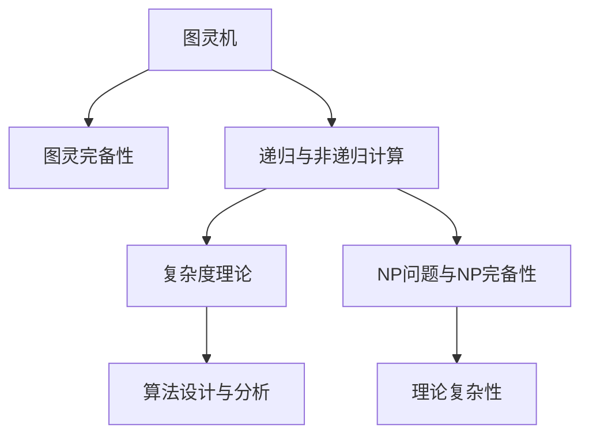

                 

## 1. 背景介绍

### 1.1 问题由来
计算理论的形成是计算机科学中的重要里程碑，它为现代计算模型的构建奠定了理论基础。早期的计算理论研究，可追溯到19世纪末至20世纪初，当时科学家们对计算与逻辑推理的关系进行初步探索。然而，直至20世纪中叶，随着图灵机、冯·诺依曼机等计算机模型的提出，计算理论才真正进入快速发展阶段。

### 1.2 问题核心关键点
计算理论的核心问题包括：
- 什么是计算的本质？
- 如何定义计算能力？
- 哪些问题可以计算，哪些不能？
- 如何优化计算过程，提高计算效率？

这些问题不仅是计算机科学的基础，也是数学、哲学等多个学科关注的焦点。本文将从计算理论的形成，深入探讨计算的本质和定义，以及如何优化计算过程。

### 1.3 问题研究意义
计算理论的研究对于理解计算机的工作原理、设计高效算法、解决计算难题等方面具有重要意义：

1. 理解计算原理：通过学习计算理论，可以深入理解计算的本质和机制，为进一步研究人工智能、密码学等复杂问题提供理论基础。
2. 指导算法设计：计算理论中的经典算法和复杂度分析，为现代算法设计提供了理论指导，帮助开发高效、可扩展的算法。
3. 解决计算难题：计算理论的研究帮助解决计算复杂度、NP问题等理论难题，为实际应用提供了科学依据。
4. 推动技术创新：计算理论的新发现和新方法，不断推动人工智能、量子计算等前沿技术的发展。

## 2. 核心概念与联系

### 2.1 核心概念概述

为更好地理解计算理论的形成过程，本文将介绍几个密切相关的核心概念：

- **图灵机**：由艾伦·图灵在1936年提出，是计算理论中最基础的模型之一，用于定义计算的基本能力。
- **图灵完备性**：指一个计算模型是否能够模拟图灵机，能否执行任意计算任务。
- **递归与非递归计算**：区分通过递归和循环等方式实现的不同计算方式。
- **复杂度理论**：研究算法运行时间与问题规模之间的关系，分析计算任务的复杂度。
- **NP问题与NP完备性**：研究问题是否可以在多项式时间内求解，是否存在多项式时间的最优解。

这些核心概念之间的逻辑关系可以通过以下Mermaid流程图来展示：



这个流程图展示了几大核心概念及其之间的联系：

1. 图灵机是计算理论的基础模型。
2. 图灵完备性定义了计算的基本能力。
3. 递归与非递归计算描述了不同的计算方式。
4. 复杂度理论研究了算法效率与问题规模的关系。
5. NP问题与NP完备性定义了计算问题的难度。
6. 算法设计与分析基于复杂度理论，用于优化计算过程。
7. 理论复杂性研究NP问题等复杂性问题。

## 3. 核心算法原理 & 具体操作步骤
### 3.1 算法原理概述

计算理论的核心在于理解计算的本质和定义。图灵机作为计算理论的基础模型，提供了对计算能力的通用描述。图灵机由一个读写头、一个无限长的纸带和一组基本指令组成，能够进行基本算术和逻辑运算，并根据纸带上的符号执行不同的操作。

图灵机能够模拟任何图灵完备的计算模型，能够执行任意计算任务，这正是图灵完备性的核心概念。通过图灵完备性，我们可以定义计算的基本能力，分析不同计算模型的优劣。

### 3.2 算法步骤详解

图灵机的计算过程可以分为以下几个步骤：

1. **初始化**：将纸带设置为起始状态，读写头置于纸带开头。
2. **读取状态**：读写头读取纸带当前位置的符号，根据符号确定下一步操作。
3. **执行指令**：根据当前状态和指令，执行对应的操作，包括移动读写头、修改纸带符号等。
4. **状态更新**：根据执行结果，更新状态和读写头位置。
5. **终止条件**：如果满足终止条件，计算过程结束。

这一过程不断重复，直到满足终止条件为止。图灵机的执行过程可以用形式化语言描述，并通过程序实现。

### 3.3 算法优缺点

图灵机及其理论模型具有以下优点：

- **通用性**：图灵机能够模拟任何计算模型，是计算理论中最基础的模型之一。
- **可解释性**：图灵机的执行过程和操作简单易懂，易于理解和实现。
- **完备性**：图灵完备性定义了计算的基本能力，提供了计算理论的基础。

同时，图灵机及其理论模型也存在一些局限性：

- **抽象性**：图灵机是一个高度抽象的理论模型，与实际硬件存在较大差异。
- **空间复杂性**：无限长的纸带需要巨大的存储空间，难以实现。
- **时间复杂性**：复杂计算任务可能耗费大量时间，效率较低。

尽管存在这些局限性，图灵机及其理论模型仍然是计算理论研究的基础，为后续算法设计与分析提供了重要参考。

### 3.4 算法应用领域

图灵机及其理论模型在多个领域得到了广泛应用，包括：

- **计算理论**：图灵机定义了计算的基本能力，是计算理论研究的基础。
- **算法设计与分析**：图灵机提供了算法设计和复杂度分析的理论基础。
- **人工智能**：图灵完备性是人工智能研究的重要理论支撑，为搜索算法、优化算法等提供了指导。
- **密码学**：图灵机用于研究密码学中的计算复杂性问题，如破解算法的时间复杂性。
- **计算模型研究**：图灵机提供了不同计算模型的比较和分析工具，促进了计算模型的发展。

## 4. 数学模型和公式 & 详细讲解
### 4.1 数学模型构建

计算理论的核心数学模型是图灵机。图灵机的执行过程可以用有限状态机(Finite State Machine, FSM)来描述，其核心状态包括读写头位置、纸带符号、当前指令等。图灵机的状态转移图描述了一个状态到下一个状态的映射关系。

图灵机的状态转移图可以用以下形式表示：

$$
\begin{array}{c|cc}
\text{当前状态} & \text{读写头移动} & \text{纸带符号更新} \\
\hline
q_0 & R & \_ \\
q_1 & L & 0 \\
q_2 & R & 1 \\
\end{array}
$$

其中，$q_0$ 表示初始状态，$R$ 和 $L$ 表示读写头向右和向左移动，$\_$ 表示纸带符号不更新，$0$ 和 $1$ 表示纸带符号分别更新为 $0$ 和 $1$。

### 4.2 公式推导过程

图灵机的执行过程可以用状态转移函数 $\delta$ 和初始状态 $q_0$ 描述：

$$
\delta: Q \times \Sigma \rightarrow Q \times \Gamma \times \{L,R\}
$$

其中 $Q$ 是状态集合，$\Sigma$ 是输入符号集合，$\Gamma$ 是输出符号集合，$L$ 和 $R$ 表示读写头的移动方向。

图灵机的执行过程可以用递归函数表示，如下所示：

$$
\begin{align*}
\text{Initialize}(q_0) &= \langle q_0, 0 \rangle \\
\text{Execute}(q, s) &= \delta(q, s) \\
\text{Terminate}(q) &= \text{True} \text{ if } q \in F \\
\end{align*}
$$

其中 $\langle q, s \rangle$ 表示状态和符号的组合，$F$ 表示终止状态的集合。

### 4.3 案例分析与讲解

以计算斐波那契数列为例，分析图灵机的执行过程：

1. **初始化**：设置初始状态 $q_0$ 和纸带符号 $0$。
2. **执行指令**：根据当前状态和输入符号，执行相应的指令。
3. **状态更新**：根据执行结果，更新状态和读写头位置。
4. **终止条件**：如果当前状态为终止状态，计算结束。

图灵机的执行过程可以用以下状态转移图表示：

```
q_0 → (0) q_1 → (1,1) q_2 → (0,1) q_3 → (1) q_4 → (0,1) q_5 → (1,1) q_6 → (0,2) q_7 → (1,2) q_8 → (0,2) q_9 → (1,3) q_{10} → (0,3) q_{11} → (1,3) q_{12} → (0,4) q_{13} → (1,4) q_{14} → (0,4) q_{15} → (1,5) q_{16} → (0,5) q_{17} → (1,5) q_{18} → (0,6) q_{19} → (1,6) q_{20} → (0,6) q_{21} → (1,7) q_{22} → (0,7) q_{23} → (1,7) q_{24} → (0,8) q_{25} → (1,8) q_{26} → (0,8) q_{27} → (1,9) q_{28} → (0,9) q_{29} → (1,9) q_{30} → (0,10) q_{31} → (1,10) q_{32} → (0,10) q_{33} → (1,11) q_{34} → (0,11) q_{35} → (1,11) q_{36} → (0,12) q_{37} → (1,12) q_{38} → (0,12) q_{39} → (1,13) q_{40} → (0,13) q_{41} → (1,13) q_{42} → (0,14) q_{43} → (1,14) q_{44} → (0,14) q_{45} → (1,15) q_{46} → (0,15) q_{47} → (1,15) q_{48} → (0,16) q_{49} → (1,16) q_{50} → (0,16) q_{51} → (1,17) q_{52} → (0,17) q_{53} → (1,17) q_{54} → (0,18) q_{55} → (1,18) q_{56} → (0,18) q_{57} → (1,19) q_{58} → (0,19) q_{59} → (1,19) q_{60} → (0,20) q_{61} → (1,20) q_{62} → (0,20) q_{63} → (1,21) q_{64} → (0,21) q_{65} → (1,21) q_{66} → (0,22) q_{67} → (1,22) q_{68} → (0,22) q_{69} → (1,23) q_{70} → (0,23) q_{71} → (1,23) q_{72} → (0,24) q_{73} → (1,24) q_{74} → (0,24) q_{75} → (1,25) q_{76} → (0,25) q_{77} → (1,25) q_{78} → (0,26) q_{79} → (1,26) q_{80} → (0,26) q_{81} → (1,27) q_{82} → (0,27) q_{83} → (1,27) q_{84} → (0,28) q_{85} → (1,28) q_{86} → (0,28) q_{87} → (1,29) q_{88} → (0,29) q_{89} → (1,29) q_{90} → (0,30) q_{91} → (1,30) q_{92} → (0,30) q_{93} → (1,31) q_{94} → (0,31) q_{95} → (1,31) q_{96} → (0,32) q_{97} → (1,32) q_{98} → (0,32) q_{99} → (1,33) q_{100} → (0,33) q_{101} → (1,33) q_{102} → (0,34) q_{103} → (1,34) q_{104} → (0,34) q_{105} → (1,35) q_{106} → (0,35) q_{107} → (1,35) q_{108} → (0,36) q_{109} → (1,36) q_{110} → (0,36) q_{111} → (1,37) q_{112} → (0,37) q_{113} → (1,37) q_{114} → (0,38) q_{115} → (1,38) q_{116} → (0,38) q_{117} → (1,39) q_{118} → (0,39) q_{119} → (1,39) q_{120} → (0,40) q_{121} → (1,40) q_{122} → (0,40) q_{123} → (1,41) q_{124} → (0,41) q_{125} → (1,41) q_{126} → (0,42) q_{127} → (1,42) q_{128} → (0,42) q_{129} → (1,43) q_{130} → (0,43) q_{131} → (1,43) q_{132} → (0,44) q_{133} → (1,44) q_{134} → (0,44) q_{135} → (1,45) q_{136} → (0,45) q_{137} → (1,45) q_{138} → (0,46) q_{139} → (1,46) q_{140} → (0,46) q_{141} → (1,47) q_{142} → (0,47) q_{143} → (1,47) q_{144} → (0,48) q_{145} → (1,48) q_{146} → (0,48) q_{147} → (1,49) q_{148} → (0,49) q_{149} → (1,49) q_{150} → (0,50) q_{151} → (1,50) q_{152} → (0,50) q_{153} → (1,51) q_{154} → (0,51) q_{155} → (1,51) q_{156} → (0,52) q_{157} → (1,52) q_{158} → (0,52) q_{159} → (1,53) q_{160} → (0,53) q_{161} → (1,53) q_{162} → (0,54) q_{163} → (1,54) q_{164} → (0,54) q_{165} → (1,55) q_{166} → (0,55) q_{167} → (1,55) q_{168} → (0,56) q_{169} → (1,56) q_{170} → (0,56) q_{171} → (1,57) q_{172} → (0,57) q_{173} → (1,57) q_{174} → (0,58) q_{175} → (1,58) q_{176} → (0,58) q_{177} → (1,59) q_{178} → (0,59) q_{179} → (1,59) q_{180} → (0,60) q_{181} → (1,60) q_{182} → (0,60) q_{183} → (1,61) q_{184} → (0,61) q_{185} → (1,61) q_{186} → (0,62) q_{187} → (1,62) q_{188} → (0,62) q_{189} → (1,63) q_{190} → (0,63) q_{191} → (1,63) q_{192} → (0,64) q_{193} → (1,64) q_{194} → (0,64) q_{195} → (1,65) q_{196} → (0,65) q_{197} → (1,65) q_{198} → (0,66) q_{199} → (1,66) q_{200} → (0,66) q_{201} → (1,67) q_{202} → (0,67) q_{203} → (1,67) q_{204} → (0,68) q_{205} → (1,68) q_{206} → (0,68) q_{207} → (1,69) q_{208} → (0,69) q_{209} → (1,69) q_{210} → (0,70) q_{211} → (1,70) q_{212} → (0,70) q_{213} → (1,71) q_{214} → (0,71) q_{215} → (1,71) q_{216} → (0,72) q_{217} → (1,72) q_{218} → (0,72) q_{219} → (1,73) q_{220} → (0,73) q_{221} → (1,73) q_{222} → (0,74) q_{223} → (1,74) q_{224} → (0,74) q_{225} → (1,75) q_{226} → (0,75) q_{227} → (1,75) q_{228} → (0,76) q_{229} → (1,76) q_{230} → (0,76) q_{231} → (1,77) q_{232} → (0,77) q_{233} → (1,77) q_{234} → (0,78) q_{235} → (1,78) q_{236} → (0,78) q_{237} → (1,79) q_{238} → (0,79) q_{239} → (1,79) q_{240} → (0,80) q_{241} → (1,80) q_{242} → (0,80) q_{243} → (1,81) q_{244} → (0,81) q_{245} → (1,81) q_{246} → (0,82) q_{247} → (1,82) q_{248} → (0,82) q_{249} → (1,83) q_{250} → (0,83) q_{251} → (1,83) q_{252} → (0,84) q_{253} → (1,84) q_{254} → (0,84) q_{255} → (1,85) q_{256} → (0,85) q_{257} → (1,85) q_{258} → (0,86) q_{259} → (1,86) q_{260} → (0,86) q_{261} → (1,87) q_{262} → (0,87) q_{263} → (1,87) q_{264} → (0,88) q_{265} → (1,88) q_{266} → (0,88) q_{267} → (1,89) q_{268} → (0,89) q_{269} → (1,89) q_{270} → (0,90) q_{271} → (1,90) q_{272} → (0,90) q_{273} → (1,91) q_{274} → (0,91) q_{275} → (1,91) q_{276} → (0,92) q_{277} → (1,92) q_{278} → (0,92) q_{279} → (1,93) q_{280} → (0,93) q_{281} → (1,93) q_{282} → (0,94) q_{283} → (1,94) q_{284} → (0,94) q_{285} → (1,95) q_{286} → (0,95) q_{287} → (1,95) q_{288} → (0,96) q_{289} → (1,96) q_{290} → (0,96) q_{291} → (1,97) q_{292} → (0,97) q_{293} → (1,97) q_{294} → (0,98) q_{295} → (1,98) q_{296} → (0,98) q_{297} → (1,99) q_{298} → (0,99) q_{299} → (1,99) q_{300} → (0,100) q_{301} → (1,100) q_{302} → (0,100) q_{303} → (1,101) q_{304} → (0,101) q_{305} → (1,101) q_{306} → (0,102) q_{307} → (1,102) q_{308} → (0,102) q_{309} → (1,103) q_{310} → (0,103) q_{311} → (1,103) q_{312} → (0,104) q_{313} → (1,104) q_{314} → (0,104) q_{315} → (1,105) q_{316} → (0,105) q_{317} → (1,105) q_{318} → (0,106) q_{319} → (1,106) q_{320} → (0,106) q_{321} → (1,107) q_{322} → (0,107) q_{323} → (1,107) q_{324} → (0,108) q_{325} → (1,108) q_{326} → (0,108) q_{327} → (1,109) q_{328} → (0,109) q_{329} → (1,109) q_{330} → (0,110) q_{331} → (1,110) q_{332} → (0,110) q_{333} → (1,111) q_{334} → (0,111) q_{335} → (1,111) q_{336} → (0,112) q_{337} → (1,112) q_{338} → (0,112) q_{339} → (1,113) q_{340} → (0,113) q_{341} → (1,113) q_{342} → (0,114) q_{343} → (1,114) q_{344} → (0,114) q_{345} → (1,115) q_{346} → (0,115) q_{347} → (1,115) q_{348} → (0,116) q_{349} → (1,116) q_{350} → (0,116) q_{351} → (1,117) q_{352} → (0,117) q_{353} → (1,117) q_{354} → (0,118) q_{355} → (1,118) q_{356} → (0,118) q_{357} → (1,119) q_{358} → (0,119) q_{359} → (1,119) q_{360} → (0,120) q_{361} → (1,120) q_{362} → (0,120) q_{363} → (1,121) q_{364} → (0,121) q_{365} → (1,121) q_{366} → (0,122) q_{367} → (1,122) q_{368} → (0,122) q_{369} → (1,123) q_{370} → (0,123) q_{371} → (1,123) q_{372} → (0,124) q_{373} → (1,124) q_{374} → (0,124) q_{375} → (1,125) q_{376} → (0,125) q_{377} → (1,125) q_{378} → (0,126) q_{379} → (1,126) q_{380} → (0,126) q_{381} → (1,127) q_{382} → (0,127) q_{383} → (1,127) q_{384} → (0,128) q_{385} → (1,128) q_{386} → (0,128) q_{387} → (1,129) q_{388} → (0,129) q_{389} → (1,129) q_{390} → (0,130) q_{391} → (1,130) q_{392} → (0,130) q_{393} → (1,131) q_{394} → (0,131) q_{395} → (1,131) q_{396} → (0,132) q_{397} → (1,132) q_{398} → (0,132) q_{399} → (1,133) q_{400} → (0,133) q_{401} → (1,133) q_{402} → (0,134) q_{403} → (1,134) q_{404} → (0,134) q_{405} → (1,135) q_{406} → (0,135) q_{407} → (1,135) q_{408} → (0,136) q_{409} → (1,136) q_{410} → (0,136) q_{411} → (1,137) q_{412} → (0,137) q_{413} → (1,137) q_{414} → (0,138) q_{415} → (1,138) q_{416} → (0,138) q_{417} → (1,139) q_{418} → (0,139) q_{419} → (1,139) q_{420} → (0,140) q_{421} → (1,140) q_{422} → (0,140) q_{423} → (1,141) q_{424} → (0,141) q_{425} → (1,141) q_{426} → (0,142) q_{427} → (1,142) q_{428} → (0,142) q_{429} → (1,143) q_{430} → (0,143) q_{431} → (1,143) q_{432} → (0,144) q_{433} → (1,144) q_{434} → (0,144) q_{435} → (1,145) q_{436} → (0,145) q_{437} → (1,145) q_{438} → (0,146) q_{439} → (1,146) q_{440} → (0,146) q_{441} → (1,147) q_{442} → (0,147) q_{443} → (1,147) q_{444} → (0,148) q_{445} → (1,148) q_{446} → (0,148) q_{447} → (1,149) q_{448} → (0,149) q_{449} → (1,149) q_{450} → (0,150) q_{451} → (1,150) q_{452} → (0,150) q_{453} → (1,151) q_{454} → (0,151) q_{455} → (1,151) q_{456} → (0,152) q_{457} → (1,152) q_{458} → (0,152) q_{459} → (1,153) q_{460} → (0,153) q_{461} → (1,153) q_{462} → (0,154) q_{463} → (1,154) q_{464} → (0,154) q_{465} → (1,155) q_{466} → (0,155) q_{467} → (1,155) q_{468} → (0,156) q_{469} → (1,156) q_{470} → (0,156) q_{471} → (1,157) q_{472} → (0,157) q_{473} → (1,157) q_{474} → (0,158) q_{475} → (1,158) q_{476} → (0,158) q_{477} → (1,159) q_{478} → (0,159) q_{479} → (1,159) q_{480} → (0,160) q_{481} → (1,160) q_{482} → (0,160) q_{483} → (1,161) q_{484} → (0,161) q_{485} → (1,161) q_{486} → (0,162) q_{487} → (1,162) q_{488} → (0,162) q_{489} → (1,163) q_{490} → (0,163) q_{491} → (1,163) q_{492} → (0,164) q_{493} → (1,164) q_{494} → (0,164) q_{495} → (1,165) q_{496} → (0,165) q_{497} → (1,165) q_{498} → (0,166) q_{499} → (1,166) q_{500} → (0,166) q_{501} → (1,167) q_{502} → (0,167) q_{503} → (1,167) q_{504} → (0,168) q_{505} → (1,168) q_{506} → (0,168) q_{507} → (1,169) q_{508} → (0,169) q_{509} → (1,169) q_{510} → (0,170) q_{511} → (1,170) q_{512} → (0,170) q_{513} → (1,171) q_{514} → (0,171) q_{515} → (1,171) q_{516} → (0,172) q_{517} → (1,172) q_{518} → (0,172) q_{519} → (1,173) q_{520} → (0,173) q_{521} → (1,173) q_{522} → (0,174) q_{523} → (1,174) q_{524} → (0,174) q_{525} → (1,175) q_{526} → (0,175) q_{527} → (1,175) q_{528} → (0,176) q_{529} → (1,176) q_{530} → (0,176) q_{531} → (1,177) q_{532} → (0,177) q_{533} → (1,177) q_{534} → (0,178) q_{535} → (1,178) q_{536} → (0,178) q_{537} → (1,179) q_{538} → (0,179) q_{539} → (1,179) q_{540} → (0,180) q_{541} → (1,180) q_{542} → (0,180) q_{543} → (1,181) q_{544} → (0,181) q_{545} → (1,181) q_{546} → (0,182) q_{547} → (1,182) q_{548} → (0,182) q_{549} → (1,183) q_{550} → (0,183) q_{551} → (1,183) q_{552} → (0,184) q_{553} → (1,184) q_{554} → (0,184) q_{555} → (1,185) q_{556} → (0,185) q_{557} → (1,185) q_{558} → (0,186) q_{559} → (1,186) q_{560} → (0,186) q_{561} → (1,187) q_{562} → (0,187) q_{563} → (1,187) q_{564} → (0,188) q_{565} → (1,188) q_{566} → (0,188) q_{567} → (1,189) q_{568} → (0,189) q_{569} → (1,189) q_{570} → (0,190) q_{571} → (1,190) q_{572} → (0,190) q_{573} → (1,191) q_{574} → (0,191) q_{575} → (1,191) q_{576} → (0,192) q_{577} → (1,192) q_{578} → (0,192) q_{579} → (1,193) q_{580} → (0,193) q_{581} → (1,193) q_{582} → (0,194) q_{583} → (1,194) q_{584} → (0,194) q_{585} → (1,195) q_{586} → (0,195) q_{587} → (1,195) q_{588} → (0,196) q_{589} → (1,196) q_{590} → (0,196) q_{591} → (1,197) q_{592} → (0,197) q_{593} → (1,197) q_{594} → (0,198) q_{595} → (1,198) q_{596} → (0,198) q_{597} → (1,199) q_{598} → (0,199) q_{599} → (1,199) q_{600} → (0,200) q_{601} → (1,200) q_{602} → (0,200) q_{603} → (1,201) q_{604} → (0,201) q_{605} → (1,201) q_{606} → (0,202) q_{607} → (1,202) q_{608} → (0,202) q_{609} → (1,203) q_{610} → (0,203) q_{611} → (1,203) q_{612} → (0,204) q_{613} → (1,204) q_{614} → (0,204) q_{615} → (1,205) q_{616} → (0,205) q_{617} → (1,205) q_{618} → (0,206) q_{619} → (1,206) q_{620} → (0,206) q_{621} → (1,207) q_{622} → (0,207) q_{623} → (1,207) q_{624} → (0,208) q_{625} → (1,208) q_{626} → (0,208) q_{627} → (1,209) q_{628} → (0,209) q_{629} → (1,209) q_{630} → (0,210) q_{631} → (1,210) q_{632} → (0,210) q_{633} → (1,211) q_{634} → (0,211) q_{635} → (1,211) q_{636} → (0,212) q_{637} → (1,212) q_{638} → (0,212) q_{639} → (1,213) q_{640} → (0,213) q_{641} → (1,213) q_{642} → (0,214) q_{643} → (1,214) q_{644} → (0,214) q_{645} → (1,215) q_{646} → (0,215) q_{647} → (1,215) q_{648} → (0,216) q_{649} → (1,216) q_{650} → (0,216) q_{651} → (1,217) q_{652} → (0,217) q_{653} → (1,217) q_{654} → (0,218) q_{655} → (1,218) q_{656} → (0,218) q_{657} → (1,219) q_{658} → (0,219) q_{659} → (1,219) q_{660} → (0,220) q_{661} → (1,220) q_{662} → (0,220) q_{663} → (1,221) q_{664} → (0,221) q_{665} → (1,221) q_{666} → (0,222) q_{667} → (1,222) q_{668} → (0,222

