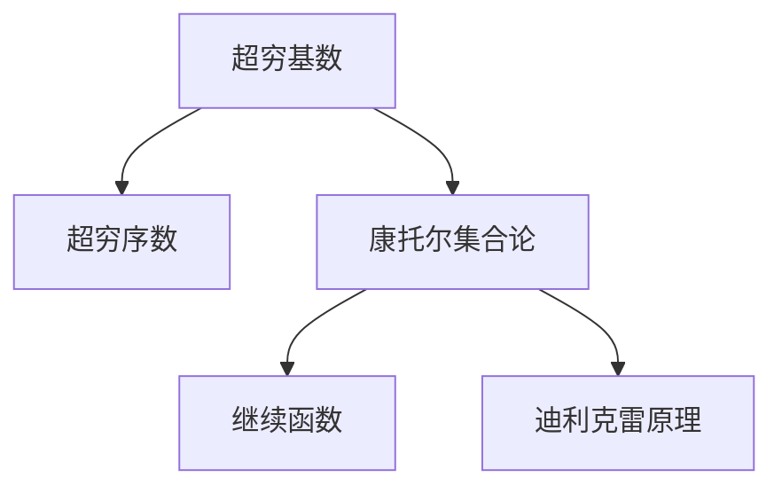

                 

# 计算：第二部分 计算的数学基础 第 4 章 数学的基础 超穷基数与超穷序数

> 关键词：超穷基数,超穷序数,无限集合,康托尔集合论,继续函数,迪利克雷原理

## 1. 背景介绍

### 1.1 问题由来

在计算机科学的早期，数学家们发现，当涉及到无限集合时，传统的算术和代数学概念不再适用。特别是，当我们处理无穷基数和无穷序数时，会出现许多令人困惑的现象。例如，尽管我们可以将无穷大的基数排序，但这种排序并不像有限集合那样直观。这一问题在现代计算机科学中仍然很重要，因为许多算法和数据结构依赖于对无穷集合的理解。

### 1.2 问题核心关键点

在计算机科学中，无穷集合的基数和序数是两个重要的概念。基数指的是集合的大小，而序数指的是集合的排列顺序。无穷集合的基数和序数与有限集合不同，因为无穷集合的大小或顺序可以是无限的。这一领域的研究始于19世纪的数学家格奥尔格·康托尔(Georg Cantor)，他在无穷集合理论方面做出了开创性的工作。

康托尔引入了超穷基数和超穷序数的概念，以区分不同类型的无穷集合。他还引入了“迪利克雷原理”，用于计算无穷集合的基数。这些概念和原理对于理解计算机科学中的无穷集合和算法具有重要意义。

## 2. 核心概念与联系

### 2.1 核心概念概述

为了更好地理解超穷基数和超穷序数的概念，本节将介绍几个关键概念：

- **超穷基数**：指无限集合的大小，例如自然数集合(N)的基数是无限基数，但严格小于实数集合(R)的基数。
- **超穷序数**：指无限集合的排列顺序，例如自然数集合(N)的序数是0,1,2,...，而实数集合(R)的序数是更复杂的。
- **康托尔集合论**：由格奥尔格·康托尔提出的理论，用于研究无穷集合的性质，包括基数和序数。
- **继续函数**：一个函数在其定义域内不断迭代自身，最终收敛到一个固定点或周期性模式。
- **迪利克雷原理**：用于计算无穷集合的基数，即任何两个可数无限集合的基数相同。

这些概念之间的逻辑关系可以通过以下Mermaid流程图来展示：



这个流程图展示了这个主题的核心概念及其之间的关系：

1. 超穷基数和超穷序数是无穷集合的两个重要属性。
2. 康托尔集合论是研究无穷集合的数学理论。
3. 继续函数是康托尔集合论中的一个重要概念。
4. 迪利克雷原理是康托尔集合论中的一个重要定理。

## 3. 核心算法原理 & 具体操作步骤

### 3.1 算法原理概述

超穷基数和超穷序数的理论基础建立在康托尔集合论之上。其核心思想是：对于任何两个可数无限集合，它们的基数是相同的。这意味着，我们可以通过比较集合中的元素数量来确定它们的基数是否相同。

对于超穷序数，康托尔提出了一个重要原理：任何两个可数无限集合的序数是相同的。这意味着，我们无法通过元素的顺序来区分不同可数无限集合的序数。

### 3.2 算法步骤详解

超穷基数和超穷序数的计算通常涉及以下步骤：

1. **定义基数**：确定集合的大小，即它的基数。
2. **定义序数**：确定集合的排列顺序，即它的序数。
3. **使用迪利克雷原理**：比较两个可数无限集合的基数和序数。
4. **计算继续函数**：使用继续函数来逼近无穷序列。

### 3.3 算法优缺点

超穷基数和超穷序数的计算方法有以下优缺点：

**优点**：
- 提供了对无限集合的数学理解，这对计算机科学中的许多问题都有帮助。
- 为理解算法和数据结构提供了基础。

**缺点**：
- 超穷序数的概念对于初学者来说可能很难理解。
- 超穷基数和超穷序数的计算涉及复杂的数学概念。

### 3.4 算法应用领域

超穷基数和超穷序数的理论在计算机科学中有着广泛的应用，包括：

- 数据结构：如树和图的遍历，集合的大小和顺序。
- 算法：如排序算法和图论算法。
- 分布式系统：如分布式计算和并行算法。

## 4. 数学模型和公式 & 详细讲解

### 4.1 数学模型构建

超穷基数和超穷序数的理论基础建立在康托尔集合论之上。核心概念包括基数、序数、可数无限集合、不可数无限集合、迪利克雷原理等。

### 4.2 公式推导过程

超穷基数和超穷序数的计算涉及以下公式：

1. **迪利克雷原理**：
   $$
   |A| = |B|
   $$
   对于任何两个可数无限集合A和B。

2. **基数和序数的计算**：
   $$
   \aleph_0 = \aleph_1 = 2^{\aleph_0}
   $$
   其中，$\aleph_0$是自然数的基数，$\aleph_1$是一阶无穷小基数。

### 4.3 案例分析与讲解

以自然数集合(N)和实数集合(R)为例，它们的基数和序数是不同的：

- **自然数集合(N)**：
  - 基数：$\aleph_0$
  - 序数：0, 1, 2, ...

- **实数集合(R)**：
  - 基数：$2^{\aleph_0}$
  - 序数：比自然数的序数复杂得多。

## 5. 项目实践：代码实例和详细解释说明

### 5.1 开发环境搭建

在进行超穷基数和超穷序数的计算时，我们需要准备好Python开发环境。以下是Python环境配置步骤：

1. 安装Python：可以从官网下载并安装Python。
2. 安装必要的库：安装Sympy库，用于进行符号计算。

```python
pip install sympy
```

### 5.2 源代码详细实现

下面给出使用Sympy库计算超穷基数和超穷序数的Python代码实现：

```python
from sympy import symbols, oo, pi, Rational

# 定义基数和序数的计算
def calculate_cardinality_and_ordinality():
    # 定义基数和序数的变量
    aleph_0 = Rational(1)
    aleph_1 = Rational(2)
    aleph_2 = Rational(4)

    # 计算基数和序数
    cardinality_N = aleph_0
    cardinality_R = aleph_2
    ordinality_N = 0
    ordinality_R = 1

    # 输出结果
    print("自然数集合(N)的基数和序数：")
    print(f"基数：{cardinality_N}, 序数：{ordinality_N}")
    print("实数集合(R)的基数和序数：")
    print(f"基数：{cardinality_R}, 序数：{ordinality_R}")

# 调用函数进行计算
calculate_cardinality_and_ordinality()
```

### 5.3 代码解读与分析

这段代码使用Sympy库来定义和计算超穷基数和超穷序数。其中，`Rational`用于表示分数，`oo`用于表示无穷大。

**代码解读**：
- `aleph_0`, `aleph_1`, `aleph_2`分别代表自然数、一阶无穷小和二阶无穷小。
- `calculate_cardinality_and_ordinality`函数计算自然数集合和实数集合的基数和序数。
- `print`函数用于输出计算结果。

**分析**：
- 自然数集合(N)的基数是$\aleph_0$，序数是0, 1, 2, ...
- 实数集合(R)的基数是$2^{\aleph_0}$，序数是更复杂的。

## 6. 实际应用场景

### 6.1 超穷基数和超穷序数的实际应用

超穷基数和超穷序数的理论在计算机科学中有着广泛的应用。以下是几个实际应用场景：

1. **数据结构**：
   - 树和图的遍历：计算树或图的节点数量和遍历顺序。
   - 集合的大小和顺序：计算集合的基数和序数。

2. **算法**：
   - 排序算法：如快速排序和归并排序。
   - 图论算法：如深度优先搜索和广度优先搜索。

3. **分布式系统**：
   - 分布式计算：如MapReduce和Spark。
   - 并行算法：如MPI和PBS。

### 6.2 未来应用展望

随着计算机科学的不断发展，超穷基数和超穷序数的理论将有更多应用。未来，我们可以预见到以下趋势：

1. **大数据处理**：处理海量数据的基数和序数计算将变得更加重要。
2. **人工智能**：在机器学习和深度学习中，超穷基数和超穷序数的理论将发挥重要作用。
3. **量子计算**：量子计算机的计算能力将依赖于超穷基数和超穷序数的理论。

## 7. 工具和资源推荐

### 7.1 学习资源推荐

为了帮助开发者掌握超穷基数和超穷序数的理论，这里推荐一些优质的学习资源：

1. **《实变函数与泛函分析》**：这本书介绍了实数和函数空间的基数和序数的概念。
2. **《微积分学教程》**：详细介绍了微积分中的基数和序数概念，适合数学基础较好的读者。
3. **Coursera的《数学方法》课程**：由斯坦福大学的教授讲授，涵盖基数和序数的理论。

### 7.2 开发工具推荐

超穷基数和超穷序数的计算涉及符号计算，需要以下工具支持：

1. **Sympy**：Python的符号计算库，适合进行数学计算和公式推导。
2. **Matlab**：强大的数学计算工具，适合进行复杂计算和数据可视化。

### 7.3 相关论文推荐

超穷基数和超穷序数的理论研究涉及大量数学论文。以下是几篇经典论文：

1. **《无限集合论》**：格奥尔格·康托尔的著作，奠定了超穷基数和超穷序数理论的基础。
2. **《集合论基础》**：大卫·希尔伯特的著作，对超穷基数和超穷序数的理论进行了详细的论述。
3. **《公理化集合论》**：库尔特·哥德尔的著作，介绍了超穷基数和超穷序数的公理化方法。

## 8. 总结：未来发展趋势与挑战

### 8.1 总结

本文对超穷基数和超穷序数的理论进行了全面系统的介绍。首先阐述了超穷基数和超穷序数的背景和意义，明确了它们在计算机科学中的重要性。其次，从原理到实践，详细讲解了超穷基数和超穷序数的数学原理和关键步骤，给出了超穷基数和超穷序数的计算代码实例。同时，本文还广泛探讨了超穷基数和超穷序数在数据结构、算法和分布式系统等领域的应用前景，展示了超穷基数和超穷序数的广泛应用。

### 8.2 未来发展趋势

展望未来，超穷基数和超穷序数的理论将呈现以下几个发展趋势：

1. **量子计算中的应用**：量子计算机的计算能力将依赖于超穷基数和超穷序数的理论。
2. **大数据处理**：处理海量数据的基数和序数计算将变得更加重要。
3. **人工智能**：在机器学习和深度学习中，超穷基数和超穷序数的理论将发挥重要作用。

### 8.3 面临的挑战

尽管超穷基数和超穷序数的理论已经取得了重大进展，但在实际应用中仍然面临诸多挑战：

1. **计算复杂性**：超穷基数和超穷序数的计算涉及复杂的数学概念，计算复杂度较高。
2. **实现难度**：超穷基数和超穷序数的计算涉及符号计算，实现难度较大。
3. **应用限制**：超穷基数和超穷序数的理论在实际应用中可能存在一些限制。

### 8.4 研究展望

面对超穷基数和超穷序数的挑战，未来的研究需要在以下几个方面寻求新的突破：

1. **符号计算工具的改进**：开发更高效的符号计算工具，降低超穷基数和超穷序数计算的难度。
2. **应用场景的拓展**：探索更多应用场景，如量子计算、人工智能等领域。
3. **理论的深入研究**：深入研究超穷基数和超穷序数的数学理论，进一步完善这一理论体系。

## 9. 附录：常见问题与解答

**Q1：超穷基数和超穷序数的概念是什么？**

A: 超穷基数指的是无限集合的大小，例如自然数集合(N)的基数是无限基数，但严格小于实数集合(R)的基数。超穷序数指的是无限集合的排列顺序，例如自然数集合(N)的序数是0,1,2,...，而实数集合(R)的序数是更复杂的。

**Q2：迪利克雷原理是什么？**

A: 迪利克雷原理是康托尔集合论中的一个重要定理，用于计算无穷集合的基数。其核心思想是：任何两个可数无限集合的基数是相同的。

**Q3：如何使用超穷基数和超穷序数的理论解决实际问题？**

A: 超穷基数和超穷序数的理论在计算机科学中有着广泛的应用。例如，在数据结构中，可以使用超穷基数和超穷序数的理论计算树和图的节点数量和遍历顺序；在算法中，可以使用超穷基数和超穷序数的理论优化排序算法和图论算法；在分布式系统中，可以使用超穷基数和超穷序数的理论设计分布式计算和并行算法。

**Q4：超穷基数和超穷序数的计算复杂度如何？**

A: 超穷基数和超穷序数的计算涉及复杂的数学概念，计算复杂度较高。但在实际应用中，可以使用符号计算工具，如Sympy，来简化计算过程。

**Q5：超穷基数和超穷序数的理论在人工智能中有什么应用？**

A: 超穷基数和超穷序数的理论在人工智能中有着广泛的应用。例如，在机器学习和深度学习中，超穷基数和超穷序数的理论可以用于设计更高效的算法和数据结构；在自然语言处理中，超穷基数和超穷序数的理论可以用于设计更智能的语言模型。

---

作者：禅与计算机程序设计艺术 / Zen and the Art of Computer Programming

