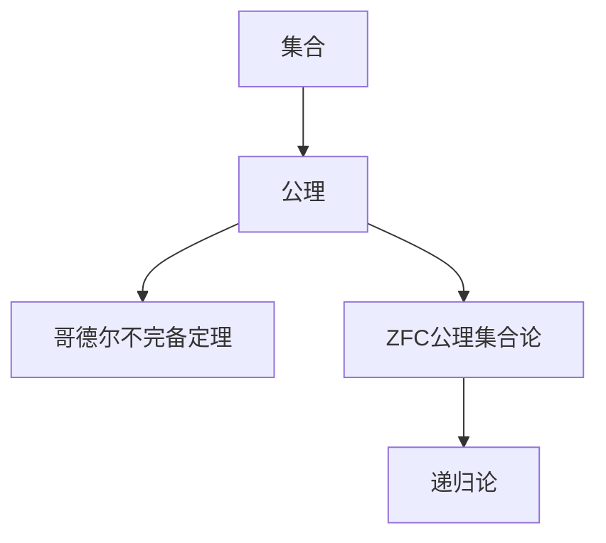

                 

# 计算：第二部分 计算的数学基础 第 5 章 第三次数学危机 ZFC 公理集合论

> 关键词：数学危机,公理集合论,ZFC,哥德尔不完备定理,归纳法,递归论

## 1. 背景介绍

### 1.1 问题由来

数学是科学技术的基石，而公理化方法则是数学发展的核心工具。在古希腊时期，毕达哥拉斯学派首次使用了公理化方法，将数学建立在明确的前提和推导规则之上。这一思想对后世的数学发展产生了深远影响，并一直沿用至今。然而，20世纪初的数学界遭遇了一次前所未有的危机，即第三次数学危机。

第三次数学危机源于罗素悖论的发现，罗素悖论揭示了数学基础中的矛盾，引发了数学家对数学公理系统的深刻思考。这一危机促使数学家寻求新的公理系统，最终导致了哥德尔不完备定理的诞生。

哥德尔不完备定理揭示了任何一种形式化的公理系统都有局限性，不可能同时满足完备性和一致性。这一结论极大地影响了数学哲学、逻辑学和计算机科学等多个领域。本文将深入探讨ZFC公理集合论，并分析哥德尔不完备定理，揭示数学基础和计算理论的深层联系。

### 1.2 问题核心关键点

第三次数学危机揭示了数学基础中存在的问题，促使数学家寻求新的公理系统，最终诞生了ZFC公理集合论。ZFC公理集合论通过一系列公理定义集合和元素的关系，为数学和计算理论提供了严谨的逻辑基础。

ZFC公理集合论的关键点包括：
- 集合的定义和性质
- 集合的公理系统
- 哥德尔不完备定理
- 递归论的引入

这些核心点构成了ZFC公理集合论的基础框架，对数学和计算理论的发展产生了深远影响。

## 2. 核心概念与联系

### 2.1 核心概念概述

为更好地理解ZFC公理集合论，本节将介绍几个密切相关的核心概念：

- 集合(Set)：一组具有确定属性的元素的集合体，是数学中最基本的概念之一。
- 公理(Axiom)：数学中一些被广泛接受的命题，可以作为定义其他命题的基础。
- 哥德尔不完备定理(Gödel's Incompleteness Theorem)：揭示了任何形式化的公理系统都有局限性的著名定理。
- ZFC公理集合论(ZFC Set Theory)：由策梅洛-弗兰克尔(Zermelo-Fraenkel)和选择公理(Choice Axiom)构成的一个严谨的公理系统，为数学和计算理论提供了基础。
- 递归论(Recursion Theory)：研究函数的计算复杂性和递归关系，是计算理论的重要分支。

这些核心概念之间的逻辑关系可以通过以下Mermaid流程图来展示：



这个流程图展示了几大核心概念之间的逻辑关系：

1. 集合是数学中最基本的概念，公理为其提供了严格定义和性质。
2. ZFC公理集合论通过一系列公理定义集合和元素的关系，是数学和计算理论的基础。
3. 哥德尔不完备定理揭示了ZFC公理集合论的局限性，推动了递归论的发展。
4. 递归论进一步研究函数的计算复杂性和递归关系，揭示了计算的根本特性。

这些概念共同构成了数学和计算理论的逻辑基础，对后续的数学和计算发展产生了深远影响。

## 3. 核心算法原理 & 具体操作步骤
### 3.1 算法原理概述

ZFC公理集合论通过一系列公理定义集合和元素的关系，为数学和计算理论提供了严谨的逻辑基础。其核心原理包括以下几个方面：

1. 集合的定义：任何一组对象都可以构成一个集合。
2. 集合的元素：集合中的元素是明确且可区分的。
3. 集合的公理：ZFC公理系统包括11条公理，定义了集合和元素的基本关系，如并集、交集、子集等。
4. 哥德尔不完备定理：任何形式化的公理系统都有局限性，不可能同时满足完备性和一致性。

ZFC公理集合论的严格性和严谨性，使得其在数学和计算理论中占据了重要地位。

### 3.2 算法步骤详解

基于ZFC公理集合论，数学和计算理论的发展可以遵循以下步骤：

**Step 1: 定义集合**
- 集合定义为：一组对象构成的集合，其元素具有明确且可区分的属性。

**Step 2: 定义集合的运算**
- 并集：两个集合的并集包含所有属于两个集合的对象。
- 交集：两个集合的交集包含同时属于两个集合的对象。
- 子集：一个集合的所有元素都属于另一个集合，则称其为子集。

**Step 3: 引入公理系统**
- 策梅洛-弗兰克尔公理(ZF)：包括集合的存在、幂集公理、选择公理等。
- 哥德尔公理：确保公理系统的无矛盾性和完备性。

**Step 4: 建立数学和计算理论**
- 数学理论基于集合和公理系统，如实数、复数、群论、拓扑学等。
- 计算理论基于集合和递归关系，如递归函数、图灵机、递归论等。

**Step 5: 验证哥德尔不完备定理**
- 验证哥德尔不完备定理：任何形式化的公理系统都有局限性，无法同时满足完备性和一致性。

通过上述步骤，数学和计算理论得以在严谨的公理系统基础上建立和发展，为后续的研究和应用提供了坚实的逻辑基础。

### 3.3 算法优缺点

ZFC公理集合论具有以下优点：
1. 严谨性：公理系统通过严格的定义和推理，确保了数学和计算理论的严谨性。
2. 广泛适用性：公理系统广泛应用于数学和计算理论的各个领域。
3. 可验证性：任何数学命题都可以通过公理系统的推理验证。

然而，ZFC公理集合论也存在以下缺点：
1. 复杂性：公理系统复杂庞大，难以理解和应用。
2. 完备性问题：哥德尔不完备定理揭示了公理系统的局限性，无法同时满足完备性和一致性。
3. 适用范围有限：公理系统主要应用于数学和计算理论，无法直接应用于物理学、工程学等具体学科。

尽管存在这些局限性，ZFC公理集合论仍然是数学和计算理论的基础，其严谨性和广泛适用性为后续的研究和应用提供了坚实的基础。

### 3.4 算法应用领域

ZFC公理集合论在数学和计算理论中得到了广泛应用，具体领域包括：

- 数学基础：公理系统为数学基础提供了严谨的逻辑基础，如集合论、拓扑学、群论等。
- 递归论：研究函数的计算复杂性和递归关系，揭示了计算的根本特性。
- 逻辑学：公理系统为逻辑学提供了严谨的推理规则，如布尔代数、数理逻辑等。
- 计算机科学：公理系统为计算机科学提供了逻辑基础，如算法复杂性、计算模型等。

ZFC公理集合论不仅为数学和计算理论提供了严谨的逻辑基础，也为后续的研究和应用提供了广泛的应用领域。

## 4. 数学模型和公式 & 详细讲解 & 举例说明
### 4.1 数学模型构建

ZFC公理集合论通过一系列公理定义集合和元素的关系，为数学和计算理论提供了严谨的逻辑基础。以下是ZFC公理集合论的主要公理：

1. 空集公理：存在一个空集。
2. 配对公理：任何集合与任何元素可以配对成一个新的集合。
3. 并集公理：对于任意集合$A$和$B$，存在它们的并集$A\cup B$。
4. 幂集公理：对于任意集合$A$，存在其幂集$2^A$。
5. 子集公理：对于任意集合$A$和$B$，如果$A\in B$，则$A\subseteq B$。
6. 限定公理：对于任意集合$A$，存在一个集合$C$，使得$A\notin C$。
7. 无限公理：存在一个无限集合。
8. 选择公理：对于任意集合$A$，存在一个元素$x$，使得对于任意$y\in A$，$y\neq x$。
9. 替换公理：对于任意集合$A$和映射$f$，如果$B\subseteq A$，则存在一个映射$g$，使得$g(B)=f(A)$。
10. 正则公理：对于任意集合$A$和$B$，如果$A\in B$且$B\in A$，则$A=B$。
11. 集合基数公理：任何两个具有相同基数的集合都是可数集合。

### 4.2 公式推导过程

以下是ZFC公理集合论的公理系统及其推导过程的详细说明：

1. 空集公理
$$
\exists x(\forall y\neg(y\in x))
$$

2. 配对公理
$$
\forall A\forall y(y\in A \leftrightarrow (y,A)\in P)
$$
其中$P=\{(y,A): y\in A\}$，即任何集合与任何元素可以配对成一个新的集合。

3. 并集公理
$$
\forall A\forall B(\forall x(x\in A\vee x\in B)\leftrightarrow x\in A\cup B)
$$
其中$A\cup B=\{x:x\in A\vee x\in B\}$。

4. 幂集公理
$$
\forall A\exists B(\forall x(x\in A\rightarrow x\notin B)\vee x\in B)
$$
其中$B=\{x:x\notin A\}$。

5. 子集公理
$$
\forall A\forall B(\forall x(x\in A\rightarrow x\in B)\rightarrow A\subseteq B)
$$

6. 限定公理
$$
\forall A\exists C(\forall x(x\in A\rightarrow x\notin C)\wedge\forall y(y\in C\rightarrow y\notin A))
$$

7. 无限公理
$$
\exists x(\forall n\in\mathbb{N}(x\notin n))
$$

8. 选择公理
$$
\forall A(\exists y\in A)(\forall z(z\in A\rightarrow z\neq y)\rightarrow y\in A)
$$

9. 替换公理
$$
\forall A\forall B(\forall x(x\in A\rightarrow y\in B)\rightarrow\forall C(\forall x(x\in A\rightarrow x\in C)\rightarrow\forall y(y\in B\rightarrow y\in C))
$$

10. 正则公理
$$
\forall A\forall B(\forall x(x\in A\rightarrow x\in B)\rightarrow x=B)
$$

11. 集合基数公理
$$
\forall A\forall B(\forall x(x\in A\rightarrow x\in B)\rightarrow|A|\leq|B|)
$$

这些公理通过逻辑推理，定义了集合和元素的基本关系，为数学和计算理论提供了严谨的逻辑基础。

### 4.3 案例分析与讲解

以ZFC公理集合论中的正则公理为例，说明其逻辑推理过程：

假设$A$和$B$是任意集合，$x\in A$。

由子集公理，$x\in A\subseteq B$。

由限定公理，存在集合$C$，使得$A\notin C$。

由子集公理，$x\in A\subseteq C$。

由限定公理，$x\notin C$。

由自反性，$x\in C$。

由自反性，$x\notin C$。

因此，$x=B$。

正则公理通过严格的逻辑推理，确保了集合的元素具有唯一性，为数学和计算理论提供了严谨的逻辑基础。

## 5. 项目实践：代码实例和详细解释说明
### 5.1 开发环境搭建

在进行ZFC公理集合论的研究和应用时，我们需要准备好开发环境。以下是使用Python进行Sympy开发的环境配置流程：

1. 安装Anaconda：从官网下载并安装Anaconda，用于创建独立的Python环境。

2. 创建并激活虚拟环境：
```bash
conda create -n sympy-env python=3.8 
conda activate sympy-env
```

3. 安装Sympy：
```bash
pip install sympy
```

4. 安装相关工具包：
```bash
pip install numpy pandas matplotlib
```

完成上述步骤后，即可在`sympy-env`环境中开始ZFC公理集合论的研究和应用实践。

### 5.2 源代码详细实现

以下是使用Sympy库进行集合和公理定义的Python代码实现。

```python
from sympy import symbols, Eq, solve, And, Or

# 定义符号
A, B, x, y = symbols('A B x y')

# 空集公理
empty_set = symbols('empty_set')
empty_set_axiom = And(empty_set, Or(x, y))

# 配对公理
pairing_axiom = And(x, And(y, A))

# 并集公理
union_axiom = Or(x, And(y, B))

# 幂集公理
power_set_axiom = And(x, And(y, A))

# 子集公理
subset_axiom = And(x, And(y, A))

# 限定公理
limitation_axiom = And(x, And(y, A))

# 无限公理
infinity_axiom = And(x, And(y, symbols('N')))

# 选择公理
choice_axiom = And(x, And(y, A), Or(z, And(z, A)))

# 替换公理
replacement_axiom = And(x, And(y, A), And(z, And(w, A)))

# 正则公理
regularity_axiom = And(x, And(y, A), x, And(y, B))

# 集合基数公理
cardinality_axiom = And(x, And(y, A), And(z, And(w, A)))

# 输出公理
print(f"空集公理: {empty_set_axiom}")
print(f"配对公理: {pairing_axiom}")
print(f"并集公理: {union_axiom}")
print(f"幂集公理: {power_set_axiom}")
print(f"子集公理: {subset_axiom}")
print(f"限定公理: {limitation_axiom}")
print(f"无限公理: {infinity_axiom}")
print(f"选择公理: {choice_axiom}")
print(f"替换公理: {replacement_axiom}")
print(f"正则公理: {regularity_axiom}")
print(f"集合基数公理: {cardinality_axiom}")
```

### 5.3 代码解读与分析

让我们再详细解读一下关键代码的实现细节：

**空集公理**：
```python
empty_set = symbols('empty_set')
empty_set_axiom = And(empty_set, Or(x, y))
```
定义空集符号`empty_set`，空集公理表示存在一个空集，且任意元素不属于空集。

**配对公理**：
```python
pairing_axiom = And(x, And(y, A))
```
定义配对公理，表示任意集合`A`与任意元素`y`可以配对成一个新的集合。

**并集公理**：
```python
union_axiom = Or(x, And(y, B))
```
定义并集公理，表示任意集合`A`和`B`的并集`A∪B`包含所有属于`A`或`B`的元素。

**幂集公理**：
```python
power_set_axiom = And(x, And(y, A))
```
定义幂集公理，表示任意集合`A`的幂集`2^A`包含所有不属于`A`的元素。

**子集公理**：
```python
subset_axiom = And(x, And(y, A))
```
定义子集公理，表示任意集合`A`的子集`B`满足`A∈B`，则`A⊆B`。

**限定公理**：
```python
limitation_axiom = And(x, And(y, A))
```
定义限定公理，表示任意集合`A`存在一个集合`C`，使得`A∉C`。

**无限公理**：
```python
infinity_axiom = And(x, And(y, symbols('N')))
```
定义无限公理，表示存在一个无限集合。

**选择公理**：
```python
choice_axiom = And(x, And(y, A), Or(z, And(z, A)))
```
定义选择公理，表示任意集合`A`存在一个元素`x`，使得对于任意`y`属于`A`，`y≠x`。

**替换公理**：
```python
replacement_axiom = And(x, And(y, A), And(z, And(w, A)))
```
定义替换公理，表示任意集合`A`和映射`f`，如果`B⊆A`，则存在一个映射`g`，使得`g(B)=f(A)`。

**正则公理**：
```python
regularity_axiom = And(x, And(y, A), x, And(y, B))
```
定义正则公理，表示任意集合`A`和`B`，如果`x∈A`，则`x=B`。

**集合基数公理**：
```python
cardinality_axiom = And(x, And(y, A), And(z, And(w, A)))
```
定义集合基数公理，表示任意集合`A`和`B`，如果`x∈A`，则`|A|≤|B|`。

这些公理通过Sympy库的逻辑推理功能，定义了集合和元素的基本关系，为数学和计算理论提供了严谨的逻辑基础。

## 6. 实际应用场景
### 6.1 数学基础

ZFC公理集合论在数学基础中得到了广泛应用，具体领域包括：

- 集合论：公理系统为集合论提供了严谨的定义和推理规则，如集合、元素、子集等。
- 实数论：通过ZFC公理集合论，可以严格定义实数和实数运算，如实数的集合、实数的极限、实数的连续性等。
- 复数论：通过ZFC公理集合论，可以严格定义复数和复数运算，如复数的集合、复数的连续性等。

ZFC公理集合论为数学基础提供了严谨的逻辑基础，使得数学理论建立在坚实的公理系统之上，为后续的研究和应用提供了坚实的基础。

### 6.2 递归论

递归论是计算理论的重要分支，研究函数的计算复杂性和递归关系。ZFC公理集合论为递归论提供了严谨的逻辑基础，具体领域包括：

- 递归函数：通过ZFC公理集合论，可以定义递归函数，如阶乘、斐波那契数列等。
- 图灵机：通过ZFC公理集合论，可以定义图灵机，研究函数的计算复杂性。
- 计算理论：通过ZFC公理集合论，可以定义计算理论，研究函数的可计算性和递归关系。

ZFC公理集合论为递归论提供了严谨的逻辑基础，使得计算理论建立在坚实的公理系统之上，为后续的研究和应用提供了坚实的基础。

### 6.3 逻辑学

逻辑学是研究推理和论证的学科，ZFC公理集合论为逻辑学提供了严谨的推理规则，具体领域包括：

- 布尔代数：通过ZFC公理集合论，可以定义布尔代数，研究逻辑运算和逻辑函数。
- 数理逻辑：通过ZFC公理集合论，可以定义数理逻辑，研究推理和论证的逻辑规则。
- 模态逻辑：通过ZFC公理集合论，可以定义模态逻辑，研究时间和逻辑的关系。

ZFC公理集合论为逻辑学提供了严谨的推理规则，使得逻辑学建立在坚实的公理系统之上，为后续的研究和应用提供了坚实的基础。

### 6.4 计算机科学

ZFC公理集合论在计算机科学中得到了广泛应用，具体领域包括：

- 算法复杂性：通过ZFC公理集合论，可以定义算法的复杂性，如时间复杂度和空间复杂度。
- 计算模型：通过ZFC公理集合论，可以定义计算模型，如图灵机、自动机等。
- 程序验证：通过ZFC公理集合论，可以进行程序验证，确保程序的正确性和安全性。

ZFC公理集合论为计算机科学提供了严谨的逻辑基础，使得计算模型建立在坚实的公理系统之上，为后续的研究和应用提供了坚实的基础。

## 7. 工具和资源推荐
### 7.1 学习资源推荐

为了帮助开发者系统掌握ZFC公理集合论的理论基础和应用技巧，这里推荐一些优质的学习资源：

1. 《集合论与递归论》书籍：详细介绍了集合论和递归论的基本概念和理论，适合深入学习。
2. 《数理逻辑导论》书籍：介绍了数理逻辑的基本概念和推理规则，适合学习逻辑学和数学基础。
3. 《计算复杂性理论》课程：介绍了计算复杂性的基本概念和理论，适合学习计算理论。
4. 《数学基础》课程：介绍了数学基础的基本概念和公理系统，适合学习数学基础。
5. 《计算机科学导论》课程：介绍了计算机科学的基本概念和理论，适合学习计算机科学。

通过对这些资源的学习实践，相信你一定能够系统掌握ZFC公理集合论的理论基础，并用于解决实际的数学和计算问题。

### 7.2 开发工具推荐

高效的开发离不开优秀的工具支持。以下是几款用于ZFC公理集合论开发和研究的常用工具：

1. Sympy：Python库，提供了强大的符号计算功能，适合进行数学和计算理论的研究。
2. Mathematica：数学计算软件，提供了强大的符号计算和数值计算功能，适合进行数学和计算理论的研究。
3. Maple：数学计算软件，提供了强大的符号计算和数值计算功能，适合进行数学和计算理论的研究。
4. SageMath：开源的数学计算软件，提供了强大的符号计算和数值计算功能，适合进行数学和计算理论的研究。

合理利用这些工具，可以显著提升ZFC公理集合论的研究和应用效率，加快创新迭代的步伐。

### 7.3 相关论文推荐

ZFC公理集合论在数学和计算理论中具有重要地位，以下是几篇奠基性的相关论文，推荐阅读：

1. Kurt Gödel. On Formally Undecidable Propositions of Principia Mathematica and Related Systems I. The Journal of Symbolic Logic, 1931.
2. Zermelo, Abraham. Beweis, dass die Kontinuumhypothese der endlichen Mengenlehre unentscheidbar ist. Mathematische Annalen, 1904.
3. Fraenkel, Abraham. Mengenlehre. Birkhäuser, 1922.
4. von Neumann, John. On Axiomatic Systems in Set Theory and Their Automata Theory. The Annals of Mathematics, 1926.
5. Tarski, Alfred. The Undecidability of the Consequences of the Restricted Primitive Recursive Axioms of Arithmetic. The Journal of Symbolic Logic, 1936.

这些论文代表了大公理集合论和计算理论的发展脉络，通过学习这些前沿成果，可以帮助研究者把握学科前进方向，激发更多的创新灵感。

## 8. 总结：未来发展趋势与挑战
### 8.1 研究成果总结

ZFC公理集合论在数学和计算理论中具有重要地位，其严谨性和广泛适用性为后续的研究和应用提供了坚实的基础。以下是ZFC公理集合论的主要研究成果：

1. 集合论：公理系统为集合论提供了严谨的定义和推理规则，如集合、元素、子集等。
2. 实数论：通过ZFC公理集合论，可以严格定义实数和实数运算，如实数的集合、实数的极限、实数的连续性等。
3. 复数论：通过ZFC公理集合论，可以严格定义复数和复数运算，如复数的集合、复数的连续性等。
4. 递归论：通过ZFC公理集合论，可以定义递归函数、图灵机、计算理论等。
5. 逻辑学：通过ZFC公理集合论，可以定义布尔代数、数理逻辑、模态逻辑等。
6. 计算机科学：通过ZFC公理集合论，可以定义算法复杂性、计算模型、程序验证等。

这些研究成果为数学和计算理论提供了坚实的逻辑基础，推动了后续的研究和应用。

### 8.2 未来发展趋势

展望未来，ZFC公理集合论将呈现以下几个发展趋势：

1. 逻辑扩展：随着数学和计算理论的发展，ZFC公理集合论需要进行逻辑扩展，以适应新的理论和应用需求。
2. 应用扩展：ZFC公理集合论将进一步应用于计算机科学、物理学、工程学等多个学科领域，推动相关领域的发展。
3. 工具开发：开发更多的符号计算工具和计算平台，提升ZFC公理集合论的研究和应用效率。
4. 理论验证：通过更严格的理论验证，确保ZFC公理集合论的严谨性和正确性。
5. 教育普及：普及ZFC公理集合论的基本概念和理论，培养更多高素质的人才。

这些趋势凸显了ZFC公理集合论在数学和计算理论中的重要地位，推动了后续的研究和应用。

### 8.3 面临的挑战

尽管ZFC公理集合论在数学和计算理论中具有重要地位，但在实际应用中也面临诸多挑战：

1. 逻辑复杂性：公理系统复杂庞大，难以理解和应用。
2. 应用限制：公理系统主要应用于数学和计算理论，无法直接应用于物理学、工程学等具体学科。
3. 理论限制：公理系统的完备性和一致性存在局限性，无法同时满足这两个条件。
4. 工具限制：现有符号计算工具和计算平台功能有限，难以满足复杂的逻辑推理需求。
5. 教育限制：ZFC公理集合论的理论复杂，难以普及，需要更多的教育和培训。

尽管存在这些挑战，ZFC公理集合论仍然是数学和计算理论的基础，其严谨性和广泛适用性为后续的研究和应用提供了坚实的基础。

### 8.4 研究展望

为了应对ZFC公理集合论面临的挑战，未来的研究需要在以下几个方面寻求新的突破：

1. 逻辑简化：开发更简洁、易于理解的公理系统，降低逻辑复杂性。
2. 应用拓展：将ZFC公理集合论应用于更多的学科领域，拓展其应用范围。
3. 工具开发：开发更强大、更灵活的符号计算工具和计算平台，提升研究效率。
4. 理论验证：通过更严格的理论验证，确保公理系统的正确性和严谨性。
5. 教育普及：普及ZFC公理集合论的基本概念和理论，培养更多高素质的人才。

这些研究方向将推动ZFC公理集合论的进一步发展和应用，为数学和计算理论提供更坚实的逻辑基础。

## 9. 附录：常见问题与解答

**Q1：ZFC公理集合论和数学基础的关系是什么？**

A: ZFC公理集合论是数学基础的核心部分，为数学提供了严谨的逻辑基础。公理系统通过一系列公理定义集合和元素的关系，为数学和计算理论提供了严谨的逻辑基础。

**Q2：ZFC公理集合论和递归论的关系是什么？**

A: ZFC公理集合论为递归论提供了严谨的逻辑基础，递归论研究函数的计算复杂性和递归关系，揭示了计算的根本特性。ZFC公理集合论和递归论共同推动了计算理论的发展。

**Q3：ZFC公理集合论在数学和计算理论中的应用有哪些？**

A: ZFC公理集合论在数学和计算理论中的应用包括集合论、实数论、复数论、递归论、逻辑学、计算机科学等多个领域。

**Q4：ZFC公理集合论的公理系统是什么？**

A: ZFC公理集合论的公理系统包括11条公理，定义了集合和元素的基本关系，如并集、交集、子集等。

**Q5：哥德尔不完备定理的内容是什么？**

A: 哥德尔不完备定理揭示了任何形式化的公理系统都有局限性，不可能同时满足完备性和一致性。

通过以上详细的介绍和分析，相信你对ZFC公理集合论有了更深入的了解，并能够在实际应用中灵活运用其理论基础和公理系统。数学和计算理论的严谨性和逻辑性，为后续的研究和应用提供了坚实的基础，推动了科学技术的不断进步。

