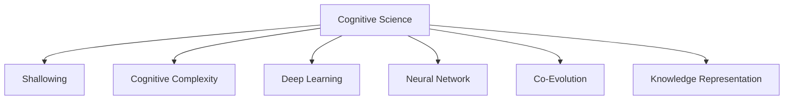

                 

# 认知发展中的浅薄与复杂

> 关键词：认知科学, 浅薄化现象, 复杂性, 神经网络, 深度学习, 人机协同, 知识表示

## 1. 背景介绍

### 1.1 问题由来
认知科学的崛起，给人类理解自身认识世界的方式提供了全新的视角。然而，随着认知科学的发展，越来越多关于认知过程的学术讨论，开始触及到认知发展中“浅薄”与“复杂”的本质问题。

传统认知科学主要关注人类认知过程的内部机制和外部刺激的相互作用。随着计算机科学和大数据技术的发展，认知科学的研究范式开始扩展到人类与人工智能系统的协同认知。其中，深度学习和神经网络等技术，因其强大的学习能力，已经成为研究人机协同认知的主要工具。

尽管如此，我们必须承认，深度学习和神经网络模型在人类认知模拟过程中，存在一些难以回避的问题。一方面，这些模型过于复杂，难以为人类所理解。另一方面，这些模型又存在“浅薄化”现象，无法深入挖掘人类认知的多层次复杂性。因此，认知科学研究的未来，需要人类和人工智能系统的协同进化，构建更为丰富、深刻的人类认知模型。

## 2. 核心概念与联系

### 2.1 核心概念概述

为更好地理解认知发展中的浅薄与复杂现象，本节将介绍几个密切相关的核心概念：

- **认知科学(Cognitive Science)**：研究认知过程及其内在机制的科学领域，包括人类、动物和机器的认知行为和认知结构。

- **浅薄化现象(Shallowing)**：在深度学习和神经网络等技术的应用过程中，模型往往会忽视复杂的上下文信息和背景知识，导致认知行为表面的浅薄化现象。

- **认知复杂性(Cognitive Complexity)**：人类认知的多层次、多维度结构，包括感知、记忆、推理、情绪等不同层面。

- **深度学习(Deep Learning)**：基于多层神经网络的学习范式，利用反向传播算法实现对数据的高效学习。

- **神经网络(Neural Network)**：模拟人脑神经元结构，通过多层连接实现信息的传递和处理。

- **人机协同(Co-evolution)**：人类与人工智能系统通过不断的交互，共同进化，达到更高的认知水平。

- **知识表示(Knowledge Representation)**：将人类认知中的知识结构化、形式化，便于计算机进行处理和推理。

这些核心概念之间的逻辑关系可以通过以下Mermaid流程图来展示：



这个流程图展示了几组核心概念之间的相互关系：

1. **认知科学**：作为研究人类认知机制的基础，为其他概念提供了研究的依据。
2. **浅薄化现象**：由于深度学习和神经网络模型的限制，认知过程存在浅薄化的风险。
3. **认知复杂性**：人类认知的多层次、多维度结构，是理解认知过程的关键。
4. **深度学习**：当前认知模拟的主要工具，但其模型本身可能存在浅薄化问题。
5. **神经网络**：深度学习的基础，实现复杂的特征提取与模式识别。
6. **人机协同**：人类与AI系统相互促进，共同进化的目标。
7. **知识表示**：将认知知识结构化，支持认知模拟和推理。

## 3. 核心算法原理 & 具体操作步骤
### 3.1 算法原理概述

认知发展中的浅薄与复杂问题，主要通过深度学习和神经网络等技术进行模拟。由于这些模型在处理复杂认知任务时存在浅薄化现象，因此在实践中需要结合认知科学的研究成果，进行模型优化和改进。

具体而言，深度学习和神经网络模型在认知模拟中，主要遵循以下几个原理：

1. **多层感知器(Multilayer Perceptron, MLP)**：通过多层神经元，模拟人类感知和记忆的多层次结构。

2. **反向传播(Backpropagation)**：利用误差反向传播，更新神经网络的权重，实现对数据的不断学习。

3. **参数共享(Parameter Sharing)**：通过共享某些层的参数，减少模型复杂度，提高训练效率。

4. **正则化(Regularization)**：通过L1正则、L2正则等方法，抑制模型过拟合，提升泛化能力。

5. **迁移学习(Transfer Learning)**：利用已训练的模型参数，在新任务上进行微调，减少训练时间和数据需求。

这些原理在认知模拟过程中，共同构成了深度学习模型的核心算法。然而，尽管这些算法在处理部分认知任务时取得了良好效果，但在处理复杂认知任务时，仍存在浅薄化现象。

### 3.2 算法步骤详解

认知模拟的深度学习模型一般包括以下几个关键步骤：

**Step 1: 数据收集与预处理**
- 收集关于认知过程的数据，包括感知、记忆、推理、情绪等。
- 对数据进行清洗、标注、归一化等预处理操作。

**Step 2: 模型设计与训练**
- 设计深度学习模型，选择合适的神经网络结构。
- 将预处理后的数据输入模型，进行前向传播和反向传播训练。
- 利用正则化、dropout等技术，抑制过拟合，提升泛化能力。

**Step 3: 模型评估与优化**
- 在测试集上评估模型的表现，计算误差、精度等指标。
- 根据评估结果，调整模型参数和超参数，进行迭代优化。
- 结合认知科学的研究成果，不断改进模型结构和训练过程。

**Step 4: 应用与反馈**
- 将训练好的模型应用于实际认知任务，进行推理和预测。
- 收集用户反馈，持续优化模型，提升性能。
- 通过人机协同，不断优化模型的认知表示能力。

### 3.3 算法优缺点

深度学习和神经网络模型在认知模拟中具有以下优点：

1. **高效学习能力**：能够处理大量复杂数据，从中学习丰富的模式和结构。
2. **实时推理能力**：可以快速推理和预测，支持实时应用。
3. **可扩展性**：模型结构灵活，易于扩展和优化。

同时，这些模型也存在一些缺点：

1. **过拟合风险**：在训练集规模较小的情况下，模型容易出现过拟合。
2. **黑盒性质**：模型的决策过程难以解释，难以理解模型的内部工作机制。
3. **浅薄化现象**：在处理复杂认知任务时，模型往往忽视背景知识，导致浅薄化现象。
4. **复杂性管理**：模型结构复杂，难以进行有效的参数管理和优化。

尽管存在这些缺点，但深度学习和神经网络模型仍然是当前认知模拟的主要工具，具有广泛的应用前景。未来，需要在理论和实践两方面，不断改进这些模型，克服其缺点。

### 3.4 算法应用领域

基于深度学习和神经网络模型的认知模拟，已经在多个领域得到应用，例如：

- **自然语言处理(Natural Language Processing, NLP)**：利用深度学习模型进行文本分类、情感分析、机器翻译等任务。
- **计算机视觉(Computer Vision)**：利用深度学习模型进行图像识别、目标检测、场景理解等任务。
- **智能推荐系统(Recommendation System)**：利用深度学习模型进行用户行为分析，推荐个性化内容。
- **智能游戏(AI Game)**：利用深度学习模型进行游戏策略规划和决策。
- **智能控制(Control System)**：利用深度学习模型进行智能控制和优化。

除了这些经典领域，深度学习和神经网络模型还在不断拓展应用场景，如生物信息学、社会网络分析、金融分析等，为认知模拟技术的发展提供了更多可能性。

## 4. 数学模型和公式 & 详细讲解  
### 4.1 数学模型构建

本节将使用数学语言对深度学习和神经网络模型进行严格的刻画。

记深度学习模型为 $f_{\theta}(x)$，其中 $x$ 为输入特征向量，$\theta$ 为模型参数。假设模型由多层神经网络组成，其中每一层包含若干个神经元，记为 $f_l(x)$。则模型的前向传播过程可以表示为：

$$
f_{\theta}(x) = f_L \circ f_{L-1} \circ \cdots \circ f_1(x)
$$

其中 $\circ$ 表示逐层组合。在每一层 $f_l(x)$ 中，输入 $x$ 经过权重矩阵 $W_l$ 和偏置向量 $b_l$ 的线性变换，然后经过激活函数 $g$ 进行非线性变换，最终输出特征 $x_l$：

$$
x_l = g(W_l x + b_l)
$$

在训练过程中，模型利用反向传播算法更新参数 $\theta$，最小化损失函数 $\mathcal{L}(f_{\theta}(x),y)$，其中 $y$ 为真实标签。损失函数的梯度计算公式为：

$$
\frac{\partial \mathcal{L}(f_{\theta}(x),y)}{\partial \theta} = \frac{\partial \mathcal{L}(f_{L} \circ f_{L-1} \cdots \circ f_1(x),y)}{\partial \theta}
$$

使用链式法则，可以递归计算每层网络的梯度，并通过优化算法更新参数。

### 4.2 公式推导过程

以下我们以二分类任务为例，推导逻辑回归模型的损失函数及其梯度的计算公式。

假设模型 $f_{\theta}$ 在输入 $x$ 上的输出为 $\hat{y}=f_{\theta}(x) \in [0,1]$，表示样本属于正类的概率。真实标签 $y \in \{0,1\}$。则二分类交叉熵损失函数定义为：

$$
\mathcal{L}(f_{\theta}(x),y) = -[y\log \hat{y} + (1-y)\log (1-\hat{y})]
$$

将 $f_{\theta}(x)$ 展开为多层感知器的形式，并利用链式法则计算损失函数对参数 $\theta_k$ 的梯度：

$$
\frac{\partial \mathcal{L}(f_{\theta}(x),y)}{\partial \theta_k} = \frac{\partial \mathcal{L}(f_{L} \circ f_{L-1} \cdots \circ f_1(x),y)}{\partial \theta_k}
$$

假设模型由 $L$ 层神经网络组成，每层使用 $g$ 为激活函数，则梯度计算公式为：

$$
\frac{\partial \mathcal{L}(f_{\theta}(x),y)}{\partial \theta_k} = \frac{\partial \mathcal{L}}{\partial z_{L}} \frac{\partial z_{L}}{\partial W_L^{(k)}} \frac{\partial W_L^{(k)}}{\partial \theta_k} + \frac{\partial \mathcal{L}}{\partial z_{L-1}} \frac{\partial z_{L-1}}{\partial W_{L-1}^{(k)}} \frac{\partial W_{L-1}^{(k)}}{\partial \theta_k} + \cdots + \frac{\partial \mathcal{L}}{\partial z_1} \frac{\partial z_1}{\partial W_1^{(k)}} \frac{\partial W_1^{(k)}}{\partial \theta_k}
$$

其中 $z_l$ 表示第 $l$ 层的输出特征，$W_l^{(k)}$ 表示第 $l$ 层到第 $l+1$ 层之间的权重矩阵。通过递归计算，可以得到最终损失函数的梯度公式。

### 4.3 案例分析与讲解

以图像分类为例，展示深度学习模型在图像识别中的应用。

假设输入为图像像素向量 $x \in \mathbb{R}^{d_x}$，输出为 $k$ 个类别的概率分布 $y \in \mathbb{R}^k$。使用卷积神经网络(CNN)作为模型结构，每一层使用 $g$ 为激活函数，则模型的前向传播过程可以表示为：

$$
f_{\theta}(x) = f_C \circ f_{P} \circ \cdots \circ f_1(x)
$$

其中 $f_C$ 表示卷积层，$f_P$ 表示池化层。每一层的输出特征 $x_l$ 可以表示为：

$$
x_l = g(W_l x + b_l)
$$

假设输出为 $k$ 个类别的概率分布，则模型的损失函数为交叉熵损失：

$$
\mathcal{L}(f_{\theta}(x),y) = -\frac{1}{N} \sum_{i=1}^N \sum_{j=1}^k y_{ij} \log f_{\theta}(x)_{ij}
$$

利用反向传播算法计算损失函数对参数 $\theta_k$ 的梯度：

$$
\frac{\partial \mathcal{L}(f_{\theta}(x),y)}{\partial \theta_k} = \frac{\partial \mathcal{L}}{\partial z_{L}} \frac{\partial z_{L}}{\partial W_L^{(k)}} \frac{\partial W_L^{(k)}}{\partial \theta_k} + \frac{\partial \mathcal{L}}{\partial z_{L-1}} \frac{\partial z_{L-1}}{\partial W_{L-1}^{(k)}} \frac{\partial W_{L-1}^{(k)}}{\partial \theta_k} + \cdots + \frac{\partial \mathcal{L}}{\partial z_1} \frac{\partial z_1}{\partial W_1^{(k)}} \frac{\partial W_1^{(k)}}{\partial \theta_k}
$$

在训练过程中，模型利用反向传播算法更新参数 $\theta$，最小化损失函数 $\mathcal{L}(f_{\theta}(x),y)$。当模型训练完成后，可以通过前向传播计算新输入 $x'$ 的输出概率 $y'$，得到分类结果。

## 5. 项目实践：代码实例和详细解释说明
### 5.1 开发环境搭建

在进行深度学习项目实践前，我们需要准备好开发环境。以下是使用Python进行TensorFlow开发的环境配置流程：

1. 安装Anaconda：从官网下载并安装Anaconda，用于创建独立的Python环境。

2. 创建并激活虚拟环境：
```bash
conda create -n tf-env python=3.8 
conda activate tf-env
```

3. 安装TensorFlow：根据CUDA版本，从官网获取对应的安装命令。例如：
```bash
conda install tensorflow -c pytorch -c conda-forge
```

4. 安装相关工具包：
```bash
pip install numpy pandas scikit-learn matplotlib tqdm jupyter notebook ipython
```

完成上述步骤后，即可在`tf-env`环境中开始深度学习项目实践。

### 5.2 源代码详细实现

下面我们以图像分类为例，给出使用TensorFlow和Keras实现卷积神经网络进行图像分类的完整代码实现。

首先，定义图像数据处理函数：

```python
from tensorflow.keras.preprocessing.image import ImageDataGenerator
from tensorflow.keras.preprocessing import sequence

def load_data(file_path, batch_size=32, num_classes=10):
    train_datagen = ImageDataGenerator(rescale=1./255)
    test_datagen = ImageDataGenerator(rescale=1./255)
    
    train_generator = train_datagen.flow_from_directory(
        file_path + '/train',
        target_size=(224, 224),
        batch_size=batch_size,
        class_mode='categorical')
    
    test_generator = test_datagen.flow_from_directory(
        file_path + '/test',
        target_size=(224, 224),
        batch_size=batch_size,
        class_mode='categorical')
    
    return train_generator, test_generator
```

然后，定义卷积神经网络模型：

```python
from tensorflow.keras.models import Sequential
from tensorflow.keras.layers import Conv2D, MaxPooling2D, Flatten, Dense

def build_model():
    model = Sequential()
    model.add(Conv2D(32, (3, 3), activation='relu', input_shape=(224, 224, 3)))
    model.add(MaxPooling2D((2, 2)))
    model.add(Conv2D(64, (3, 3), activation='relu'))
    model.add(MaxPooling2D((2, 2)))
    model.add(Conv2D(128, (3, 3), activation='relu'))
    model.add(MaxPooling2D((2, 2)))
    model.add(Flatten())
    model.add(Dense(256, activation='relu'))
    model.add(Dense(num_classes, activation='softmax'))
    
    return model
```

接着，定义训练和评估函数：

```python
from tensorflow.keras.optimizers import Adam
from tensorflow.keras.metrics import CategoricalAccuracy

def train_model(model, train_generator, test_generator, epochs=10, batch_size=32):
    model.compile(optimizer=Adam(), loss='categorical_crossentropy', metrics=[CategoricalAccuracy()])
    
    model.fit(train_generator, epochs=epochs, batch_size=batch_size)
    
    test_loss, test_accuracy = model.evaluate(test_generator)
    print(f'Test accuracy: {test_accuracy:.2f}')
    
    return model
```

最后，启动训练流程并在测试集上评估：

```python
file_path = 'path/to/dataset'
model = build_model()

train_generator, test_generator = load_data(file_path)
model = train_model(model, train_generator, test_generator)
```

以上就是使用TensorFlow和Keras实现卷积神经网络进行图像分类的完整代码实现。可以看到，得益于TensorFlow的强大封装，我们可以用相对简洁的代码完成图像分类的全过程。

### 5.3 代码解读与分析

让我们再详细解读一下关键代码的实现细节：

**load_data函数**：
- 定义了数据处理和数据生成器，用于批量读取和处理图像数据。

**build_model函数**：
- 定义了卷积神经网络的结构，包括卷积层、池化层和全连接层。

**train_model函数**：
- 定义了模型的编译、训练和评估过程，计算模型的损失和精度，并在测试集上评估模型的表现。

**训练流程**：
- 指定数据集路径和批量大小，定义模型结构。
- 定义数据生成器，读取和处理图像数据。
- 编译模型，设置优化器和损失函数。
- 训练模型，设置训练轮数和批量大小。
- 在测试集上评估模型，输出测试精度。

可以看到，TensorFlow和Keras使得深度学习模型的开发变得简洁高效。开发者可以将更多精力放在数据处理、模型改进等高层逻辑上，而不必过多关注底层的实现细节。

当然，工业级的系统实现还需考虑更多因素，如模型的保存和部署、超参数的自动搜索、更灵活的模型设计等。但核心的深度学习模型构建基本与此类似。

## 6. 实际应用场景
### 6.1 智能推荐系统

基于深度学习模型的智能推荐系统，已经成为电商、社交媒体等领域的标配。传统推荐系统往往依赖用户历史行为数据，难以捕捉用户的多维兴趣。而深度学习模型可以更好地捕捉用户复杂行为背后的特征，提升推荐精度。

在实践中，可以收集用户浏览、点击、购买等行为数据，结合物品的文本描述、属性等特征，在深度学习模型上进行训练。训练后的模型可以实时推理用户对物品的评分，生成个性化的推荐列表。此外，还可以通过知识图谱等结构化数据，提升推荐的准确性和多样性。

### 6.2 医学影像诊断

深度学习在医学影像诊断领域取得了显著成果。传统医学影像诊断往往需要大量经验丰富的专家进行评估，成本高、效率低。而深度学习模型可以自动学习医学影像的特征，快速诊断出病变区域，提升诊断效率。

在实践中，可以收集大量的医学影像数据，结合专家标注的病变信息，在深度学习模型上进行训练。训练后的模型可以对新医学影像进行自动诊断，生成诊断报告。此外，还可以通过融合知识图谱等结构化数据，提升诊断的准确性和可信度。

### 6.3 金融市场预测

深度学习在金融市场预测领域同样具备重要应用。传统金融市场预测依赖人工分析，难以应对海量的金融数据。而深度学习模型可以自动学习金融数据的内在规律，预测金融市场的走势。

在实践中，可以收集金融市场的历史数据，结合专家对市场走势的分析，在深度学习模型上进行训练。训练后的模型可以对新金融数据进行预测，生成市场走势的判断。此外，还可以通过融合知识图谱等结构化数据，提升预测的准确性和鲁棒性。

### 6.4 未来应用展望

随着深度学习和神经网络技术的不断发展，深度学习模型将在更多领域得到应用，为各行业带来变革性影响。

在智慧城市治理中，深度学习模型可以用于城市事件监测、舆情分析、应急指挥等环节，提高城市管理的自动化和智能化水平。在医疗领域，深度学习模型可以用于疾病诊断、基因分析等，提升医疗服务的智能化水平。

此外，深度学习模型还在生物信息学、社会网络分析、金融分析等多个领域具备重要应用，为认知模拟技术的发展提供了更多可能性。未来，随着深度学习模型的不断演进，深度学习将在更多场景中发挥重要作用，推动认知模拟技术的进步。

## 7. 工具和资源推荐
### 7.1 学习资源推荐

为了帮助开发者系统掌握深度学习模型的开发与优化，这里推荐一些优质的学习资源：

1. 《深度学习》（Ian Goodfellow等著）：经典深度学习入门书籍，系统介绍了深度学习的基本概念和算法。

2. CS231n《卷积神经网络》课程：斯坦福大学开设的计算机视觉课程，涵盖卷积神经网络的基本原理和应用。

3. CS224n《自然语言处理》课程：斯坦福大学开设的自然语言处理课程，涵盖深度学习在自然语言处理中的应用。

4. TensorFlow官方文档：TensorFlow的官方文档，提供了丰富的深度学习模型和算法，是学习和实践的重要参考资料。

5. PyTorch官方文档：PyTorch的官方文档，提供了强大的深度学习框架和工具，适合初学者和高级开发者。

6. Keras官方文档：Keras的官方文档，提供了简单易用的深度学习API，适合快速原型设计和开发。

通过对这些资源的学习实践，相信你一定能够快速掌握深度学习模型的开发与优化，并在实际应用中取得良好效果。

### 7.2 开发工具推荐

高效的开发离不开优秀的工具支持。以下是几款用于深度学习模型开发的常用工具：

1. TensorFlow：由Google主导开发的深度学习框架，功能丰富，支持GPU/TPU加速，适合大规模工程应用。

2. PyTorch：由Facebook开发的深度学习框架，灵活高效，适合学术研究和快速迭代。

3. Keras：基于TensorFlow和Theano的高级深度学习API，简单易用，适合初学者和快速原型设计。

4. Jupyter Notebook：开源的交互式编程环境，支持多种编程语言，适合数据分析和深度学习模型开发。

5. Visual Studio Code：轻量级的代码编辑器，支持语法高亮、自动补全等功能，适合快速编写和调试代码。

6. Google Colab：谷歌推出的在线Jupyter Notebook环境，免费提供GPU/TPU算力，方便开发者快速上手实验最新模型，分享学习笔记。

合理利用这些工具，可以显著提升深度学习模型的开发效率，加快创新迭代的步伐。

### 7.3 相关论文推荐

深度学习在认知模拟领域的研究源于学界的持续探索。以下是几篇奠基性的相关论文，推荐阅读：

1. Yann LeCun等：《Deep Learning》（2015）：综述性论文，介绍了深度学习的基本概念和应用，是深度学习的经典入门读物。

2. Yoshua Bengio等：《Representation Learning: A Review and New Perspectives》（2015）：综述性论文，讨论了深度学习在特征表示学习中的作用。

3. Geoffrey Hinton等：《Deep Learning》（2012）：综述性论文，介绍了深度学习的基本概念和应用。

4. Alex Krizhevsky等：《ImageNet Classification with Deep Convolutional Neural Networks》（2012）：经典的图像分类论文，介绍了卷积神经网络在图像分类中的成功应用。

5. Andrew Ng等：《Deep Learning》（2016）：MOOC课程讲义，涵盖深度学习的基本概念和算法。

6. Ian Goodfellow等：《Generative Adversarial Nets》（2014）：经典论文，介绍了生成对抗网络的基本原理和应用。

这些论文代表了大深度学习模型的研究脉络。通过学习这些前沿成果，可以帮助研究者把握学科前进方向，激发更多的创新灵感。

## 8. 总结：未来发展趋势与挑战

### 8.1 研究成果总结

深度学习在认知模拟领域的研究取得了显著成果，涵盖了图像识别、自然语言处理、推荐系统等多个领域。然而，深度学习模型在处理复杂认知任务时，仍存在浅薄化现象，难以深入挖掘人类认知的多层次结构。

未来，深度学习模型的优化需要结合认知科学的研究成果，进行更为深入的理论探索和实践验证。需要在模型设计、参数管理、训练优化等方面进行全面改进，才能更好地模拟人类认知过程，提升认知模拟的准确性和可靠性。

### 8.2 未来发展趋势

展望未来，深度学习模型的发展将呈现以下几个趋势：

1. **多层感知器优化**：优化多层感知器的结构，引入更多非线性变换，提升模型表达能力。

2. **深度强化学习**：结合强化学习算法，优化深度学习模型的决策过程，提升模型的鲁棒性和适应性。

3. **模型压缩和加速**：利用模型压缩、量化加速等技术，提升深度学习模型的推理速度和资源利用率。

4. **知识图谱融合**：将知识图谱等结构化数据与深度学习模型结合，提升模型的知识整合能力和推理能力。

5. **迁移学习优化**：优化迁移学习策略，减少预训练和微调过程的时间开销，提升模型的泛化能力。

6. **多模态学习**：结合视觉、语音、文本等多模态数据，提升深度学习模型的综合处理能力。

这些趋势将推动深度学习模型的不断演进，提升认知模拟技术的精准性和可靠性。

### 8.3 面临的挑战

尽管深度学习模型在认知模拟中取得了显著成果，但在处理复杂认知任务时仍存在诸多挑战：

1. **模型鲁棒性不足**：深度学习模型在处理复杂任务时，容易过拟合，泛化能力较差。如何提高模型的鲁棒性和泛化能力，是一个重要挑战。

2. **可解释性不足**：深度学习模型的决策过程难以解释，难以理解其内部工作机制。如何提高模型的可解释性，增强用户信任，是一个重要问题。

3. **资源瓶颈**：深度学习模型在大规模数据上的训练和推理，需要大量计算资源和时间，如何提高模型的资源利用率，是一个重要挑战。

4. **知识整合能力不足**：深度学习模型在处理结构化数据时，需要更多先验知识的支持。如何更好地整合外部知识，提升模型的知识整合能力，是一个重要问题。

5. **伦理和安全问题**：深度学习模型在处理敏感数据时，可能存在隐私泄露和安全风险。如何保护用户隐私，确保数据安全，是一个重要问题。

6. **负向迁移现象**：深度学习模型在处理复杂任务时，可能出现负向迁移现象，即浅薄化现象。如何避免负向迁移，提升模型的认知水平，是一个重要问题。

这些挑战需要学术界和工业界共同努力，进行更深入的理论探索和实践验证，才能推动深度学习模型向更深层次发展。

### 8.4 研究展望

面对深度学习模型在认知模拟中面临的挑战，未来的研究需要在以下几个方面寻求新的突破：

1. **理论研究**：进一步深化对认知过程的理解，探索更为复杂的认知模型，如递归神经网络、神经符号系统等。

2. **算法创新**：开发新的算法和优化技术，提升深度学习模型的表达能力和训练效率。

3. **数据优化**：优化数据收集和标注策略，提升数据的丰富性和多样性，减少负向迁移现象。

4. **模型压缩**：利用模型压缩、量化加速等技术，提升深度学习模型的推理速度和资源利用率。

5. **知识融合**：将知识图谱、逻辑规则等外部知识与深度学习模型结合，提升模型的知识整合能力和推理能力。

6. **人机协同**：结合认知科学的研究成果，探索人机协同的认知模型，提升系统的可靠性和安全性。

这些研究方向的探索，必将引领深度学习模型向更深层次发展，为构建智能、可信、安全的人类认知模型提供更多可能。面向未来，深度学习模型需要在理论与实践两方面不断突破，才能实现认知模拟技术的全面进步。

## 9. 附录：常见问题与解答

**Q1：深度学习模型在处理复杂认知任务时，容易出现浅薄化现象，该如何解决？**

A: 深度学习模型在处理复杂认知任务时，容易忽略背景知识和上下文信息，导致浅薄化现象。解决方法包括：

1. **多层次建模**：引入多层感知器结构，提升模型对复杂认知任务的表达能力。

2. **知识图谱融合**：将知识图谱等结构化数据与深度学习模型结合，提升模型的知识整合能力。

3. **迁移学习**：利用已训练的模型参数，在新任务上进行微调，提升模型的泛化能力。

4. **对抗训练**：引入对抗样本，提升模型的鲁棒性和泛化能力。

5. **知识推理**：结合认知科学的研究成果，设计更为复杂的推理规则，提升模型的推理能力。

**Q2：深度学习模型在处理复杂认知任务时，如何提高模型的鲁棒性？**

A: 提高深度学习模型的鲁棒性，可以从以下几个方面进行改进：

1. **正则化**：使用L2正则、Dropout等技术，抑制模型过拟合，提升泛化能力。

2. **对抗训练**：引入对抗样本，提升模型的鲁棒性和泛化能力。

3. **多模态学习**：结合视觉、语音、文本等多模态数据，提升模型的综合处理能力。

4. **迁移学习**：利用已训练的模型参数，在新任务上进行微调，提升模型的泛化能力。

5. **知识推理**：结合认知科学的研究成果，设计更为复杂的推理规则，提升模型的推理能力。

**Q3：深度学习模型在处理复杂认知任务时，如何提高模型的可解释性？**

A: 提高深度学习模型的可解释性，可以从以下几个方面进行改进：

1. **模型简化**：利用模型压缩、量化加速等技术，提升模型的推理速度和资源利用率。

2. **可视化工具**：使用可视化工具，展示模型的决策过程和中间特征，帮助理解模型的工作机制。

3. **模型融合**：结合认知科学的研究成果，设计更为复杂的推理规则，提升模型的可解释性。

4. **用户反馈**：收集用户反馈，持续优化模型，提升模型的可靠性。

5. **知识图谱**：结合知识图谱等结构化数据，提升模型的可解释性和推理能力。

**Q4：深度学习模型在处理复杂认知任务时，如何避免负向迁移现象？**

A: 避免深度学习模型在处理复杂认知任务时的负向迁移现象，可以从以下几个方面进行改进：

1. **多层次建模**：引入多层感知器结构，提升模型对复杂认知任务的表达能力。

2. **知识图谱融合**：将知识图谱等结构化数据与深度学习模型结合，提升模型的知识整合能力。

3. **迁移学习**：利用已训练的模型参数，在新任务上进行微调，提升模型的泛化能力。

4. **对抗训练**：引入对抗样本，提升模型的鲁棒性和泛化能力。

5. **知识推理**：结合认知科学的研究成果，设计更为复杂的推理规则，提升模型的推理能力。

**Q5：深度学习模型在处理复杂认知任务时，如何提高模型的知识整合能力？**

A: 提高深度学习模型的知识整合能力，可以从以下几个方面进行改进：

1. **知识图谱融合**：将知识图谱等结构化数据与深度学习模型结合，提升模型的知识整合能力。

2. **多模态学习**：结合视觉、语音、文本等多模态数据，提升模型的综合处理能力。

3. **迁移学习**：利用已训练的模型参数，在新任务上进行微调，提升模型的泛化能力。

4. **对抗训练**：引入对抗样本，提升模型的鲁棒性和泛化能力。

5. **知识推理**：结合认知科学的研究成果，设计更为复杂的推理规则，提升模型的推理能力。

**Q6：深度学习模型在处理复杂认知任务时，如何提高模型的知识推理能力？**

A: 提高深度学习模型的知识推理能力，可以从以下几个方面进行改进：

1. **知识图谱融合**：将知识图谱等结构化数据与深度学习模型结合，提升模型的知识整合能力。

2. **多模态学习**：结合视觉、语音、文本等多模态数据，提升模型的综合处理能力。

3. **迁移学习**：利用已训练的模型参数，在新任务上进行微调，提升模型的泛化能力。

4. **对抗训练**：引入对抗样本，提升模型的鲁棒性和泛化能力。

5. **知识推理**：结合认知科学的研究成果，设计更为复杂的推理规则，提升模型的推理能力。

通过这些改进措施，可以有效避免深度学习模型在处理复杂认知任务时的浅薄化现象，提升模型的表达能力、鲁棒性、可解释性和知识整合能力，更好地模拟人类认知过程。

---

作者：禅与计算机程序设计艺术 / Zen and the Art of Computer Programming

