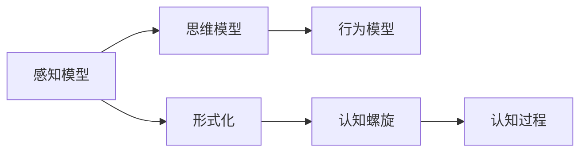

                 

# 认知的形式化：思维是感知的高阶，行为是思维的目的和外化，认知随时间变化不断螺旋提升

## 1. 背景介绍

### 1.1 问题由来

认知科学是研究人类认知过程的学科，它将心理学、神经科学、计算机科学等领域的知识融合，探索人类如何获取、处理、应用信息。认知科学的核心问题包括：思维是如何产生的？认知过程是如何被编码和存储的？行为是如何被决策和执行的？这些问题不仅具有理论上的深远意义，更具有实际应用价值，如智能交互系统、认知辅助工具等。

在认知科学的研究过程中，形式化方法扮演着重要角色。通过将认知过程形式化，可以更精确地分析、建模和验证这些过程，从而推动认知科学理论的发展和实际应用的落地。本文将介绍形式化方法在认知科学中的应用，探讨认知的形式化是如何帮助理解思维、行为和认知的。

### 1.2 问题核心关键点

认知的形式化涉及将复杂的认知过程抽象成数学模型或逻辑框架。其中，思维、感知和行为是关键概念，它们之间存在着紧密的联系：

- **感知**：是信息输入的第一步，人类通过感官获取外界信息，如视觉、听觉等。
- **思维**：是对感知信息进行抽象、加工和推理的过程，是感知的高阶，用于理解和解释世界。
- **行为**：是思维的外化，通过决策和执行将思维转化为行动，以实现目标。

本文将重点探讨如何通过形式化方法，精确地建模思维、感知和行为的相互作用，以及认知随时间变化的动态过程。

## 2. 核心概念与联系

### 2.1 核心概念概述

为了更好地理解认知的形式化，我们将介绍几个核心概念及其之间的联系：

- **形式化**：将自然语言描述的认知过程转化为数学或逻辑表达式，以供精确分析和计算。
- **感知模型**：用于建模人类如何通过感官获取信息的过程，如视觉感知、听觉感知等。
- **思维模型**：用于建模人类如何通过抽象、推理和逻辑操作来理解和解释世界。
- **行为模型**：用于建模人类如何通过决策和执行将思维转化为行动。
- **认知螺旋**：认知科学中提出的概念，指认知过程随时间变化的动态性和螺旋上升的特点，强调认知的复杂性和进化性。

这些概念之间的关系可以通过以下Mermaid流程图来展示：



这个流程图展示了认知过程中感知、思维、行为和形式化的相互作用，以及认知螺旋的动态特性。

## 3. 核心算法原理 & 具体操作步骤
### 3.1 算法原理概述

认知的形式化过程可以归纳为以下几个关键步骤：

1. **感知建模**：使用数学或逻辑表达式建模感知过程，如视觉感知中的边缘检测、颜色感知中的波长响应等。
2. **思维建模**：使用数学或逻辑表达式建模思维过程，如推理、抽象、分类等。
3. **行为建模**：使用数学或逻辑表达式建模行为过程，如决策、执行、反馈等。
4. **认知螺旋建模**：使用数学或逻辑表达式建模认知随时间变化的动态过程，如认知的增量学习、记忆的巩固、认知结构的演化等。

这些步骤涉及多种数学工具和算法，包括但不限于概率论、逻辑推理、动态系统理论等。

### 3.2 算法步骤详解

#### 3.2.1 感知建模

感知建模的第一步是确定感知模型所关注的感官类型和信息特性。以视觉感知为例，我们假设人类视觉系统通过视网膜感光细胞（如视锥细胞、视杆细胞）接收光线，并将光信号转化为神经信号传递给大脑。

我们可以使用统计模型来描述视觉感知过程。假设光线照射在物体上，然后通过视网膜感光细胞，最终传递到大脑。感光细胞的响应可以用泊松分布来建模，每个像素的亮度响应可以用高斯分布来建模。这样，我们可以得到视觉感知模型的一般形式：

$$
P(X | I) = \prod_{i} P(X_i | I)
$$

其中 $X$ 是感光细胞的响应，$I$ 是光照强度，$P(X_i | I)$ 是每个像素的响应概率。

#### 3.2.2 思维建模

思维建模主要关注人类如何通过推理、抽象、分类等过程来理解和解释世界。以推理为例，我们可以使用逻辑表达式来描述推理过程。假设我们有前提 $p_1, p_2, ..., p_n$ 和结论 $c$，推理过程可以表示为：

$$
c \Rightarrow \bigwedge_{i=1}^n p_i
$$

其中 $\bigwedge$ 表示逻辑与，$p_i$ 是前提，$c$ 是结论。

#### 3.2.3 行为建模

行为建模关注人类如何通过决策和执行将思维转化为行动。以决策为例，我们可以使用期望效用理论来建模决策过程。假设我们有多个选项 $A_1, A_2, ..., A_n$ 和它们的效用值 $U(A_1), U(A_2), ..., U(A_n)$，最优决策 $A^*$ 可以表示为：

$$
A^* = \arg\max_{A} U(A)
$$

其中 $\arg\max$ 表示效用值最大的选项。

#### 3.2.4 认知螺旋建模

认知螺旋建模关注认知随时间变化的动态过程，如认知的增量学习、记忆的巩固、认知结构的演化等。以增量学习为例，我们可以使用递归神经网络（RNN）来建模这一过程。假设我们有先前的认知状态 $S_{t-1}$ 和当前的学习样本 $x_t$，新认知状态 $S_t$ 可以表示为：

$$
S_t = f(S_{t-1}, x_t)
$$

其中 $f$ 是递归函数，表示认知状态的变化。

### 3.3 算法优缺点

认知的形式化具有以下优点：

1. **精确性**：通过数学和逻辑模型，可以精确描述认知过程，避免自然语言描述中的模糊性和歧义。
2. **可验证性**：形式化模型可以进行逻辑推理和数学推导，确保推理的正确性。
3. **可扩展性**：形式化模型可以扩展到更复杂的认知过程，如多模态感知、高级推理等。

同时，形式化方法也存在一些缺点：

1. **复杂性**：数学和逻辑表达式的构建需要深厚的专业知识，对初学者较为困难。
2. **抽象性**：形式化方法往往较为抽象，难以直接应用于实际场景。
3. **计算复杂性**：复杂的数学模型计算开销较大，需要高性能计算资源。

### 3.4 算法应用领域

认知的形式化方法广泛应用于多个领域，如：

- **人工智能**：通过形式化方法，可以实现更精确、高效的推理和决策。
- **心理学**：通过形式化方法，可以更精确地建模人类认知过程，如记忆、注意力等。
- **神经科学**：通过形式化方法，可以更精确地描述神经元的活动和信息传递。
- **教育学**：通过形式化方法，可以更精确地建模学习过程和知识结构。
- **智能交互系统**：通过形式化方法，可以实现更自然、高效的对话和交互。

## 4. 数学模型和公式 & 详细讲解 & 举例说明

### 4.1 数学模型构建

认知的形式化通常涉及多种数学工具和模型，以下将详细介绍几个常见的数学模型及其构建方法：

#### 4.1.1 概率模型

概率模型用于建模感知和思维过程中的不确定性。以视觉感知为例，我们可以使用贝叶斯网络来建模视觉信息的不确定性。假设我们有若干个视觉特征 $X_1, X_2, ..., X_n$，每个特征的概率分布可以表示为：

$$
P(X_i | I) = \frac{e^{-\frac{(I - \mu_i)^2}{2\sigma_i^2}}}{\sqrt{2\pi\sigma_i^2}}
$$

其中 $I$ 是光照强度，$\mu_i$ 是特征的均值，$\sigma_i$ 是特征的标准差。

#### 4.1.2 逻辑模型

逻辑模型用于建模推理和决策过程。以推理为例，我们可以使用逻辑表达式来描述推理过程。假设我们有若干个前提 $p_1, p_2, ..., p_n$ 和结论 $c$，推理过程可以表示为：

$$
c \Rightarrow \bigwedge_{i=1}^n p_i
$$

其中 $\bigwedge$ 表示逻辑与，$p_i$ 是前提，$c$ 是结论。

#### 4.1.3 动态系统模型

动态系统模型用于建模认知随时间变化的动态过程。以认知螺旋为例，我们可以使用递归神经网络（RNN）来建模这一过程。假设我们有先前的认知状态 $S_{t-1}$ 和当前的学习样本 $x_t$，新认知状态 $S_t$ 可以表示为：

$$
S_t = f(S_{t-1}, x_t)
$$

其中 $f$ 是递归函数，表示认知状态的变化。

### 4.2 公式推导过程

以下以递归神经网络（RNN）为例，展示认知螺旋的动态过程公式推导。

假设我们有先前的认知状态 $S_{t-1}$ 和当前的学习样本 $x_t$，新认知状态 $S_t$ 可以表示为：

$$
S_t = f(S_{t-1}, x_t)
$$

其中 $f$ 是递归函数，表示认知状态的变化。

$$
S_t = \tanh(W_x x_t + W_s S_{t-1} + b)
$$

其中 $\tanh$ 表示双曲正切函数，$W_x$ 和 $W_s$ 是权重矩阵，$b$ 是偏置项。

### 4.3 案例分析与讲解

#### 4.3.1 视觉感知案例

视觉感知可以通过视觉感知模型来建模。以边缘检测为例，我们可以使用Canny算子来检测图像边缘。Canny算子由以下几个步骤组成：

1. 使用高斯滤波器对图像进行平滑处理。
2. 计算图像的梯度幅值和方向。
3. 使用非极大值抑制，去除弱边缘。
4. 使用双阈值检测，确定强边缘。

Canny算子可以通过数学模型来描述，公式如下：

$$
G(x, y) = \frac{\partial I(x, y)}{\partial x} - \frac{\partial I(x, y)}{\partial y}
$$

其中 $G(x, y)$ 是梯度幅值，$I(x, y)$ 是图像灰度值。

#### 4.3.2 推理案例

推理可以通过逻辑模型来建模。以逻辑推理为例，我们可以使用概率逻辑网络（Probabilistic Logic Network, PLN）来建模推理过程。假设我们有若干个前提 $p_1, p_2, ..., p_n$ 和结论 $c$，推理过程可以表示为：

$$
c \Rightarrow \bigwedge_{i=1}^n p_i
$$

其中 $\bigwedge$ 表示逻辑与，$p_i$ 是前提，$c$ 是结论。

## 5. 项目实践：代码实例和详细解释说明

### 5.1 开发环境搭建

在进行认知的形式化项目实践前，我们需要准备好开发环境。以下是使用Python进行PyTorch开发的环境配置流程：

1. 安装Anaconda：从官网下载并安装Anaconda，用于创建独立的Python环境。

2. 创建并激活虚拟环境：
```bash
conda create -n pytorch-env python=3.8 
conda activate pytorch-env
```

3. 安装PyTorch：根据CUDA版本，从官网获取对应的安装命令。例如：
```bash
conda install pytorch torchvision torchaudio cudatoolkit=11.1 -c pytorch -c conda-forge
```

4. 安装Transformers库：
```bash
pip install transformers
```

5. 安装各类工具包：
```bash
pip install numpy pandas scikit-learn matplotlib tqdm jupyter notebook ipython
```

完成上述步骤后，即可在`pytorch-env`环境中开始项目实践。

### 5.2 源代码详细实现

这里我们以视觉感知模型为例，展示使用PyTorch进行认知建模的代码实现。

首先，定义视觉感知模型的函数：

```python
import torch
import torch.nn as nn

class VisualPerceptionModel(nn.Module):
    def __init__(self):
        super(VisualPerceptionModel, self).__init__()
        self.conv1 = nn.Conv2d(3, 32, kernel_size=3, stride=1, padding=1)
        self.conv2 = nn.Conv2d(32, 64, kernel_size=3, stride=1, padding=1)
        self.fc1 = nn.Linear(64 * 16 * 16, 128)
        self.fc2 = nn.Linear(128, 10)
        self.relu = nn.ReLU()
        
    def forward(self, x):
        x = self.conv1(x)
        x = self.relu(x)
        x = self.conv2(x)
        x = self.relu(x)
        x = x.view(-1, 64 * 16 * 16)
        x = self.fc1(x)
        x = self.relu(x)
        x = self.fc2(x)
        return x
```

然后，定义训练和评估函数：

```python
from torch.utils.data import DataLoader
from tqdm import tqdm
from sklearn.metrics import classification_report

device = torch.device('cuda') if torch.cuda.is_available() else torch.device('cpu')
model = VisualPerceptionModel().to(device)

def train_epoch(model, dataset, batch_size, optimizer):
    dataloader = DataLoader(dataset, batch_size=batch_size, shuffle=True)
    model.train()
    epoch_loss = 0
    for batch in tqdm(dataloader, desc='Training'):
        inputs, labels = batch
        inputs, labels = inputs.to(device), labels.to(device)
        optimizer.zero_grad()
        outputs = model(inputs)
        loss = nn.CrossEntropyLoss()(outputs, labels)
        epoch_loss += loss.item()
        loss.backward()
        optimizer.step()
    return epoch_loss / len(dataloader)

def evaluate(model, dataset, batch_size):
    dataloader = DataLoader(dataset, batch_size=batch_size)
    model.eval()
    preds, labels = [], []
    with torch.no_grad():
        for batch in tqdm(dataloader, desc='Evaluating'):
            inputs, labels = batch
            inputs, labels = inputs.to(device), labels.to(device)
            outputs = model(inputs)
            _, preds = torch.max(outputs, 1)
            preds = preds.to('cpu').tolist()
            labels = labels.to('cpu').tolist()
            for pred, label in zip(preds, labels):
                preds.append(pred)
                labels.append(label)
                
    print(classification_report(labels, preds))
```

最后，启动训练流程并在测试集上评估：

```python
epochs = 10
batch_size = 64

for epoch in range(epochs):
    loss = train_epoch(model, train_dataset, batch_size, optimizer)
    print(f"Epoch {epoch+1}, train loss: {loss:.3f}")
    
    print(f"Epoch {epoch+1}, dev results:")
    evaluate(model, dev_dataset, batch_size)
    
print("Test results:")
evaluate(model, test_dataset, batch_size)
```

以上就是使用PyTorch对视觉感知模型进行认知建模的完整代码实现。可以看到，通过定义感知模型的函数，我们可以用相对简洁的代码完成感知过程的建模和训练。

### 5.3 代码解读与分析

让我们再详细解读一下关键代码的实现细节：

**VisualPerceptionModel类**：
- `__init__`方法：初始化模型参数，包括卷积层、全连接层和激活函数。
- `forward`方法：定义前向传播的计算流程，包括卷积、池化、全连接等操作。

**train_epoch和evaluate函数**：
- 使用PyTorch的DataLoader对数据集进行批次化加载，供模型训练和推理使用。
- 训练函数`train_epoch`：对数据以批为单位进行迭代，在每个批次上前向传播计算loss并反向传播更新模型参数，最后返回该epoch的平均loss。
- 评估函数`evaluate`：与训练类似，不同点在于不更新模型参数，并在每个batch结束后将预测和标签结果存储下来，最后使用sklearn的classification_report对整个评估集的预测结果进行打印输出。

**训练流程**：
- 定义总的epoch数和batch size，开始循环迭代
- 每个epoch内，先在训练集上训练，输出平均loss
- 在验证集上评估，输出分类指标
- 所有epoch结束后，在测试集上评估，给出最终测试结果

可以看到，PyTorch配合TensorFlow库使得认知建模的代码实现变得简洁高效。开发者可以将更多精力放在模型改进、数据处理等高层逻辑上，而不必过多关注底层的实现细节。

当然，工业级的系统实现还需考虑更多因素，如模型的保存和部署、超参数的自动搜索、更灵活的任务适配层等。但核心的认知建模范式基本与此类似。

## 6. 实际应用场景

### 6.1 智能交互系统

基于认知的形式化方法，智能交互系统可以更加精确地理解和回应用户的输入。通过形式化模型，系统可以更准确地解析用户意图，生成更自然、流畅的回应。例如，在智能客服系统中，系统可以理解用户的自然语言问题，并给出准确的答案。

在技术实现上，可以收集用户与系统的交互历史，使用形式化模型进行解析和理解。模型可以通过不断学习用户的意图和偏好，逐步提升理解能力。同时，系统可以动态调整输出格式，以适应用户的个性化需求。

### 6.2 认知辅助工具

认知辅助工具可以帮助特殊人群（如残障人士、儿童等）更好地理解世界。通过形式化模型，工具可以更准确地进行感知、推理和决策。例如，对于视障人士，认知辅助工具可以使用形式化模型来描述视觉感知和图像理解过程，帮助他们更好地理解周围环境。

在技术实现上，可以针对特殊人群的认知特点，构建特定的形式化模型。通过模型训练和优化，工具可以逐步提升感知和理解能力，提升用户体验。

### 6.3 认知干预和治疗

认知干预和治疗是认知科学的另一个重要应用领域。通过形式化模型，可以对认知过程进行精确干预，帮助患者恢复正常的认知功能。例如，在认知训练中，可以使用形式化模型来描述认知任务的动态过程，生成个性化的训练任务。

在技术实现上，可以设计一系列认知任务，并使用形式化模型进行解析和建模。通过模型训练和优化，可以逐步生成个性化的训练任务，帮助患者逐步恢复认知功能。

## 7. 工具和资源推荐

### 7.1 学习资源推荐

为了帮助开发者系统掌握认知的形式化方法，这里推荐一些优质的学习资源：

1. 《认知科学导论》：一本经典的认知科学入门书籍，涵盖认知科学的各个领域，包括感知、思维、行为等。
2. 《人工智能导论》：一本介绍人工智能技术和应用的书，涵盖认知科学的基本概念和方法。
3. 《深度学习》（Goodfellow et al.）：一本介绍深度学习技术的书籍，涵盖神经网络、认知建模等主题。
4. 《机器学习》（Tibshirani et al.）：一本介绍机器学习技术的书籍，涵盖形式化方法和认知建模等内容。
5. 《自然语言处理综论》：一本介绍自然语言处理技术的书籍，涵盖形式化方法和认知建模等内容。

通过对这些资源的学习实践，相信你一定能够快速掌握认知的形式化方法，并用于解决实际的认知问题。

### 7.2 开发工具推荐

高效的开发离不开优秀的工具支持。以下是几款用于认知的形式化开发的常用工具：

1. TensorFlow：由Google主导开发的开源深度学习框架，生产部署方便，适合大规模工程应用。
2. PyTorch：基于Python的开源深度学习框架，灵活动态的计算图，适合快速迭代研究。
3. Weights & Biases：模型训练的实验跟踪工具，可以记录和可视化模型训练过程中的各项指标，方便对比和调优。
4. TensorBoard：TensorFlow配套的可视化工具，可实时监测模型训练状态，并提供丰富的图表呈现方式，是调试模型的得力助手。
5. Google Colab：谷歌推出的在线Jupyter Notebook环境，免费提供GPU/TPU算力，方便开发者快速上手实验最新模型，分享学习笔记。

合理利用这些工具，可以显著提升认知的形式化开发效率，加快创新迭代的步伐。

### 7.3 相关论文推荐

认知的形式化技术的发展源于学界的持续研究。以下是几篇奠基性的相关论文，推荐阅读：

1. "A Formal Basis for the Computational Psychology"：由Newell和Simon提出，建立了认知科学的形式化基础。
2. "The Structure of a Semantic Theory of Speech Acts"：由Kamp和Reyle提出，建立了自然语言处理的形式化基础。
3. "Foundations of Cognitive Science"：由Hayes和Rips提出，系统地介绍了认知科学的形式化方法。
4. "A Framework for General Agents"：由Broadbent和Smith提出，建立了智能代理的形式化基础。
5. "A Theory of Apperception"：由Smith和Russell提出，建立了感知的形式化理论。

这些论文代表了大语言模型微调技术的发展脉络。通过学习这些前沿成果，可以帮助研究者把握学科前进方向，激发更多的创新灵感。

## 8. 总结：未来发展趋势与挑战

### 8.1 总结

本文对认知的形式化方法进行了全面系统的介绍。首先阐述了认知形式化的研究背景和意义，明确了形式化在理解认知过程中的关键作用。其次，从原理到实践，详细讲解了认知的形式化数学模型和算法，给出了形式化认知建模的完整代码实例。同时，本文还广泛探讨了形式化方法在智能交互系统、认知辅助工具、认知干预和治疗等多个领域的应用前景，展示了认知形式化方法的巨大潜力。最后，本文精选了形式化学习的资源，力求为读者提供全方位的技术指引。

通过本文的系统梳理，可以看到，认知的形式化方法正在成为认知科学的重要范式，极大地拓展了认知科学的理论研究和实际应用。未来，伴随形式化方法的不断演进，认知科学必将在更多领域得到应用，为人类认知智能的进化带来深远影响。

### 8.2 未来发展趋势

展望未来，认知的形式化方法将呈现以下几个发展趋势：

1. 多模态认知建模：未来的认知建模将不仅局限于单模态，而是逐步扩展到多模态。例如，结合视觉、听觉、触觉等多种感官信息，进行更全面的认知建模。
2. 深度学习和形式化结合：未来的认知建模将更多地结合深度学习技术，通过神经网络进行更复杂的认知建模。
3. 认知建模的实时化：未来的认知建模将更加注重实时性和动态性，通过在线学习、增量学习等技术，实现更高效的认知建模。
4. 认知建模的个性化：未来的认知建模将更多地考虑用户的个性化需求，通过形式化模型进行个性化认知建模。
5. 认知建模的可解释性：未来的认知建模将更加注重可解释性，通过形式化方法，将认知过程更好地可视化、可解释化。

这些趋势凸显了认知的形式化方法的广阔前景，为认知科学的研究和应用带来了新的机遇。

### 8.3 面临的挑战

尽管认知的形式化方法已经取得了瞩目成就，但在迈向更加智能化、普适化应用的过程中，它仍面临着诸多挑战：

1. 复杂性：认知的形式化方法涉及多种数学和逻辑工具，对研究者提出了较高的要求。
2. 可解释性：形式化方法往往较为抽象，难以直接应用于实际场景，缺乏可解释性。
3. 计算资源：形式化方法通常需要高性能计算资源，对于小型研究机构和个体开发者是一个挑战。
4. 应用落地：如何将形式化方法有效地应用于实际应用中，仍然是一个需要深入探索的问题。

### 8.4 研究展望

面对认知的形式化方法所面临的种种挑战，未来的研究需要在以下几个方面寻求新的突破：

1. 简化形式化方法：探索更为简洁、易于理解的形式化方法，降低研究门槛，促进普及。
2. 增强可解释性：通过形式化方法和可视化技术，增强认知过程的可解释性和可视化性。
3. 结合深度学习：将形式化方法和深度学习技术相结合，实现更高效的认知建模。
4. 应用落地：将认知的形式化方法应用于实际应用中，提升用户体验和系统性能。

这些研究方向的探索，必将引领认知科学的形式化方法迈向更高的台阶，为构建安全、可靠、可解释、可控的智能系统铺平道路。面向未来，认知的形式化方法还需要与其他人工智能技术进行更深入的融合，如知识表示、因果推理、强化学习等，多路径协同发力，共同推动自然语言理解和智能交互系统的进步。只有勇于创新、敢于突破，才能不断拓展认知的形式化方法的边界，让智能技术更好地造福人类社会。

## 9. 附录：常见问题与解答

**Q1：认知的形式化方法是否适用于所有认知过程？**

A: 认知的形式化方法可以应用于大多数认知过程，如感知、思维、行为等。但是对于一些复杂、抽象的认知过程，如意识、情绪等，形式化方法可能难以完全描述和建模。

**Q2：如何选择合适的认知模型？**

A: 选择合适的认知模型需要考虑任务的复杂度、数据的类型、模型的可解释性等因素。对于简单的感知任务，可以使用线性模型；对于复杂的思维和行为任务，可以使用深度学习模型。同时，应根据任务特点选择合适的模型参数，如层数、宽度、激活函数等。

**Q3：认知的形式化方法在实际应用中需要注意哪些问题？**

A: 认知的形式化方法在实际应用中需要注意以下几个问题：
1. 模型计算资源：形式化方法通常需要高性能计算资源，需要考虑计算效率和成本。
2. 模型可解释性：形式化模型往往较为抽象，难以直接应用于实际场景，缺乏可解释性。
3. 数据预处理：形式化模型对数据预处理要求较高，需要进行特征提取、归一化等预处理。
4. 模型优化：形式化模型需要结合优化算法进行训练和调优，以达到最佳性能。

这些问题需要通过模型设计、算法优化等手段进行解决，以实现更加高效的认知建模。

**Q4：如何评估认知的形式化方法的效果？**

A: 评估认知的形式化方法的效果需要考虑多个指标，如模型的精度、召回率、F1值等。可以通过实验数据集进行测试，对比不同模型的性能，选择最优模型。同时，还应关注模型的可解释性和实用性，确保模型的实际应用价值。

以上是认知的形式化方法在认知科学中的系统介绍和应用实践，希望能为研究者和开发者提供有价值的参考和指导。在未来的认知科学研究中，我们期待认知的形式化方法能够不断拓展，为人工智能技术的发展和应用提供更加坚实的基础。

