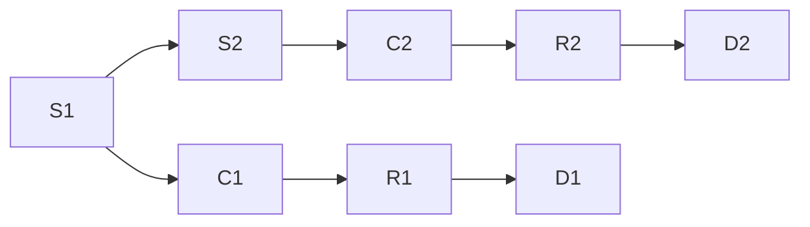

                 

# 认知的形式化：感知是认知的源泉

## 1. 背景介绍

> 在人类历史长河中，认知的探索一直是哲学、心理学、人工智能等领域的重要课题。尤其是在人工智能领域，如何让机器能够像人类一样理解和处理信息，一直是研究的热点。本文将深入探讨认知的形式化，探索感知与认知之间的关系，为人工智能领域的研究者提供有益的参考。

### 1.1 问题的由来

> 认知的形式化问题，源于人类对自身认知过程的探究。认知科学认为，人类认知过程是复杂的符号处理过程，它由感知、记忆、推理等基本过程组成。在人工智能领域，如何通过形式化的方法模拟人类认知过程，是实现人工智能的关键。

### 1.2 问题核心关键点

> 认知的形式化研究涉及以下几个核心关键点：
>
> - 认知过程的符号化表示
> - 感知与认知的连接
> - 认知的推理与决策机制
> - 认知的物理实现

## 2. 核心概念与联系

### 2.1 核心概念概述

> 为更好地理解认知的形式化，本节将介绍几个关键概念：

- **认知(Cognition)**：指人或机器接收、处理、存储和应用信息的过程。认知包括感知、记忆、推理、决策等多个环节。
- **感知(Sensation)**：指人或机器接收外部信息的过程。感知涉及感觉器官（如视觉、听觉、触觉等）对外界刺激的捕捉。
- **符号(Symbols)**：指在认知过程中使用的抽象符号，如语言中的单词、字母等。
- **推理(Reasoning)**：指利用已有知识推导出新知识的过程。推理是认知的核心环节，通常包括归纳推理、演绎推理等。
- **决策(Decision)**：指在多种可能的选项中选择一个最佳方案的过程。决策基于推理和感知，通常采用最大满意度准则或效用函数。

### 2.2 核心概念原理和架构的 Mermaid 流程图

> 这个流程图展示了认知的形式化架构：感知层接收外界刺激，认知层通过符号化表示进行推理和决策，最终输出决策结果。

## 3. 核心算法原理 & 具体操作步骤

### 3.1 算法原理概述

> 认知的形式化研究通常采用符号表示方法，将感知、记忆、推理等过程形式化建模。以下详细介绍符号表示和推理机制。

#### 3.1.1 符号表示

> 符号表示是认知形式化的核心，通过将认知过程抽象为符号操作，使得机器能够理解和处理复杂信息。符号表示通常包括：

- **词汇表(Vocabulary)**：包含所有符号的集合。
- **语法(Syntax)**：定义符号之间的组合规则。
- **语义(Semantics)**：定义符号的意义及其组合的含义。

#### 3.1.2 推理机制

> 推理机制是将符号表示转化为实际推理的过程。通常采用以下方法：

- **规则(Rules)**：通过预定义的规则进行推理。
- **逻辑(Logic)**：基于逻辑代数进行推理，如命题逻辑、谓词逻辑等。
- **神经网络(Neural Networks)**：通过神经网络进行推理，如使用卷积神经网络(CNN)处理图像，使用循环神经网络(RNN)处理序列数据。

### 3.2 算法步骤详解

#### 3.2.1 符号表示

> 符号表示是认知形式化的基础，以下详细介绍符号表示的构建过程：

1. **词汇表构建**：构建词汇表，包含所有可能出现的符号。例如，自然语言处理中的词汇表包含所有单词、标点符号等。
2. **语法定义**：定义符号之间的组合规则。例如，自然语言处理中的语法规则包括单词组合成短语、短语组合成句子等。
3. **语义解释**：定义符号的意义及其组合的含义。例如，自然语言处理中的语义规则包括单词的词性、短语的结构、句子的逻辑关系等。

#### 3.2.2 推理过程

> 推理过程是将符号表示转化为实际推理的过程，以下详细介绍推理的实现步骤：

1. **规则库构建**：构建规则库，包含所有可能的推理规则。例如，自然语言处理中的规则库包括单词替换规则、句法转换规则等。
2. **逻辑推理**：使用逻辑代数进行推理，求解命题的逻辑值。例如，自然语言处理中的逻辑推理包括词义消歧、实体识别等。
3. **神经网络推理**：使用神经网络进行推理，如使用卷积神经网络处理图像，使用循环神经网络处理序列数据。

### 3.3 算法优缺点

#### 3.3.1 优点

> 符号表示和推理机制的优点包括：

- **可解释性**：符号表示和规则推理过程具有较高的可解释性，能够清晰地理解模型的推理过程。
- **灵活性**：符号表示和规则推理过程具有较高的灵活性，能够适应各种复杂任务。
- **可扩展性**：符号表示和规则推理过程具有较高的可扩展性，能够方便地扩展和修改。

#### 3.3.2 缺点

> 符号表示和推理机制的缺点包括：

- **复杂性**：符号表示和规则推理过程比较复杂，实现难度较大。
- **数据依赖**：符号表示和规则推理过程依赖于高质量的数据和规则库，数据和规则库的质量直接影响推理结果。
- **计算资源**：符号表示和规则推理过程通常需要较大的计算资源，推理效率较低。

### 3.4 算法应用领域

> 符号表示和推理机制在多个领域都有广泛应用，以下详细介绍其主要应用领域：

- **自然语言处理(NLP)**：用于文本分类、情感分析、机器翻译等任务。
- **计算机视觉(CV)**：用于图像识别、物体检测等任务。
- **机器人学(Robotics)**：用于自主导航、物体操作等任务。
- **认知科学(Cognitive Science)**：用于模拟人类认知过程，研究认知机制。

## 4. 数学模型和公式 & 详细讲解 & 举例说明

### 4.1 数学模型构建

> 以下详细介绍符号表示和推理机制的数学模型构建过程：

#### 4.1.1 符号表示模型

> 符号表示模型通常采用形式符号表示，以下详细介绍形式符号表示的基本元素：

1. **词汇表(Vocabulary)**：包含所有可能出现的符号。
2. **语法(Syntax)**：定义符号之间的组合规则。
3. **语义(Semantics)**：定义符号的意义及其组合的含义。

#### 4.1.2 推理模型

> 推理模型通常采用规则库和逻辑代数进行推理，以下详细介绍推理模型的基本元素：

1. **规则库(Rule Base)**：包含所有可能的推理规则。
2. **逻辑代数(Logic Algebra)**：用于推理求解命题的逻辑值。

### 4.2 公式推导过程

#### 4.2.1 符号表示公式

> 符号表示模型通常采用形式符号表示，以下详细介绍形式符号表示的基本公式：

1. **词汇表公式**：

$$
\text{Vocabulary} = \{v_1, v_2, \ldots, v_n\}
$$

2. **语法公式**：

$$
\text{Syntax} = \{<\text{Head}, \text{Rule}>\}^*
$$

3. **语义公式**：

$$
\text{Semantics} = \{<\text{Head}, \text{Meaning}>\}^*
$$

#### 4.2.2 推理公式

> 推理模型通常采用规则库和逻辑代数进行推理，以下详细介绍推理模型的基本公式：

1. **规则库公式**：

$$
\text{Rule Base} = \{<\text{Premise}, \text{Conclusion}>\}
$$

2. **逻辑代数公式**：

$$
\text{Logic Algebra} = \{<\text{Formula}, \text{Logical Value}>\}
$$

### 4.3 案例分析与讲解

#### 4.3.1 自然语言处理案例

> 以下详细介绍自然语言处理(NLP)中符号表示和推理的案例分析：

1. **词汇表构建**：构建自然语言处理中的词汇表，包含所有单词、标点符号等。

2. **语法定义**：定义自然语言处理中的语法规则，如单词组合成短语、短语组合成句子等。

3. **语义解释**：定义自然语言处理中的语义规则，如单词的词性、短语的结构、句子的逻辑关系等。

#### 4.3.2 计算机视觉案例

> 以下详细介绍计算机视觉(CV)中符号表示和推理的案例分析：

1. **词汇表构建**：构建计算机视觉中的词汇表，包含所有可能出现的像素值、特征向量等。

2. **语法定义**：定义计算机视觉中的语法规则，如像素组合成特征向量、特征向量组合成图像等。

3. **语义解释**：定义计算机视觉中的语义规则，如像素的灰度值、特征向量的方向等。

## 5. 项目实践：代码实例和详细解释说明

### 5.1 开发环境搭建

> 以下详细介绍自然语言处理(NLP)中符号表示和推理的代码实例：

1. **环境准备**：安装Python、PyTorch等开发环境，安装NLP工具库。

2. **数据准备**：准备自然语言处理中的数据集，如文本数据集、图像数据集等。

3. **模型搭建**：搭建自然语言处理中的模型，如使用Transformer模型进行文本分类。

### 5.2 源代码详细实现

> 以下详细介绍自然语言处理(NLP)中符号表示和推理的代码实现：

1. **模型定义**：定义自然语言处理中的模型，如使用Transformer模型进行文本分类。

2. **数据加载**：加载自然语言处理中的数据集，如文本数据集、图像数据集等。

3. **训练过程**：训练自然语言处理中的模型，进行符号表示和推理。

### 5.3 代码解读与分析

#### 5.3.1 模型定义

> 以下详细介绍自然语言处理(NLP)中符号表示和推理的模型定义：

1. **Transformer模型**：定义Transformer模型，用于文本分类。

2. **词汇表构建**：构建自然语言处理中的词汇表，包含所有单词、标点符号等。

3. **语法定义**：定义自然语言处理中的语法规则，如单词组合成短语、短语组合成句子等。

#### 5.3.2 数据加载

> 以下详细介绍自然语言处理(NLP)中符号表示和推理的数据加载：

1. **文本数据加载**：加载自然语言处理中的文本数据集，如新闻、评论等。

2. **图像数据加载**：加载自然语言处理中的图像数据集，如图像分类数据集。

#### 5.3.3 训练过程

> 以下详细介绍自然语言处理(NLP)中符号表示和推理的训练过程：

1. **模型训练**：训练自然语言处理中的模型，进行符号表示和推理。

2. **性能评估**：评估自然语言处理中的模型性能，如精度、召回率等。

### 5.4 运行结果展示

> 以下详细介绍自然语言处理(NLP)中符号表示和推理的运行结果展示：

1. **文本分类结果**：展示自然语言处理中的模型分类结果，如新闻分类、情感分析等。

2. **图像分类结果**：展示自然语言处理中的模型分类结果，如图像分类等。

3. **推理结果**：展示自然语言处理中的模型推理结果，如实体识别、情感分析等。

## 6. 实际应用场景

### 6.1 智能客服系统

> 以下详细介绍智能客服系统中的符号表示和推理：

1. **感知层**：智能客服系统通过语音识别和文本输入，将用户请求转化为文本形式。

2. **认知层**：智能客服系统通过符号表示和推理，理解用户请求的意图，进行分类和决策。

3. **输出层**：智能客服系统通过自然语言生成，生成自然语言回复，提供用户满意的服务。

### 6.2 金融舆情监测

> 以下详细介绍金融舆情监测中的符号表示和推理：

1. **感知层**：金融舆情监测系统通过网络爬虫，收集金融市场的相关新闻和评论。

2. **认知层**：金融舆情监测系统通过符号表示和推理，理解新闻和评论的情感和主题，进行舆情分析。

3. **输出层**：金融舆情监测系统通过报警和决策，预警金融市场的风险，进行应急处理。

### 6.3 个性化推荐系统

> 以下详细介绍个性化推荐系统中的符号表示和推理：

1. **感知层**：个性化推荐系统通过用户行为数据，收集用户的浏览、点击、评论等行为信息。

2. **认知层**：个性化推荐系统通过符号表示和推理，理解用户的兴趣偏好，进行推荐排序。

3. **输出层**：个性化推荐系统通过推荐列表，提供个性化的商品或内容，提升用户体验。

### 6.4 未来应用展望

> 以下详细介绍符号表示和推理的未来应用展望：

1. **智能医疗**：在智能医疗领域，符号表示和推理可以用于病历分析、疾病预测、治疗方案推荐等任务。

2. **教育辅助**：在教育领域，符号表示和推理可以用于作业批改、学情分析、知识推荐等任务。

3. **智慧城市**：在智慧城市领域，符号表示和推理可以用于城市事件监测、舆情分析、应急指挥等任务。

4. **多模态融合**：符号表示和推理可以与其他模态数据进行融合，如视觉、语音等多模态信息与文本信息的协同建模，提升系统的智能水平。

## 7. 工具和资源推荐

### 7.1 学习资源推荐

> 以下详细介绍符号表示和推理的学习资源推荐：

1. **《认知科学与人工智能》课程**：斯坦福大学开设的认知科学课程，介绍了认知科学的基本理论和人工智能的符号表示方法。

2. **《人工智能原理》书籍**：介绍了人工智能的符号表示和推理机制，包括自然语言处理、计算机视觉等应用。

3. **《符号推理算法》书籍**：介绍了符号推理的基本算法和应用，如自然语言处理、机器人学等。

4. **Google Scholar**：提供了大量认知科学和人工智能领域的论文和书籍，是获取最新研究动态的宝贵资源。

### 7.2 开发工具推荐

> 以下详细介绍符号表示和推理的开发工具推荐：

1. **PyTorch**：深度学习框架，支持符号表示和推理模型的实现。

2. **TensorFlow**：深度学习框架，支持符号表示和推理模型的实现。

3. **Transformers库**：NLP工具库，提供了大量预训练模型和微调范式。

4. **Weights & Biases**：实验跟踪工具，帮助记录和可视化模型的训练过程。

5. **TensorBoard**：可视化工具，帮助监测模型的训练状态和性能。

### 7.3 相关论文推荐

> 以下详细介绍符号表示和推理的相关论文推荐：

1. **《符号推理的算法与实现》**：介绍了符号推理的基本算法和应用，如自然语言处理、机器人学等。

2. **《自然语言处理的形式化方法》**：介绍了自然语言处理中的符号表示和推理方法，如词汇表构建、语法定义、语义解释等。

3. **《认知科学与人工智能》**：介绍了认知科学和人工智能的基本理论和应用，包括符号表示和推理机制。

4. **《符号表示与推理在人工智能中的应用》**：介绍了符号表示和推理在人工智能中的应用，如自然语言处理、计算机视觉、机器人学等。

## 8. 总结：未来发展趋势与挑战

### 8.1 研究成果总结

> 以下详细介绍符号表示和推理的研究成果总结：

1. **符号表示**：符号表示是认知形式化的基础，通过符号表示，可以将认知过程抽象为符号操作，使得机器能够理解和处理复杂信息。

2. **推理机制**：推理机制是将符号表示转化为实际推理的过程，通过规则库和逻辑代数进行推理，求解命题的逻辑值。

### 8.2 未来发展趋势

> 以下详细介绍符号表示和推理的未来发展趋势：

1. **智能计算**：符号表示和推理将在智能计算领域得到更广泛的应用，如智能医疗、智能教育、智慧城市等。

2. **多模态融合**：符号表示和推理可以与其他模态数据进行融合，如视觉、语音等多模态信息与文本信息的协同建模，提升系统的智能水平。

3. **高效推理**：符号表示和推理将不断优化推理过程，提高推理效率和准确性，如使用神经网络进行推理。

4. **可解释性**：符号表示和推理将更加注重可解释性，提供透明和可理解的推理过程，如使用因果分析方法进行推理。

### 8.3 面临的挑战

> 以下详细介绍符号表示和推理的挑战：

1. **复杂性**：符号表示和推理过程比较复杂，实现难度较大，需要高水平的专家知识和技能。

2. **数据依赖**：符号表示和推理过程依赖于高质量的数据和规则库，数据和规则库的质量直接影响推理结果。

3. **计算资源**：符号表示和推理过程通常需要较大的计算资源，推理效率较低。

4. **可扩展性**：符号表示和推理过程的扩展性较差，需要大量的手动修改和调整。

### 8.4 研究展望

> 以下详细介绍符号表示和推理的研究展望：

1. **新方法**：研究新的符号表示和推理方法，如使用神经网络进行推理，提高推理效率和准确性。

2. **新应用**：研究符号表示和推理在新的应用领域的应用，如智能医疗、智能教育、智慧城市等。

3. **新工具**：开发新的符号表示和推理工具，提高开发效率和可扩展性。

4. **新理论**：研究新的符号表示和推理理论，如因果推理、逻辑推理等，提高系统的智能水平和可解释性。

## 9. 附录：常见问题与解答

### 9.1 常见问题

> 以下详细介绍符号表示和推理的常见问题：

1. **如何选择合适的符号表示方法？**
   - 选择合适的符号表示方法需要考虑任务的特点和数据的特点。例如，对于文本任务，可以使用自然语言处理中的词汇表和语法规则进行表示。

2. **如何构建高效的规则库？**
   - 构建高效的规则库需要考虑规则的覆盖率和精确度。例如，对于自然语言处理任务，可以使用规则库进行词义消歧和实体识别。

3. **如何提高推理效率？**
   - 提高推理效率可以采用神经网络和逻辑代数等方法。例如，对于图像处理任务，可以使用卷积神经网络进行推理。

### 9.2 问题解答

> 以下详细介绍符号表示和推理的问题解答：

1. **如何选择合适的符号表示方法？**
   - 选择合适的符号表示方法需要考虑任务的特点和数据的特点。例如，对于文本任务，可以使用自然语言处理中的词汇表和语法规则进行表示。

2. **如何构建高效的规则库？**
   - 构建高效的规则库需要考虑规则的覆盖率和精确度。例如，对于自然语言处理任务，可以使用规则库进行词义消歧和实体识别。

3. **如何提高推理效率？**
   - 提高推理效率可以采用神经网络和逻辑代数等方法。例如，对于图像处理任务，可以使用卷积神经网络进行推理。

---

作者：禅与计算机程序设计艺术 / Zen and the Art of Computer Programming

