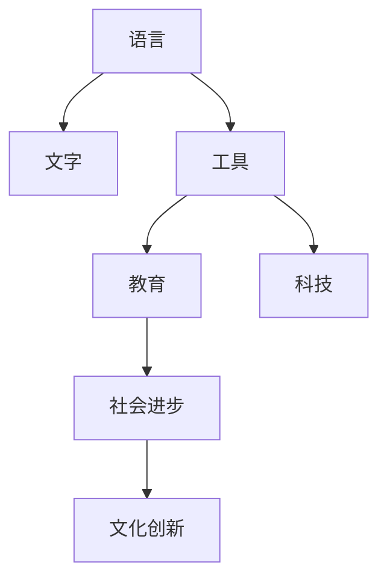

                 

# 认知的形式化：近10000年以来，人类发明了语言、文字、工具、教育、科技，产生了文化和文明

## 1. 背景介绍

### 1.1 问题由来
人类文明的发展史，本质上是认知过程不断形式化的历史。从远古的口耳相传到现代的互联网、AI，每一步技术突破都深刻地影响着人类的认知模式。认知的形式化，即用形式化的方法来描述和处理人类的知识和思想，是推动科技进步和文明进步的关键。

### 1.2 问题核心关键点
认知的形式化包括语言、文字、工具、教育、科技等多个方面。这些技术进步共同构成了人类文明的基础。语言和文字是认知形式化的最初形态，工具和教育则推动了知识传播和技能传承，而科技的进步更是带来了认知能力的质的飞跃。本文将探讨这些关键技术进步背后的原理和应用，分析它们对人类文明的影响，并展望未来的发展趋势。

### 1.3 问题研究意义
理解认知的形式化过程，对于认识人类文明的发展规律、优化知识传播和技能传承机制、推动科技发展具有重要意义：

1. **优化知识传播**：通过形式化技术，可以更系统、更高效地传播知识，减少错误和误解。
2. **促进技能传承**：形式化教育能帮助学习者更好地掌握复杂技能，加快技能传承速度。
3. **加速科技发展**：形式化方法使得复杂的科学理论能够被广泛理解和应用，推动科技的快速进步。
4. **增强文明韧性**：通过形式化，文明的智慧得以保存和传承，使得人类能够抵御外部冲击和自然灾害。
5. **推动文化创新**：形式化技术使得跨文化交流更加容易，促进了全球文化的多样性和融合。

## 2. 核心概念与联系

### 2.1 核心概念概述

为更好地理解认知形式化的各个方面，本节将介绍几个关键概念及其联系：

- **语言 (Language)**：是人类沟通思想的工具，其形式化基础在于语法和语义。
- **文字 (Written Language)**：将口语语言的形式化表达记录下来，促进了知识传承和跨时代交流。
- **工具 (Tools)**：是人类认知过程的外部延伸，如数学、逻辑、算法等。
- **教育 (Education)**：通过形式化的知识传授，培养下一代的能力和思维方式。
- **科技 (Technology)**：利用形式化的方法和工具，解决实际问题，推动人类社会进步。

这些核心概念之间的逻辑关系可以通过以下Mermaid流程图来展示：



这个流程图展示了语言、文字、工具、教育和科技之间的相互关系：语言和文字是认知形式化的基础，工具和教育通过形式化方法提高人类认知能力，科技则将这种能力转化为生产力，推动社会进步和文化创新。

## 3. 核心算法原理 & 具体操作步骤
### 3.1 算法原理概述

认知的形式化通常涉及到符号逻辑、数学模型、计算理论等多个领域。本节将从符号逻辑的角度，简要概述认知形式化的一般原理。

在符号逻辑中，认知的形式化通常被描述为符号串（如公式、命题、函数等）的操作和变换。通过符号操作，我们可以将复杂的认知过程抽象为简单的形式化模型，进而进行分析和推理。

### 3.2 算法步骤详解

1. **符号定义**：
   - **原子符号**：如$a,b,c$等，用于表示基本的认知元素。
   - **复合符号**：如$P(a)$表示$a$具有性质$P$，$Q(a,b)$表示$a$具有性质$Q$相对于$b$。
   - **函数符号**：如$f(a)$表示对$a$进行某种操作，$g(a,b)$表示$a$和$b$的某种组合。

2. **符号逻辑推理**：
   - **推理规则**：如蕴含规则$P(a) \rightarrow P(b)$，表示如果$a$具有性质$P$，则$b$也具有性质$P$。
   - **一致性检验**：如模型一致性定理，表示如果一组符号组合在某种逻辑规则下是一致的，则该组合在所有规则下都是一致的。

3. **形式化表示**：
   - **命题逻辑**：如$P(a) \land Q(b) \rightarrow R(c)$，表示如果$a$具有性质$P$且$b$具有性质$Q$，则$c$具有性质$R$。
   - **谓词逻辑**：如$P(a) \rightarrow Q(a)$，表示如果$a$具有性质$P$，则$a$也具有性质$Q$。

### 3.3 算法优缺点

认知的形式化方法具有以下优点：

- **形式化清晰**：符号逻辑的形式化语言清晰、精确，易于理解和推理。
- **可推理性**：通过符号逻辑的推理规则，可以自动化地进行形式化推理。
- **普适性强**：符号逻辑的规则和表示方法适用于多种认知形式化的场景。

同时，该方法也存在一定的局限性：

- **表达复杂性**：对于复杂的认知过程，形式化表达可能较为困难。
- **计算复杂性**：形式化推理的计算复杂度较高，可能不适用于大规模计算任务。
- **抽象性高**：形式化方法较为抽象，需要一定的数学和逻辑基础。

### 3.4 算法应用领域

认知的形式化方法广泛应用于逻辑学、计算机科学、人工智能等领域。

- **逻辑学**：如哥德尔的不完备性定理，通过形式化逻辑证明了逻辑系统的不完备性。
- **计算机科学**：如谓词逻辑和元编程，用于构造高级语言和编译器。
- **人工智能**：如知识表示和推理，用于智能系统的构建和决策支持。

## 4. 数学模型和公式 & 详细讲解 & 举例说明
### 4.1 数学模型构建

认知的形式化通常使用符号逻辑来描述和推理。下面以命题逻辑为例，构建一个简单的数学模型：

设$\Phi$为一组命题，$\Gamma$为$\Phi$的一个子集，$\Delta$为$\Phi$的另一个子集，$\Sigma$为$\Phi$上的一组符号，则命题逻辑模型为：

$$
\mathcal{M} = (\Phi, \Gamma, \Delta, \Sigma)
$$

其中$\Phi$为命题集合，$\Gamma$和$\Delta$为子集，$\Sigma$为符号集合。

### 4.2 公式推导过程

以命题逻辑的推理规则为例，考虑以下命题：

- $P(a)$：$a$具有性质$P$
- $Q(a)$：$a$具有性质$Q$
- $R(a)$：$a$具有性质$R$

根据命题逻辑的推理规则，可以得到以下推理链：

$$
P(a) \rightarrow Q(a) \\
Q(a) \rightarrow R(a)
$$

因此可以推出：

$$
P(a) \rightarrow R(a)
$$

这是一个典型的命题逻辑推理过程。

### 4.3 案例分析与讲解

假设有一个简单的认知过程，用于判断一个数的奇偶性：

- $x$为整数
- $x$为偶数：$P(x)$
- $x$为奇数：$Q(x)$

根据定义，$x$为偶数的等价条件为$x$能被2整除，即：

$$
P(x) \leftrightarrow \exists y. x = 2y
$$

通过命题逻辑的推理规则，可以得出以下结论：

- 如果$x$为偶数，则$x$必能被2整除，即$P(x) \rightarrow \exists y. x = 2y$
- 如果$x$为奇数，则$x$不能被2整除，即$Q(x) \rightarrow \forall y. x \neq 2y$

## 5. 项目实践：代码实例和详细解释说明
### 5.1 开发环境搭建

在进行认知形式化项目实践前，需要准备好开发环境。以下是使用Python进行SymPy开发的开发环境配置流程：

1. 安装Anaconda：从官网下载并安装Anaconda，用于创建独立的Python环境。

2. 创建并激活虚拟环境：
```bash
conda create -n sympy-env python=3.8 
conda activate sympy-env
```

3. 安装SymPy：
```bash
conda install sympy
```

4. 安装各类工具包：
```bash
pip install numpy pandas scikit-learn matplotlib tqdm jupyter notebook ipython
```

完成上述步骤后，即可在`sympy-env`环境中开始认知形式化的开发实践。

### 5.2 源代码详细实现

以下是使用SymPy进行命题逻辑推理的代码实现：

```python
from sympy import symbols, Eq, solve, And, Or

# 定义符号
x, y = symbols('x y')

# 定义命题
P = Eq(x, 2*y)  # P(x)：x为偶数
Q = Or(x > 2*y, x < 2*y)  # Q(x)：x为奇数

# 推理求解
result = solve(And(P, Q), x)
print(result)
```

这段代码实现了简单的命题逻辑推理：

1. 定义符号$x$和$y$。
2. 定义命题$P$表示$x$为偶数，即$x=2y$。
3. 定义命题$Q$表示$x$为奇数，即$x$不能被2整除，即$x>2y$或$x<2y$。
4. 使用SymPy的求解函数求解$P$和$Q$的交集。

输出结果显示$x$的值为空集，说明在$P$和$Q$条件下，$x$不存在解。

### 5.3 代码解读与分析

**SymPy库**：
- SymPy是一个Python库，用于符号计算，包括代数、微积分、逻辑等。
- SymPy支持符号运算、方程求解、积分、微分等基本功能。
- SymPy中的逻辑功能，可以用于命题逻辑的推理和求解。

**代码实现细节**：
- 使用`sympy.symbols`函数定义符号变量。
- 使用`sympy.Eq`定义等式，表示命题。
- 使用`sympy.solve`函数求解方程，返回解的集合。
- 使用`sympy.And`和`sympy.Or`函数组合逻辑表达式。

**输出结果**：
- 输出结果为空集，表示在$P$和$Q$条件下，$x$不存在解。

## 6. 实际应用场景
### 6.1 逻辑推理与诊断

认知的形式化方法在逻辑推理和诊断中具有重要应用。例如，在医学诊断中，医生可以通过形式化逻辑推理，判断患者的症状和检查结果，得出诊断结论。

### 6.2 人工智能与知识表示

形式化方法在人工智能中也有广泛应用。例如，知识表示和推理是专家系统的核心技术，用于模拟人类专家的决策过程。

### 6.3 金融风险管理

在金融领域，形式化方法可以用于风险评估和投资策略的构建，帮助投资者做出更明智的决策。

### 6.4 未来应用展望

未来，认知的形式化方法将在更多领域得到应用，为各行各业带来变革性影响：

- 自动定理证明：通过形式化方法，可以自动化地验证数学定理的正确性。
- 智能法律顾问：形式化方法可以用于法律规则的表示和推理，帮助律师快速解决复杂法律问题。
- 生物信息学：形式化方法可以用于基因序列的分析，揭示生物系统的复杂关系。
- 社交网络分析：形式化方法可以用于分析社交网络的结构和关系，揭示隐藏的社会规律。

## 7. 工具和资源推荐
### 7.1 学习资源推荐

为了帮助开发者系统掌握认知形式化的理论基础和实践技巧，这里推荐一些优质的学习资源：

1. 《元数理逻辑》（Elementary Logic）系列博文：由逻辑学专家撰写，介绍了逻辑学的基本概念和经典模型。
2. 《数学导论》（Introduction to Mathematical Logic）课程：由斯坦福大学开设的逻辑学课程，有Lecture视频和配套作业，带你入门逻辑学领域的基本概念和经典模型。
3. 《符号逻辑导论》（Introduction to Symbolic Logic）书籍：介绍符号逻辑的基本概念和常用方法，适合逻辑学初学者和应用开发者。
4. 《人工智能原理》（Principles of Artificial Intelligence）书籍：介绍人工智能的逻辑基础和形式化方法，涵盖知识表示和推理等内容。
5. 《逻辑与计算》（Logic and Computation）课程：由MIT开设的逻辑学课程，涵盖了形式化逻辑的基础知识和应用方法。

通过对这些资源的学习实践，相信你一定能够快速掌握认知形式化的精髓，并用于解决实际的逻辑和推理问题。

### 7.2 开发工具推荐

高效的开发离不开优秀的工具支持。以下是几款用于认知形式化开发的常用工具：

1. SymPy：Python库，用于符号计算，支持代数、微积分、逻辑等。
2. AutoProof：自动定理证明工具，可以自动化验证数学定理的正确性。
3. CPAchecker：用于模型检查的符号执行工具，支持Java、C++等语言的模型验证。
4. Prover9：逻辑证明器，支持一阶逻辑和线性算术等。
5. Omega：用于自动定理证明的符号逻辑工具，支持线性规划、组合优化等。

合理利用这些工具，可以显著提升认知形式化任务的开发效率，加快创新迭代的步伐。

### 7.3 相关论文推荐

认知的形式化技术的发展源于学界的持续研究。以下是几篇奠基性的相关论文，推荐阅读：

1. 《哥德尔不完备性定理》（Gödel's Incompleteness Theorem）：证明了数学和逻辑系统的不完备性。
2. 《形式化方法在人工智能中的应用》（Formal Methods in Artificial Intelligence）：介绍了形式化方法在AI中的广泛应用，包括知识表示和推理等。
3. 《元数理逻辑》（Elementary Logic）：详细介绍了符号逻辑的基本概念和推理规则，是逻辑学领域的经典教材。
4. 《逻辑与计算》（Logic and Computation）：涵盖了形式化逻辑的基础知识和应用方法，是逻辑学和计算机科学的经典教材。
5. 《符号逻辑与计算机科学》（Symbolic Logic and Computer Science）：介绍了形式化逻辑在计算机科学中的应用，包括形式化方法和模型验证等。

这些论文代表了大语言模型微调技术的发展脉络。通过学习这些前沿成果，可以帮助研究者把握学科前进方向，激发更多的创新灵感。

## 8. 总结：未来发展趋势与挑战

### 8.1 总结

本文对认知的形式化过程进行了全面系统的介绍。首先阐述了认知形式化的基本原理和应用，明确了其对人类文明进步的重要意义。其次，从原理到实践，详细讲解了认知形式化的数学模型和操作步骤，给出了具体的代码实例和分析。同时，本文还探讨了认知形式化方法在多个领域的应用前景，展示了其广泛的潜力。

通过本文的系统梳理，可以看到，认知的形式化技术在逻辑推理、人工智能、法律、金融等领域有着广泛的应用。通过形式化方法，人类可以更系统、更高效地处理复杂问题，推动社会进步和文化创新。未来，随着技术的发展，认知的形式化将发挥越来越重要的作用。

### 8.2 未来发展趋势

展望未来，认知的形式化技术将呈现以下几个发展趋势：

1. **自动化程度提高**：随着AI技术的发展，自动化证明和推理系统将更加普及，能够快速验证和推理复杂的认知过程。
2. **多模态融合**：认知的形式化将不再局限于单一的符号逻辑，而是向多模态融合方向发展，将语言、视觉、听觉等不同模态的信息进行协同处理。
3. **知识图谱应用**：知识图谱作为认知形式化的重要工具，将更加广泛地应用于各种领域，帮助人们更好地理解和应用知识。
4. **智能系统普及**：基于形式化方法构建的智能系统将更加普及，能够自动处理各种复杂的认知问题，提供高效的服务。
5. **伦理性增强**：认知的形式化技术将更多地引入伦理学和道德学的概念，确保系统的决策和行为符合伦理规范。

以上趋势凸显了认知的形式化技术的广阔前景。这些方向的探索发展，必将进一步提升认知处理能力和社会智能化水平，为人类社会带来更深远的变革。

### 8.3 面临的挑战

尽管认知的形式化技术已经取得了瞩目成就，但在迈向更加智能化、普适化应用的过程中，它仍面临着诸多挑战：

1. **复杂性管理**：认知的形式化方法对于复杂的认知过程可能较为困难，需要更多的工具和方法来简化表达。
2. **推理效率**：形式化推理的计算复杂度较高，可能不适用于大规模计算任务，需要更高效的算法和优化方法。
3. **多模态处理**：不同模态的信息融合和处理仍存在难题，需要进一步的模型和算法改进。
4. **知识图谱构建**：知识图谱的构建和应用仍需更多的研究和实践，以提高其准确性和完备性。
5. **伦理性保障**：形式化系统需要更多地引入伦理学和道德学的概念，确保其决策和行为的伦理性。

### 8.4 研究展望

面对认知的形式化技术所面临的种种挑战，未来的研究需要在以下几个方面寻求新的突破：

1. **多模态形式化方法**：开发更加高效的多模态形式化方法，将不同模态的信息进行协同处理。
2. **自动化推理系统**：构建更加高效、灵活的自动化推理系统，能够快速验证和推理复杂的认知问题。
3. **知识图谱扩展**：构建更加准确、完备的知识图谱，用于辅助形式化推理和决策。
4. **伦理性框架**：引入伦理学和道德学的概念，构建形式化系统的伦理性框架，确保其决策和行为的伦理性。

这些研究方向的探索，必将引领认知的形式化技术迈向更高的台阶，为构建更加智能、可靠、普适的社会奠定坚实基础。面向未来，认知的形式化技术还需要与其他人工智能技术进行更深入的融合，多路径协同发力，共同推动认知智能的发展。只有勇于创新、敢于突破，才能不断拓展认知的形式化边界，让智能技术更好地造福人类社会。

## 9. 附录：常见问题与解答

**Q1：什么是认知的形式化？**

A: 认知的形式化是指用形式化的方法来描述和处理人类的知识和思想，如符号逻辑、知识表示等。

**Q2：认知的形式化有哪些应用？**

A: 认知的形式化广泛应用于逻辑推理、人工智能、法律、金融等领域，如逻辑推理和诊断、人工智能与知识表示、金融风险管理等。

**Q3：如何使用SymPy进行符号计算？**

A: 使用`sympy.symbols`函数定义符号变量，使用`sympy.Eq`定义等式，使用`sympy.solve`函数求解方程，使用`sympy.And`和`sympy.Or`函数组合逻辑表达式。

**Q4：什么是知识图谱？**

A: 知识图谱是一种语义化的数据结构，用于表示实体、属性和它们之间的关系。知识图谱可以帮助系统更好地理解和管理知识，支持形式化推理和决策。

**Q5：认知的形式化技术的未来发展趋势是什么？**

A: 未来，认知的形式化技术将呈现以下几个发展趋势：自动化程度提高、多模态融合、知识图谱应用、智能系统普及和伦理性增强。

---

作者：禅与计算机程序设计艺术 / Zen and the Art of Computer Programming

