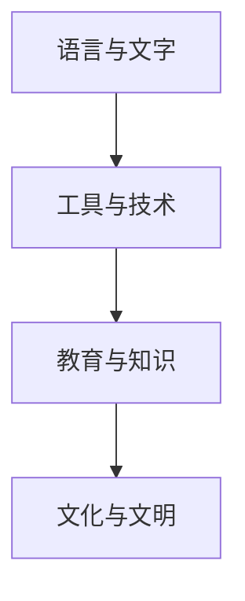

                 

# 认知的形式化：近10000年以来，人类发明了语言、文字、工具、教育、科技，产生了文化和文明

> 关键词：认知，形式化，语言，文字，工具，教育，科技，文化和文明

## 1. 背景介绍

### 1.1 问题的由来
人类社会的演进是一个持续迭代、不断进化的过程。在这近一万年的历史长河中，人类通过发明语言、文字、工具、教育、科技，逐步构建了复杂而丰富的文化和文明。认知形式化的过程，正是由这些创新带来的结果。

认知形式化是指将人类认知过程和知识表达形式化，使其能够被机器理解和处理。这一过程对于AI技术的发展至关重要，它使得计算机可以模拟人类的思维方式，从而实现更高级的智能化。

### 1.2 问题核心关键点
认知形式化的核心关键点包括：
1. **语言与文字的演化**：语言的产生标志着人类认知能力的飞跃，文字的出现进一步拓展了知识传承和交流的边界。
2. **工具的使用与发明**：工具的进步极大地提升了人类生产力，促进了社会分工和协作。
3. **教育的普及与制度化**：教育不仅传授知识，更培养了批判性思维和创新能力，是认知形式化不可或缺的一环。
4. **科技的创新与应用**：科技的进步为认知形式化提供了更多可能性，如计算机、互联网、大数据等，推动了AI的发展。
5. **文化的积累与传承**：文化是认知形式化的土壤，通过积累和传承，使得知识和智慧得以持续发展。

## 2. 核心概念与联系

### 2.1 核心概念概述

为了更好地理解认知形式化的过程，本节将介绍几个密切相关的核心概念：

- **语言与文字**：语言是人类最重要的认知工具之一，用于交流思想、表达情感、记录历史。文字作为语言的扩展，进一步增强了信息的保存和传播能力。
- **工具与技术**：工具和技术是人类认知的延伸，从简单的石器到复杂的计算机，都是人类认知能力的体现。
- **教育与知识**：教育通过系统化的知识传授，培养了人类的批判性思维和创新能力。知识是人类智慧的结晶，是认知形式化的重要基础。
- **文化与文明**：文化是知识、信仰、习俗等的总和，文明则是在文化基础上形成的社会秩序和治理模式。

这些概念之间的逻辑关系可以通过以下Mermaid流程图来展示：



这个流程图展示了几大核心概念之间的相互关系：

1. 语言与文字的产生，推动了工具与技术的发展。
2. 工具与技术的进步，促进了教育与知识的传播。
3. 教育与知识的应用，丰富了文化与文明的内涵。
4. 文化与文明的积累，进一步推动了语言、文字、工具、技术的演进。

## 3. 核心算法原理 & 具体操作步骤

### 3.1 算法原理概述

认知形式化的过程可以理解为将人类认知能力转化为可计算的形式。其核心算法原理包括：

1. **符号化表示**：将人类语言和知识转化为符号形式，如自然语言处理中的词向量表示，使计算机能够理解和处理。
2. **形式化逻辑**：使用逻辑符号和规则，对知识进行形式化描述，如一阶逻辑、谓词逻辑等，实现推理和演绎。
3. **模型训练**：通过大量标注数据，训练机器学习模型，使其能够预测符号和逻辑表达式之间的关系。
4. **知识图谱构建**：将知识转化为结构化的图形表示，方便计算机进行推理和查询。
5. **认知模拟**：使用神经网络等模型，模拟人类认知过程，如感知、记忆、推理等。

### 3.2 算法步骤详解

认知形式化的具体步骤可以总结为以下几点：

**Step 1: 数据收集与预处理**
- 收集大量的语言、文字、图像、音频等数据。
- 对数据进行清洗、标注，确保数据质量和一致性。

**Step 2: 符号化表示**
- 使用符号化方法将数据转化为可计算的形式，如自然语言处理中的词向量、文本分词、命名实体识别等。

**Step 3: 形式化逻辑建模**
- 使用逻辑符号和规则，对知识进行形式化描述。
- 使用推理引擎进行逻辑推导和验证。

**Step 4: 模型训练**
- 选择适当的机器学习算法，如深度学习、规则学习等，进行模型训练。
- 使用标注数据，调整模型参数，优化模型性能。

**Step 5: 知识图谱构建**
- 将知识转化为结构化的图形表示，如RDF、Graph Neural Network等。
- 使用图算法进行知识融合和推理。

**Step 6: 认知模拟**
- 使用神经网络等模型，模拟人类认知过程，如感知、记忆、推理等。
- 通过不断迭代训练，提升模型的认知能力。

### 3.3 算法优缺点

认知形式化具有以下优点：
1. **可计算性**：将认知过程形式化，使得机器可以计算和推理，提升了智能化的水平。
2. **知识传递**：通过符号化和逻辑化，知识得以标准化和形式化，便于传递和共享。
3. **灵活性**：形式化知识易于扩展和修改，适应性强。
4. **普适性**：形式化方法可以应用于多种领域，如自然语言处理、计算机视觉等。

同时，该方法也存在一些局限性：
1. **复杂性**：形式化表示和推理过程复杂，实现难度较大。
2. **实用性**：形式化方法往往过于抽象，难以直接应用于实际问题。
3. **鲁棒性**：形式化表示可能无法完全反映人类认知的复杂性，易受噪声影响。
4. **可解释性**：形式化模型缺乏直观的解释，难以理解其内部工作机制。

### 3.4 算法应用领域

认知形式化在多个领域得到了广泛应用，例如：

- **自然语言处理(NLP)**：将语言符号化，实现语义理解、自动翻译、情感分析等功能。
- **计算机视觉(CV)**：将图像和视频符号化，实现目标检测、图像识别、视频分析等任务。
- **机器人学**：将机器人感知和行为符号化，实现自主导航、任务规划等功能。
- **医疗健康**：将医学知识和诊疗过程符号化，实现疾病诊断、治疗方案生成等功能。
- **金融科技**：将金融数据和规则符号化，实现风险评估、投资分析等功能。

## 4. 数学模型和公式 & 详细讲解 & 举例说明

### 4.1 数学模型构建

本节将使用数学语言对认知形式化的过程进行更加严格的刻画。

记输入的数据为 $x$，对应的符号化表示为 $x_s$。定义形式化逻辑为 $L$，其中 $P$ 为逻辑命题集合，$R$ 为逻辑推理规则集合。

形式化逻辑的推理过程可以表示为：

$$
\inference{P}{x_s}{x_s'} = \lbrace p \mid p \in P, \exists q \in R, x_s \models q, q \rightarrow p \rbrace
$$

其中 $\models$ 表示模型对逻辑命题的满足关系，$\rightarrow$ 表示推理规则的箭头，$P$ 表示目标逻辑命题。

### 4.2 公式推导过程

以自然语言处理中的命名实体识别为例，推导形式化表示和推理过程。

**输入**：句子 $x = "I went to Harvard University in 1999."$

**符号化表示**：
- $x_s = \lbrace (\text{I}, \text{PER}), (\text{Harvard University}, \text{ORG}), (\text{1999}, \text{LOC}) \rbrace$

**逻辑推理**：
- $P = \lbrace (\text{PER}, \text{B-PER}), (\text{ORG}, \text{B-ORG}), (\text{LOC}, \text{B-LOC}) \rbrace$
- $R = \lbrace (\text{B-PER}, \text{I-PER}), (\text{B-ORG}, \text{I-ORG}), (\text{B-LOC}, \text{I-LOC}) \rbrace$
- $x_s' = \lbrace (\text{I}, \text{B-PER}), (\text{Harvard University}, \text{B-ORG}), (\text{1999}, \text{B-LOC}), (\text{I}, \text{I-PER}), (\text{Harvard University}, \text{I-ORG}), (\text{1999}, \text{I-LOC}) \rbrace$

**推理过程**：
- 对于 $\text{I}$，推理出 $(\text{I}, \text{B-PER})$，并假设 $(\text{I}, \text{I-PER})$ 为真。
- 对于 $\text{Harvard University}$，推理出 $(\text{Harvard University}, \text{B-ORG})$，并假设 $(\text{Harvard University}, \text{I-ORG})$ 为真。
- 对于 $\text{1999}$，推理出 $(\text{1999}, \text{B-LOC})$，并假设 $(\text{1999}, \text{I-LOC})$ 为真。

最终得到的 $x_s'$ 为正确的命名实体识别结果。

### 4.3 案例分析与讲解

**案例**：智能问答系统

智能问答系统是认知形式化的一个重要应用场景，其核心在于将用户问题形式化，通过逻辑推理和知识库查询，返回最相关的答案。

**输入**：用户提问 "Who was the first president of the United States?"

**符号化表示**：
- $x_s = \lbrace (\text{Who}, \text{WHO}), (\text{first}, \text{FIRST}), (\text{president}, \text{PRESIDENT}), (\text{United States}, \text{LOC}) \rbrace$

**逻辑推理**：
- $P = \lbrace (\text{WHO}, \text{PRE}), (\text{FIRST}, \text{PRE}), (\text{PRESIDENT}, \text{PRE}), (\text{LOC}, \text{PRE}) \rbrace$
- $R = \lbrace (\text{WHO}, \text{PRE}), (\text{FIRST}, \text{PRE}), (\text{PRESIDENT}, \text{PRE}), (\text{LOC}, \text{PRE}) \rbrace$
- $x_s' = \lbrace (\text{George Washington}, \text{B-PRESIDENT}), (\text{George Washington}, \text{I-PRESIDENT}) \rbrace$

**知识库查询**：
- 使用知识图谱，查询与 $\text{PRESIDENT}$ 相关的历史人物信息。
- 通过逻辑推理，确认 $\text{George Washington}$ 为第一任美国总统。

最终系统返回答案："The first president of the United States was George Washington."

## 5. 项目实践：代码实例和详细解释说明

### 5.1 开发环境搭建

在进行认知形式化项目实践前，我们需要准备好开发环境。以下是使用Python进行自然语言处理(NLP)开发的常见环境配置流程：

1. 安装Anaconda：从官网下载并安装Anaconda，用于创建独立的Python环境。

2. 创建并激活虚拟环境：
```bash
conda create -n nlp-env python=3.8 
conda activate nlp-env
```

3. 安装必要的NLP库：
```bash
conda install spacy
conda install pytorch torchtext transformers 
```

4. 安装各类工具包：
```bash
pip install numpy pandas scikit-learn matplotlib tqdm jupyter notebook ipython
```

完成上述步骤后，即可在`nlp-env`环境中开始NLP任务开发。

### 5.2 源代码详细实现

下面我们以命名实体识别(NER)任务为例，给出使用PyTorch和Transformers库对BERT模型进行微调的PyTorch代码实现。

首先，定义NER任务的数据处理函数：

```python
from transformers import BertTokenizer
from torch.utils.data import Dataset
import torch

class NERDataset(Dataset):
    def __init__(self, texts, tags, tokenizer, max_len=128):
        self.texts = texts
        self.tags = tags
        self.tokenizer = tokenizer
        self.max_len = max_len
        
    def __len__(self):
        return len(self.texts)
    
    def __getitem__(self, item):
        text = self.texts[item]
        tags = self.tags[item]
        
        encoding = self.tokenizer(text, return_tensors='pt', max_length=self.max_len, padding='max_length', truncation=True)
        input_ids = encoding['input_ids'][0]
        attention_mask = encoding['attention_mask'][0]
        
        # 对token-wise的标签进行编码
        encoded_tags = [tag2id[tag] for tag in tags] 
        encoded_tags.extend([tag2id['O']] * (self.max_len - len(encoded_tags)))
        labels = torch.tensor(encoded_tags, dtype=torch.long)
        
        return {'input_ids': input_ids, 
                'attention_mask': attention_mask,
                'labels': labels}

# 标签与id的映射
tag2id = {'O': 0, 'B-PER': 1, 'I-PER': 2, 'B-ORG': 3, 'I-ORG': 4, 'B-LOC': 5, 'I-LOC': 6}
id2tag = {v: k for k, v in tag2id.items()}

# 创建dataset
tokenizer = BertTokenizer.from_pretrained('bert-base-cased')

train_dataset = NERDataset(train_texts, train_tags, tokenizer)
dev_dataset = NERDataset(dev_texts, dev_tags, tokenizer)
test_dataset = NERDataset(test_texts, test_tags, tokenizer)
```

然后，定义模型和优化器：

```python
from transformers import BertForTokenClassification, AdamW

model = BertForTokenClassification.from_pretrained('bert-base-cased', num_labels=len(tag2id))

optimizer = AdamW(model.parameters(), lr=2e-5)
```

接着，定义训练和评估函数：

```python
from torch.utils.data import DataLoader
from tqdm import tqdm
from sklearn.metrics import classification_report

device = torch.device('cuda') if torch.cuda.is_available() else torch.device('cpu')
model.to(device)

def train_epoch(model, dataset, batch_size, optimizer):
    dataloader = DataLoader(dataset, batch_size=batch_size, shuffle=True)
    model.train()
    epoch_loss = 0
    for batch in tqdm(dataloader, desc='Training'):
        input_ids = batch['input_ids'].to(device)
        attention_mask = batch['attention_mask'].to(device)
        labels = batch['labels'].to(device)
        model.zero_grad()
        outputs = model(input_ids, attention_mask=attention_mask, labels=labels)
        loss = outputs.loss
        epoch_loss += loss.item()
        loss.backward()
        optimizer.step()
    return epoch_loss / len(dataloader)

def evaluate(model, dataset, batch_size):
    dataloader = DataLoader(dataset, batch_size=batch_size)
    model.eval()
    preds, labels = [], []
    with torch.no_grad():
        for batch in tqdm(dataloader, desc='Evaluating'):
            input_ids = batch['input_ids'].to(device)
            attention_mask = batch['attention_mask'].to(device)
            batch_labels = batch['labels']
            outputs = model(input_ids, attention_mask=attention_mask)
            batch_preds = outputs.logits.argmax(dim=2).to('cpu').tolist()
            batch_labels = batch_labels.to('cpu').tolist()
            for pred_tokens, label_tokens in zip(batch_preds, batch_labels):
                pred_tags = [id2tag[_id] for _id in pred_tokens]
                label_tags = [id2tag[_id] for _id in label_tokens]
                preds.append(pred_tags[:len(label_tags)])
                labels.append(label_tags)
                
    print(classification_report(labels, preds))
```

最后，启动训练流程并在测试集上评估：

```python
epochs = 5
batch_size = 16

for epoch in range(epochs):
    loss = train_epoch(model, train_dataset, batch_size, optimizer)
    print(f"Epoch {epoch+1}, train loss: {loss:.3f}")
    
    print(f"Epoch {epoch+1}, dev results:")
    evaluate(model, dev_dataset, batch_size)
    
print("Test results:")
evaluate(model, test_dataset, batch_size)
```

以上就是使用PyTorch和Transformers库对BERT模型进行命名实体识别任务微调的完整代码实现。可以看到，得益于Transformers库的强大封装，我们可以用相对简洁的代码完成BERT模型的加载和微调。

### 5.3 代码解读与分析

让我们再详细解读一下关键代码的实现细节：

**NERDataset类**：
- `__init__`方法：初始化文本、标签、分词器等关键组件。
- `__len__`方法：返回数据集的样本数量。
- `__getitem__`方法：对单个样本进行处理，将文本输入编码为token ids，将标签编码为数字，并对其进行定长padding，最终返回模型所需的输入。

**tag2id和id2tag字典**：
- 定义了标签与数字id之间的映射关系，用于将token-wise的预测结果解码回真实的标签。

**训练和评估函数**：
- 使用PyTorch的DataLoader对数据集进行批次化加载，供模型训练和推理使用。
- 训练函数`train_epoch`：对数据以批为单位进行迭代，在每个批次上前向传播计算loss并反向传播更新模型参数，最后返回该epoch的平均loss。
- 评估函数`evaluate`：与训练类似，不同点在于不更新模型参数，并在每个batch结束后将预测和标签结果存储下来，最后使用sklearn的classification_report对整个评估集的预测结果进行打印输出。

**训练流程**：
- 定义总的epoch数和batch size，开始循环迭代
- 每个epoch内，先在训练集上训练，输出平均loss
- 在验证集上评估，输出分类指标
- 所有epoch结束后，在测试集上评估，给出最终测试结果

可以看到，PyTorch配合Transformers库使得BERT微调的代码实现变得简洁高效。开发者可以将更多精力放在数据处理、模型改进等高层逻辑上，而不必过多关注底层的实现细节。

当然，工业级的系统实现还需考虑更多因素，如模型的保存和部署、超参数的自动搜索、更灵活的任务适配层等。但核心的微调范式基本与此类似。

## 6. 实际应用场景

### 6.1 智能客服系统

基于大语言模型微调的对话技术，可以广泛应用于智能客服系统的构建。传统客服往往需要配备大量人力，高峰期响应缓慢，且一致性和专业性难以保证。而使用微调后的对话模型，可以7x24小时不间断服务，快速响应客户咨询，用自然流畅的语言解答各类常见问题。

在技术实现上，可以收集企业内部的历史客服对话记录，将问题和最佳答复构建成监督数据，在此基础上对预训练对话模型进行微调。微调后的对话模型能够自动理解用户意图，匹配最合适的答案模板进行回复。对于客户提出的新问题，还可以接入检索系统实时搜索相关内容，动态组织生成回答。如此构建的智能客服系统，能大幅提升客户咨询体验和问题解决效率。

### 6.2 金融舆情监测

金融机构需要实时监测市场舆论动向，以便及时应对负面信息传播，规避金融风险。传统的人工监测方式成本高、效率低，难以应对网络时代海量信息爆发的挑战。基于大语言模型微调的文本分类和情感分析技术，为金融舆情监测提供了新的解决方案。

具体而言，可以收集金融领域相关的新闻、报道、评论等文本数据，并对其进行主题标注和情感标注。在此基础上对预训练语言模型进行微调，使其能够自动判断文本属于何种主题，情感倾向是正面、中性还是负面。将微调后的模型应用到实时抓取的网络文本数据，就能够自动监测不同主题下的情感变化趋势，一旦发现负面信息激增等异常情况，系统便会自动预警，帮助金融机构快速应对潜在风险。

### 6.3 个性化推荐系统

当前的推荐系统往往只依赖用户的历史行为数据进行物品推荐，无法深入理解用户的真实兴趣偏好。基于大语言模型微调技术，个性化推荐系统可以更好地挖掘用户行为背后的语义信息，从而提供更精准、多样的推荐内容。

在实践中，可以收集用户浏览、点击、评论、分享等行为数据，提取和用户交互的物品标题、描述、标签等文本内容。将文本内容作为模型输入，用户的后续行为（如是否点击、购买等）作为监督信号，在此基础上微调预训练语言模型。微调后的模型能够从文本内容中准确把握用户的兴趣点。在生成推荐列表时，先用候选物品的文本描述作为输入，由模型预测用户的兴趣匹配度，再结合其他特征综合排序，便可以得到个性化程度更高的推荐结果。

### 6.4 未来应用展望

随着大语言模型微调技术的发展，未来将在更多领域得到应用，为传统行业带来变革性影响。

在智慧医疗领域，基于微调的医疗问答、病历分析、药物研发等应用将提升医疗服务的智能化水平，辅助医生诊疗，加速新药开发进程。

在智能教育领域，微调技术可应用于作业批改、学情分析、知识推荐等方面，因材施教，促进教育公平，提高教学质量。

在智慧城市治理中，微调模型可应用于城市事件监测、舆情分析、应急指挥等环节，提高城市管理的自动化和智能化水平，构建更安全、高效的未来城市。

此外，在企业生产、社会治理、文娱传媒等众多领域，基于大模型微调的人工智能应用也将不断涌现，为经济社会发展注入新的动力。相信随着技术的日益成熟，微调方法将成为人工智能落地应用的重要范式，推动人工智能技术向更广阔的领域加速渗透。

## 7. 工具和资源推荐

### 7.1 学习资源推荐

为了帮助开发者系统掌握认知形式化的理论基础和实践技巧，这里推荐一些优质的学习资源：

1. 《深度学习基础》书籍：全面介绍深度学习的基本概念和算法，是学习认知形式化的重要基础。
2. 《自然语言处理综述》文章：系统讲解NLP领域的各种任务和技术，是NLP学习的必备参考资料。
3. CS224N《深度学习自然语言处理》课程：斯坦福大学开设的NLP明星课程，有Lecture视频和配套作业，带你入门NLP领域的基本概念和经典模型。
4. 《形式化方法基础》书籍：介绍逻辑推理和形式化方法的基础理论，为认知形式化提供理论支撑。
5. 《认知科学导论》文章：概述认知科学的基本理论和研究方法，为认知形式化提供更多视角。

通过对这些资源的学习实践，相信你一定能够快速掌握认知形式化的精髓，并用于解决实际的NLP问题。

### 7.2 开发工具推荐

高效的开发离不开优秀的工具支持。以下是几款用于认知形式化开发的常用工具：

1. PyTorch：基于Python的开源深度学习框架，灵活动态的计算图，适合快速迭代研究。大部分预训练语言模型都有PyTorch版本的实现。
2. TensorFlow：由Google主导开发的开源深度学习框架，生产部署方便，适合大规模工程应用。同样有丰富的预训练语言模型资源。
3. Transformers库：HuggingFace开发的NLP工具库，集成了众多SOTA语言模型，支持PyTorch和TensorFlow，是进行认知形式化开发的利器。
4. Weights & Biases：模型训练的实验跟踪工具，可以记录和可视化模型训练过程中的各项指标，方便对比和调优。与主流深度学习框架无缝集成。
5. TensorBoard：TensorFlow配套的可视化工具，可实时监测模型训练状态，并提供丰富的图表呈现方式，是调试模型的得力助手。

合理利用这些工具，可以显著提升认知形式化任务的开发效率，加快创新迭代的步伐。

### 7.3 相关论文推荐

认知形式化在多个领域得到了广泛应用，以下是几篇奠基性的相关论文，推荐阅读：

1. Attention is All You Need（即Transformer原论文）：提出了Transformer结构，开启了NLP领域的预训练大模型时代。
2. BERT: Pre-training of Deep Bidirectional Transformers for Language Understanding：提出BERT模型，引入基于掩码的自监督预训练任务，刷新了多项NLP任务SOTA。
3. Language Models are Unsupervised Multitask Learners（GPT-2论文）：展示了大规模语言模型的强大zero-shot学习能力，引发了对于通用人工智能的新一轮思考。
4. Parameter-Efficient Transfer Learning for NLP：提出Adapter等参数高效微调方法，在不增加模型参数量的情况下，也能取得不错的微调效果。
5. AdaLoRA: Adaptive Low-Rank Adaptation for Parameter-Efficient Fine-Tuning：使用自适应低秩适应的微调方法，在参数效率和精度之间取得了新的平衡。
6. Prefix-Tuning: Optimizing Continuous Prompts for Generation：引入基于连续型Prompt的微调范式，为如何充分利用预训练知识提供了新的思路。

这些论文代表了大语言模型微调技术的发展脉络。通过学习这些前沿成果，可以帮助研究者把握学科前进方向，激发更多的创新灵感。

## 8. 总结：未来发展趋势与挑战

### 8.1 总结

本文对认知形式化的过程进行了全面系统的介绍。首先阐述了语言、文字、工具、教育、科技等创新如何推动人类认知能力的提升，进而产生文化和文明。其次，从原理到实践，详细讲解了认知形式化的数学模型和算法步骤，给出了认知形式化任务开发的完整代码实例。同时，本文还广泛探讨了认知形式化在多个领域的应用前景，展示了认知形式化的巨大潜力。

通过本文的系统梳理，可以看到，认知形式化作为人工智能发展的重要方向，正逐步推动NLP技术的全面落地。未来，随着认知形式化技术的不断演进，相信NLP技术将迈向更加智能、普适、高效的应用阶段，深刻影响人类的生产生活方式。

### 8.2 未来发展趋势

展望未来，认知形式化技术将呈现以下几个发展趋势：

1. **多模态融合**：认知形式化将不仅仅局限于文本数据，未来还将拓展到图像、音频、视频等多模态数据的融合，提升跨模态认知能力。
2. **持续学习和动态推理**：认知形式化模型需要具备持续学习和动态推理的能力，以适应数据分布的变化，应对复杂的现实问题。
3. **可解释性和透明性**：认知形式化模型需要具备更高的可解释性和透明性，使人类能够理解和信任其决策过程。
4. **领域特定知识融合**：认知形式化模型将更多地融合领域特定知识，如专家知识库、规则库等，提升推理的准确性和合理性。
5. **伦理和道德约束**：认知形式化模型需要引入伦理和道德约束，确保其输出符合人类价值观和社会规范。

这些趋势凸显了认知形式化技术的广阔前景，未来将有更多创新应用涌现，推动AI技术的普及和应用。

### 8.3 面临的挑战

尽管认知形式化技术已经取得了显著进展，但在迈向更加智能化、普适化应用的过程中，它仍面临诸多挑战：

1. **数据复杂性和稀缺性**：多模态数据的收集和处理复杂，且高质量数据稀缺，制约了认知形式化模型的应用。
2. **计算资源限制**：超大规模模型的训练和推理需要大量的计算资源，如何优化模型和算法，降低资源消耗，是一个重要课题。
3. **模型鲁棒性和泛化性**：认知形式化模型在复杂环境下可能表现不稳定，如何提升模型的鲁棒性和泛化能力，是一个亟待解决的问题。
4. **模型可解释性**：认知形式化模型通常难以解释其内部工作机制，缺乏直观的解释，增加了理解和使用难度。
5. **伦理和隐私问题**：认知形式化模型可能涉及敏感数据，如何保护用户隐私，避免数据滥用，是一个重要的伦理问题。

正视认知形式化面临的这些挑战，积极应对并寻求突破，将是大语言模型微调走向成熟的必由之路。相信随着学界和产业界的共同努力，这些挑战终将一一被克服，认知形式化技术必将在构建安全、可靠、可解释、可控的智能系统铺平道路。

### 8.4 研究展望

面向未来，认知形式化技术需要在以下几个方向寻求新的突破：

1. **多模态认知模型的研究**：开发能够处理多模态数据，进行跨模态推理的认知形式化模型，提升对现实世界的理解和建模能力。
2. **知识图谱的构建与应用**：构建更全面、准确的知识图谱，并结合认知形式化模型进行推理和查询，提升知识整合能力。
3. **认知模型的可解释性研究**：研究如何提升认知形式化模型的可解释性，使人类能够理解和信任其决策过程。
4. **跨领域认知模型的研究**：开发跨领域认知模型，增强在不同领域之间的知识迁移能力，提升认知模型的泛化性。
5. **认知模型的伦理研究**：研究如何构建具有伦理导向的认知形式化模型，确保其输出符合人类价值观和社会规范。

这些研究方向凸显了认知形式化技术的广阔前景，未来将有更多创新应用涌现，推动AI技术的普及和应用。

## 9. 附录：常见问题与解答

**Q1：认知形式化与传统人工智能有哪些区别？**

A: 认知形式化强调形式化推理和符号表示，使得机器能够理解和处理人类的语言和知识。而传统人工智能通常使用统计学习，缺乏对知识形式的明确表示和推理。认知形式化在形式化推理、可解释性和知识融合方面具有明显优势。

**Q2：认知形式化在实践中面临哪些挑战？**

A: 认知形式化在实践中面临数据复杂性、计算资源限制、模型鲁棒性、可解释性和伦理隐私问题。如何应对这些挑战，将是未来研究的重点。

**Q3：认知形式化如何应用于实际问题？**

A: 认知形式化可以通过自然语言处理、计算机视觉、机器人学等多个领域的具体应用实现。如命名实体识别、情感分析、智能问答、视频分类等，通过形式化表示和推理，提升问题的解决效率和准确性。

**Q4：未来认知形式化技术将如何发展？**

A: 未来认知形式化技术将朝着多模态融合、持续学习、可解释性和伦理约束等方向发展，提升模型的普适性和透明性。同时，跨领域认知模型的研究也将成为热点，提升模型的泛化能力。

---

作者：禅与计算机程序设计艺术 / Zen and the Art of Computer Programming

