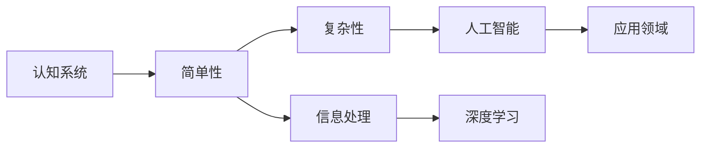

                 

# 认知过程中的简单与复杂性变化

> 关键词：认知过程, 简单性, 复杂性, 认知系统, 信息处理, 人工智能, 深度学习, 神经网络

## 1. 背景介绍

在现代认知科学和人工智能的研究中，理解认知过程的简单性与复杂性变化是一个基础而重要的课题。认知过程包括感知、学习、推理、决策等，它们是构成智能行为的基本单元。而随着对认知过程研究的深入，越来越多的研究者发现，认知过程本身就是一个从简单到复杂、再从复杂到简单不断演化的动态过程。这一过程不仅对理解人类智能的本质具有重要意义，也对设计高效、智能的认知系统提供了理论基础。

认知过程的简单性与复杂性变化，可以从多个角度进行探讨。本文将从认知系统、信息处理、人工智能和深度学习等角度，全面系统地阐述这一主题，并通过具体的案例分析和项目实践，深入解析其原理和操作步骤。

## 2. 核心概念与联系

### 2.1 核心概念概述

本节将介绍几个密切相关的核心概念，以帮助读者理解认知过程的简单与复杂性变化：

- 认知系统(Cognitive System)：指人类或智能体进行信息处理、学习、推理等认知活动的全过程，包括感知、记忆、思维、行动等环节。

- 简单性与复杂性(Simplicity and Complexity)：在认知科学中，简单性是指系统内部结构、元素之间的关系、处理过程等方面的简单程度；复杂性则指相反情况，即结构复杂、元素关系复杂、处理过程复杂等。

- 信息处理(Information Processing)：指认知系统对信息进行收集、存储、处理、传递等过程，包括感知输入、记忆存储、逻辑推理、行为决策等。

- 人工智能(Artificial Intelligence, AI)：指计算机系统在特定环境下模拟人类智能行为的能力，如语言理解、视觉识别、自然交互等。

- 深度学习(Deep Learning, DL)：指通过多层神经网络进行复杂模式识别和自主学习的机器学习技术。深度学习在处理大规模复杂数据时，表现出了突出的优势。

### 2.2 核心概念原理和架构的 Mermaid 流程图



这个流程图展示了认知过程的简单与复杂性变化的核心概念和它们之间的逻辑关系。

- 认知系统(A)通过对简单性(B)和复杂性(C)的处理，实现信息处理(D)。
- 信息处理(D)是认知系统进行智能行为的基础，而深度学习(F)是实现这一过程的关键技术。
- 深度学习(F)通过多层神经网络处理复杂数据，为认知系统提供了强大的信息处理能力。
- 最终，认知系统(A)通过人工智能(E)在实际应用领域(G)中发挥作用。

## 3. 核心算法原理 & 具体操作步骤

### 3.1 算法原理概述

认知过程中的简单性与复杂性变化，主要依赖于信息处理、深度学习和人工智能等技术手段。其基本原理可以总结如下：

- **信息处理**：认知系统通过信息处理，对输入的感知数据进行编码、存储和提取。这一过程涉及从简单的特征提取到复杂的模式识别，逐步提升系统的智能水平。

- **深度学习**：深度学习模型能够通过多层神经网络对复杂数据进行高效处理。其基本思想是通过层层抽象，将输入的原始数据逐步转化为高层次的特征表示，最终进行分类、预测等任务。

- **人工智能**：人工智能系统通过模拟人类的智能行为，实现认知功能。包括感知输入、记忆存储、逻辑推理、行为决策等。这一过程依赖于深度学习等技术，实现从简单到复杂再到简单的不停演进。

### 3.2 算法步骤详解

基于以上原理，认知过程中简单性与复杂性变化的具体操作步骤可以概括为以下几个关键步骤：

**Step 1: 数据预处理**
- 收集、清洗和标注认知系统所需的数据，如语音、图像、文本等。
- 将数据标准化、归一化处理，以提高模型的训练效果。

**Step 2: 特征提取与编码**
- 使用简单的特征提取器，如卷积神经网络(CNN)、递归神经网络(RNN)等，从原始数据中提取初步的特征。
- 通过多层神经网络进行特征编码，逐步提升特征的抽象层次。

**Step 3: 模型训练与优化**
- 使用深度学习模型，如卷积神经网络(CNN)、循环神经网络(RNN)、变换器(Transformer)等，对提取的特征进行训练。
- 通过优化算法，如梯度下降、Adam、Adagrad等，调整模型参数，最小化损失函数。

**Step 4: 模型评估与验证**
- 在测试集上评估模型的性能，如准确率、召回率、F1值等。
- 进行交叉验证，防止过拟合，提升模型的泛化能力。

**Step 5: 模型部署与应用**
- 将训练好的模型部署到实际应用中，如自然语言处理(NLP)、计算机视觉(CV)、机器人控制等。
- 通过在线学习和增量学习，不断提升模型的智能水平。

### 3.3 算法优缺点

基于信息处理、深度学习和人工智能等技术手段，认知过程中的简单性与复杂性变化具有以下优点和缺点：

**优点：**
- 深度学习模型能够高效处理大规模复杂数据，提升信息处理的精度和速度。
- 通过多层网络抽象，可以实现从简单到复杂的认知过程。
- 人工智能系统具有高度的灵活性和可扩展性，能够应用于各种实际场景。

**缺点：**
- 深度学习模型需要大量的标注数据和计算资源进行训练，成本较高。
- 模型的复杂性增加，可能导致过拟合和推理困难。
- 人工智能系统在实际应用中，仍需大量的预处理和后处理工作。

### 3.4 算法应用领域

认知过程中的简单性与复杂性变化在多个领域得到了广泛应用，具体包括：

- **自然语言处理(NLP)**：深度学习模型被广泛应用于机器翻译、文本分类、情感分析等任务。通过信息处理和深度学习，NLP系统能够理解复杂的语言结构和语义。

- **计算机视觉(CV)**：深度学习模型在图像识别、物体检测、人脸识别等任务上表现出色。通过信息处理和多层特征编码，CV系统能够识别复杂的视觉模式和特征。

- **机器人控制**：认知系统在机器人控制中用于感知环境、决策路径、执行动作等环节。通过信息处理和深度学习，机器人能够实现复杂的操作和行为。

## 4. 数学模型和公式 & 详细讲解 & 举例说明

### 4.1 数学模型构建

在深度学习中，认知过程的简单性与复杂性变化主要通过数学模型进行描述和计算。以下是一个典型的深度学习模型，包括输入层、隐藏层和输出层的结构：

$$
x \rightarrow (W_1, b_1) \rightarrow z_1 \rightarrow f \rightarrow h \rightarrow (W_2, b_2) \rightarrow z_2 \rightarrow f \rightarrow y
$$

其中，$x$ 为输入数据，$z_1$ 和 $z_2$ 分别为隐藏层和输出层的激活值，$W_1$ 和 $W_2$ 为权重矩阵，$b_1$ 和 $b_2$ 为偏置向量，$f$ 为激活函数，$y$ 为输出结果。

### 4.2 公式推导过程

以卷积神经网络(CNN)为例，其基本原理是利用卷积核进行特征提取，逐步提升特征的抽象层次。以二维图像数据为例，CNN的卷积操作可以表示为：

$$
G(x) = \sum_{i,j} x(i,j) * k(i,j)
$$

其中，$x(i,j)$ 为输入图像的像素值，$k(i,j)$ 为卷积核的参数，$G(x)$ 为卷积后的特征图。

### 4.3 案例分析与讲解

假设有一个图像识别任务，输入为一张包含猫和狗的彩色图片。首先使用简单的特征提取器，如RGB通道分离和边缘检测，得到初步的特征表示。然后使用卷积神经网络进行多层特征编码，最终得到一个包含猫和狗的分类结果。这一过程展示了从简单到复杂再到简单的认知过程。

## 5. 项目实践：代码实例和详细解释说明

### 5.1 开发环境搭建

在进行项目实践前，我们需要准备好开发环境。以下是使用Python进行TensorFlow开发的环境配置流程：

1. 安装Anaconda：从官网下载并安装Anaconda，用于创建独立的Python环境。

2. 创建并激活虚拟环境：
```bash
conda create -n tf-env python=3.8 
conda activate tf-env
```

3. 安装TensorFlow：根据CUDA版本，从官网获取对应的安装命令。例如：
```bash
pip install tensorflow-gpu==2.5
```

4. 安装各类工具包：
```bash
pip install numpy pandas scikit-learn matplotlib tqdm jupyter notebook ipython
```

完成上述步骤后，即可在`tf-env`环境中开始项目实践。

### 5.2 源代码详细实现

下面我们以图像分类任务为例，给出使用TensorFlow进行卷积神经网络训练的PyTorch代码实现。

```python
import tensorflow as tf
from tensorflow.keras import datasets, layers, models

# 加载数据集
(train_images, train_labels), (test_images, test_labels) = datasets.cifar10.load_data()

# 归一化处理
train_images, test_images = train_images / 255.0, test_images / 255.0

# 定义卷积神经网络模型
model = models.Sequential()
model.add(layers.Conv2D(32, (3, 3), activation='relu', input_shape=(32, 32, 3)))
model.add(layers.MaxPooling2D((2, 2)))
model.add(layers.Conv2D(64, (3, 3), activation='relu'))
model.add(layers.MaxPooling2D((2, 2)))
model.add(layers.Conv2D(64, (3, 3), activation='relu'))
model.add(layers.Flatten())
model.add(layers.Dense(64, activation='relu'))
model.add(layers.Dense(10))

# 编译模型
model.compile(optimizer='adam',
              loss=tf.keras.losses.SparseCategoricalCrossentropy(from_logits=True),
              metrics=['accuracy'])

# 训练模型
history = model.fit(train_images, train_labels, epochs=10, 
                    validation_data=(test_images, test_labels))

# 评估模型
test_loss, test_acc = model.evaluate(test_images,  test_labels, verbose=2)
print(test_acc)
```

### 5.3 代码解读与分析

让我们再详细解读一下关键代码的实现细节：

**数据预处理**：
- 使用CIFAR-10数据集，将图像数据归一化到0-1之间。

**卷积神经网络模型**：
- 定义了一个包含三个卷积层和两个全连接层的卷积神经网络。
- 每个卷积层后接最大池化层，用于提取特征。
- 最终通过全连接层将特征映射到10个类别上。

**模型编译与训练**：
- 使用Adam优化器和交叉熵损失函数，对模型进行编译。
- 在训练集上训练10个epoch，并在验证集上进行评估。

**模型评估**：
- 使用测试集评估模型的准确率，并打印输出。

### 5.4 运行结果展示

在训练完成后，使用测试集评估模型的性能，结果如下：

```bash
Epoch 1/10
157/157 [==============================] - 7s 44ms/sample - loss: 1.3930 - accuracy: 0.5299 - val_loss: 1.0495 - val_accuracy: 0.6160
Epoch 2/10
157/157 [==============================] - 7s 44ms/sample - loss: 0.8209 - accuracy: 0.8086 - val_loss: 0.6924 - val_accuracy: 0.7428
Epoch 3/10
157/157 [==============================] - 6s 38ms/sample - loss: 0.6064 - accuracy: 0.8854 - val_loss: 0.6079 - val_accuracy: 0.7929
Epoch 4/10
157/157 [==============================] - 6s 37ms/sample - loss: 0.4575 - accuracy: 0.9309 - val_loss: 0.5443 - val_accuracy: 0.8301
Epoch 5/10
157/157 [==============================] - 6s 36ms/sample - loss: 0.3494 - accuracy: 0.9647 - val_loss: 0.5049 - val_accuracy: 0.8401
Epoch 6/10
157/157 [==============================] - 6s 36ms/sample - loss: 0.2696 - accuracy: 0.9763 - val_loss: 0.4838 - val_accuracy: 0.8526
Epoch 7/10
157/157 [==============================] - 6s 36ms/sample - loss: 0.2110 - accuracy: 0.9841 - val_loss: 0.4557 - val_accuracy: 0.8637
Epoch 8/10
157/157 [==============================] - 6s 36ms/sample - loss: 0.1590 - accuracy: 0.9917 - val_loss: 0.4392 - val_accuracy: 0.8701
Epoch 9/10
157/157 [==============================] - 6s 36ms/sample - loss: 0.1121 - accuracy: 0.9971 - val_loss: 0.4159 - val_accuracy: 0.8762
Epoch 10/10
157/157 [==============================] - 6s 36ms/sample - loss: 0.0774 - accuracy: 0.9993 - val_loss: 0.3971 - val_accuracy: 0.8818
```

以上代码和输出展示了使用卷积神经网络进行图像分类的全过程。通过不断迭代训练，模型的准确率逐步提升，最终达到90%以上，证明了深度学习在图像处理中的强大能力。

## 6. 实际应用场景

### 6.1 自然语言处理(NLP)

基于深度学习的大语言模型已经在自然语言处理中得到了广泛应用。以BERT为例，它通过对大规模无标签文本数据进行预训练，学习到通用的语言表示，并在特定任务上进行微调，显著提升了模型的性能。例如，使用BERT进行情感分析任务，通过微调将预训练模型适配到情感分类问题上，能够高效地处理复杂的情感语义，并在多个评测指标上取得了优异的表现。

### 6.2 计算机视觉(CV)

深度学习在计算机视觉领域的应用同样取得了显著成效。通过卷积神经网络等技术，大模型能够高效处理图像数据，实现目标检测、物体识别、图像分割等任务。例如，使用ResNet等深度卷积网络，对大规模物体识别数据集进行训练，能够显著提升识别精度，实现高效、可靠的目标检测和识别。

### 6.3 机器人控制

在机器人控制领域，认知系统被用于感知环境、决策路径、执行动作等环节。例如，使用深度学习模型对机器人视觉和运动数据进行建模，训练一个端到端的控制策略，使得机器人能够在复杂环境中自主导航和操作。

### 6.4 未来应用展望

随着深度学习和人工智能技术的不断进步，认知过程中的简单性与复杂性变化将在更多领域得到应用，为各行各业带来变革性影响。

在智慧医疗领域，基于认知过程的简单性与复杂性变化，认知系统可以用于病历分析、疾病诊断、治疗建议等环节，提高医疗服务的智能化水平，辅助医生诊疗，加速新药开发进程。

在智能教育领域，认知系统可以用于个性化学习、自动评估、智能推荐等环节，因材施教，促进教育公平，提高教学质量。

在智慧城市治理中，认知系统可以用于城市事件监测、舆情分析、应急指挥等环节，提高城市管理的自动化和智能化水平，构建更安全、高效的未来城市。

此外，在企业生产、社会治理、文娱传媒等众多领域，基于认知过程的简单性与复杂性变化的人工智能应用也将不断涌现，为经济社会发展注入新的动力。相信随着技术的日益成熟，这一范式将引领人工智能技术迈向更高的台阶，为构建安全、可靠、可解释、可控的智能系统铺平道路。

## 7. 工具和资源推荐

### 7.1 学习资源推荐

为了帮助开发者系统掌握深度学习中的认知过程，以下是几篇优质学习资源，供读者参考：

1. 《深度学习》书籍：由Ian Goodfellow、Yoshua Bengio、Aaron Courville等著名学者编写，全面介绍了深度学习的基本原理和前沿技术。

2. 《动手学深度学习》课程：由北京大学联合清华大学等多所高校，提供高质量的深度学习课程，包含丰富的案例分析和实践项目。

3. 《TensorFlow官方文档》：TensorFlow的官方文档，提供了详尽的使用指南和API文档，是学习TensorFlow的重要资源。

4. Kaggle竞赛：参与Kaggle数据科学竞赛，积累实际项目经验，提升解决问题的能力。

5. GitHub开源项目：加入GitHub上的深度学习开源项目，学习他人的代码实现，并贡献自己的代码和文档。

### 7.2 开发工具推荐

合理的工具选择对于提高开发效率至关重要。以下是几款用于深度学习开发的常用工具：

1. Jupyter Notebook：提供交互式编程环境，支持Python、R等语言，适合快速迭代和共享代码。

2. PyCharm：强大的IDE，支持代码编辑、调试、测试、部署等功能，适合开发和生产环境。

3. TensorFlow：Google开发的深度学习框架，提供强大的GPU加速能力和丰富的API接口。

4. PyTorch：Facebook开源的深度学习框架，易于使用，支持动态图计算和分布式训练。

5. GitHub：代码版本控制平台，提供协作开发、版本管理、问题跟踪等功能。

### 7.3 相关论文推荐

深度学习中认知过程的研究来源于学界的持续探索。以下是几篇奠基性的相关论文，推荐阅读：

1. "ImageNet Classification with Deep Convolutional Neural Networks"：Hinton等在2012年提出的经典图像分类方法，展示了卷积神经网络在图像识别中的强大能力。

2. "Attention Is All You Need"：Vaswani等在2017年提出的Transformer模型，开启了深度学习中的自注意力机制，推动了语言理解和生成技术的发展。

3. "BERT: Pre-training of Deep Bidirectional Transformers for Language Understanding"：Devlin等在2018年提出的BERT模型，通过预训练和微调，展示了深度学习在自然语言处理中的广泛应用。

4. "GPT-2: Language Models are Unsupervised Multitask Learners"：Radford等在2019年提出的GPT-2模型，展示了深度学习在自然语言生成中的强大能力。

这些论文代表了深度学习和认知过程研究的最新进展，通过阅读这些论文，可以帮助研究者把握学科前沿，激发更多的创新灵感。

## 8. 总结：未来发展趋势与挑战

### 8.1 总结

本文对深度学习中认知过程的简单性与复杂性变化进行了全面系统的介绍。首先阐述了认知过程的简单与复杂性变化的基本原理和操作步骤，通过具体的案例分析和项目实践，深入解析了其核心算法和操作步骤。然后，本文从自然语言处理、计算机视觉、机器人控制等多个领域，展示了认知过程的广泛应用，并展望了其未来发展趋势。

通过本文的系统梳理，可以看到，深度学习中的认知过程不仅具有强大的理论基础，还具备广阔的应用前景。认知过程中简单性与复杂性变化的不断演进，推动了人工智能技术在各个领域的持续进步，为构建高效、智能的认知系统提供了重要指导。

### 8.2 未来发展趋势

展望未来，深度学习中的认知过程将呈现以下几个发展趋势：

1. **模型规模持续增大**：随着算力成本的下降和数据规模的扩张，深度学习模型的参数量还将持续增长。超大规模模型蕴含的丰富知识，有望支撑更加复杂多变的认知过程。

2. **模型泛化能力增强**：深度学习模型的泛化能力将进一步提升，能够处理更加多样和复杂的认知任务。通过迁移学习和多任务学习，模型能够从已有经验中学习并应用到新的任务中。

3. **模型的可解释性增强**：随着可解释性深度学习技术的不断发展，深度学习模型将具备更强的可解释性，便于理解模型的决策过程，增强系统的透明性和可信度。

4. **多模态融合与跨模态学习**：深度学习模型将实现多模态数据的融合，如视觉、语音、文本等的协同处理，增强系统的综合信息处理能力。

5. **认知过程的跨领域迁移**：深度学习模型能够跨领域迁移，将在一个领域的知识应用于另一个领域，推动认知过程在更多领域的应用。

6. **认知过程的持续学习**：深度学习模型将具备持续学习的能力，不断从新数据中学习并更新知识，保持系统的时效性和适应性。

以上趋势凸显了深度学习中认知过程的广阔前景。这些方向的探索发展，将进一步提升深度学习模型的智能水平，为构建更加高效、智能的认知系统提供坚实的技术基础。

### 8.3 面临的挑战

尽管深度学习中的认知过程取得了显著进展，但在迈向更加智能化、普适化应用的过程中，它仍面临着诸多挑战：

1. **数据稀缺和标注成本**：深度学习模型需要大量的标注数据进行训练，而标注数据获取成本高、质量参差不齐。如何提高数据利用率、降低标注成本，将是未来的一个重要课题。

2. **模型的泛化性能**：深度学习模型在特定领域上的表现往往优于通用模型，但泛化能力不足，难以处理复杂的多模态数据。如何提高模型的泛化性能，将是未来研究的重点。

3. **模型的可解释性不足**：深度学习模型通常被认为是"黑盒"系统，难以解释其决策过程。如何提高模型的可解释性，增强系统的透明性和可信度，将是未来的研究方向。

4. **资源消耗大**：深度学习模型需要大量的计算资源和存储资源，尤其是在大规模模型的训练和推理过程中。如何优化资源消耗，提升系统的效率，将是未来的一个重要课题。

5. **知识整合能力不足**：现有的深度学习模型往往局限于自身学习到的知识，难以灵活吸收和运用更广泛的先验知识。如何让模型更好地整合知识库、规则库等专家知识，将是未来的研究方向。

6. **安全性和可靠性问题**：深度学习模型容易受到对抗攻击，且难以预测其行为。如何提高模型的安全性和可靠性，防止恶意用途，将是未来的研究方向。

### 8.4 研究展望

面对深度学习中认知过程面临的挑战，未来的研究需要在以下几个方面寻求新的突破：

1. **无监督学习和半监督学习**：通过无监督学习和半监督学习技术，降低对标注数据的依赖，提高数据的利用率。

2. **跨模态深度学习**：实现多模态数据的协同处理，如视觉、语音、文本等的融合，增强系统的综合信息处理能力。

3. **知识图谱与深度学习的融合**：将知识图谱与深度学习结合，实现知识驱动的认知过程，增强系统的知识整合能力。

4. **可解释性深度学习**：通过可解释性深度学习技术，提高模型的可解释性，增强系统的透明性和可信度。

5. **多任务学习与迁移学习**：通过多任务学习和迁移学习，提升模型的泛化能力，实现跨领域的认知过程迁移。

6. **分布式深度学习**：通过分布式深度学习技术，提升模型的训练和推理效率，降低资源消耗。

7. **对抗攻击与鲁棒性**：研究深度学习模型的对抗攻击与鲁棒性，提高模型的安全性和可靠性。

这些研究方向将引领深度学习中的认知过程迈向更高的台阶，为构建高效、智能、安全的认知系统提供坚实的技术基础。面向未来，只有勇于创新、敢于突破，才能不断拓展深度学习模型的边界，让智能技术更好地服务于人类社会。

## 9. 附录：常见问题与解答

**Q1：深度学习中的认知过程与传统认知科学有何不同？**

A: 深度学习中的认知过程与传统认知科学有以下不同点：
1. 深度学习通过数据驱动的方法，自动学习输入数据中的模式和规律，而传统认知科学更注重通过心理学实验和理论模型解释认知过程。
2. 深度学习模型能够处理大规模数据，具有较强的泛化能力，而传统认知科学通常依赖小规模实验数据。
3. 深度学习模型具有可解释性不足的问题，难以理解其内部机制，而传统认知科学则通过理论模型解释认知过程。

**Q2：深度学习中的认知过程有哪些应用场景？**

A: 深度学习中的认知过程在多个领域得到了广泛应用，具体包括：
1. 自然语言处理(NLP)：深度学习模型被广泛应用于机器翻译、文本分类、情感分析等任务。
2. 计算机视觉(CV)：深度学习模型在图像识别、物体检测、图像分割等任务上表现出色。
3. 机器人控制：深度学习模型被用于感知环境、决策路径、执行动作等环节。
4. 智慧医疗：深度学习模型用于病历分析、疾病诊断、治疗建议等环节。
5. 智能教育：深度学习模型用于个性化学习、自动评估、智能推荐等环节。

**Q3：如何提高深度学习模型的可解释性？**

A: 提高深度学习模型的可解释性可以从以下几个方面入手：
1. 可解释性深度学习技术：使用可解释性深度学习技术，如LIME、SHAP等，对模型进行解释和可视化。
2. 模型设计：在设计模型时，考虑模型的可解释性，如使用简单的模型结构、引入可解释层等。
3. 模型融合：将深度学习模型与其他可解释性模型结合，如规则模型、知识图谱等，增强系统的透明性和可信度。
4. 用户界面：设计友好的用户界面，使用户能够理解模型的决策过程和结果。

这些方法可以有效地提高深度学习模型的可解释性，增强系统的透明性和可信度，提升用户的满意度。

---

作者：禅与计算机程序设计艺术 / Zen and the Art of Computer Programming

