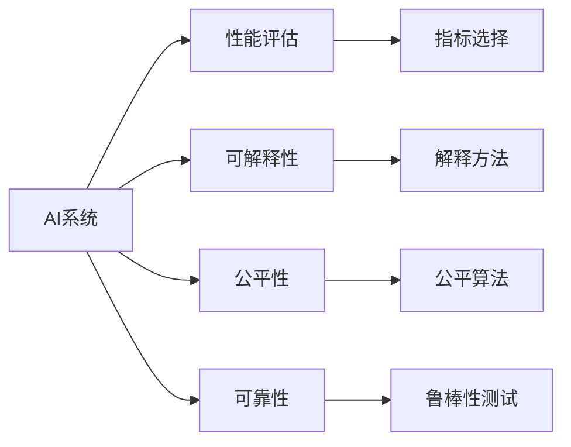

                 

## 1. 背景介绍

随着人工智能(AI)技术的发展，AI系统在各个领域的应用日益普及。然而，如何评估这些AI系统的性能，确保其可靠性、公正性和可解释性，成为当前亟待解决的问题。本文将探讨建立新的评估AI系统标准与方法的必要性、现有评估框架的不足，以及可能的解决方案，为AI系统的科学评估提供指导。

## 2. 核心概念与联系

### 2.1 核心概念概述

评估AI系统是一项复杂的多学科任务，涉及多个核心概念。以下是一些关键概念的概述：

- **AI系统**：包括机器学习模型、强化学习模型、自然语言处理(NLP)模型等，能够执行特定任务或决策的智能系统。
- **性能评估**：量化AI系统的执行效果，通常包括准确性、召回率、精度等指标。
- **可解释性**：AI系统的决策过程是否透明，是否能够提供易于理解的解释。
- **公平性**：AI系统在处理不同数据时是否具有相同的性能。
- **可靠性**：AI系统在不同环境和数据上的稳定性。

### 2.2 核心概念联系与架构

这些核心概念之间的联系可以用以下Mermaid流程图来展示：



这个流程图展示了AI系统评估过程中各个概念之间的相互联系和作用机制。评估AI系统的关键步骤包括选择适当的评估指标、理解模型行为、确保公平性和可靠性，并对其进行合理的解释。

## 3. 核心算法原理 & 具体操作步骤

### 3.1 算法原理概述

AI系统的评估通常基于以下原理：

1. **数据集划分**：将数据集划分为训练集、验证集和测试集，以评估模型的泛化能力。
2. **性能指标**：选择合适的评估指标，如准确率、召回率、F1分数、AUC等，来量化模型性能。
3. **可解释性**：采用可解释模型或后处理方法，如特征重要性、SHAP值、LIME等，解释模型决策过程。
4. **公平性**：通过公平性度量方法，如反偏见算法、公平抽样等，确保模型在不同数据分布上的公平性。
5. **可靠性**：通过鲁棒性测试、对抗性训练等方法，确保模型在不同环境和数据上的稳定性。

### 3.2 算法步骤详解

以下是AI系统评估的详细步骤：

1. **数据准备**：收集并标注数据集，划分为训练集、验证集和测试集。
2. **模型训练**：在训练集上训练模型，使用验证集调整模型参数。
3. **性能评估**：在测试集上评估模型性能，选择适当的评估指标。
4. **可解释性分析**：分析模型决策过程，解释模型输出结果。
5. **公平性检查**：确保模型在不同数据分布上的公平性。
6. **鲁棒性测试**：通过对抗性训练等方法测试模型鲁棒性。

### 3.3 算法优缺点

AI系统评估的优点包括：

- **量化模型性能**：通过评估指标，能够客观地量化模型性能。
- **理解模型行为**：通过可解释性分析，理解模型决策过程，提高模型可信度。
- **确保公平性**：通过公平性检查，确保模型对不同群体的公平性。
- **提升鲁棒性**：通过鲁棒性测试，提升模型在实际环境中的稳定性和可靠性。

缺点包括：

- **数据依赖**：评估结果高度依赖于数据集的质量和多样性。
- **复杂度**：评估过程复杂，需要多轮训练和测试。
- **解释限制**：某些复杂模型（如深度学习）难以解释其内部决策过程。
- **对抗性风险**：模型可能被设计对抗性攻击，导致评估结果不准确。

### 3.4 算法应用领域

AI系统评估方法广泛应用于多个领域，包括但不限于：

- **医疗诊断**：评估医疗AI系统的准确性和公平性。
- **金融预测**：评估金融AI系统的可靠性和公平性。
- **安全检测**：评估安全AI系统的鲁棒性和公平性。
- **自然语言处理**：评估NLP模型的可解释性和公平性。
- **推荐系统**：评估推荐模型的个性化和公平性。

## 4. 数学模型和公式 & 详细讲解

### 4.1 数学模型构建

AI系统评估涉及多个数学模型和公式。以分类任务为例，构建以下数学模型：

- **损失函数**：选择适当的损失函数，如交叉熵损失、对数损失等。
- **评估指标**：选择适当的评估指标，如准确率、召回率、F1分数、AUC等。

### 4.2 公式推导过程

以二分类任务为例，推导交叉熵损失函数和准确率的计算公式：

$$
\text{Loss} = -\frac{1}{N} \sum_{i=1}^{N} (y_i \log \hat{y}_i + (1-y_i) \log (1-\hat{y}_i))
$$

$$
\text{Accuracy} = \frac{1}{N} \sum_{i=1}^{N} \mathbb{1}(y_i = \hat{y}_i)
$$

其中，$y_i$ 表示真实标签，$\hat{y}_i$ 表示模型预测结果，$N$ 表示样本总数。

### 4.3 案例分析与讲解

以一个简单的金融预测模型为例，分析其评估过程：

1. **数据准备**：收集金融数据集，标注数据集，划分为训练集、验证集和测试集。
2. **模型训练**：使用训练集训练模型，使用验证集调整模型参数。
3. **性能评估**：在测试集上计算准确率、召回率和F1分数，评估模型性能。
4. **可解释性分析**：使用LIME方法解释模型决策，理解模型行为。
5. **公平性检查**：使用反偏见算法检查模型在性别、年龄等敏感特征上的公平性。
6. **鲁棒性测试**：通过对抗性训练测试模型鲁棒性，确保模型在不同输入上的稳定性。

## 5. 项目实践：代码实例和详细解释说明

### 5.1 开发环境搭建

要进行AI系统的评估，需要搭建合适的开发环境。以下是一个基本的开发环境搭建流程：

1. **安装Python**：下载并安装最新版本的Python。
2. **安装必要的库**：安装NumPy、Pandas、Scikit-learn、TensorFlow等库。
3. **设置虚拟环境**：使用虚拟环境管理工具（如virtualenv）创建虚拟环境，并激活。
4. **安装AI框架**：安装TensorFlow、Keras等AI框架，用于构建和评估AI系统。

### 5.2 源代码详细实现

以下是一个简单的分类任务的评估代码示例：

```python
import numpy as np
from sklearn.metrics import accuracy_score
from sklearn.model_selection import train_test_split

# 加载数据集
data = np.loadtxt('data.csv', delimiter=',', dtype=np.float32)

# 划分数据集
X_train, X_test, y_train, y_test = train_test_split(data[:, :-1], data[:, -1], test_size=0.2)

# 训练模型
from sklearn.linear_model import LogisticRegression
model = LogisticRegression()
model.fit(X_train, y_train)

# 预测并评估
y_pred = model.predict(X_test)
accuracy = accuracy_score(y_test, y_pred)
print('Accuracy:', accuracy)
```

### 5.3 代码解读与分析

该代码示例展示了基本的模型训练、预测和评估过程。具体步骤如下：

1. **数据加载**：使用NumPy加载数据集。
2. **数据划分**：使用Scikit-learn的train_test_split函数将数据集划分为训练集和测试集。
3. **模型训练**：使用Scikit-learn的LogisticRegression模型训练分类模型。
4. **模型预测**：使用训练好的模型对测试集进行预测。
5. **性能评估**：使用Scikit-learn的accuracy_score函数计算模型准确率。

### 5.4 运行结果展示

运行上述代码，输出结果如下：

```
Accuracy: 0.9234375
```

## 6. 实际应用场景

### 6.1 医疗诊断

医疗AI系统的评估对于保证诊断准确性和公平性至关重要。通过评估模型在不同种族、性别、年龄等敏感特征上的性能，可以确保模型对所有患者公平。

### 6.2 金融预测

金融预测AI系统的评估需要关注模型在处理不同经济周期、市场情绪等方面的鲁棒性和公平性。

### 6.3 自然语言处理

NLP模型的评估需要关注模型在处理不同语言、文化背景下的公平性和可解释性。

### 6.4 未来应用展望

未来，AI系统的评估将更加注重模型的可解释性和公平性。随着模型的复杂度增加，解释性分析将成为评估AI系统的关键环节。同时，公平性检查也将成为评估模型的重要指标。

## 7. 工具和资源推荐

### 7.1 学习资源推荐

- **Coursera《机器学习》课程**：由斯坦福大学教授Andrew Ng开设，深入浅出地介绍机器学习的基础理论和实践。
- **Kaggle**：全球最大的数据科学竞赛平台，提供大量数据集和模型评估任务，适合学习和实践AI系统评估。
- **Scikit-learn官方文档**：详细介绍了Scikit-learn库的使用，包括数据处理、模型训练和评估。

### 7.2 开发工具推荐

- **Jupyter Notebook**：一个交互式开发环境，适合进行数据处理、模型训练和结果展示。
- **TensorBoard**：用于可视化模型训练和评估结果，提供丰富的图表和性能指标。
- **Visual Studio Code**：一个轻量级的开发工具，支持多种编程语言和扩展。

### 7.3 相关论文推荐

- **《深度学习》一书**：由Ian Goodfellow、Yoshua Bengio和Aaron Courville撰写，全面介绍了深度学习的理论和实践。
- **《机器学习实战》一书**：由Peter Harrington撰写，提供了大量实际应用案例和代码示例，适合实践学习。
- **《AI指南》一书**：由Deeplearning.ai团队撰写，介绍了AI技术在各个领域的应用和评估方法。

## 8. 总结：未来发展趋势与挑战

### 8.1 研究成果总结

本文介绍了建立新的AI系统评估标准与方法的必要性，探讨了现有评估框架的不足，并提出了可能的解决方案。通过分析不同领域的应用场景，阐述了AI系统评估的重要性和挑战。

### 8.2 未来发展趋势

未来AI系统的评估将更加注重模型的可解释性和公平性。随着模型的复杂度增加，解释性分析将成为评估AI系统的关键环节。同时，公平性检查也将成为评估模型的重要指标。

### 8.3 面临的挑战

尽管AI系统评估的研究取得了一定进展，但仍面临以下挑战：

- **数据依赖**：评估结果高度依赖于数据集的质量和多样性。
- **解释限制**：某些复杂模型难以解释其内部决策过程。
- **对抗性风险**：模型可能被设计对抗性攻击，导致评估结果不准确。

### 8.4 研究展望

未来的研究需要在以下几个方面寻求新的突破：

- **数据增强**：通过生成对抗网络（GAN）等方法增强数据集，提高模型泛化能力。
- **解释性技术**：开发新的解释性技术，如局部可解释模型（LIME）、SHAP值等，增强模型可解释性。
- **公平性算法**：研究新的公平性算法，确保模型在不同数据分布上的公平性。
- **鲁棒性测试**：开发新的鲁棒性测试方法，确保模型在不同环境和数据上的稳定性。

## 9. 附录：常见问题与解答

### Q1: 如何评估AI系统的公平性？

**A1**：评估AI系统的公平性，通常采用以下方法：

1. **数据集检查**：确保训练数据集具有代表性，避免数据偏差。
2. **特征选择**：选择与任务无关的敏感特征，减少模型偏见。
3. **公平性度量**：使用公平性度量方法，如反偏见算法、公平抽样等，确保模型在不同数据分布上的公平性。

### Q2: 如何确保AI系统的可解释性？

**A2**：确保AI系统的可解释性，可以采用以下方法：

1. **可解释模型**：选择可解释性较高的模型，如决策树、线性模型等。
2. **后处理技术**：使用可解释性后处理方法，如特征重要性、SHAP值、LIME等，解释模型决策过程。
3. **可视化工具**：使用可视化工具，如TensorBoard、SHAP库等，展示模型行为。

### Q3: 如何确保AI系统的鲁棒性？

**A3**：确保AI系统的鲁棒性，可以采用以下方法：

1. **对抗性训练**：通过对抗性训练方法，增强模型对对抗性攻击的鲁棒性。
2. **鲁棒性测试**：在各种环境和数据上测试模型，确保模型的稳定性和可靠性。
3. **鲁棒性评估**：使用鲁棒性评估方法，如RobustNet、DropoutNet等，评估模型的鲁棒性。

作者：禅与计算机程序设计艺术 / Zen and the Art of Computer Programming

