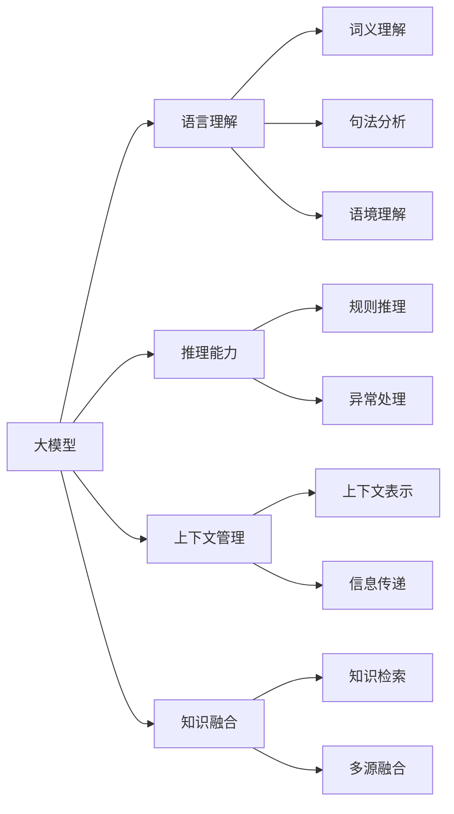

                 

# 语言与推理：大模型的认知难题

> 关键词：认知心理学,大模型,语言理解,推理能力,推理过程

## 1. 背景介绍

在现代人工智能的研究中，语言理解与推理能力无疑是核心能力之一。大模型作为当前最前沿的AI技术，其语言理解与推理能力之强大令人惊叹，却在面对人类认知难题时显得力不从心。本文将深入探讨大模型的语言与推理能力，以及其所面临的认知难题。

### 1.1 问题由来

语言与推理是认知科学的两大核心问题。语言是人类信息传递、思考与交流的基础，而推理则是个体智慧和决策的关键来源。在AI领域，尤其是自然语言处理（NLP）领域，理解和推理能力的构建始终是研究的热点。

目前，基于深度学习的大模型（如GPT-3、BERT等）在语言理解与推理方面已取得了显著进展，但这些模型仍存在认知上的“瓶颈”。例如，当输入的语句涉及复杂的逻辑或知识时，模型往往无法准确理解，甚至产生错误推理。这些认知难题直接关系到AI模型能否更好地服务于人类的生产生活。

### 1.2 问题核心关键点

认知难题主要体现在以下几个方面：
1. **语言理解深度**：大模型虽然在词嵌入和上下文理解方面表现优异，但与人类在语言学、语义学、修辞学等方面的理解仍存在差距。
2. **推理能力局限**：模型的推理过程缺乏形式化推理的严谨性，难以像人类一样灵活运用逻辑规则。
3. **上下文管理**：模型在处理长序列时难以有效管理上下文，容易引入错误信息。
4. **知识融合**：模型难以融合和利用多源知识，推理过程依赖于单一的信息源。
5. **异常情况处理**：模型在面对异常情况时，容易产生错误推理或无法给出合理解释。

理解这些核心关键点，有助于我们更深入地探索大模型的认知难题，并寻找可能的解决方案。

## 2. 核心概念与联系

### 2.1 核心概念概述

为了更好地理解大模型在语言与推理方面的表现和局限，本文将涉及以下核心概念：

- **大模型 (Large Model)**：如GPT-3、BERT等，具有大规模参数和复杂结构的深度学习模型，适用于大规模语料库的训练，擅长处理自然语言文本。
- **语言理解 (Language Understanding)**：指模型对自然语言文本的准确解读，包括词义、句法、语境等多方面信息的综合。
- **推理能力 (Reasoning Ability)**：指模型根据已有知识进行逻辑推断的能力，包括推理规则的应用和异常情况的应对。
- **上下文管理 (Context Management)**：指模型在处理长序列时，如何有效管理并利用上下文信息。
- **知识融合 (Knowledge Integration)**：指模型如何融合和利用多源知识，进行更全面的推理。

### 2.2 核心概念原理和架构的 Mermaid 流程图



这个流程图展示了大模型的核心概念及其相互关系：
- 大模型通过语言理解、推理能力、上下文管理、知识融合四个方面共同作用，实现语言与推理的过程。
- 语言理解通过词义、句法、语境等多维度的信息解读，为推理能力提供基础。
- 推理能力基于规则推理和异常处理，进行逻辑推断。
- 上下文管理通过上下文表示和信息传递，确保长序列处理中的信息一致性。
- 知识融合通过知识检索和多源融合，综合多源知识，提升推理的全面性。

## 3. 核心算法原理 & 具体操作步骤

### 3.1 算法原理概述

大模型在进行语言理解与推理时，主要基于大规模语料库进行预训练，学习语言模式和统计规律。在微调阶段，模型通过特定任务的训练数据进行有监督学习，进一步提升其在特定任务上的理解和推理能力。

### 3.2 算法步骤详解

大模型的语言理解与推理算法步骤主要分为以下几个部分：

1. **预训练 (Pre-training)**：在大规模无标注文本数据上，通过自监督学习任务（如掩码语言模型、自回归语言模型）进行预训练，学习语言的基本模式和规律。
2. **微调 (Fine-tuning)**：在特定任务的标注数据集上，通过有监督学习进一步提升模型的理解和推理能力，适配特定任务的需求。
3. **推理过程 (Inference)**：在推理任务中，模型根据输入的文本信息，综合上下文和知识，进行逻辑推断和结果生成。

### 3.3 算法优缺点

大模型在语言理解与推理方面具有以下优点：
1. **强大的学习能力**：能够从大规模语料库中学习丰富的语言模式，适用于多种自然语言处理任务。
2. **灵活性高**：通过微调和迁移学习，能够适应多种特定任务。
3. **可扩展性**：通过增加模型参数和层数，可以提升推理能力。

同时，这些模型也存在以下缺点：
1. **依赖语料库**：模型的表现高度依赖于训练数据的质量和数量，数据偏差会影响模型的理解与推理能力。
2. **计算资源消耗大**：大规模模型需要大量计算资源进行训练和推理。
3. **缺乏形式化推理**：与人类相比，模型推理过程缺乏形式化推理的严谨性。
4. **上下文管理能力有限**：处理长序列时容易引入错误信息。

### 3.4 算法应用领域

大模型在以下领域中广泛应用：

- **自然语言处理 (NLP)**：如文本分类、情感分析、问答系统等。
- **机器翻译 (MT)**：如英中翻译、日中翻译等。
- **信息检索 (IR)**：如文本检索、问答系统等。
- **对话系统 (DS)**：如智能客服、机器人对话等。
- **推荐系统 (RS)**：如个性化推荐、广告推荐等。

## 4. 数学模型和公式 & 详细讲解 & 举例说明

### 4.1 数学模型构建

为了更好地描述大模型在语言理解与推理方面的数学模型，本文将构建一个简单的推理模型，以自回归语言模型为例进行说明。

### 4.2 公式推导过程

在自回归语言模型中，假设模型根据前 $t-1$ 个单词预测第 $t$ 个单词的概率分布为：

$$
p(w_t | w_1, ..., w_{t-1}) = \frac{e^{E_{\theta}(w_t; w_1, ..., w_{t-1})}}{\sum_{w' \in V} e^{E_{\theta}(w' ; w_1, ..., w_{t-1})}}
$$

其中 $E_{\theta}(w_t; w_1, ..., w_{t-1})$ 为模型的预测能量函数，$\theta$ 为模型参数。

推理过程则通过上下文向量 $c$ 的计算：

$$
c_t = \text{MultiHeadSelfAttention}(c_{t-1}, c_{t-1}, c_{t-1})
$$

接着通过前馈神经网络层的处理：

$$
h_t = \text{FeedForwardNetwork}(c_t)
$$

最后通过输出层的处理，得到预测结果：

$$
p(w_t | w_1, ..., w_{t-1}) = \text{Softmax}(A_{\theta}(h_t))
$$

其中 $\text{Softmax}$ 函数用于将输出转换为概率分布，$A_{\theta}$ 为输出层的参数矩阵。

### 4.3 案例分析与讲解

以翻译任务为例，假设输入句子为 "I love Beijing"，输出为 "Je aime Beijing"，推理过程可以分解为以下几个步骤：

1. 预处理输入句子，得到标记序列 "I love Beijing"
2. 计算上下文向量 $c$，通过自注意力机制捕捉单词间的语义关系
3. 通过前馈神经网络层进行特征提取
4. 计算输出层能量，进行概率分布预测
5. 将概率分布转换为实际输出结果 "Je aime Beijing"

这个例子展示了自回归语言模型在翻译任务中的推理过程，通过上下文向量和特征提取，模型能够捕捉单词间的语义关系，并进行准确的翻译。

## 5. 项目实践：代码实例和详细解释说明

### 5.1 开发环境搭建

进行项目实践时，我们需要以下环境：

1. Python：版本为3.7及以上
2. PyTorch：版本为1.8及以上
3. Transformers库：版本为4.6及以上
4. 相关数据集：如WMT英语-中文翻译数据集

### 5.2 源代码详细实现

```python
import torch
from transformers import AutoTokenizer, AutoModelForSeq2SeqLM

# 加载预训练模型和分词器
tokenizer = AutoTokenizer.from_pretrained('bert-base-cased')
model = AutoModelForSeq2SeqLM.from_pretrained('bert-base-cased')

# 输入数据预处理
input_text = "I love Beijing"
input_tokens = tokenizer(input_text, return_tensors='pt', padding=True, truncation=True)[0]
max_length = input_tokens.shape[1]
attention_mask = input_tokens != tokenizer.pad_token_id

# 推理过程
with torch.no_grad():
    outputs = model.generate(input_tokens, max_length=max_length, num_beams=5, early_stopping=True)
    predicted_tokens = tokenizer.decode(outputs[0], skip_special_tokens=True)

print(f"Input: {input_text}")
print(f"Output: {predicted_tokens}")
```

### 5.3 代码解读与分析

上述代码展示了使用BERT模型进行翻译的推理过程：

1. 首先，加载预训练模型和分词器。
2. 对输入文本进行预处理，得到标记序列。
3. 计算注意力掩码，用于忽略填充标记。
4. 使用生成函数进行推理，得到输出序列。
5. 将输出序列解码为可读文本。

这个代码示例展示了BERT模型在翻译任务中的简单实现，其中关键的参数包括：
- `num_beams`：控制生成的候选数量。
- `early_stopping`：当生成的候选数量达到指定值时，停止生成。

## 6. 实际应用场景

### 6.1 智能客服系统

在智能客服系统中，大模型可以通过微调学习特定行业和场景的对话知识，进行更精准的对话理解与推理。例如，对于医疗咨询，模型可以学习医疗领域的术语和规则，生成合理的回答。

### 6.2 金融舆情监测

在金融舆情监测中，大模型可以实时分析新闻、报告等文本数据，进行情感分析和主题识别，从而监控市场动态，预测股市趋势。

### 6.3 个性化推荐系统

在个性化推荐系统中，大模型可以通过用户行为数据进行推理，生成个性化的推荐结果。例如，通过分析用户的历史浏览记录，模型可以预测用户可能感兴趣的商品或内容。

### 6.4 未来应用展望

未来，大模型的语言与推理能力将进一步提升，应用领域将更加广泛。例如，在医疗诊断、法律咨询、科学研究等领域，大模型有望提供更精准的辅助决策。

## 7. 工具和资源推荐

### 7.1 学习资源推荐

为了学习大模型在语言与推理方面的应用，推荐以下资源：

1. **《深度学习》（周志华）**：该书详细介绍了深度学习的基本原理和应用，是理解大模型推理能力的必备读物。
2. **《自然语言处理综论》（Daniel Jurafsky和James H. Martin）**：该书系统介绍了自然语言处理的各个方面，涵盖语言理解与推理。
3. **《神经网络与深度学习》（Michael Nielsen）**：该书深入浅出地介绍了神经网络和深度学习的原理，适合初学者和进阶学习者。
4. **Hugging Face官方文档**：提供了大量预训练模型的详细介绍和代码示例，是学习大模型的重要资源。

### 7.2 开发工具推荐

为了进行大模型的开发与实践，推荐以下工具：

1. **PyTorch**：深度学习框架，支持动态计算图，适合研究与开发。
2. **TensorFlow**：深度学习框架，支持静态图，适合大规模生产部署。
3. **Transformers库**：提供了大量预训练模型的封装，简化开发过程。
4. **GitHub**：代码托管平台，可以方便地分享、协作和版本控制。
5. **Jupyter Notebook**：交互式编程环境，支持代码块和可视化的结合。

### 7.3 相关论文推荐

以下是几篇与大模型在语言与推理方面相关的经典论文，推荐阅读：

1. **Attention is All You Need**：Transformer论文，提出自注意力机制，彻底改变了NLP领域。
2. **BERT: Pre-training of Deep Bidirectional Transformers for Language Understanding**：提出BERT模型，通过掩码语言模型预训练，提升了语言理解能力。
3. **Generating Large-Scale Zero-Shot Knowledge Bases**：提出K-BERT模型，通过零样本学习生成大规模知识库。
4. **RAG: Reading Aloud: Large-Scale Document Question Answering with Copying as Serving Knowledge**：提出RAG模型，通过阅读理解生成详细的回答。

这些论文代表了当前大模型在语言与推理方面最新的研究成果，值得深入学习。

## 8. 总结：未来发展趋势与挑战

### 8.1 总结

本文深入探讨了大模型在语言与推理方面的表现和局限，通过具体实例和数学模型，展示了其强大的语言理解能力，同时也指出了其在推理能力、上下文管理等方面的挑战。

通过上述分析，可以看出大模型在语言与推理方面的潜力与不足，为我们未来研究和应用提供了重要的参考。

### 8.2 未来发展趋势

未来，大模型的语言与推理能力将进一步提升，主要趋势包括：

1. **多模态推理**：将视觉、听觉等多模态信息与文本信息相结合，提升模型的全面推理能力。
2. **因果推理**：引入因果推断方法，增强模型的逻辑推理能力。
3. **知识图谱与逻辑推理**：结合知识图谱与逻辑推理规则，提升模型的规则推理能力。
4. **解释性增强**：通过可解释性方法，增强模型的推理过程的可理解性。
5. **跨领域知识融合**：通过多领域知识的融合，提升模型的泛化能力。

### 8.3 面临的挑战

尽管大模型在语言与推理方面取得了显著进展，但未来仍面临以下挑战：

1. **计算资源消耗大**：大规模模型的训练和推理需要大量计算资源。
2. **知识获取与融合**：如何有效地获取和融合多领域知识，是未来需要解决的问题。
3. **形式化推理的缺乏**：模型的推理过程缺乏形式化推理的严谨性。
4. **推理过程的可解释性**：模型的推理过程难以理解，缺乏可解释性。

### 8.4 研究展望

未来，我们需要在以下几个方面进行深入研究：

1. **知识表示学习**：学习更加精确的知识表示，提升模型的推理能力。
2. **多模态融合技术**：开发多模态融合算法，提升模型的全面推理能力。
3. **因果推理框架**：构建因果推理框架，提升模型的逻辑推理能力。
4. **可解释性方法**：开发可解释性方法，增强模型的推理过程可理解性。
5. **跨领域知识迁移**：研究跨领域知识迁移方法，提升模型的泛化能力。

## 9. 附录：常见问题与解答

**Q1: 大模型在推理过程中为什么会出现错误？**

A: 大模型在推理过程中可能出现错误的原因包括：
1. 数据偏差：如果训练数据存在偏差，模型可能学习到错误的知识。
2. 上下文管理不足：在处理长序列时，模型可能无法有效管理上下文信息，引入错误信息。
3. 推理过程缺乏形式化推理：模型的推理过程缺乏形式化推理的严谨性，容易出现逻辑错误。

**Q2: 如何提高大模型的推理能力？**

A: 提高大模型的推理能力可以通过以下方法：
1. 增加训练数据量：通过增加训练数据量，提升模型的知识获取能力。
2. 多模态融合：将视觉、听觉等多模态信息与文本信息相结合，提升模型的全面推理能力。
3. 知识图谱与逻辑推理：结合知识图谱与逻辑推理规则，提升模型的规则推理能力。
4. 可解释性增强：通过可解释性方法，增强模型的推理过程的可理解性。

**Q3: 大模型在实际应用中可能面临哪些问题？**

A: 大模型在实际应用中可能面临以下问题：
1. 计算资源消耗大：大规模模型的训练和推理需要大量计算资源。
2. 知识获取与融合：如何有效地获取和融合多领域知识，是未来需要解决的问题。
3. 形式化推理的缺乏：模型的推理过程缺乏形式化推理的严谨性。
4. 推理过程的可解释性：模型的推理过程难以理解，缺乏可解释性。

**Q4: 大模型在语言理解与推理方面有哪些优势和劣势？**

A: 大模型在语言理解与推理方面的优势包括：
1. 强大的学习能力：能够从大规模语料库中学习丰富的语言模式，适用于多种自然语言处理任务。
2. 灵活性高：通过微调和迁移学习，能够适应多种特定任务。

劣势包括：
1. 依赖语料库：模型的表现高度依赖于训练数据的质量和数量，数据偏差会影响模型的理解与推理能力。
2. 计算资源消耗大：大规模模型需要大量计算资源进行训练和推理。
3. 上下文管理能力有限：处理长序列时容易引入错误信息。

**Q5: 如何有效地利用大模型的语言与推理能力？**

A: 利用大模型的语言与推理能力，可以通过以下方法：
1. 数据增强：通过数据增强技术，提升模型的泛化能力。
2. 多任务学习：通过多任务学习，提升模型的多任务处理能力。
3. 知识图谱与逻辑推理：结合知识图谱与逻辑推理规则，提升模型的规则推理能力。
4. 跨领域知识迁移：研究跨领域知识迁移方法，提升模型的泛化能力。

本文通过深入探讨大模型在语言与推理方面的表现和局限，展示了其在语言理解与推理方面的强大能力，同时指出了其在推理能力、上下文管理等方面的挑战。希望通过本文的分析，能够为未来的研究和应用提供有益的参考。

---

作者：禅与计算机程序设计艺术 / Zen and the Art of Computer Programming

