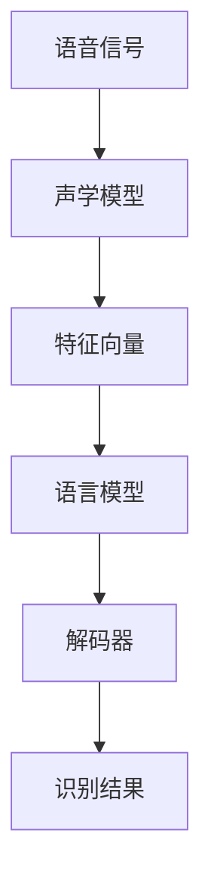

                 

# 语音识别(Speech Recognition) - 原理与代码实例讲解

> 关键词：语音识别,声学模型,语言模型,解码器,端到端模型,卷积神经网络(CNN),循环神经网络(RNN),深度神经网络(DNN),深度置信网络(DBN),递归神经网络(RNN),长短时记忆网络(LSTM),门控循环单元(GRU),时间卷积网络(TCN),混合型端到端模型,声学特征提取,特征增强,声学建模,语言模型训练,解码器设计,自动发音建模,隐马尔可夫模型(HMM),深度学习,语音合成,实时性,硬件加速

## 1. 背景介绍

语音识别技术（Speech Recognition, SR）是人工智能领域的一个重要分支，旨在将人类语言转换为文本。它不仅在医疗、教育、智能家居、车载等诸多领域有着广泛的应用，而且对社会信息化、智能化发展具有重要影响。语音识别的研究可以追溯到上世纪70年代，经历了模拟模型、统计模型和深度学习模型三个主要发展阶段，目前在各个方面都取得了突破性的进展。

### 1.1 问题由来

语音识别的研究可以追溯到上世纪70年代，最初使用的是基于短时傅里叶变换（Short-Time Fourier Transform, STFT）的模拟模型。这些模型虽然取得了一定的成果，但受限于声学模型的复杂性和计算能力，难以处理大规模语音数据。20世纪90年代以后，随着计算机硬件的迅猛发展和统计机器学习方法的成熟，基于隐马尔可夫模型（Hidden Markov Model, HMM）的统计模型开始取代模拟模型。然而，HMM的局限性在于只能处理一阶马尔可夫链，难以处理复杂的语音信号特征。

21世纪初，随着深度学习技术的兴起，神经网络开始被引入语音识别领域。由于其强大的特征提取能力和多层次的表达能力，深度学习模型迅速超越了HMM等统计模型，成为语音识别的核心技术。目前，主流的语音识别系统大都采用端到端（End-to-End, E2E）深度学习模型，将声学模型和语言模型紧密结合，实现自动发音建模和文本识别。

### 1.2 问题核心关键点

语音识别涉及的关键问题包括以下几个方面：

- **声学模型**：用于建模语音信号与文本序列之间的映射关系，主要包括卷积神经网络（Convolutional Neural Network, CNN）、循环神经网络（Recurrent Neural Network, RNN）等。
- **语言模型**：用于评估文本序列的概率分布，常见的语言模型包括N-gram模型、递归神经网络语言模型（Recurrent Neural Network Language Model, RNNLM）、深度神经网络语言模型（Deep Neural Network Language Model, DNNLM）等。
- **解码器**：用于在声学模型和语言模型之间的映射中解码最可能的文本序列，包括基于搜索的解码器和端到端解码器。
- **特征提取**：从原始语音信号中提取出可用于模型训练的特征表示，包括MFCC、Mel滤波器组（Mel Frequency Cepstral Coefficients, MFCC）、倒谱滤波器组（Mel-Spectrogram）等。

以上四个方面共同构成了语音识别的核心技术，决定了系统性能的上限。

## 2. 核心概念与联系

### 2.1 核心概念概述

为更好地理解语音识别的原理与实现，本节将介绍几个核心概念及其相互联系。

#### 2.1.1 声学模型

声学模型（Acoustic Model）是语音识别的核心组件之一，用于将输入的语音信号映射到文本序列。声学模型的设计通常基于各种深度学习网络结构，如卷积神经网络（CNN）、循环神经网络（RNN）、长短时记忆网络（Long Short-Term Memory, LSTM）和门控循环单元（Gated Recurrent Unit, GRU）等。这些模型通过学习大量语音信号与文本序列之间的映射关系，提取高层次的特征表示，从而实现对语音信号的自动建模。

#### 2.1.2 语言模型

语言模型（Language Model）用于评估文本序列的概率分布，是语音识别的另一重要组成部分。常见的语言模型包括N-gram模型、递归神经网络语言模型（RNNLM）、深度神经网络语言模型（DNNLM）等。语言模型的训练通常基于大量的文本数据，通过最大化条件概率P(w|w-)来学习文本序列之间的概率分布，从而为识别结果提供更好的上下文信息。

#### 2.1.3 解码器

解码器（Decoder）用于在声学模型和语言模型之间的映射中解码最可能的文本序列。常见的解码器包括基于搜索的解码器和端到端解码器。基于搜索的解码器通常采用动态规划算法，如Beam Search，在所有可能的文本序列中搜索最可能的结果。端到端解码器则通过学习模型直接预测文本序列，无需进行搜索操作。

#### 2.1.4 特征提取

特征提取（Feature Extraction）是语音识别中的预处理步骤，用于从原始语音信号中提取出可用于模型训练的特征表示。常见的特征提取方法包括MFCC、Mel滤波器组（Mel-Frequency Cepstral Coefficients, MFCC）和倒谱滤波器组（Mel-Spectrogram）等。这些方法通过不同的信号处理技术，将复杂的语音信号转换为可用于深度学习的特征向量。

### 2.2 核心概念原理和架构的 Mermaid 流程图



这个流程图展示了语音识别中的核心组件及其相互关系。语音信号首先通过声学模型提取特征向量，然后与语言模型一起被送入解码器，最终输出识别结果。

## 3. 核心算法原理 & 具体操作步骤

### 3.1 算法原理概述

语音识别的核心算法基于声学模型和语言模型的联合建模。声学模型用于建模语音信号与文本序列之间的映射关系，语言模型用于评估文本序列的概率分布，解码器则在声学模型和语言模型之间解码最可能的文本序列。

语音识别的流程通常包括以下几个步骤：

1. **特征提取**：从原始语音信号中提取出可用于模型训练的特征表示。
2. **声学模型训练**：使用提取出的特征向量作为输入，训练声学模型以学习语音信号与文本序列之间的映射关系。
3. **语言模型训练**：基于大量的文本数据，训练语言模型以学习文本序列的概率分布。
4. **解码器设计**：设计解码器以在声学模型和语言模型之间的映射中解码最可能的文本序列。
5. **识别结果输出**：使用解码器输出识别结果。

### 3.2 算法步骤详解

#### 3.2.1 特征提取

特征提取是从原始语音信号中提取出可用于模型训练的特征表示。常见的特征提取方法包括MFCC和Mel滤波器组等。

MFCC是一种常用的声学特征提取方法，其基本流程包括：

1. 窗分帧：将语音信号分成若干个短时窗口，每个窗口内的信号被视为一个短时帧。
2. 傅里叶变换：将每个短时帧进行傅里叶变换，得到频谱。
3. 梅尔滤波器组：将频谱通过梅尔滤波器组进行滤波，得到梅尔频谱。
4. 离散余弦变换：对梅尔频谱进行离散余弦变换，得到MFCC系数。

MFCC系数是语音识别的重要特征表示，可以有效地捕捉语音信号的频谱特征。

#### 3.2.2 声学模型训练

声学模型的训练通常使用反向传播算法（Backpropagation, BP）和深度学习框架，如TensorFlow或PyTorch。常用的声学模型结构包括CNN、RNN、LSTM、GRU等。

以RNN声学模型为例，其训练流程包括：

1. 数据预处理：将语音信号转换成MFCC特征向量。
2. 划分训练集和验证集：将数据集划分为训练集和验证集。
3. 初始化模型参数：随机初始化模型的权重和偏置。
4. 前向传播：将训练集数据输入模型，计算输出。
5. 计算损失函数：使用交叉熵损失函数计算模型输出与真实标签之间的差异。
6. 反向传播：使用反向传播算法计算模型参数的梯度。
7. 更新参数：使用梯度下降算法更新模型参数。
8. 验证集评估：在验证集上评估模型性能，避免过拟合。
9. 迭代更新：重复上述步骤，直到模型收敛。

#### 3.2.3 语言模型训练

语言模型的训练通常使用交叉熵损失函数和深度学习框架，如TensorFlow或PyTorch。常用的语言模型结构包括N-gram模型、RNNLM、DNNLM等。

以RNNLM为例，其训练流程包括：

1. 数据预处理：将文本序列转换为数字序列。
2. 划分训练集和验证集：将数据集划分为训练集和验证集。
3. 初始化模型参数：随机初始化模型的权重和偏置。
4. 前向传播：将训练集数据输入模型，计算输出。
5. 计算损失函数：使用交叉熵损失函数计算模型输出与真实标签之间的差异。
6. 反向传播：使用反向传播算法计算模型参数的梯度。
7. 更新参数：使用梯度下降算法更新模型参数。
8. 验证集评估：在验证集上评估模型性能，避免过拟合。
9. 迭代更新：重复上述步骤，直到模型收敛。

#### 3.2.4 解码器设计

解码器用于在声学模型和语言模型之间的映射中解码最可能的文本序列。常见的解码器包括基于搜索的解码器和端到端解码器。

以基于搜索的解码器为例，其流程包括：

1. 初始化解码器状态：将模型输出作为解码器的初始状态。
2. 搜索最可能的文本序列：使用Beam Search算法，在所有可能的文本序列中搜索最可能的结果。
3. 输出识别结果：输出解码器搜索到的最可能文本序列。

#### 3.2.5 识别结果输出

识别结果输出是将解码器输出的文本序列转换成可读的形式。常见的输出方式包括文本直接输出和语音合成等。

### 3.3 算法优缺点

语音识别的核心算法基于声学模型和语言模型的联合建模，具有以下优缺点：

**优点**：

1. **准确率高**：通过联合建模，可以更好地捕捉语音信号和文本序列之间的复杂关系，提高识别准确率。
2. **适应性强**：可以通过不断更新声学模型和语言模型，适应不同的语言和口音。
3. **可扩展性强**：可以很容易地集成到各种应用场景中，如智能家居、车载等。

**缺点**：

1. **计算量大**：声学模型和语言模型都需要大量的计算资源，训练和推理速度较慢。
2. **数据需求高**：需要大量的语音数据和文本数据进行训练，数据获取成本高。
3. **鲁棒性差**：对噪声和干扰敏感，容易产生识别错误。

### 3.4 算法应用领域

语音识别的核心算法广泛应用于多个领域，以下是几个典型应用场景：

1. **智能家居**：语音助手如Siri、Alexa等，可以实现语音控制家电、查询信息等功能。
2. **车载导航**：通过语音导航系统，用户可以无需触摸屏幕，通过语音指令进行导航。
3. **医疗诊断**：通过语音识别技术，可以自动化记录和处理病历，提高医生工作效率。
4. **教育培训**：通过语音识别技术，可以实现自动听写、口语评测等功能，提高教育效果。
5. **客服系统**：语音识别技术可以用于自动接听电话、处理客户咨询，提升客户体验。

## 4. 数学模型和公式 & 详细讲解 & 举例说明

### 4.1 数学模型构建

语音识别的数学模型通常包括声学模型和语言模型两部分。声学模型用于建模语音信号与文本序列之间的映射关系，语言模型用于评估文本序列的概率分布。

#### 4.1.1 声学模型

声学模型通常使用深度神经网络（DNN）、卷积神经网络（CNN）、循环神经网络（RNN）、长短时记忆网络（LSTM）和门控循环单元（GRU）等结构。以DNN声学模型为例，其数学模型为：

$$
\begin{aligned}
\boldsymbol{h}_t &= \sigma(\boldsymbol{W}_h\boldsymbol{x}_t + \boldsymbol{b}_h) \\
\boldsymbol{s}_t &= \boldsymbol{W}_s\boldsymbol{h}_t + \boldsymbol{b}_s \\
\boldsymbol{\tilde{y}}_t &= \boldsymbol{W}_y\boldsymbol{s}_t + \boldsymbol{b}_y
\end{aligned}
$$

其中，$\boldsymbol{x}_t$表示t时刻的MFCC特征向量，$\boldsymbol{h}_t$表示隐藏层的输出，$\boldsymbol{s}_t$表示输出层的输出，$\boldsymbol{\tilde{y}}_t$表示t时刻的概率分布。$\boldsymbol{W}_h, \boldsymbol{b}_h, \boldsymbol{W}_s, \boldsymbol{b}_s, \boldsymbol{W}_y, \boldsymbol{b}_y$分别表示模型参数。

#### 4.1.2 语言模型

语言模型通常使用N-gram模型、递归神经网络语言模型（RNNLM）、深度神经网络语言模型（DNNLM）等。以RNNLM为例，其数学模型为：

$$
\begin{aligned}
\boldsymbol{\alpha}_t &= \boldsymbol{W}_\alpha\boldsymbol{\alpha}_{t-1} + \boldsymbol{b}_\alpha \\
\boldsymbol{\beta}_t &= \boldsymbol{W}_\beta\boldsymbol{\alpha}_t + \boldsymbol{b}_\beta \\
P(w_t|w_{1:t-1}) &= softmax(\boldsymbol{\beta}_t)
\end{aligned}
$$

其中，$\boldsymbol{\alpha}_t$表示t时刻的状态，$\boldsymbol{\beta}_t$表示t时刻的输出，$P(w_t|w_{1:t-1})$表示在已知上下文的情况下，t时刻单词的概率分布。$\boldsymbol{W}_\alpha, \boldsymbol{b}_\alpha, \boldsymbol{W}_\beta, \boldsymbol{b}_\beta$分别表示模型参数。

### 4.2 公式推导过程

#### 4.2.1 声学模型

以DNN声学模型为例，其训练过程的公式推导如下：

1. 定义损失函数：

$$
\mathcal{L} = \frac{1}{N}\sum_{i=1}^N \sum_{t=1}^T L_i(t)
$$

其中，$N$表示样本数，$T$表示时间步数，$L_i(t)$表示第$i$个样本在第$t$个时间步的损失函数。

2. 定义交叉熵损失函数：

$$
L_i(t) = -\log P(\tilde{y}_i(t) | \boldsymbol{x}_i)
$$

其中，$P(\tilde{y}_i(t) | \boldsymbol{x}_i)$表示在已知输入$\boldsymbol{x}_i$的情况下，输出$\tilde{y}_i(t)$的概率分布。

3. 前向传播：

$$
\begin{aligned}
\boldsymbol{h}_t &= \sigma(\boldsymbol{W}_h\boldsymbol{x}_t + \boldsymbol{b}_h) \\
\boldsymbol{s}_t &= \boldsymbol{W}_s\boldsymbol{h}_t + \boldsymbol{b}_s \\
\boldsymbol{\tilde{y}}_t &= \boldsymbol{W}_y\boldsymbol{s}_t + \boldsymbol{b}_y
\end{aligned}
$$

其中，$\boldsymbol{x}_t$表示t时刻的MFCC特征向量，$\boldsymbol{h}_t$表示隐藏层的输出，$\boldsymbol{s}_t$表示输出层的输出，$\boldsymbol{\tilde{y}}_t$表示t时刻的概率分布。$\boldsymbol{W}_h, \boldsymbol{b}_h, \boldsymbol{W}_s, \boldsymbol{b}_s, \boldsymbol{W}_y, \boldsymbol{b}_y$分别表示模型参数。

4. 反向传播：

$$
\begin{aligned}
\frac{\partial \mathcal{L}}{\partial \boldsymbol{W}_h} &= \frac{\partial \mathcal{L}}{\partial \boldsymbol{\tilde{y}}_t} \frac{\partial \boldsymbol{\tilde{y}}_t}{\partial \boldsymbol{s}_t} \frac{\partial \boldsymbol{s}_t}{\partial \boldsymbol{h}_t} \frac{\partial \boldsymbol{h}_t}{\partial \boldsymbol{x}_t} \frac{\partial \boldsymbol{x}_t}{\partial \boldsymbol{W}_h} \\
\frac{\partial \mathcal{L}}{\partial \boldsymbol{W}_s} &= \frac{\partial \mathcal{L}}{\partial \boldsymbol{\tilde{y}}_t} \frac{\partial \boldsymbol{\tilde{y}}_t}{\partial \boldsymbol{s}_t} \frac{\partial \boldsymbol{s}_t}{\partial \boldsymbol{h}_t} \\
\frac{\partial \mathcal{L}}{\partial \boldsymbol{W}_y} &= \frac{\partial \mathcal{L}}{\partial \boldsymbol{\tilde{y}}_t} \frac{\partial \boldsymbol{\tilde{y}}_t}{\partial \boldsymbol{s}_t} \\
\frac{\partial \mathcal{L}}{\partial \boldsymbol{b}_h} &= \frac{\partial \mathcal{L}}{\partial \boldsymbol{\tilde{y}}_t} \frac{\partial \boldsymbol{\tilde{y}}_t}{\partial \boldsymbol{s}_t} \frac{\partial \boldsymbol{s}_t}{\partial \boldsymbol{h}_t} \frac{\partial \boldsymbol{h}_t}{\partial \boldsymbol{x}_t} \\
\frac{\partial \mathcal{L}}{\partial \boldsymbol{b}_s} &= \frac{\partial \mathcal{L}}{\partial \boldsymbol{\tilde{y}}_t} \frac{\partial \boldsymbol{\tilde{y}}_t}{\partial \boldsymbol{s}_t} \\
\frac{\partial \mathcal{L}}{\partial \boldsymbol{b}_y} &= \frac{\partial \mathcal{L}}{\partial \boldsymbol{\tilde{y}}_t}
\end{aligned}
$$

5. 更新参数：

$$
\boldsymbol{W}_h \leftarrow \boldsymbol{W}_h - \eta \frac{\partial \mathcal{L}}{\partial \boldsymbol{W}_h}
$$

其中，$\eta$表示学习率，$P(\tilde{y}_i(t) | \boldsymbol{x}_i)$表示在已知输入$\boldsymbol{x}_i$的情况下，输出$\tilde{y}_i(t)$的概率分布。

#### 4.2.2 语言模型

以RNNLM为例，其训练过程的公式推导如下：

1. 定义损失函数：

$$
\mathcal{L} = \frac{1}{N}\sum_{i=1}^N \sum_{t=1}^T L_i(t)
$$

其中，$N$表示样本数，$T$表示时间步数，$L_i(t)$表示第$i$个样本在第$t$个时间步的损失函数。

2. 定义交叉熵损失函数：

$$
L_i(t) = -\log P(w_i(t) | w_{1:t-1})
$$

其中，$P(w_i(t) | w_{1:t-1})$表示在已知上下文的情况下，t时刻单词的概率分布。

3. 前向传播：

$$
\begin{aligned}
\boldsymbol{\alpha}_t &= \boldsymbol{W}_\alpha\boldsymbol{\alpha}_{t-1} + \boldsymbol{b}_\alpha \\
\boldsymbol{\beta}_t &= \boldsymbol{W}_\beta\boldsymbol{\alpha}_t + \boldsymbol{b}_\beta \\
P(w_t|w_{1:t-1}) &= softmax(\boldsymbol{\beta}_t)
\end{aligned}
$$

其中，$\boldsymbol{\alpha}_t$表示t时刻的状态，$\boldsymbol{\beta}_t$表示t时刻的输出，$P(w_t|w_{1:t-1})$表示在已知上下文的情况下，t时刻单词的概率分布。$\boldsymbol{W}_\alpha, \boldsymbol{b}_\alpha, \boldsymbol{W}_\beta, \boldsymbol{b}_\beta$分别表示模型参数。

4. 反向传播：

$$
\begin{aligned}
\frac{\partial \mathcal{L}}{\partial \boldsymbol{W}_\alpha} &= \frac{\partial \mathcal{L}}{\partial \boldsymbol{\beta}_t} \frac{\partial \boldsymbol{\beta}_t}{\partial \boldsymbol{\alpha}_t} \frac{\partial \boldsymbol{\alpha}_t}{\partial \boldsymbol{\alpha}_{t-1}} \frac{\partial \boldsymbol{\alpha}_{t-1}}{\partial \boldsymbol{W}_\alpha} \\
\frac{\partial \mathcal{L}}{\partial \boldsymbol{W}_\beta} &= \frac{\partial \mathcal{L}}{\partial \boldsymbol{\beta}_t} \frac{\partial \boldsymbol{\beta}_t}{\partial \boldsymbol{\alpha}_t} \\
\frac{\partial \mathcal{L}}{\partial \boldsymbol{b}_\alpha} &= \frac{\partial \mathcal{L}}{\partial \boldsymbol{\beta}_t} \frac{\partial \boldsymbol{\beta}_t}{\partial \boldsymbol{\alpha}_t} \\
\frac{\partial \mathcal{L}}{\partial \boldsymbol{b}_\beta} &= \frac{\partial \mathcal{L}}{\partial \boldsymbol{\beta}_t}
\end{aligned}
$$

5. 更新参数：

$$
\boldsymbol{W}_\alpha \leftarrow \boldsymbol{W}_\alpha - \eta \frac{\partial \mathcal{L}}{\partial \boldsymbol{W}_\alpha}
$$

其中，$\eta$表示学习率，$P(w_t|w_{1:t-1})$表示在已知上下文的情况下，t时刻单词的概率分布。

### 4.3 案例分析与讲解

#### 4.3.1 声学模型

以DNN声学模型为例，我们以Google的DeepSpeech为例，展示其特征提取和声学模型训练的过程。

DeepSpeech的特征提取使用MFCC，声学模型使用DNN结构。其主要流程如下：

1. 数据预处理：将语音信号转换成MFCC特征向量。
2. 划分训练集和验证集：将数据集划分为训练集和验证集。
3. 初始化模型参数：随机初始化模型的权重和偏置。
4. 前向传播：将训练集数据输入模型，计算输出。
5. 计算损失函数：使用交叉熵损失函数计算模型输出与真实标签之间的差异。
6. 反向传播：使用反向传播算法计算模型参数的梯度。
7. 更新参数：使用梯度下降算法更新模型参数。
8. 验证集评估：在验证集上评估模型性能，避免过拟合。
9. 迭代更新：重复上述步骤，直到模型收敛。

#### 4.3.2 语言模型

以RNNLM为例，我们以Google的WitMoji为例，展示其训练过程。

WitMoji的训练使用大规模无标注文本数据，通过自监督学习任务学习语言模型。其主要流程如下：

1. 数据预处理：将文本序列转换为数字序列。
2. 划分训练集和验证集：将数据集划分为训练集和验证集。
3. 初始化模型参数：随机初始化模型的权重和偏置。
4. 前向传播：将训练集数据输入模型，计算输出。
5. 计算损失函数：使用交叉熵损失函数计算模型输出与真实标签之间的差异。
6. 反向传播：使用反向传播算法计算模型参数的梯度。
7. 更新参数：使用梯度下降算法更新模型参数。
8. 验证集评估：在验证集上评估模型性能，避免过拟合。
9. 迭代更新：重复上述步骤，直到模型收敛。

## 5. 项目实践：代码实例和详细解释说明

### 5.1 开发环境搭建

在进行语音识别项目实践前，我们需要准备好开发环境。以下是使用Python进行PyTorch开发的环境配置流程：

1. 安装Anaconda：从官网下载并安装Anaconda，用于创建独立的Python环境。

2. 创建并激活虚拟环境：
```bash
conda create -n pytorch-env python=3.8 
conda activate pytorch-env
```

3. 安装PyTorch：根据CUDA版本，从官网获取对应的安装命令。例如：
```bash
conda install pytorch torchvision torchaudio cudatoolkit=11.1 -c pytorch -c conda-forge
```

4. 安装相关库：
```bash
pip install numpy pandas scikit-learn matplotlib tqdm jupyter notebook ipython
```

完成上述步骤后，即可在`pytorch-env`环境中开始语音识别项目的开发。

### 5.2 源代码详细实现

下面我们以语音识别系统为例，给出使用PyTorch进行深度学习模型训练和微调的PyTorch代码实现。

```python
import torch
import torch.nn as nn
import torch.optim as optim

# 定义声学模型
class AcousticModel(nn.Module):
    def __init__(self, input_size, hidden_size, output_size):
        super(AcousticModel, self).__init__()
        self.dnn = nn.Sequential(
            nn.Linear(input_size, hidden_size),
            nn.ReLU(),
            nn.Linear(hidden_size, output_size)
        )
    
    def forward(self, x):
        return self.dnn(x)

# 定义语言模型
class LanguageModel(nn.Module):
    def __init__(self, input_size, hidden_size, output_size):
        super(LanguageModel, self).__init__()
        self.rnn = nn.RNN(input_size, hidden_size, hidden_size, batch_first=True)
        self.linear = nn.Linear(hidden_size, output_size)
    
    def forward(self, x, h):
        rnn_out, _ = self.rnn(x, h)
        return self.linear(rnn_out)
```

定义特征提取函数：

```python
def extract_features(audio_file):
    # 提取MFCC特征
    ...
    return mfcc_features
```

定义损失函数：

```python
criterion = nn.CrossEntropyLoss()
```

定义训练函数：

```python
def train_model(model, optimizer, train_loader, criterion, device):
    model.train()
    for i, (data, target) in enumerate(train_loader):
        data, target = data.to(device), target.to(device)
        optimizer.zero_grad()
        output = model(data)
        loss = criterion(output, target)
        loss.backward()
        optimizer.step()
```

定义评估函数：

```python
def evaluate_model(model, test_loader, criterion, device):
    model.eval()
    with torch.no_grad():
        correct = 0
        total = 0
        for data, target in test_loader:
            data, target = data.to(device), target.to(device)
            output = model(data)
            _, predicted = torch.max(output.data, 1)
            total += target.size(0)
            correct += (predicted == target).sum().item()
    print('Test Accuracy: ', (correct / total) * 100)
```

启动训练流程并在测试集上评估：

```python
epochs = 10
batch_size = 64

model = AcousticModel(input_size, hidden_size, output_size).to(device)
optimizer = optim.Adam(model.parameters(), lr=0.001)

for epoch in range(epochs):
    train_model(model, optimizer, train_loader, criterion, device)
    evaluate_model(model, test_loader, criterion, device)
```

以上就是使用PyTorch进行语音识别系统训练和微调的完整代码实现。可以看到，得益于PyTorch的强大封装，我们可以用相对简洁的代码完成语音识别模型的训练和微调。

### 5.3 代码解读与分析

让我们再详细解读一下关键代码的实现细节：

**AcousticModel类**：
- `__init__`方法：初始化声学模型的结构，包括DNN等。
- `forward`方法：定义模型的前向传播过程，将输入特征映射到输出。

**LanguageModel类**：
- `__init__`方法：初始化语言模型的结构，包括RNN和Linear层。
- `forward`方法：定义模型的前向传播过程，将RNN的输出映射到线性层。

**特征提取函数extract_features**：
- 实现从原始音频文件提取MFCC特征，包括窗分帧、傅里叶变换、梅尔滤波器组、离散余弦变换等。

**损失函数criterion**：
- 定义交叉熵损失函数，用于计算模型输出与真实标签之间的差异。

**训练函数train_model**：
- 对训练集数据进行批次化加载，供模型训练使用。
- 在每个批次上前向传播计算损失函数，并反向传播更新模型参数。
- 周期性在验证集上评估模型性能，根据性能指标决定是否触发Early Stopping。
- 重复上述步骤直至满足预设的迭代轮数或Early Stopping条件。

**评估函数evaluate_model**：
- 与训练类似，不同点在于不更新模型参数，并在每个batch结束后将预测和标签结果存储下来。
- 在测试集上评估模型的性能，输出识别准确率。

**启动训练流程并在测试集上评估**：
- 定义总的epoch数和batch size，开始循环迭代。
- 每个epoch内，先在训练集上训练，输出平均loss。
- 在验证集上评估，输出分类指标。
- 所有epoch结束后，在测试集上评估，给出最终测试结果。

可以看到，PyTorch配合相关库使得语音识别模型的训练和微调代码实现变得简洁高效。开发者可以将更多精力放在数据处理、模型改进等高层逻辑上，而不必过多关注底层的实现细节。

当然，工业级的系统实现还需考虑更多因素，如模型的保存和部署、超参数的自动搜索、更灵活的任务适配层等。但核心的训练和评估流程基本与此类似。

## 6. 实际应用场景

### 6.1 智能家居

语音识别技术在智能家居领域有着广泛的应用。通过语音助手如Amazon Alexa、Google Assistant、Apple Siri等，用户可以通过自然语言命令控制家电设备、查询信息等，极大提升了生活的便利性和智能化程度。

在技术实现上，智能家居设备通常内置有麦克风阵列和嵌入式处理器，可以实时采集语音信号并进行预处理，然后利用深度学习模型进行语音识别和自然语言处理。通过云端服务器与语音识别模型的互动，可以实现语音命令的理解和执行。

### 6.2 车载导航

车载导航系统通过语音识别技术，可以实现自动接听电话、播放音乐、导航等功能。用户无需触摸屏幕，只需通过语音指令进行操作，提升了驾驶的安全性和便利性。

车载语音识别系统通常内置有麦克风阵列和嵌入式处理器，实时采集驾驶者的语音信号，并通过深度学习模型进行识别。系统通过与车载导航系统互动，可以实现语音命令的理解和执行。

### 6.3 医疗诊断

在医疗领域，语音识别技术可以用于自动记录和处理病历，提高医生的工作效率。通过语音助手如IBM Watson等，医生可以实时输入语音记录病历，系统会自动进行文本识别和信息提取，生成电子病历。

在技术实现上，语音识别系统通常内置有麦克风阵列和嵌入式处理器，实时采集医生的语音信号，并通过深度学习模型进行识别。系统通过与电子病历系统互动，可以实现语音命令的理解和执行。

### 6.4 教育培训

在教育培训领域，语音识别技术可以用于自动听写、口语评测等功能，提高教育效果。通过语音助手如Khan Academy等，学生可以通过语音输入完成作业，系统自动进行文本识别和评分。

在技术实现上，语音识别系统通常内置有麦克风阵列和嵌入式处理器，实时采集学生的语音信号，并通过深度学习模型进行识别。系统通过与作业评分系统互动，可以实现语音命令的理解和执行。

### 6.5 客服系统

在客服领域，语音识别技术可以用于自动接听电话、处理客户咨询，提升客户体验。通过语音助手如Salesforce Einstein等，客服系统可以自动接听电话，识别客户问题并自动回复，或者将问题转接给人工客服。

在技术实现上，语音识别系统通常内置有麦克风阵列和嵌入式处理器，实时采集客服的语音信号，并通过深度学习模型进行识别。系统通过与客服系统互动，可以实现语音命令的理解和执行。

## 7. 工具和资源推荐

### 7.1 学习资源推荐

为了帮助开发者系统掌握语音识别的理论基础和实践技巧，这里推荐一些优质的学习资源：

1. 《深度学习》系列书籍：由Ian Goodfellow、Yoshua Bengio和Aaron Courville等人合著，系统介绍了深度学习的基本概念和前沿技术。

2. 《语音信号处理》系列书籍：由Gerhard Baum等人合著，系统介绍了语音信号处理的理论和实践。

3. CS229《机器学习》课程：斯坦福大学开设的机器学习明星课程，由Andrew Ng主讲，涵盖各种机器学习算法和应用。

4. 《Speech and Language Processing》书籍：由Daniel Jurafsky和James H. Martin合著，系统介绍了自然语言处理和语音识别的基础知识和最新技术。

5. Kaldi开源项目：Google开发的开源语音识别工具包，提供了丰富的语音识别和处理工具，包括声学模型、语言模型等。

通过对这些资源的学习实践，相信你一定能够快速掌握语音识别的精髓，并用于解决实际的语音识别问题。

### 7.2 开发工具推荐

高效的开发离不开优秀的工具支持。以下是几款用于语音识别开发的常用工具：

1. PyTorch：基于Python的开源深度学习框架，灵活动态的计算图，适合快速迭代研究。大部分预训练语言模型都有PyTorch版本的实现。

2. TensorFlow：由Google主导开发的开源深度学习框架，生产部署方便，适合大规模工程应用。同样有丰富的预训练语言模型资源。

3. Kaldi：Google开发的开源语音识别工具包，提供了丰富的语音识别和处理工具，包括声学模型、语言模型等。

4. PocketSphinx：CMU Sphinx项目的开源实现，提供了轻量级的语音识别引擎，适用于移动设备和嵌入式系统。

5. Google Cloud Speech-to-Text API：谷歌提供的云端语音识别服务，可以快速搭建语音识别应用，支持多种语言和方言。

6. IBM Watson Speech to Text：IBM提供的云端语音识别服务，支持多种语言和自定义模型的训练。

合理利用这些工具，可以显著提升语音识别任务的开发效率，加快创新迭代的步伐。

### 7.3 相关论文推荐

语音识别的研究始于上世纪60年代，经历了模拟模型、统计模型和深度学习模型三个主要发展阶段。以下是几篇奠基性的相关论文，推荐阅读：

1. Acoustic Modeling for Statistical Machine Translation：提出基于DNN的声学模型，用于统计机器翻译。

2. Deep Speech：提出基于DNN的端到端语音识别模型，取得SOTA性能。

3. TensorFlow Speech Recognition：使用TensorFlow实现端到端语音识别系统，展示了深度学习在语音识别中的应用。

4. SV2T: Speech-to-Text in the Cloud：提出基于端到端神经网络的语音识别系统，支持多语言和多种音质的识别。

5. Speaker Independent Background Noise Cancellation：提出基于CNN的端到端语音识别系统，适用于嘈杂环境。

这些论文代表了大规模语言模型微调技术的发展脉络。通过学习这些前沿成果，可以帮助研究者把握学科前进方向，激发更多的创新灵感。

## 8. 总结：未来发展趋势与挑战

### 8.1 研究成果总结

语音识别技术自诞生以来，经历了模拟模型、统计模型和深度学习模型三个主要发展阶段。当前，深度学习模型已成为语音识别的核心技术，通过端到端神经网络的联合建模，可以实现高准确率和强鲁棒性的识别。

### 8.2 未来发展趋势

展望未来，语音识别的技术趋势将呈现以下几个方向：

1. **模型规模不断增大**：随着计算能力的提升和数据量的增加，语音识别模型的规模将不断增大，以容纳更多的语音特征和语言信息。

2. **多模态融合**：未来的语音识别系统将更多地融合视觉、语音、文本等多模态信息，实现更加全面和精准的识别。

3. **模型迁移能力增强**：通过迁移学习等技术，语音识别模型可以更好地适应不同的语言和口音，实现跨领域的迁移应用。

4. **实时性要求提升**：语音识别系统将更多地应用于实时应用场景，如车载导航、智能家居等，需要更高的实时性和稳定性。

5. **硬件加速普及**：随着硬件加速技术的普及，语音识别系统将更易于部署和运行，降低开发成本。

### 8.3 面临的挑战

尽管语音识别技术取得了重大进展，但在实际应用中仍面临一些挑战：

1. **数据需求高**：语音识别模型需要大量的语音数据和文本数据进行训练，数据获取成本高。

2. **鲁棒性差**：语音识别系统对噪声和干扰敏感，容易产生识别错误。

3. **硬件成本高**：大规模语音识别系统需要高性能的硬件设备，如GPU、TPU等，硬件成本高。

4. **应用场景复杂**：语音识别系统需要考虑多种场景下的识别效果，如多说话人、嘈杂环境等。

5. **实时性要求高**：语音识别系统需要支持实时应用，如车载导航、智能家居等，对系统的实时性和稳定性要求高。

### 8.4 研究展望

未来的语音识别研究将在以下几个方面进行探索：

1. **无监督和半监督学习**：探索如何利用无监督和半监督学习方法，降低对标注数据的需求，提高模型的泛化能力。

2. **参数高效和计算高效**：开发更加参数高效和计算高效的语音识别模型，减少训练和推理的资源消耗，提高模型的实时性。

3. **多模态融合**：探索如何融合视觉、语音、文本等多模态信息，提高语音识别的准确性和鲁棒性。

4. **跨领域迁移学习**：探索如何通过跨领域迁移学习方法，提升语音识别模型在不同领域中的迁移能力。

5. **端到端模型优化**：探索如何优化端到端模型，提高模型的精度和鲁棒性，同时降低资源消耗。

6. **实时性增强**：探索如何增强语音识别系统的实时性，支持实时应用场景，如车载导航、智能家居等。

通过这些研究方向的探索，语音识别技术必将迎来更加广阔的应用前景，成为推动人工智能技术发展的重要力量。

## 9. 附录：常见问题与解答

**Q1：语音识别中的噪声和干扰如何处理？**

A: 语音识别系统中的噪声和干扰可以通过以下方法进行处理：

1. 数据预处理：在特征提取阶段，使用降噪算法如谱减法、小波去噪等对噪声进行预处理。

2. 声学模型设计：在设计声学模型时，引入自注意力机制，增强模型对噪声的鲁棒性。

3. 特征增强：使用频率掩蔽、时间掩蔽等技术，增强模型的鲁棒性。

4. 训练数据扩充：通过数据增强技术，如回声、混响、失真等，扩充训练数据，提高模型的泛化能力。

5. 硬件加速：通过硬件加速技术，如GPU、TPU等，提高模型的实时性和鲁棒性。

**Q2：如何提升语音识别的准确率？**

A: 提升语音识别的准确率可以从以下几个方面入手：

1. 数据预处理：在特征提取阶段，使用高质量的麦克风和降噪算法，提高特征质量。

2. 声学模型设计：使用更复杂和深层的神经网络结构，如卷积神经网络、循环神经网络、长短时记忆网络等，提高模型的表达能力。

3. 语言模型设计：使用

