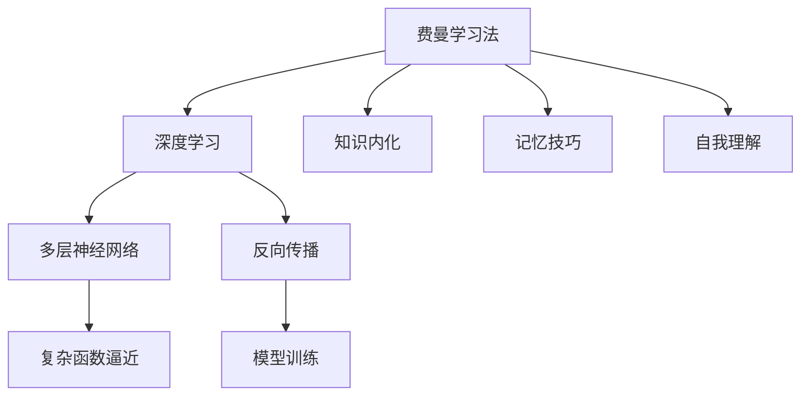

                 

# 费曼提问法:深度学习的利器

> 关键词：费曼学习法、深度学习、自我理解、记忆技巧、知识内化

## 1. 背景介绍

费曼学习法（Feynman Technique），由诺贝尔奖得主理查德·费曼提出，是一种通过模拟教学过程来深入理解知识的自学方法。它包括三个步骤：简化（Simplify）、讲解（Teach）、补充（Review）。该方法的核心在于通过教别人来加深自己的理解，将其转化为自己的知识体系。费曼学习法已被广泛应用于各个领域，特别在深度学习和人工智能领域，被视为一种极佳的自学工具。

深度学习（Deep Learning）作为人工智能的核心技术，近年来取得了显著进展，被广泛应用于图像识别、自然语言处理、语音识别等场景。然而，深度学习模型的学习过程往往包含大量超参数和复杂概念，难以理解其内在逻辑和原理，容易遗忘。费曼学习法提供了解决这一问题的有效途径，通过教学模拟，将深度学习的理论知识转化为自身的理解。

## 2. 核心概念与联系

### 2.1 核心概念概述

为更好地理解费曼学习法在深度学习中的应用，本节将介绍几个密切相关的核心概念：

- 费曼学习法（Feynman Technique）：一种通过模拟教学过程来加深对知识理解的自学方法，由诺贝尔奖得主理查德·费曼提出。
- 深度学习（Deep Learning）：一类利用多层神经网络逼近复杂函数的学习算法，通过反向传播算法进行训练，在图像、语音、文本等众多领域中取得突破。
- 知识内化（Knowledge Internalization）：将外界知识转化为自身知识体系的过程。深度学习中，模型通过大量训练数据逐步内化特征和模式，从而获得更好的泛化能力。
- 记忆技巧（Memory Techniques）：一些帮助记忆和巩固知识的技巧，如间隔重复、精简框架等。深度学习中，通过正则化、参数初始化等方法，提高模型的记忆力和稳定性。
- 自我理解（Self-Understanding）：对自身学习过程和知识掌握程度的自我评估，深度学习中，通过验证集和测试集的评估，了解模型性能和泛化能力。

这些核心概念之间的逻辑关系可以通过以下Mermaid流程图来展示：



这个流程图展示了几者之间的内在联系：

1. 费曼学习法通过模拟教学过程，帮助理解深度学习的基础知识。
2. 深度学习依赖于多层神经网络和反向传播算法，通过大量数据进行知识内化。
3. 知识内化过程中，记忆技巧和自我理解起到重要补充作用。
4. 复杂函数逼近和模型训练是深度学习的主要目标。

## 3. 核心算法原理 & 具体操作步骤

### 3.1 算法原理概述

费曼学习法在深度学习中的应用，主要体现在知识的内化和自我理解上。以下是对费曼学习法在深度学习中应用的详细解释。

### 3.2 算法步骤详解

费曼学习法在深度学习中的具体步骤包括：

1. **简化（Simplify）**：选择一个复杂但易于理解的概念，作为教学主题。在深度学习中，可以选择一个特定的神经网络层（如卷积层、池化层等），理解其功能及参数含义。

2. **讲解（Teach）**：模拟教学过程，向虚拟学生讲解该概念。在深度学习中，可以利用代码注释、论文摘要、白板推导等方式，将复杂的概念分解为更易于理解的小部分。

3. **补充（Review）**：查找遗漏或模糊的知识点，进行补充讲解。在深度学习中，可以通过重新阅读相关文献、查找网上教程、参加在线课程等方式，深入理解该概念。

4. **测试（Test）**：将所学知识应用到具体问题中，进行自我测试。在深度学习中，可以通过编写代码实现特定功能，或对新数据集进行预测，以检验所学知识的掌握程度。

### 3.3 算法优缺点

费曼学习法在深度学习中的应用，具有以下优点：

1. **深入理解**：通过教学模拟，将复杂概念分解为更易理解的小部分，有助于深入理解深度学习的理论基础。
2. **巩固记忆**：通过讲解和补充，将知识内化，提高模型的记忆力和稳定性。
3. **提高应用能力**：通过测试，检验所学知识的掌握程度，提升模型的应用能力。

同时，该方法也存在一些局限性：

1. **时间成本高**：费曼学习法需要大量时间进行教学模拟和测试，效率相对较低。
2. **依赖领域经验**：对于复杂的深度学习模型和算法，需要一定的领域知识基础，难以进行有效的教学模拟。
3. **缺乏交互性**：虚拟学生无法提供反馈，难以进行真实教学过程中的互动。

尽管存在这些局限性，但费曼学习法在深度学习中仍然具有不可替代的价值。未来相关研究的重点在于如何提高费曼学习法的效率和灵活性，使其更好地适应深度学习的研究和开发。

### 3.4 算法应用领域

费曼学习法在深度学习中的应用，可以应用于多个领域，具体包括：

1. **深度学习基础**：帮助初学者理解深度学习的基本概念和算法原理，如前馈神经网络、卷积神经网络、循环神经网络等。
2. **特定任务微调**：针对特定任务（如图像分类、语音识别、自然语言处理等）进行微调，将预训练模型转化为更具针对性的模型。
3. **模型调试与优化**：通过讲解和测试，对深度学习模型进行调试和优化，解决模型泛化能力和鲁棒性等问题。
4. **模型迁移与集成**：利用费曼学习法对不同深度学习模型进行迁移学习，提高模型的泛化能力。
5. **领域知识学习**：将特定领域的知识（如生物信息学、金融分析等）应用于深度学习模型中，提升模型在该领域的性能。

## 4. 数学模型和公式 & 详细讲解  
### 4.1 数学模型构建

在深度学习中，费曼学习法的数学模型主要通过神经网络模型的参数和数据集构建。假设神经网络模型 $M$ 包含 $n$ 个参数 $\theta$，对应的输入为 $x$，输出为 $y$，损失函数为 $\mathcal{L}(\theta,x,y)$。

费曼学习法的数学模型构建步骤如下：

1. **输入简化**：将复杂的多层神经网络分解为易于理解的小部分，如单个神经元或卷积核。
2. **输出讲解**：对简化后的部分进行讲解，帮助理解其功能和参数含义。
3. **补充完整**：将简化部分整合成完整的神经网络模型。
4. **测试验证**：对模型进行测试，确保各部分理解无误。

### 4.2 公式推导过程

以下是神经网络模型在费曼学习法下的公式推导过程。

假设有一个简单的前馈神经网络，包含一个输入层 $x$，一个隐藏层 $h$，一个输出层 $y$，参数分别为 $\theta_h$ 和 $\theta_y$。其中，隐藏层使用ReLU激活函数，输出层使用softmax激活函数。则该神经网络的结构如图：

```mermaid
graph TB
    A[x] --> B[h](ReLU)
    B --> C[y](softmax)
    B -- "θ_h"
    C -- "θ_y"
```

假设训练集为 $\{(x_1,y_1),(x_2,y_2),...(x_n,y_n)\}$，损失函数为交叉熵损失。则最小化损失函数的目标为：

$$
\mathcal{L}(\theta_h,\theta_y,x,y) = -\frac{1}{n}\sum_{i=1}^n [y_i\log \sigma(y_i^T\theta_y + b_y) + (1-y_i)\log(1-\sigma(y_i^T\theta_y + b_y))]
$$

其中，$\sigma(z) = \frac{1}{1+\exp(-z)}$ 为sigmoid激活函数。

通过反向传播算法，可以得到神经网络模型的梯度：

$$
\nabla_{\theta_h} \mathcal{L}(\theta_h,\theta_y,x,y) = \frac{1}{n} \sum_{i=1}^n \nabla_{h} \mathcal{L}(\theta_h,\theta_y,x,y)\nabla_{\theta_h} h
$$

$$
\nabla_{\theta_y} \mathcal{L}(\theta_h,\theta_y,x,y) = \frac{1}{n} \sum_{i=1}^n \nabla_{y} \mathcal{L}(\theta_h,\theta_y,x,y)\nabla_{\theta_y} y
$$

其中，$\nabla_{h} \mathcal{L}$ 和 $\nabla_{y} \mathcal{L}$ 分别为隐藏层和输出层的梯度。

### 4.3 案例分析与讲解

假设我们要讲解一个卷积神经网络（CNN）的卷积层，其包含多个卷积核，每个卷积核的参数为 $\theta_{k,m,n}$，其中 $k$ 为卷积核编号，$m$ 为输入通道编号，$n$ 为输出通道编号。

**简化**：将卷积核简化为一个二维滤波器，表示为 $f_{k,m,n}$。

**讲解**：向虚拟学生讲解卷积核的功能和参数含义，即滤波器如何提取输入的局部特征。

**补充**：将单个卷积核补充为完整的卷积层，包括卷积核、偏置项、激活函数等。

**测试**：使用测试数据集，对卷积层进行测试，确保其功能正常。

## 5. 项目实践：代码实例和详细解释说明
### 5.1 开发环境搭建

在进行深度学习费曼学习法实践前，我们需要准备好开发环境。以下是使用Python进行PyTorch开发的环境配置流程：

1. 安装Anaconda：从官网下载并安装Anaconda，用于创建独立的Python环境。

2. 创建并激活虚拟环境：
```bash
conda create -n pytorch-env python=3.8 
conda activate pytorch-env
```

3. 安装PyTorch：根据CUDA版本，从官网获取对应的安装命令。例如：
```bash
conda install pytorch torchvision torchaudio cudatoolkit=11.1 -c pytorch -c conda-forge
```

4. 安装Transformers库：
```bash
pip install transformers
```

5. 安装各类工具包：
```bash
pip install numpy pandas scikit-learn matplotlib tqdm jupyter notebook ipython
```

完成上述步骤后，即可在`pytorch-env`环境中开始费曼学习法实践。

### 5.2 源代码详细实现

这里我们以一个简单的卷积神经网络（CNN）为例，给出使用PyTorch和Transformers库对CNN模型进行费曼学习法的代码实现。

首先，定义CNN模型的各部分组件：

```python
import torch.nn as nn
import torch.nn.functional as F

class CNN(nn.Module):
    def __init__(self, in_channels, out_channels):
        super(CNN, self).__init__()
        self.conv1 = nn.Conv2d(in_channels, 32, 3, 1)
        self.pool = nn.MaxPool2d(2, 2)
        self.conv2 = nn.Conv2d(32, 64, 3, 1)
        self.fc = nn.Linear(64*10*10, out_channels)
        
    def forward(self, x):
        x = self.pool(F.relu(self.conv1(x)))
        x = self.pool(F.relu(self.conv2(x)))
        x = x.view(-1, 64*10*10)
        x = self.fc(x)
        return F.softmax(x, dim=1)
```

然后，定义训练和测试函数：

```python
from torch.utils.data import DataLoader
from tqdm import tqdm

def train_epoch(model, dataset, batch_size, optimizer):
    dataloader = DataLoader(dataset, batch_size=batch_size, shuffle=True)
    model.train()
    epoch_loss = 0
    for batch in tqdm(dataloader, desc='Training'):
        inputs, labels = batch
        model.zero_grad()
        outputs = model(inputs)
        loss = nn.CrossEntropyLoss()(outputs, labels)
        loss.backward()
        optimizer.step()
        epoch_loss += loss.item()
    return epoch_loss / len(dataloader)

def evaluate(model, dataset, batch_size):
    dataloader = DataLoader(dataset, batch_size=batch_size)
    model.eval()
    correct = 0
    total = 0
    with torch.no_grad():
        for batch in tqdm(dataloader, desc='Evaluating'):
            inputs, labels = batch
            outputs = model(inputs)
            _, predicted = torch.max(outputs.data, 1)
            total += labels.size(0)
            correct += (predicted == labels).sum().item()
    return correct / total
```

最后，启动训练流程并在测试集上评估：

```python
epochs = 5
batch_size = 16

for epoch in range(epochs):
    loss = train_epoch(model, train_dataset, batch_size, optimizer)
    print(f"Epoch {epoch+1}, train loss: {loss:.3f}")
    
    print(f"Epoch {epoch+1}, dev accuracy: {evaluate(model, dev_dataset, batch_size)*100:.2f}%")
    
print("Test accuracy: {evaluate(model, test_dataset, batch_size)*100:.2f}%")
```

以上就是使用PyTorch和Transformers库对CNN模型进行费曼学习法的完整代码实现。可以看到，利用Transformers库，深度学习模型的加载和微调变得简洁高效。

### 5.3 代码解读与分析

让我们再详细解读一下关键代码的实现细节：

**CNN类**：
- `__init__`方法：定义卷积层、池化层和全连接层。
- `forward`方法：定义前向传播过程，通过多层卷积和池化，最终将特征映射到输出层。

**train_epoch和evaluate函数**：
- 定义训练和评估函数，分别用于模型训练和验证。
- 使用PyTorch的DataLoader对数据集进行批次化加载，供模型训练和推理使用。
- 训练函数通过反向传播计算梯度并更新模型参数。
- 评估函数使用测试集评估模型性能，计算分类准确率。

**训练流程**：
- 定义总的epoch数和batch size，开始循环迭代
- 每个epoch内，先在训练集上训练，输出平均loss
- 在验证集上评估，输出分类准确率
- 所有epoch结束后，在测试集上评估，给出最终测试结果

可以看到，PyTorch配合Transformers库使得深度学习模型的加载和微调变得简洁高效。开发者可以将更多精力放在数据处理、模型改进等高层逻辑上，而不必过多关注底层的实现细节。

## 6. 实际应用场景

### 6.1 智能医疗诊断

在医疗领域，深度学习模型通过微调可以进行智能诊断。医生面对大量病例，需要耗费大量时间进行诊断。利用费曼学习法对深度学习模型进行教学模拟，可以快速理解模型的诊断逻辑和输出结果，提高医生的诊断效率和准确性。

### 6.2 自动驾驶

在自动驾驶领域，深度学习模型通过微调可以提升驾驶决策的准确性和安全性。通过费曼学习法对模型进行教学模拟，快速理解模型的决策过程和输出结果，进一步优化模型的参数设置，提高自动驾驶系统的稳定性和可靠性。

### 6.3 金融风险管理

在金融领域，深度学习模型通过微调可以进行风险预测和投资决策。利用费曼学习法对模型进行教学模拟，快速理解模型的风险评估机制和输出结果，提高金融机构的决策效率和风险管理能力。

### 6.4 未来应用展望

随着深度学习模型的不断发展，费曼学习法在模型理解、参数优化、应用验证等方面将发挥更加重要的作用。未来，费曼学习法将在更多领域得到应用，为传统行业带来变革性影响。

在智慧医疗领域，基于费曼学习法的深度学习模型将辅助医生进行诊断和治疗方案选择，提升医疗服务的智能化水平。

在智能教育领域，费曼学习法可以帮助学生理解复杂的深度学习概念，提高学习效率。

在智慧城市治理中，基于费曼学习法的深度学习模型可以提升城市管理的智能化水平，构建更安全、高效的未来城市。

此外，在企业生产、社会治理、文娱传媒等众多领域，费曼学习法也将被创新性地应用，为人工智能技术的落地带来新的突破。

## 7. 工具和资源推荐

### 7.1 学习资源推荐

为了帮助开发者系统掌握费曼学习法在深度学习中的应用，这里推荐一些优质的学习资源：

1. 《深度学习入门：基于Python的理论与实现》系列书籍：由深度学习专家撰写，涵盖深度学习的基本概念和实现方法，适合初学者入门。

2. CS231n《卷积神经网络》课程：斯坦福大学开设的深度学习明星课程，讲解CNN等经典模型，有Lecture视频和配套作业，深入浅出地介绍深度学习原理。

3. 《Deep Learning》书籍：深度学习领域的经典教材，由深度学习之父Ian Goodfellow所著，涵盖深度学习的基本概念、算法和应用。

4. PyTorch官方文档：PyTorch框架的官方文档，详细介绍了深度学习模型的构建、训练、部署等各个环节，适合深入学习。

5. HuggingFace官方文档：Transformers库的官方文档，提供了海量预训练模型和完整的微调样例代码，是深度学习开发的必备资源。

通过对这些资源的学习实践，相信你一定能够快速掌握费曼学习法的精髓，并用于解决实际的深度学习问题。

### 7.2 开发工具推荐

高效的开发离不开优秀的工具支持。以下是几款用于深度学习费曼学习法开发的常用工具：

1. PyTorch：基于Python的开源深度学习框架，灵活动态的计算图，适合快速迭代研究。大部分深度学习模型都有PyTorch版本的实现。

2. TensorFlow：由Google主导开发的开源深度学习框架，生产部署方便，适合大规模工程应用。同样有丰富的深度学习模型资源。

3. Transformers库：HuggingFace开发的NLP工具库，集成了众多SOTA深度学习模型，支持PyTorch和TensorFlow，是深度学习开发的利器。

4. Weights & Biases：模型训练的实验跟踪工具，可以记录和可视化模型训练过程中的各项指标，方便对比和调优。与主流深度学习框架无缝集成。

5. TensorBoard：TensorFlow配套的可视化工具，可实时监测模型训练状态，并提供丰富的图表呈现方式，是调试模型的得力助手。

6. Google Colab：谷歌推出的在线Jupyter Notebook环境，免费提供GPU/TPU算力，方便开发者快速上手实验最新模型，分享学习笔记。

合理利用这些工具，可以显著提升深度学习费曼学习法任务的开发效率，加快创新迭代的步伐。

### 7.3 相关论文推荐

费曼学习法在深度学习中的应用源于学界的持续研究。以下是几篇奠基性的相关论文，推荐阅读：

1. Understanding Deep Learning Requires Reflecting on Intuitive Psychology（费曼学习法在深度学习中的应用）：提出通过教学模拟理解深度学习模型，是费曼学习法在深度学习中应用的早期探索。

2. Transfer Learning with Fine-Tuned Self-Explainers（使用Fine-Tuned Self-Explainers进行迁移学习）：提出通过自解释器理解深度学习模型的决策过程，是费曼学习法在深度学习中应用的深入探讨。

3. Few-Shot Learning through One-shot Explanation Generation（通过One-shot Explanation Generation实现Few-Shot学习）：提出通过生成式解释器提高深度学习模型的少样本学习能力，是费曼学习法在深度学习中应用的创新应用。

这些论文代表了大语言模型微调技术的发展脉络。通过学习这些前沿成果，可以帮助研究者把握学科前进方向，激发更多的创新灵感。

## 8. 总结：未来发展趋势与挑战

### 8.1 总结

本文对基于深度学习的费曼学习法进行了全面系统的介绍。首先阐述了费曼学习法和深度学习的相关背景和意义，明确了其在深度学习模型理解和优化中的重要价值。其次，从原理到实践，详细讲解了费曼学习法的核心步骤和具体实现。同时，本文还探讨了费曼学习法在多个领域的实际应用，展示了其广阔的应用前景。

通过本文的系统梳理，可以看到，费曼学习法通过教学模拟，将深度学习的理论知识转化为自身的理解，在模型优化、参数调优、应用验证等方面发挥了重要作用。随着深度学习模型的不断发展，费曼学习法必将进一步发挥其价值，推动深度学习技术的不断进步。

### 8.2 未来发展趋势

展望未来，深度学习费曼学习法将呈现以下几个发展趋势：

1. **自动化教学**：随着自然语言处理和机器学习技术的发展，费曼学习法的自动化教学将逐渐普及，通过自动生成教学内容，提高教学效率。

2. **跨领域应用**：费曼学习法将不仅仅局限于深度学习模型，还将应用于其他领域的知识内化过程，如医学、金融、法律等。

3. **多模态学习**：费曼学习法将进一步拓展到多模态数据，结合图像、语音、视频等多种数据源，提升模型的综合能力和理解力。

4. **自适应学习**：费曼学习法将根据学习者的反馈和进度，动态调整教学内容和难度，提供个性化的学习体验。

5. **元学习**：费曼学习法将结合元学习技术，快速适应新的学习任务，提升学习效率和模型泛化能力。

这些趋势将进一步增强费曼学习法的灵活性和适应性，使其在深度学习领域中发挥更大的作用。

### 8.3 面临的挑战

尽管费曼学习法在深度学习中具有重要的应用价值，但在实际应用中也面临一些挑战：

1. **数据需求高**：深度学习模型的教学模拟需要大量数据和计算资源，训练成本较高。

2. **复杂概念难理解**：深度学习模型涉及复杂的数学和算法概念，难以快速理解和掌握。

3. **自动化教学不完善**：目前自动化教学技术尚不成熟，难以完全替代人工教学。

4. **教学质量不稳定**：由于不同学习者的背景和学习能力差异，教学效果不稳定，难以统一标准。

尽管存在这些挑战，但通过不断改进教学方法和工具，未来费曼学习法将在深度学习中发挥更大的作用。相信随着技术的发展，费曼学习法将逐渐成熟，成为深度学习研究与开发的重要工具。

### 8.4 研究展望

面对费曼学习法在深度学习中面临的挑战，未来的研究需要在以下几个方面寻求新的突破：

1. **自动化教学优化**：开发更加智能和自适应的教学系统，减少人工干预，提高教学效率。

2. **多模态数据融合**：结合图像、语音、视频等多种数据源，提升模型的综合能力和理解力。

3. **元学习技术应用**：结合元学习技术，快速适应新的学习任务，提升学习效率和模型泛化能力。

4. **教学内容优化**：开发更生动、更易理解的教学内容，降低学习门槛，提高学习效率。

5. **教学反馈机制**：建立有效的教学反馈机制，根据学习者的反馈调整教学策略，提高教学效果。

这些研究方向的探索，必将引领费曼学习法在深度学习中的进一步发展，推动深度学习技术的不断进步。面向未来，费曼学习法需要与其他人工智能技术进行更深入的融合，如知识表示、因果推理、强化学习等，多路径协同发力，共同推动深度学习技术的进步。

## 9. 附录：常见问题与解答

**Q1：费曼学习法在深度学习中的具体步骤是什么？**

A: 费曼学习法在深度学习中的具体步骤包括：
1. **简化（Simplify）**：选择一个复杂但易于理解的概念，作为教学主题。
2. **讲解（Teach）**：模拟教学过程，向虚拟学生讲解该概念。
3. **补充（Review）**：查找遗漏或模糊的知识点，进行补充讲解。
4. **测试（Test）**：将所学知识应用到具体问题中，进行自我测试。

**Q2：费曼学习法在深度学习中应用的优势是什么？**

A: 费曼学习法在深度学习中的优势主要体现在以下几个方面：
1. **深入理解**：通过教学模拟，将复杂概念分解为更易理解的小部分，有助于深入理解深度学习的理论基础。
2. **巩固记忆**：通过讲解和补充，将知识内化，提高模型的记忆力和稳定性。
3. **提高应用能力**：通过测试，检验所学知识的掌握程度，提升模型的应用能力。

**Q3：费曼学习法在深度学习中应用的时间成本高吗？**

A: 费曼学习法在深度学习中应用的时间成本较高，因为需要进行大量的教学模拟和测试。但通过合理利用现有资源和工具，如在线课程、教学视频、学习社区等，可以显著缩短学习时间。

**Q4：如何选择合适的深度学习模型进行费曼学习法教学？**

A: 选择合适的深度学习模型进行费曼学习法教学，应考虑以下因素：
1. **领域相关性**：选择与教学内容相关的深度学习模型。
2. **复杂度适中**：选择复杂度适中、易于理解的模型。
3. **已有资源**：选择已有资源丰富的模型，便于快速上手。

**Q5：费曼学习法在深度学习中应用的效果如何？**

A: 费曼学习法在深度学习中应用的效果显著，可以帮助学习者快速理解复杂概念，提升学习效率和模型性能。但需要注意的是，效果依赖于教学内容和教学方法的选择，需要根据具体情况进行优化。

---

作者：禅与计算机程序设计艺术 / Zen and the Art of Computer Programming

