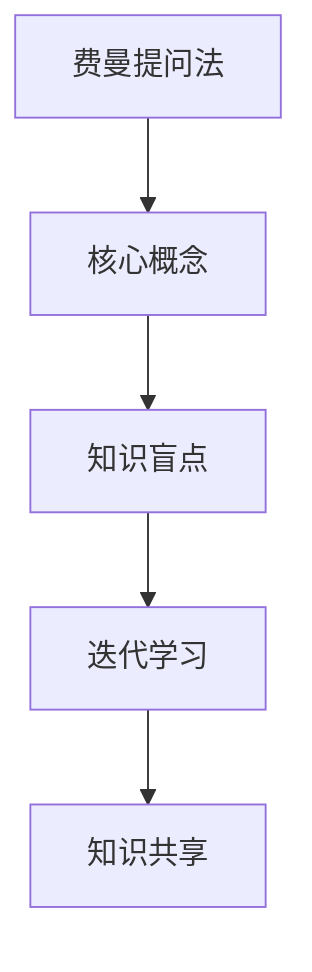

                 

## 1. 背景介绍

### 1.1 问题由来

在现代快速发展的技术环境中，持续学习和快速迭代已成为软件团队的核心竞争力。然而，如何系统性地提升团队的学习效率和创新能力，同时兼顾知识的深度和广度，是一个亟需解决的问题。费曼提问法（Feynman Technique）因其简洁明了的核心思想和广泛的适用性，在近年来受到了技术团队的高度关注。

费曼提问法由诺贝尔物理学奖得主理查德·费曼（Richard Feynman）提出，原意是为巩固科学知识，通过以教为学的形式，将复杂概念转化为易于理解的简单描述，从而加深理解。

### 1.2 问题核心关键点

费曼提问法的基本步骤包括：
- **选择主题**：从当前工作的领域中选择一个核心知识点。
- **简化问题**：将问题简化到最基础的理解层面，明确核心概念。
- **自我解释**：用简单的语言描述问题，仿佛在向一个小学生解释。
- **查找缺口**：发现解释中的漏洞或自己不清楚的地方。
- **求知填缺**：深入学习该部分内容，并再次解释。

这一过程形成了一个不断迭代、精进知识结构的学习循环，使团队成员能够不断深入理解和掌握复杂技术。

### 1.3 问题研究意义

费曼提问法在提升团队学习效率、促进知识共享、激发创新思维等方面具有重要意义：

1. **提高学习效率**：通过自我解释和查找缺口，能迅速暴露知识盲点，快速学习和理解复杂概念。
2. **促进知识共享**：以教为学的方式使团队成员主动分享知识，提升整体知识水平。
3. **激发创新思维**：通过不断挑战和填补知识缺口，激发成员的创造力和探索精神。
4. **提升团队协作**：促进成员之间的交流和合作，构建更为紧密的团队文化。
5. **加速技术迭代**：构建快速迭代的知识系统，使团队能够快速适应技术变化。

## 2. 核心概念与联系

### 2.1 核心概念概述

为了更好地理解费曼提问法的核心思想和应用场景，本节将介绍几个关键概念：

- **费曼提问法（Feynman Technique）**：一种以教为学的学习方法，通过将复杂概念简化并教授给他人，巩固自己的理解，同时揭示知识漏洞。
- **核心概念（Core Concept）**：指特定领域中最基础、最核心的知识单元。
- **知识盲点（Knowledge Gap）**：指自己在解释过程中发现的不清楚或未知的部分。
- **迭代学习（Iterative Learning）**：通过不断学习、教学和调整，逐步完善知识结构的过程。
- **知识共享（Knowledge Sharing）**：通过交流和分享，提升团队整体知识水平和学习效率。

这些核心概念之间的逻辑关系可以通过以下Mermaid流程图来展示：



这个流程图展示了一些关键概念之间的联系和迭代过程：

1. 费曼提问法以核心概念为出发点，通过自我解释发现知识盲点。
2. 知识盲点促使进行迭代学习，进一步理解并巩固核心概念。
3. 知识共享促进团队学习，提升整体知识水平。

## 3. 核心算法原理 & 具体操作步骤

### 3.1 算法原理概述

费曼提问法的核心在于通过“以教为学”的方式，促使团队成员深度理解并巩固知识。其核心原理包括：

1. **核心概念的提取**：选取当前工作中的核心概念或技术点作为学习目标。
2. **简化问题的过程**：将核心概念简化到最基础的理解层面，明确核心概念的基本原理和应用场景。
3. **自我解释的尝试**：用简单的语言描述核心概念，仿佛在向一个小学生解释，找出其中的漏洞和不足。
4. **知识盲点的识别**：查找在解释过程中发现的不清楚或未知的部分，即知识盲点。
5. **深入学习的步骤**：针对知识盲点进行深入学习和理解，再次进行解释，并不断重复这个过程。

### 3.2 算法步骤详解

费曼提问法的基本操作步骤如下：

**Step 1: 选择主题**
- 选择当前工作中最核心的知识点，作为学习的主题。
- 对于团队，选择技术团队中最常遇到、最有价值的技术点。

**Step 2: 简化问题**
- 将核心概念抽象为最基本的理解，去除所有复杂和冗余的部分。
- 例如，学习Git时，将其简化为“Git是一个版本控制系统，它允许你在同一项目中管理多个版本的代码，并能够回滚到之前的版本”。

**Step 3: 自我解释**
- 用简单明了的语言描述核心概念，仿佛在向一个小学生解释。
- 例如，在向小学生解释Git时，可以举一个学生作业的例子：“比如，你有两个版本的作业，一个版本是你今天完成的，另一个版本是你上周完成的。Git可以帮助你轻松地切换和比较这两个版本，找到你需要的版本。”

**Step 4: 查找缺口**
- 在自我解释的过程中，查找自己不清楚或解释不清楚的部分。
- 例如，对于学生，可能会发现不清楚“如何切换版本”或“如何回滚到之前的版本”。

**Step 5: 求知填缺**
- 针对发现的知识盲点进行深入学习和理解。
- 例如，查阅Git的文档或教程，了解切换版本和回滚的具体操作。
- 再次进行自我解释，直到解释清晰、透彻。

**Step 6: 知识共享**
- 将学习到的知识分享给团队其他成员，进行知识共享和讨论。
- 例如，通过内部技术分享会、在线论坛或实时聊天工具，分享自己的学习经验和成果。

**Step 7: 不断迭代**
- 将这个过程不断重复，直到掌握所有核心概念和技能。

### 3.3 算法优缺点

费曼提问法的优点：
1. **简单易行**：不需要复杂的工具或大量的资源，适合所有技术团队使用。
2. **提升理解**：通过自我解释和查找缺口，能迅速暴露知识盲点，快速学习和理解复杂概念。
3. **促进交流**：以教为学的方式使团队成员主动分享知识，提升整体知识水平。
4. **激发创新**：通过不断挑战和填补知识缺口，激发成员的创造力和探索精神。

费曼提问法的缺点：
1. **时间成本**：需要投入一定的时间进行知识分享和讨论。
2. **依赖理解能力**：自我解释和查找缺口的效果取决于个人的理解能力。
3. **可能过于简化**：过于简化问题可能导致对复杂概念的理解不够深入。

### 3.4 算法应用领域

费曼提问法在多个技术领域都有广泛应用，包括但不限于：

- **软件开发**：学习新技术、工具和框架，提升编码能力。
- **数据分析**：理解数据处理、可视化技术，提升数据洞察力。
- **机器学习**：掌握算法原理、模型应用，提升模型开发和优化能力。
- **项目管理**：理解敏捷开发、迭代交付等项目管理方法。
- **云计算**：学习云平台、服务架构，提升云计算应用能力。

## 4. 数学模型和公式 & 详细讲解 & 举例说明

### 4.1 数学模型构建

费曼提问法的基本模型可以概括为：

1. **核心概念的选取**：选择当前工作中的核心概念 $C$。
2. **简化问题的描述**：将核心概念简化为 $D(C)$。
3. **自我解释的过程**：用简单的语言描述 $D(C)$，即 $E(D(C))$。
4. **查找知识盲点**：在 $E(D(C))$ 中识别出知识盲点 $G$。
5. **深入学习的步骤**：针对 $G$ 进行深入学习，即 $L(G)$。
6. **知识共享的过程**：将学习结果 $L(G)$ 分享给团队成员，即 $K(L(G))$。

### 4.2 公式推导过程

以学习Git为例，推导费曼提问法的基本步骤：

1. **核心概念**：$C = \text{Git是一个版本控制系统}$。
2. **简化问题**：$D(C) = \text{Git允许你管理多个版本的代码，切换和回滚版本}$。
3. **自我解释**：$E(D(C)) = \text{Git允许你轻松切换和比较多个版本的代码，回滚到之前的版本}$。
4. **查找知识盲点**：$G = \text{如何切换版本}$。
5. **深入学习**：$L(G) = \text{查阅Git的文档或教程，了解切换版本和回滚的具体操作}$。
6. **知识共享**：$K(L(G)) = \text{在团队内部进行技术分享，帮助其他成员理解Git的操作}$。

### 4.3 案例分析与讲解

假设一个技术团队正在学习Kubernetes，可以将这个过程分解如下：

1. **核心概念**：$C = \text{Kubernetes是一个容器编排平台}$。
2. **简化问题**：$D(C) = \text{Kubernetes可以帮助你管理容器集群，调度资源，部署应用}$。
3. **自我解释**：$E(D(C)) = \text{Kubernetes可以帮助你轻松管理容器集群，自动化资源调度和应用部署}$。
4. **查找知识盲点**：$G = \text{如何自动化资源调度和应用部署}$。
5. **深入学习**：$L(G) = \text{查阅Kubernetes文档，观看相关视频教程，了解自动化调度算法}$。
6. **知识共享**：$K(L(G)) = \text{在团队内部进行Kubernetes技术分享，帮助其他成员理解自动化调度和应用部署}$。

## 5. 项目实践：代码实例和详细解释说明

### 5.1 开发环境搭建

为了实践费曼提问法，可以使用以下开发环境：

1. **协作工具**：选择支持实时协作的工具，如Confluence、Notion或Slack，用于记录学习笔记和讨论。
2. **技术分享平台**：使用Zoom、Microsoft Teams或Jamboard等视频会议工具，进行实时技术分享和讨论。
3. **知识库**：建立内部知识库，如GitHub Wiki或Confluence页面，记录团队的知识积累和文档。

### 5.2 源代码详细实现

下面是一个Git学习示例，展示如何使用费曼提问法进行知识巩固和共享：

```python
# 学习Git的费曼提问法示例代码
def feynman_technique():
    core_concept = "Git是一个版本控制系统"
    simplified_problem = "Git允许你管理多个版本的代码，切换和回滚版本"
    self_explanation = "Git允许你轻松切换和比较多个版本的代码，回滚到之前的版本"
    knowledge_gap = "如何切换版本"
    deep_learning = "查阅Git的文档或教程，了解切换版本和回滚的具体操作"
    knowledge_sharing = "在团队内部进行技术分享，帮助其他成员理解Git的操作"
    
    print(f"核心概念：{core_concept}")
    print(f"简化问题：{simplified_problem}")
    print(f"自我解释：{self_explanation}")
    print(f"查找知识盲点：{knowledge_gap}")
    print(f"深入学习：{deep_learning}")
    print(f"知识共享：{knowledge_sharing}")

feynman_technique()
```

### 5.3 代码解读与分析

上述代码展示了使用Python实现的费曼提问法学习过程，通过简单的函数调用，可以清晰地展示每个步骤的内容。具体解读如下：

1. **核心概念**：选择学习的主题，即“Git是一个版本控制系统”。
2. **简化问题**：将核心概念简化为“Git允许你管理多个版本的代码，切换和回滚版本”。
3. **自我解释**：用简单的语言描述问题，“Git允许你轻松切换和比较多个版本的代码，回滚到之前的版本”。
4. **查找知识盲点**：在解释过程中识别出“如何切换版本”。
5. **深入学习**：针对知识盲点进行深入学习，“查阅Git的文档或教程，了解切换版本和回滚的具体操作”。
6. **知识共享**：在团队内部进行技术分享，“在团队内部进行技术分享，帮助其他成员理解Git的操作”。

通过这段代码，团队成员可以轻松地按照费曼提问法的步骤进行学习，逐步掌握Git的核心知识和操作。

### 5.4 运行结果展示

运行上述代码，将输出以下结果：

```
核心概念：Git是一个版本控制系统
简化问题：Git允许你管理多个版本的代码，切换和回滚版本
自我解释：Git允许你轻松切换和比较多个版本的代码，回滚到之前的版本
查找知识盲点：如何切换版本
深入学习：查阅Git的文档或教程，了解切换版本和回滚的具体操作
知识共享：在团队内部进行技术分享，帮助其他成员理解Git的操作
```

这一结果展示了费曼提问法的每个步骤，并明确了学习路径。团队成员可以根据这个路径进行自我学习和知识共享，逐步掌握Git的核心知识。

## 6. 实际应用场景

### 6.1 软件开发

在软件开发中，团队成员经常需要学习新技术和工具。通过费曼提问法，成员可以系统地掌握新技术，提升编码能力和团队协作效率。例如，学习Docker容器技术，可以通过费曼提问法逐步了解容器的原理、安装配置、应用部署等核心概念。

### 6.2 数据分析

数据分析师需要掌握各种数据处理、可视化工具和算法。费曼提问法可以帮助他们深入理解数据处理流程、选择合适的可视化工具、优化算法模型等，从而提升数据分析的准确性和效率。例如，学习Python的Pandas库，可以通过费曼提问法掌握数据清洗、数据处理、数据分析等核心概念。

### 6.3 机器学习

机器学习工程师需要掌握算法原理、模型应用和优化技巧。费曼提问法可以帮助他们深入理解算法原理、模型调优、特征工程等核心概念，提升模型开发和优化能力。例如，学习深度学习框架TensorFlow，可以通过费曼提问法掌握模型构建、损失函数、优化算法等核心概念。

### 6.4 项目管理

项目经理需要掌握敏捷开发、迭代交付等项目管理方法。费曼提问法可以帮助他们深入理解敏捷开发的核心思想、迭代交付的步骤、项目管理工具等核心概念，提升项目管理效率。例如，学习Scrum敏捷开发框架，可以通过费曼提问法掌握Scrum的核心流程、角色分工、任务管理等核心概念。

### 6.5 云计算

云计算工程师需要掌握云平台、服务架构等技术。费曼提问法可以帮助他们深入理解云计算的核心概念、云平台部署、服务架构设计等核心概念，提升云计算应用能力。例如，学习AWS云平台，可以通过费曼提问法掌握云服务部署、云安全、云监控等核心概念。

## 7. 工具和资源推荐

### 7.1 学习资源推荐

为了帮助团队系统掌握费曼提问法的理论基础和实践技巧，这里推荐一些优质的学习资源：

1. **《费曼学习法》书籍**：详细介绍了费曼提问法的核心思想和应用场景，适合深入学习。
2. **Coursera《学习如何学习》课程**：通过在线课程，系统介绍费曼提问法的基本原理和操作步骤。
3. **edX《费曼学习法实践》课程**：结合实际案例，展示费曼提问法在各个领域的实践应用。
4. **Udemy《费曼学习法》课程**：通过视频讲解和实践练习，帮助用户掌握费曼提问法的核心技巧。
5. **在线论坛和社区**：如Stack Overflow、Reddit等，提供费曼提问法的讨论和分享平台。

通过对这些资源的学习实践，相信团队成员一定能够快速掌握费曼提问法的精髓，并用于解决实际的技术问题。

### 7.2 开发工具推荐

高效的开发离不开优秀的工具支持。以下是几款用于费曼提问法实践的常用工具：

1. **协作工具**：选择支持实时协作的工具，如Confluence、Notion或Slack，用于记录学习笔记和讨论。
2. **技术分享平台**：使用Zoom、Microsoft Teams或Jamboard等视频会议工具，进行实时技术分享和讨论。
3. **知识库**：建立内部知识库，如GitHub Wiki或Confluence页面，记录团队的知识积累和文档。
4. **任务管理工具**：如JIRA、Trello等，用于规划和跟踪学习任务和进度。

合理利用这些工具，可以显著提升费曼提问法的实践效率，加速团队的学习和知识积累。

### 7.3 相关论文推荐

费曼提问法作为一种经典的学习方法，在学术界和工业界都有广泛的研究。以下是几篇奠基性的相关论文，推荐阅读：

1. **费曼的《思考与发现：一个心理学家眼中的科学方法》**：理查德·费曼的著作，深入探讨了科学方法和思维方式的本质。
2. **《费曼学习法》书籍**：详细介绍了费曼提问法的核心思想和应用场景，适合深入学习。
3. **《学习如何学习》书籍**：介绍费曼提问法的基本原理和操作步骤，适合初学者入门。
4. **《敏捷开发实践》书籍**：介绍敏捷开发的核心思想和实践方法，适合项目经理参考。
5. **《云计算最佳实践》书籍**：介绍云计算的核心概念和最佳实践，适合云计算工程师参考。

这些论文和书籍代表了大规模语言模型微调技术的发展脉络。通过学习这些前沿成果，可以帮助研究者把握学科前进方向，激发更多的创新灵感。

## 8. 总结：未来发展趋势与挑战

### 8.1 总结

本文对费曼提问法进行了全面系统的介绍。首先阐述了费曼提问法的基本思想和核心步骤，明确了其在学习知识、促进交流、激发创新等方面的独特价值。其次，从原理到实践，详细讲解了费曼提问法的数学模型和操作步骤，给出了费曼提问法任务开发的完整代码实例。同时，本文还广泛探讨了费曼提问法在软件开发、数据分析、机器学习、项目管理、云计算等多个领域的应用前景，展示了费曼提问法的巨大潜力。

通过本文的系统梳理，可以看到，费曼提问法作为一种简单而高效的学习方法，能够在技术团队中广泛应用，提升学习效率和知识共享。它不仅能帮助团队成员深入理解复杂概念，还能促进交流合作，激发创新思维，提升整体技术水平。

### 8.2 未来发展趋势

展望未来，费曼提问法将在以下几个方面继续发展：

1. **多样化应用**：费曼提问法不仅限于技术领域，将在更多领域得到应用，如教育、管理、艺术等。
2. **工具化**：开发更多的协作工具和平台，支持费曼提问法的实践和应用。
3. **标准化**：形成标准化的操作步骤和评估指标，提升费曼提问法的科学性和系统性。
4. **国际化**：推广费曼提问法到国际市场，帮助不同语言和文化背景的团队提升学习效率。
5. **跨学科融合**：结合其他学习方法和工具，如头脑风暴、思维导图等，形成综合学习体系。

这些趋势将使费曼提问法更加系统和科学，提升其应用效果和学习效率。

### 8.3 面临的挑战

尽管费曼提问法已经展示了其独特的优势，但在推广和应用过程中，仍面临一些挑战：

1. **时间成本**：费曼提问法需要投入一定的时间进行知识分享和讨论，可能影响日常工作。
2. **理解难度**：自我解释和查找知识盲点的效果取决于个人的理解能力，不同成员的理解水平可能不一致。
3. **知识共享难度**：费曼提问法需要团队成员之间的积极参与和互动，可能面临成员积极性不足的问题。

这些挑战需要团队领导和成员共同努力，找到平衡点，使费曼提问法在实践中发挥最大效用。

### 8.4 研究展望

面对费曼提问法所面临的挑战，未来的研究需要在以下几个方面寻求新的突破：

1. **自动化工具**：开发支持费曼提问法的自动化工具，减少手动操作的时间和成本。
2. **智能化平台**：结合AI技术，提升费曼提问法的应用效果，如智能推荐学习内容、自动化生成学习计划等。
3. **多模式结合**：结合其他学习方法和工具，如头脑风暴、思维导图等，形成综合学习体系。
4. **知识图谱**：建立知识图谱，记录和整理团队的知识结构，方便费曼提问法的应用和推广。
5. **持续优化**：通过反馈和改进，不断优化费曼提问法的操作步骤和评估指标，提升学习效果。

这些研究方向的探索，必将使费曼提问法更加科学和高效，为技术团队的学习和创新提供强有力的支持。

## 9. 附录：常见问题与解答

**Q1：费曼提问法的核心思想是什么？**

A: 费曼提问法的核心思想是通过“以教为学”的方式，促使团队成员深度理解并巩固知识。具体步骤包括选择主题、简化问题、自我解释、查找知识盲点、深入学习和知识共享，形成了一个不断迭代、精进知识结构的学习循环。

**Q2：费曼提问法适用于所有技术团队吗？**

A: 费曼提问法适用于技术团队，但需要根据团队成员的技术水平和业务需求，灵活调整具体步骤和内容。对于初学者或新手，可以选择较为简单、基础的主题进行学习；对于高级技术团队，可以选择更复杂、前沿的主题进行探讨。

**Q3：如何进行知识共享？**

A: 知识共享可以通过内部技术分享会、在线论坛或实时聊天工具等方式进行。团队成员可以在分享会上进行讲解，或者通过在线讨论、视频录制等方式分享自己的学习经验和成果。

**Q4：如何处理知识盲点？**

A: 处理知识盲点需要深入学习和理解，可以通过查阅文档、观看视频教程、阅读相关书籍等方式进行。团队成员可以共同讨论，分享各自的学习资源和心得，逐步填补知识盲点。

**Q5：费曼提问法的时间成本如何控制？**

A: 控制费曼提问法的时间成本需要合理安排学习计划和时间分配。可以设定每次学习的时间长度，避免过度占用日常工作时间。同时，可以利用碎片化时间进行学习，如午休时间、通勤时间等。

通过以上问题的回答，希望能够帮助技术团队更好地理解费曼提问法的核心思想和操作步骤，并将其应用于实际工作中，提升学习效率和知识水平。

