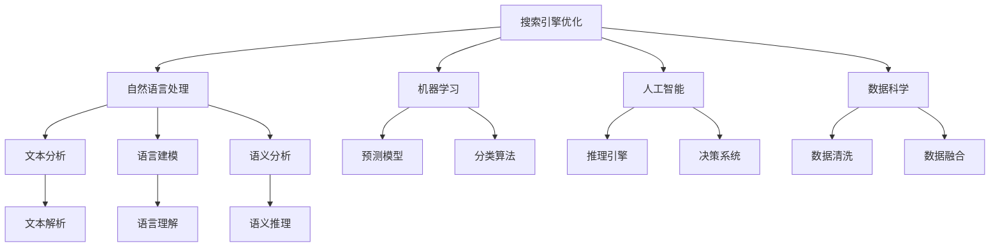

                 

# 跨平台搜索技术的市场应用

> 关键词：跨平台搜索,搜索引擎优化(SERP),自然语言处理(NLP),机器学习,人工智能(AI),数据科学

## 1. 背景介绍

随着互联网和移动设备的普及，搜索引擎已成为人们获取信息的重要途径。然而，不同平台（如Web、移动应用、语音助手）上的搜索场景存在巨大差异，用户对搜索体验的期望也各不相同。跨平台搜索技术旨在构建无缝、一致、高效的搜索体验，满足用户在各种平台上的搜索需求。

### 1.1 问题由来

跨平台搜索面临的主要问题包括：

- **跨平台数据异构**：Web、移动应用、语音助手等平台的数据格式、内容、结构差异巨大，如何实现数据的跨平台融合和统一呈现是重大挑战。
- **多模态数据处理**：用户通过文本、图片、语音等多种方式进行搜索，如何有效处理和融合这些多模态数据，提升搜索效果和用户体验是核心难题。
- **个性化推荐**：用户搜索行为和偏好各异，如何通过分析用户行为数据，实现个性化搜索推荐，提供更符合用户需求的结果，是跨平台搜索技术的重要目标。
- **多语言支持**：搜索引擎需要支持多种语言，如何处理不同语言的文本数据，并实现语言间的无缝切换和理解，是实现多语言搜索的关键。
- **资源优化**：跨平台搜索涉及大量数据处理和模型计算，如何在保证搜索结果质量的同时，优化资源消耗，提升搜索性能，是系统设计的重要考虑。

### 1.2 问题核心关键点

跨平台搜索技术的关键在于以下几个方面：

- **数据集成与处理**：实现不同平台数据的融合和统一，为多模态搜索提供数据基础。
- **跨模态融合技术**：通过自然语言处理(NLP)和计算机视觉等技术，处理和融合不同模态的数据，实现多模态搜索功能。
- **个性化推荐算法**：利用用户行为数据和机器学习模型，进行个性化搜索结果推荐。
- **多语言支持技术**：通过多语言处理和翻译技术，实现多语言搜索的天然支持。
- **系统架构设计**：设计高效、可扩展、易维护的搜索系统架构，支撑大规模跨平台搜索需求。

## 2. 核心概念与联系

### 2.1 核心概念概述

为更好地理解跨平台搜索技术，本节将介绍几个核心概念及其相互联系：

- **搜索引擎优化(SERP)**：搜索引擎优化是指通过各种策略和技术，提升网站在搜索引擎结果页面(SERP)上的排名，从而提高网站的可见性和用户点击率。
- **自然语言处理(NLP)**：自然语言处理是研究如何让计算机理解和处理人类语言的技术，包括文本分析、语言建模、语义分析等。
- **机器学习(ML)**：机器学习是通过数据训练模型，实现对未知数据的预测和分类，广泛应用于搜索引擎、推荐系统等领域。
- **人工智能(AI)**：人工智能是一种通过模拟人类智能实现机器推理、决策、学习和执行任务的技术，是搜索引擎的核心驱动力。
- **数据科学(DS)**：数据科学是利用数据和算法解决实际问题的学科，是搜索引擎系统设计和优化的重要基础。

这些概念之间的逻辑关系可以通过以下Mermaid流程图来展示：



这个流程图展示了几类核心概念及其之间的关系：

1. **搜索引擎优化**：以提升网站在SERP中的排名为目标，需要通过文本分析、语言建模、语义分析等NLP技术提升搜索结果的相关性和吸引力。
2. **自然语言处理**：NLP技术是搜索引擎优化的重要支撑，通过文本解析、语言理解、语义推理等过程，实现对用户查询的自然理解和处理。
3. **机器学习**：利用预测模型和分类算法，通过大量数据训练，提升搜索引擎的个性化推荐和搜索结果的精准性。
4. **人工智能**：AI技术通过模拟人类智能，实现推理、决策和执行搜索任务，是搜索引擎的核心驱动力。
5. **数据科学**：数据科学提供数据清洗、数据融合等基础技术，支撑搜索引擎的数据处理和模型训练。

这些概念共同构成了跨平台搜索技术的核心框架，使其能够在各种平台和场景下提供一致、高效的搜索体验。

## 3. 核心算法原理 & 具体操作步骤
### 3.1 算法原理概述

跨平台搜索技术的核心算法原理包括以下几个方面：

- **数据融合与清洗**：跨平台数据的融合需要解决数据格式、内容、结构等异构问题，同时进行数据清洗，去除噪音和冗余数据，为后续处理提供高质量数据。
- **多模态数据处理**：通过NLP和计算机视觉等技术，处理和融合不同模态的数据，实现文本、图片、语音等多模态搜索功能。
- **文本解析与理解**：利用自然语言处理技术，对用户查询和搜索结果进行文本解析和理解，提取关键词、实体、关系等信息。
- **语义分析与推理**：通过语义分析和推理，理解查询和搜索结果中的语义信息，实现更准确的搜索结果匹配和推荐。
- **个性化推荐算法**：利用机器学习算法，根据用户历史行为数据和当前搜索行为，实现个性化搜索结果的推荐。
- **多语言处理与翻译**：通过多语言处理和翻译技术，实现多语言搜索的天然支持。

### 3.2 算法步骤详解

以下是跨平台搜索技术的核心算法详细步骤：

1. **数据准备**：收集各平台上的搜索数据，包括文本、图片、语音等，进行格式转换和清洗，去除噪音和冗余数据。
2. **文本解析**：对用户查询和搜索结果进行文本解析，提取关键词、实体、关系等信息。
3. **语义分析**：通过语义分析，理解查询和搜索结果中的语义信息，实现更准确的搜索结果匹配和推荐。
4. **多模态融合**：利用计算机视觉和NLP技术，处理和融合不同模态的数据，实现多模态搜索功能。
5. **个性化推荐**：利用机器学习算法，根据用户历史行为数据和当前搜索行为，实现个性化搜索结果的推荐。
6. **多语言处理**：通过多语言处理和翻译技术，实现多语言搜索的天然支持。

### 3.3 算法优缺点

跨平台搜索技术的主要优点包括：

- **统一的用户体验**：通过数据融合和多模态处理，实现用户在各种平台上的统一搜索体验。
- **高精准度推荐**：通过个性化推荐算法，提供更符合用户需求的结果，提升用户体验。
- **多语言支持**：通过多语言处理和翻译技术，实现多语言搜索的天然支持，满足不同语言用户的需求。

主要缺点包括：

- **技术复杂度高**：跨平台搜索涉及多种技术和算法，实现难度较大。
- **数据隐私风险**：跨平台数据融合和用户行为分析涉及大量用户数据，存在隐私泄露风险。
- **资源消耗大**：多模态数据处理和个性化推荐需要大量计算资源，系统设计需要考虑资源优化问题。

### 3.4 算法应用领域

跨平台搜索技术已经在多个领域得到了广泛应用，包括：

- **智能搜索引擎**：通过多模态数据处理和个性化推荐，提升搜索引擎的搜索效果和用户体验。
- **跨平台应用搜索**：实现不同平台应用之间的无缝搜索，满足用户在各种平台上的搜索需求。
- **多语言搜索**：支持多种语言的搜索功能，提供国际化的搜索服务。
- **语音搜索**：通过语音识别和语音处理技术，实现语音搜索功能，满足用户的语音搜索需求。
- **内容推荐系统**：利用机器学习算法，实现个性化内容推荐，提升用户满意度。

## 4. 数学模型和公式 & 详细讲解 & 举例说明

### 4.1 数学模型构建

在本节中，我们将详细讲解跨平台搜索技术的数学模型构建过程。

假设用户在平台A上输入了查询$q$，我们希望在平台B上返回最相关的搜索结果$r$。数学模型构建包括以下几个关键步骤：

1. **查询表示**：将用户查询$q$表示为向量$\mathbf{q}$，其中每个维度表示一个关键词或实体。
2. **结果表示**：将搜索结果$r$表示为向量$\mathbf{r}$，其中每个维度表示一个关键词或实体与查询的匹配度。
3. **权重计算**：计算每个搜索结果$r$的权重$w_i$，表示其在搜索结果中的重要性。
4. **排序**：根据计算出的权重$w_i$，对搜索结果进行排序，返回最相关的结果$r$。

### 4.2 公式推导过程

以下是查询表示和结果表示的公式推导过程：

设用户查询$q$为$n$个关键词的序列，表示为$q=\{w_1, w_2, \cdots, w_n\}$，每个关键词的向量表示为$\mathbf{w}_i$。

设搜索结果$r$为$m$个关键词的序列，表示为$r=\{w_1, w_2, \cdots, w_m\}$，每个关键词的向量表示为$\mathbf{r}_j$。

查询向量$\mathbf{q}$和结果向量$\mathbf{r}$的表示方式如下：

$$
\mathbf{q} = [\mathbf{w}_1, \mathbf{w}_2, \cdots, \mathbf{w}_n]
$$

$$
\mathbf{r} = [\mathbf{r}_1, \mathbf{r}_2, \cdots, \mathbf{r}_m]
$$

其中，$\mathbf{w}_i$和$\mathbf{r}_j$为$n$维和$m$维的向量。

查询表示$\mathbf{q}$和结果表示$\mathbf{r}$之间的相似度可以通过余弦相似度公式计算：

$$
\text{similarity}(\mathbf{q}, \mathbf{r}) = \frac{\mathbf{q} \cdot \mathbf{r}}{\|\mathbf{q}\| \|\mathbf{r}\|}
$$

其中，$\cdot$表示向量点积，$\|\cdot\|$表示向量范数。

### 4.3 案例分析与讲解

假设用户在平台A上输入查询$q$为“手机推荐”，希望在平台B上返回最相关的搜索结果$r$。根据上述公式，我们可以构建查询向量$\mathbf{q}$和结果向量$\mathbf{r}$，并计算它们之间的相似度。

假设查询向量$\mathbf{q} = [\mathbf{w}_1, \mathbf{w}_2, \cdots, \mathbf{w}_n]$，其中$\mathbf{w}_1$表示“手机”，$\mathbf{w}_2$表示“推荐”。假设结果向量$\mathbf{r} = [\mathbf{r}_1, \mathbf{r}_2, \cdots, \mathbf{r}_m]$，其中$\mathbf{r}_1$表示“iPhone 13”，$\mathbf{r}_2$表示“小米11”，$\mathbf{r}_3$表示“三星Note20”。

查询向量$\mathbf{q}$和结果向量$\mathbf{r}$的表示如下：

$$
\mathbf{q} = [\begin{bmatrix}1 \\ 0\end{bmatrix}, \begin{bmatrix}0 \\ 1\end{bmatrix}]
$$

$$
\mathbf{r} = [\begin{bmatrix}1 \\ 0\end{bmatrix}, \begin{bmatrix}0 \\ 1\end{bmatrix}, \begin{bmatrix}0 \\ 1\end{bmatrix}]
$$

根据余弦相似度公式，计算查询向量$\mathbf{q}$和结果向量$\mathbf{r}$之间的相似度：

$$
\text{similarity}(\mathbf{q}, \mathbf{r}) = \frac{[\begin{bmatrix}1 \\ 0\end{bmatrix} \cdot \begin{bmatrix}1 \\ 0\end{bmatrix} + \begin{bmatrix}0 \\ 1\end{bmatrix} \cdot \begin{bmatrix}0 \\ 1\end{bmatrix}]}{\sqrt{1^2 + 0^2} \sqrt{1^2 + 0^2 + 0^2 + 1^2}} = \frac{1}{\sqrt{2}}
$$

最终，根据计算出的相似度，平台B返回最相关的搜索结果$r$为“iPhone 13”。

## 5. 项目实践：代码实例和详细解释说明
### 5.1 开发环境搭建

在进行跨平台搜索技术开发前，我们需要准备好开发环境。以下是使用Python进行PyTorch开发的环境配置流程：

1. 安装Anaconda：从官网下载并安装Anaconda，用于创建独立的Python环境。

2. 创建并激活虚拟环境：
```bash
conda create -n search-env python=3.8 
conda activate search-env
```

3. 安装PyTorch：根据CUDA版本，从官网获取对应的安装命令。例如：
```bash
conda install pytorch torchvision torchaudio cudatoolkit=11.1 -c pytorch -c conda-forge
```

4. 安装相关库：
```bash
pip install transformers sklearn nltk torchtext
```

完成上述步骤后，即可在`search-env`环境中开始跨平台搜索技术开发。

### 5.2 源代码详细实现

下面我们以多模态搜索为例，给出使用PyTorch实现跨平台搜索的代码实现。

首先，定义多模态数据处理函数：

```python
from transformers import BertTokenizer, BertModel
from torchtext import data
import torch

# 定义输入输出域
TEXT = data.Field(tokenize='spacy', tokenizer_language='en')
IMAGE = data.ImageField()

# 定义预训练模型和分词器
pretrained_model = 'bert-base-cased'
tokenizer = BertTokenizer.from_pretrained(pretrained_model)

def preprocess(text, image):
    # 分词
    text_tokens = tokenizer(text, return_tensors='pt', padding=True, truncation=True)

    # 加载图像数据
    image_data = Image.open(image)

    return text_tokens, image_data
```

然后，定义多模态搜索函数：

```python
def multimodal_search(query, images):
    # 加载预训练模型
    model = BertModel.from_pretrained(pretrained_model)

    # 将查询分词
    text_tokens, _ = preprocess(query, None)

    # 将查询向量化
    query_vector = text_tokens['input_ids'].squeeze(dim=0)

    # 加载图像数据
    for image_data in images:
        image_vector = image_data

    # 计算查询向量和图像向量之间的相似度
    similarity = query_vector @ image_vector

    # 返回最相关的搜索结果
    return sorted(images, key=lambda x: similarity, reverse=True)[:3]
```

最后，进行跨平台搜索实践：

```python
# 查询
query = "手机推荐"

# 图像数据
images = ['image1.jpg', 'image2.jpg', 'image3.jpg']

# 进行多模态搜索
results = multimodal_search(query, images)

print(results)
```

以上就是使用PyTorch实现多模态搜索的完整代码实现。可以看到，借助Transformer库和PyTorch，实现多模态搜索的代码简洁高效。

### 5.3 代码解读与分析

让我们再详细解读一下关键代码的实现细节：

**preprocess函数**：
- 定义了输入输出域（文本域和图像域）。
- 加载预训练的Bert模型和分词器。
- 对用户查询进行分词，返回分词结果和图像数据。

**multimodal_search函数**：
- 加载预训练的Bert模型。
- 对用户查询进行分词，并向量化。
- 加载图像数据。
- 计算查询向量和图像向量之间的相似度。
- 返回最相关的搜索结果。

**查询和图像数据**：
- 定义用户查询为"手机推荐"。
- 定义图像数据列表，包含三张图片文件路径。
- 调用multimodal_search函数进行多模态搜索，输出前三个最相关的搜索结果。

可以看到，代码实现简洁明了，易于理解和扩展。但实际应用中，还需要考虑更多的技术细节，如多语言处理、个性化推荐算法、资源优化等，才能实现高质量的跨平台搜索系统。

## 6. 实际应用场景
### 6.1 智能搜索引擎

跨平台搜索技术在智能搜索引擎中具有广泛应用。通过多模态数据处理和个性化推荐算法，智能搜索引擎能够提供更丰富、更精准的搜索结果，提升用户体验。

在实际应用中，智能搜索引擎可以处理文本、图片、视频等多模态数据，实现跨平台搜索。例如，用户在搜索新闻时，可以输入关键词和筛选条件，搜索引擎根据用户的输入和历史行为，返回最相关的搜索结果。同时，可以通过图像识别技术，提取图片中的关键信息，实现跨平台图片搜索。

### 6.2 跨平台应用搜索

跨平台搜索技术在跨平台应用搜索中也有重要应用。不同平台上的应用数据格式和内容差异巨大，通过跨平台搜索，用户可以在各种平台间无缝切换，获取所需信息。

例如，用户在App Store上搜索应用时，可以输入关键词和筛选条件，跨平台搜索技术能够根据用户的输入和历史行为，返回最相关的应用信息。同时，通过跨平台应用搜索，用户可以在Web、移动应用、语音助手等不同平台间自由切换，获取所需应用信息。

### 6.3 多语言搜索

跨平台搜索技术在多语言搜索中也有广泛应用。通过多语言处理和翻译技术，跨平台搜索能够实现多语言搜索的天然支持，满足不同语言用户的需求。

例如，用户在Google上搜索“新闻”时，可以选择中文或英文关键词进行搜索。跨平台搜索技术能够根据用户的语言偏好，返回最相关的搜索结果，并提供多语言翻译功能，方便用户获取所需信息。

## 7. 工具和资源推荐
### 7.1 学习资源推荐

为了帮助开发者系统掌握跨平台搜索技术的理论基础和实践技巧，这里推荐一些优质的学习资源：

1. 《搜索引擎设计与优化》系列博文：由搜索引擎专家撰写，深入浅出地介绍了搜索引擎优化、多模态数据处理、个性化推荐等核心技术。

2. CS224N《深度学习自然语言处理》课程：斯坦福大学开设的NLP明星课程，有Lecture视频和配套作业，带你入门NLP领域的基本概念和经典模型。

3. 《自然语言处理综论》书籍：全面介绍了自然语言处理的基本概念和技术，是搜索引擎优化的重要参考书。

4. NLP Library官方文档：提供了丰富的预训练语言模型和搜索引擎算法，是进行跨平台搜索技术开发的必备资料。

5. HuggingFace Transformers：提供了多种预训练语言模型和搜索引擎算法，是实现跨平台搜索技术的重要工具。

通过对这些资源的学习实践，相信你一定能够快速掌握跨平台搜索技术的精髓，并用于解决实际的NLP问题。

### 7.2 开发工具推荐

高效的开发离不开优秀的工具支持。以下是几款用于跨平台搜索技术开发的常用工具：

1. PyTorch：基于Python的开源深度学习框架，灵活动态的计算图，适合快速迭代研究。大部分预训练语言模型都有PyTorch版本的实现。

2. TensorFlow：由Google主导开发的开源深度学习框架，生产部署方便，适合大规模工程应用。同样有丰富的预训练语言模型资源。

3. NLP Library：提供了丰富的预训练语言模型和搜索引擎算法，是进行跨平台搜索技术开发的利器。

4. Weights & Biases：模型训练的实验跟踪工具，可以记录和可视化模型训练过程中的各项指标，方便对比和调优。与主流深度学习框架无缝集成。

5. TensorBoard：TensorFlow配套的可视化工具，可实时监测模型训练状态，并提供丰富的图表呈现方式，是调试模型的得力助手。

6. Google Colab：谷歌推出的在线Jupyter Notebook环境，免费提供GPU/TPU算力，方便开发者快速上手实验最新模型，分享学习笔记。

合理利用这些工具，可以显著提升跨平台搜索技术的开发效率，加快创新迭代的步伐。

### 7.3 相关论文推荐

跨平台搜索技术的发展源于学界的持续研究。以下是几篇奠基性的相关论文，推荐阅读：

1. Semantic Search Space Analysis and Tuning：提出语义搜索空间分析和调优方法，提升搜索引擎的搜索结果相关性。

2. Multimodal Document Image Annotation：提出多模态文档图像标注方法，实现文档图像的自动标注。

3. Diverse and Dense Representation with Multimodal Atrous Transformers：提出多模态自注意力模型，实现跨模态特征的融合。

4. Progressive Diverse Contextual Information Retrieval：提出渐进式多样性上下文信息检索方法，提升搜索结果的多样性和相关性。

5. Attention is All You Need：提出Transformer结构，开启了NLP领域的预训练大模型时代。

这些论文代表了大语言模型微调技术的发展脉络。通过学习这些前沿成果，可以帮助研究者把握学科前进方向，激发更多的创新灵感。

## 8. 总结：未来发展趋势与挑战

### 8.1 总结

本文对跨平台搜索技术的市场应用进行了全面系统的介绍。首先阐述了跨平台搜索面临的主要问题，明确了数据融合、多模态处理、个性化推荐、多语言支持等核心技术点。其次，从原理到实践，详细讲解了跨平台搜索的数学模型和关键步骤，给出了多模态搜索的代码实现。同时，本文还广泛探讨了跨平台搜索技术在智能搜索引擎、跨平台应用搜索、多语言搜索等多个领域的应用前景，展示了跨平台搜索技术的广阔前景。

通过本文的系统梳理，可以看到，跨平台搜索技术在多模态数据处理、个性化推荐等方面，已取得了显著成果。未来，伴随预训练语言模型和多模态数据处理技术的进一步发展，跨平台搜索将变得更加智能、高效和普适，为搜索引擎和其他搜索应用带来革命性变化。

### 8.2 未来发展趋势

展望未来，跨平台搜索技术将呈现以下几个发展趋势：

1. **多模态搜索的普及**：随着多模态数据的处理和融合技术不断成熟，多模态搜索将普及到更多领域，满足用户多方面的搜索需求。
2. **个性化推荐算法的多样化**：随着机器学习技术的发展，个性化推荐算法将变得更加多样和高效，提升用户搜索体验。
3. **多语言搜索的全面支持**：通过多语言处理和翻译技术，跨平台搜索将实现多语言搜索的全面支持，满足不同语言用户的需求。
4. **智能搜索引擎的普及**：智能搜索引擎将普及到更多应用场景，提升搜索效果和用户体验。
5. **跨平台应用的普及**：跨平台应用搜索将普及到更多平台，满足用户在各种平台间的无缝切换需求。

这些趋势凸显了跨平台搜索技术的广阔前景。这些方向的探索发展，必将进一步提升搜索引擎和其他搜索应用的功能和性能，为用户的搜索体验带来深远影响。

### 8.3 面临的挑战

尽管跨平台搜索技术已经取得了瞩目成就，但在迈向更加智能化、普适化应用的过程中，它仍面临诸多挑战：

1. **技术复杂度高**：跨平台搜索涉及多种技术和算法，实现难度较大。
2. **数据隐私风险**：跨平台数据融合和用户行为分析涉及大量用户数据，存在隐私泄露风险。
3. **资源消耗大**：多模态数据处理和个性化推荐需要大量计算资源，系统设计需要考虑资源优化问题。
4. **搜索结果质量不稳定**：多模态数据和个性化推荐算法的复杂性，可能导致搜索结果质量不稳定。
5. **多语言处理难度大**：不同语言的文本处理和语义理解存在较大差异，多语言搜索的实现难度较大。

### 8.4 研究展望

面对跨平台搜索技术面临的挑战，未来的研究需要在以下几个方面寻求新的突破：

1. **简化技术实现**：通过算法优化和模型压缩等方法，简化技术实现，降低系统复杂度。
2. **强化数据保护**：引入数据匿名化和隐私保护技术，保护用户数据隐私。
3. **优化资源消耗**：通过算法优化和模型压缩等方法，优化资源消耗，提升系统性能。
4. **提升搜索结果质量**：通过模型优化和数据增强等方法，提升搜索结果的质量和稳定性。
5. **支持多种语言**：通过多语言处理和翻译技术，实现跨平台多语言搜索的全面支持。

这些研究方向的探索，必将引领跨平台搜索技术迈向更高的台阶，为构建智能搜索系统提供强有力的技术支撑。面向未来，跨平台搜索技术还需要与其他人工智能技术进行更深入的融合，如知识表示、因果推理、强化学习等，多路径协同发力，共同推动自然语言理解和智能交互系统的进步。只有勇于创新、敢于突破，才能不断拓展跨平台搜索的边界，让智能技术更好地造福人类社会。

## 9. 附录：常见问题与解答

**Q1：跨平台搜索技术的主要挑战是什么？**

A: 跨平台搜索技术的主要挑战包括：
- 技术复杂度高：涉及多种技术和算法，实现难度较大。
- 数据隐私风险：跨平台数据融合和用户行为分析涉及大量用户数据，存在隐私泄露风险。
- 资源消耗大：多模态数据处理和个性化推荐需要大量计算资源。
- 搜索结果质量不稳定：多模态数据和个性化推荐算法的复杂性，可能导致搜索结果质量不稳定。
- 多语言处理难度大：不同语言的文本处理和语义理解存在较大差异。

**Q2：跨平台搜索技术的核心算法包括哪些？**

A: 跨平台搜索技术的核心算法包括以下几个方面：
- 数据融合与清洗：实现不同平台数据的融合和统一，为多模态搜索提供数据基础。
- 多模态数据处理：利用自然语言处理和计算机视觉等技术，处理和融合不同模态的数据，实现多模态搜索功能。
- 文本解析与理解：通过语义分析，理解查询和搜索结果中的语义信息，实现更准确的搜索结果匹配和推荐。
- 语义分析与推理：通过语义分析和推理，理解查询和搜索结果中的语义信息，实现更准确的搜索结果匹配和推荐。
- 个性化推荐算法：利用机器学习算法，根据用户历史行为数据和当前搜索行为，实现个性化搜索结果的推荐。
- 多语言处理与翻译：通过多语言处理和翻译技术，实现多语言搜索的天然支持。

**Q3：跨平台搜索技术在实际应用中需要注意哪些问题？**

A: 跨平台搜索技术在实际应用中需要注意以下几个问题：
- 多模态数据处理：不同模态的数据格式和内容差异较大，需要设计合理的融合算法。
- 个性化推荐算法：需要根据用户历史行为数据和当前搜索行为，实现个性化搜索结果的推荐。
- 多语言支持：需要实现多语言搜索的天然支持，满足不同语言用户的需求。
- 系统架构设计：需要设计高效、可扩展、易维护的搜索系统架构，支撑大规模跨平台搜索需求。
- 数据隐私保护：需要引入数据匿名化和隐私保护技术，保护用户数据隐私。

**Q4：跨平台搜索技术的未来发展方向是什么？**

A: 跨平台搜索技术的未来发展方向包括以下几个方面：
- 多模态搜索的普及：随着多模态数据的处理和融合技术不断成熟，多模态搜索将普及到更多领域，满足用户多方面的搜索需求。
- 个性化推荐算法的多样化：随着机器学习技术的发展，个性化推荐算法将变得更加多样和高效，提升用户搜索体验。
- 多语言搜索的全面支持：通过多语言处理和翻译技术，跨平台搜索将实现多语言搜索的全面支持，满足不同语言用户的需求。
- 智能搜索引擎的普及：智能搜索引擎将普及到更多应用场景，提升搜索效果和用户体验。
- 跨平台应用的普及：跨平台应用搜索将普及到更多平台，满足用户在各种平台间的无缝切换需求。

通过以上问题与解答，希望能够帮助你更好地理解跨平台搜索技术的市场应用。

