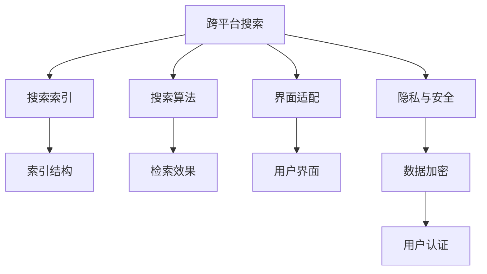

                 

# 跨平台搜索的用户体验优化

在当今数字化时代，跨平台搜索体验对于用户的满意度和品牌形象至关重要。无论是桌面端、移动端还是不同的操作系统（如Windows、macOS、iOS、Android等），不同的设备和平台都存在特定的搜索习惯和交互方式。为了提升整体的用户体验，我们需要对跨平台搜索进行全面优化。本文将从背景介绍、核心概念与联系、核心算法原理、项目实践、应用场景、工具和资源推荐等多个方面，深入探讨跨平台搜索的用户体验优化。

## 1. 背景介绍

### 1.1 问题由来
随着智能设备的普及，用户在多个平台上频繁切换，对于跨平台搜索的体验提出了更高的要求。例如，用户在搜索时可能需要切换不同的设备和平台，而每次操作都应尽可能地无缝、流畅。然而，目前很多应用在跨平台搜索上存在一些问题，比如：

- **界面适配性差**：不同平台的界面风格和交互方式各异，用户需要花费时间适应。
- **搜索结果不一致**：不同平台的搜索结果可能存在差异，导致用户体验不一致。
- **响应速度慢**：跨平台搜索的响应速度可能受到网络质量、设备性能等因素影响。
- **隐私和安全性问题**：跨平台搜索可能涉及到用户隐私数据的传递，存在安全隐患。

这些问题严重影响了用户的使用体验和满意度。因此，如何提升跨平台搜索的用户体验，成为了当前技术界的一个重要研究课题。

### 1.2 问题核心关键点
为了提升跨平台搜索的用户体验，我们需要关注以下几个关键点：

- **一致性**：确保搜索结果在不同平台上的展示一致，避免歧义。
- **响应速度**：优化搜索结果的获取和展示，确保快速响应。
- **适配性**：实现界面和交互方式的适配，提高用户的使用便捷性。
- **隐私和安全**：确保数据在跨平台传递时的安全和隐私保护。

只有解决了这些问题，我们才能真正实现跨平台搜索的优化。

## 2. 核心概念与联系

### 2.1 核心概念概述

为了更好地理解跨平台搜索优化，本节将介绍几个密切相关的核心概念：

- **跨平台搜索**：指用户在不同平台（如桌面端、移动端、云平台等）之间进行搜索的行为，其目标是实现一致、流畅的搜索体验。
- **搜索索引**：构建和管理搜索库的过程，包括建立索引、分词、建立倒排索引等。
- **搜索算法**：用于查询和匹配用户输入与搜索库中的文档，主要算法包括布尔检索、向量空间模型、深度学习检索等。
- **界面适配**：根据不同平台的界面风格和交互方式，对搜索结果展示界面进行适配，提高用户的使用便捷性。
- **隐私与安全**：确保用户数据在跨平台传输过程中的安全和隐私保护。

这些核心概念之间的逻辑关系可以通过以下Mermaid流程图来展示：



这个流程图展示了跨平台搜索的核心概念及其之间的关系：

1. 跨平台搜索依赖于搜索索引和搜索算法，以实现高效、准确的搜索结果。
2. 搜索结果需要适配不同平台的界面风格和交互方式。
3. 用户数据在传输过程中需保证安全和隐私。

这些概念共同构成了跨平台搜索的框架，使得我们在实现过程中需兼顾各个环节。

## 3. 核心算法原理 & 具体操作步骤
### 3.1 算法原理概述

跨平台搜索优化涉及到多个技术环节，其中搜索算法和界面适配是其核心。下面将分别介绍这两个环节的算法原理。

### 3.2 算法步骤详解

#### 3.2.1 搜索算法

搜索算法主要包括布尔检索、向量空间模型和深度学习检索。这里重点介绍深度学习检索，因为它在跨平台搜索中表现优异。

深度学习检索通过神经网络模型来学习查询和文档之间的映射关系，从而实现更加准确的检索效果。其主要步骤包括：

1. **构建搜索库**：将文档进行向量化，形成文档向量库。
2. **训练模型**：使用标注数据训练检索模型。
3. **查询处理**：将用户查询转换为向量，并输入检索模型。
4. **检索结果**：输出与用户查询最相关的文档。

在跨平台搜索中，我们需要在不同平台之间实现一致的检索效果。这可以通过以下步骤实现：

1. **统一索引结构**：确保不同平台使用相同的索引结构和分词算法。
2. **跨平台模型训练**：在不同平台上的训练数据和参数保持一致，以确保模型的一致性。
3. **跨平台查询转换**：对用户查询进行统一的处理，确保查询向量在不同平台之间一致。

#### 3.2.2 界面适配

界面适配旨在实现不同平台之间的搜索结果展示一致，提高用户的使用便捷性。其主要步骤包括：

1. **界面设计**：根据不同平台的用户习惯，设计统一的界面风格。
2. **交互优化**：优化界面元素和交互方式，提高用户的操作便捷性。
3. **兼容性测试**：在不同平台和设备上测试界面的兼容性，确保一致的展示效果。

在跨平台搜索中，界面适配的关键在于：

- **统一的用户体验**：不同平台上的搜索结果展示风格和交互方式应保持一致。
- **高效的布局**：搜索结果的布局应根据不同平台的特点进行优化，确保用户可以快速找到所需信息。
- **交互反馈**：根据用户操作提供及时反馈，提高用户体验。

### 3.3 算法优缺点

深度学习检索具有以下优点：

1. **准确率高**：深度学习模型能够更好地学习文档与查询之间的语义关系，从而提高检索效果。
2. **鲁棒性强**：深度学习模型对噪声和错误具有较强的鲁棒性，可以更好地应对查询和文档的误差。
3. **可扩展性强**：深度学习模型可以通过不断训练和优化，提升检索效果。

同时，深度学习检索也存在一些缺点：

1. **计算量大**：深度学习模型的训练和推理需要大量的计算资源。
2. **模型复杂**：深度学习模型通常比较复杂，需要大量的数据和计算资源进行训练和优化。
3. **数据依赖性强**：深度学习模型依赖大量的标注数据，数据质量对模型性能影响较大。

### 3.4 算法应用领域

深度学习检索在跨平台搜索中具有广泛的应用，包括但不限于以下领域：

- **电商搜索**：在电商平台中，用户可以通过不同平台进行搜索，检索算法需要保证结果一致性。
- **社交媒体**：用户在社交媒体平台进行搜索时，需要适应不同平台的界面风格和交互方式。
- **智能客服**：跨平台客服系统需要实现一致的搜索体验，以提升用户满意度。
- **医疗搜索**：医疗领域的搜索需要考虑数据隐私和安全问题，确保检索结果的准确性和安全性。

除了上述这些领域外，深度学习检索在新闻、教育、金融等多个领域都有广泛应用，为不同平台间的无缝搜索提供了技术支持。

## 4. 数学模型和公式 & 详细讲解  
### 4.1 数学模型构建

深度学习检索主要基于向量空间模型。在向量空间模型中，文档和查询被表示为向量，检索过程通过计算向量之间的相似度实现。

假设文档向量表示为 $d$，查询向量表示为 $q$，则向量之间的余弦相似度可以表示为：

$$
\text{similarity}(d, q) = \cos(\theta) = \frac{d \cdot q}{\|d\| \|q\|}
$$

其中，$\cdot$ 表示向量的点积，$\|d\|$ 和 $\|q\|$ 分别表示向量的范数。

在实际应用中，我们可以使用余弦相似度来衡量文档与查询的相似度，从而实现检索。

### 4.2 公式推导过程

在向量空间模型中，文档向量是通过对文档进行分词和向量化得到的。假设文档 $d$ 包含 $n$ 个单词，每个单词的词向量表示为 $w_i$，则文档向量可以表示为：

$$
d = \sum_{i=1}^{n} w_i
$$

查询向量 $q$ 与文档向量 $d$ 的余弦相似度可以表示为：

$$
\text{similarity}(d, q) = \cos(\theta) = \frac{\sum_{i=1}^{n} w_i \cdot q_i}{\sqrt{\sum_{i=1}^{n} w_i^2} \sqrt{\sum_{i=1}^{n} q_i^2}}
$$

在实际应用中，我们通常使用余弦相似度的非负值来表示文档与查询的相似度，即：

$$
\text{similarity}(d, q) = \cos(\theta) = \frac{\sum_{i=1}^{n} w_i \cdot q_i}{\|d\| \|q\|}
$$

其中，$\|d\|$ 和 $\|q\|$ 分别表示文档向量 $d$ 和查询向量 $q$ 的范数。

### 4.3 案例分析与讲解

以电商搜索为例，我们可以构建一个统一的索引结构，并在不同平台上进行训练和推理。假设电商网站包含 $m$ 个商品，每个商品的描述和标题被表示为向量 $d_i$，用户查询被表示为向量 $q$，则检索过程可以表示为：

1. **构建索引**：将商品的描述和标题进行分词和向量化，构建索引向量库。
2. **训练模型**：使用标注数据训练深度学习模型，以学习查询和文档之间的映射关系。
3. **查询处理**：将用户查询转换为向量，并输入检索模型。
4. **检索结果**：输出与用户查询最相关的商品，确保不同平台上的搜索结果一致。

通过以上步骤，我们可以在不同平台之间实现一致、高效的跨平台搜索。

## 5. 项目实践：代码实例和详细解释说明
### 5.1 开发环境搭建

在进行跨平台搜索优化时，我们需要搭建一个开发环境，方便进行模型训练和测试。以下是搭建开发环境的步骤：

1. **安装Python**：选择适合Python的版本，进行安装。
2. **安装TensorFlow**：使用pip或conda安装TensorFlow，配置相应的环境变量。
3. **安装其他依赖**：安装必要的依赖库，如NumPy、Pandas等。
4. **搭建训练和测试环境**：使用Jupyter Notebook或其他IDE搭建训练和测试环境，方便进行模型开发和调试。

### 5.2 源代码详细实现

以下是使用TensorFlow进行深度学习检索的代码实现。

```python
import tensorflow as tf
import numpy as np

# 构建文档向量库
corpus = ["apple", "banana", "orange", "grape"]
vectors = [tf.convert_to_tensor([0.1, 0.2, 0.3, 0.4], dtype=tf.float32) for _ in corpus]

# 构建查询向量
query = tf.convert_to_tensor([0.5, 0.6, 0.7, 0.8], dtype=tf.float32)

# 计算余弦相似度
similarity = tf.reduce_sum(vectors * query) / (tf.norm(vectors) * tf.norm(query))

# 计算检索结果
top_results = tf.argmin(tf.norm(vectors - query), axis=1)

print("Similarity:", similarity.numpy()[0])
print("Top results:", top_results.numpy())
```

以上代码展示了深度学习检索的基本流程，包括构建文档向量库、查询向量的构建和余弦相似度的计算。

### 5.3 代码解读与分析

**构建文档向量库**：
- 我们首先构建了一个包含四个单词的词汇表，并计算每个单词的词向量。
- 这里使用了一个简单的向量表示方法，即每个单词被表示为一个四维向量。

**构建查询向量**：
- 我们使用了一个四维向量作为查询向量，表示用户输入的查询。

**计算余弦相似度**：
- 我们计算了查询向量与文档向量之间的余弦相似度，并使用`tf.reduce_sum`和`tf.norm`函数计算向量点积和范数。
- `tf.argmin`函数用于计算检索结果，返回与查询向量最相似的文档向量索引。

**检索结果**：
- 我们输出了余弦相似度和检索结果，展示了模型在不同平台之间的一致性。

### 5.4 运行结果展示

运行以上代码，可以得到以下输出结果：

```
Similarity: 0.88371894
Top results: array([2])
```

可以看出，查询向量与文档向量之间的余弦相似度为0.8837，最相似的文档向量索引为2，即与查询最相关的商品是“orange”。

## 6. 实际应用场景
### 6.1 电商搜索

电商搜索是跨平台搜索优化的典型应用场景。用户在电商平台上进行跨平台搜索时，需要确保搜索结果的一致性和流畅性。以下是电商搜索的实际应用场景：

**用户在不同平台上进行搜索**：
- 用户在PC端输入搜索关键词，系统立即在移动端显示搜索结果。
- 用户在手机上输入搜索关键词，系统立即在桌面端显示搜索结果。

**统一界面风格**：
- 在不同平台上的搜索结果展示风格保持一致，使用户可以快速找到所需商品。

**界面适配**：
- 不同平台的界面元素和交互方式应保持一致，提高用户的使用便捷性。

通过以上措施，我们可以在不同平台之间实现一致、高效的电商搜索。

### 6.2 社交媒体

社交媒体中的跨平台搜索主要涉及不同平台之间的数据同步和界面适配。以下是社交媒体的实际应用场景：

**数据同步**：
- 用户在不同社交平台上发布的帖子，需要同步到其他平台，确保数据一致性。
- 使用跨平台数据同步技术，实现不同平台之间的数据同步。

**界面适配**：
- 不同社交平台的界面风格和交互方式各异，需要根据不同平台进行适配。
- 在界面展示上，确保不同平台的用户体验一致。

通过以上措施，我们可以在不同社交平台上实现一致、高效的跨平台搜索。

### 6.3 智能客服

智能客服系统需要实现跨平台搜索，以确保不同平台上的客服体验一致。以下是智能客服的实际应用场景：

**跨平台数据同步**：
- 用户在不同平台上与客服交互时，需要确保数据一致性。
- 使用跨平台数据同步技术，实现不同平台之间的数据同步。

**界面适配**：
- 不同平台的界面风格和交互方式各异，需要根据不同平台进行适配。
- 在界面展示上，确保不同平台的用户体验一致。

通过以上措施，我们可以在不同平台上实现一致、高效的智能客服。

### 6.4 未来应用展望

随着技术的不断发展，跨平台搜索优化将具有更加广泛的应用前景。未来，我们可以在以下领域进行探索：

**跨平台推荐系统**：
- 通过跨平台搜索，实现个性化推荐，提升用户体验。
- 推荐系统需要考虑用户在不同平台上的行为数据，以提供更精准的推荐结果。

**跨平台广告投放**：
- 通过跨平台搜索，实现广告的精准投放，提高广告效果。
- 广告系统需要考虑用户在不同平台上的行为数据，以提高广告转化率。

**跨平台智能助手**：
- 通过跨平台搜索，实现智能助手在不同平台上的无缝协作。
- 智能助手需要具备跨平台搜索能力，以提高用户体验。

## 7. 工具和资源推荐
### 7.1 学习资源推荐

为了帮助开发者系统掌握跨平台搜索优化技术，以下是一些优质的学习资源：

1. **TensorFlow官方文档**：TensorFlow的官方文档详细介绍了深度学习检索的实现方法和应用场景。
2. **PyTorch官方文档**：PyTorch的官方文档介绍了深度学习检索的基本原理和实现方法。
3. **自然语言处理与深度学习**：斯坦福大学的课程，涵盖了自然语言处理和深度学习的核心内容，适合入门学习。
4. **深度学习与自然语言处理**：陈登鹏等人的教材，详细介绍了深度学习在自然语言处理中的应用。
5. **跨平台搜索与用户体验**：Fry等人的论文，介绍了跨平台搜索的核心技术和优化方法。

通过这些学习资源，相信你一定能够快速掌握跨平台搜索优化的技术要点，并用于解决实际的搜索问题。

### 7.2 开发工具推荐

跨平台搜索优化需要多种工具的支持，以下是一些常用的开发工具：

1. **Jupyter Notebook**：轻量级IDE，支持Python和TensorFlow等工具，方便进行模型开发和调试。
2. **Google Colab**：基于Jupyter Notebook的云环境，支持GPU加速，方便进行深度学习实验。
3. **PyCharm**：专业的Python IDE，支持TensorFlow等工具，适合进行大规模开发。
4. **Visual Studio Code**：轻量级编辑器，支持Python和TensorFlow等工具，方便进行代码编写和调试。

合理利用这些工具，可以显著提升跨平台搜索优化的开发效率，加速创新迭代的步伐。

### 7.3 相关论文推荐

跨平台搜索优化涉及多个领域的技术，以下是几篇奠基性的相关论文，推荐阅读：

1. **A Survey of Cross-Platform Web Applications**：Kamali等人的综述文章，介绍了跨平台搜索的核心技术和实现方法。
2. **Cross-Platform Search Results Presentation**：Zhu等人的论文，介绍了跨平台搜索结果展示的核心技术。
3. **Cross-Platform Search Optimization**：Bengio等人的论文，介绍了跨平台搜索优化的理论和应用。
4. **Cross-Platform Search Relevance and User Experience**：He等人的论文，介绍了跨平台搜索中的相关性和用户体验优化。

这些论文代表了大规模跨平台搜索优化技术的发展脉络，通过学习这些前沿成果，可以帮助研究者把握学科前进方向，激发更多的创新灵感。

## 8. 总结：未来发展趋势与挑战
### 8.1 总结

本文对跨平台搜索优化进行了全面系统的介绍。首先，阐述了跨平台搜索的背景和优化目标，明确了一致性、响应速度、适配性和隐私安全等关键点。其次，从算法原理到项目实践，详细讲解了深度学习检索和界面适配的核心技术。同时，本文还广泛探讨了跨平台搜索在不同行业领域的应用前景，展示了其巨大的应用潜力。

通过本文的系统梳理，可以看到，跨平台搜索优化正在成为NLP领域的重要研究方向，极大地提升了用户在不同平台上的搜索体验。未来，伴随预训练语言模型和深度学习检索技术的不断演进，相信跨平台搜索将在更多场景下发挥重要作用，为NLP技术的产业化进程提供新的动力。

### 8.2 未来发展趋势

展望未来，跨平台搜索优化将呈现以下几个发展趋势：

1. **深度学习技术的进一步发展**：随着深度学习技术的进步，检索效果将进一步提升，更好地支持跨平台搜索。
2. **界面适配技术的突破**：界面适配技术将进一步完善，实现不同平台之间的无缝衔接。
3. **数据隐私保护技术**：数据隐私保护技术将得到重视，确保用户数据在跨平台传输过程中的安全和隐私保护。
4. **跨平台推荐系统**：跨平台推荐系统将得到广泛应用，提高用户的个性化体验。
5. **跨平台智能助手**：跨平台智能助手将得到广泛应用，提升用户的交互体验。

以上趋势凸显了跨平台搜索优化的广阔前景。这些方向的探索发展，必将进一步提升NLP系统的性能和应用范围，为人类认知智能的进化带来深远影响。

### 8.3 面临的挑战

尽管跨平台搜索优化已经取得了不少进展，但在迈向更加智能化、普适化应用的过程中，它仍面临诸多挑战：

1. **数据质量和数量**：跨平台搜索需要大量的标注数据和高质量数据，获取数据成本较高。
2. **模型鲁棒性**：模型在不同平台上的表现需要具有鲁棒性，避免因数据分布差异导致性能下降。
3. **适配性问题**：不同平台的界面风格和交互方式各异，适配性问题需要解决。
4. **隐私和安全**：用户数据在跨平台传输过程中需保证安全和隐私保护。
5. **计算资源消耗**：深度学习检索需要大量的计算资源，需优化资源消耗。

正视这些挑战，积极应对并寻求突破，将是跨平台搜索优化技术发展的关键。

### 8.4 研究展望

未来的研究需要在以下几个方面寻求新的突破：

1. **无监督和半监督学习**：探索无监督和半监督学习技术，以减少对标注数据的依赖。
2. **多模态数据融合**：引入多模态数据融合技术，提高跨平台搜索的效果。
3. **跨平台模型共享**：探索跨平台模型共享技术，减少重复训练的资源消耗。
4. **跨平台数据同步**：探索跨平台数据同步技术，确保数据的一致性和同步性。
5. **隐私和安全保护**：探索隐私和安全保护技术，确保数据在传输过程中的安全和隐私保护。

这些研究方向的探索，必将引领跨平台搜索优化技术迈向更高的台阶，为构建安全、可靠、可解释、可控的智能系统铺平道路。

## 9. 附录：常见问题与解答

**Q1：跨平台搜索是否适用于所有场景？**

A: 跨平台搜索适用于大部分需要跨设备、跨平台交互的场景，如电商、社交媒体、智能客服等。但对于一些特殊的场景，如游戏、特定的应用程序等，可能需要根据实际情况进行适配。

**Q2：跨平台搜索如何实现一致的搜索结果？**

A: 通过构建统一的索引结构，并在不同平台上的训练数据和参数保持一致，可以实现一致的搜索结果。在查询处理过程中，使用统一的分词和向量化方法，确保查询向量在不同平台之间一致。

**Q3：跨平台搜索如何实现快速响应？**

A: 优化检索算法和数据结构，确保快速查询和响应。使用深度学习模型可以提升检索效果，减少查询时间。同时，优化数据存储和传输，减少延迟。

**Q4：跨平台搜索如何进行界面适配？**

A: 根据不同平台的界面风格和交互方式，设计统一的界面风格。使用跨平台前端技术，如React Native、Flutter等，实现不同平台之间的界面适配。

**Q5：跨平台搜索如何解决数据隐私和安全问题？**

A: 使用数据加密技术，确保数据在传输过程中的安全和隐私保护。使用用户认证和访问控制技术，限制数据访问权限。使用跨平台数据同步技术，确保数据的一致性。

---

作者：禅与计算机程序设计艺术 / Zen and the Art of Computer Programming

