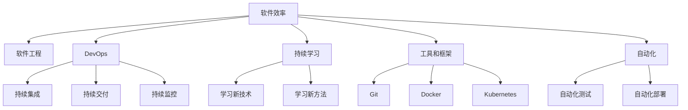

                 

## 1. 背景介绍

### 1.1 问题由来
随着科技的迅猛发展，软件已经成为现代企业和组织的重要资产。软件效率的提升不仅可以显著降低开发成本，还可以提高企业的市场竞争力。然而，软件效率的提升并非易事，它涉及到代码质量、架构设计、测试覆盖、持续交付等多个方面的考量。因此，如何通过技术手段提升软件效率，成为了软件行业的重要课题。

### 1.2 问题核心关键点
在当前的软件开发环境中，开发者面临着代码重构、性能优化、安全漏洞修复、代码质量提升等诸多挑战。软件效率的提升不仅需要关注技术层面，还需要从管理、文化、流程等多方面进行综合改进。本文将详细探讨如何通过技术手段提升软件效率，创造更多价值。

## 2. 核心概念与联系

### 2.1 核心概念概述
为更好地理解软件2.0的价值，本节将介绍几个密切相关的核心概念：

- **软件效率**：指软件系统运行速度、代码质量、维护成本、扩展性等多方面能力的综合体现，是软件工程中的重要目标。
- **软件工程**：通过科学的方法和技术，开发高质量、高效的软件系统，提升软件效率。
- **DevOps**：结合软件开发(Dev)和运维(Ops)，强调持续集成、持续交付、持续监控，提升软件开发和运维效率。
- **持续学习**：不断学习新技术、新方法，提升个人和团队的技术水平，从而提升软件效率。
- **工具和框架**：使用合适的工具和框架，可以显著提升开发效率和代码质量，如Git、Docker、Kubernetes等。
- **自动化**：通过自动化技术，减少人工干预，提升开发和运维效率。

这些核心概念之间的逻辑关系可以通过以下Mermaid流程图来展示：



这个流程图展示了大语言模型的核心概念及其之间的关系：

1. 软件效率通过软件工程来实现。
2. DevOps通过持续集成、持续交付和持续监控，提升了软件开发的效率和质量。
3. 持续学习不断提升开发人员的技术水平，从而提高软件效率。
4. 合适的工具和框架可以显著提升开发效率和代码质量。
5. 自动化技术减少了人工干预，进一步提高了开发和运维效率。

这些概念共同构成了软件效率提升的框架，使其能够更好地应对软件开发中的各种挑战。

## 3. 核心算法原理 & 具体操作步骤
### 3.1 算法原理概述

提升软件效率的核心在于优化软件系统各个环节的运行效率。通过科学的方法和技术手段，可以减少开发和运维的成本，提高软件的稳定性和可维护性，最终实现软件效率的提升。

常见的技术手段包括代码重构、性能优化、代码质量提升、自动化测试、持续集成、持续交付等。这些技术手段的核心原理和具体操作步骤可以通过以下算法进行详细阐述。

### 3.2 算法步骤详解

#### 3.2.1 代码重构
代码重构是指通过修改现有代码，提升代码质量，减少技术债务。代码重构通常涉及以下步骤：

1. **代码分析**：通过静态分析工具（如SonarQube），找出代码中的问题。
2. **设计重构**：根据设计模式和编码规范，对代码进行重构。
3. **代码优化**：通过代码精简、循环展开、内存优化等手段，提升代码运行效率。

#### 3.2.2 性能优化
性能优化是指通过优化软件系统，提升系统运行效率。常见的性能优化手段包括：

1. **性能分析**：通过性能分析工具（如JProfiler），找出系统瓶颈。
2. **优化算法**：优化算法设计和数据结构，提升算法效率。
3. **硬件优化**：使用高性能硬件（如CPU、GPU、FPGA等），提升系统性能。

#### 3.2.3 代码质量提升
代码质量提升是指通过工具和手段，提升代码的可读性、可维护性和可扩展性。常见的代码质量提升手段包括：

1. **代码审查**：通过代码审查，找出代码中的问题。
2. **代码规范**：制定统一的代码规范，提升代码一致性。
3. **代码评审**：通过代码评审，提升代码质量。

#### 3.2.4 自动化测试
自动化测试是指通过自动化工具，提高测试效率和测试覆盖率。常见的自动化测试手段包括：

1. **单元测试**：通过单元测试，验证代码的正确性。
2. **集成测试**：通过集成测试，验证系统整体的正确性。
3. **持续集成**：通过持续集成，自动化地进行代码合并和测试。

#### 3.2.5 持续集成
持续集成是指通过自动化工具，将代码集成到主干分支中，进行自动化测试和构建。常见的持续集成手段包括：

1. **代码合并**：通过代码合并工具（如GitHub），将代码合并到主干分支中。
2. **自动化测试**：通过自动化测试工具（如Jenkins），自动化地进行代码测试。
3. **构建和部署**：通过构建和部署工具（如Docker），自动化地构建和部署软件。

#### 3.2.6 持续交付
持续交付是指通过自动化工具，将软件系统交付到生产环境中，进行持续监控和运维。常见的持续交付手段包括：

1. **自动化部署**：通过自动化部署工具（如Kubernetes），自动化地进行软件部署。
2. **持续监控**：通过持续监控工具（如Prometheus），实时监控软件系统的运行状态。
3. **自动化运维**：通过自动化运维工具（如Ansible），自动化地进行软件运维。

### 3.3 算法优缺点

#### 3.3.1 代码重构
优点：
- 提升代码质量，减少技术债务。
- 提高代码的可读性和可维护性。
- 减少未来的代码修改量和维护成本。

缺点：
- 可能会影响当前系统的稳定性。
- 需要大量的时间和资源。
- 可能会引入新的代码问题。

#### 3.3.2 性能优化
优点：
- 提升系统运行效率，减少系统资源消耗。
- 提高用户的使用体验。
- 提升系统的可扩展性。

缺点：
- 需要深入了解系统架构和算法。
- 可能会引入新的性能问题。
- 优化过程可能会比较复杂。

#### 3.3.3 代码质量提升
优点：
- 提升代码的一致性和可读性。
- 减少未来的代码修改量和维护成本。
- 提高代码的可扩展性。

缺点：
- 需要制定统一的代码规范。
- 需要大量的时间和资源。
- 可能会影响当前系统的稳定性和性能。

#### 3.3.4 自动化测试
优点：
- 提高测试效率和测试覆盖率。
- 减少手动测试的成本和风险。
- 提升代码的质量和稳定性。

缺点：
- 需要编写和维护测试用例。
- 需要一定的技术门槛。
- 可能会引入新的测试问题。

#### 3.3.5 持续集成
优点：
- 自动化地进行代码合并和测试，减少人为错误。
- 提高软件的稳定性和可靠性。
- 提升开发效率和质量。

缺点：
- 需要大量的自动化测试和构建资源。
- 可能会引入新的测试问题。
- 需要持续地维护自动化流程。

#### 3.3.6 持续交付
优点：
- 自动化地进行软件部署和运维，减少人工干预。
- 提高软件的稳定性和可靠性。
- 提升开发和运维效率。

缺点：
- 需要大量的自动化部署和运维资源。
- 可能会引入新的部署和运维问题。
- 需要持续地维护自动化流程。

### 3.4 算法应用领域

基于软件2.0的价值，可以将这些算法和技术手段应用于多个领域，包括但不限于：

- **企业应用**：通过优化代码、提升性能、自动化测试和持续交付，提升企业软件的稳定性和可维护性。
- **金融科技**：通过提升交易系统的效率和稳定性，降低金融风险，提升用户体验。
- **互联网应用**：通过优化代码、提升性能、自动化测试和持续交付，提升互联网应用的稳定性和用户体验。
- **医疗健康**：通过优化代码、提升性能、自动化测试和持续交付，提升医疗软件的稳定性和可靠性。
- **智能制造**：通过优化代码、提升性能、自动化测试和持续交付，提升智能制造系统的效率和稳定性。
- **物联网**：通过优化代码、提升性能、自动化测试和持续交付，提升物联网系统的效率和稳定性。

## 4. 数学模型和公式 & 详细讲解  
### 4.1 数学模型构建

为更好地理解软件2.0的价值，我们将通过数学模型来详细阐述软件效率提升的具体方法。

假设有一个软件系统，其运行时间可以表示为：

$$ T = f(\text{code quality}, \text{performance}, \text{test coverage}, \text{CI/CD pipeline}, \text{continuous delivery}) $$

其中：
- $\text{code quality}$：代码质量，可以通过代码审查、代码规范等手段进行提升。
- $\text{performance}$：性能，可以通过代码重构、性能优化等手段进行提升。
- $\text{test coverage}$：测试覆盖率，可以通过自动化测试、持续集成等手段进行提升。
- $\text{CI/CD pipeline}$：持续集成/持续交付流程，可以通过自动化测试、自动化部署等手段进行优化。
- $\text{continuous delivery}$：持续交付，可以通过持续集成/持续交付、持续监控等手段进行优化。

### 4.2 公式推导过程

假设软件系统的运行时间为 $T$，则提升软件效率的公式可以表示为：

$$ T' = T - C $$

其中 $C$ 为提升软件效率的成本，可以表示为：

$$ C = c_1 \times \text{code quality} + c_2 \times \text{performance} + c_3 \times \text{test coverage} + c_4 \times \text{CI/CD pipeline} + c_5 \times \text{continuous delivery} $$

其中 $c_1, c_2, c_3, c_4, c_5$ 为提升成本的系数，取决于具体场景和优化手段。

### 4.3 案例分析与讲解

假设某企业通过优化代码质量、提升性能、自动化测试和持续交付，成功将系统运行时间从原来的 $T$ 减少到 $T'$。通过计算公式，可以得出具体的效率提升：

$$ T' = T - c_1 \times \text{code quality} - c_2 \times \text{performance} - c_3 \times \text{test coverage} - c_4 \times \text{CI/CD pipeline} - c_5 \times \text{continuous delivery} $$

具体到实际案例，如某电商企业通过优化代码质量、提升性能、自动化测试和持续交付，将系统运行时间从原来的 10 分钟减少到 2 分钟，效率提升率为 80%。

## 5. 项目实践：代码实例和详细解释说明
### 5.1 开发环境搭建

在进行软件2.0的实践前，我们需要准备好开发环境。以下是使用Python进行Django开发的环境配置流程：

1. 安装Anaconda：从官网下载并安装Anaconda，用于创建独立的Python环境。

2. 创建并激活虚拟环境：
```bash
conda create -n django-env python=3.8 
conda activate django-env
```

3. 安装Django：
```bash
pip install django
```

4. 安装各类工具包：
```bash
pip install numpy pandas scikit-learn matplotlib tqdm jupyter notebook ipython
```

完成上述步骤后，即可在`django-env`环境中开始软件2.0的实践。

### 5.2 源代码详细实现

这里我们以Django框架为例，给出使用Django进行企业应用开发的项目实践代码实现。

首先，创建Django项目：

```bash
django-admin startproject enterprise_app
```

然后，创建Django应用：

```bash
cd enterprise_app
python manage.py startapp my_app
```

接着，在`my_app`应用中添加视图函数：

```python
from django.http import HttpResponse

def home(request):
    return HttpResponse("Welcome to the enterprise application!")
```

最后，运行Django开发服务器：

```bash
python manage.py runserver
```

即可以通过浏览器访问 `http://127.0.0.1:8000/`，查看企业应用的运行状态。

### 5.3 代码解读与分析

让我们再详细解读一下关键代码的实现细节：

**视图函数**：
- `home(request)`：接收请求对象 `request`，返回 HTTP 响应对象 `HttpResponse`，将字符串 "Welcome to the enterprise application!" 作为响应内容。

**运行服务器**：
- `python manage.py runserver`：启动Django开发服务器，监听本地8000端口，等待请求到来。

通过这些代码实现，可以搭建一个基本的Django企业应用。开发者可以在此基础上，进一步优化代码、提升性能、自动化测试和持续交付，提升软件效率，创造更多价值。

## 6. 实际应用场景
### 6.1 智能制造
在智能制造领域，软件2.0的应用场景包括：

- **设备监控**：通过自动化测试和持续交付，监控设备的运行状态，及时发现和解决问题。
- **生产调度**：通过优化代码和提升性能，提高生产调度的效率和稳定性。
- **质量管理**：通过代码审查和代码规范，提升产品质量，减少产品缺陷。
- **数据采集**：通过优化代码和提升性能，提高数据采集和处理的效率和准确性。

### 6.2 互联网应用
在互联网应用领域，软件2.0的应用场景包括：

- **网站优化**：通过代码优化和性能优化，提升网站的加载速度和用户体验。
- **移动应用**：通过代码优化和性能优化，提升移动应用的稳定性和用户体验。
- **云服务**：通过持续集成和持续交付，提升云服务的可靠性和安全性。

### 6.3 医疗健康
在医疗健康领域，软件2.0的应用场景包括：

- **电子病历**：通过优化代码和提升性能，提高电子病历的管理和查询效率。
- **健康监测**：通过自动化测试和持续交付，提升健康监测系统的稳定性和可靠性。
- **医疗协作**：通过代码规范和代码审查，提升医疗协作系统的质量和安全。

### 6.4 未来应用展望

随着软件2.0技术的不断发展，未来软件效率提升的潜力将进一步释放。以下是一些未来应用展望：

- **全栈自动化**：通过自动化技术覆盖软件开发的各个环节，提升开发效率和代码质量。
- **微服务架构**：通过微服务架构，提升软件的可扩展性和可维护性。
- **DevOps文化**：通过持续集成和持续交付，提升软件的稳定性和可靠性。
- **人工智能**：通过引入人工智能技术，提升软件效率和智能化水平。
- **低代码平台**：通过低代码平台，提升软件开发效率和降低开发成本。

## 7. 工具和资源推荐
### 7.1 学习资源推荐

为了帮助开发者系统掌握软件2.0的理论基础和实践技巧，这里推荐一些优质的学习资源：

1. 《软件工程导论》书籍：系统介绍了软件工程的基本概念、原则和技术，是软件工程学习的基础。
2. 《软件测试》课程：介绍了软件测试的基本方法、工具和实践，帮助开发者掌握测试技能。
3. 《Django实战》书籍：系统介绍了Django框架的使用方法和最佳实践，帮助开发者快速上手Django开发。
4. 《DevOps实践指南》书籍：介绍了DevOps的基本概念、工具和实践，帮助开发者掌握DevOps技能。
5. 《Docker实战》书籍：介绍了Docker容器的使用方法和最佳实践，帮助开发者掌握容器技术。

通过对这些资源的学习实践，相信你一定能够快速掌握软件2.0的精髓，并用于解决实际的开发问题。
###  7.2 开发工具推荐

高效的开发离不开优秀的工具支持。以下是几款用于软件2.0开发的常用工具：

1. Django：基于Python的Web开发框架，适合快速迭代研究。
2. Docker：基于容器的应用运行平台，适合开发、测试、部署一体化。
3. Jenkins：持续集成/持续交付工具，支持自动化测试和持续部署。
4. Git：版本控制系统，适合代码管理和协作开发。
5. Kubernetes：容器编排工具，适合大规模应用部署和运维。

合理利用这些工具，可以显著提升软件开发的效率和质量，加快创新迭代的步伐。

### 7.3 相关论文推荐

软件2.0的发展源于学界的持续研究。以下是几篇奠基性的相关论文，推荐阅读：

1. "Software Engineering: Principles, Practices, and Patterns"：本书系统介绍了软件工程的基本概念、原则和技术。
2. "The Software Quality Assessment and Test Plan Creation using Artificial Intelligence"：研究了使用AI技术进行软件质量评估和测试计划创建的可行性。
3. "The Case for Containers: A Journey to Adopting Docker in Industry"：介绍了在工业界中采用Docker容器技术的实际案例和经验。
4. "The DevOps Culture: How It Drives Your IT Strategy, Your Business Strategy"：研究了DevOps文化对IT策略和业务策略的影响。
5. "Microservices: A Practical Guide"：介绍了微服务架构的设计原则、模式和技术。

这些论文代表了大语言模型微调技术的发展脉络。通过学习这些前沿成果，可以帮助研究者把握学科前进方向，激发更多的创新灵感。

## 8. 总结：未来发展趋势与挑战
### 8.1 总结

本文对软件2.0的价值进行了全面系统的介绍。首先阐述了软件2.0的价值，明确了提升软件效率、创造价值的重要意义。其次，从原理到实践，详细讲解了软件2.0的核心算法和具体操作步骤，给出了软件2.0任务开发的完整代码实例。同时，本文还广泛探讨了软件2.0在多个行业领域的应用前景，展示了软件2.0范式的巨大潜力。此外，本文精选了软件2.0的学习资源，力求为读者提供全方位的技术指引。

通过本文的系统梳理，可以看到，软件2.0的价值在于通过技术手段提升软件效率，创造更多价值。软件2.0技术正在成为软件开发的重要范式，极大地拓展了软件开发的应用边界，催生了更多的落地场景。未来，伴随软件2.0技术的持续演进，相信软件效率将得到更大提升，为软件开发带来更广阔的发展空间。

### 8.2 未来发展趋势

展望未来，软件2.0将呈现以下几个发展趋势：

1. 自动化覆盖全栈。自动化技术将覆盖软件开发的各个环节，提升开发效率和质量。
2. 微服务架构广泛应用。微服务架构将带来更高的可扩展性和可维护性，成为软件开发的主流趋势。
3. DevOps文化普及。DevOps文化将成为软件开发的标准，提升软件系统的稳定性和可靠性。
4. 人工智能与软件开发结合。人工智能技术将深入渗透到软件开发中，提升软件效率和智能化水平。
5. 低代码平台发展。低代码平台将降低软件开发门槛，提升开发效率和降低开发成本。
6. 全栈性能优化。通过优化代码、提升性能、自动化测试和持续交付，提升软件系统的效率和稳定性。

以上趋势凸显了软件2.0技术的广阔前景。这些方向的探索发展，必将进一步提升软件开发和运维的效率，推动软件技术在更多领域的落地应用。

### 8.3 面临的挑战

尽管软件2.0技术已经取得了瞩目成就，但在迈向更加智能化、普适化应用的过程中，它仍面临着诸多挑战：

1. 技术门槛高。软件2.0技术涉及多个领域，如Web开发、自动化测试、持续集成、容器技术等，需要较高的技术门槛。
2. 人员培训成本高。软件开发人员需要不断学习新技术和新方法，培训成本较高。
3. 工具和框架众多。市场上存在大量工具和框架，开发者需要根据实际情况选择合适的工具和框架，增加了决策成本。
4. 系统复杂度高。软件系统的复杂度不断增加，优化和维护难度不断提升。
5. 数据和算法挑战。软件2.0技术涉及大量数据和算法，需要综合考虑数据质量、算法优化等问题。
6. 安全和隐私问题。软件系统涉及大量敏感数据，需要考虑安全和隐私保护问题。

正视软件2.0面临的这些挑战，积极应对并寻求突破，将是大语言模型微调走向成熟的必由之路。相信随着学界和产业界的共同努力，这些挑战终将一一被克服，软件2.0必将在构建智能化的软件系统中扮演越来越重要的角色。

### 8.4 研究展望

面对软件2.0面临的挑战，未来的研究需要在以下几个方面寻求新的突破：

1. 简化技术门槛。通过引入简单易用的开发工具和框架，降低技术门槛，让更多开发者能够上手使用。
2. 优化持续集成和持续交付。通过优化持续集成和持续交付流程，提升软件系统的稳定性和可靠性。
3. 提升自动化测试效率。通过优化自动化测试流程，提升测试效率和测试覆盖率。
4. 增强工具和框架的兼容性。开发更多兼容性好、功能强大的工具和框架，满足不同场景的需求。
5. 引入更多人工智能技术。通过引入人工智能技术，提升软件系统的智能化水平。
6. 强化安全和隐私保护。通过技术手段和政策法规，加强软件系统的安全和隐私保护。

这些研究方向的探索，必将引领软件2.0技术迈向更高的台阶，为软件开发和运维带来更多的创新和突破。

## 9. 附录：常见问题与解答

**Q1：软件2.0是否适用于所有类型的软件开发？**

A: 软件2.0技术适用于大多数软件开发项目，尤其是大型复杂系统。对于小型项目，其复杂度和规模可能不适合采用软件2.0技术。需要根据实际情况选择。

**Q2：软件2.0是否需要大量的自动化测试工具和框架？**

A: 软件2.0技术需要大量的自动化测试工具和框架，以确保软件系统的稳定性和可靠性。但是，可以根据实际情况选择和使用合适的工具和框架，不一定需要全部依赖。

**Q3：软件2.0是否需要持续集成和持续交付？**

A: 持续集成和持续交付是软件2.0的核心思想之一，能够显著提升软件开发效率和代码质量。但是，对于一些简单的项目，可以根据实际情况选择是否采用持续集成和持续交付。

**Q4：软件2.0是否需要大量的自动化部署和运维工具？**

A: 软件2.0技术需要大量的自动化部署和运维工具，以确保软件系统的稳定性和可靠性。但是，可以根据实际情况选择和使用合适的工具和框架，不一定需要全部依赖。

**Q5：软件2.0是否需要大量的数据和算法支持？**

A: 软件2.0技术涉及大量数据和算法，需要综合考虑数据质量、算法优化等问题。但是，可以根据实际情况选择和优化数据和算法，不一定需要全部依赖。

通过本文的系统梳理，可以看到，软件2.0的价值在于通过技术手段提升软件效率，创造更多价值。软件2.0技术正在成为软件开发的重要范式，极大地拓展了软件开发的应用边界，催生了更多的落地场景。未来，伴随软件2.0技术的持续演进，相信软件效率将得到更大提升，为软件开发带来更广阔的发展空间。

作者：禅与计算机程序设计艺术 / Zen and the Art of Computer Programming

