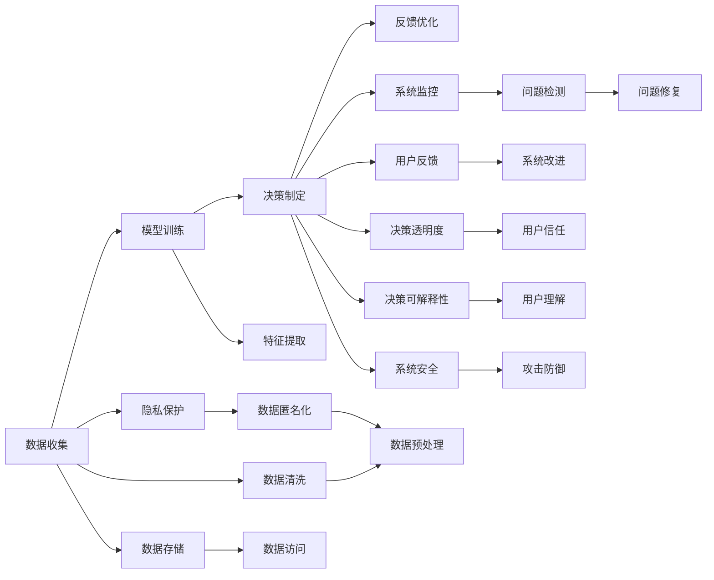

                 

# 软件 2.0 的伦理规范：人工智能的责任

## 1. 背景介绍

### 1.1 问题由来

随着人工智能(AI)技术的飞速发展，我们正在进入一个新的时代——软件 2.0 时代。这个时代中，算法和模型变得极其复杂，其表现力和计算能力已经超越了传统软件，能够自动生成代码、优化配置、预测未来、进行决策等，似乎已经具有了自我意识。然而，这也引发了一系列伦理和责任问题，这些问题可能涉及到隐私、公平、透明、可解释性、安全等方面。

在传统软件开发中，程序员和开发者往往能够清晰地看到代码和逻辑，从而能够对代码的行为和结果进行解释。但当这些任务交给AI系统时，即使是开发者也无法完全理解系统的行为，这使得AI系统的决策过程变得难以解释和信任。

近年来，AI系统的应用范围已经从工业生产扩展到医疗、司法、金融、教育等领域，对人类社会的影响越来越深远。在这种背景下，如何制定和遵守AI系统的伦理规范，确保其在运行过程中的责任性，成为一个迫切需要解决的问题。

### 1.2 问题核心关键点

1. **伦理和责任的界定**：
   - AI系统的决策过程是否能够被清晰解释？
   - AI系统是否需要对其决策负责？如果负责，如何界定责任？

2. **隐私保护**：
   - AI系统如何处理和保护用户数据？
   - 如何在保证AI系统功能的前提下，最小化对用户隐私的侵犯？

3. **公平性和透明度**：
   - AI系统是否存在偏见？如何检测和缓解偏见？
   - AI系统的决策过程是否透明，用户能否理解其工作原理？

4. **可解释性和可解释性**：
   - AI系统的决策是否可以被解释？如何提高系统的可解释性？

5. **安全性和鲁棒性**：
   - AI系统是否能够抵御恶意攻击？如何提高系统的鲁棒性？

6. **监督和治理**：
   - 如何对AI系统进行有效监督，确保其行为符合伦理规范？

## 2. 核心概念与联系

### 2.1 核心概念概述

在讨论软件 2.0 的伦理规范之前，我们首先需要理解一些核心概念：

- **人工智能(AI)**：广义上指使计算机系统能够模拟人类智能的任何技术。包括机器学习、深度学习、自然语言处理等。

- **软件 2.0**：指利用AI技术自动生成和优化软件的系统。这些系统能够通过学习大量的代码和数据，生成高质量的软件解决方案。

- **可解释性**：指AI系统的决策过程是否可以被人类理解。这对于确保AI系统的公平性、透明性和可信度至关重要。

- **责任**：指AI系统在运行过程中出现问题时的责任归属。如何界定AI系统在决策中的责任，是制定伦理规范的关键。

### 2.2 核心概念原理和架构的 Mermaid 流程图



## 3. 核心算法原理 & 具体操作步骤

### 3.1 算法原理概述

软件 2.0 系统的核心算法原理主要包括数据收集、模型训练、决策制定、反馈优化四个步骤。在这个过程中，隐私保护、公平性、透明度、可解释性和安全等问题都需要被考虑和解决。

### 3.2 算法步骤详解

**Step 1: 数据收集**
数据收集是AI系统的基础。数据的质量和隐私保护是关键。在进行数据收集时，需要确保数据的合法性和透明性，避免侵犯用户隐私。数据收集过程应该遵循以下原则：
1. 数据收集应获得用户的明确同意。
2. 数据收集应最小化，只收集完成任务所需的最少数据。
3. 数据收集应遵循公平和透明的原则，避免对某些群体的歧视。

**Step 2: 模型训练**
模型训练是AI系统的核心环节。训练过程中，需要考虑公平性和可解释性问题。具体措施包括：
1. 使用公开数据集和标准模型，避免数据偏见。
2. 引入公平性评估指标，检测和缓解模型偏见。
3. 设计可解释性的模型结构，提高模型的透明性。

**Step 3: 决策制定**
决策制定是AI系统的最终目标。这一步骤需要确保决策的公平性和透明性。具体措施包括：
1. 设计可解释的决策路径，让用户理解AI系统的决策过程。
2. 引入反馈机制，允许用户对AI系统的决策进行申诉和修正。
3. 确保决策过程中的透明度，让用户能够检查AI系统的行为。

**Step 4: 反馈优化**
反馈优化是AI系统的自我改进过程。这一步骤需要确保系统的稳定性和安全性。具体措施包括：
1. 设计鲁棒的系统架构，避免单点故障。
2. 引入异常检测和修复机制，及时处理系统问题。
3. 引入安全评估和防护措施，保障系统的安全性。

### 3.3 算法优缺点

软件 2.0 系统的优点包括：
1. 能够自动化和优化软件开发过程，提高效率和质量。
2. 能够处理大规模数据，提供精准的分析和预测。
3. 能够提供个性化的用户体验，满足用户需求。

软件 2.0 系统的缺点包括：
1. 缺乏可解释性，用户难以理解AI系统的决策过程。
2. 可能存在数据偏见，影响决策的公平性。
3. 可能存在安全漏洞，面临攻击风险。

### 3.4 算法应用领域

软件 2.0 系统已经广泛应用于多个领域，包括：

- **金融**：用于风险评估、信用评分、投资决策等。
- **医疗**：用于疾病诊断、治疗方案推荐、药物研发等。
- **教育**：用于个性化教育、智能辅导、学习数据分析等。
- **交通**：用于交通流量预测、智能调度、自动驾驶等。
- **司法**：用于案件分析、判决建议、法律咨询等。
- **公共安全**：用于犯罪预测、舆情分析、紧急响应等。

## 4. 数学模型和公式 & 详细讲解

### 4.1 数学模型构建

软件 2.0 系统通常使用机器学习和深度学习模型进行决策制定。以决策树为例，构建数学模型的基本步骤包括：

1. **数据准备**：将原始数据进行清洗、归一化和预处理。
2. **特征选择**：选择与目标变量最相关的特征。
3. **模型训练**：使用训练数据训练决策树模型。
4. **模型评估**：使用测试数据评估模型的性能。

数学模型构建的一般流程如下：

$$
Model = f(X, \theta)
$$

其中，$X$ 为输入数据，$\theta$ 为模型参数。

### 4.2 公式推导过程

以决策树模型为例，推导其训练和预测过程如下：

**训练过程**：

1. 选择最优特征 $x_i$：
$$
split_x = \mathop{\arg\min}_{x_i} \mathcal{L}(f(X_i, \theta))
$$

2. 计算切分点：
$$
split_point = median(x_i)
$$

3. 分割数据集：
$$
D_{left} = \{x \in X | x_i < split_point\}
$$
$$
D_{right} = \{x \in X | x_i \geq split_point\}
$$

4. 递归训练：
$$
T = f(D_{left}, \theta) + f(D_{right}, \theta)
$$

**预测过程**：

1. 将输入数据 $X$ 分割到左右子树：
$$
X_{left} = \{x \in X | x_i < split_point\}
$$
$$
X_{right} = \{x \in X | x_i \geq split_point\}
$$

2. 根据子树预测：
$$
\hat{y} = f(X_{left}, \theta) + f(X_{right}, \theta)
$$

### 4.3 案例分析与讲解

以金融信用评分系统为例，展示如何构建和优化软件 2.0 系统：

**数据收集**：
- 收集用户的银行流水、信用记录、社交网络数据等。
- 确保数据收集过程透明，并取得用户同意。

**模型训练**：
- 使用随机森林或梯度提升树模型进行训练。
- 引入公平性评估指标，如AUC、PR曲线等。
- 引入可解释性模型，如LIME、SHAP等。

**决策制定**：
- 设计可解释的决策路径，让用户理解评分依据。
- 引入反馈机制，允许用户对评分结果申诉和修正。

**反馈优化**：
- 设计鲁棒的系统架构，避免单点故障。
- 引入异常检测和修复机制，及时处理系统问题。

## 5. 项目实践：代码实例和详细解释说明

### 5.1 开发环境搭建

在搭建软件 2.0 系统的开发环境时，需要使用Python和PyTorch等工具。以下是详细的配置步骤：

1. **安装Anaconda**：
   - 下载并安装Anaconda。
   - 创建Python虚拟环境，如`pytorch-env`。
   - 激活虚拟环境：`conda activate pytorch-env`。

2. **安装PyTorch**：
   - 安装PyTorch版本，如`conda install pytorch torchvision torchaudio cudatoolkit=11.1 -c pytorch -c conda-forge`。
   - 安装其他依赖库，如TensorBoard、Weights & Biases等。

### 5.2 源代码详细实现

以下是使用Python和PyTorch实现信用评分系统的示例代码：

```python
import torch
import torch.nn as nn
import torch.optim as optim
import torch.utils.data as data
import torchvision.transforms as transforms
import matplotlib.pyplot as plt

# 定义模型结构
class CreditScoringModel(nn.Module):
    def __init__(self):
        super(CreditScoringModel, self).__init__()
        self.fc1 = nn.Linear(10, 64)
        self.fc2 = nn.Linear(64, 1)

    def forward(self, x):
        x = F.relu(self.fc1(x))
        x = self.fc2(x)
        return x

# 定义数据加载器
class CreditScoringDataset(data.Dataset):
    def __init__(self, data):
        self.data = data
        self.transform = transforms.ToTensor()

    def __len__(self):
        return len(self.data)

    def __getitem__(self, idx):
        img, target = self.data[idx]
        img = self.transform(img)
        return img, target

# 加载数据
train_data = # 加载训练数据
test_data = # 加载测试数据

# 定义模型和优化器
model = CreditScoringModel()
optimizer = optim.Adam(model.parameters(), lr=0.001)

# 定义训练过程
def train(model, data_loader, optimizer, n_epochs):
    for epoch in range(n_epochs):
        model.train()
        for batch_idx, (inputs, targets) in enumerate(data_loader):
            optimizer.zero_grad()
            outputs = model(inputs)
            loss = F.mse_loss(outputs, targets)
            loss.backward()
            optimizer.step()
            if (batch_idx+1) % 100 == 0:
                print('Train Epoch: {} [{}/{} ({:.0f}%)]\tLoss: {:.6f}'.format(
                    epoch+1, batch_idx * len(data_loader), len(data_loader), 100. * batch_idx / len(data_loader), loss.item()))

# 定义测试过程
def test(model, data_loader):
    model.eval()
    total_loss = 0
    with torch.no_grad():
        for batch_idx, (inputs, targets) in enumerate(data_loader):
            outputs = model(inputs)
            loss = F.mse_loss(outputs, targets)
            total_loss += loss.item()
            if (batch_idx+1) % 100 == 0:
                print('Test Epoch: {} [{}/{} ({:.0f}%)]\tLoss: {:.6f}'.format(
                    epoch+1, batch_idx * len(data_loader), len(data_loader), 100. * batch_idx / len(data_loader), loss.item()))

# 训练和测试
train(model, train_data, optimizer, 10)
test(model, test_data)
```

### 5.3 代码解读与分析

在上述代码中，我们首先定义了一个简单的信用评分模型，并使用Adam优化器进行训练。接着，定义了数据加载器，加载训练数据和测试数据。在训练过程中，我们计算了均方误差损失，并使用梯度下降法更新模型参数。在测试过程中，我们计算了模型在测试数据上的损失，并输出结果。

## 6. 实际应用场景

### 6.1 金融信用评分

金融信用评分系统可以帮助银行和金融机构评估客户的信用风险。在实际应用中，可以通过软件 2.0 系统，自动生成信用评分模型，并在不同的客户数据集上进行微调和优化。这种系统可以大幅提升银行的工作效率，降低信用风险评估的误差。

### 6.2 医疗诊断

医疗诊断系统可以通过软件 2.0 系统，自动生成疾病诊断模型，并在不同的患者数据集上进行微调和优化。这种系统可以大幅提升医生的工作效率，提高诊断的准确性和及时性，为患者提供更好的医疗服务。

### 6.3 教育个性化推荐

教育个性化推荐系统可以通过软件 2.0 系统，自动生成个性化学习推荐模型，并在不同的学生数据集上进行微调和优化。这种系统可以提供个性化的学习推荐，提升学生的学习效率和兴趣，为教育事业带来新的变革。

### 6.4 未来应用展望

随着软件 2.0 技术的发展，未来将有更多的应用场景被引入，包括：

- **智能城市**：用于交通流量预测、智能调度、自动驾驶等。
- **司法判决**：用于案件分析、判决建议、法律咨询等。
- **智能制造**：用于生产过程优化、设备预测性维护等。
- **智慧医疗**：用于疾病预测、治疗方案推荐、药物研发等。

## 7. 工具和资源推荐

### 7.1 学习资源推荐

为了帮助开发者系统掌握软件 2.0 系统的理论和实践知识，以下是一些优质的学习资源：

1. **《深度学习与人工智能》**：深入浅出地介绍了深度学习的基本原理和应用。
2. **《软件 2.0: 下一代计算革命》**：阐述了软件 2.0 技术的发展和应用前景。
3. **Coursera《机器学习》课程**：由斯坦福大学教授Andrew Ng主讲的机器学习课程，涵盖了机器学习的基本概念和应用。
4. **Udacity《深度学习》课程**：涵盖深度学习的基本原理和应用，适合初学者和进阶者。
5. **Arxiv.org**：发表深度学习、人工智能等领域最新研究成果的平台，适合跟踪最新研究进展。

### 7.2 开发工具推荐

为了帮助开发者高效开发软件 2.0 系统，以下是一些推荐的开发工具：

1. **Python**：作为AI开发的首选语言，Python具有丰富的库和框架支持。
2. **PyTorch**：一个强大的深度学习框架，易于使用且灵活性高。
3. **TensorFlow**：由Google开发的一个流行的深度学习框架，支持多种硬件和平台。
4. **Weights & Biases**：一个实验跟踪工具，用于记录和可视化模型训练过程。
5. **TensorBoard**：一个可视化工具，用于监控模型训练过程和性能。
6. **Jupyter Notebook**：一个交互式的开发环境，适合进行数据处理和模型调试。

### 7.3 相关论文推荐

以下是一些关于软件 2.0 系统的经典论文，推荐阅读：

1. **《软件 2.0: 下一代计算革命》**：阐述了软件 2.0 技术的发展和应用前景。
2. **《深度学习与人工智能》**：介绍了深度学习的基本原理和应用。
3. **《深度学习在医疗诊断中的应用》**：介绍了深度学习在医疗诊断中的应用。
4. **《智能城市中的深度学习》**：介绍了深度学习在智能城市中的应用。
5. **《软件 2.0: 人工智能伦理与责任》**：探讨了软件 2.0 系统中的伦理与责任问题。

## 8. 总结：未来发展趋势与挑战

### 8.1 研究成果总结

本文详细介绍了软件 2.0 系统的核心概念和实际应用，并探讨了系统中的伦理和责任问题。通过系统的学习资源、开发工具和相关论文推荐，我们希望能够帮助开发者更好地掌握软件 2.0 系统的理论和实践知识，从而实现更加智能和可靠的应用。

### 8.2 未来发展趋势

展望未来，软件 2.0 技术将呈现以下几个发展趋势：

1. **智能化程度的提升**：随着深度学习模型的不断改进，软件 2.0 系统的智能化程度将进一步提升，能够处理更加复杂和多样化的任务。
2. **跨领域应用的范围扩大**：软件 2.0 系统将应用于更多领域，如智能交通、智慧城市、智能制造等。
3. **可解释性和透明度增强**：未来系统将更加注重可解释性和透明度，能够提供更加清晰和易于理解的决策依据。
4. **伦理和责任的进一步探讨**：随着系统应用范围的扩大，如何制定和遵守伦理规范，确保系统的公平性、透明性和安全性，将是一个重要的研究方向。

### 8.3 面临的挑战

虽然软件 2.0 技术已经取得了一定的进展，但未来仍然面临诸多挑战：

1. **数据隐私和安全**：如何在保护用户隐私的前提下，保证系统功能的实现，是一个重要的挑战。
2. **模型的公平性和透明性**：如何在保证系统性能的前提下，避免数据偏见和模型不透明，是一个重要的挑战。
3. **系统的可解释性**：如何在保证系统性能的前提下，提高系统的可解释性，是一个重要的挑战。
4. **系统的安全性和鲁棒性**：如何在保证系统性能的前提下，提高系统的安全性和鲁棒性，是一个重要的挑战。

### 8.4 研究展望

未来，需要从以下几个方向进行研究：

1. **伦理和责任的进一步探讨**：制定和遵守软件 2.0 系统的伦理规范，确保系统的公平性、透明性和安全性。
2. **模型的公平性和透明性**：研究和开发公平性评估指标和透明性增强技术，提高系统的可靠性。
3. **系统的可解释性**：研究和开发可解释性模型和工具，提高系统的可理解性。
4. **系统的安全性和鲁棒性**：研究和开发安全性和鲁棒性增强技术，提高系统的抗攻击能力和鲁棒性。

## 9. 附录：常见问题与解答

**Q1: 什么是软件 2.0 系统？**

A: 软件 2.0 系统是指利用AI技术自动生成和优化软件的系统。这些系统能够通过学习大量的代码和数据，生成高质量的软件解决方案。

**Q2: 软件 2.0 系统的主要优点是什么？**

A: 软件 2.0 系统的主要优点包括：
1. 能够自动化和优化软件开发过程，提高效率和质量。
2. 能够处理大规模数据，提供精准的分析和预测。
3. 能够提供个性化的用户体验，满足用户需求。

**Q3: 如何保证软件 2.0 系统的公平性和透明性？**

A: 保证软件 2.0 系统的公平性和透明性，需要采取以下措施：
1. 使用公开数据集和标准模型，避免数据偏见。
2. 引入公平性评估指标，检测和缓解模型偏见。
3. 设计可解释性的模型结构，提高模型的透明性。

**Q4: 软件 2.0 系统的缺点是什么？**

A: 软件 2.0 系统的缺点包括：
1. 缺乏可解释性，用户难以理解AI系统的决策过程。
2. 可能存在数据偏见，影响决策的公平性。
3. 可能存在安全漏洞，面临攻击风险。

**Q5: 软件 2.0 系统在未来有哪些应用前景？**

A: 软件 2.0 系统在未来有以下应用前景：
1. 金融信用评分：用于风险评估、信用评分、投资决策等。
2. 医疗诊断：用于疾病诊断、治疗方案推荐、药物研发等。
3. 教育个性化推荐：用于个性化学习推荐、智能辅导、学习数据分析等。
4. 智能城市：用于交通流量预测、智能调度、自动驾驶等。
5. 司法判决：用于案件分析、判决建议、法律咨询等。
6. 智能制造：用于生产过程优化、设备预测性维护等。

**Q6: 如何制定软件 2.0 系统的伦理规范？**

A: 制定软件 2.0 系统的伦理规范，需要考虑以下几个方面：
1. 保证数据的合法性和透明性，避免侵犯用户隐私。
2. 确保模型的公平性和透明性，避免数据偏见和模型不透明。
3. 提供系统的可解释性，让用户理解系统的决策过程。
4. 保证系统的安全性和鲁棒性，避免单点故障和攻击风险。

**Q7: 如何保证软件 2.0 系统的可解释性？**

A: 保证软件 2.0 系统的可解释性，可以采取以下措施：
1. 使用可解释性模型，如LIME、SHAP等。
2. 提供决策路径的可视化，让用户理解系统的决策过程。
3. 引入反馈机制，允许用户对系统的决策进行申诉和修正。

---

作者：禅与计算机程序设计艺术 / Zen and the Art of Computer Programming

