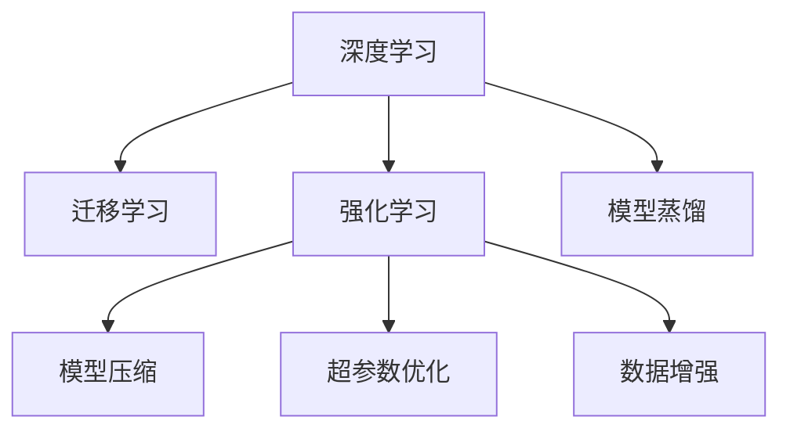

                 

## 1. 背景介绍

随着人工智能技术的飞速发展，软件系统的设计和实现方式也正在经历一场革命性的变革。从软件 1.0 的以人工编码为主导，到软件 2.0 的以数据驱动、智能化的深度学习与强化学习为主导，这一转变标志着人类进入了一个新的智能化时代。深度学习与强化学习不仅在图像识别、自然语言处理、智能推荐等传统领域取得了巨大成功，更在自动驾驶、机器人控制、系统优化等前沿领域展现出巨大的潜力和应用价值。

### 1.1 软件 1.0 的局限性

在软件 1.0 时代，开发人员需要耗费大量时间和精力，对系统逻辑进行手工编码。这种方式不仅成本高、效率低，且难以处理复杂的多变量和不确定性问题。而基于规则的硬编码方式，则限制了系统灵活性和可扩展性。

### 1.2 软件 2.0 的革命性

软件 2.0 强调数据驱动、以算法为中心的开发方式。通过深度学习与强化学习，软件系统能够自动从大量数据中学习规则，并基于数据不断优化自身行为。这一方式不仅大幅提升了系统的智能化水平，还使得开发人员能够聚焦于高层次的系统设计和业务逻辑。

## 2. 核心概念与联系

### 2.1 核心概念概述

为更好地理解软件 2.0 的原理与应用，本节将介绍几个密切相关的核心概念：

- 深度学习(Deep Learning)：基于神经网络的机器学习技术，通过多层次的特征提取和分类，能够处理复杂的非线性关系，适用于图像识别、自然语言处理等任务。

- 强化学习(Reinforcement Learning, RL)：通过与环境的交互，智能体通过不断试错和学习，找到最优策略以达到预设目标。适用于自动驾驶、机器人控制、系统优化等领域。

- 迁移学习(Transfer Learning)：将在一个任务上学到的知识迁移到另一个任务上，以减少学习负担，提升新任务的学习效果。深度学习与强化学习都可以应用迁移学习的思想。

- 模型压缩(Compression)：通过剪枝、量化、蒸馏等技术，减少模型的参数量、提升推理速度和效率。

- 超参数优化(Hyperparameter Tuning)：通过优化学习率、正则化系数、网络结构等超参数，提升模型的训练效果。

- 数据增强(Data Augmentation)：通过对原始数据进行变换，生成更多样化的训练样本，以增强模型的泛化能力。

这些核心概念之间的逻辑关系可以通过以下Mermaid流程图来展示：



这个流程图展示了大语言模型的核心概念及其之间的关系：

1. 深度学习与强化学习是软件 2.0 的核心技术。
2. 迁移学习、模型压缩和超参数优化等技术，用于优化深度学习与强化学习模型的性能。
3. 模型蒸馏和数据增强等技术，进一步提升模型的泛化能力和鲁棒性。

这些概念共同构成了软件 2.0 的开发框架，使其能够在各种场景下发挥强大的智能和优化能力。通过理解这些核心概念，我们可以更好地把握软件 2.0 的工作原理和优化方向。

## 3. 核心算法原理 & 具体操作步骤
### 3.1 算法原理概述

软件 2.0 的开发过程，本质上是深度学习与强化学习模型训练和优化的过程。其核心思想是：通过构建合适的模型架构，利用大量数据进行训练，不断优化模型参数，最终得到性能优越的模型。

形式化地，假设模型为 $f(\mathbf{x},\theta)$，其中 $\mathbf{x}$ 为输入，$\theta$ 为模型参数。训练的目标是最小化模型在训练集 $D$ 上的损失函数 $\mathcal{L}(\mathbf{x},\theta)$，即：

$$
\theta^* = \mathop{\arg\min}_{\theta} \mathcal{L}(\mathbf{x},\theta)
$$

其中 $\mathcal{L}(\mathbf{x},\theta)$ 为损失函数，如均方误差、交叉熵等。在深度学习中，损失函数的计算通常依赖于前向传播和反向传播算法。在强化学习中，损失函数则涉及奖励信号和策略函数。

### 3.2 算法步骤详解

软件 2.0 的开发过程可以分为以下几个关键步骤：

**Step 1: 选择模型架构**
- 根据任务类型，选择合适的深度学习或强化学习模型架构，如卷积神经网络(CNN)、循环神经网络(RNN)、Transformer、策略网络、价值网络等。

**Step 2: 准备训练数据**
- 收集与任务相关的训练数据集，划分为训练集、验证集和测试集。一般要求训练数据集与目标数据集具有相似的分布。

**Step 3: 模型训练**
- 使用训练集数据对模型进行训练，利用前向传播计算损失函数，利用反向传播算法优化模型参数。
- 定期在验证集上评估模型性能，根据性能指标决定是否停止训练。
- 在训练过程中，可以应用数据增强、正则化、超参数优化等技术，提升模型性能。

**Step 4: 模型评估**
- 在测试集上评估训练好的模型性能，对比模型在测试集上的精度或效果。
- 使用AUC、RMSE、F1-score等指标评估模型的表现。
- 根据评估结果，进行模型优化或超参数调整。

**Step 5: 模型部署**
- 将训练好的模型部署到实际应用系统中，如Web服务、移动应用等。
- 集成输入预处理、推理后处理等模块，确保模型能够正确地处理输入和输出。
- 监控模型在实际环境中的运行状态，定期进行模型更新和维护。

以上是软件 2.0 开发的一般流程。在实际应用中，还需要针对具体任务的特点，对模型架构、数据预处理、优化方法等环节进行优化设计，以进一步提升模型性能。

### 3.3 算法优缺点

深度学习与强化学习具有以下优点：
1. 能够处理复杂的非线性关系，适用于多种应用场景。
2. 具备强大的泛化能力，能够从大量数据中学习出有效的特征和规律。
3. 自动化程度高，减少了手工编码的工作量，提升了开发效率。
4. 具有自我优化的能力，能够根据反馈调整自身行为，适应复杂环境。

同时，这些方法也存在一定的局限性：
1. 数据需求高。深度学习与强化学习需要大量的标注数据进行训练，数据获取成本较高。
2. 模型复杂度高。深度学习模型通常具有亿级参数，训练和推理需要高性能设备支持。
3. 可解释性不足。模型决策过程复杂，难以解释模型的内部工作机制。
4. 计算资源消耗大。训练和推理过程耗时耗电，需要优化资源消耗。

尽管存在这些局限性，但深度学习与强化学习仍是目前最有效的智能开发手段之一。未来相关研究的重点在于如何进一步降低数据获取成本，提高模型的可解释性和资源效率，以推动AI技术在更多领域的应用。

### 3.4 算法应用领域

深度学习与强化学习已经在众多领域得到了广泛的应用，例如：

- 计算机视觉：如图像分类、目标检测、人脸识别、图像生成等。通过卷积神经网络(CNN)等模型，能够有效提取图像特征，实现高精度的图像处理。

- 自然语言处理(NLP)：如机器翻译、情感分析、文本生成、问答系统等。通过循环神经网络(RNN)、Transformer等模型，能够理解和生成自然语言。

- 语音识别：如语音合成、语音识别、情感识别等。通过卷积神经网络(CNN)、长短时记忆网络(LSTM)等模型，能够处理语音信号，实现语音交互。

- 自动驾驶：如车辆控制、路径规划、环境感知等。通过强化学习，能够学习最优的驾驶策略，提升驾驶安全和效率。

- 机器人控制：如机械臂操作、路径规划、避障等。通过强化学习，能够学习最优的控制策略，提升机器人操作精度和灵活性。

- 系统优化：如电网调度和交通控制等。通过强化学习，能够学习最优的控制策略，提升系统运行的效率和稳定性。

除了上述这些经典领域外，深度学习与强化学习还被创新性地应用于更多场景中，如推荐系统、游戏AI、医疗诊断、金融预测等，为人工智能技术带来了新的突破。随着模型的不断进步，相信深度学习与强化学习将在更广阔的应用领域大放异彩。

## 4. 数学模型和公式 & 详细讲解  
### 4.1 数学模型构建

本节将使用数学语言对深度学习与强化学习模型训练过程进行更加严格的刻画。

**深度学习模型**：
假设模型为 $f(\mathbf{x},\theta)$，其中 $\mathbf{x}$ 为输入，$\theta$ 为模型参数。训练的目标是最小化模型在训练集 $D$ 上的损失函数 $\mathcal{L}(\mathbf{x},\theta)$，即：

$$
\theta^* = \mathop{\arg\min}_{\theta} \mathcal{L}(\mathbf{x},\theta)
$$

其中 $\mathcal{L}(\mathbf{x},\theta)$ 为损失函数，如均方误差、交叉熵等。在训练过程中，模型的参数 $\theta$ 通过反向传播算法不断更新。

**强化学习模型**：
假设模型为 $Q(\mathbf{s},\mathbf{a},\theta)$，其中 $\mathbf{s}$ 为状态，$\mathbf{a}$ 为动作，$\theta$ 为模型参数。训练的目标是最大化累积奖励 $R$，即：

$$
\theta^* = \mathop{\arg\max}_{\theta} \sum_{t=1}^T R_t
$$

其中 $R_t$ 为状态动作对 $(s_t,a_t)$ 的即时奖励，$T$ 为时间步数。在训练过程中，模型的参数 $\theta$ 通过策略梯度算法或价值函数优化算法不断更新。

### 4.2 公式推导过程

以下我们以深度学习中的卷积神经网络(CNN)为例，推导其参数更新的公式。

假设输入为 $x \in \mathbb{R}^d$，卷积神经网络的结构如图：


其中 $\theta_1, \theta_2, \theta_3, \theta_4$ 为各层的参数。

假设损失函数为均方误差，则训练的目标是：

$$
\theta^* = \mathop{\arg\min}_{\theta} \frac{1}{N}\sum_{i=1}^N \left[ (y_i - f(x_i, \theta))^2 \right]
$$

其中 $y_i$ 为真实标签，$f(x_i, \theta)$ 为模型预测结果。

根据链式法则，损失函数对参数 $\theta_k$ 的梯度为：

$$
\frac{\partial \mathcal{L}(\mathbf{x},\theta)}{\partial \theta_k} = \frac{2}{N}\sum_{i=1}^N \frac{\partial f(x_i, \theta)}{\partial \theta_k} (y_i - f(x_i, \theta))
$$

其中 $\frac{\partial f(x_i, \theta)}{\partial \theta_k}$ 为输出层的梯度，可通过反向传播算法高效计算。

在得到损失函数的梯度后，即可带入参数更新公式，完成模型的迭代优化。重复上述过程直至收敛，最终得到适应任务的模型参数 $\theta^*$。

## 5. 项目实践：代码实例和详细解释说明
### 5.1 开发环境搭建

在进行深度学习与强化学习开发前，我们需要准备好开发环境。以下是使用Python进行TensorFlow或PyTorch开发的环境配置流程：

1. 安装Anaconda：从官网下载并安装Anaconda，用于创建独立的Python环境。

2. 创建并激活虚拟环境：
```bash
conda create -n tf-env python=3.8 
conda activate tf-env
```

3. 安装TensorFlow或PyTorch：根据CUDA版本，从官网获取对应的安装命令。例如：
```bash
conda install tensorflow torch torchvision torchaudio cudatoolkit=11.1 -c pytorch -c conda-forge
```

4. 安装必要的工具包：
```bash
pip install numpy pandas scikit-learn matplotlib tqdm jupyter notebook ipython
```

完成上述步骤后，即可在`tf-env`环境中开始深度学习与强化学习的实践。

### 5.2 源代码详细实现

这里以深度学习中的卷积神经网络(CNN)为例，给出使用TensorFlow或PyTorch进行图像分类任务的代码实现。

首先，定义CNN模型：

```python
import tensorflow as tf
from tensorflow.keras import layers

model = tf.keras.Sequential([
    layers.Conv2D(32, (3, 3), activation='relu', input_shape=(28, 28, 1)),
    layers.MaxPooling2D((2, 2)),
    layers.Flatten(),
    layers.Dense(10, activation='softmax')
])

model.compile(optimizer='adam', loss='sparse_categorical_crossentropy', metrics=['accuracy'])
```

然后，准备训练数据集：

```python
(x_train, y_train), (x_test, y_test) = tf.keras.datasets.mnist.load_data()
x_train = x_train.reshape(-1, 28, 28, 1) / 255.0
x_test = x_test.reshape(-1, 28, 28, 1) / 255.0
```

接着，定义训练和评估函数：

```python
def train_epoch(model, x_train, y_train, batch_size=128):
    model.fit(x_train, y_train, batch_size=batch_size, epochs=10, validation_data=(x_test, y_test))

def evaluate(model, x_test, y_test, batch_size=128):
    loss, accuracy = model.evaluate(x_test, y_test, batch_size=batch_size)
    print(f'Test loss: {loss:.3f}')
    print(f'Test accuracy: {accuracy:.3f}')
```

最后，启动训练流程并在测试集上评估：

```python
train_epoch(model, x_train, y_train)
evaluate(model, x_test, y_test)
```

以上就是使用TensorFlow或PyTorch对CNN进行图像分类任务的代码实现。可以看到，使用深度学习框架进行模型构建和训练，可以极大简化开发过程，提升开发效率。

### 5.3 代码解读与分析

让我们再详细解读一下关键代码的实现细节：

**Sequential模型**：
- `tf.keras.Sequential`：用于构建序列模型，按照顺序添加各层。
- `layers.Conv2D`：添加卷积层，用于提取图像特征。
- `layers.MaxPooling2D`：添加池化层，用于降维。
- `layers.Flatten`：添加全连接层，用于将卷积层输出扁平化。
- `layers.Dense`：添加全连接层，用于分类。

**模型编译与训练**：
- `model.compile`：编译模型，定义优化器、损失函数、评价指标等。
- `model.fit`：训练模型，指定训练数据、批次大小、训练轮数等。

**模型评估**：
- `model.evaluate`：评估模型，在测试集上进行预测并计算精度。
- `print`：打印输出评估结果。

可以看到，深度学习框架提供了丰富的API接口，大大简化了模型的构建和训练过程。开发者可以将更多精力放在模型优化和任务适配上，而不必过多关注底层实现细节。

当然，工业级的系统实现还需考虑更多因素，如模型的保存和部署、超参数的自动搜索、更灵活的任务适配层等。但核心的模型训练过程基本与此类似。

## 6. 实际应用场景
### 6.1 智能推荐系统

深度学习与强化学习在大规模推荐系统中的应用，已经成为电商、社交媒体等平台提升用户体验的重要手段。传统推荐系统基于用户历史行为数据进行推荐，难以考虑用户多样化和实时性需求。而使用深度学习与强化学习，能够实时处理用户实时行为数据，动态调整推荐策略，实现更精准、个性化的推荐。

在技术实现上，可以收集用户浏览、点击、评论、分享等行为数据，提取和用户交互的物品标题、描述、标签等文本内容。将文本内容作为模型输入，用户的后续行为（如是否点击、购买等）作为监督信号，在此基础上训练模型。微调后的模型能够从文本内容中准确把握用户的兴趣点，推荐更加符合用户偏好的物品。同时，使用强化学习，可以对推荐策略进行优化，实时调整推荐列表。如此构建的智能推荐系统，能显著提升推荐效果，提高用户满意度和转化率。

### 6.2 游戏AI

在游戏领域，深度学习与强化学习已经广泛应用于游戏中的智能控制和策略优化。传统游戏AI基于规则和启发式搜索进行决策，难以应对复杂的游戏环境。而使用深度学习与强化学习，可以构建更加智能的AI玩家，提升游戏趣味性和挑战性。

在技术实现上，可以构建一个卷积神经网络(CNN)模型，用于处理游戏中的视觉和听觉信息，并生成游戏动作序列。使用强化学习，不断训练模型，使其能够最大化游戏得分。微调后的模型能够实时处理游戏场景，生成更加智能、灵活的动作。同时，通过参数高效微调技术，可以在保持模型性能的前提下，减少计算资源消耗。如此构建的游戏AI，能够提升游戏体验，吸引更多玩家参与。

### 6.3 自动驾驶

自动驾驶是深度学习与强化学习的重要应用场景之一。传统的自动驾驶系统基于规则和传感器数据进行决策，难以应对复杂的道路环境和突发情况。而使用深度学习与强化学习，可以构建更加智能的驾驶决策系统，提升驾驶安全和效率。

在技术实现上，可以构建一个卷积神经网络(CNN)模型，用于处理摄像头和雷达采集的视觉和雷达数据，并生成驾驶决策序列。使用强化学习，不断训练模型，使其能够最大化行驶安全性和效率。微调后的模型能够实时处理道路环境，生成更加安全、准确的决策。同时，通过参数高效微调技术，可以在保持模型性能的前提下，减少计算资源消耗。如此构建的自动驾驶系统，能够提升驾驶安全性和用户体验，推动自动驾驶技术的普及。

### 6.4 未来应用展望

随着深度学习与强化学习的发展，其在更多领域的应用前景更加广阔。

- 智慧医疗：基于深度学习与强化学习，构建智能诊断、智能推荐等应用，提升医疗服务的智能化水平，辅助医生诊疗，加速新药开发进程。
- 智能教育：使用深度学习与强化学习，构建智能评估、智能推荐等应用，因材施教，促进教育公平，提高教学质量。
- 智慧城市：基于深度学习与强化学习，构建智能监控、智能调度等应用，提高城市管理的自动化和智能化水平，构建更安全、高效的未来城市。
- 金融预测：使用深度学习与强化学习，构建智能预测、智能投资等应用，提升金融决策的智能化水平，降低金融风险。

此外，在企业生产、社会治理、文娱传媒等众多领域，深度学习与强化学习技术也将不断涌现，为人工智能技术带来新的突破。相信随着技术的不断进步，深度学习与强化学习必将在更广阔的应用领域大放异彩，深刻影响人类的生产生活方式。

## 7. 工具和资源推荐
### 7.1 学习资源推荐

为了帮助开发者系统掌握深度学习与强化学习的理论基础和实践技巧，这里推荐一些优质的学习资源：

1. 《Deep Learning》书籍：由Ian Goodfellow等著作，系统介绍了深度学习的基本概念、模型架构、训练算法等，是深度学习领域的经典教材。

2. 《Reinforcement Learning: An Introduction》书籍：由Richard S. Sutton和Andrew G. Barto著作，系统介绍了强化学习的基本概念、算法、应用等，是强化学习领域的经典教材。

3. CS231n《Convolutional Neural Networks for Visual Recognition》课程：斯坦福大学开设的深度学习课程，有Lecture视频和配套作业，详细讲解了卷积神经网络等经典模型的构建和训练。

4. Coursera《Deep Learning Specialization》课程：由Andrew Ng教授开设的深度学习专项课程，涵盖深度学习的基本概念、模型架构、训练算法等，适合初学者和进阶学习者。

5. DeepMind博客和论文：DeepMind作为深度学习领域的顶尖机构，定期发布深度学习与强化学习的最新研究进展，值得持续关注。

通过对这些资源的学习实践，相信你一定能够快速掌握深度学习与强化学习的精髓，并用于解决实际的NLP问题。

### 7.2 开发工具推荐

高效的开发离不开优秀的工具支持。以下是几款用于深度学习与强化学习开发的常用工具：

1. TensorFlow：由Google主导开发的深度学习框架，功能强大，支持分布式训练，适合大规模工程应用。

2. PyTorch：由Facebook主导开发的深度学习框架，灵活动态，适合快速迭代研究。

3. Keras：高层次的深度学习框架，易于上手，支持多种后端引擎。

4. JAX：由Google开发的可微分编程框架，支持自动微分和加速计算，适合深度学习研究。

5. GNNs：图神经网络工具包，支持图结构的深度学习，适用于推荐系统、社交网络等任务。

6. Gym：OpenAI开发的强化学习环境，支持多种游戏和任务，便于模型训练和测试。

合理利用这些工具，可以显著提升深度学习与强化学习模型的开发效率，加快创新迭代的步伐。

### 7.3 相关论文推荐

深度学习与强化学习的发展源于学界的持续研究。以下是几篇奠基性的相关论文，推荐阅读：

1. LeNet-5: CNN经典模型，提出了卷积神经网络的架构和训练方法。

2. AlexNet: 卷积神经网络在图像分类任务中的首次成功应用。

3. AlphaGo: 深度学习与强化学习在复杂博弈游戏中的应用，展示了AI的强大能力。

4. ResNet: 深度残差网络，解决了深层网络训练困难的问题。

5. DQN: 深度Q网络，将深度学习应用于强化学习中的Q-learning算法。

6. GANs: 生成对抗网络，用于生成逼真的图像和视频内容。

这些论文代表了大深度学习与强化学习的初期成果，为后续的研究奠定了基础。通过学习这些前沿成果，可以帮助研究者把握学科前进方向，激发更多的创新灵感。

## 8. 总结：未来发展趋势与挑战

### 8.1 研究成果总结

本文对深度学习与强化学习模型训练过程进行了全面系统的介绍。首先阐述了深度学习与强化学习在软件 2.0 开发中的重要地位，明确了其在智能系统构建和优化中的独特价值。其次，从原理到实践，详细讲解了深度学习与强化学习模型的数学模型和训练过程，给出了完整的代码实例和详细解释。同时，本文还广泛探讨了深度学习与强化学习在各种应用场景中的落地实践，展示了其广阔的应用前景。

通过本文的系统梳理，可以看到，深度学习与强化学习模型训练是软件 2.0 开发的重要环节，其高效、智能的特性，极大地拓展了系统的应用边界。未来，伴随深度学习与强化学习技术的不断发展，基于这些模型训练的智能系统将在更多领域发挥重要作用。

### 8.2 未来发展趋势

展望未来，深度学习与强化学习的发展趋势主要体现在以下几个方面：

1. 模型规模持续增大。随着算力成本的下降和数据规模的扩张，深度学习与强化学习模型的参数量还将持续增长。超大规模模型蕴含的丰富知识，有望支撑更加复杂多变的任务训练。

2. 训练方法日趋多样。未来将涌现更多高效的训练方法，如迁移学习、数据增强、模型蒸馏、自监督学习等，以降低对标注数据的依赖，提升模型性能。

3. 参数效率持续提升。开发更加参数高效的模型和算法，在保持模型性能的前提下，减少计算资源消耗，提升模型部署效率。

4. 计算资源优化。使用分布式训练、混合精度训练等技术，优化资源使用，提升计算效率。

5. 模型可解释性增强。通过模型蒸馏、可解释性分析等技术，增强深度学习与强化学习模型的可解释性和透明度。

6. 多模态信息整合。将视觉、语音、文本等多模态信息进行整合，提升模型的智能水平和泛化能力。

以上趋势凸显了深度学习与强化学习技术的广阔前景。这些方向的探索发展，必将进一步提升模型的训练效果和智能水平，为构建智能化、可控化的智能系统铺平道路。

### 8.3 面临的挑战

尽管深度学习与强化学习取得了显著成果，但在迈向更加智能化、普适化应用的过程中，仍面临诸多挑战：

1. 标注成本高。深度学习与强化学习需要大量标注数据进行训练，数据获取成本较高，难以满足大规模任务的需求。

2. 模型复杂度高。深度学习模型通常具有亿级参数，训练和推理需要高性能设备支持，资源消耗大。

3. 可解释性不足。模型决策过程复杂，难以解释模型的内部工作机制，导致模型可信度低。

4. 计算资源消耗大。训练和推理过程耗时耗电，需要优化资源消耗，提升训练效率。

5. 泛化能力有限。模型在训练集上表现良好，但在测试集上泛化性能不佳，难以应对新数据和新任务。

6. 模型鲁棒性不足。面对噪声、对抗攻击等干扰，模型容易产生错误决策。

7. 模型安全性有待提高。模型容易受到对抗攻击，输出结果不安全。

8. 模型偏见和歧视。模型容易学习到数据中的偏见和歧视，导致输出结果不公正。

正视深度学习与强化学习面临的这些挑战，积极应对并寻求突破，将是大规模智能系统走向成熟的必由之路。相信随着学界和产业界的共同努力，这些挑战终将一一被克服，深度学习与强化学习必将在更广阔的应用领域发挥作用。

### 8.4 研究展望

面对深度学习与强化学习面临的诸多挑战，未来的研究需要在以下几个方面寻求新的突破：

1. 探索无监督和半监督学习方法。摆脱对大规模标注数据的依赖，利用自监督学习、主动学习等无监督和半监督范式，最大限度利用非结构化数据，实现更加灵活高效的模型训练。

2. 研究参数高效和计算高效的训练方法。开发更加参数高效的模型和算法，在保持模型性能的前提下，减少计算资源消耗，提升模型部署效率。

3. 引入更多先验知识。将符号化的先验知识，如知识图谱、逻辑规则等，与神经网络模型进行巧妙融合，引导模型学习更准确、合理的知识表示。

4. 结合因果分析和博弈论工具。将因果分析方法引入模型训练，识别出模型决策的关键特征，增强模型输出的因果性和逻辑性。借助博弈论工具刻画人机交互过程，主动探索并规避模型的脆弱点，提高系统稳定性。

5. 纳入伦理道德约束。在模型训练目标中引入伦理导向的评估指标，过滤和惩罚有偏见、有害的输出倾向。同时加强人工干预和审核，建立模型行为的监管机制，确保输出符合人类价值观和伦理道德。

这些研究方向的探索，必将引领深度学习与强化学习技术迈向更高的台阶，为构建安全、可靠、可解释、可控的智能系统铺平道路。面向未来，深度学习与强化学习技术还需要与其他人工智能技术进行更深入的融合，如知识表示、因果推理、强化学习等，多路径协同发力，共同推动自然语言理解和智能交互系统的进步。只有勇于创新、敢于突破，才能不断拓展深度学习与强化学习的边界，让智能技术更好地造福人类社会。

## 9. 附录：常见问题与解答

**Q1：深度学习与强化学习模型训练需要哪些关键步骤？**

A: 深度学习与强化学习模型训练的关键步骤主要包括：

1. 选择合适的模型架构。根据任务类型，选择适合的深度学习模型（如CNN、RNN、Transformer等）或强化学习模型（如DQN、PG、A3C等）。

2. 准备训练数据。收集与任务相关的训练数据集，划分为训练集、验证集和测试集。一般要求训练数据集与目标数据集具有相似的分布。

3. 模型训练。使用训练集数据对模型进行训练，利用前向传播计算损失函数，利用反向传播算法优化模型参数。

4. 模型评估。在测试集上评估训练好的模型性能，对比模型在测试集上的精度或效果。

5. 模型部署。将训练好的模型部署到实际应用系统中，如Web服务、移动应用等。

6. 模型优化。根据评估结果，进行模型优化或超参数调整，以提升模型性能。

7. 模型集成。对多个模型进行集成，提升系统鲁棒性和泛化能力。

以上步骤是深度学习与强化学习模型训练的一般流程。在实际应用中，还需要针对具体任务的特点，对模型架构、数据预处理、优化方法等环节进行优化设计，以进一步提升模型性能。

**Q2：深度学习与强化学习模型训练中如何防止过拟合？**

A: 深度学习与强化学习模型训练中防止过拟合的常用方法包括：

1. 数据增强。通过旋转、裁剪、噪声等操作，增加训练样本的多样性，防止模型对训练数据产生过拟合。

2. 正则化。使用L2正则、Dropout等技术，限制模型的复杂度，防止模型过拟合。

3. 早停策略。在验证集上监控模型性能，当性能不再提升时，提前停止训练，防止模型过拟合。

4. 模型蒸馏。通过将复杂的深度学习模型压缩为简单的模型，保留其核心知识，防止模型过拟合。

5. 多模型集成。通过集成多个模型的预测结果，提升模型的鲁棒性和泛化能力，防止模型过拟合。

6. 对抗训练。引入对抗样本，提高模型的鲁棒性，防止模型过拟合。

这些方法往往需要根据具体任务和模型特点进行灵活组合，以防止模型过拟合，提升模型泛化能力。

**Q3：深度学习与强化学习模型训练中如何提高模型泛化能力？**

A: 深度学习与强化学习模型训练中提高模型泛化能力的方法包括：

1. 数据增强。通过旋转、裁剪、噪声等操作，增加训练样本的多样性，提升模型泛化能力。

2. 正则化。使用L2正则、Dropout等技术，限制模型的复杂度，防止模型过拟合。

3. 早停策略。在验证集上监控模型性能，当性能不再提升时，提前停止训练，防止模型过拟合。

4. 模型蒸馏。通过将复杂的深度学习模型压缩为简单的模型，保留其核心知识，提升模型泛化能力。

5. 多模型集成。通过集成多个模型的预测结果，提升模型的鲁棒性和泛化能力。

6. 对抗训练。引入对抗样本，提高模型的鲁棒性，防止模型过拟合。

7. 迁移学习。在相似的任务上预训练模型，再微调该模型，提升模型泛化能力。

8. 自监督学习。利用未标注数据进行自监督学习，提升模型泛化能力。

这些方法通过增加数据多样性、限制模型复杂度、增强模型鲁棒性等方式，提升模型的泛化能力，使模型能够更好地适应新数据和新任务。

**Q4：深度学习与强化学习模型训练中如何提高计算效率？**

A: 深度学习与强化学习模型训练中提高计算效率的方法包括：

1. 分布式训练。利用多台机器进行并行计算，提高训练速度。

2. 混合精度训练。使用混合精度（如FP16）进行计算，减少计算资源消耗，提高训练速度。

3. 剪枝和量化。通过剪枝和量化技术，减少模型参数量，提升模型推理速度。

4. 网络优化。优化模型结构，减少计算复杂度，提高训练速度。

5. 异步训练。利用多台机器进行异步训练，提高训练效率。

6. 模型压缩。通过剪枝、量化、蒸馏等技术，减少模型的参数量和计算复杂度，提高推理速度和资源使用效率。

7. 预训练和微调。利用预训练技术，提升模型初始化效果，减少训练时间。

8. 模型蒸馏。通过将复杂的深度学习模型压缩为简单的模型，保留其核心知识，提升模型计算效率。

这些方法通过优化资源使用、减少计算复杂度、增强模型鲁棒性等方式，提高计算效率，使模型能够在大规模数据和复杂场景中高效运行。

**Q5：深度学习与强化学习模型训练中如何提高模型鲁棒性？**

A: 深度学习与强化学习模型训练中提高模型鲁棒性的方法包括：

1. 数据增强。通过旋转、裁剪、噪声等操作，增加训练样本的多样性，提高模型鲁棒性。

2. 正则化。使用L2正则、Dropout等技术，限制模型的复杂度，防止模型过拟合，提升模型鲁棒性。

3. 早停策略。在验证集上监控模型性能，当性能不再提升时，提前停止训练，防止模型过拟合，提升模型鲁棒性。

4. 模型蒸馏。通过将复杂的深度学习模型压缩为简单的模型，保留其核心知识，提升模型鲁棒性。

5. 对抗训练。引入对抗样本，提高模型的鲁棒性，防止模型过拟合，提升模型鲁棒性。

6. 多模型集成。通过集成多个模型的预测结果，提升模型的鲁棒性和泛化能力。

7. 数据平衡。保证训练数据集的平衡性，防止模型对某些数据产生过拟合，提升模型鲁棒性。

8. 模型剪枝。通过剪枝技术，去除无关的神经元，提升模型鲁棒性。

这些方法通过增加数据多样性、限制模型复杂度、增强模型鲁棒性等方式，提升模型的鲁棒性，使其能够在复杂和多变的环境中保持稳定性和可靠性。

**Q6：深度学习与强化学习模型训练中如何提高模型可解释性？**

A: 深度学习与强化学习模型训练中提高模型可解释性的方法包括：

1. 模型蒸馏。通过将复杂的深度学习模型压缩为简单的模型，保留其核心知识，提高模型可解释性。

2. 可解释性分析。通过可视化技术，如梯度热图、特征重要性等，分析模型的决策过程，提高模型可解释性。

3. 符号化解释。将模型的内部计算过程符号化，解释模型决策逻辑，提高模型可解释性。

4. 可解释性规则。将符号化的规则应用于模型，解释模型决策逻辑，提高模型可解释性。

5. 模型压缩。通过剪枝、量化等技术，减少模型参数量和计算复杂度，提高模型可解释性。

6. 模型集成。通过集成多个模型的预测结果，提高模型的鲁棒性和可解释性。

7. 对抗训练。引入对抗样本，提高模型的鲁棒性，同时解释模型的决策过程，提高模型可解释性。

8. 模型蒸馏。通过将复杂的深度学习模型压缩为简单的模型，保留其核心知识，提高模型可解释性。

这些方法通过增加数据多样性、限制模型复杂度、增强模型鲁棒性等方式，提高模型的可解释性，使其能够更好地应用于需要高可信度和透明度的场景。

**Q7：深度学习与强化学习模型训练中如何提高模型泛化能力？**

A: 深度学习与强化学习模型训练中提高模型泛化能力的方法包括：

1. 数据增强。通过旋转、裁剪、噪声等操作，增加训练样本的多样性，提升模型泛化能力。

2. 正则化。使用L2正则、Dropout等技术，限制模型的复杂度，防止模型过拟合，提升模型泛化能力。

3. 早停策略。在验证集上监控模型性能，当性能不再提升时，提前停止训练，防止模型过拟合，提升模型泛化能力。

4. 模型蒸馏。通过将复杂的深度学习模型压缩为简单的模型，保留其核心知识，提升模型泛化能力。

5. 多模型集成。通过集成多个模型的预测结果，提升模型的鲁棒性和泛化能力。

6. 对抗训练。引入对抗样本，提高模型的鲁棒性，防止模型过拟合，提升模型泛化能力。

7. 数据平衡。保证训练数据集的平衡性，防止模型对某些数据产生过拟合，提升模型泛化能力。

8. 模型剪枝。通过剪枝技术，去除无关的神经元，提升模型泛化能力。

这些方法通过增加数据多样性、限制模型复杂度、增强模型鲁棒性等方式，提升模型的泛化能力，使模型能够更好地适应新数据和新任务。

通过以上问题的回答，可以看到深度学习与强化学习模型训练不仅需要全面掌握理论知识，还需理解实际应用中的各种细节。只有不断优化模型和算法，才能构建高效、智能的智能系统，满足实际需求。

---

作者：禅与计算机程序设计艺术 / Zen and the Art of Computer Programming

