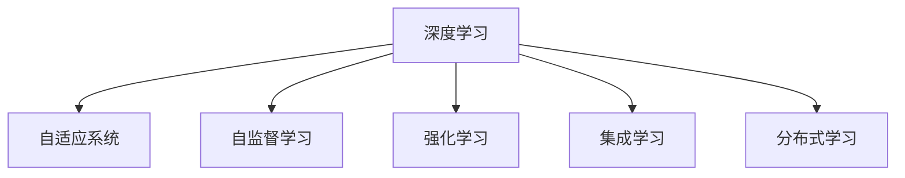

                 

# 软件 2.0 的发展趋势：深度学习、强化学习

> 关键词：软件 2.0, 深度学习, 强化学习, 自适应系统, 自监督学习, 集成学习, 分布式学习

## 1. 背景介绍

### 1.1 问题由来
软件行业正处于历史性的变革之中。随着大数据、云计算和人工智能技术的快速发展，传统软件系统正逐步向智能化、自动化、自适应方向转型。这种转型带来了全新的设计思路和技术框架，与以往的软件开发和运维模式相比，具有更高的灵活性、弹性和智能化水平。

在这一背景下，软件 2.0 的概念应运而生。软件 2.0 强调利用先进技术构建自适应、自学习、自优化的软件系统，能够实时响应用户需求，自动调整和优化系统性能，提升用户体验。这一转变不仅关乎技术演进，更关乎企业运营效率、市场竞争力的提升。

在这一过程中，深度学习和强化学习（Deep Learning, Reinforcement Learning, RL）成为两大关键技术，为软件系统的智能、自适应化提供了强有力的支持。本文将重点探讨这两大技术在软件 2.0 发展趋势中的作用和应用。

## 2. 核心概念与联系

### 2.1 核心概念概述

为更好地理解深度学习和强化学习在软件 2.0 中的作用，本节将介绍几个密切相关的核心概念：

- 深度学习（Deep Learning, DL）：一种基于多层神经网络的技术，通过多层次特征提取和组合，构建高维度的抽象表示，实现对复杂数据的有效学习和处理。
- 强化学习（Reinforcement Learning, RL）：一种通过与环境交互，优化智能体决策和行为的学习方法，目标是使智能体在特定环境中最大化累积回报。
- 自适应系统（Adaptive System）：一种能够根据环境变化自动调整其行为和参数，以优化性能和资源利用率的系统。
- 自监督学习（Self-Supervised Learning, SSL）：一种无需标注数据即可自动学习模型表示的技术，通过数据本身的特征或结构进行学习，提高模型的泛化能力。
- 集成学习（Ensemble Learning, EL）：一种将多个模型组合起来，通过投票或加权平均等方式，提升模型预测性能的技术。
- 分布式学习（Distributed Learning, DL）：一种通过多个计算节点并行学习，提高训练效率和模型鲁棒性的技术。

这些核心概念之间的逻辑关系可以通过以下Mermaid流程图来展示：



这个流程图展示了大语言模型的核心概念及其之间的关系：

1. 深度学习为自适应系统提供了强大的特征提取和表示能力。
2. 自监督学习可以在无需标注数据的情况下，提取数据中的有用信息，提升模型的泛化能力。
3. 强化学习通过与环境的交互，优化系统行为，提升性能和适应性。
4. 集成学习通过组合多个模型的预测结果，进一步提高系统的准确性和鲁棒性。
5. 分布式学习通过并行计算，提高训练效率和模型性能。

## 3. 核心算法原理 & 具体操作步骤

### 3.1 算法原理概述

深度学习和强化学习在软件 2.0 中的应用，本质上是通过构建智能模型和优化决策策略，使软件系统能够自适应环境变化，优化性能和资源利用。

深度学习在软件 2.0 中的应用主要体现在以下几个方面：

1. **特征提取**：通过多层神经网络构建高维度特征表示，实现对复杂数据的学习和处理。例如，在自动代码生成、代码修复等领域，可以利用深度学习提取代码片段中的语义信息，生成更符合用户需求的代码。
2. **智能预测**：利用深度学习模型对用户行为进行预测，例如在推荐系统、智能客服等领域，通过预测用户兴趣和需求，提供个性化服务。
3. **自监督学习**：在缺少标注数据的情况下，利用深度学习模型自监督地学习数据特征，提升模型的泛化能力。例如，在垃圾邮件过滤、文本分类等领域，通过自监督学习方法训练模型，提升分类准确率。

强化学习在软件 2.0 中的应用主要体现在以下几个方面：

1. **行为优化**：通过与环境的交互，强化学习算法能够优化智能体的行为策略，例如在智能推荐系统、自动驾驶等领域，通过强化学习算法调整推荐策略，优化路径规划。
2. **系统优化**：强化学习算法能够在多目标任务中平衡性能和资源利用，例如在资源调度、负载均衡等领域，通过强化学习算法优化资源分配，提升系统效率。
3. **自适应控制**：通过强化学习算法，系统能够实时调整自身参数和行为，以适应环境变化，例如在自动控制、自适应路由等领域，通过强化学习算法实现自适应控制。

### 3.2 算法步骤详解

#### 深度学习在软件 2.0 中的应用步骤：

1. **数据收集与预处理**：收集与目标任务相关的数据集，并进行数据清洗、归一化等预处理操作。
2. **模型构建与训练**：选择适合的深度学习模型（如卷积神经网络、循环神经网络等），构建训练流程，进行模型训练。
3. **特征提取与处理**：通过深度学习模型提取数据特征，并进行归一化、降维等处理，提升模型性能。
4. **模型评估与优化**：使用测试数据集评估模型性能，根据评估结果调整模型参数，优化模型性能。
5. **应用部署与优化**：将优化后的模型部署到实际应用中，并根据实际使用情况进行微调，提升模型鲁棒性和适应性。

#### 强化学习在软件 2.0 中的应用步骤：

1. **环境设计**：定义软件系统的目标和奖励机制，构建与环境交互的界面。
2. **智能体设计**：选择适合的强化学习算法（如Q-learning、Deep Q-learning等），构建智能体行为策略。
3. **交互训练**：通过与环境的交互，训练智能体行为策略，优化决策和行为。
4. **行为评估与优化**：评估智能体行为策略的效果，根据评估结果调整智能体行为，优化系统性能。
5. **应用部署与优化**：将优化后的智能体行为策略部署到实际应用中，并根据实际使用情况进行微调，提升系统鲁棒性和适应性。

### 3.3 算法优缺点

深度学习和强化学习在软件 2.0 中的应用，具有以下优点：

- **处理复杂性高**：深度学习和强化学习能够处理高维、非线性的复杂数据和任务，提升系统的智能化水平。
- **自适应能力强**：通过深度学习和强化学习，系统能够自适应环境变化，优化性能和资源利用。
- **实时响应**：深度学习和强化学习模型能够实时处理和响应用户需求，提升用户体验。
- **数据依赖少**：自监督学习方法可以在无需标注数据的情况下，提取数据中的有用信息，降低数据获取和标注成本。

同时，这些方法也存在一些局限性：

- **计算资源需求高**：深度学习和强化学习模型往往需要较大的计算资源和存储空间，训练和推理过程复杂。
- **可解释性差**：深度学习和强化学习模型通常被认为是"黑盒"模型，难以解释其内部工作机制和决策过程。
- **模型泛化能力有限**：深度学习和强化学习模型在特定任务上表现良好，但泛化能力有限，面对新数据和新任务可能出现性能下降。
- **训练过程复杂**：深度学习和强化学习模型的训练过程复杂，需要大量的实验和调参工作。

尽管存在这些局限性，但就目前而言，深度学习和强化学习依然是软件 2.0 中最为主流的方法，能够显著提升系统的智能化和自适应能力。

### 3.4 算法应用领域

深度学习和强化学习在软件 2.0 中的应用非常广泛，涵盖了多个领域，例如：

1. **自动代码生成与修复**：利用深度学习模型对代码片段进行语义分析，生成符合用户需求的新代码。例如，GitHub Copilot 利用深度学习模型自动生成代码片段，提升编程效率。
2. **智能推荐系统**：通过深度学习模型预测用户兴趣和需求，提供个性化推荐服务。例如，Amazon、Netflix 等电商和视频平台利用深度学习模型实现商品和内容的推荐。
3. **智能客服**：利用深度学习模型理解用户意图，提供智能客服支持。例如，IBM Watson 利用深度学习模型构建智能客服系统，提升用户体验。
4. **自动驾驶**：利用强化学习算法优化车辆行为和路径规划，实现自动驾驶功能。例如，Waymo 和 Tesla 利用强化学习算法训练自动驾驶系统。
5. **资源调度与负载均衡**：利用深度学习和强化学习算法优化资源分配，提升系统效率。例如，Kubernetes 利用深度学习算法优化容器调度，提升云资源利用率。
6. **自适应路由**：利用深度学习和强化学习算法优化网络路由，提升网络性能和稳定性。例如，Baidu AI Network 利用深度学习算法优化网络路由，提升网络服务质量。

除了上述这些经典应用外，深度学习和强化学习还被创新性地应用到更多场景中，如生成对抗网络（GAN）、自然语言处理（NLP）、计算机视觉等领域，为软件 2.0 技术带来了全新的突破。随着深度学习和强化学习技术的不断演进，相信软件 2.0 技术将在更多领域实现突破，深刻影响人类的生产生活方式。

## 4. 数学模型和公式 & 详细讲解  
### 4.1 数学模型构建

本节将使用数学语言对深度学习和强化学习在软件 2.0 中的应用进行更加严格的刻画。

#### 深度学习在软件 2.0 中的应用

假设深度学习模型为 $f(x; \theta)$，其中 $x$ 为输入数据，$\theta$ 为模型参数。假设训练集为 $D=\{(x_i, y_i)\}_{i=1}^N$，其中 $y_i$ 为标签。深度学习模型的目标是构建一个能够准确预测标签的模型 $f(x; \theta)$。

定义模型 $f(x; \theta)$ 在数据样本 $(x,y)$ 上的损失函数为 $\ell(f(x; \theta), y)$，则在数据集 $D$ 上的经验风险为：

$$
\mathcal{L}(\theta) = \frac{1}{N}\sum_{i=1}^N \ell(f(x_i; \theta), y_i)
$$

深度学习模型的训练目标是：

$$
\theta^* = \mathop{\arg\min}_{\theta} \mathcal{L}(\theta)
$$

通过梯度下降等优化算法，深度学习模型不断更新参数 $\theta$，最小化损失函数 $\mathcal{L}$，使得模型预测输出逼近真实标签。

#### 强化学习在软件 2.0 中的应用

假设强化学习环境为 $E = \{s, a, r, p\}$，其中 $s$ 为状态，$a$ 为动作，$r$ 为奖励，$p$ 为状态转移概率。智能体在环境 $E$ 中执行动作 $a$，获得奖励 $r$ 和下一状态 $s'$，根据奖励和状态转移概率更新智能体策略 $\pi(a|s)$。

定义智能体在状态 $s$ 下执行动作 $a$ 的累计回报为 $G_t = \sum_{k=0}^{\infty} \gamma^k r_{t+k}$，其中 $\gamma$ 为折扣因子。强化学习算法的目标是最大化智能体在环境 $E$ 中的累计回报 $G_t$。

强化学习算法的训练目标是：

$$
\theta^* = \mathop{\arg\min}_{\theta} \mathbb{E}_{s_t \sim \mathcal{S}, a_t \sim \pi_{\theta}(\cdot|s_t), s_{t+1} \sim p(\cdot|s_t, a_t)} \left[ G_t - V_{\theta}(s_t) \right]
$$

其中 $V_{\theta}(s_t)$ 为状态值函数，表示在状态 $s_t$ 下智能体的期望累计回报。

通过强化学习算法，智能体能够实时调整策略，优化决策和行为，适应环境变化。

### 4.2 公式推导过程

#### 深度学习在软件 2.0 中的应用

以多层感知机（MLP）为例，推导交叉熵损失函数及其梯度的计算公式。

假设模型 $f(x; \theta)$ 在输入 $x$ 上的输出为 $\hat{y}=f(x; \theta)$，表示样本属于正类的概率。真实标签 $y \in \{0,1\}$。则二分类交叉熵损失函数定义为：

$$
\ell(f(x; \theta), y) = -[y\log \hat{y} + (1-y)\log (1-\hat{y})]
$$

将其代入经验风险公式，得：

$$
\mathcal{L}(\theta) = -\frac{1}{N}\sum_{i=1}^N [y_i\log f(x_i; \theta)+(1-y_i)\log(1-f(x_i; \theta))]
$$

根据链式法则，损失函数对参数 $\theta_k$ 的梯度为：

$$
\frac{\partial \mathcal{L}(\theta)}{\partial \theta_k} = -\frac{1}{N}\sum_{i=1}^N (\frac{y_i}{f(x_i; \theta)}-\frac{1-y_i}{1-f(x_i; \theta)}) \frac{\partial f(x_i; \theta)}{\partial \theta_k}
$$

其中 $\frac{\partial f(x_i; \theta)}{\partial \theta_k}$ 可进一步递归展开，利用自动微分技术完成计算。

#### 强化学习在软件 2.0 中的应用

以Q-learning为例，推导Q值函数的更新公式。

假设智能体在状态 $s_t$ 下执行动作 $a_t$，获得奖励 $r_t$ 和下一状态 $s_{t+1}$，智能体在状态 $s$ 下执行动作 $a$ 的累计回报为 $G_t = \sum_{k=0}^{\infty} \gamma^k r_{t+k}$。假设智能体的状态值函数为 $V_{\theta}(s)$，则Q值函数定义为：

$$
Q_{\theta}(s_t, a_t) = r_t + \gamma V_{\theta}(s_{t+1})
$$

在强化学习中，智能体通过与环境的交互，不断更新Q值函数，优化策略。具体地，智能体根据当前状态 $s_t$ 和动作 $a_t$，计算Q值 $Q_{\theta}(s_t, a_t)$，与当前策略 $\pi_{\theta}(a|s_t)$ 的乘积，作为更新目标。智能体的策略更新目标为：

$$
\pi_{\theta}(a|s) = \arg\max_a Q_{\theta}(s, a)
$$

在强化学习算法中，Q值函数的更新公式为：

$$
Q_{\theta}(s_t, a_t) \leftarrow Q_{\theta}(s_t, a_t) + \alpha(r_t + \gamma V_{\theta}(s_{t+1}) - Q_{\theta}(s_t, a_t))
$$

其中 $\alpha$ 为学习率，控制每次更新的步长。

### 4.3 案例分析与讲解

#### 深度学习在自动代码生成中的应用

自动代码生成是软件 2.0 中的典型应用之一。利用深度学习模型，可以从给定的文本描述中生成符合用户需求的新代码。例如，GitHub Copilot 利用深度学习模型对代码片段进行语义分析，生成符合用户需求的新代码。

具体实现流程如下：

1. **数据收集与预处理**：收集与目标任务相关的代码片段和对应的文本描述，并进行数据清洗、归一化等预处理操作。
2. **模型构建与训练**：选择适合的深度学习模型（如Transformer、LSTM等），构建训练流程，进行模型训练。
3. **特征提取与处理**：通过深度学习模型提取代码片段中的语义信息，并进行归一化、降维等处理，提升模型性能。
4. **模型评估与优化**：使用测试数据集评估模型性能，根据评估结果调整模型参数，优化模型性能。
5. **应用部署与优化**：将优化后的模型部署到实际应用中，并根据实际使用情况进行微调，提升模型鲁棒性和适应性。

#### 强化学习在自动驾驶中的应用

自动驾驶是另一个典型的软件 2.0 应用。利用强化学习算法，可以从大量交通场景中学习最优的驾驶策略，实现自动驾驶功能。例如，Waymo 和 Tesla 利用强化学习算法训练自动驾驶系统。

具体实现流程如下：

1. **环境设计**：定义自动驾驶系统的目标和奖励机制，构建与环境交互的界面。
2. **智能体设计**：选择适合的强化学习算法（如Deep Q-learning等），构建智能体行为策略。
3. **交互训练**：通过与环境的交互，训练智能体行为策略，优化决策和行为。
4. **行为评估与优化**：评估智能体行为策略的效果，根据评估结果调整智能体行为，优化系统性能。
5. **应用部署与优化**：将优化后的智能体行为策略部署到实际应用中，并根据实际使用情况进行微调，提升系统鲁棒性和适应性。

## 5. 项目实践：代码实例和详细解释说明

### 5.1 开发环境搭建

在进行深度学习和强化学习实践前，我们需要准备好开发环境。以下是使用Python进行PyTorch和TensorFlow开发的环境配置流程：

1. 安装Anaconda：从官网下载并安装Anaconda，用于创建独立的Python环境。

2. 创建并激活虚拟环境：
```bash
conda create -n pytorch-env python=3.8 
conda activate pytorch-env
```

3. 安装PyTorch：根据CUDA版本，从官网获取对应的安装命令。例如：
```bash
conda install pytorch torchvision torchaudio cudatoolkit=11.1 -c pytorch -c conda-forge
```

4. 安装TensorFlow：
```bash
pip install tensorflow==2.6
```

5. 安装各类工具包：
```bash
pip install numpy pandas scikit-learn matplotlib tqdm jupyter notebook ipython
```

完成上述步骤后，即可在`pytorch-env`环境中开始深度学习和强化学习实践。

### 5.2 源代码详细实现

这里我们以强化学习在自动驾驶中的应用为例，给出使用TensorFlow进行强化学习算法的PyTorch代码实现。

具体实现步骤如下：

1. **环境定义**：定义自动驾驶环境，包括状态、动作和奖励。
```python
import tensorflow as tf
import gym

class AutoDriveEnv(gym.Env):
    def __init__(self):
        self.state = 0
        self.reward = 0
        self.done = False
        self.terminal_state = 10

    def step(self, action):
        if action == 1:
            self.state += 1
            self.reward = 0.1
        elif action == 0:
            self.state -= 1
            self.reward = -0.1
        else:
            self.state = self.terminal_state
            self.reward = -1
        self.done = self.state == self.terminal_state
        return self.state, self.reward, self.done, {}

    def reset(self):
        self.state = 0
        self.reward = 0
        self.done = False
        return self.state, {}
```

2. **智能体定义**：定义强化学习算法，例如Q-learning。
```python
import tensorflow as tf
import gym

class QLearningAgent:
    def __init__(self, learning_rate=0.1):
        self.learning_rate = learning_rate
        self.q_table = {}

    def q_value(self, state, action):
        if (state, action) in self.q_table:
            return self.q_table[(state, action)]
        else:
            return 0

    def update_q_table(self, state, action, reward, next_state, done):
        q_new = reward + self.learning_rate * self.q_value(next_state, self.choose_action(next_state))
        q_old = self.q_value(state, action)
        self.q_table[(state, action)] = q_new

    def choose_action(self, state):
        actions = [1, 0]
        return actions[np.argmax(self.q_value(state, actions))]
```

3. **训练与评估**：定义训练和评估函数，对智能体进行训练和评估。
```python
import numpy as np

def train_agent(agent, env, num_episodes):
    for episode in range(num_episodes):
        state = env.reset()
        total_reward = 0
        done = False
        while not done:
            action = agent.choose_action(state)
            state, reward, done, _ = env.step(action)
            total_reward += reward
            agent.update_q_table(state, action, reward, state, done)
        print(f"Episode {episode+1}, Total Reward: {total_reward}")

def evaluate_agent(agent, env, num_episodes):
    rewards = []
    for episode in range(num_episodes):
        state = env.reset()
        total_reward = 0
        done = False
        while not done:
            action = agent.choose_action(state)
            state, reward, done, _ = env.step(action)
            total_reward += reward
        rewards.append(total_reward)
    print(f"Episode Average Reward: {np.mean(rewards)}")
```

4. **启动训练流程**：
```python
env = AutoDriveEnv()
agent = QLearningAgent()
train_agent(agent, env, 1000)
evaluate_agent(agent, env, 10)
```

### 5.3 代码解读与分析

下面我们详细解读一下关键代码的实现细节：

**AutoDriveEnv类**：
- `__init__`方法：初始化环境状态、奖励、是否结束标志等关键参数。
- `step`方法：根据动作和状态更新环境状态、奖励和是否结束标志，返回更新后的状态和奖励。
- `reset`方法：重置环境状态、奖励、是否结束标志，返回初始状态。

**QLearningAgent类**：
- `__init__`方法：初始化学习率、Q值表等关键参数。
- `q_value`方法：根据状态和动作查询Q值，返回对应的Q值。
- `update_q_table`方法：根据状态、动作、奖励、下一个状态和是否结束标志，更新Q值表。
- `choose_action`方法：根据当前状态，选择最优动作。

**训练与评估函数**：
- `train_agent`函数：对智能体进行训练，在每集结束时输出总奖励。
- `evaluate_agent`函数：对智能体进行评估，计算平均奖励。

**启动训练流程**：
- 创建环境实例，初始化智能体。
- 调用训练函数和评估函数，训练和评估智能体。

可以看到，TensorFlow配合深度学习和强化学习库，使得智能体训练的代码实现变得简洁高效。开发者可以将更多精力放在模型改进和超参数调优等高层逻辑上，而不必过多关注底层的实现细节。

当然，工业级的系统实现还需考虑更多因素，如模型的保存和部署、超参数的自动搜索、更灵活的环境设计等。但核心的深度学习和强化学习算法基本与此类似。

## 6. 实际应用场景

### 6.1 智能推荐系统

深度学习和强化学习在智能推荐系统中的应用非常广泛。利用深度学习模型，可以预测用户兴趣和行为，推荐符合用户需求的内容。利用强化学习算法，可以实时调整推荐策略，提升推荐效果和用户满意度。

在实际应用中，可以收集用户历史行为数据，包括浏览记录、点击记录、评分记录等，作为训练数据。利用深度学习模型提取数据特征，建立用户兴趣模型。利用强化学习算法调整推荐策略，优化推荐效果。

具体实现流程如下：

1. **数据收集与预处理**：收集与目标任务相关的用户行为数据，并进行数据清洗、归一化等预处理操作。
2. **模型构建与训练**：选择适合的深度学习模型（如MLP、CNN、RNN等），构建训练流程，进行模型训练。
3. **特征提取与处理**：通过深度学习模型提取用户行为数据中的特征，并进行归一化、降维等处理，提升模型性能。
4. **模型评估与优化**：使用测试数据集评估模型性能，根据评估结果调整模型参数，优化模型性能。
5. **应用部署与优化**：将优化后的模型部署到实际应用中，并根据实际使用情况进行微调，提升模型鲁棒性和适应性。

### 6.2 智能客服

智能客服是深度学习和强化学习在软件 2.0 中的另一个典型应用。利用深度学习模型，可以理解用户意图，提取关键信息。利用强化学习算法，可以实时调整智能客服策略，提升用户体验。

在实际应用中，可以收集与目标任务相关的对话数据，作为训练数据。利用深度学习模型提取对话数据中的特征，建立用户意图模型。利用强化学习算法调整智能客服策略，优化对话效果。

具体实现流程如下：

1. **数据收集与预处理**：收集与目标任务相关的对话数据，并进行数据清洗、归一化等预处理操作。
2. **模型构建与训练**：选择适合的深度学习模型（如LSTM、Transformer等），构建训练流程，进行模型训练。
3. **特征提取与处理**：通过深度学习模型提取对话数据中的特征，并进行归一化、降维等处理，提升模型性能。
4. **模型评估与优化**：使用测试数据集评估模型性能，根据评估结果调整模型参数，优化模型性能。
5. **应用部署与优化**：将优化后的模型部署到实际应用中，并根据实际使用情况进行微调，提升模型鲁棒性和适应性。

### 6.3 自动驾驶

自动驾驶是深度学习和强化学习在软件 2.0 中的另一个重要应用。利用深度学习模型，可以从大量交通场景中学习最优的驾驶策略。利用强化学习算法，可以实时调整驾驶策略，优化驾驶效果。

在实际应用中，可以收集与目标任务相关的交通场景数据，作为训练数据。利用深度学习模型提取场景数据中的特征，建立驾驶策略模型。利用强化学习算法调整驾驶策略，优化驾驶效果。

具体实现流程如下：

1. **数据收集与预处理**：收集与目标任务相关的交通场景数据，并进行数据清洗、归一化等预处理操作。
2. **模型构建与训练**：选择适合的深度学习模型（如CNN、RNN、Transformer等），构建训练流程，进行模型训练。
3. **特征提取与处理**：通过深度学习模型提取场景数据中的特征，并进行归一化、降维等处理，提升模型性能。
4. **模型评估与优化**：使用测试数据集评估模型性能，根据评估结果调整模型参数，优化模型性能。
5. **应用部署与优化**：将优化后的模型部署到实际应用中，并根据实际使用情况进行微调，提升模型鲁棒性和适应性。

## 7. 工具和资源推荐

### 7.1 学习资源推荐

为了帮助开发者系统掌握深度学习和强化学习在软件 2.0 中的应用，这里推荐一些优质的学习资源：

1. 《深度学习》系列书籍：Ian Goodfellow、Yoshua Bengio、Aaron Courville 所著，系统介绍了深度学习的理论基础和实践技术。
2. 《强化学习》系列书籍：Richard S. Sutton、Andrew G. Barto 所著，介绍了强化学习的原理、算法和应用。
3. CS231n《深度学习视觉特征》课程：斯坦福大学开设的深度学习课程，涵盖了视觉特征提取、图像分类、目标检测等前沿话题。
4. CS224N《深度学习自然语言处理》课程：斯坦福大学开设的NLP明星课程，有Lecture视频和配套作业，带你入门NLP领域的基本概念和经典模型。
5. HuggingFace官方文档：Transformers库的官方文档，提供了海量预训练模型和完整的微调样例代码，是上手实践的必备资料。

通过对这些资源的学习实践，相信你一定能够快速掌握深度学习和强化学习在软件 2.0 中的应用，并用于解决实际的NLP问题。

### 7.2 开发工具推荐

高效的开发离不开优秀的工具支持。以下是几款用于深度学习和强化学习开发常用的工具：

1. PyTorch：基于Python的开源深度学习框架，灵活动态的计算图，适合快速迭代研究。大部分预训练语言模型都有PyTorch版本的实现。
2. TensorFlow：由Google主导开发的开源深度学习框架，生产部署方便，适合大规模工程应用。同样有丰富的预训练语言模型资源。
3. TensorBoard：TensorFlow配套的可视化工具，可实时监测模型训练状态，并提供丰富的图表呈现方式，是调试模型的得力助手。
4. Weights & Biases：模型训练的实验跟踪工具，可以记录和可视化模型训练过程中的各项指标，方便对比和调优。与主流深度学习框架无缝集成。
5. Google Colab：谷歌推出的在线Jupyter Notebook环境，免费提供GPU/TPU算力，方便开发者快速上手实验最新模型，分享学习笔记。

合理利用这些工具，可以显著提升深度学习和强化学习开发效率，加快创新迭代的步伐。

### 7.3 相关论文推荐

深度学习和强化学习在软件 2.0 中的应用源于学界的持续研究。以下是几篇奠基性的相关论文，推荐阅读：

1. ImageNet Classification with Deep Convolutional Neural Networks：Alex Krizhevsky、Ilya Sutskever、Geoffrey Hinton 所著，展示了深度学习在图像分类任务上的强大能力。
2. LeNet-5：Yann LeCun 所著，展示了卷积神经网络在手写数字识别任务上的优秀表现。
3. AlphaGo Zero：David Silver 所著，展示了强化学习在智能博弈领域的突破性进展。
4. DeepMind AlphaStar：Nathaniel Press 所著，展示了强化学习在智能游戏领域的突破性进展。
5. GANs Trained by a Two-Time-Scale Update Rule Converge to the Fixed Points of Their Limiting Dynamics：NIPS 2014, Ian Goodfellow 所著，展示了生成对抗网络在图像生成任务上的突破性进展。

这些论文代表了大语言模型微调技术的发展脉络。通过学习这些前沿成果，可以帮助研究者把握学科前进方向，激发更多的创新灵感。

## 8. 总结：未来发展趋势与挑战

### 8.1 总结

本文对深度学习和强化学习在软件 2.0 中的应用进行了全面系统的介绍。首先阐述了深度学习和强化学习在软件 2.0 中的重要作用，明确了其在自适应、自学习、自优化方面的独特价值。其次，从原理到实践，详细讲解了深度学习和强化学习的数学原理和关键步骤，给出了具体的应用场景和代码实现。同时，本文还探讨了深度学习和强化学习在智能推荐系统、智能客服、自动驾驶等多个领域的应用前景，展示了其在软件 2.0 中的广阔应用空间。此外，本文精选了深度学习和强化学习的各类学习资源，力求为读者提供全方位的技术指引。

通过本文的系统梳理，可以看到，深度学习和强化学习在软件 2.0 中的应用，不仅提升了系统的智能化和自适应能力，还在实际部署和优化过程中发挥了重要作用。未来，随着深度学习和强化学习技术的不断发展，软件 2.0 技术将在更多领域实现突破，深刻影响人类的生产生活方式。

### 8.2 未来发展趋势

展望未来，深度学习和强化学习在软件 2.0 中的应用将呈现以下几个发展趋势：

1. **深度学习模型更大**：随着算力成本的下降和数据规模的扩张，深度学习模型的参数量还将持续增长。超大规模深度学习模型蕴含的丰富特征提取能力，将进一步提升系统的智能化水平。
2. **强化学习策略更优**：通过深度学习模型和强化学习算法的融合，能够优化智能体的决策策略，提高系统的行为适应性。未来，更多先进的强化学习算法将被引入，提升系统性能。
3. **自监督学习更加普及**：自监督学习方法能够在无需标注数据的情况下，提取数据中的有用信息，提升模型的泛化能力。未来，自监督学习将更加普及，降低数据获取和标注成本。
4. **分布式学习更加高效**：分布式学习通过多个计算节点并行学习，提高训练效率和模型鲁棒性。未来，分布式学习技术将更加成熟，支持更大规模、更高效的训练。
5. **多模态学习更加深入**：深度学习和强化学习模型可以处理高维、非线性的复杂数据，未来将探索更多多模态数据的整合，提升系统的智能化水平。
6. **自适应学习更加智能**：自适应学习能够实时响应用户需求，优化系统性能。未来，自适应学习将结合更多前沿技术，实现更加智能的系统优化。

以上趋势凸显了深度学习和强化学习在软件 2.0 中的应用前景。这些方向的探索发展，必将进一步提升系统的智能化和自适应能力，为构建更加智能、自适应的软件系统奠定基础。

### 8.3 面临的挑战

尽管深度学习和强化学习在软件 2.0 中的应用已经取得了显著进展，但在迈向更加智能化、普适化应用的过程中，仍面临诸多挑战：

1. **计算资源需求高**：深度学习和强化学习模型往往需要较大的计算资源和存储空间，训练和推理过程复杂。如何在有限的计算资源下优化模型性能，仍是一大难题。
2. **模型泛化能力有限**：深度学习和强化学习模型在特定任务上表现良好，但泛化能力有限，面对新数据和新任务可能出现性能下降。如何提升模型的泛化能力，仍是研究重点。
3. **模型可解释性差**：深度学习和强化学习模型通常被认为是"黑盒"模型，难以解释其内部工作机制和决策过程。如何提升模型的可解释性，保障系统透明性，仍需更多探索。
4. **训练过程复杂**：深度学习和强化学习模型的训练过程复杂，需要大量的实验和调参工作。如何在自动化的框架下优化模型训练，仍是一大难题。
5. **系统鲁棒性不足**：深度学习和强化学习模型在面对复杂环境变化时，鲁棒性不足，容易出现不稳定的情况。如何提高模型的鲁棒性，仍需更多研究。

尽管存在这些挑战，但随着技术的不断演进和研究的深入，深度学习和强化学习在软件 2.0 中的应用将更加广泛和深入。相信随着学界和产业界的共同努力，这些挑战终将一一被克服，深度学习和强化学习将在构建智能软件系统中发挥越来越重要的作用。

### 8.4 研究展望

面向未来，深度学习和强化学习在软件 2.0 中的研究需要在以下几个方向进行更多探索：

1. **融合更多前沿技术**：深度学习和强化学习可以与其他前沿技术如知识图谱、因果推理、强化学习等结合，实现更加全面、准确的系统建模。
2. **结合伦理道德约束**：在深度学习和强化学习模型的训练目标中引入伦理导向的评估指标，过滤和惩罚有害的输出倾向，保障模型的安全性。
3. **探索更多应用场景**：深度学习和强化学习在软件 2.0 中的应用场景非常广泛，未来需进一步探索更多应用场景，推动技术应用落地。
4. **优化系统部署和调优**：深度学习和强化学习模型在实际部署和调优过程中，仍需更多研究和优化，提升系统的性能和稳定性。
5. **结合云计算和大数据**：深度学习和强化学习模型的训练和推理过程需要大量的数据和计算资源，未来需结合云计算和大数据技术，实现更大规模、更高效的应用。

这些研究方向的探索，必将引领深度学习和强化学习在软件 2.0 中的应用走向新的高度，为构建智能、自适应的软件系统提供更多创新思路和解决方案。

## 9. 附录：常见问题与解答

**Q1：深度学习和强化学习在软件 2.0 中的应用是否相互独立？**

A: 深度学习和强化学习在软件 2.0 中的应用不是相互独立的，它们可以相互结合，发挥协同作用。深度学习模型可以提取数据特征，建立高维度的表示，强化学习算法可以优化决策策略，提升系统性能。通过深度学习和强化学习的结合，可以实现更加智能、自适应的软件系统。

**Q2：深度学习和强化学习在软件 2.0 中的应用需要哪些计算资源？**

A: 深度学习和强化学习在软件 2.0 中的应用需要较大的计算资源和存储空间。深度学习模型和强化学习算法需要大量的数据和计算资源进行训练和推理。因此，需要在高性能计算设备上实现，如GPU、TPU等。同时，为了提高训练效率和模型鲁棒性，还需要采用分布式学习、自监督学习等技术。

**Q3：深度学习和强化学习在软件 2.0 中的应用是否存在可解释性问题？**

A: 深度学习和强化学习模型通常被认为是"黑盒"模型，难以解释其内部工作机制和决策过程。然而，通过深度可解释性技术和强化学习策略，可以提升模型的可解释性。例如，可以使用可解释性技术（如LIME、SHAP等）对深度学习模型进行解释，使用强化学习策略对模型决策过程进行可视化。

**Q4：深度学习和强化学习在软件 2.0 中的应用如何优化系统性能？**

A: 深度学习和强化学习在软件 2.0 中的应用可以通过优化模型参数、改进训练算法和调整超参数等方法，提升系统性能。例如，可以使用自适应学习率、数据增强、模型压缩等技术，提高模型泛化能力和计算效率。同时，还可以通过分布式学习、自监督学习等技术，优化训练过程和模型性能。

**Q5：深度学习和强化学习在软件 2.0 中的应用如何结合其他技术？**

A: 深度学习和强化学习在软件 2.0 中的应用可以与其他前沿技术结合，实现更加全面、准确的系统建模。例如，可以将深度学习模型与自然语言处理（NLP）、知识图谱（KG）等技术结合，提升系统的智能化水平。同时，可以将强化学习算法与因果推理、强化学习等结合，优化系统决策策略，提升系统性能。

综上所述，深度学习和强化学习在软件 2.0 中的应用具有广阔的前景，但仍然面临一些挑战和问题。通过不断优化模型参数、改进训练算法和结合其他前沿技术，深度学习和强化学习在软件 2.0 中的应用将更加广泛和深入，推动智能软件系统的不断发展。

