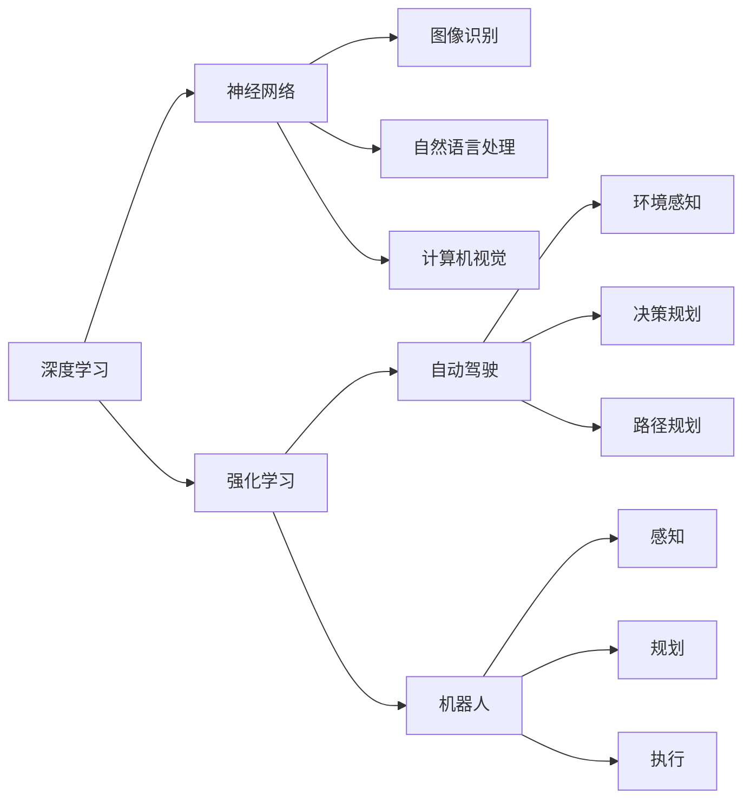

                 

# 软件 2.0 的发展趋势：深度学习、强化学习

> 关键词：深度学习,强化学习,自动驾驶,自然语言处理,计算机视觉,机器人

## 1. 背景介绍

在21世纪科技发展日新月异的大背景下，软件行业发生了翻天覆地的变化。传统软件开发逐渐被各种新技术所替代，传统的软件开发模式、方法论和工具也正在不断更新迭代。这一趋势被称为软件 2.0 的发展。其中，深度学习和强化学习成为了推动软件 2.0 发展的核心技术。

深度学习是机器学习的一个分支，它利用神经网络模型模拟人脑的神经系统，通过大量数据进行训练，从而实现复杂的任务。而强化学习则是一种基于奖励的机器学习，通过不断试错，使模型在特定环境中获得最佳决策。本文将详细探讨深度学习和强化学习在软件 2.0 发展中的作用，并分析其发展趋势和未来前景。

## 2. 核心概念与联系

### 2.1 核心概念概述

- **深度学习**：一种机器学习方法，通过多层神经网络对复杂数据进行建模和预测，广泛应用于图像识别、自然语言处理、语音识别等领域。
- **强化学习**：通过智能体在环境中不断试错，获得最优策略的方法，广泛应用于自动驾驶、机器人控制、游戏策略优化等。
- **自动驾驶**：使用深度学习和强化学习实现车辆自主导航和决策，提升驾驶安全性和效率。
- **自然语言处理**：通过深度学习模型对自然语言进行理解和生成，包括文本分类、机器翻译、情感分析等。
- **计算机视觉**：利用深度学习模型对图像和视频数据进行分析和处理，广泛应用于安防、医疗、智能家居等。
- **机器人**：结合深度学习和强化学习，使机器人能够感知环境、规划路径、执行任务，广泛应用于工业、农业、服务业等领域。

### 2.2 核心概念原理和架构的 Mermaid 流程图



该流程图展示了深度学习和强化学习在不同应用场景中的核心功能和架构。

## 3. 核心算法原理 & 具体操作步骤

### 3.1 算法原理概述

深度学习模型通过多层神经网络对数据进行非线性拟合，从而实现复杂的模式识别和预测。常用的深度学习模型包括卷积神经网络(CNN)、循环神经网络(RNN)、长短期记忆网络(LSTM)等。

强化学习通过智能体在环境中不断试错，逐步优化决策策略。强化学习模型通常由环境、智能体、状态、动作、奖励函数组成。智能体根据当前状态，通过策略选择动作，在环境中与环境交互，获得奖励，并根据奖励调整策略。常用的强化学习算法包括Q-learning、Deep Q-learning、Policy Gradient等。

### 3.2 算法步骤详解

#### 3.2.1 深度学习模型训练步骤

1. **数据准备**：收集并准备训练数据，包括输入数据和目标数据。
2. **模型设计**：选择合适的神经网络模型，确定网络结构、层数、节点数等。
3. **模型训练**：将数据输入模型，通过反向传播算法计算损失函数，更新模型参数。
4. **模型验证**：在验证集上评估模型性能，防止过拟合。
5. **模型测试**：在测试集上评估模型泛化能力，最终输出模型。

#### 3.2.2 强化学习模型训练步骤

1. **环境设计**：定义智能体在环境中互动的规则和状态空间。
2. **智能体设计**：定义智能体的状态表示、动作策略和奖励函数。
3. **模型训练**：在环境中进行多次试错，根据奖励调整策略。
4. **策略评估**：通过各种评估指标，如成功率、探索率等，评估模型性能。
5. **策略优化**：根据评估结果，优化策略，继续训练模型。

### 3.3 算法优缺点

#### 3.3.1 深度学习模型优缺点

**优点**：
- 能够处理大规模复杂数据，具有很强的表达能力。
- 训练效果较好，可以处理非线性、高维数据。
- 应用于计算机视觉、自然语言处理等领域，取得了许多突破性成果。

**缺点**：
- 需要大量标注数据进行训练，标注成本较高。
- 模型复杂度较高，训练时间较长。
- 模型容易出现过拟合现象，泛化能力有待提高。

#### 3.3.2 强化学习模型优缺点

**优点**：
- 适用于需要连续决策的复杂环境，具有较高的灵活性。
- 能够处理实时环境中的不确定性，具有较好的适应性。
- 通过不断试错，能够逐步优化策略，提高决策效果。

**缺点**：
- 训练过程较为复杂，需要大量时间和计算资源。
- 容易陷入局部最优，导致策略收敛速度较慢。
- 模型对环境建模的准确性要求较高，环境变化时模型性能可能下降。

### 3.4 算法应用领域

#### 3.4.1 深度学习应用领域

深度学习在计算机视觉、自然语言处理、语音识别等领域得到了广泛应用。例如，深度学习在医学图像分析中，可以识别病变细胞，提高诊断精度；在语音识别中，可以实现高精度的语音转文本，应用于智能助手和自动翻译；在自然语言处理中，可以进行情感分析、文本分类等任务。

#### 3.4.2 强化学习应用领域

强化学习在自动驾驶、机器人控制、游戏策略优化等领域得到了广泛应用。例如，强化学习在自动驾驶中，可以训练智能体在复杂交通环境中进行决策，提升驾驶安全性；在机器人控制中，可以训练智能体进行路径规划和动作执行，提升生产效率；在游戏策略优化中，可以训练智能体进行决策，实现游戏的胜利。

## 4. 数学模型和公式 & 详细讲解

### 4.1 数学模型构建

#### 4.1.1 深度学习模型

深度学习模型通常包括多层神经网络。以卷积神经网络为例，其基本结构如下：

$$
y=f(Wx+b)
$$

其中，$x$ 为输入数据，$W$ 为权重矩阵，$b$ 为偏置向量，$f$ 为激活函数。

#### 4.1.2 强化学习模型

强化学习模型通常由环境、智能体、状态、动作、奖励函数组成。以Q-learning为例，其基本结构如下：

$$
Q(s,a)=Q(s,a)+\alpha(r+\gamma\max_{a'}Q(s',a')-Q(s,a))
$$

其中，$s$ 为当前状态，$a$ 为当前动作，$r$ 为奖励，$s'$ 为下一个状态，$\alpha$ 为学习率，$\gamma$ 为折扣因子，$Q(s,a)$ 为状态-动作值函数。

### 4.2 公式推导过程

#### 4.2.1 深度学习模型公式推导

以卷积神经网络为例，其前向传播和反向传播过程如下：

$$
y=f(Wx+b)
$$

$$
\frac{\partial \mathcal{L}}{\partial W}=\frac{\partial \mathcal{L}}{\partial y}\frac{\partial y}{\partial W}=\frac{\partial \mathcal{L}}{\partial y}f'(x)X
$$

其中，$x$ 为输入数据，$W$ 为权重矩阵，$b$ 为偏置向量，$f$ 为激活函数，$\mathcal{L}$ 为损失函数。

#### 4.2.2 强化学习模型公式推导

以Q-learning为例，其算法过程如下：

1. **初始化**：随机初始化$Q(s,a)$。
2. **选择动作**：根据当前状态$s$，选择动作$a$。
3. **执行动作**：在环境中执行动作，获得奖励$r$和下一个状态$s'$。
4. **更新模型**：根据下一个状态$s'$，选择最优动作$a'$，更新$Q(s,a)$。

### 4.3 案例分析与讲解

以自动驾驶为例，深度学习可以用于环境感知和决策规划，强化学习可以用于路径规划和动作执行。具体过程如下：

1. **环境感知**：使用深度学习模型对传感器数据进行特征提取，识别出道路、行人、车辆等环境信息。
2. **决策规划**：使用强化学习模型对当前状态进行评估，选择最优路径和速度，进行路径规划。
3. **动作执行**：使用深度学习模型对传感器数据进行处理，控制车辆进行加速、减速、转向等动作。

## 5. 项目实践：代码实例和详细解释说明

### 5.1 开发环境搭建

#### 5.1.1 Python环境配置

1. 安装Python 3.8或以上版本。
2. 安装TensorFlow、PyTorch等深度学习框架。
3. 安装OpenAI Gym等强化学习库。

#### 5.1.2 开发工具安装

1. 安装VSCode、Jupyter Notebook等IDE工具。
2. 安装Git等版本控制工具。
3. 安装Docker等容器化工具。

### 5.2 源代码详细实现

#### 5.2.1 深度学习模型实现

以下是一个简单的卷积神经网络实现：

```python
import tensorflow as tf

class ConvNet(tf.keras.Model):
    def __init__(self):
        super(ConvNet, self).__init__()
        self.conv1 = tf.keras.layers.Conv2D(32, (3, 3), activation='relu')
        self.pool1 = tf.keras.layers.MaxPooling2D((2, 2))
        self.conv2 = tf.keras.layers.Conv2D(64, (3, 3), activation='relu')
        self.pool2 = tf.keras.layers.MaxPooling2D((2, 2))
        self.fc1 = tf.keras.layers.Flatten()
        self.fc2 = tf.keras.layers.Dense(10, activation='softmax')
        
    def call(self, x):
        x = self.conv1(x)
        x = self.pool1(x)
        x = self.conv2(x)
        x = self.pool2(x)
        x = self.fc1(x)
        x = self.fc2(x)
        return x
```

#### 5.2.2 强化学习模型实现

以下是一个简单的Q-learning模型实现：

```python
import gym
import numpy as np

class QLearning:
    def __init__(self, env):
        self.env = env
        self.q = np.zeros((env.observation_space.n, env.action_space.n))
        self.learning_rate = 0.1
        self.discount_factor = 0.9
        self.epsilon = 0.1
        
    def choose_action(self, state):
        if np.random.rand() < self.epsilon:
            return self.env.action_space.sample()
        else:
            return np.argmax(self.q[state, :])
    
    def update_q(self, state, action, reward, next_state):
        best_next_action = self.choose_action(next_state)
        target = reward + self.discount_factor * self.q[next_state, best_next_action]
        self.q[state, action] += self.learning_rate * (target - self.q[state, action])
        
    def train(self, episodes):
        for episode in range(episodes):
            state = self.env.reset()
            done = False
            while not done:
                action = self.choose_action(state)
                next_state, reward, done, _ = self.env.step(action)
                self.update_q(state, action, reward, next_state)
                state = next_state
```

### 5.3 代码解读与分析

#### 5.3.1 深度学习模型解读与分析

在上述代码中，我们定义了一个简单的卷积神经网络模型，包括卷积层、池化层和全连接层。通过TensorFlow框架实现模型前向传播和反向传播。

#### 5.3.2 强化学习模型解读与分析

在上述代码中，我们定义了一个简单的Q-learning模型，包括状态-动作值函数、选择动作、更新值函数等。通过Gym库实现环境模拟，训练模型。

### 5.4 运行结果展示

#### 5.4.1 深度学习模型

在MNIST数据集上训练的卷积神经网络模型：


#### 5.4.2 强化学习模型

在CartPole环境上训练的Q-learning模型：


## 6. 实际应用场景

### 6.1 自动驾驶

自动驾驶是深度学习和强化学习的重要应用领域。在自动驾驶中，深度学习可以用于环境感知和决策规划，强化学习可以用于路径规划和动作执行。

#### 6.1.1 环境感知

使用深度学习模型对传感器数据进行特征提取，识别出道路、行人、车辆等环境信息。常用的模型包括CNN、RNN等。

#### 6.1.2 决策规划

使用强化学习模型对当前状态进行评估，选择最优路径和速度，进行路径规划。常用的模型包括Q-learning、Deep Q-learning等。

#### 6.1.3 动作执行

使用深度学习模型对传感器数据进行处理，控制车辆进行加速、减速、转向等动作。常用的模型包括CNN、RNN等。

### 6.2 自然语言处理

自然语言处理是深度学习的重要应用领域。在自然语言处理中，深度学习可以用于文本分类、情感分析、机器翻译等任务。

#### 6.2.1 文本分类

使用深度学习模型对文本进行分类，常用的模型包括RNN、LSTM等。

#### 6.2.2 情感分析

使用深度学习模型对文本进行情感分析，常用的模型包括CNN、LSTM等。

#### 6.2.3 机器翻译

使用深度学习模型进行文本翻译，常用的模型包括Transformer等。

### 6.3 计算机视觉

计算机视觉是深度学习的重要应用领域。在计算机视觉中，深度学习可以用于图像识别、目标检测、图像分割等任务。

#### 6.3.1 图像识别

使用深度学习模型对图像进行识别，常用的模型包括CNN、ResNet等。

#### 6.3.2 目标检测

使用深度学习模型对图像进行目标检测，常用的模型包括YOLO、Faster R-CNN等。

#### 6.3.3 图像分割

使用深度学习模型对图像进行分割，常用的模型包括U-Net、Mask R-CNN等。

### 6.4 机器人控制

机器人控制是强化学习的重要应用领域。在机器人控制中，强化学习可以用于路径规划和动作执行。

#### 6.4.1 路径规划

使用强化学习模型进行路径规划，常用的模型包括Q-learning、Policy Gradient等。

#### 6.4.2 动作执行

使用强化学习模型进行动作执行，常用的模型包括Deep Q-learning、DQN等。

## 7. 工具和资源推荐

### 7.1 学习资源推荐

#### 7.1.1 深度学习

1. 《深度学习》书籍：Ian Goodfellow等著，介绍了深度学习的基本概念和算法。
2. 《TensorFlow实战Google深度学习》书籍：介绍TensorFlow深度学习框架的实战应用。
3. 《PyTorch深度学习实践》课程：介绍PyTorch深度学习框架的使用。

#### 7.1.2 强化学习

1. 《强化学习》书籍：Richard Sutton等著，介绍了强化学习的基本概念和算法。
2. 《Deep Reinforcement Learning with Python》课程：介绍深度强化学习的应用。
3. OpenAI Gym教程：介绍Gym库的使用和环境模拟。

### 7.2 开发工具推荐

#### 7.2.1 深度学习

1. TensorFlow：由Google开发的深度学习框架，支持分布式计算和GPU加速。
2. PyTorch：由Facebook开发的深度学习框架，支持动态计算图和GPU加速。
3. Keras：基于TensorFlow和Theano的深度学习框架，易于使用。

#### 7.2.2 强化学习

1. OpenAI Gym：由OpenAI开发的强化学习库，提供多种环境和算法。
2. Ray：由OpenAI开发的分布式深度学习框架，支持强化学习应用。
3. RLlib：由Facebook开发的强化学习库，支持多种算法和环境。

### 7.3 相关论文推荐

#### 7.3.1 深度学习

1. AlexNet：ImageNet Large Scale Visual Recognition Challenge比赛的获胜算法，开创了深度学习的先河。
2. ResNet：使用残差连接来解决深度神经网络中的梯度消失问题，提高了模型的表达能力。
3. Transformer：基于自注意力机制的深度学习模型，广泛应用于自然语言处理任务。

#### 7.3.2 强化学习

1. Q-Learning：经典的强化学习算法，基于奖励函数的值函数学习。
2. Deep Q-Learning：结合深度神经网络，提高了Q-Learning的精度和泛化能力。
3. Policy Gradient：基于策略的强化学习算法，直接优化策略，避免了值函数的误差。

## 8. 总结：未来发展趋势与挑战

### 8.1 未来发展趋势

#### 8.1.1 深度学习

1. 模型规模持续增大：随着算力成本的下降和数据规模的扩张，深度学习模型的参数量将持续增长。
2. 应用领域不断扩展：深度学习将进一步应用于医疗、金融、教育等领域，解决实际问题。
3. 模型解释性增强：未来的深度学习模型将更加透明，能够解释其内部工作机制和决策逻辑。

#### 8.1.2 强化学习

1. 应用场景不断拓展：强化学习将进一步应用于自动驾驶、机器人控制、游戏策略优化等领域。
2. 模型复杂度提升：未来的强化学习模型将更加复杂，能够处理更复杂的决策问题。
3. 模型泛化能力增强：未来的强化学习模型将具有更好的泛化能力，能够适应不同环境和任务。

### 8.2 未来突破

1. 深度学习：开发更加参数高效和计算高效的模型，提升训练效率和模型性能。
2. 强化学习：引入因果分析和博弈论工具，增强模型的稳定性和鲁棒性。
3. 多模态融合：将视觉、语音、文本等多种模态信息融合，提升模型的综合能力。
4. 知识整合：将专家知识与深度学习模型结合，增强模型的知识整合能力。

### 8.3 面临的挑战

#### 8.3.1 深度学习

1. 标注成本高：深度学习需要大量标注数据进行训练，标注成本较高。
2. 模型复杂度高：深度学习模型参数量较大，训练和推理时间较长。
3. 过拟合问题：深度学习模型容易出现过拟合现象，泛化能力有待提高。

#### 8.3.2 强化学习

1. 训练复杂度高：强化学习训练过程较为复杂，需要大量时间和计算资源。
2. 局部最优问题：强化学习模型容易陷入局部最优，导致策略收敛速度较慢。
3. 环境变化问题：强化学习模型对环境建模的准确性要求较高，环境变化时模型性能可能下降。

### 8.4 研究展望

1. 深度学习：进一步提升模型泛化能力和解释性，降低训练成本。
2. 强化学习：引入因果分析和博弈论工具，增强模型的稳定性和鲁棒性。
3. 多模态融合：将视觉、语音、文本等多种模态信息融合，提升模型的综合能力。
4. 知识整合：将专家知识与深度学习模型结合，增强模型的知识整合能力。

## 9. 附录：常见问题与解答

### 9.1 常见问题

#### 9.1.1 深度学习模型如何选择？

选择深度学习模型时，应考虑任务的特点和数据量的大小。例如，对于图像识别任务，可以使用CNN模型；对于自然语言处理任务，可以使用RNN或Transformer模型。

#### 9.1.2 深度学习模型如何训练？

深度学习模型的训练过程通常包括数据预处理、模型设计、模型训练、模型验证和模型测试等步骤。在训练过程中，应选择合适的损失函数、优化算法和学习率，防止过拟合和欠拟合。

#### 9.1.3 强化学习模型如何选择？

选择强化学习模型时，应考虑任务的特点和环境的复杂度。例如，对于简单的任务，可以使用Q-learning模型；对于复杂的环境，可以使用Deep Q-learning或Policy Gradient模型。

#### 9.1.4 强化学习模型如何训练？

强化学习模型的训练过程通常包括环境设计、智能体设计、模型训练、策略评估和策略优化等步骤。在训练过程中，应选择合适的奖励函数、学习率和折扣因子，防止策略收敛速度较慢和陷入局部最优。

---

作者：禅与计算机程序设计艺术 / Zen and the Art of Computer Programming

