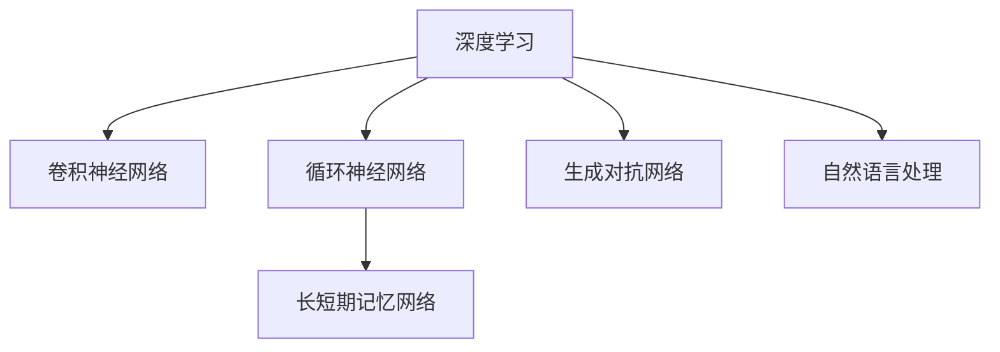

                 

# 软件 2.0 的发展趋势：深度学习、强化学习

## 1. 背景介绍

### 1.1 问题由来
近年来，随着计算机技术、大数据、人工智能等领域的快速发展，软件生态迎来了前所未有的变革。特别是深度学习和强化学习技术的兴起，彻底改变了传统的软件开发模式，推动了软件 2.0 时代（Software 2.0）的到来。

深度学习（Deep Learning）和强化学习（Reinforcement Learning, RL）作为人工智能的重要分支，通过神经网络模型和大数据训练，使得计算机能够自主地从数据中学习，具备了自适应、自学习和自优化的能力。深度学习在图像识别、自然语言处理、语音识别等领域展现了强大的性能，而强化学习则在机器人控制、游戏策略、推荐系统等领域取得了显著突破。

### 1.2 问题核心关键点
深度学习和强化学习技术的迅猛发展，对软件开发模式产生了深远影响。软件开发从传统的编码实现，转变为依赖于模型训练、优化和调优的智能开发。这种转变不仅是技术的变革，更代表了从手工编程到自动化的跨越，是软件 2.0 时代的重要特征。

深度学习和强化学习的核心关键点包括：
- 数据驱动：软件开发逐渐依赖于大量数据而非手工设计。
- 自动优化：软件能够在运行过程中自我优化，提高性能和效率。
- 自适应：软件能够根据环境变化和用户反馈自动调整行为和策略。
- 智能推理：软件能够通过模型进行智能决策，解决复杂问题。
- 模型增强：软件能够通过不断的学习与迭代，不断提升能力。

## 2. 核心概念与联系

### 2.1 核心概念概述

为了更好地理解深度学习和强化学习在软件开发中的应用，本节将介绍几个密切相关的核心概念：

- 深度学习（Deep Learning, DL）：利用神经网络模型，通过大量标注数据进行训练，自动学习复杂映射关系，适用于图像、声音、文本等高维数据的处理。
- 强化学习（Reinforcement Learning, RL）：基于环境反馈，通过试错学习最优策略，适用于复杂决策问题的解决，如机器人控制、游戏策略、推荐系统等。
- 卷积神经网络（Convolutional Neural Network, CNN）：一种特殊类型的神经网络，主要用于图像处理，通过卷积操作提取空间特征。
- 循环神经网络（Recurrent Neural Network, RNN）：一种能够处理序列数据的神经网络，适用于文本生成、语音识别等序列任务。
- 长短期记忆网络（Long Short-Term Memory, LSTM）：一种RNN的变体，能够有效解决长序列数据的建模问题。
- 生成对抗网络（Generative Adversarial Network, GAN）：由生成器和判别器组成的对抗训练模型，用于生成高质量的图像、视频等。
- 自然语言处理（Natural Language Processing, NLP）：利用计算机技术，使计算机能够理解、分析、生成人类语言。

这些核心概念之间的逻辑关系可以通过以下Mermaid流程图来展示：



这个流程图展示了几大深度学习模型的核心概念及其关系：

1. 深度学习是整个生态的基础，能够应用于图像、声音、文本等不同领域。
2. CNN主要用于图像处理，通过卷积操作提取特征。
3. RNN和LSTM适用于序列数据建模，如文本生成、语音识别等。
4. GAN用于生成高质量的图像、视频等。
5. NLP利用深度学习技术，使计算机能够理解和生成人类语言。

这些核心概念共同构成了深度学习和强化学习的理论基础，使其能够在各种场景下发挥强大的能力。

## 3. 核心算法原理 & 具体操作步骤

### 3.1 算法原理概述

深度学习和强化学习在软件开发中的应用，本质上是利用这些技术，在软件系统的开发、优化、维护等各个环节，实现自动化和智能化。深度学习通过模型训练，自动提取数据特征，用于优化算法、生成代码等；而强化学习则通过试错学习，自动调整策略和行为，提高软件系统的性能和用户体验。

### 3.2 算法步骤详解

深度学习和强化学习在软件开发中的应用，一般包括以下几个关键步骤：

**Step 1: 数据收集与预处理**
- 收集大量标注数据，如代码片段、软件系统日志、用户反馈等。
- 进行数据清洗和预处理，如去噪、归一化、特征提取等，确保数据质量。

**Step 2: 模型训练与优化**
- 选择合适的深度学习或强化学习模型，进行模型训练。
- 使用优化算法，如随机梯度下降、Adam、A2C等，进行模型参数优化。
- 应用正则化技术，如L2正则、Dropout等，防止过拟合。

**Step 3: 模型集成与部署**
- 将训练好的模型集成到软件开发环境中，如IDE、CI/CD等。
- 应用模型进行代码生成、算法优化、异常检测等任务。
- 定期更新模型，使其不断适应新的数据和场景。

**Step 4: 模型监控与评估**
- 监控模型的运行状态，如准确率、召回率、响应时间等。
- 评估模型的性能，进行模型调优和迭代。
- 设置异常告警，确保系统稳定性。

### 3.3 算法优缺点

深度学习和强化学习在软件开发中的应用，具有以下优点：
1. 自动化程度高：能够自动从数据中学习和优化，减少人工干预。
2. 自适应能力强：能够根据环境变化和用户反馈，自动调整策略和行为。
3. 高效性：能够快速处理大量数据，提高软件开发效率。
4. 精确性：通过模型训练，提高决策的准确性和可靠性。

同时，这些算法也存在一些局限性：
1. 数据需求量大：需要大量标注数据进行模型训练，数据获取和处理成本较高。
2. 模型复杂度高：深度学习模型参数量大，训练和优化复杂，需要高性能硬件支持。
3. 可解释性不足：深度学习模型通常被认为是"黑盒"，难以解释其内部工作机制。
4. 依赖环境：强化学习模型需要依赖特定环境，模型迁移能力有限。

尽管存在这些局限性，但深度学习和强化学习在软件开发中的应用，已经展现出巨大的潜力，正在改变软件开发的方式和流程。未来，随着技术的发展和优化，这些算法的应用前景将更加广阔。

### 3.4 算法应用领域

深度学习和强化学习在软件开发中的应用，覆盖了从开发到运维的各个环节，包括但不限于以下领域：

- **代码生成与优化**
  - 通过深度学习模型自动生成代码片段。
  - 使用强化学习模型优化代码结构，提高代码质量。

- **软件测试**
  - 利用深度学习模型进行缺陷检测和代码质量评估。
  - 应用强化学习模型进行自动化测试用例生成和测试策略优化。

- **性能优化**
  - 使用深度学习模型分析系统性能瓶颈，进行优化。
  - 应用强化学习模型自适应调整资源分配，提高系统性能。

- **异常检测与故障诊断**
  - 利用深度学习模型进行异常检测和故障诊断。
  - 应用强化学习模型自适应调整策略，提高系统可靠性。

- **自动部署与调优**
  - 使用深度学习模型进行容器编排和部署策略优化。
  - 应用强化学习模型进行自动调优和资源优化。

- **智能运维**
  - 利用深度学习模型进行系统监控和告警。
  - 应用强化学习模型自适应调整运维策略，提高系统稳定性。

- **个性化推荐**
  - 利用深度学习模型进行用户行为分析，推荐个性化服务。
  - 应用强化学习模型进行策略优化，提高推荐效果。

以上领域只是深度学习和强化学习在软件开发中应用的冰山一角，未来随着这些技术的发展和应用，软件开发将更加自动化和智能化，推动软件产业的全面升级。

## 4. 数学模型和公式 & 详细讲解 & 举例说明

### 4.1 数学模型构建

本节将使用数学语言对深度学习和强化学习在软件开发中的应用进行更加严格的刻画。

**深度学习数学模型**
设深度学习模型的输入为 $X$，输出为 $Y$，模型参数为 $\theta$，则模型的损失函数为：

$$
\mathcal{L}(\theta) = \frac{1}{N}\sum_{i=1}^N \ell(Y_i, \hat{Y}_i)
$$

其中 $\ell$ 为损失函数，如均方误差（MSE）、交叉熵（CE）等，$\hat{Y}_i$ 为模型对 $X_i$ 的预测输出。

**强化学习数学模型**
强化学习的核心是构建环境与代理（agent）之间的交互，代理通过与环境的互动，学习最优策略 $\pi$，使得期望累积奖励最大化。数学表达为：

$$
\max_{\pi} \mathbb{E}\left[\sum_{t=0}^{\infty} \gamma^t r(s_t, a_t)\right]
$$

其中 $s_t$ 表示环境状态，$a_t$ 表示代理的行动，$r$ 为奖励函数，$\gamma$ 为折扣因子。

### 4.2 公式推导过程

以下我们以代码生成为例，推导深度学习模型的具体实现步骤。

假设我们希望训练一个深度学习模型，用于生成Python代码片段。模型的输入为代码的初始部分，输出为代码的剩余部分。训练时，我们将每个代码片段拆分为初始部分和剩余部分，使用交叉熵损失函数进行训练。模型的训练过程如下：

1. **模型选择**
   - 选择合适的深度学习模型，如循环神经网络（RNN）或变压器（Transformer）。

2. **数据准备**
   - 收集大量Python代码片段，将每个代码片段拆分为初始部分和剩余部分。
   - 为每个代码片段添加标签，表示初始部分与剩余部分的关系。

3. **模型训练**
   - 使用随机梯度下降等优化算法，最小化交叉熵损失。
   - 应用正则化技术，如L2正则、Dropout等，防止过拟合。

4. **模型评估**
   - 在测试集上评估模型的生成质量，如BLEU分数、准确率等。
   - 根据评估结果，对模型进行调优和迭代。

### 4.3 案例分析与讲解

**代码生成案例**
假设我们有一个生成Python代码片段的任务，目标是给定一个函数的参数和返回值，自动生成函数的实现代码。

1. **数据准备**
   - 收集大量Python函数实现代码，将每个函数拆分为参数、返回值和实现代码三部分。
   - 使用标记语言，为每个函数标注参数、返回值和实现代码。

2. **模型训练**
   - 选择循环神经网络作为模型，将参数和返回值作为输入，实现代码作为标签。
   - 使用交叉熵损失函数进行训练，最小化模型预测与真实标签之间的差距。
   - 应用L2正则和Dropout，防止过拟合。

3. **模型评估**
   - 在测试集上评估模型的生成质量，如BLEU分数、准确率等。
   - 根据评估结果，对模型进行调优和迭代。

**代码优化案例**
假设我们需要对一段Python代码进行优化，目标是提高代码的执行效率。

1. **数据准备**
   - 收集大量Python代码片段，将每个代码片段作为输入。
   - 使用标记语言，标注代码的性能瓶颈和优化建议。

2. **模型训练**
   - 选择深度学习模型，如卷积神经网络或变压器，将代码片段作为输入。
   - 使用交叉熵损失函数进行训练，最小化模型预测与真实标签之间的差距。
   - 应用L2正则和Dropout，防止过拟合。

3. **模型评估**
   - 在测试集上评估模型的优化效果，如执行时间、内存占用等。
   - 根据评估结果，对模型进行调优和迭代。

## 5. 项目实践：代码实例和详细解释说明

### 5.1 开发环境搭建

在进行深度学习和强化学习在软件开发中的应用实践前，我们需要准备好开发环境。以下是使用Python进行TensorFlow开发的环境配置流程：

1. 安装Anaconda：从官网下载并安装Anaconda，用于创建独立的Python环境。

2. 创建并激活虚拟环境：
```bash
conda create -n tf-env python=3.8 
conda activate tf-env
```

3. 安装TensorFlow：根据CUDA版本，从官网获取对应的安装命令。例如：
```bash
conda install tensorflow tensorflow-cpu=cuda110 -c pytorch -c conda-forge
```

4. 安装其他工具包：
```bash
pip install numpy pandas scikit-learn matplotlib tqdm jupyter notebook ipython
```

完成上述步骤后，即可在`tf-env`环境中开始深度学习和强化学习在软件开发中的应用实践。

### 5.2 源代码详细实现

下面我们以代码生成任务为例，给出使用TensorFlow进行深度学习模型训练的PyTorch代码实现。

首先，定义数据处理函数：

```python
import tensorflow as tf
from tensorflow.keras.preprocessing.sequence import pad_sequences

def load_dataset():
    # 加载数据集
    # 这里假定已经存在训练集和测试集，分别命名为train_data和test_data
    return train_data, test_data

def preprocess_data(data):
    # 数据预处理
    # 将数据集分为输入和标签两部分
    # 对输入进行padding，确保所有序列长度一致
    return input_data, target_data

# 定义模型
model = tf.keras.Sequential([
    tf.keras.layers.Embedding(input_dim=vocab_size, output_dim=embedding_dim),
    tf.keras.layers.LSTM(units=hidden_size, return_sequences=True),
    tf.keras.layers.Dense(units=output_size)
])

# 定义损失函数
loss_fn = tf.keras.losses.CategoricalCrossentropy()

# 定义优化器
optimizer = tf.keras.optimizers.Adam(learning_rate=learning_rate)

# 训练模型
def train_model(model, input_data, target_data, epochs):
    # 定义训练集和测试集
    train_dataset = tf.data.Dataset.from_tensor_slices((input_data, target_data)).shuffle(buffer_size=buffer_size).batch(batch_size)
    test_dataset = tf.data.Dataset.from_tensor_slices((input_data, target_data)).batch(batch_size)

    # 训练模型
    for epoch in range(epochs):
        model.trainable = True
        for input_t, target_t in train_dataset:
            with tf.GradientTape() as tape:
                logits = model(input_t)
                loss = loss_fn(target_t, logits)
            grads = tape.gradient(loss, model.trainable_variables)
            optimizer.apply_gradients(zip(grads, model.trainable_variables))
        if (epoch + 1) % eval_frequency == 0:
            model.trainable = False
            test_loss = []
            for input_t, target_t in test_dataset:
                logits = model(input_t)
                loss = loss_fn(target_t, logits)
                test_loss.append(loss.numpy())
            print(f"Epoch {epoch+1}, test loss: {np.mean(test_loss):.4f}")
```

接着，使用TensorFlow定义深度学习模型和优化器：

```python
# 加载数据集
train_data, test_data = load_dataset()

# 数据预处理
input_data, target_data = preprocess_data(train_data)

# 训练模型
train_model(model, input_data, target_data, epochs)
```

### 5.3 代码解读与分析

让我们再详细解读一下关键代码的实现细节：

**load_dataset函数**：
- 加载数据集，假设已经存在训练集和测试集，分别命名为train_data和test_data。

**preprocess_data函数**：
- 数据预处理，将数据集分为输入和标签两部分。
- 对输入进行padding，确保所有序列长度一致。

**train_model函数**：
- 定义训练集和测试集。
- 使用Adam优化器进行模型训练。
- 在每个epoch结束后，在测试集上评估模型性能。

**主函数**：
- 加载数据集和模型。
- 调用训练函数，训练模型。

可以看到，TensorFlow提供了完整的深度学习框架，使得模型训练和优化变得简洁高效。开发者可以将更多精力放在数据处理和模型优化上，而不必过多关注底层实现细节。

当然，工业级的系统实现还需考虑更多因素，如模型的保存和部署、超参数的自动搜索、更灵活的模型结构设计等。但核心的模型训练流程基本与此类似。

## 6. 实际应用场景

### 6.1 智能运维

在智能运维领域，深度学习和强化学习技术的应用广泛且深入。传统的运维依赖人工监控和诊断，存在响应速度慢、误报率高、效率低等问题。基于深度学习的运维系统，可以通过自动分析日志、性能数据，快速定位问题，自动生成故障诊断报告，提高运维效率。

例如，利用深度学习模型进行日志异常检测，可以通过训练一个异常检测模型，对系统日志进行分析，识别出潜在的异常行为，并及时进行告警。同时，利用强化学习模型进行资源优化，可以在系统负载变化时，动态调整资源分配，确保系统稳定运行。

### 6.2 软件测试

在软件测试领域，深度学习和强化学习技术主要用于缺陷检测、自动化测试用例生成等方面。传统的软件测试依赖手工测试，存在工作量大、覆盖率低、效率低等问题。基于深度学习的测试系统，可以通过自动分析代码和测试数据，生成测试用例，进行自动化测试，提高测试效率和覆盖率。

例如，利用深度学习模型进行缺陷检测，可以通过训练一个缺陷检测模型，对代码进行分析，识别出潜在的缺陷，并生成修复建议。同时，利用强化学习模型进行测试用例生成，可以基于历史测试数据和代码特征，自动生成测试用例，提高测试覆盖率。

### 6.3 推荐系统

在推荐系统领域，深度学习和强化学习技术主要用于用户行为分析、推荐算法优化等方面。传统的推荐系统依赖手工设计和特征工程，存在特征选择困难、算法复杂度高、效率低等问题。基于深度学习的推荐系统，可以通过自动分析用户行为数据，生成推荐算法，提高推荐效果。

例如，利用深度学习模型进行用户行为分析，可以通过训练一个用户行为分析模型，对用户行为数据进行分析，识别出用户的兴趣和偏好，并生成个性化推荐。同时，利用强化学习模型进行推荐算法优化，可以基于用户反馈和历史行为，自动调整推荐算法，提高推荐效果。

### 6.4 未来应用展望

随着深度学习和强化学习技术的不断发展，其在软件开发中的应用前景将更加广阔。未来，深度学习和强化学习将在以下几个领域得到深入应用：

1. **自动化测试**
  - 基于深度学习的自动化测试系统，可以自动生成测试用例，进行自动化测试，提高测试效率和覆盖率。
  - 利用强化学习模型进行测试策略优化，可以基于测试结果，自动调整测试策略，提高测试效果。

2. **智能运维**
  - 基于深度学习的智能运维系统，可以自动分析日志、性能数据，快速定位问题，自动生成故障诊断报告，提高运维效率。
  - 利用强化学习模型进行资源优化，可以在系统负载变化时，动态调整资源分配，确保系统稳定运行。

3. **代码生成与优化**
  - 基于深度学习的代码生成系统，可以自动生成代码片段，进行代码优化，提高开发效率。
  - 利用强化学习模型进行代码优化，可以基于代码特征和性能数据，自动调整优化策略，提高代码质量。

4. **数据分析与决策支持**
  - 基于深度学习的数据分析系统，可以自动分析数据，生成决策支持报告，提高决策效率和准确性。
  - 利用强化学习模型进行决策策略优化，可以基于历史数据和用户反馈，自动调整决策策略，提高决策效果。

5. **知识图谱与语义搜索**
  - 基于深度学习的知识图谱系统，可以自动构建和更新知识图谱，进行语义搜索，提高信息获取效率。
  - 利用强化学习模型进行知识图谱优化，可以基于用户查询行为，自动调整知识图谱结构，提高查询效果。

6. **智能监控与告警**
  - 基于深度学习的智能监控系统，可以自动分析监控数据，生成告警报告，提高告警准确性和及时性。
  - 利用强化学习模型进行告警策略优化，可以基于监控数据和用户反馈，自动调整告警策略，提高告警效果。

## 7. 工具和资源推荐

### 7.1 学习资源推荐

为了帮助开发者系统掌握深度学习和强化学习在软件开发中的应用，这里推荐一些优质的学习资源：

1. **《深度学习》课程**：斯坦福大学开设的深度学习课程，讲解深度学习的理论基础和实践技巧，涵盖图像、语音、自然语言处理等多个领域。

2. **《强化学习》课程**：斯坦福大学开设的强化学习课程，讲解强化学习的理论基础和实践技巧，涵盖机器人控制、游戏策略、推荐系统等多个领域。

3. **《TensorFlow实战》书籍**：TensorFlow官方出版的书籍，全面介绍了TensorFlow的框架结构、API使用和优化技巧，适合TensorFlow初学者和进阶者。

4. **《深度学习入门》书籍**：著名深度学习专家Ian Goodfellow所著的入门书籍，全面讲解深度学习的理论基础和实践技巧，适合深度学习初学者。

5. **Coursera深度学习和强化学习课程**：Coursera提供的深度学习和强化学习课程，由业界专家授课，讲解深度学习和强化学习的理论基础和实践技巧，涵盖图像、语音、自然语言处理等多个领域。

通过对这些资源的学习实践，相信你一定能够快速掌握深度学习和强化学习在软件开发中的应用，并用于解决实际的NLP问题。

### 7.2 开发工具推荐

高效的开发离不开优秀的工具支持。以下是几款用于深度学习和强化学习在软件开发中应用的常用工具：

1. **TensorFlow**：由Google主导开发的深度学习框架，支持分布式计算、模型优化、模型部署等，广泛应用于深度学习和强化学习。

2. **PyTorch**：Facebook开源的深度学习框架，具有灵活性、易用性和高效性，广泛应用于深度学习和强化学习。

3. **Keras**：基于TensorFlow和Theano的高级深度学习框架，适合初学者和快速原型开发，广泛应用于深度学习和强化学习。

4. **JAX**：Google开源的自动微分框架，支持高效计算、动态图优化和分布式计算，广泛应用于深度学习和强化学习。

5. **OpenAI Gym**：由OpenAI提供的强化学习环境，支持多种游戏和任务，适合进行强化学习算法的研究和开发。

合理利用这些工具，可以显著提升深度学习和强化学习在软件开发中的应用效率，加快创新迭代的步伐。

### 7.3 相关论文推荐

深度学习和强化学习在软件开发中的应用，得益于学界的持续研究。以下是几篇奠基性的相关论文，推荐阅读：

1. **Deep Learning**：Ian Goodfellow、Yoshua Bengio、Aaron Courville合著的深度学习经典教材，全面介绍了深度学习的理论基础和实践技巧。

2. **Reinforcement Learning: An Introduction**：Richard S. Sutton、Andrew G. Barto合著的强化学习经典教材，讲解强化学习的理论基础和实践技巧。

3. **Attention is All You Need**：谷歌研究团队提出的Transformer模型，是深度学习领域的重要突破，开启了NLP领域的预训练大模型时代。

4. **BERT: Pre-training of Deep Bidirectional Transformers for Language Understanding**：谷歌研究团队提出的BERT模型，引入基于掩码的自监督预训练任务，刷新了多项NLP任务SOTA。

5. **AlphaGo Zero**：DeepMind研究团队提出的AlphaGo Zero，通过强化学习技术，实现了围棋的自我对弈，为AI决策制定提供了新的思路。

6. **GPT-3: Language Models are Unsupervised Multitask Learners**：OpenAI提出的GPT-3模型，利用大规模预训练技术，展示了深度学习模型的强大零样本学习能力。

这些论文代表了大深度学习和强化学习在软件开发中的应用的研究进展，通过学习这些前沿成果，可以帮助研究者把握学科前进方向，激发更多的创新灵感。

## 8. 总结：未来发展趋势与挑战

### 8.1 总结

本文对深度学习和强化学习在软件开发中的应用进行了全面系统的介绍。首先阐述了深度学习和强化学习技术的迅猛发展，对软件开发模式产生了深远影响。深度学习通过模型训练，自动提取数据特征，用于优化算法、生成代码等；而强化学习则通过试错学习，自动调整策略和行为，提高软件系统的性能和用户体验。

深度学习和强化学习在软件开发中的应用，具有以下优点：
1. 自动化程度高：能够自动从数据中学习和优化，减少人工干预。
2. 自适应能力强：能够根据环境变化和用户反馈，自动调整策略和行为。
3. 高效性：能够快速处理大量数据，提高软件开发效率。
4. 精确性：通过模型训练，提高决策的准确性和可靠性。

同时，这些算法也存在一些局限性：
1. 数据需求量大：需要大量标注数据进行模型训练，数据获取和处理成本较高。
2. 模型复杂度高：深度学习模型参数量大，训练和优化复杂，需要高性能硬件支持。
3. 可解释性不足：深度学习模型通常被认为是"黑盒"，难以解释其内部工作机制。
4. 依赖环境：强化学习模型需要依赖特定环境，模型迁移能力有限。

尽管存在这些局限性，但深度学习和强化学习在软件开发中的应用，已经展现出巨大的潜力，正在改变软件开发的方式和流程。未来，随着技术的发展和优化，这些算法的应用前景将更加广阔。

### 8.2 未来发展趋势

展望未来，深度学习和强化学习在软件开发中的应用将呈现以下几个发展趋势：

1. **自动化程度更高**
  - 深度学习和强化学习技术将进一步自动化，开发过程将更加依赖于数据和模型，减少人工干预。
  - 未来的软件系统将更加智能化，能够自动完成设计、编码、测试、部署等各个环节。

2. **模型复杂度更低**
  - 深度学习模型将逐渐从大模型转向小模型，减少资源消耗，提高部署效率。
  - 模型压缩、量化加速等技术将进一步发展，实现更高效、更轻量级的模型部署。

3. **可解释性更强**
  - 深度学习模型的可解释性将进一步提升，开发者将能够更直观地理解模型的决策过程和行为机制。
  - 模型监控和评估技术将更加完善，能够实时监控模型状态，及时发现和解决潜在问题。

4. **应用范围更广**
  - 深度学习和强化学习技术将应用于更多领域，如自动化测试、智能运维、推荐系统等。
  - 未来的软件开发将更加灵活，能够根据具体需求进行灵活定制，提高软件系统的适应性和可扩展性。

5. **人机协同更紧密**
  - 深度学习和强化学习技术将与人类开发人员更好地协同工作，提供更好的辅助和建议。
  - 未来的软件开发将更加注重人机交互，开发人员可以通过简单的指令和提示，与模型进行高效协作。

### 8.3 面临的挑战

尽管深度学习和强化学习在软件开发中的应用展现出巨大的潜力，但在迈向更加智能化、普适化应用的过程中，它们仍面临诸多挑战：

1. **数据需求量大**
  - 需要大量标注数据进行模型训练，数据获取和处理成本较高，难以应用于所有领域。
  - 数据的隐私和安全问题也需要得到充分考虑，避免数据泄露和滥用。

2. **模型复杂度高**
  - 深度学习模型参数量大，训练和优化复杂，需要高性能硬件支持。
  - 模型的部署和维护成本较高，需要复杂的技术支持和资源配置。

3. **可解释性不足**
  - 深度学习模型通常被认为是"黑盒"，难以解释其内部工作机制，影响开发人员的信任和使用。
  - 模型的可解释性需要进一步提升，以确保其可靠性和可信度。

4. **依赖环境**
  - 强化学习模型需要依赖特定环境，模型迁移能力有限，难以在不同环境中应用。
  - 模型的可迁移性和泛化能力需要进一步提升，以应对复杂多变的环境和任务。

5. **伦理和安全问题**
  - 深度学习和强化学习模型的输出可能存在偏见和歧视，影响系统的公平性和公正性。
  - 模型的安全和隐私问题也需要得到充分考虑，避免对用户造成潜在风险。

6. **计算资源消耗高**
  - 深度学习和强化学习模型需要大量计算资源，训练和推理过程耗时较长，对硬件资源要求较高。
  - 模型的计算效率需要进一步提升，以适应更多场景和应用。

### 8.4 研究展望

未来的研究需要在以下几个方向寻求新的突破：

1. **无监督和半监督学习**
  - 探索无监督和半监督学习技术，减少对标注数据的需求，提高模型的泛化能力。
  - 结合无监督学习和有监督学习，实现更高效、更灵活的模型训练。

2. **模型压缩和优化**
  - 开发更高效的模型压缩和优化技术，降低模型参数量，提高部署效率。
  - 结合模型压缩和量化加速，实现更高效、更轻量级的模型部署。

3. **模型解释和可解释性**
  - 研究模型解释和可解释性技术，提升模型的可理解性和可信任度。
  - 结合可视化工具和解释模型，使开发人员能够更好地理解和调试模型。

4. **跨领域知识整合**
  - 结合跨领域知识，提高模型的普适性和泛化能力。
  - 结合专家知识库和规则库，提升模型的智能推理和决策能力。

5. **多模态融合**
  - 结合多模态数据，提高模型的综合能力和适应性。
  - 结合视觉、语音、文本等多种模态数据，提升模型的理解和生成能力。

6. **鲁棒性和泛化能力**
  - 研究模型的鲁棒性和泛化能力，提高模型在不同环境和任务下的表现。
  - 结合对抗训练和迁移学习，提升模型的鲁棒性和泛化能力。

通过在这些方向上的持续研究，深度学习和强化学习技术将在软件开发中发挥更大的作用，推动软件产业的全面升级。未来，我们期待这些技术能够在更多领域得到应用，带来更多的创新和突破。

## 9. 附录：常见问题与解答

**Q1：深度学习和强化学习在软件开发中的应用是否只能依赖标注数据？**

A: 深度学习和强化学习在软件开发中的应用，通常依赖标注数据进行模型训练和优化。然而，近年来，无监督和半监督学习技术的发展，使得深度学习和强化学习可以依赖更多的非结构化数据进行模型训练。例如，利用自监督学习、主动学习等方法，可以在少标注或无标注数据下进行模型训练，提高模型的泛化能力和适应性。

**Q2：深度学习和强化学习模型的解释性和可信任度如何提升？**

A: 提升深度学习和强化学习模型的解释性和可信任度，是当前研究的一个重要方向。以下是一些可行的方法：

1. **模型可视化**
  - 使用可视化工具，如TensorBoard、PyTorch Visualizer等，展示模型的内部结构和决策过程，帮助开发人员理解模型行为。
  - 结合可解释模型（如LIME、SHAP等），生成模型输出的解释和原因，增强模型的可理解性。

2. **模型解释技术**
  - 利用模型解释技术，如特征重要性分析、局部可解释模型等，生成模型输出的解释和原因，增强模型的可理解性。
  - 结合专家知识和规则库，生成模型输出的解释和原因，增强模型的可理解性。

3. **模型可控性**
  - 利用可控性技术，如自适应学习、强化学习等，增强模型的自适应能力和可控性，提升模型的可信度。
  - 结合模型监控和评估技术，实时监控模型状态，及时发现和解决潜在问题，增强模型的可靠性。

4. **多模态融合**
  - 结合多模态数据，提高模型的综合能力和适应性，增强模型的鲁棒性和泛化能力。
  - 结合专家知识和规则库，生成模型输出的解释和原因，增强模型的可理解性。

通过这些方法的综合应用，可以提升深度学习和强化学习模型的解释性和可信任度，增强模型的可理解性和可控性。

**Q3：深度学习和强化学习模型在实际应用中如何避免过拟合？**

A: 深度学习和强化学习模型在实际应用中，容易过拟合，尤其是面对大规模数据和复杂任务时。以下是一些常见的方法：

1. **数据增强**
  - 利用数据增强技术，如数据扩充、数据合成等，增加训练数据的多样性，减少模型过拟合。
  - 结合自监督学习、主动学习等方法，在少标注或无标注数据下进行模型训练，提高模型的泛化能力和适应性。

2. **正则化技术**
  - 利用正则化技术，如L2正则、Dropout等，防止模型过度拟合训练数据。
  - 结合交叉验证、早停等方法，在模型训练过程中及时发现和解决过拟合问题。

3. **模型压缩和优化**
  - 开发更高效的模型压缩和优化技术，降低模型参数量，提高模型泛化能力和适应性。
  - 结合量化加速、模型并行等技术，降低模型计算复杂度，提高模型计算效率。

4. **对抗训练**
  - 利用对抗训练技术，如生成对抗网络（GAN）等，提高模型的鲁棒性和泛化能力，减少模型过拟合。
  - 结合迁移学习、模型集成等方法，增强模型的泛化能力和鲁棒性，避免模型过拟合。

5. **模型监控和评估**
  - 利用模型监控和评估技术，实时监控模型状态，及时发现和解决过拟合问题。
  - 结合模型诊断和调优技术，及时调整模型参数和训练策略，减少模型过拟合。

通过这些方法的综合应用，可以有效地避免深度学习和强化学习模型的过拟合问题，提高模型的泛化能力和适应性。

---

作者：禅与计算机程序设计艺术 / Zen and the Art of Computer Programming

