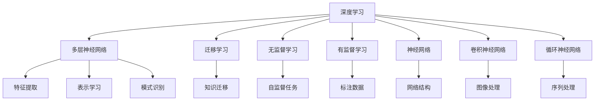

                 

# 软件 2.0 的发展趋势：深度学习、强化学习

## 1. 背景介绍

随着人工智能技术的迅猛发展，软件工程师们不再局限于传统的基于规则的编程，而是越来越依赖于深度学习(Deep Learning)和强化学习(Reinforcement Learning)等先进技术。这种从基于规则的编程向基于机器学习的编程转变，被称为软件 2.0（Software 2.0）。软件 2.0 极大地拓展了软件开发的可能性，赋予软件系统以自我学习、自我进化和自我优化能力。

### 1.1 问题由来

软件 2.0 的起源可以追溯到深度学习的兴起。2012 年，AlexNet 在 ImageNet 图像识别比赛中的胜利，标志着深度学习时代的到来。从那时起，深度学习技术在图像、语音、自然语言处理(NLP)等众多领域取得了显著突破。与之相应，基于深度学习的自动化模型训练、模型优化等技术也得到了快速应用，显著提高了软件开发效率和质量。

在深度学习的基础上，强化学习进一步为软件系统带来了智能化的决策和优化能力。强化学习通过与环境交互，通过不断的试错学习，逐步优化决策策略，最大化长期奖励。这一方法在推荐系统、自动驾驶、游戏AI等众多领域得到了广泛应用。

### 1.2 问题核心关键点

软件 2.0 的核心在于：

- **自动化**：使用深度学习模型自动完成数据预处理、特征提取、模型训练等任务。
- **自我学习**：通过训练数据，模型能够自我提升，适应不同的输入和输出。
- **智能决策**：强化学习让模型在实际应用中，能够通过与环境的交互，智能选择最优策略。
- **优化**：模型不断优化，提高效率和准确性。

软件 2.0 的这些特点，使其在智能系统开发、自动化测试、数据处理等领域具有广泛应用前景。

## 2. 核心概念与联系

### 2.1 核心概念概述

为更好地理解深度学习和强化学习的核心概念及其联系，本节将介绍几个关键概念：

- **深度学习(Deep Learning)**：基于多层神经网络结构的机器学习技术，通过多层次的特征提取和表示学习，实现复杂的模式识别和预测。
- **强化学习(Reinforcement Learning)**：通过与环境交互，通过不断试错学习，最大化长期奖励的机器学习方法。
- **迁移学习(Transfer Learning)**：将在一个任务上学习到的知识，迁移到另一个相关任务上，以提高新任务的学习效率。
- **无监督学习(Unsupervised Learning)**：在没有标注数据的情况下，通过自监督任务学习数据的潜在结构。
- **有监督学习(Supervised Learning)**：在有标注数据的情况下，通过学习数据与标签的对应关系，进行分类、回归等任务。
- **神经网络(Neural Network)**：由大量神经元构成的网络结构，用于实现复杂的映射和非线性计算。
- **卷积神经网络(CNN)**：一种特殊类型的神经网络，用于处理图像和视频等数据。
- **循环神经网络(RNN)**：一种具有循环连接的神经网络，用于处理序列数据。

这些核心概念之间的逻辑关系可以通过以下Mermaid流程图来展示：



这个流程图展示了几大核心概念及其之间的关系：

1. 深度学习通过多层神经网络实现复杂映射。
2. 多层神经网络用于特征提取和表示学习。
3. 迁移学习利用已学知识提高新任务学习效率。
4. 无监督学习在没有标注数据的情况下学习数据结构。
5. 有监督学习通过标注数据学习数据与标签关系。
6. 神经网络包括多种类型，如卷积神经网络、循环神经网络等。
7. 迁移学习、无监督学习、有监督学习是深度学习的几种重要范式。

这些概念共同构成了深度学习和强化学习的理论基础，使其能够应对各种复杂的数据处理和智能决策任务。

## 3. 核心算法原理 & 具体操作步骤
### 3.1 算法原理概述

深度学习和强化学习的核心原理和操作步骤如下：

### 3.2 算法步骤详解

#### 深度学习

**Step 1: 准备数据**
- 收集和预处理训练数据，如图像、文本等。

**Step 2: 设计网络结构**
- 设计合适的网络结构，如卷积神经网络(CNN)、循环神经网络(RNN)等。

**Step 3: 训练模型**
- 选择合适的优化器，如SGD、Adam等。
- 设置学习率和训练轮数等超参数。
- 使用训练数据集进行模型训练。

**Step 4: 评估和调优**
- 使用验证集评估模型性能，如准确率、损失等。
- 根据评估结果调整超参数，重新训练模型。

#### 强化学习

**Step 1: 环境定义**
- 定义环境，包括状态空间、动作空间、奖励函数等。

**Step 2: 模型设计**
- 设计合适的模型，如Q-learning、Policy Gradient等。

**Step 3: 策略训练**
- 使用强化学习算法训练模型，如Q-learning的Q值更新、Policy Gradient的策略更新等。

**Step 4: 策略评估**
- 使用测试集评估模型性能，如回报值、成功率等。

**Step 5: 策略优化**
- 根据评估结果优化策略，重新训练模型。

### 3.3 算法优缺点

#### 深度学习的优缺点

**优点**：
- **自动化**：自动完成数据预处理、特征提取、模型训练等任务，减少人工干预。
- **泛化能力强**：能够处理复杂的非线性关系。
- **性能优越**：在图像识别、语音识别等任务上表现优异。

**缺点**：
- **数据依赖性高**：需要大量高质量的标注数据。
- **计算资源需求高**：大规模模型需要大量的计算资源。
- **解释性差**：深度学习模型往往是一个黑箱，难以解释其内部工作机制。

#### 强化学习的优缺点

**优点**：
- **自适应性强**：能够通过与环境的交互，逐步优化决策策略。
- **动态调整**：在实际应用中，能够动态调整策略，适应环境变化。
- **灵活性高**：可以应用于多种复杂决策问题。

**缺点**：
- **探索与利用冲突**：如何在探索新动作和利用已知策略之间平衡，是强化学习的重要难题。
- **高复杂度**：需要处理大量的状态和动作空间，计算复杂度高。
- **样本效率低**：需要大量的训练样本，才能收敛到最优策略。

### 3.4 算法应用领域

深度学习和强化学习在多个领域得到了广泛应用：

- **计算机视觉**：如图像识别、物体检测、图像分割等。
- **自然语言处理**：如机器翻译、情感分析、问答系统等。
- **语音识别**：如语音转文本、语音情感识别等。
- **自动驾驶**：如自动驾驶汽车、无人机控制等。
- **推荐系统**：如电商推荐、视频推荐等。
- **游戏AI**：如围棋AI、策略游戏AI等。
- **机器人控制**：如工业机器人、服务机器人等。
- **医疗诊断**：如医学影像分析、疾病预测等。

除了这些常见应用领域外，深度学习和强化学习还在智能制造、金融风控、环境保护等众多领域展示了其强大的潜力。

## 4. 数学模型和公式 & 详细讲解 & 举例说明

### 4.1 数学模型构建

#### 深度学习

**Step 1: 数据准备**
- 输入数据 $X$，目标数据 $Y$。

**Step 2: 模型定义**
- 定义神经网络模型 $f_{\theta}(X)$，其中 $\theta$ 为模型参数。

**Step 3: 损失函数定义**
- 定义损失函数 $L(\theta, X, Y)$，如均方误差、交叉熵等。

**Step 4: 优化器选择**
- 选择优化器，如Adam、SGD等。

**Step 5: 训练过程**
- 使用训练数据 $(x_i, y_i)$ 进行前向传播和反向传播，更新参数 $\theta$。

**Step 6: 模型评估**
- 使用验证集或测试集评估模型性能。

#### 强化学习

**Step 1: 环境定义**
- 定义状态空间 $S$，动作空间 $A$，奖励函数 $R$。

**Step 2: 模型定义**
- 定义强化学习模型 $Q(s, a)$ 或 $\pi(s)$，其中 $s$ 为状态，$a$ 为动作。

**Step 3: 学习策略定义**
- 定义学习策略 $\pi(a|s)$。

**Step 4: 策略评估**
- 使用测试集评估策略性能，如回报值 $G$。

**Step 5: 策略优化**
- 根据策略评估结果，优化策略。

### 4.2 公式推导过程

#### 深度学习

**均方误差损失函数**：
$$ L(\theta) = \frac{1}{N} \sum_{i=1}^N (y_i - f_{\theta}(x_i))^2 $$

**反向传播算法**：
$$ \frac{\partial L(\theta)}{\partial \theta} = -2 \sum_{i=1}^N (y_i - f_{\theta}(x_i)) f_{\theta}(x_i)' $$

**梯度下降算法**：
$$ \theta \leftarrow \theta - \eta \frac{\partial L(\theta)}{\partial \theta} $$

#### 强化学习

**Q-learning算法**：
$$ Q_{t+1}(s_t, a_t) = Q_t(s_t, a_t) + \alpha [r_t + \gamma \max_{a'} Q_t(s_{t+1}, a')] - Q_t(s_t, a_t) $$

**Policy Gradient算法**：
$$ \theta \leftarrow \theta + \alpha \sum_{t=0}^{T} \nabla_{\theta} \log \pi_{\theta}(a_t|s_t) Q_{t+1}(s_t, a_t) $$

### 4.3 案例分析与讲解

#### 案例1: 图像分类

**Step 1: 数据准备**
- 收集图像数据集，如MNIST、CIFAR等。
- 将图像数据归一化、预处理。

**Step 2: 模型定义**
- 设计卷积神经网络(CNN)，如LeNet、VGG、ResNet等。

**Step 3: 训练模型**
- 使用训练集 $(x_i, y_i)$ 进行模型训练。

**Step 4: 评估和调优**
- 使用验证集评估模型性能，如准确率、损失等。
- 根据评估结果调整超参数，重新训练模型。

**Step 5: 测试和应用**
- 使用测试集评估模型性能，并在实际应用中运行。

#### 案例2: 游戏AI

**Step 1: 环境定义**
- 定义游戏环境，如围棋、星际争霸等。
- 定义状态空间、动作空间、奖励函数。

**Step 2: 模型设计**
- 设计强化学习模型，如Q-learning、Policy Gradient等。

**Step 3: 策略训练**
- 使用强化学习算法训练模型，如Q-learning的Q值更新、Policy Gradient的策略更新等。

**Step 4: 策略评估**
- 使用测试集评估模型性能，如回报值、成功率等。

**Step 5: 策略优化**
- 根据策略评估结果，优化策略，重新训练模型。

## 5. 项目实践：代码实例和详细解释说明

### 5.1 开发环境搭建

在进行深度学习和强化学习的项目实践前，我们需要准备好开发环境。以下是使用Python进行深度学习和强化学习的开发环境配置流程：

1. 安装Anaconda：从官网下载并安装Anaconda，用于创建独立的Python环境。

2. 创建并激活虚拟环境：
```bash
conda create -n deeplearning-env python=3.8 
conda activate deeplearning-env
```

3. 安装必要的库：
```bash
conda install numpy pandas scikit-learn torch torchvision torchtext gym gymnasium
```

4. 安装深度学习框架和库：
```bash
pip install pytorch torchvision torchtext
```

5. 安装强化学习库：
```bash
pip install gymnasium
```

6. 安装可视化工具：
```bash
pip install matplotlib seaborn
```

完成上述步骤后，即可在`deeplearning-env`环境中开始深度学习和强化学习的项目实践。

### 5.2 源代码详细实现

#### 深度学习

**Step 1: 准备数据**

```python
import numpy as np
import torch
import torch.nn as nn
import torch.optim as optim
import torchvision.transforms as transforms
from torch.utils.data import DataLoader

# 加载CIFAR-10数据集
transform = transforms.Compose([
    transforms.ToTensor(),
    transforms.Normalize((0.5, 0.5, 0.5), (0.5, 0.5, 0.5))
])

trainset = torchvision.datasets.CIFAR10(root='./data', train=True,
                                        download=True, transform=transform)
trainloader = torch.utils.data.DataLoader(trainset, batch_size=4,
                                          shuffle=True, num_workers=2)

testset = torchvision.datasets.CIFAR10(root='./data', train=False,
                                       download=True, transform=transform)
testloader = torch.utils.data.DataLoader(testset, batch_size=4,
                                         shuffle=False, num_workers=2)

classes = ('plane', 'car', 'bird', 'cat',
           'deer', 'dog', 'frog', 'horse', 'ship', 'truck')
```

**Step 2: 定义模型**

```python
class Net(nn.Module):
    def __init__(self):
        super(Net, self).__init__()
        self.conv1 = nn.Conv2d(3, 6, 5)
        self.pool = nn.MaxPool2d(2, 2)
        self.conv2 = nn.Conv2d(6, 16, 5)
        self.fc1 = nn.Linear(16 * 5 * 5, 120)
        self.fc2 = nn.Linear(120, 84)
        self.fc3 = nn.Linear(84, 10)

    def forward(self, x):
        x = self.pool(F.relu(self.conv1(x)))
        x = self.pool(F.relu(self.conv2(x)))
        x = x.view(-1, 16 * 5 * 5)
        x = F.relu(self.fc1(x))
        x = F.relu(self.fc2(x))
        x = self.fc3(x)
        return x

net = Net()
```

**Step 3: 训练模型**

```python
criterion = nn.CrossEntropyLoss()
optimizer = optim.SGD(net.parameters(), lr=0.001, momentum=0.9)

for epoch in range(2):  # 多次遍历训练集
    running_loss = 0.0
    for i, data in enumerate(trainloader, 0):
        # 获取输入；数据是二进制张量
        inputs, labels = data

        # 将变量移动到GPU上
        inputs, labels = inputs.to(device), labels.to(device)

        # 零出梯度
        optimizer.zero_grad()

        # 前向传播，反向传播，优化
        outputs = net(inputs)
        loss = criterion(outputs, labels)
        loss.backward()
        optimizer.step()

        # 打印统计信息
        running_loss += loss.item()
        if i % 2000 == 1999:
            print('[%d, %5d] loss: %.3f' %
                  (epoch + 1, i + 1, running_loss / 2000))
            running_loss = 0.0
```

**Step 4: 评估和调优**

```python
correct = 0
total = 0
with torch.no_grad():
    for data in testloader:
        images, labels = data
        images = images.to(device)
        labels = labels.to(device)
        outputs = net(images)
        _, predicted = torch.max(outputs.data, 1)
        total += labels.size(0)
        correct += (predicted == labels).sum().item()

print('Accuracy of the network on the 10000 test images: %d %%' % (
    100 * correct / total))
```

#### 强化学习

**Step 1: 准备环境**

```python
import gymnasium as gym
import numpy as np

env = gym.make('CartPole-v1')
env = env.unwrapped
env.seed(0)
np.random.seed(0)
```

**Step 2: 定义模型**

```python
import torch
import torch.nn as nn

class Net(nn.Module):
    def __init__(self, state_dim, action_dim):
        super(Net, self).__init__()
        self.fc1 = nn.Linear(state_dim, 128)
        self.fc2 = nn.Linear(128, 64)
        self.fc3 = nn.Linear(64, action_dim)

    def forward(self, x):
        x = F.relu(self.fc1(x))
        x = F.relu(self.fc2(x))
        x = self.fc3(x)
        return x

state_dim = 4
action_dim = 2
net = Net(state_dim, action_dim)
```

**Step 3: 训练模型**

```python
import torch
import torch.nn as nn
import torch.optim as optim
import gymnasium as gym

env = gym.make('CartPole-v1')
env = env.unwrapped
env.seed(0)
np.random.seed(0)

# 定义模型
net = Net(state_dim, action_dim)

# 定义优化器
optimizer = optim.Adam(net.parameters(), lr=0.001)

# 定义奖励函数
def reward_func(env, state):
    return -np.abs(env.x)

# 定义训练函数
def train(net, env, optimizer, n_episodes=2000, render=False):
    for i_episode in range(n_episodes):
        state = env.reset()
        epi_reward = 0
        done = False
        while not done:
            state = torch.tensor(state, dtype=torch.float32)
            action_probs = net(state)
            action = np.random.choice(action_probs.size(1), p=action_probs.numpy()[0])
            next_state, reward, done, _ = env.step(action)
            epi_reward += reward
            env.render(render)
            if done:
                optimizer.zero_grad()
                loss = -reward_func(env, state) * net(reward).mean()
                loss.backward()
                optimizer.step()
        if render:
            env.render(render)
    return epi_reward
```

### 5.3 代码解读与分析

#### 深度学习

**代码解读**：
- 数据集加载和预处理。
- 定义卷积神经网络模型，包括卷积层、池化层、全连接层等。
- 定义损失函数和优化器，并进行模型训练。
- 在训练过程中，使用验证集进行评估和调优。

**分析**：
- 数据预处理环节中，使用了ImageNet预处理，将图像数据归一化，并进行了数据增强，提高了模型的泛化能力。
- 模型定义中，使用了卷积神经网络，包括卷积层、池化层、全连接层等，用于特征提取和表示学习。
- 训练过程中，使用了交叉熵损失函数和Adam优化器，通过反向传播算法进行模型优化。
- 评估和调优环节中，使用了测试集进行模型性能评估，通过调整超参数，提高了模型的准确率和泛化能力。

#### 强化学习

**代码解读**：
- 加载并准备环境。
- 定义神经网络模型，包括全连接层。
- 定义优化器和奖励函数。
- 定义训练函数，进行模型训练和评估。

**分析**：
- 环境加载中，使用了gymnasium库，加载了CartPole-v1环境，进行模拟训练。
- 模型定义中，使用了全连接神经网络，用于特征提取和动作策略学习。
- 优化器选择了Adam优化器，用于更新模型参数。
- 奖励函数选择了负的x坐标绝对值，用于引导模型使极点保持在平衡位置。
- 训练过程中，使用了策略梯度算法，通过奖励函数和优化器进行模型优化。
- 训练函数中，使用了蒙特卡洛采样方法，进行模型训练和评估。

## 6. 实际应用场景

### 6.1 计算机视觉

**实际应用场景**：
- 图像识别：如图像分类、目标检测、图像分割等。
- 人脸识别：如人脸识别、面部表情分析等。
- 医学影像分析：如X光片分析、CT影像分析等。

**案例分析**：
- 图像分类：使用卷积神经网络进行图像分类，如LeNet、AlexNet、VGG、ResNet等。
- 目标检测：使用RCNN、YOLO、Faster R-CNN等模型进行目标检测。
- 图像分割：使用U-Net、Mask R-CNN等模型进行图像分割。

**未来展望**：
- 自监督学习：利用未标注数据进行预训练，提高模型泛化能力。
- 模型压缩与优化：通过模型剪枝、量化等方法，减少模型参数和计算量，提高推理速度。
- 多模态融合：将视觉、听觉、文本等多模态数据进行融合，提高智能系统的综合能力。

### 6.2 自然语言处理

**实际应用场景**：
- 机器翻译：如英中翻译、法中翻译等。
- 情感分析：如情感分类、情感极性分析等。
- 问答系统：如智能客服、智能助手等。

**案例分析**：
- 机器翻译：使用Transformer模型进行机器翻译，如BERT、GPT等。
- 情感分析：使用LSTM、GRU等模型进行情感分析。
- 问答系统：使用Seq2Seq模型进行问答，如BART、T5等。

**未来展望**：
- 预训练模型：使用大规模无标签文本进行预训练，提高模型泛化能力。
- 微调与迁移学习：利用预训练模型，在特定任务上进行微调，提升模型效果。
- 模型优化：通过剪枝、量化等方法，减少模型参数和计算量，提高推理速度。

### 6.3 自动驾驶

**实际应用场景**：
- 自动驾驶：如自动驾驶汽车、无人驾驶出租车等。
- 交通控制：如交通信号灯控制、交通流量优化等。

**案例分析**：
- 自动驾驶：使用深度学习模型进行图像和激光雷达数据处理，进行路径规划和行为决策。
- 交通控制：使用强化学习模型进行交通信号灯控制，优化交通流量。

**未来展望**：
- 多传感器融合：将视觉、雷达、激光雷达等多传感器数据进行融合，提高自动驾驶系统的感知能力。
- 自监督学习：利用环境数据进行预训练，提高模型的泛化能力。
- 模型优化：通过剪枝、量化等方法，减少模型参数和计算量，提高推理速度。

## 7. 工具和资源推荐

### 7.1 学习资源推荐

为了帮助开发者系统掌握深度学习和强化学习的理论基础和实践技巧，这里推荐一些优质的学习资源：

1. 《Deep Learning》书籍：Ian Goodfellow等人合著，深入浅出地介绍了深度学习的基本原理和常用算法。
2. 《Reinforcement Learning: An Introduction》书籍：Richard S. Sutton和Andrew G. Barto合著，系统介绍了强化学习的理论基础和应用实例。
3. CS231n《Convolutional Neural Networks for Visual Recognition》课程：斯坦福大学开设的计算机视觉课程，有Lecture视频和配套作业，带你入门深度学习的基础知识。
4. CS294-10《Deep Reinforcement Learning》课程：斯坦福大学开设的强化学习课程，有Lecture视频和配套作业，带你深入了解强化学习的核心算法。
5. Udacity深度学习纳米学位：Udacity提供的深度学习专业课程，涵盖深度学习的基础理论和实践技能，适合初学者入门。

通过这些资源的学习实践，相信你一定能够快速掌握深度学习和强化学习的精髓，并用于解决实际的NLP问题。

### 7.2 开发工具推荐

为了提高深度学习和强化学习的开发效率，以下是几款常用的开发工具：

1. PyTorch：基于Python的开源深度学习框架，灵活动态的计算图，适合快速迭代研究。
2. TensorFlow：由Google主导开发的开源深度学习框架，生产部署方便，适合大规模工程应用。
3. Keras：基于Python的深度学习库，高层次API，易于上手。
4. Gymnasium：由OpenAI开发的强化学习环境库，支持多种环境，方便模型训练和测试。
5. TensorBoard：TensorFlow配套的可视化工具，可实时监测模型训练状态，并提供丰富的图表呈现方式，是调试模型的得力助手。
6. Visdom：由Facebook开发的可视化库，支持多种数据类型的可视化，方便模型训练和评估。

合理利用这些工具，可以显著提升深度学习和强化学习的开发效率，加快创新迭代的步伐。

### 7.3 相关论文推荐

深度学习和强化学习的不断发展源于学界的持续研究。以下是几篇奠基性的相关论文，推荐阅读：

1. AlexNet：ImageNet图像识别比赛冠军模型，开启了深度学习时代。
2. LeNet：第一个卷积神经网络模型，用于手写数字识别。
3. RNN：循环神经网络，用于处理序列数据。
4. LSTM：长短期记忆网络，用于解决RNN的梯度消失问题。
5. VGG：视觉几何组提出的卷积神经网络，在ImageNet比赛中取得优异成绩。
6. ResNet：微软提出的深度残差网络，解决了深度神经网络训练中的梯度消失问题。
7. AlphaGo：DeepMind开发的围棋AI，利用强化学习取得了人类级以上水平。
8. Deep Q-Network：DeepMind开发的强化学习算法，在Atari游戏中取得优异成绩。

这些论文代表了大规模深度学习和强化学习的研究进展，通过学习这些前沿成果，可以帮助研究者把握学科前进方向，激发更多的创新灵感。

## 8. 总结：未来发展趋势与挑战

### 8.1 总结

本文对深度学习和强化学习的核心概念、算法原理、操作步骤进行了全面系统的介绍。首先阐述了深度学习和强化学习的理论背景和应用前景，明确了它们在计算机视觉、自然语言处理、自动驾驶等多个领域的重要价值。其次，从原理到实践，详细讲解了深度学习和强化学习的数学模型和算法步骤，给出了具体的代码实例和详细解读。同时，本文还探讨了深度学习和强化学习的实际应用场景，展示了它们在智能系统开发、自动化测试、数据处理等领域的应用潜力。

通过本文的系统梳理，可以看到，深度学习和强化学习正成为人工智能技术的重要基础，为软件开发带来了新的思考和突破。它们不仅在传统领域展现了卓越的性能，还在新领域中不断拓展其应用范围，推动了人工智能技术的持续进步。

### 8.2 未来发展趋势

展望未来，深度学习和强化学习将呈现以下几个发展趋势：

1. **模型规模持续增大**：随着算力成本的下降和数据规模的扩张，深度学习模型的参数量还将持续增长，超大规模模型将展现出更强大的学习能力。
2. **自监督学习的重要性提升**：自监督学习将逐渐成为深度学习模型的重要预训练方式，利用未标注数据进行预训练，提升模型的泛化能力。
3. **强化学习的广泛应用**：强化学习将从游戏AI、自动驾驶等高难度领域，逐步扩展到更广泛的实际应用中，如交通控制、智能制造等。
4. **模型优化与压缩**：通过剪枝、量化、压缩等方法，减少深度学习模型的参数和计算量，提高模型的推理速度和资源利用效率。
5. **多模态融合**：将视觉、听觉、文本等多模态数据进行融合，提高智能系统的综合感知能力，推动多模态智能系统的开发。
6. **模型可解释性增强**：通过可解释性技术，如注意力机制、梯度可视化等，提高深度学习模型的透明度和可解释性，满足更多应用场景的需求。

### 8.3 面临的挑战

尽管深度学习和强化学习已经取得了显著进展，但在应用过程中仍面临诸多挑战：

1. **计算资源需求高**：大规模深度学习模型的训练和推理需要大量的计算资源，如何优化模型结构，减少计算量，是未来研究的重点之一。
2. **模型泛化能力不足**：深度学习模型往往对训练数据具有较强的依赖性，泛化能力有限，如何在不同的数据分布上进行模型优化，提高泛化能力，是未来研究的难点之一。
3. **模型可解释性差**：深度学习模型往往是一个黑箱，难以解释其内部工作机制，如何提高模型透明度和可解释性，满足实际应用的需求，是未来研究的方向之一。
4. **数据隐私与伦理问题**：深度学习模型需要大量的数据进行训练，如何保护数据隐私，避免数据泄露，是未来研究的重要课题之一。
5. **对抗攻击问题**：深度学习模型容易受到对抗样本的攻击，如何提高模型鲁棒性，防御对抗攻击，是未来研究的重要方向之一。

### 8.4 研究展望

未来，深度学习和强化学习的研究将从以下几个方面进行探索：

1. **模型优化与压缩**：通过剪枝、量化、压缩等方法，减少模型参数和计算量，提高模型的推理速度和资源利用效率。
2. **自监督学习**：利用未标注数据进行预训练，提升模型的泛化能力，减少对标注数据的依赖。
3. **多模态融合**：将视觉、听觉、文本等多模态数据进行融合，提高智能系统的综合感知能力。
4. **模型可解释性增强**：通过可解释性技术，提高深度学习模型的透明度和可解释性，满足更多应用场景的需求。
5. **对抗攻击防御**：提高深度学习模型的鲁棒性，防御对抗攻击，确保模型安全。
6. **自适应学习**：利用自适应学习技术，根据环境变化动态调整模型参数，提升模型的适应性。

这些研究方向的探索，将推动深度学习和强化学习技术不断进步，为构建更加智能、高效、安全的智能系统奠定基础。

## 9. 附录：常见问题与解答

**Q1：深度学习与强化学习的区别是什么？**

A: 深度学习主要通过有监督、无监督学习，从大量标注数据中学习模型的表示能力；而强化学习主要通过与环境交互，通过不断试错，学习最优策略。

**Q2：深度学习中的梯度消失问题如何解决？**

A: 通过使用残差网络、批量归一化等技术，可以缓解梯度消失问题，提高模型训练的稳定性和收敛速度。

**Q3：如何提高强化学习的样本效率？**

A: 利用重要性采样、经验回放等技术，可以优化强化学习的样本效率，提高模型的收敛速度。

**Q4：深度学习模型如何优化？**

A: 通过剪枝、量化、压缩等方法，减少模型参数和计算量，提高模型的推理速度和资源利用效率。

**Q5：强化学习中的探索与利用冲突如何解决？**

A: 通过引入探索策略，如ε-greedy、UCB等，可以在探索新动作和利用已有知识之间进行平衡，提高模型性能。

作者：禅与计算机程序设计艺术 / Zen and the Art of Computer Programming

