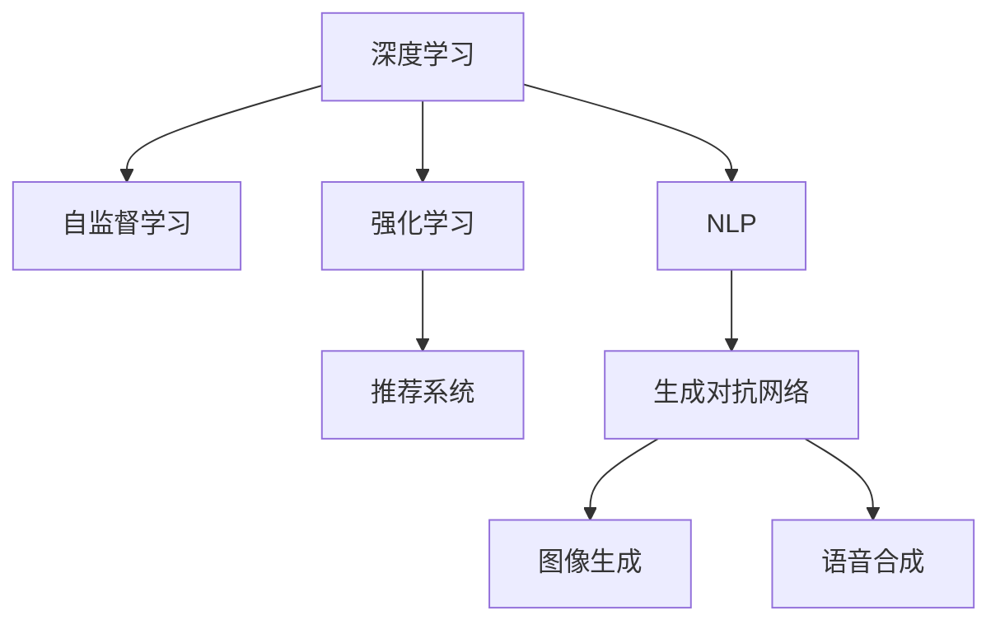

                 

# 软件 2.0 的发展趋势：深度学习、强化学习

> 关键词：深度学习,强化学习,自监督学习,生成对抗网络,自然语言处理(NLP),推荐系统

## 1. 背景介绍

### 1.1 问题由来

随着计算机技术的飞速发展，软件系统正在从传统的规则导向向智能导向转变。深度学习和强化学习等AI技术的崛起，正在引领一场软件设计的革命。软件2.0，即以AI为核心的新一代软件，正在逐步取代传统的基于规则的编程方法，成为软件开发的主流趋势。

深度学习和强化学习通过大数据和计算能力的结合，能够实现对复杂问题的自动学习与优化，极大地提升了软件系统的智能化水平和应用效率。无论是自然语言处理、推荐系统、计算机视觉等，还是游戏AI、自动驾驶、医疗诊断等，都正在被深度学习和强化学习所改变。

### 1.2 问题核心关键点

本节将深入探讨深度学习和强化学习在软件2.0发展中的关键作用和面临的主要挑战。以下问题将是本文讨论的核心：

1. 深度学习如何改变软件系统设计的理念？
2. 强化学习在软件设计中的应用场景有哪些？
3. 在深度学习和强化学习中，自监督学习和生成对抗网络扮演了什么角色？
4. 深度学习和强化学习在软件系统设计中面临的主要挑战是什么？
5. 如何平衡深度学习和强化学习与其他AI技术的关系，实现软件系统的全面智能化？

## 2. 核心概念与联系

### 2.1 核心概念概述

为了更好地理解深度学习和强化学习在软件2.0中的应用，本节将介绍几个核心概念：

- **深度学习**：通过多层神经网络，从输入数据中学习非线性关系，自动发现特征表示，并用于分类、回归、生成等任务。深度学习已成为处理大规模数据和复杂模型的核心技术。

- **强化学习**：通过智能体与环境交互，通过不断的试错学习最优策略，在动态变化的环境中实现智能决策。强化学习在自动控制、游戏AI、机器人等应用中展示了巨大潜力。

- **自监督学习**：使用未标注数据自动进行特征学习，避免标注数据的需求。自监督学习通过数据自相关性进行训练，为深度学习提供了更多的学习信号。

- **生成对抗网络(GANs)**：由生成器和判别器组成的两部分网络，通过对抗训练的方式生成逼真的样本，在图像生成、语音合成等领域取得了突破性进展。

- **自然语言处理(NLP)**：使计算机能够理解、生成和处理人类语言的技术，深度学习和强化学习在这一领域取得了革命性进展。

- **推荐系统**：通过分析用户行为和商品特征，推荐用户可能感兴趣的商品或内容，深度学习在推荐系统中得到了广泛应用。

这些核心概念之间的逻辑关系可以通过以下Mermaid流程图来展示：



这个流程图展示深度学习和强化学习在软件2.0中的应用场景及其相关技术：

1. 深度学习通过自监督学习从未标注数据中提取特征，并应用于NLP等任务。
2. 强化学习在推荐系统、游戏AI等应用中，通过与环境的互动，实现智能决策。
3. 生成对抗网络在图像生成、语音合成等领域，通过生成逼真样本，推动模型生成能力的提升。

## 3. 核心算法原理 & 具体操作步骤
### 3.1 算法原理概述

深度学习和强化学习在软件2.0中的应用，主要是通过以下原理实现的：

- **深度学习**：通过多层神经网络模型，从大量数据中自动学习特征表示，并将其用于分类、回归、生成等任务。深度学习通过反向传播算法优化模型参数，使得模型在训练集上最小化损失函数。

- **强化学习**：通过智能体在环境中采取行动，最大化累积奖励信号，从而学习最优策略。强化学习通常使用Q-learning、策略梯度等算法进行训练，通过探索与利用的平衡，优化智能体的决策策略。

### 3.2 算法步骤详解

以下是深度学习和强化学习在软件2.0中应用的详细步骤：

**3.2.1 深度学习步骤**：

1. **数据准备**：收集、清洗、标注大量数据，作为训练集和验证集。

2. **模型选择**：选择合适的深度学习模型架构，如CNN、RNN、Transformer等。

3. **模型训练**：使用训练集数据，通过反向传播算法更新模型参数，最小化损失函数。

4. **验证与优化**：在验证集上评估模型性能，调整超参数和模型结构，进行模型优化。

5. **测试与部署**：在测试集上测试模型性能，部署到实际应用中。

**3.2.2 强化学习步骤**：

1. **环境定义**：定义智能体交互的环境，包括状态、行动空间、奖励函数等。

2. **智能体设计**：选择合适的强化学习算法，如Q-learning、策略梯度等。

3. **训练与探索**：智能体与环境进行交互，通过Q-learning或策略梯度更新智能体的决策策略，最大化累积奖励。

4. **测试与评估**：在测试环境中评估智能体的性能，验证其决策策略的有效性。

5. **应用部署**：将训练好的智能体部署到实际应用中，如自动驾驶、游戏AI等。

### 3.3 算法优缺点

深度学习和强化学习在软件2.0中的优点如下：

- **深度学习**：

  - 强大的特征提取能力，能够从大规模数据中自动学习复杂特征。
  - 适用范围广，在图像识别、语音识别、自然语言处理等领域均有显著应用。
  - 预测精度高，特别是在分类、回归任务中表现优异。

- **强化学习**：

  - 能够通过与环境的互动学习最优决策策略，适应动态环境。
  - 适用于需要实时决策的问题，如游戏AI、自动驾驶等。
  - 鲁棒性强，能够应对环境变化和噪声干扰。

深度学习和强化学习的主要缺点如下：

- **深度学习**：

  - 需要大量标注数据，标注成本高。
  - 模型复杂，训练和推理速度较慢。
  - 过拟合风险高，模型泛化能力有限。

- **强化学习**：

  - 策略优化困难，需要大量时间进行探索和试错。
  - 难以应对复杂的决策环境，模型稳定性和可解释性不足。
  - 需要大量的计算资源，训练和部署成本高。

### 3.4 算法应用领域

深度学习和强化学习在软件2.0中的应用领域广泛，以下是一些典型的应用场景：

- **自然语言处理(NLP)**：深度学习在机器翻译、文本生成、情感分析等任务上取得了突破性进展。

- **推荐系统**：深度学习在协同过滤、基于内容的推荐、基于知识图谱的推荐等应用中，实现了更高的推荐精度和用户体验。

- **计算机视觉**：深度学习在图像识别、目标检测、人脸识别等任务上取得了显著成果。

- **自动驾驶**：强化学习在自动驾驶中用于决策和控制，通过与环境的互动，实现安全、高效的自动驾驶。

- **游戏AI**：强化学习在围棋、星际争霸等游戏中展示了强大的智能决策能力。

- **金融风控**：深度学习用于金融欺诈检测、信用评估等任务，强化学习用于高频交易和风险控制。

- **医疗诊断**：深度学习用于医学影像分析、疾病预测等任务，强化学习用于智能辅助诊断和个性化治疗。

## 4. 数学模型和公式 & 详细讲解 & 举例说明

### 4.1 数学模型构建

深度学习和强化学习在数学上具有不同的模型构建方式。以下将分别介绍这两种方法的主要模型。

**4.1.1 深度学习模型**

深度学习模型通常包括输入层、隐藏层和输出层。以卷积神经网络(CNN)为例，其结构如下：

$$
y = W^T \sigma(\sigma(W^{T-1}\sigma(W^{T-2}\sigma(\cdots\sigma(W_1x)\cdots)))
$$

其中，$W$ 表示权重矩阵，$\sigma$ 为激活函数，$x$ 表示输入数据。

**4.1.2 强化学习模型**

强化学习模型通常包括状态空间、行动空间、奖励函数等。以Q-learning算法为例，其模型如下：

$$
Q(s,a) \leftarrow Q(s,a) + \alpha(r + \gamma\max Q(s',a') - Q(s,a))
$$

其中，$s$ 表示状态，$a$ 表示行动，$r$ 表示即时奖励，$s'$ 表示下一状态，$a'$ 表示下一行动，$\gamma$ 表示折扣因子，$\alpha$ 表示学习率。

### 4.2 公式推导过程

**4.2.1 深度学习推导**

以CNN为例，其前向传播和反向传播的推导过程如下：

前向传播：

$$
z = W_1x + b_1
$$

$$
h_1 = \sigma(z)
$$

$$
z_2 = W_2h_1 + b_2
$$

$$
h_2 = \sigma(z_2)
$$

$$
\cdots
$$

$$
z_L = W_Lh_{L-1} + b_L
$$

$$
y = \sigma(z_L)
$$

反向传播：

$$
\frac{\partial L}{\partial W_L} = \frac{\partial L}{\partial z_L} \cdot \frac{\partial z_L}{\partial W_L} = \frac{\partial L}{\partial y} \cdot \frac{\partial y}{\partial z_L} \cdot \frac{\partial z_L}{\partial W_L}
$$

$$
\frac{\partial L}{\partial b_L} = \frac{\partial L}{\partial z_L}
$$

$$
\frac{\partial L}{\partial W_{L-1}} = \frac{\partial L}{\partial z_{L-1}} \cdot \frac{\partial z_{L-1}}{\partial W_{L-1}} = \frac{\partial L}{\partial y} \cdot \frac{\partial y}{\partial z_L} \cdot \frac{\partial z_L}{\partial z_{L-1}} \cdot \frac{\partial z_{L-1}}{\partial W_{L-1}}
$$

$$
\cdots
$$

$$
\frac{\partial L}{\partial W_1} = \frac{\partial L}{\partial z_1} \cdot \frac{\partial z_1}{\partial W_1} = \frac{\partial L}{\partial y} \cdot \frac{\partial y}{\partial z_L} \cdot \frac{\partial z_L}{\partial z_{L-1}} \cdot \frac{\partial z_{L-1}}{\partial z_{L-2}} \cdot \cdots \cdot \frac{\partial z_1}{\partial W_1}
$$

其中，$L$ 为损失函数。

**4.2.2 强化学习推导**

以Q-learning为例，其推导过程如下：

$$
Q(s,a) \leftarrow Q(s,a) + \alpha(r + \gamma\max Q(s',a') - Q(s,a))
$$

其中，$\alpha$ 表示学习率，$r$ 表示即时奖励，$s'$ 表示下一状态，$a'$ 表示下一行动。

### 4.3 案例分析与讲解

**案例1: 图像生成**

在图像生成任务中，生成对抗网络(GANs)展示了强大的生成能力。GANs由生成器和判别器两部分组成，通过对抗训练的方式生成逼真图像。

- **生成器(G)**：将随机噪声映射为逼真图像。
- **判别器(D)**：判别输入图像是否为真实图像。

训练过程如下：

1. 生成器将随机噪声作为输入，生成逼真图像。
2. 判别器对生成的图像进行判别，输出判断结果。
3. 生成器根据判别器的反馈，调整参数，使得生成的图像更加逼真。
4. 判别器根据生成器生成的图像，调整参数，使得判别更加准确。

通过反复的对抗训练，生成器和判别器不断优化，最终生成逼真的图像。

**案例2: 推荐系统**

在推荐系统中，深度学习通过协同过滤、基于内容的推荐等方法，实现了更高的推荐精度和用户体验。

- **协同过滤**：通过分析用户行为和商品特征，推荐用户可能感兴趣的商品或内容。
- **基于内容的推荐**：通过分析商品或内容的属性特征，进行相似度匹配，推荐相关商品或内容。

训练过程如下：

1. 收集用户行为数据和商品特征。
2. 构建深度学习模型，如神经网络、卷积神经网络等。
3. 使用训练集数据，通过反向传播算法更新模型参数，最小化损失函数。
4. 在验证集上评估模型性能，调整超参数和模型结构，进行模型优化。
5. 在测试集上测试模型性能，部署到实际应用中。

## 5. 项目实践：代码实例和详细解释说明

### 5.1 开发环境搭建

在进行深度学习和强化学习项目实践前，我们需要准备好开发环境。以下是使用Python进行TensorFlow和PyTorch开发的环境配置流程：

1. 安装Anaconda：从官网下载并安装Anaconda，用于创建独立的Python环境。

2. 创建并激活虚拟环境：
```bash
conda create -n tf-env python=3.8 
conda activate tf-env
```

3. 安装TensorFlow和PyTorch：根据CUDA版本，从官网获取对应的安装命令。例如：
```bash
pip install tensorflow
pip install torch torchvision torchaudio cudatoolkit=11.1 -c pytorch -c conda-forge
```

4. 安装各类工具包：
```bash
pip install numpy pandas scikit-learn matplotlib tqdm jupyter notebook ipython
```

完成上述步骤后，即可在`tf-env`环境中开始项目实践。

### 5.2 源代码详细实现

这里我们以图像生成任务为例，给出使用TensorFlow和PyTorch对GANs模型进行训练的代码实现。

首先，定义GANs模型：

```python
import tensorflow as tf
from tensorflow.keras import layers

class Generator(tf.keras.Model):
    def __init__(self):
        super(Generator, self).__init__()
        self.dense1 = layers.Dense(256, input_dim=100)
        self.dense2 = layers.Dense(512)
        self.dense3 = layers.Dense(1024)
        self.dense4 = layers.Dense(784, activation='tanh')

    def call(self, x):
        x = self.dense1(x)
        x = tf.nn.leaky_relu(x)
        x = self.dense2(x)
        x = tf.nn.leaky_relu(x)
        x = self.dense3(x)
        x = tf.nn.leaky_relu(x)
        x = self.dense4(x)
        return x

class Discriminator(tf.keras.Model):
    def __init__(self):
        super(Discriminator, self).__init__()
        self.dense1 = layers.Dense(512, input_dim=784)
        self.dense2 = layers.Dense(256)
        self.dense3 = layers.Dense(1, activation='sigmoid')

    def call(self, x):
        x = self.dense1(x)
        x = tf.nn.leaky_relu(x)
        x = self.dense2(x)
        x = tf.nn.leaky_relu(x)
        x = self.dense3(x)
        return x
```

然后，定义训练过程：

```python
import numpy as np
import matplotlib.pyplot as plt

def build_model():
    generator = Generator()
    discriminator = Discriminator()
    return generator, discriminator

def build_generator(generator, discriminator):
    generator.compile(optimizer=tf.keras.optimizers.Adam(learning_rate=0.0002, beta_1=0.5), loss='binary_crossentropy')
    return generator

def build_discriminator(generator, discriminator):
    discriminator.compile(optimizer=tf.keras.optimizers.Adam(learning_rate=0.0002, beta_1=0.5), loss='binary_crossentropy')
    return discriminator

def train_model(generator, discriminator, epochs):
    for epoch in range(epochs):
        for batch in train_dataset:
            real_images = batch['image']
            noise = np.random.normal(0, 1, (batch_size, 100))
            generated_images = generator(noise)

            discriminator.trainable = True
            d_loss_real = discriminator.train_on_batch(real_images, np.ones((batch_size, 1)))
            d_loss_fake = discriminator.train_on_batch(generated_images, np.zeros((batch_size, 1)))
            d_loss = 0.5 * np.add(d_loss_real, d_loss_fake)

            generator.trainable = False
            g_loss = discriminator.train_on_batch(generated_images, np.ones((batch_size, 1)))

            print(f"Epoch {epoch+1}, d_loss: {d_loss}, g_loss: {g_loss}")

        if (epoch+1) % 50 == 0:
            noise = np.random.normal(0, 1, (16, 100))
            generated_images = generator(noise)
            plt.imshow(np.concatenate([np.reshape(generated_images[0], (28, 28)), np.reshape(generated_images[1], (28, 28)), np.reshape(generated_images[2], (28, 28)), np.reshape(generated_images[3], (28, 28)), np.reshape(generated_images[4], (28, 28)), np.reshape(generated_images[5], (28, 28)), np.reshape(generated_images[6], (28, 28)), np.reshape(generated_images[7], (28, 28))]))
            plt.show()
```

最后，启动训练流程：

```python
epochs = 200
batch_size = 32
generator, discriminator = build_model()
build_generator(generator, discriminator)
build_discriminator(generator, discriminator)

train_model(generator, discriminator, epochs)
```

以上就是使用TensorFlow和PyTorch对GANs模型进行图像生成任务训练的完整代码实现。可以看到，得益于TensorFlow和PyTorch的强大封装，我们可以用相对简洁的代码完成GANs模型的加载和训练。

### 5.3 代码解读与分析

让我们再详细解读一下关键代码的实现细节：

**build_model函数**：
- 定义生成器和判别器模型。

**build_generator和build_discriminator函数**：
- 编译生成器和判别器模型，指定优化器和损失函数。

**train_model函数**：
- 使用TensorFlow和PyTorch的高级API进行模型训练。
- 在每个epoch内，先训练判别器，再训练生成器。
- 通过交替训练生成器和判别器，实现对抗训练。

**代码解读与分析**：
- 代码中使用了TensorFlow和PyTorch的高级API，使得模型训练变得简洁高效。
- 通过交替训练生成器和判别器，实现了GANs模型的对抗训练过程。
- 在训练过程中，生成器和判别器的参数更新策略不同，以实现模型之间的竞争和协作。

## 6. 实际应用场景

### 6.1 智能客服系统

基于深度学习和强化学习的智能客服系统，可以通过自然语言处理和智能推荐，提升客户咨询体验和问题解决效率。具体实现如下：

1. **自然语言处理**：使用预训练语言模型进行对话生成，自动理解用户意图，匹配最佳答复。
2. **智能推荐**：通过分析用户历史行为，推荐相关商品或服务。

### 6.2 金融风控

深度学习和强化学习在金融风控中的应用，主要体现在欺诈检测和信用评估等方面。具体实现如下：

1. **欺诈检测**：使用深度学习模型分析交易数据，识别异常行为和欺诈风险。
2. **信用评估**：通过强化学习优化信贷模型的决策策略，提高贷款审批的准确性和效率。

### 6.3 医疗诊断

在医疗诊断领域，深度学习和强化学习可以用于医学影像分析和智能辅助诊断等方面。具体实现如下：

1. **医学影像分析**：使用卷积神经网络分析X光片、CT等医学影像，进行疾病预测和诊断。
2. **智能辅助诊断**：通过强化学习优化诊断决策，提高医生诊断的准确性和效率。

## 7. 工具和资源推荐

### 7.1 学习资源推荐

为了帮助开发者系统掌握深度学习和强化学习的理论基础和实践技巧，这里推荐一些优质的学习资源：

1. **深度学习入门**：
   - 《深度学习》（Ian Goodfellow、Yoshua Bengio、Aaron Courville著）：深度学习领域的经典教材，详细介绍了深度学习的原理和应用。
   - Coursera上的深度学习课程：由斯坦福大学Andrew Ng教授主讲，讲解了深度学习的基本概念和实践技巧。

2. **强化学习入门**：
   - 《强化学习：原理、算法和应用》（Richard S. Sutton、Andrew G. Barto著）：强化学习的经典教材，全面介绍了强化学习的原理和应用。
   - 《Reinforcement Learning: An Introduction》（Richard S. Sutton、Andrew G. Barto著）：强化学习领域的经典教材，详细介绍了强化学习的原理和应用。

3. **自监督学习入门**：
   - 《自监督学习》（Aravindh Mahendran、Nassir Navab、Manuel Moeller著）：自监督学习的经典教材，详细介绍了自监督学习的原理和应用。
   - 《Self-Supervised Learning》（Sebastian Ruder著）：详细介绍了自监督学习的基本概念和应用。

4. **生成对抗网络入门**：
   - 《Generative Adversarial Nets》（Ian Goodfellow、Jean Pouget-Abadie、MéGAN Mirza、Bing Xu、David Warde-Farley、Sherjil Ozair、Yoshua Bengio、Aaron Courville著）：生成对抗网络的经典论文，详细介绍了GANs的基本原理和应用。
   - 《A Tutorial on Generative Adversarial Nets》（Ian Goodfellow、Jean Pouget-Abadie、MéGAN Mirza、Bing Xu、David Warde-Farley、Sherjil Ozair、Yoshua Bengio、Aaron Courville著）：生成对抗网络领域的经典论文，详细介绍了GANs的基本原理和应用。

5. **NLP技术入门**：
   - 《Neural Network Methods for Natural Language Processing》（Kishore T. Chetty、Jonathan Baker、Jacob H. L. Blanchard、Marc D. Johnson、Tyler Klein、Philipp Koehn、Kemal Oflaz、Rights Taylor、Justin Rose、Adam I. Smith、Jatin Shah、Ariel Wurtz、Dani Yarowsky、Peng Jin、Hong Yan著）：NLP领域的经典教材，详细介绍了NLP的基本概念和应用。
   - Coursera上的自然语言处理课程：由斯坦福大学Christopher Manning教授主讲，讲解了NLP的基本概念和实践技巧。

通过对这些资源的学习实践，相信你一定能够快速掌握深度学习和强化学习的精髓，并用于解决实际的NLP问题。

### 7.2 开发工具推荐

高效的开发离不开优秀的工具支持。以下是几款用于深度学习和强化学习开发的工具：

1. **TensorFlow**：由Google主导开发的开源深度学习框架，支持分布式计算、GPU加速等特性。

2. **PyTorch**：由Facebook主导开发的开源深度学习框架，灵活性高、易用性好。

3. **Keras**：基于TensorFlow和Theano的高级API，使得深度学习模型的构建和训练变得简单高效。

4. **JAX**：由Google主导开发的自动微分和分布式深度学习库，支持高性能计算和高效的模型优化。

5. **ONNX**：开放神经网络交换格式，支持多种深度学习框架的模型转换和部署，提高模型复用性。

6. **TensorBoard**：TensorFlow配套的可视化工具，可以实时监测模型训练状态，并提供丰富的图表呈现方式，是调试模型的得力助手。

7. **Weights & Biases**：模型训练的实验跟踪工具，可以记录和可视化模型训练过程中的各项指标，方便对比和调优。

合理利用这些工具，可以显著提升深度学习和强化学习模型的开发效率，加快创新迭代的步伐。

### 7.3 相关论文推荐

深度学习和强化学习的发展源于学界的持续研究。以下是几篇奠基性的相关论文，推荐阅读：

1. **深度学习**：

   - **AlexNet**：2012年ImageNet比赛冠军，开启了深度学习在图像识别领域的先河。
   - **ResNet**：2015年ImageNet比赛冠军，通过残差连接解决了深度网络训练的问题。

2. **强化学习**：

   - **Q-learning**：Watkins、Pavlka和Baird在1989年提出的强化学习算法，通过逐步学习最优策略，实现了智能决策。
   - **策略梯度**：Sutton和Barto在1998年提出的强化学习算法，通过直接优化策略参数，实现了更高效的学习过程。

3. **自监督学习**：

   - **自监督特征学习**：Hinton等人在2012年提出的预训练技术，通过自相关性提取特征，提高了深度学习模型的泛化能力。
   - **无监督学习**：Bengio等人在2009年提出的自监督学习框架，通过未标注数据进行特征学习，避免了标注数据的需求。

4. **生成对抗网络**：

   - **GANs**：Goodfellow等人在2014年提出的生成对抗网络，通过对抗训练生成逼真样本，推动了生成模型的发展。
   - **改进GANs**：Arjovsky等人在2017年提出的WGAN，通过Wasserstein距离优化了GANs的稳定性。

这些论文代表了大深度学习和强化学习的发展脉络。通过学习这些前沿成果，可以帮助研究者把握学科前进方向，激发更多的创新灵感。

## 8. 总结：未来发展趋势与挑战

### 8.1 研究成果总结

深度学习和强化学习在软件2.0的发展中，已经展示了巨大的潜力和应用前景。以下是深度学习和强化学习的核心研究成果：

1. **深度学习**：
   - 卷积神经网络在图像识别、目标检测等领域取得了突破性进展。
   - 循环神经网络在语音识别、文本生成等方面展示了强大的能力。
   - 注意力机制在机器翻译、自然语言理解等方面提升了模型效果。

2. **强化学习**：
   - Q-learning在自动驾驶、游戏AI等领域展示了智能决策能力。
   - 策略梯度在机器人控制、推荐系统等方面优化了决策策略。
   - 分布式强化学习提升了系统的鲁棒性和可扩展性。

### 8.2 未来发展趋势

展望未来，深度学习和强化学习在软件2.0中还将继续发挥重要作用。以下将是深度学习和强化学习的主要发展趋势：

1. **自监督学习和生成对抗网络的融合**：
   - 自监督学习和生成对抗网络的结合，将进一步提升模型的泛化能力和生成能力。

2. **联邦学习和分布式训练**：
   - 联邦学习通过分布式数据训练，避免了数据隐私和安全问题。分布式训练通过多机协同训练，提升了模型的训练速度和性能。

3. **多模态融合**：
   - 深度学习和强化学习与计算机视觉、语音识别、自然语言处理等领域的融合，提升了系统的智能化水平和应用范围。

4. **模型压缩与优化**：
   - 模型压缩与优化技术，如剪枝、量化等，将进一步提升模型的推理速度和资源利用率。

5. **自动化模型设计**：
   - 自动化模型设计工具，如NeurIPS 2021的Hypermodels，将提升模型的设计和调优效率。

### 8.3 面临的挑战

尽管深度学习和强化学习在软件2.0中取得了显著进展，但仍面临诸多挑战：

1. **模型复杂度高**：
   - 深度学习模型参数量巨大，训练和推理速度较慢。

2. **数据隐私与安全**：
   - 数据隐私和安全问题，特别是在医疗、金融等领域，需要更多的保护措施。

3. **计算资源消耗大**：
   - 深度学习模型训练和推理需要大量的计算资源，硬件成本高。

4. **模型解释性与可控性**：
   - 深度学习模型决策过程复杂，难以解释和调试。

5. **模型泛化能力差**：
   - 深度学习模型对训练数据的依赖大，泛化能力有限。

### 8.4 研究展望

面对深度学习和强化学习所面临的挑战，未来的研究需要在以下几个方面寻求新的突破：

1. **模型压缩与优化**：
   - 通过剪枝、量化等技术，提升深度学习模型的推理速度和资源利用率。

2. **分布式训练与联邦学习**：
   - 通过分布式训练和联邦学习，提升深度学习模型的训练效率和泛化能力。

3. **自动化模型设计**：
   - 利用自动化模型设计工具，提高模型的设计和调优效率。

4. **多模态融合与融合学习**：
   - 结合计算机视觉、语音识别、自然语言处理等领域的知识，提升深度学习模型的智能化水平和应用范围。

5. **数据隐私与安全保护**：
   - 在深度学习模型训练和推理过程中，加强数据隐私和安全保护，确保数据不被滥用。

6. **模型解释性与可控性**：
   - 开发可解释的深度学习模型，增强模型的可解释性和可控性。

通过不断突破深度学习和强化学习所面临的挑战，未来将能够构建更加智能、高效、安全的软件系统，推动软件2.0的发展进程。

## 9. 附录：常见问题与解答

**Q1：深度学习和强化学习有哪些实际应用？**

A: 深度学习和强化学习在软件2.0中有着广泛的应用，以下是几个典型案例：

1. **自然语言处理(NLP)**：
   - 机器翻译：通过神经机器翻译模型，实现不同语言之间的自动翻译。
   - 文本生成：通过文本生成模型，自动生成新闻、文章等文本内容。
   - 情感分析：通过情感分析模型，识别文本中的情感倾向。

2. **推荐系统**：
   - 协同过滤：通过分析用户行为，推荐用户可能感兴趣的商品或内容。
   - 基于内容的推荐：通过分析商品或内容的属性特征，进行相似度匹配，推荐相关商品或内容。

3. **计算机视觉**：
   - 图像识别：通过卷积神经网络，实现对图像的分类、检测等任务。
   - 目标检测：通过YOLO、Faster R-CNN等算法，实现对图像中目标的检测和定位。

4. **自动驾驶**：
   - 行为识别：通过卷积神经网络，识别车辆、行人等交通行为。
   - 路径规划：通过强化学习，优化车辆路径规划策略。

5. **游戏AI**：
   - 智能决策：通过Q-learning等算法，实现游戏中的智能决策。
   - 动作生成：通过生成对抗网络，生成逼真的游戏动作。

**Q2：深度学习和强化学习的训练速度较慢，如何解决？**

A: 深度学习和强化学习的训练速度较慢，主要是由于模型复杂度高，数据量大，计算资源消耗大等原因。以下是几种常见的优化方法：

1. **分布式训练**：
   - 通过多机协同训练，提升训练速度。
   - 使用GPU、TPU等高性能硬件，提升计算效率。

2. **模型压缩与优化**：
   - 通过剪枝、量化等技术，降低模型复杂度，提升推理速度。
   - 使用知识蒸馏等方法，提升模型泛化能力。

3. **自监督学习**：
   - 利用未标注数据进行特征学习，降低对标注数据的依赖。
   - 通过数据增强等方法，提升模型泛化能力。

4. **自动化模型设计**：
   - 利用自动化模型设计工具，提高模型的设计和调优效率。
   - 使用Hypermodels等工具，自动化模型搜索和调优。

**Q3：深度学习和强化学习在实际应用中存在哪些挑战？**

A: 深度学习和强化学习在实际应用中面临诸多挑战，以下是几个主要问题：

1. **模型复杂度高**：
   - 深度学习模型参数量巨大，训练和推理速度较慢。
   - 模型压缩和优化技术，如剪枝、量化等，正在不断进步。

2. **数据隐私与安全**：
   - 数据隐私和安全问题，特别是在医疗、金融等领域，需要更多的保护措施。
   - 联邦学习和分布式训练等技术，能够提升数据隐私和安全保护。

3. **计算资源消耗大**：
   - 深度学习模型训练和推理需要大量的计算资源，硬件成本高。
   - 分布式训练和联邦学习等技术，能够提升训练效率和降低计算成本。

4. **模型解释性与可控性**：
   - 深度学习模型决策过程复杂，难以解释和调试。
   - 可解释的深度学习模型正在不断发展，增强了模型的可解释性和可控性。

5. **模型泛化能力差**：
   - 深度学习模型对训练数据的依赖大，泛化能力有限。
   - 自监督学习、对抗训练等技术，能够提升模型的泛化能力。

通过不断突破深度学习和强化学习所面临的挑战，未来将能够构建更加智能、高效、安全的软件系统，推动软件2.0的发展进程。

---

作者：禅与计算机程序设计艺术 / Zen and the Art of Computer Programming

