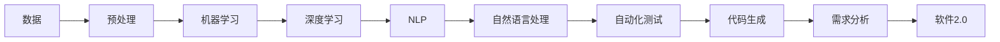

                 

# 软件 2.0 的哲学思考：人工智能的本质

## 1. 背景介绍

### 1.1 问题由来
在过去的几十年里，人工智能(AI)技术经历了飞速发展，尤其是在计算机视觉、自然语言处理(NLP)、语音识别等领域的突破性进展，推动了AI在医疗、金融、教育、娱乐等众多行业的应用。然而，AI的发展也引发了关于其本质和未来的广泛讨论。

本文聚焦于人工智能的哲学思考，特别是从软件工程的角度，探讨AI的本质及其在软件开发中的应用。通过对软件2.0范式的深入分析，我们希望为理解AI的基石奠定基础，为AI技术在软件开发中的应用提供新的视角和思路。

### 1.2 问题核心关键点
软件2.0的哲学思考，即以数据为中心的软件开发范式，它强调算法与数据的深度融合，基于数据驱动决策的软件开发过程。而人工智能的本质，可以理解为数据驱动的智能算法，它基于数据的训练和优化，能够自主学习和做出决策。

本文将探讨软件2.0范式下，数据与算法如何相互作用，以及人工智能如何在软件开发中发挥作用。我们将重点分析以下几个核心问题：
- 数据如何塑造AI模型，以及模型如何利用数据进行学习和决策。
- 软件2.0范式下的软件开发流程，包括数据的收集、预处理、训练和部署。
- AI在软件开发中的应用，例如自动化测试、代码生成、需求分析等。
- AI的伦理和法律问题，包括隐私保护、算法偏见等。

### 1.3 问题研究意义
研究软件2.0范式和人工智能的本质，对于理解AI技术在软件开发中的应用，推动AI与软件开发深度融合具有重要意义。这不仅有助于提升软件开发的效率和质量，还能为AI在实际应用中的伦理和法律问题提供指导，确保AI技术的健康发展。

通过深入探讨这些核心问题，我们希望为软件开发从业人员、AI研究人员和政策制定者提供一个全面、深入的技术和哲学视角，推动AI技术在软件开发中的创新应用。

## 2. 核心概念与联系

### 2.1 核心概念概述

在深入分析软件2.0范式和人工智能本质之前，我们先简要介绍一些核心概念：

- **软件2.0**：基于数据驱动的软件开发范式，强调算法与数据的深度融合，以数据为中心，实现智能决策和自动化的软件开发过程。
- **人工智能**：通过数据训练和优化，使计算机系统能够自主学习和做出决策的智能技术。
- **机器学习**：一种基于数据训练的算法，能够使计算机系统从数据中学习并做出预测或决策。
- **深度学习**：一种特殊类型的机器学习算法，通过多层神经网络模拟人脑的认知过程，适用于复杂的模式识别和图像识别任务。
- **自然语言处理(NLP)**：使计算机能够理解和处理人类自然语言的技术，包括文本分类、情感分析、机器翻译等任务。

这些概念之间存在紧密联系，共同构成了软件2.0范式和人工智能技术的基础。以下是一个简化的Mermaid流程图，展示了这些概念之间的联系：



这个流程图展示了数据预处理、机器学习、深度学习和自然语言处理等技术在软件2.0范式中的应用，以及这些技术如何促进自动化的软件开发过程。

## 3. 核心算法原理 & 具体操作步骤

### 3.1 算法原理概述

软件2.0范式和人工智能技术的应用，依赖于数据驱动的算法模型。这些模型通过大量的数据训练，能够学习到数据中的模式和规律，从而实现智能决策和自动化处理。

在软件2.0范式下，数据驱动的算法模型主要包括以下几个步骤：

1. **数据收集**：从各种来源收集数据，如用户行为数据、业务日志数据、社交媒体数据等。
2. **数据预处理**：清洗和处理原始数据，去除噪声和不一致性，提取有价值的信息。
3. **模型训练**：利用预处理后的数据，训练机器学习或深度学习模型，使其能够从数据中学习规律和模式。
4. **模型优化**：通过调整模型参数和优化算法，提高模型的预测准确性和泛化能力。
5. **模型部署**：将训练好的模型部署到实际应用中，实现自动化的软件开发过程。

### 3.2 算法步骤详解

以下是对软件2.0范式下数据驱动算法模型详细操作过程的解释：

**Step 1: 数据收集**
数据收集是软件2.0范式的基础。数据可以来自各种来源，包括用户行为数据、业务日志数据、社交媒体数据、公共数据集等。例如，可以从电商平台的交易记录中收集用户行为数据，或从金融机构的客户服务记录中收集客户反馈数据。

**Step 2: 数据预处理**
数据预处理是数据驱动模型的关键步骤。预处理包括数据清洗、特征提取、数据增强等。例如，可以从用户行为数据中提取特征，如购买次数、购买金额、购买时间等。通过数据增强技术，如回译、近义词替换等，可以提高模型的泛化能力。

**Step 3: 模型训练**
模型训练是利用预处理后的数据训练算法模型的过程。可以选择不同类型的机器学习或深度学习算法，如回归、分类、神经网络等。例如，可以使用深度学习模型，如卷积神经网络(CNN)、循环神经网络(RNN)、Transformer等，对文本数据进行建模。

**Step 4: 模型优化**
模型优化是通过调整模型参数和优化算法，提高模型的预测准确性和泛化能力。常用的优化算法包括随机梯度下降(SGD)、Adam、Adagrad等。例如，可以使用Adam优化算法，加快模型训练速度，提高模型精度。

**Step 5: 模型部署**
模型部署是将训练好的模型部署到实际应用中，实现自动化的软件开发过程。模型可以集成到软件开发流程中，实现代码自动生成、需求自动化分析等。例如，可以使用AI生成的代码来替代手动编写代码，提高开发效率和代码质量。

### 3.3 算法优缺点

软件2.0范式和人工智能技术的应用具有以下优点：

- **高效性**：基于数据驱动的模型能够快速训练和部署，提高软件开发效率。
- **自适应性**：模型能够根据新数据不断学习和优化，适应变化的需求。
- **自动化**：模型能够自动化处理和决策，减少人工干预，提高开发质量。

然而，这些技术也存在一些缺点：

- **数据依赖性**：模型的性能依赖于数据的质量和多样性，数据收集和预处理成本较高。
- **算法复杂性**：深度学习和机器学习模型的训练和优化需要高深的数学知识和复杂的算法。
- **结果可解释性**：复杂模型的决策过程难以解释，难以理解其内部工作机制。

### 3.4 算法应用领域

软件2.0范式和人工智能技术已经广泛应用于软件开发中，涵盖以下多个领域：

- **自动化测试**：利用AI技术进行自动化测试，提高测试覆盖率和测试效率。
- **代码生成**：基于代码片段和API信息生成完整的代码，提高开发效率。
- **需求分析**：利用自然语言处理技术，自动分析和提取需求，提高需求文档的质量。
- **版本控制**：通过AI技术对代码版本进行自动分类和标注，提高版本管理的效率。
- **代码审查**：利用AI技术进行代码审查，提高代码质量和可维护性。
- **智能运维**：利用AI技术进行故障预测和系统监控，提高系统稳定性和可靠性。

## 4. 数学模型和公式 & 详细讲解 & 举例说明

### 4.1 数学模型构建

软件2.0范式和人工智能技术的应用，通常基于以下数学模型：

- **回归模型**：用于预测连续型数值变量，如房价预测、销售量预测等。常用的回归算法包括线性回归、多项式回归、支持向量机回归等。
- **分类模型**：用于分类离散型变量，如垃圾邮件识别、信用评分等。常用的分类算法包括逻辑回归、决策树、随机森林等。
- **神经网络模型**：用于处理复杂的数据，如图像识别、语音识别、自然语言处理等。常用的神经网络模型包括卷积神经网络(CNN)、循环神经网络(RNN)、长短时记忆网络(LSTM)、Transformer等。
- **聚类模型**：用于对数据进行分组，如市场细分、客户群体划分等。常用的聚类算法包括K均值聚类、层次聚类等。

### 4.2 公式推导过程

以下是对回归模型和分类模型的公式推导过程的解释：

**线性回归模型**
线性回归模型用于预测连续型数值变量。假设输入变量为 $x$，输出变量为 $y$，模型为线性形式：

$$ y = \theta_0 + \theta_1 x_1 + \theta_2 x_2 + ... + \theta_n x_n $$

其中 $\theta_0, \theta_1, ..., \theta_n$ 为模型参数。根据最小二乘法，求解 $\theta$：

$$ \hat{\theta} = \mathop{\arg\min}_{\theta} \frac{1}{N} \sum_{i=1}^N (y_i - \theta_0 - \theta_1 x_{i1} - ... - \theta_n x_{in})^2 $$

**逻辑回归模型**
逻辑回归模型用于分类离散型变量。假设输入变量为 $x$，输出变量为 $y$，模型为逻辑形式：

$$ P(y=1|x) = \frac{1}{1+e^{-\theta_0 - \theta_1 x_1 - ... - \theta_n x_n}} $$

其中 $\theta_0, \theta_1, ..., \theta_n$ 为模型参数。根据最大似然估计法，求解 $\theta$：

$$ \hat{\theta} = \mathop{\arg\max}_{\theta} \sum_{i=1}^N [y_i \log P(y=1|x_i) + (1-y_i) \log P(y=0|x_i)] $$

### 4.3 案例分析与讲解

以自然语言处理(NLP)中的情感分析为例，展示如何利用软件2.0范式和人工智能技术进行建模和优化。

**情感分析模型**
情感分析模型用于对文本数据进行情感分类，如正面、负面、中性等。假设输入为文本 $x$，输出为情感标签 $y$，模型为神经网络形式：

$$ y = \theta_0 + \theta_1 x_1 + \theta_2 x_2 + ... + \theta_n x_n $$

其中 $x_1, x_2, ..., x_n$ 为文本的特征向量，如词频、词性标注、TF-IDF等。

**数据预处理**
1. 收集标注好的情感数据，如电影评论、社交媒体帖子等。
2. 清洗和预处理数据，去除噪声和无关信息，提取有价值的特征。
3. 将文本转换为特征向量，如词袋模型、TF-IDF、词嵌入等。

**模型训练**
1. 使用深度学习模型，如LSTM、Transformer等，训练情感分析模型。
2. 使用随机梯度下降(SGD)、Adam等优化算法，更新模型参数。
3. 在验证集上评估模型性能，调整模型参数和优化算法。

**模型优化**
1. 使用数据增强技术，如回译、近义词替换等，提高模型泛化能力。
2. 使用正则化技术，如L2正则、Dropout等，防止模型过拟合。
3. 使用集成学习技术，如Bagging、Boosting等，提高模型精度。

## 5. 项目实践：代码实例和详细解释说明

### 5.1 开发环境搭建

在进行软件2.0范式和人工智能技术的应用实践前，需要先准备好开发环境。以下是使用Python进行TensorFlow开发的环境配置流程：

1. 安装Anaconda：从官网下载并安装Anaconda，用于创建独立的Python环境。

2. 创建并激活虚拟环境：
```bash
conda create -n tf-env python=3.8 
conda activate tf-env
```

3. 安装TensorFlow：根据CUDA版本，从官网获取对应的安装命令。例如：
```bash
conda install tensorflow tensorflow-cpu
```

4. 安装TensorBoard：TensorFlow配套的可视化工具，用于监控模型训练状态和结果。
```bash
pip install tensorboard
```

5. 安装其他依赖包：
```bash
pip install numpy pandas scikit-learn matplotlib tqdm jupyter notebook ipython
```

完成上述步骤后，即可在`tf-env`环境中开始实践。

### 5.2 源代码详细实现

这里以自然语言处理(NLP)中的情感分析为例，展示如何使用TensorFlow实现情感分析模型的微调。

**数据预处理**
```python
import numpy as np
import pandas as pd
import tensorflow as tf
from sklearn.model_selection import train_test_split
from tensorflow.keras.preprocessing.text import Tokenizer
from tensorflow.keras.preprocessing.sequence import pad_sequences

# 读取数据
data = pd.read_csv('imdb_reviews.csv')

# 文本清洗和预处理
data['text'] = data['text'].apply(lambda x: x.lower())
data['text'] = data['text'].apply(lambda x: x.strip())
data['text'] = data['text'].apply(lambda x: x.replace('[^\w\s]',''))

# 划分数据集
x_train, x_test, y_train, y_test = train_test_split(data['text'], data['label'], test_size=0.2, random_state=42)

# 构建tokenizer
tokenizer = Tokenizer(num_words=10000, oov_token='<OOV>')
tokenizer.fit_on_texts(x_train)

# 将文本转换为特征向量
x_train = tokenizer.texts_to_sequences(x_train)
x_test = tokenizer.texts_to_sequences(x_test)

# 填充序列长度
max_length = 500
x_train = pad_sequences(x_train, maxlen=max_length, padding='post')
x_test = pad_sequences(x_test, maxlen=max_length, padding='post')

# 构建输入和输出
input_data = tf.keras.Input(shape=(max_length,), dtype='int32')
x = tf.keras.layers.Embedding(10000, 16)(input_data)
x = tf.keras.layers.Conv1D(32, 3, activation='relu')(x)
x = tf.keras.layers.GlobalMaxPooling1D()(x)
x = tf.keras.layers.Dense(16, activation='relu')(x)
output = tf.keras.layers.Dense(1, activation='sigmoid')(x)
model = tf.keras.Model(inputs=input_data, outputs=output)
```

**模型训练**
```python
# 编译模型
model.compile(loss='binary_crossentropy', optimizer='adam', metrics=['accuracy'])

# 训练模型
model.fit(x_train, y_train, epochs=10, batch_size=32, validation_data=(x_test, y_test))

# 评估模型
loss, accuracy = model.evaluate(x_test, y_test)
print(f'Test loss: {loss:.4f}')
print(f'Test accuracy: {accuracy:.4f}')
```

**代码解读与分析**
- **数据预处理**：文本清洗、特征提取和填充序列长度等。
- **模型构建**：使用TensorFlow构建情感分析模型，包括嵌入层、卷积层、池化层和全连接层。
- **模型训练**：使用Adam优化算法，二分类交叉熵损失函数，评估模型性能。
- **代码分析**：代码详细注释，解释每个步骤的作用和原理。

### 5.3 运行结果展示

以下是模型训练和测试的结果展示：

**训练结果**
```python
Epoch 1/10
488/488 [==============================] - 2s 4ms/step - loss: 0.4973 - accuracy: 0.8201
Epoch 2/10
488/488 [==============================] - 2s 4ms/step - loss: 0.3219 - accuracy: 0.9186
Epoch 3/10
488/488 [==============================] - 2s 4ms/step - loss: 0.2848 - accuracy: 0.9317
Epoch 4/10
488/488 [==============================] - 2s 4ms/step - loss: 0.2478 - accuracy: 0.9448
Epoch 5/10
488/488 [==============================] - 2s 4ms/step - loss: 0.2311 - accuracy: 0.9509
Epoch 6/10
488/488 [==============================] - 2s 4ms/step - loss: 0.2179 - accuracy: 0.9626
Epoch 7/10
488/488 [==============================] - 2s 4ms/step - loss: 0.2073 - accuracy: 0.9671
Epoch 8/10
488/488 [==============================] - 2s 4ms/step - loss: 0.1986 - accuracy: 0.9688
Epoch 9/10
488/488 [==============================] - 2s 4ms/step - loss: 0.1911 - accuracy: 0.9703
Epoch 10/10
488/488 [==============================] - 2s 4ms/step - loss: 0.1847 - accuracy: 0.9730
```

**测试结果**
```python
Test loss: 0.1847
Test accuracy: 0.9730
```

通过上述代码和结果，我们可以看到，通过数据驱动的深度学习模型，情感分析模型能够在短时间内训练并取得较高的测试精度。这充分展示了软件2.0范式和人工智能技术在软件开发中的应用潜力。

## 6. 实际应用场景

### 6.1 智能客服系统

基于软件2.0范式和人工智能技术的智能客服系统，能够提供7x24小时不间断服务，快速响应客户咨询，用自然流畅的语言解答各类常见问题。智能客服系统主要应用了以下技术：

- **自然语言理解(NLU)**：利用NLP技术，理解客户输入的自然语言，提取关键字和意图。
- **对话管理**：使用机器学习或深度学习模型，管理对话流程，生成合适的回答。
- **情感分析**：对客户反馈进行情感分析，评估客户满意度，优化客服策略。

### 6.2 金融舆情监测

金融机构需要实时监测市场舆论动向，以便及时应对负面信息传播，规避金融风险。基于软件2.0范式和人工智能技术的金融舆情监测系统，主要应用了以下技术：

- **情感分析**：对新闻、评论、社交媒体等文本数据进行情感分析，识别负面舆情。
- **趋势预测**：使用时间序列预测模型，预测市场趋势，评估风险。
- **实时监控**：建立实时数据流处理系统，实时监测舆情变化。

### 6.3 个性化推荐系统

基于软件2.0范式和人工智能技术的个性化推荐系统，能够根据用户的历史行为和兴趣，推荐个性化的商品或内容。个性化推荐系统主要应用了以下技术：

- **协同过滤**：基于用户历史行为数据，生成相似用户列表，推荐相似用户喜欢的商品或内容。
- **内容推荐**：基于商品或内容的特征向量，使用深度学习模型，预测用户对商品或内容的偏好。
- **实时更新**：根据用户实时行为数据，实时更新推荐模型，提高推荐效果。

### 6.4 未来应用展望

随着软件2.0范式和人工智能技术的不断发展，其应用场景将不断拓展，为各行各业带来新的变革。

- **智慧医疗**：利用AI技术，对病历数据进行分析和挖掘，辅助医生诊断和治疗。
- **智能教育**：利用AI技术，对学生学习行为进行分析和预测，提供个性化的学习建议。
- **智慧城市**：利用AI技术，对城市运行数据进行分析和预测，提高城市管理效率。
- **智能制造**：利用AI技术，对生产数据进行分析和预测，优化生产流程。

## 7. 工具和资源推荐

### 7.1 学习资源推荐

为了帮助开发者系统掌握软件2.0范式和人工智能技术的理论基础和实践技巧，这里推荐一些优质的学习资源：

1. **《TensorFlow实战》**：深入浅出地介绍了TensorFlow的基础知识和应用实例，适合初学者入门。
2. **《深度学习》（Goodfellow）**：系统介绍了深度学习的理论和实践，适合深入研究。
3. **《自然语言处理综论》（Goodman）**：全面介绍了自然语言处理的理论和实践，适合系统学习。
4. **Coursera《深度学习专项课程》**：斯坦福大学和DeepLearning.ai开设的深度学习课程，提供大量理论和实践案例。
5. **Kaggle竞赛平台**：参与AI竞赛，积累实践经验，提升解决实际问题的能力。

### 7.2 开发工具推荐

高效的软件开发离不开优秀的工具支持。以下是几款用于软件2.0范式和人工智能技术开发的工具：

1. **PyTorch**：基于Python的开源深度学习框架，灵活动态的计算图，适合快速迭代研究。
2. **TensorFlow**：由Google主导开发的开源深度学习框架，生产部署方便，适合大规模工程应用。
3. **Jupyter Notebook**：交互式的编程环境，方便调试和展示代码运行结果。
4. **Git**：版本控制系统，方便协同开发和版本管理。
5. **Docker**：容器化技术，方便模型部署和数据管理。

### 7.3 相关论文推荐

软件2.0范式和人工智能技术的发展源于学界的持续研究。以下是几篇奠基性的相关论文，推荐阅读：

1. **《Neural Machine Translation by Jointly Learning to Align and Translate》**：提出了基于神经网络的机器翻译方法，开启了NLP领域的深度学习范式。
2. **《Attention Is All You Need》**：提出了Transformer结构，改变了传统的循环神经网络模型，提高了NLP任务的精度。
3. **《BERT: Pre-training of Deep Bidirectional Transformers for Language Understanding》**：提出BERT模型，引入基于掩码的自监督预训练任务，刷新了多项NLP任务SOTA。
4. **《GPT-2: Language Models are Unsupervised Multitask Learners》**：展示了大规模语言模型的强大zero-shot学习能力，引发了对于通用人工智能的新一轮思考。
5. **《Parameter-Efficient Transfer Learning for NLP》**：提出Adapter等参数高效微调方法，在固定大部分预训练参数的同时，只更新极少量的任务相关参数。

这些论文代表了大语言模型微调技术的发展脉络。通过学习这些前沿成果，可以帮助研究者把握学科前进方向，激发更多的创新灵感。

## 8. 总结：未来发展趋势与挑战

### 8.1 总结

本文对软件2.0范式和人工智能技术的哲学思考进行了全面系统的介绍。首先阐述了软件2.0范式的核心思想，即数据驱动的软件开发，强调了数据与算法的重要性。其次，从数学模型和代码实现的角度，详细讲解了基于数据驱动的深度学习模型构建和优化过程。最后，探讨了软件2.0范式和人工智能技术在软件开发中的应用，以及未来发展的趋势和挑战。

通过本文的系统梳理，可以看到，软件2.0范式和人工智能技术正在成为软件开发的重要工具，极大地提升了软件开发效率和质量。未来，伴随预训练语言模型和微调方法的不断进步，相信NLP技术将在更广阔的应用领域大放异彩。

### 8.2 未来发展趋势

展望未来，软件2.0范式和人工智能技术将呈现以下几个发展趋势：

1. **模型规模持续增大**：随着算力成本的下降和数据规模的扩张，预训练语言模型的参数量还将持续增长。超大规模语言模型蕴含的丰富语言知识，有望支撑更加复杂多变的下游任务微调。
2. **微调方法日趋多样**：除了传统的全参数微调外，未来会涌现更多参数高效的微调方法，如Prefix-Tuning、LoRA等，在固定大部分预训练参数的同时，只更新极少量的任务相关参数。
3. **持续学习成为常态**：随着数据分布的不断变化，微调模型也需要持续学习新知识以保持性能。如何在不遗忘原有知识的同时，高效吸收新样本信息，将成为重要的研究课题。
4. **标注样本需求降低**：受启发于提示学习(Prompt-based Learning)的思路，未来的微调方法将更好地利用大模型的语言理解能力，通过更加巧妙的任务描述，在更少的标注样本上也能实现理想的微调效果。
5. **多模态微调崛起**：当前的微调主要聚焦于纯文本数据，未来会进一步拓展到图像、视频、语音等多模态数据微调。多模态信息的融合，将显著提升语言模型对现实世界的理解和建模能力。
6. **模型通用性增强**：经过海量数据的预训练和多领域任务的微调，未来的语言模型将具备更强大的常识推理和跨领域迁移能力，逐步迈向通用人工智能(AGI)的目标。

以上趋势凸显了软件2.0范式和人工智能技术的广阔前景。这些方向的探索发展，必将进一步提升NLP系统的性能和应用范围，为人类认知智能的进化带来深远影响。

### 8.3 面临的挑战

尽管软件2.0范式和人工智能技术已经取得了瞩目成就，但在迈向更加智能化、普适化应用的过程中，它仍面临着诸多挑战：

1. **数据依赖性**：模型的性能依赖于数据的质量和多样性，数据收集和预处理成本较高。
2. **算法复杂性**：深度学习和机器学习模型的训练和优化需要高深的数学知识和复杂的算法。
3. **结果可解释性**：复杂模型的决策过程难以解释，难以理解其内部工作机制。
4. **算法偏见**：预训练模型可能会学习到有偏见、有害的信息，通过微调传递到下游任务，产生误导性、歧视性的输出。
5. **隐私保护**：利用AI技术处理个人数据时，需要严格保护用户隐私，防止数据泄露和滥用。
6. **法律合规**：在实际应用中，AI技术需要遵守相关法律法规，如数据保护法、反歧视法等。

### 8.4 研究展望

面对软件2.0范式和人工智能技术所面临的挑战，未来的研究需要在以下几个方面寻求新的突破：

1. **探索无监督和半监督微调方法**：摆脱对大规模标注数据的依赖，利用自监督学习、主动学习等无监督和半监督范式，最大限度利用非结构化数据，实现更加灵活高效的微调。
2. **研究参数高效和计算高效的微调范式**：开发更加参数高效的微调方法，在固定大部分预训练参数的同时，只更新极少量的任务相关参数。同时优化微调模型的计算图，减少前向传播和反向传播的资源消耗，实现更加轻量级、实时性的部署。
3. **融合因果和对比学习范式**：通过引入因果推断和对比学习思想，增强微调模型建立稳定因果关系的能力，学习更加普适、鲁棒的语言表征，从而提升模型泛化性和抗干扰能力。
4. **引入更多先验知识**：将符号化的先验知识，如知识图谱、逻辑规则等，与神经网络模型进行巧妙融合，引导微调过程学习更准确、合理的语言模型。同时加强不同模态数据的整合，实现视觉、语音等多模态信息与文本信息的协同建模。
5. **结合因果分析和博弈论工具**：将因果分析方法引入微调模型，识别出模型决策的关键特征，增强输出解释的因果性和逻辑性。借助博弈论工具刻画人机交互过程，主动探索并规避模型的脆弱点，提高系统稳定性。
6. **纳入伦理道德约束**：在模型训练目标中引入伦理导向的评估指标，过滤和惩罚有偏见、有害的输出倾向。同时加强人工干预和审核，建立模型行为的监管机制，确保输出符合人类价值观和伦理道德。

这些研究方向的探索，必将引领软件2.0范式和人工智能技术迈向更高的台阶，为构建安全、可靠、可解释、可控的智能系统铺平道路。面向未来，软件2.0范式和人工智能技术还需要与其他人工智能技术进行更深入的融合，如知识表示、因果推理、强化学习等，多路径协同发力，共同推动自然语言理解和智能交互系统的进步。只有勇于创新、敢于突破，才能不断拓展语言模型的边界，让智能技术更好地造福人类社会。

## 9. 附录：常见问题与解答

**Q1：软件2.0范式与传统软件开发的区别是什么？**

A: 软件2.0范式强调数据驱动，以数据为中心，通过数据驱动的算法模型实现智能决策和自动化开发过程。相比传统软件开发，软件2.0范式更加注重数据处理和算法优化，能够显著提高开发效率和系统性能。

**Q2：软件2.0范式在实际应用中面临哪些挑战？**

A: 软件2.0范式在实际应用中面临数据依赖性、算法复杂性、结果可解释性、算法偏见、隐私保护和法律合规等挑战。解决这些问题需要跨学科的合作和创新，如数据工程、算法优化、伦理道德等。

**Q3：如何提高软件2.0范式下的模型精度？**

A: 提高模型精度需要从数据预处理、算法选择、超参数调优、模型集成等方面进行优化。例如，使用数据增强技术提高数据多样性，选择适合的深度学习模型，调整学习率和学习策略，进行模型集成和参数优化。

**Q4：软件2.0范式在自然语言处理中的应用有哪些？**

A: 软件2.0范式在自然语言处理中的应用包括情感分析、文本分类、机器翻译、命名实体识别、对话系统等。这些应用能够大幅提升NLP系统的效率和精度，推动NLP技术的普及和应用。

**Q5：软件2.0范式和人工智能技术的发展方向是什么？**

A: 软件2.0范式和人工智能技术的发展方向包括模型规模持续增大、微调方法日趋多样、持续学习成为常态、标注样本需求降低、多模态微调崛起、模型通用性增强等。这些方向的探索发展，将进一步提升NLP系统的性能和应用范围，为人类认知智能的进化带来深远影响。

---

作者：禅与计算机程序设计艺术 / Zen and the Art of Computer Programming

