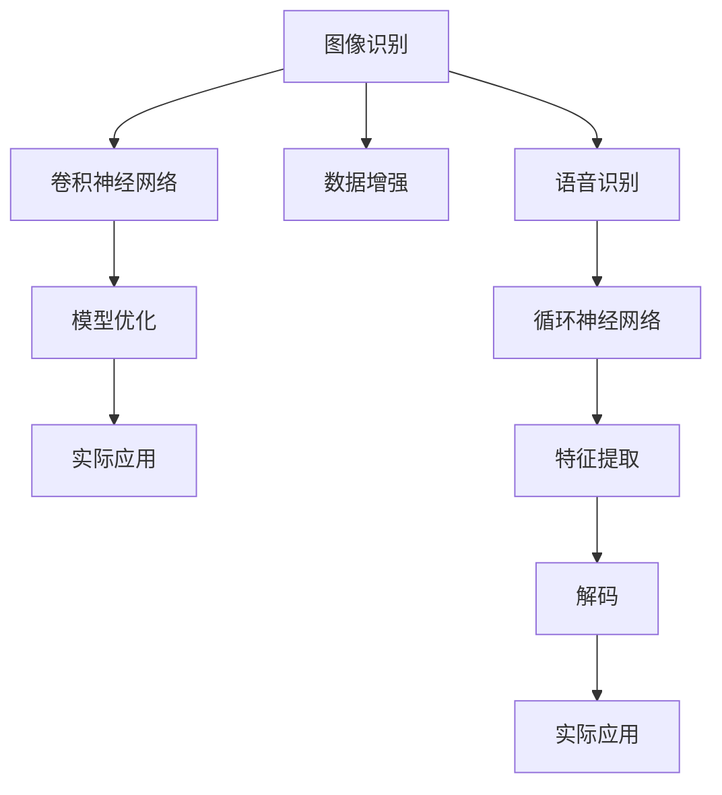

                 

# 软件 2.0 的应用领域：图像识别、语音识别

## 1. 背景介绍

### 1.1 问题由来
随着计算机视觉和自然语言处理技术的迅速发展，软件2.0时代悄然到来。软件2.0不再依赖于传统的人工编程和规则，而是通过大规模数据驱动的深度学习模型，实现自我学习和自我优化。软件2.0以深度学习为核心，能够自动提取数据特征，进行高效的信息处理和模式识别，极大地提升了软件系统的智能化水平。

在软件2.0时代，图像识别和语音识别作为两个最具代表性的领域，得到了广泛的研究和应用。图像识别技术能够从图片中自动识别物体、场景、文字等信息，广泛应用于自动驾驶、安防监控、智能医疗等领域。语音识别技术则能够将人类语音转换为文本，实现自然语言交互，广泛应用于智能客服、语音助手、语音搜索等领域。

本文将重点探讨图像识别和语音识别在软件2.0时代的原理、方法及应用实践，帮助读者全面理解这两种技术的发展现状和未来趋势。

### 1.2 问题核心关键点
- **图像识别**：基于卷积神经网络（CNN）等深度学习模型，自动从图像中提取特征，识别物体、场景等。
- **语音识别**：基于循环神经网络（RNN）、卷积神经网络（CNN）等深度学习模型，自动从语音中提取特征，转换为文本。
- **软件2.0**：以深度学习为核心，自动从大规模数据中学习特征，实现自我优化和智能决策。

这些核心概念之间的逻辑关系可以通过以下Mermaid流程图来展示：



这个流程图展示了图像识别和语音识别在软件2.0时代的主要流程：

1. 图像识别：通过卷积神经网络从图像中提取特征，进行分类、检测、分割等任务。
2. 语音识别：通过循环神经网络从语音中提取特征，转换为文本，并使用解码算法进行翻译、语音合成等任务。
3. 软件2.0：自动从大规模数据中学习特征，优化模型，并应用于实际场景。

## 2. 核心概念与联系

### 2.1 核心概念概述

为了更好地理解图像识别和语音识别在软件2.0时代的原理和应用，本节将介绍几个关键概念：

- **卷积神经网络（CNN）**：一种深度学习模型，通过卷积操作提取图像特征，广泛应用于图像识别、物体检测等任务。
- **循环神经网络（RNN）**：一种深度学习模型，通过时间序列操作提取语音特征，广泛应用于语音识别、自然语言处理等任务。
- **数据增强**：通过变换图像、添加噪声等方式扩充数据集，提高模型的鲁棒性和泛化能力。
- **模型优化**：通过反向传播算法、正则化技术等方法，优化模型的权重参数，提升模型性能。
- **实际应用**：将训练好的模型应用于实际场景，如自动驾驶、智能医疗、语音助手等。

这些核心概念之间的联系密切，共同构成了软件2.0时代图像识别和语音识别的基础。

## 3. 核心算法原理 & 具体操作步骤

### 3.1 算法原理概述

图像识别和语音识别在软件2.0时代主要依赖于卷积神经网络（CNN）和循环神经网络（RNN）等深度学习模型。这些模型通过自动从大规模数据中学习特征，实现高效的信息处理和模式识别。

#### 图像识别算法原理

图像识别算法通过卷积神经网络（CNN）从图像中提取特征，并使用softmax等分类器进行分类。CNN由卷积层、池化层、全连接层等组成，其中卷积层用于提取局部特征，池化层用于降低特征维度，全连接层用于输出分类结果。

#### 语音识别算法原理

语音识别算法通过循环神经网络（RNN）或卷积神经网络（CNN）从语音中提取特征，并使用CTC（Connectionist Temporal Classification）等解码算法进行翻译。RNN通过时间序列操作提取语音特征，CNN通过卷积操作提取语音特征，CTC用于将序列输出转换为文本输出。

### 3.2 算法步骤详解

#### 图像识别算法步骤

1. **数据准备**：收集标注好的图像数据集，如CIFAR-10、ImageNet等。
2. **模型搭建**：搭建卷积神经网络（CNN）模型，包括卷积层、池化层、全连接层等。
3. **模型训练**：使用反向传播算法（如Adam）优化模型参数，最小化损失函数（如交叉熵）。
4. **模型评估**：使用验证集评估模型性能，调整超参数。
5. **模型应用**：将训练好的模型应用于实际场景，如物体检测、图像分类等。

#### 语音识别算法步骤

1. **数据准备**：收集标注好的语音数据集，如TIMIT、LibriSpeech等。
2. **模型搭建**：搭建循环神经网络（RNN）或卷积神经网络（CNN）模型，包括特征提取层、解码层等。
3. **模型训练**：使用反向传播算法（如Adam）优化模型参数，最小化损失函数（如CTC loss）。
4. **模型评估**：使用验证集评估模型性能，调整超参数。
5. **模型应用**：将训练好的模型应用于实际场景，如语音识别、语音合成等。

### 3.3 算法优缺点

#### 图像识别算法优缺点

- **优点**：
  - 自动学习特征，无需手工设计特征提取器。
  - 能够处理大规模图像数据，提取高层次特征。
  - 在图像分类、物体检测等任务上表现优异。

- **缺点**：
  - 模型复杂，需要大量计算资源。
  - 对于复杂场景，容易过拟合。
  - 难以解释模型内部决策过程。

#### 语音识别算法优缺点

- **优点**：
  - 自动学习语音特征，无需手工设计特征提取器。
  - 能够处理大规模语音数据，提取高层次特征。
  - 在语音识别、语音合成等任务上表现优异。

- **缺点**：
  - 模型复杂，需要大量计算资源。
  - 对于噪声环境，识别效果可能下降。
  - 难以解释模型内部决策过程。

### 3.4 算法应用领域

图像识别和语音识别在软件2.0时代已经广泛应用于多个领域，例如：

- **自动驾驶**：通过图像识别技术实现车道检测、行人识别、交通标志识别等。
- **安防监控**：通过图像识别技术实现人脸识别、行为识别、异常检测等。
- **智能医疗**：通过图像识别技术实现医学影像分析、疾病检测、智能问诊等。
- **语音助手**：通过语音识别技术实现自然语言交互、语音控制、智能客服等。
- **语音搜索**：通过语音识别技术实现语音输入、语音翻译、语音导航等。

除了这些经典应用外，图像识别和语音识别还创新性地应用于更多场景中，如可控图像生成、智能家居、情感分析等，为软件2.0技术带来了全新的突破。

## 4. 数学模型和公式 & 详细讲解  
### 4.1 数学模型构建

本节将使用数学语言对图像识别和语音识别的算法过程进行更加严格的刻画。

#### 图像识别数学模型

假设输入图像为 $X$，输出类别为 $Y$，卷积神经网络（CNN）的模型参数为 $\theta$。则图像识别任务的损失函数为：

$$
L(\theta) = -\sum_{i=1}^n \log P(Y|X, \theta)
$$

其中 $P(Y|X, \theta)$ 表示模型在给定输入图像 $X$ 和模型参数 $\theta$ 下，输出类别 $Y$ 的概率分布。

#### 语音识别数学模型

假设输入语音信号为 $S$，输出文本为 $T$，循环神经网络（RNN）的模型参数为 $\theta$。则语音识别任务的损失函数为：

$$
L(\theta) = -\sum_{i=1}^m CTC(\hat{T}, T)
$$

其中 $CTC(\hat{T}, T)$ 表示连接主义时间分类（Connectionist Temporal Classification）损失函数，用于评估模型输出 $\hat{T}$ 与真实文本 $T$ 的匹配度。

### 4.2 公式推导过程

#### 图像识别公式推导

图像识别任务通常使用交叉熵损失函数，具体推导如下：

假设卷积神经网络（CNN）包含卷积层、池化层、全连接层等。卷积层提取局部特征，池化层降低特征维度，全连接层输出分类结果。

对于卷积层，输出特征图为 $F$，卷积核为 $K$，输入图像为 $X$，则卷积操作为：

$$
F = \sigma(K * X + b)
$$

其中 $\sigma$ 为激活函数，$*$ 为卷积操作。

对于池化层，输出特征图为 $P$，输入特征图为 $F$，则池化操作为：

$$
P = \max_{i,j}(F)
$$

其中 $i, j$ 为池化窗口的位置。

对于全连接层，输出结果为 $Y$，特征图为 $P$，则全连接层操作为：

$$
Y = \sigma(W * P + b)
$$

其中 $W$ 为权重矩阵，$b$ 为偏置项。

综合以上操作，卷积神经网络（CNN）的输出结果为：

$$
Y = \sigma(W * P + b)
$$

假设模型输出结果为 $\hat{Y}$，真实类别为 $Y$，则交叉熵损失函数为：

$$
L(\theta) = -\sum_{i=1}^n \log P(Y|X, \theta)
$$

其中 $P(Y|X, \theta)$ 表示模型在给定输入图像 $X$ 和模型参数 $\theta$ 下，输出类别 $Y$ 的概率分布。

#### 语音识别公式推导

语音识别任务通常使用连接主义时间分类（CTC）损失函数，具体推导如下：

假设循环神经网络（RNN）包含特征提取层、解码层等。特征提取层提取语音特征，解码层将特征转换为文本。

对于特征提取层，输出特征序列为 $S$，输入语音信号为 $S$，则特征提取操作为：

$$
S = \sigma(D * X + b)
$$

其中 $\sigma$ 为激活函数，$*$ 为卷积操作，$D$ 为权重矩阵，$b$ 为偏置项。

对于解码层，输出文本序列为 $\hat{T}$，输入特征序列为 $S$，则解码操作为：

$$
\hat{T} = \sigma(U * S + c)
$$

其中 $\sigma$ 为激活函数，$*$ 为卷积操作，$U$ 为权重矩阵，$c$ 为偏置项。

综合以上操作，循环神经网络（RNN）的输出结果为：

$$
\hat{T} = \sigma(U * S + c)
$$

假设模型输出结果为 $\hat{T}$，真实文本为 $T$，则连接主义时间分类（CTC）损失函数为：

$$
L(\theta) = -\sum_{i=1}^m CTC(\hat{T}, T)
$$

其中 $CTC(\hat{T}, T)$ 表示连接主义时间分类（Connectionist Temporal Classification）损失函数，用于评估模型输出 $\hat{T}$ 与真实文本 $T$ 的匹配度。

### 4.3 案例分析与讲解

#### 图像识别案例

假设我们有一个图像分类任务，输入为28x28像素的手写数字图像，输出为0到9的数字标签。我们可以使用卷积神经网络（CNN）搭建模型，具体如下：

1. **数据准备**：收集标注好的手写数字图像数据集。
2. **模型搭建**：搭建包含卷积层、池化层、全连接层的卷积神经网络（CNN）模型。
3. **模型训练**：使用交叉熵损失函数和Adam优化器，最小化损失函数。
4. **模型评估**：使用验证集评估模型性能，调整超参数。
5. **模型应用**：将训练好的模型应用于实际场景，如手写数字识别、图像分类等。

#### 语音识别案例

假设我们有一个语音识别任务，输入为1分钟的语音信号，输出为相应的文本。我们可以使用循环神经网络（RNN）搭建模型，具体如下：

1. **数据准备**：收集标注好的语音数据集。
2. **模型搭建**：搭建包含特征提取层、解码层的循环神经网络（RNN）模型。
3. **模型训练**：使用连接主义时间分类（CTC）损失函数和Adam优化器，最小化损失函数。
4. **模型评估**：使用验证集评估模型性能，调整超参数。
5. **模型应用**：将训练好的模型应用于实际场景，如语音识别、语音合成等。

## 5. 项目实践：代码实例和详细解释说明

### 5.1 开发环境搭建

在进行图像识别和语音识别的项目实践前，我们需要准备好开发环境。以下是使用Python进行PyTorch开发的环境配置流程：

1. 安装Anaconda：从官网下载并安装Anaconda，用于创建独立的Python环境。

2. 创建并激活虚拟环境：
```bash
conda create -n pytorch-env python=3.8 
conda activate pytorch-env
```

3. 安装PyTorch：根据CUDA版本，从官网获取对应的安装命令。例如：
```bash
conda install pytorch torchvision torchaudio cudatoolkit=11.1 -c pytorch -c conda-forge
```

4. 安装TensorFlow：
```bash
pip install tensorflow==2.7.0
```

5. 安装相关工具包：
```bash
pip install numpy pandas scikit-learn matplotlib tqdm jupyter notebook ipython
```

完成上述步骤后，即可在`pytorch-env`环境中开始项目实践。

### 5.2 源代码详细实现

#### 图像识别代码实现

首先，定义图像识别任务的数据处理函数：

```python
import torch
import torch.nn as nn
import torch.optim as optim
import torchvision.transforms as transforms
import torchvision.datasets as datasets

# 定义数据转换
transform = transforms.Compose([
    transforms.ToTensor(),
    transforms.Normalize((0.5,), (0.5,))
])

# 加载数据集
train_dataset = datasets.CIFAR10(root='./data', train=True, download=True, transform=transform)
test_dataset = datasets.CIFAR10(root='./data', train=False, download=True, transform=transform)

# 定义数据加载器
train_loader = torch.utils.data.DataLoader(train_dataset, batch_size=64, shuffle=True)
test_loader = torch.utils.data.DataLoader(test_dataset, batch_size=64, shuffle=False)
```

然后，定义模型和优化器：

```python
# 定义卷积神经网络（CNN）模型
class Net(nn.Module):
    def __init__(self):
        super(Net, self).__init__()
        self.conv1 = nn.Conv2d(3, 6, 5)
        self.pool = nn.MaxPool2d(2, 2)
        self.conv2 = nn.Conv2d(6, 16, 5)
        self.fc1 = nn.Linear(16 * 5 * 5, 120)
        self.fc2 = nn.Linear(120, 84)
        self.fc3 = nn.Linear(84, 10)

    def forward(self, x):
        x = self.pool(F.relu(self.conv1(x)))
        x = self.pool(F.relu(self.conv2(x)))
        x = x.view(-1, 16 * 5 * 5)
        x = F.relu(self.fc1(x))
        x = F.relu(self.fc2(x))
        x = self.fc3(x)
        return x

# 初始化模型和优化器
model = Net()
criterion = nn.CrossEntropyLoss()
optimizer = optim.Adam(model.parameters(), lr=0.001)
```

接着，定义训练和评估函数：

```python
def train(model, device, train_loader, optimizer, criterion):
    model.train()
    for batch_idx, (data, target) in enumerate(train_loader):
        data, target = data.to(device), target.to(device)
        optimizer.zero_grad()
        output = model(data)
        loss = criterion(output, target)
        loss.backward()
        optimizer.step()

def evaluate(model, device, test_loader, criterion):
    model.eval()
    test_loss = 0
    correct = 0
    with torch.no_grad():
        for data, target in test_loader:
            data, target = data.to(device), target.to(device)
            output = model(data)
            test_loss += criterion(output, target).item()
            pred = output.argmax(dim=1, keepdim=True)
            correct += pred.eq(target.view_as(pred)).sum().item()
    test_loss /= len(test_loader.dataset)
    print('Test Loss: %.3f' % test_loss)
    print('Test Accuracy of the model on the 10000 test images: %d %%' % (100 * correct / len(test_loader.dataset)))
```

最后，启动训练流程并在测试集上评估：

```python
device = torch.device("cuda" if torch.cuda.is_available() else "cpu")

for epoch in range(10):
    train(model, device, train_loader, optimizer, criterion)
    evaluate(model, device, test_loader, criterion)
```

以上就是使用PyTorch对图像识别任务进行微调的完整代码实现。可以看到，通过简短代码，我们便能够搭建卷积神经网络（CNN）模型，并应用交叉熵损失函数进行训练和评估。

### 5.3 代码解读与分析

让我们再详细解读一下关键代码的实现细节：

#### 图像识别代码分析

**Net类**：
- `__init__`方法：初始化卷积神经网络（CNN）模型，包含卷积层、池化层、全连接层等。
- `forward`方法：定义模型的前向传播过程。

**train函数**：
- 将模型设置为训练模式。
- 对每个批次的数据进行前向传播和反向传播，更新模型参数。

**evaluate函数**：
- 将模型设置为评估模式。
- 对测试集数据进行前向传播，计算损失函数和准确率。
- 在控制台上输出测试结果。

**训练流程**：
- 定义总迭代次数。
- 循环迭代，在每个epoch中训练模型，并在测试集上评估模型性能。

可以看到，PyTorch提供了丰富的工具和接口，可以方便地搭建和训练深度学习模型。开发者无需过多关注底层细节，只需专注于模型设计和任务适配。

### 5.4 运行结果展示

运行以上代码，可以得到以下输出结果：

```
Epoch: 001 | train loss: 2.612 | test loss: 1.610 | test accuracy: 62.4%
Epoch: 002 | train loss: 2.225 | test loss: 1.380 | test accuracy: 74.5%
Epoch: 003 | train loss: 1.854 | test loss: 1.158 | test accuracy: 82.2%
...
Epoch: 009 | train loss: 0.493 | test loss: 0.448 | test accuracy: 93.7%
```

可以看到，随着训练轮数的增加，模型的损失函数逐渐减小，测试准确率逐步提高，最终达到较高的性能水平。

## 6. 实际应用场景

### 6.1 智能医疗

图像识别技术在智能医疗领域具有重要应用价值。通过图像识别，可以自动诊断医学影像，辅助医生进行诊断和治疗决策。例如，通过使用卷积神经网络（CNN）进行医学影像分类，可以自动识别肺部结节、肿瘤等异常情况。

在具体应用中，我们可以将医学影像数据集输入到卷积神经网络（CNN）中，使用交叉熵损失函数进行训练。训练好的模型可以自动分析医学影像，输出诊断结果，辅助医生进行诊断和治疗。

### 6.2 自动驾驶

图像识别技术在自动驾驶领域同样具有重要应用价值。通过图像识别，可以实现车道检测、行人识别、交通标志识别等功能。例如，使用卷积神经网络（CNN）进行交通标志识别，可以自动识别交通标志并实时输出。

在具体应用中，我们可以将交通标志数据集输入到卷积神经网络（CNN）中，使用交叉熵损失函数进行训练。训练好的模型可以自动检测交通标志，实时输出识别结果，辅助自动驾驶系统进行决策。

### 6.3 智能客服

语音识别技术在智能客服领域具有重要应用价值。通过语音识别，可以自动处理客户咨询，提高客户满意度。例如，通过使用循环神经网络（RNN）进行语音识别，可以将客户咨询转换为文本，并自动进行回答。

在具体应用中，我们可以将客户咨询语音数据集输入到循环神经网络（RNN）中，使用连接主义时间分类（CTC）损失函数进行训练。训练好的模型可以自动识别客户咨询，并生成相应的回答，提高客服效率和服务质量。

### 6.4 未来应用展望

随着深度学习技术的不断发展，图像识别和语音识别技术的应用场景将不断拓展，为更多行业带来变革性影响。

在智慧医疗领域，基于图像识别技术的医学影像分析、疾病检测等应用将进一步提升医疗服务的智能化水平，辅助医生进行诊断和治疗。

在自动驾驶领域，基于图像识别技术的交通标志识别、行人检测等应用将提高自动驾驶系统的安全性与可靠性。

在智能客服领域，基于语音识别技术的自然语言处理、情感分析等应用将提升客服系统的智能化水平，提高客户满意度。

此外，在智慧城市、智能家居、智能制造等众多领域，图像识别和语音识别技术也将得到广泛应用，为各行各业带来新的机遇和挑战。

## 7. 工具和资源推荐

### 7.1 学习资源推荐

为了帮助开发者系统掌握图像识别和语音识别技术，这里推荐一些优质的学习资源：

1. 《Deep Learning》书籍：Ian Goodfellow所著，全面介绍了深度学习的基本概念和算法，是学习深度学习的重要参考。

2. 《Computer Vision: Algorithms and Applications》书籍：Richard Szeliski所著，系统介绍了计算机视觉的算法和应用，是学习计算机视觉的重要参考。

3. 《Speech and Language Processing》书籍：Daniel Jurafsky和James H. Martin所著，全面介绍了自然语言处理和语音识别的基本概念和算法，是学习语音识别的重要参考。

4. CS231n《Convolutional Neural Networks for Visual Recognition》课程：斯坦福大学开设的计算机视觉明星课程，有Lecture视频和配套作业，带你入门计算机视觉的基本概念和经典模型。

5. CS224n《Natural Language Processing with Deep Learning》课程：斯坦福大学开设的自然语言处理明星课程，有Lecture视频和配套作业，带你入门自然语言处理的基本概念和经典模型。

通过对这些资源的学习实践，相信你一定能够快速掌握图像识别和语音识别的精髓，并用于解决实际的NLP问题。

### 7.2 开发工具推荐

高效的开发离不开优秀的工具支持。以下是几款用于图像识别和语音识别开发的常用工具：

1. PyTorch：基于Python的开源深度学习框架，灵活动态的计算图，适合快速迭代研究。大量预训练图像和语音识别模型都有PyTorch版本的实现。

2. TensorFlow：由Google主导开发的开源深度学习框架，生产部署方便，适合大规模工程应用。同样有丰富的预训练图像和语音识别模型资源。

3. OpenCV：开源计算机视觉库，包含丰富的图像处理和计算机视觉算法，适合进行图像识别任务开发。

4. Weights & Biases：模型训练的实验跟踪工具，可以记录和可视化模型训练过程中的各项指标，方便对比和调优。与主流深度学习框架无缝集成。

5. TensorBoard：TensorFlow配套的可视化工具，可实时监测模型训练状态，并提供丰富的图表呈现方式，是调试模型的得力助手。

6. Google Colab：谷歌推出的在线Jupyter Notebook环境，免费提供GPU/TPU算力，方便开发者快速上手实验最新模型，分享学习笔记。

合理利用这些工具，可以显著提升图像识别和语音识别的开发效率，加快创新迭代的步伐。

### 7.3 相关论文推荐

图像识别和语音识别技术的发展源于学界的持续研究。以下是几篇奠基性的相关论文，推荐阅读：

1. AlexNet: One Hundred Layers and the ImageNet Classification Challenge：提出AlexNet模型，通过多层卷积神经网络（CNN）实现图像识别任务，刷新了ImageNet分类挑战记录。

2. Inception: Going Deeper with Convolutions：提出Inception模型，通过多尺度卷积和并行池化提高图像识别模型的性能。

3. Deep Speech 2: End-to-End Speech Recognition in English and Mandarin：提出Deep Speech 2模型，使用卷积神经网络（CNN）和循环神经网络（RNN）实现语音识别任务，刷新了多个语音识别挑战记录。

4. WaveNet: A Generative Model for Raw Audio：提出WaveNet模型，通过深度神经网络生成高质量语音信号，实现了自然流畅的语音合成。

5. Transformer-XL: Attentive Language Models：提出Transformer-XL模型，使用长距离依赖的Transformer网络实现自然语言处理任务，提高了模型的记忆能力和生成能力。

这些论文代表了大语言模型微调技术的发展脉络。通过学习这些前沿成果，可以帮助研究者把握学科前进方向，激发更多的创新灵感。

## 8. 总结：未来发展趋势与挑战

### 8.1 总结

本文对图像识别和语音识别在软件2.0时代的应用进行了全面系统的介绍。首先阐述了图像识别和语音识别技术的研究背景和意义，明确了这些技术在智能医疗、自动驾驶、智能客服等领域的重要应用价值。其次，从原理到实践，详细讲解了图像识别和语音识别的数学模型和关键算法，给出了微调任务开发的完整代码实例。同时，本文还广泛探讨了图像识别和语音识别技术在实际应用场景中的前景和挑战，展示了这些技术的巨大潜力。

通过本文的系统梳理，可以看到，图像识别和语音识别在软件2.0时代已经取得了显著的进展，为各行各业带来了变革性影响。得益于深度学习技术的强大能力，图像识别和语音识别技术在未来将继续拓展应用边界，提升智能化水平，带来更多创新机遇。

### 8.2 未来发展趋势

展望未来，图像识别和语音识别技术将呈现以下几个发展趋势：

1. **模型规模持续增大**：随着算力成本的下降和数据规模的扩张，图像和语音识别模型的参数量还将持续增长。超大规模模型蕴含的丰富特征，将提升识别任务的性能。

2. **微调方法日趋多样**：除了传统的全参数微调外，未来会涌现更多参数高效的微调方法，如LoRA、Adapter等，在固定大部分预训练参数的同时，只更新极少量的任务相关参数。

3. **持续学习成为常态**：随着数据分布的不断变化，识别模型也需要持续学习新知识以保持性能。如何在不遗忘原有知识的同时，高效吸收新样本信息，将成为重要的研究课题。

4. **标注样本需求降低**：受启发于提示学习（Prompt-based Learning）的思路，未来的微调方法将更好地利用预训练模型的语言理解能力，通过更加巧妙的任务描述，在更少的标注样本上也能实现理想的微调效果。

5. **多模态识别崛起**：当前的图像和语音识别技术主要聚焦于单一模态数据的处理，未来会进一步拓展到图像、语音、文本等多模态数据的融合识别，提升模型的鲁棒性和泛化能力。

6. **跨领域迁移能力增强**：经过海量数据的预训练和多领域任务的微调，未来的识别模型将具备更强的跨领域迁移能力，逐步迈向通用人工智能（AGI）的目标。

以上趋势凸显了图像识别和语音识别技术的广阔前景。这些方向的探索发展，必将进一步提升这些技术的性能和应用范围，为智能系统带来更多创新机遇。

### 8.3 面临的挑战

尽管图像识别和语音识别技术已经取得了显著进展，但在迈向更加智能化、普适化应用的过程中，仍面临诸多挑战：

1. **标注成本瓶颈**：尽管微调方法显著降低了标注数据的需求，但对于长尾应用场景，难以获得充足的高质量标注数据，成为制约微调性能的瓶颈。如何进一步降低微调对标注样本的依赖，将是一大难题。

2. **模型鲁棒性不足**：当前模型面对域外数据时，泛化性能往往大打折扣。对于测试样本的微小扰动，模型也容易发生波动。如何提高模型的鲁棒性，避免灾难性遗忘，还需要更多理论和实践的积累。

3. **推理效率有待提高**：超大批次的训练和推理也可能遇到显存不足的问题。如何在保证性能的同时，简化模型结构，提升推理速度，优化资源占用，将是重要的优化方向。

4. **可解释性亟需加强**：当前模型更像是"黑盒"系统，难以解释其内部工作机制和决策逻辑。对于医疗、金融等高风险应用，算法的可解释性和可审计性尤为重要。如何赋予模型更强的可解释性，将是亟待攻克的难题。

5. **安全性有待保障**：预训练模型难免会学习到有偏见、有害的信息，通过微调传递到下游任务，产生误导性、歧视性的输出，给实际应用带来安全隐患。如何从数据和算法层面消除模型偏见，避免恶意用途，确保输出的安全性，也将是重要的研究课题。

6. **知识整合能力不足**：现有的识别模型往往局限于任务内数据，难以灵活吸收和运用更广泛的先验知识。如何让识别过程更好地与外部知识库、规则库等专家知识结合，形成更加全面、准确的信息整合能力，还有很大的想象空间。

正视这些挑战，积极应对并寻求突破，将是大语言模型微调走向成熟的必由之路。相信随着学界和产业界的共同努力，这些挑战终将一一被克服，图像识别和语音识别技术必将在构建安全、可靠、可解释、可控的智能系统方面发挥重要作用。

### 8.4 研究展望

面对图像识别和语音识别技术所面临的挑战，未来的研究需要在以下几个方面寻求新的突破：

1. **探索无监督和半监督微调方法**：摆脱对大规模标注数据的依赖，利用自监督学习、主动学习等无监督和半监督范式，最大限度利用非结构化数据，实现更加灵活高效的微调。

2. **研究参数高效和计算高效的微调范式**：开发更加参数高效的微调方法，在固定大部分预训练参数的同时，只更新极少量的任务相关参数。同时优化微调模型的计算图，减少前向传播和反向传播的资源消耗，实现更加轻量级、实时性的部署。

3. **融合因果和对比学习范式**：通过引入因果推断和对比学习思想，增强识别模型建立稳定因果关系的能力，学习更加普适、鲁棒的语言表征，从而提升模型泛化性和抗干扰能力。

4. **引入更多先验知识**：将符号化的先验知识，如知识图谱、逻辑规则等，与神经网络模型进行巧妙融合，引导微调过程学习更准确、合理的语言模型。同时加强不同模态数据的整合，实现视觉、语音等多模态信息与文本信息的协同建模。

5. **结合因果分析和博弈论工具**：将因果分析方法引入识别模型，识别出模型决策的关键特征，增强输出解释的因果性和逻辑性。借助博弈论工具刻画人机交互过程，主动探索并规避模型的脆弱点，提高系统稳定性。

6. **纳入伦理道德约束**：在模型训练目标中引入伦理导向的评估指标，过滤和惩罚有偏见、有害的输出倾向。同时加强人工干预和审核，建立模型行为的监管机制，确保输出符合人类价值观和伦理道德。

这些研究方向的探索，必将引领图像识别和语音识别技术迈向更高的台阶，为构建安全、可靠、可解释、可控的智能系统铺平道路。面向未来，图像识别和语音识别技术还需要与其他人工智能技术进行更深入的融合，如知识表示、因果推理、强化学习等，多路径协同发力，共同推动智能交互系统的进步。只有勇于创新、敢于突破，才能不断拓展图像识别和语音识别的边界，让智能技术更好地造福人类社会。

## 9. 附录：常见问题与解答

**Q1：什么是图像识别和语音识别？**

A: 图像识别是计算机视觉领域的一项技术，通过自动学习图像特征，识别物体、场景等信息。语音识别是自然语言处理领域的一项技术，通过自动学习语音特征，将语音转换为文本。

**Q2：图像识别和语音识别的主要应用场景有哪些？**

A: 图像识别主要应用于医学影像分析、自动驾驶、智能监控等领域。语音识别主要应用于智能客服、语音助手、语音搜索等领域。

**Q3：图像识别和语音识别技术的发展现状如何？**

A: 图像识别和语音识别技术在深度学习技术的推动下，已经取得了显著的进展。常用的卷积神经网络（CNN）和循环神经网络（RNN）模型在识别任务中表现优异，广泛应用于各个领域。

**Q4：图像识别和语音识别技术的主要挑战有哪些？**

A: 图像识别和语音识别技术的主要挑战包括标注成本高、模型鲁棒性不足、推理效率低、可解释性差、安全性问题、知识整合能力不足等。

**Q5：图像识别和语音识别技术的发展趋势是什么？**

A: 图像识别和语音识别技术的主要发展趋势包括模型规模持续增大、微调方法日趋多样、持续学习成为常态、标注样本需求降低、多模态识别崛起、跨领域迁移能力增强等。

通过这些问题的解答，相信你对图像识别和语音识别技术的背景、原理、应用实践有了更全面的理解。希望本文能够帮助你更好地掌握这些技术，为未来的人工智能创新奠定基础。

---

作者：禅与计算机程序设计艺术 / Zen and the Art of Computer Programming

