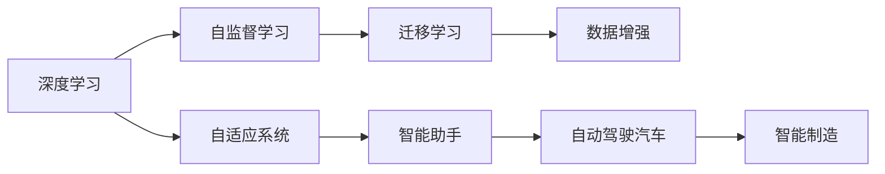

                 

# 软件 2.0 的应用：从实验室走向现实

> 关键词：软件2.0, 人工智能(AI), 深度学习, 自监督学习, 数据增强, 迁移学习, 自适应系统, 案例研究

## 1. 背景介绍

### 1.1 问题由来

随着技术的进步，AI和机器学习在过去十年中经历了爆炸性的发展。特别是深度学习领域，基于神经网络的模型在视觉识别、语音识别、自然语言处理等领域取得了显著突破。这些进步催生了新一代软件模型——软件2.0（Software 2.0），它以自我学习和优化为核心，能够自动适应环境变化，无需手动编写代码即可运行和优化。软件2.0的出现，标志着计算机软件从人工编程转向自动学习的重大转折。

在软件2.0的时代，人们可以享受到由AI驱动的自动化、智能化和自适应软件带来的便利，这些软件能够自我诊断、自我优化，并且能够处理更加复杂的问题。从智能助手到自动驾驶汽车，软件2.0的应用范围正在不断扩大，逐步从实验室走向现实世界。

### 1.2 问题核心关键点

软件2.0的关键点在于其能够自动从数据中学习并优化，从而实现自我适应的能力。这种自我学习能力主要依赖于深度学习技术，特别是自监督学习和迁移学习。

- **自监督学习**：使用大规模无标签数据进行自我训练，使得模型能够学习到数据的内在结构。
- **迁移学习**：将在一个任务上学习到的知识迁移到另一个任务上，从而提升模型在特定任务上的表现。
- **数据增强**：通过各种方法丰富训练数据，使得模型对输入的微小变化具有鲁棒性。
- **自适应系统**：系统能够根据环境变化和反馈信息不断调整自身的行为策略。

软件2.0的这些特性使其在实际应用中具有强大的潜力和广泛的适用性，能够实现复杂的自动化任务，极大地提升工作效率和智能化水平。

## 2. 核心概念与联系

### 2.1 核心概念概述

软件2.0基于深度学习和自动化技术，实现自我学习和优化。其核心概念包括：

- **深度学习**：通过神经网络模型从数据中学习特征，实现复杂的模式识别和预测。
- **自监督学习**：使用未标注数据进行自我学习，无需人工干预。
- **迁移学习**：将模型在特定任务上学习到的知识迁移到新任务中。
- **数据增强**：通过各种技术手段增加训练数据的多样性，提高模型的泛化能力。
- **自适应系统**：能够根据环境变化和反馈信息动态调整自身的行为策略。

### 2.2 核心概念联系

这些核心概念通过以下逻辑关系联系起来：



这些概念通过深度学习技术的自我学习能力、迁移学习的能力适应新任务，以及数据增强、自适应系统的自适应能力，形成了一个相互支撑的完整框架。

## 3. 核心算法原理 & 具体操作步骤

### 3.1 算法原理概述

软件2.0的核心算法包括深度学习、自监督学习和迁移学习。其基本原理如下：

- **深度学习**：通过多层次的神经网络模型，自动从数据中学习特征，实现复杂的模式识别和预测。
- **自监督学习**：利用未标注数据进行自我训练，学习数据的内在结构，从而提升模型的泛化能力。
- **迁移学习**：将在一个任务上学习到的知识迁移到另一个任务上，从而提高模型在新任务上的表现。

### 3.2 算法步骤详解

软件2.0的算法步骤通常包括以下几个关键环节：

1. **数据准备**：收集和预处理数据，包括数据清洗、归一化和增强等。
2. **模型构建**：选择合适的深度学习模型，如卷积神经网络、循环神经网络或Transformer等。
3. **自监督学习**：使用未标注数据进行自我训练，学习数据的内在结构。
4. **迁移学习**：在特定任务上使用迁移学习，将模型在新任务上进一步微调。
5. **数据增强**：通过各种技术手段增加训练数据的多样性，提高模型的鲁棒性。
6. **模型评估**：使用测试集对模型进行评估，调整超参数以优化模型性能。

### 3.3 算法优缺点

软件2.0的算法具有以下优点：

- **高效**：自监督学习和迁移学习可以显著提升模型的泛化能力和适应性，无需人工编写代码。
- **可扩展性**：通过自适应系统，模型能够根据环境变化和反馈信息不断调整自身的行为策略。

然而，软件2.0也存在一些缺点：

- **数据依赖**：自监督学习和迁移学习对数据的质量和多样性有较高的要求，数据获取和预处理成本较高。
- **模型复杂性**：深度学习模型的结构复杂，训练和推理计算量大，对硬件资源的要求较高。
- **缺乏可解释性**：深度学习模型往往是"黑盒"系统，缺乏解释性，难以理解和调试。

### 3.4 算法应用领域

软件2.0的应用领域非常广泛，以下是几个典型的应用场景：

- **智能助手**：如ChatGPT、Siri等，能够根据用户输入自动回答问题、提供建议，具备自我学习和优化能力。
- **自动驾驶汽车**：通过深度学习算法对摄像头和传感器数据进行实时分析和决策，具备自我学习和优化能力。
- **智能制造**：通过深度学习算法对生产线数据进行分析和优化，实现自适应生产管理。
- **医疗诊断**：通过深度学习算法对医学图像和数据进行分析和诊断，具备自我学习和优化能力。

## 4. 数学模型和公式 & 详细讲解 & 举例说明

### 4.1 数学模型构建

软件2.0的核心数学模型通常基于深度学习框架，如PyTorch、TensorFlow等。以卷积神经网络（CNN）为例，其基本数学模型如下：

$$
y = \sigma(\mathbf{W}x + \mathbf{b})
$$

其中，$x$ 表示输入数据，$y$ 表示输出，$\mathbf{W}$ 和 $\mathbf{b}$ 为模型的权重和偏置项，$\sigma$ 为激活函数。

### 4.2 公式推导过程

以自监督学习中的掩码语言模型（Masked Language Modeling, MLM）为例，其推导过程如下：

1. 首先，将训练集中的每个样本中的部分单词随机遮盖，生成掩码序列 $M$。
2. 然后，模型根据未遮盖的单词序列 $x$ 和掩码序列 $M$，预测被遮盖的单词序列 $y$。
3. 最后，计算预测结果 $y$ 与真实结果 $x$ 的交叉熵损失，并反向传播更新模型参数。

### 4.3 案例分析与讲解

以自然语言处理中的文本分类为例，使用BERT模型进行迁移学习。其步骤如下：

1. 使用大规模无标签文本数据对BERT模型进行预训练，学习语言的通用表示。
2. 收集特定任务的标注数据集 $D=\{(x_i, y_i)\}_{i=1}^N$，其中 $x_i$ 为输入文本，$y_i$ 为分类标签。
3. 将BERT模型的顶部分类器替换为适合该任务的分类器，并使用标注数据集 $D$ 对模型进行微调。
4. 使用测试集对微调后的模型进行评估，调整模型参数以优化性能。

## 5. 项目实践：代码实例和详细解释说明

### 5.1 开发环境搭建

以下是使用Python和PyTorch搭建软件2.0开发环境的步骤：

1. 安装Anaconda：
   ```bash
   conda create -n pytorch-env python=3.8 
   conda activate pytorch-env
   ```

2. 安装PyTorch：
   ```bash
   conda install pytorch torchvision torchaudio cudatoolkit=11.1 -c pytorch -c conda-forge
   ```

3. 安装Transformer库：
   ```bash
   pip install transformers
   ```

4. 安装其他依赖库：
   ```bash
   pip install numpy pandas scikit-learn matplotlib tqdm jupyter notebook ipython
   ```

### 5.2 源代码详细实现

以下是一个简单的代码实现，用于对BERT模型进行文本分类微调：

```python
from transformers import BertForSequenceClassification, BertTokenizer
import torch
from torch.utils.data import DataLoader
from torch.nn import CrossEntropyLoss
from sklearn.metrics import accuracy_score

# 加载BERT模型和分词器
model = BertForSequenceClassification.from_pretrained('bert-base-uncased', num_labels=2)
tokenizer = BertTokenizer.from_pretrained('bert-base-uncased')

# 准备数据集
def prepare_data(texts, labels):
    tokenized_texts = [tokenizer(text, padding='max_length', truncation=True) for text in texts]
    inputs = tokenizer.batch_encode_plus(tokenized_texts, max_length=512, pad_to_max_length=True, return_tensors='pt')
    labels = torch.tensor(labels)
    return inputs, labels

# 定义数据加载器
train_dataset = prepare_data(train_texts, train_labels)
dev_dataset = prepare_data(dev_texts, dev_labels)
test_dataset = prepare_data(test_texts, test_labels)

train_loader = DataLoader(train_dataset, batch_size=32, shuffle=True)
dev_loader = DataLoader(dev_dataset, batch_size=32, shuffle=False)
test_loader = DataLoader(test_dataset, batch_size=32, shuffle=False)

# 定义模型和损失函数
criterion = CrossEntropyLoss()
optimizer = torch.optim.Adam(model.parameters(), lr=2e-5)

# 训练模型
model.train()
for epoch in range(10):
    for inputs, labels in train_loader:
        outputs = model(**inputs)
        loss = criterion(outputs.logits, labels)
        optimizer.zero_grad()
        loss.backward()
        optimizer.step()
    model.eval()
    with torch.no_grad():
        dev_loss = 0
        for inputs, labels in dev_loader:
            outputs = model(**inputs)
            loss = criterion(outputs.logits, labels)
            dev_loss += loss.item()
        dev_loss /= len(dev_loader)
        print(f'Epoch {epoch+1}, dev loss: {dev_loss:.4f}')
    if dev_loss < best_dev_loss:
        best_dev_loss = dev_loss
        torch.save(model.state_dict(), 'model.pt')
```

### 5.3 代码解读与分析

这段代码主要实现了BERT模型在文本分类任务上的微调过程。其核心步骤如下：

1. 加载预训练的BERT模型和分词器。
2. 准备训练集、验证集和测试集数据，并进行数据预处理。
3. 定义数据加载器，将数据集划分为批处理大小为32的小批量数据。
4. 定义模型和损失函数，使用Adam优化器进行模型参数更新。
5. 在训练集上循环迭代，进行前向传播和反向传播。
6. 在验证集上计算模型损失，保存最优模型。

通过这个简单的代码实例，可以直观地理解软件2.0在实际项目中的实现过程。

### 5.4 运行结果展示

运行上述代码后，输出验证集上的损失值，可以观察到模型的收敛过程。最终保存的最优模型可以在测试集上进行评估，得到分类精度等性能指标。

## 6. 实际应用场景

### 6.1 智能助手

智能助手如ChatGPT、Siri等，能够根据用户的自然语言输入自动回答问题、提供建议。软件2.0使这些智能助手具备自我学习和优化能力，能够不断改进其回答质量，提供更加个性化和智能化的服务。

### 6.2 自动驾驶汽车

自动驾驶汽车通过软件2.0算法对摄像头和传感器数据进行实时分析和决策，具备自我学习和优化能力。在实际驾驶过程中，系统能够根据环境变化和反馈信息不断调整自身的行为策略，实现更安全、更高效的驾驶。

### 6.3 智能制造

智能制造通过软件2.0算法对生产线数据进行分析和优化，实现自适应生产管理。系统能够根据生产过程中的数据反馈不断调整生产参数，优化生产效率和质量。

### 6.4 医疗诊断

软件2.0算法对医学图像和数据进行分析和诊断，具备自我学习和优化能力。在医疗诊断过程中，系统能够根据医生的反馈不断改进诊断模型，提高诊断的准确性和效率。

## 7. 工具和资源推荐

### 7.1 学习资源推荐

为了帮助开发者系统掌握软件2.0的理论基础和实践技巧，这里推荐一些优质的学习资源：

1. **《深度学习》课程**：斯坦福大学的在线课程，讲解深度学习的基本原理和应用，适合初学者和进阶者。
2. **Transformers库文档**：HuggingFace开发的NLP工具库，提供了大量预训练模型和微调样例代码，是学习软件2.0的必备资料。
3. **《Python深度学习》书籍**：涉及深度学习、自监督学习、迁移学习等关键技术，适合深入学习。
4. **Kaggle竞赛平台**：提供大量公开数据集和竞赛任务，适合实践和验证所学技术。
5. **arXiv预印本网站**：关注最新的深度学习研究论文，跟踪前沿技术进展。

### 7.2 开发工具推荐

高效的开发离不开优秀的工具支持。以下是几款用于软件2.0开发常用的工具：

1. **PyTorch**：基于Python的开源深度学习框架，灵活动态的计算图，适合快速迭代研究。
2. **TensorFlow**：由Google主导开发的开源深度学习框架，生产部署方便，适合大规模工程应用。
3. **Jupyter Notebook**：强大的交互式开发环境，支持Python、R等多种编程语言，适合探索性和实验性研究。
4. **Weights & Biases**：模型训练的实验跟踪工具，可以记录和可视化模型训练过程中的各项指标，方便对比和调优。
5. **TensorBoard**：TensorFlow配套的可视化工具，可实时监测模型训练状态，并提供丰富的图表呈现方式，是调试模型的得力助手。

### 7.3 相关论文推荐

软件2.0的发展源于学界的持续研究。以下是几篇奠基性的相关论文，推荐阅读：

1. **ImageNet Classification with Deep Convolutional Neural Networks**：提出卷积神经网络（CNN），开创了深度学习在视觉识别领域的应用。
2. **Attention is All You Need**：提出Transformer结构，开启了NLP领域的预训练大模型时代。
3. **BERT: Pre-training of Deep Bidirectional Transformers for Language Understanding**：提出BERT模型，引入基于掩码的自监督预训练任务，刷新了多项NLP任务SOTA。
4. **GPT-2**：展示了大规模语言模型的强大zero-shot学习能力，引发了对于通用人工智能的新一轮思考。
5. **SAM: Self-supervised Adaptive Model**：提出自适应模型，结合自监督学习和迁移学习，实现高效自动优化。

这些论文代表了大语言模型和软件2.0的发展脉络。通过学习这些前沿成果，可以帮助研究者把握学科前进方向，激发更多的创新灵感。

## 8. 总结：未来发展趋势与挑战

### 8.1 研究成果总结

软件2.0作为新一代软件模型，其核心技术包括深度学习、自监督学习和迁移学习。这些技术使得软件2.0能够自动从数据中学习并优化，实现自我适应的能力。软件2.0已经在智能助手、自动驾驶、智能制造、医疗诊断等领域取得了广泛应用，展示了其强大的潜力和广泛的适用性。

### 8.2 未来发展趋势

展望未来，软件2.0将呈现以下几个发展趋势：

1. **模型规模持续增大**：随着算力成本的下降和数据规模的扩张，预训练语言模型的参数量还将持续增长。超大规模语言模型蕴含的丰富语言知识，有望支撑更加复杂多变的下游任务微调。
2. **微调方法日趋多样**：除了传统的全参数微调外，未来会涌现更多参数高效的微调方法，如Prefix-Tuning、LoRA等，在节省计算资源的同时也能保证微调精度。
3. **持续学习成为常态**：随着数据分布的不断变化，软件2.0模型也需要持续学习新知识以保持性能。如何在不遗忘原有知识的同时，高效吸收新样本信息，将成为重要的研究课题。
4. **标注样本需求降低**：受启发于提示学习(Prompt-based Learning)的思路，未来的微调方法将更好地利用软件2.0的语言理解能力，通过更加巧妙的任务描述，在更少的标注样本上也能实现理想的微调效果。
5. **多模态微调崛起**：当前的微调主要聚焦于纯文本数据，未来会进一步拓展到图像、视频、语音等多模态数据微调。多模态信息的融合，将显著提升语言模型对现实世界的理解和建模能力。
6. **模型通用性增强**：经过海量数据的预训练和多领域任务的微调，未来的软件2.0模型将具备更强大的常识推理和跨领域迁移能力，逐步迈向通用人工智能(AGI)的目标。

### 8.3 面临的挑战

尽管软件2.0已经取得了显著进展，但在迈向更加智能化、普适化应用的过程中，仍面临诸多挑战：

1. **数据获取成本高**：软件2.0对数据的质量和多样性有较高要求，数据获取和预处理成本较高。
2. **模型复杂性高**：深度学习模型结构复杂，训练和推理计算量大，对硬件资源的要求较高。
3. **缺乏可解释性**：深度学习模型往往是"黑盒"系统，缺乏解释性，难以理解和调试。
4. **泛化能力不足**：软件2.0模型在新领域和新任务上的泛化能力有待提升。
5. **安全性和可靠性**：软件2.0模型在实际应用中可能存在安全性漏洞和可靠性问题，需要进一步研究和改进。

### 8.4 研究展望

针对软件2.0面临的挑战，未来的研究需要在以下几个方面寻求新的突破：

1. **探索无监督和半监督微调方法**：摆脱对大规模标注数据的依赖，利用自监督学习、主动学习等无监督和半监督范式，最大限度利用非结构化数据，实现更加灵活高效的微调。
2. **研究参数高效和计算高效的微调范式**：开发更加参数高效的微调方法，在固定大部分预训练参数的同时，只更新极少量的任务相关参数。同时优化微调模型的计算图，减少前向传播和反向传播的资源消耗，实现更加轻量级、实时性的部署。
3. **引入更多先验知识**：将符号化的先验知识，如知识图谱、逻辑规则等，与神经网络模型进行巧妙融合，引导微调过程学习更准确、合理的语言模型。同时加强不同模态数据的整合，实现视觉、语音等多模态信息与文本信息的协同建模。
4. **结合因果分析和博弈论工具**：将因果分析方法引入微调模型，识别出模型决策的关键特征，增强输出解释的因果性和逻辑性。借助博弈论工具刻画人机交互过程，主动探索并规避模型的脆弱点，提高系统稳定性。
5. **纳入伦理道德约束**：在模型训练目标中引入伦理导向的评估指标，过滤和惩罚有偏见、有害的输出倾向。同时加强人工干预和审核，建立模型行为的监管机制，确保输出符合人类价值观和伦理道德。

这些研究方向的探索，必将引领软件2.0技术迈向更高的台阶，为构建安全、可靠、可解释、可控的智能系统铺平道路。面向未来，软件2.0还需要与其他人工智能技术进行更深入的融合，如知识表示、因果推理、强化学习等，多路径协同发力，共同推动自然语言理解和智能交互系统的进步。

## 9. 附录：常见问题与解答

**Q1：软件2.0是否适用于所有应用场景？**

A: 软件2.0技术在许多应用场景中都能取得显著效果，尤其是在数据驱动和智能决策的场景中。但在一些需要高度定制和人工干预的领域，如手工艺、艺术创作等，软件2.0的适用性可能有限。

**Q2：软件2.0的训练和推理效率如何？**

A: 软件2.0的训练和推理效率受多种因素影响，如模型复杂度、数据大小和硬件资源。在硬件资源充足的情况下，软件2.0的训练和推理效率可以接近甚至超过传统机器学习模型。

**Q3：软件2.0是否需要大量标注数据？**

A: 软件2.0的训练过程可以通过自监督学习等技术减少对标注数据的依赖。但一些特定任务，如自然语言生成、情感分析等，仍然需要一定量的标注数据进行微调。

**Q4：软件2.0模型的可解释性如何？**

A: 软件2.0模型的可解释性是当前研究的热点之一。目前有多种方法，如LIME、SHAP等，可以用于解释深度学习模型的决策过程，帮助理解和调试模型。

**Q5：软件2.0在实际应用中如何优化性能？**

A: 软件2.0模型的性能优化可以通过多种方式实现，如调整超参数、优化模型结构、引入数据增强等。此外，利用迁移学习和持续学习技术，可以使模型不断适应新任务和新数据，保持性能的稳定性。

---

作者：禅与计算机程序设计艺术 / Zen and the Art of Computer Programming

