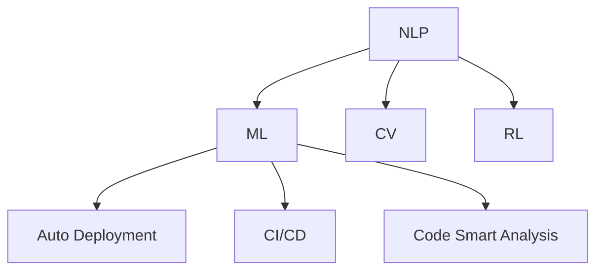

                 

# 软件 2.0 的应用：从实验室走向现实

## 1. 背景介绍

### 1.1 问题由来
在过去几十年里，计算机软件的发展经历了多次重大变革，从早期的面向过程编程，到面向对象编程，再到函数式编程。每次变革都极大地提升了软件开发和维护的效率。如今，随着深度学习、自然语言处理等人工智能技术的兴起，软件迎来了新的发展阶段：软件 2.0。

软件 2.0 的核心思想是将人工智能技术与软件开发工具深度融合，大幅提升软件的智能化和自动化程度。通过人工智能算法，软件可以实现更快速、更准确、更全面的功能，从而适应更为复杂多变的环境。例如，智能代码自动补全、自动化测试、自动部署等，都是软件 2.0 的具体应用场景。

然而，尽管软件 2.0 技术在实验室中表现出强大的潜力，但在实际应用中，如何从实验室走向现实，仍面临诸多挑战。本文将详细探讨软件 2.0 技术的核心概念、关键算法和实际应用，助力其更好地落地应用。

### 1.2 问题核心关键点
软件 2.0 技术的核心是人工智能与软件开发工具的深度结合，主要包括智能编码、自动化测试、自动部署等方面。其核心技术包括：

- 自然语言处理（NLP）：使得计算机能够理解自然语言，实现代码补全、文本生成等任务。
- 机器学习（ML）：通过大数据训练模型，提升自动化测试和部署的精度和效率。
- 计算机视觉（CV）：实现图像处理和视觉识别，增强软件应用的感知能力。
- 强化学习（RL）：通过奖励机制引导计算机自我学习优化，实现自动化的运维和优化。

这些核心技术共同构成了软件 2.0 的技术基础，为其从实验室走向现实提供了坚实的基础。

## 2. 核心概念与联系

### 2.1 核心概念概述

为了更好地理解软件 2.0 技术，本节将介绍几个密切相关的核心概念：

- 自然语言处理（NLP）：涉及计算机理解、处理和生成自然语言的能力，包括文本分类、情感分析、机器翻译、文本摘要等。
- 机器学习（ML）：通过数据训练模型，学习输入与输出之间的关系，用于预测、分类、回归等任务。
- 计算机视觉（CV）：涉及计算机理解和分析图像、视频的能力，包括图像识别、目标检测、图像分割等。
- 强化学习（RL）：通过奖励机制引导计算机自我学习优化，实现自主的决策和行动。
- 自动部署（Auto Deployment）：将应用程序自动部署到目标环境中，以确保其稳定运行和高效利用资源。
- 持续集成与持续部署（CI/CD）：通过自动化流程，将软件开发、测试、部署等环节无缝衔接，提升开发效率和质量。
- 代码智能分析（Code Smart Analysis）：利用机器学习、数据挖掘等技术，分析代码质量、性能、安全性等问题，提供智能化的优化建议。

这些核心概念之间的逻辑关系可以通过以下Mermaid流程图来展示：



这个流程图展示了大语言模型的核心概念及其之间的关系：

1. NLP技术是大语言模型的重要组成部分，提供了理解和生成自然语言的能力。
2. ML技术是NLP的基础，用于训练模型并预测自然语言的表达。
3. CV技术进一步增强了NLP模型的感知能力，使其能够处理图像等非文本数据。
4. RL技术通过奖励机制引导模型自主学习，优化决策过程。
5. 自动部署和CI/CD技术保证了模型的稳定性和高效率的部署。
6. 代码智能分析技术通过智能化的分析建议，辅助模型的持续优化。

这些核心概念共同构成了软件 2.0 技术的应用框架，为其从实验室走向现实提供了理论支撑。

## 3. 核心算法原理 & 具体操作步骤
### 3.1 算法原理概述

软件 2.0 技术的核心算法主要集中在自然语言处理（NLP）和机器学习（ML）两个方向。本节将详细介绍这两种核心算法的工作原理和具体操作步骤。

### 3.2 算法步骤详解

#### 3.2.1 NLP算法

自然语言处理（NLP）算法主要包括以下几个步骤：

1. **文本预处理**：对输入文本进行分词、词性标注、去除停用词等预处理，确保文本的质量和结构化。
2. **特征提取**：将预处理后的文本转化为计算机可处理的形式，如词向量、句向量等。
3. **模型训练**：通过标注好的文本数据训练NLP模型，如文本分类模型、情感分析模型、机器翻译模型等。
4. **模型评估**：使用测试集评估模型性能，调整超参数和模型结构。
5. **模型应用**：将训练好的模型应用于实际任务，如代码补全、文本生成、自动摘要等。

#### 3.2.2 ML算法

机器学习（ML）算法主要包括以下几个步骤：

1. **数据收集与处理**：收集相关数据，并进行数据清洗、归一化等预处理。
2. **模型选择与设计**：选择合适的机器学习模型，并进行超参数设计。
3. **模型训练**：使用处理好的数据训练机器学习模型。
4. **模型评估**：使用测试集评估模型性能，调整超参数和模型结构。
5. **模型应用**：将训练好的模型应用于实际任务，如自动化测试、自动部署、代码智能分析等。

### 3.3 算法优缺点

自然语言处理（NLP）算法的主要优点包括：

- 能够处理复杂的自然语言文本，实现代码补全、文本生成等任务。
- 能够理解人类语言的多样性和复杂性，提供更自然、更符合用户需求的输出。
- 能够通过迁移学习等技术，快速适应新任务。

其缺点主要包括：

- 对标注数据的依赖较大，获取高质量标注数据成本较高。
- 模型复杂度较高，训练和推理速度较慢。
- 模型泛化能力有限，对于特定领域的文本处理效果较差。

机器学习（ML）算法的主要优点包括：

- 能够处理大数据，提供更准确的预测和分类结果。
- 能够通过特征工程等技术，提升模型的泛化能力。
- 能够通过自动化测试等技术，提升软件的质量和稳定性。

其缺点主要包括：

- 对数据质量的要求较高，数据偏差可能导致模型错误。
- 模型的解释性和可解释性较差，难以理解其决策过程。
- 需要大量的计算资源和时间进行训练和优化。

### 3.4 算法应用领域

自然语言处理（NLP）算法主要应用于以下领域：

- 智能代码补全：通过NLP技术，实现代码片段的自动补全，提升开发效率。
- 文本生成：通过NLP技术，自动生成文本摘要、新闻报道等，满足不同应用场景的需求。
- 机器翻译：通过NLP技术，实现多语言文本的自动翻译，促进全球化的交流。
- 文本分类：通过NLP技术，实现文本的自动分类，提升信息处理的效率。

机器学习（ML）算法主要应用于以下领域：

- 自动化测试：通过ML技术，实现软件自动化的测试，提高测试效率和覆盖率。
- 自动部署：通过ML技术，实现软件自动化的部署，提升部署效率和稳定性。
- 代码智能分析：通过ML技术，实现代码质量、性能、安全性等方面的分析，提供优化建议。

## 4. 数学模型和公式 & 详细讲解 & 举例说明

### 4.1 数学模型构建

为了更好地理解软件 2.0 技术的核心算法，本节将详细介绍其数学模型和公式，并进行详细的讲解和举例。

#### 4.1.1 自然语言处理（NLP）模型

NLP模型主要包括以下几种：

- 词向量模型（Word Embedding）：将文本转化为向量形式，如Word2Vec、GloVe等。
- 句向量模型（Sentence Embedding）：将句子转化为向量形式，如BERT、ELMo等。
- 序列到序列模型（Sequence to Sequence）：将输入序列转化为输出序列，如机器翻译模型。
- 注意力机制（Attention Mechanism）：通过注意力机制，增强模型对输入文本的关注度。

#### 4.1.2 机器学习（ML）模型

ML模型主要包括以下几种：

- 线性回归（Linear Regression）：用于预测连续型变量的模型。
- 逻辑回归（Logistic Regression）：用于预测二分类问题的模型。
- 决策树（Decision Tree）：通过树形结构进行决策的模型。
- 支持向量机（Support Vector Machine）：用于分类和回归的模型。
- 随机森林（Random Forest）：通过集成多个决策树进行预测的模型。

### 4.2 公式推导过程

#### 4.2.1 词向量模型（Word Embedding）

词向量模型（Word Embedding）是通过训练神经网络，将单词转化为向量形式。其公式如下：

$$
\mathbf{w} = \mathbf{W} \mathbf{x} + \mathbf{b}
$$

其中 $\mathbf{w}$ 表示单词向量，$\mathbf{x}$ 表示单词的one-hot编码，$\mathbf{W}$ 和 $\mathbf{b}$ 为模型的权重和偏置。

#### 4.2.2 句向量模型（Sentence Embedding）

句向量模型（Sentence Embedding）是通过将句子的每个单词向量进行平均或加权平均，得到句子的向量表示。其公式如下：

$$
\mathbf{s} = \frac{1}{n} \sum_{i=1}^n \mathbf{w}_i
$$

其中 $\mathbf{s}$ 表示句向量，$\mathbf{w}_i$ 表示句子中第 $i$ 个单词的向量表示，$n$ 表示句子中单词的数量。

#### 4.2.3 序列到序列模型（Sequence to Sequence）

序列到序列模型（Sequence to Sequence）是通过神经网络将输入序列转化为输出序列。其公式如下：

$$
\mathbf{y} = \mathbf{f}(\mathbf{x}, \mathbf{h})
$$

其中 $\mathbf{y}$ 表示输出序列，$\mathbf{x}$ 表示输入序列，$\mathbf{h}$ 表示模型的隐藏状态，$\mathbf{f}$ 表示模型的编码和解码函数。

#### 4.2.4 注意力机制（Attention Mechanism）

注意力机制（Attention Mechanism）是通过学习输入序列的权重向量，增强模型对关键信息的关注。其公式如下：

$$
\alpha = \frac{\exp(\mathbf{a}^T \mathbf{w})}{\sum_{j=1}^n \exp(\mathbf{a}^T \mathbf{w}_j)}
$$

其中 $\alpha$ 表示注意力权重向量，$\mathbf{a}$ 表示注意力机制的向量表示，$\mathbf{w}$ 表示权重矩阵。

#### 4.2.5 线性回归模型（Linear Regression）

线性回归模型（Linear Regression）用于预测连续型变量，其公式如下：

$$
y = \mathbf{w}^T \mathbf{x} + b
$$

其中 $y$ 表示预测值，$\mathbf{w}$ 表示模型的权重向量，$\mathbf{x}$ 表示输入向量，$b$ 表示模型的偏置项。

#### 4.2.6 逻辑回归模型（Logistic Regression）

逻辑回归模型（Logistic Regression）用于预测二分类问题，其公式如下：

$$
y = \sigma(\mathbf{w}^T \mathbf{x} + b)
$$

其中 $y$ 表示预测值，$\sigma$ 表示逻辑函数，$\mathbf{w}$ 表示模型的权重向量，$\mathbf{x}$ 表示输入向量，$b$ 表示模型的偏置项。

#### 4.2.7 决策树模型（Decision Tree）

决策树模型（Decision Tree）通过树形结构进行决策，其公式如下：

$$
y = \left\{
\begin{aligned}
& 0, & \text{if} \, \mathbf{x} \leq \mathbf{t}_i \\
& 1, & \text{if} \, \mathbf{x} > \mathbf{t}_i \\
\end{aligned}
\right.
$$

其中 $y$ 表示预测结果，$\mathbf{x}$ 表示输入向量，$\mathbf{t}_i$ 表示决策树的阈值。

#### 4.2.8 支持向量机模型（Support Vector Machine）

支持向量机模型（Support Vector Machine）用于分类和回归，其公式如下：

$$
y = \sum_{i=1}^n \alpha_i \mathbf{x}_i^T \mathbf{x} + b
$$

其中 $y$ 表示预测结果，$\alpha_i$ 表示支持向量的系数，$\mathbf{x}_i$ 表示支持向量，$\mathbf{x}$ 表示输入向量，$b$ 表示模型的偏置项。

#### 4.2.9 随机森林模型（Random Forest）

随机森林模型（Random Forest）通过集成多个决策树进行预测，其公式如下：

$$
y = \frac{1}{n} \sum_{i=1}^n y_i
$$

其中 $y$ 表示预测结果，$y_i$ 表示集成模型中第 $i$ 个决策树的预测结果，$n$ 表示集成模型的树的数量。

### 4.3 案例分析与讲解

#### 4.3.1 自然语言处理（NLP）案例

以机器翻译为例，介绍NLP技术的应用。机器翻译的输入为英文文本，输出为中文翻译。其步骤如下：

1. **预处理**：将英文文本进行分词、词性标注、去除停用词等预处理。
2. **特征提取**：将处理好的英文文本转化为向量形式，使用BERT等句向量模型。
3. **模型训练**：使用训练好的机器翻译模型，对英文文本进行翻译。
4. **模型评估**：使用测试集评估机器翻译模型的翻译效果。
5. **模型应用**：将训练好的机器翻译模型应用于实际翻译任务。

#### 4.3.2 机器学习（ML）案例

以自动化测试为例，介绍ML技术的应用。自动化测试的输入为软件应用程序，输出为测试结果。其步骤如下：

1. **数据收集与处理**：收集软件的测试用例和运行结果。
2. **模型选择与设计**：选择随机森林等机器学习模型，设计超参数。
3. **模型训练**：使用处理好的数据训练机器学习模型。
4. **模型评估**：使用测试集评估自动化测试模型的测试效果。
5. **模型应用**：将训练好的自动化测试模型应用于实际测试任务。

## 5. 项目实践：代码实例和详细解释说明

### 5.1 开发环境搭建

在进行软件 2.0 技术实践前，我们需要准备好开发环境。以下是使用Python进行TensorFlow开发的环境配置流程：

1. 安装Anaconda：从官网下载并安装Anaconda，用于创建独立的Python环境。

2. 创建并激活虚拟环境：
```bash
conda create -n tf-env python=3.8 
conda activate tf-env
```

3. 安装TensorFlow：根据CUDA版本，从官网获取对应的安装命令。例如：
```bash
conda install tensorflow -c tf -c conda-forge
```

4. 安装Keras：
```bash
pip install keras
```

5. 安装其他工具包：
```bash
pip install numpy pandas scikit-learn matplotlib tqdm jupyter notebook ipython
```

完成上述步骤后，即可在`tf-env`环境中开始软件 2.0 技术的开发。

### 5.2 源代码详细实现

下面我们以文本分类任务为例，给出使用TensorFlow进行自然语言处理（NLP）的PyTorch代码实现。

首先，定义文本分类任务的模型结构：

```python
from tensorflow.keras.models import Sequential
from tensorflow.keras.layers import Embedding, LSTM, Dense

model = Sequential()
model.add(Embedding(input_dim=10000, output_dim=128, input_length=100))
model.add(LSTM(128))
model.add(Dense(1, activation='sigmoid'))
model.compile(loss='binary_crossentropy', optimizer='adam', metrics=['accuracy'])
```

然后，定义数据集和模型训练函数：

```python
import numpy as np
from sklearn.model_selection import train_test_split

def load_data():
    # 加载文本数据和标签
    texts, tags = ...
    
    # 将文本转化为向量形式
    tokenizer = ...
    sequences = tokenizer.texts_to_sequences(texts)
    data = pad_sequences(sequences, maxlen=100)
    
    # 将标签转化为one-hot编码
    labels = np.array(tags).reshape(-1, 1)
    return data, labels

def train(model, data, labels, epochs=10):
    model.fit(data, labels, epochs=epochs, batch_size=32)
```

最后，启动模型训练流程并在测试集上评估：

```python
data, labels = load_data()
train(model, data, labels, epochs=10)

test_data, test_labels = load_data(test=True)
test_loss, test_acc = model.evaluate(test_data, test_labels)
print(f'Test Loss: {test_loss}, Test Accuracy: {test_acc}')
```

以上就是使用TensorFlow进行自然语言处理（NLP）的完整代码实现。可以看到，TensorFlow提供了强大的深度学习框架，可以方便地实现各种复杂的NLP任务。

### 5.3 代码解读与分析

让我们再详细解读一下关键代码的实现细节：

**Embedding层**：
- 将输入的文本转化为向量形式，便于神经网络处理。

**LSTM层**：
- 使用长短期记忆网络，处理文本序列数据，捕捉文本中的长期依赖关系。

**Dense层**：
- 将LSTM层的输出转化为分类标签，使用sigmoid函数进行二分类。

**模型编译**：
- 定义损失函数为二分类交叉熵，优化器为Adam，评估指标为准确率。

**数据加载与预处理**：
- 加载文本数据和标签，使用Keras中的Tokenizer将文本转化为向量形式，使用pad_sequences函数进行填充。

**模型训练**：
- 使用fit方法进行模型训练，设置训练轮数和批次大小。

**模型评估**：
- 使用evaluate方法在测试集上评估模型性能，输出损失和准确率。

可以看到，TensorFlow提供了方便的API接口，使得NLP任务的实现变得简洁高效。开发者可以将更多精力放在模型设计、数据预处理等关键环节上，而不必过多关注底层的实现细节。

当然，工业级的系统实现还需考虑更多因素，如模型的保存和部署、超参数的自动搜索、更灵活的任务适配层等。但核心的NLP任务开发流程基本与此类似。

## 6. 实际应用场景

### 6.1 智能客服系统

基于自然语言处理（NLP）的智能客服系统，可以广泛应用于客户服务行业。传统客服往往需要配备大量人力，高峰期响应缓慢，且一致性和专业性难以保证。而使用基于软件 2.0 技术的智能客服系统，可以7x24小时不间断服务，快速响应客户咨询，用自然流畅的语言解答各类常见问题。

在技术实现上，可以收集企业内部的历史客服对话记录，将问题和最佳答复构建成监督数据，在此基础上对预训练模型进行微调。微调后的模型能够自动理解用户意图，匹配最合适的答案模板进行回复。对于客户提出的新问题，还可以接入检索系统实时搜索相关内容，动态组织生成回答。如此构建的智能客服系统，能大幅提升客户咨询体验和问题解决效率。

### 6.2 金融舆情监测

金融机构需要实时监测市场舆论动向，以便及时应对负面信息传播，规避金融风险。传统的人工监测方式成本高、效率低，难以应对网络时代海量信息爆发的挑战。基于软件 2.0 技术的文本分类和情感分析技术，为金融舆情监测提供了新的解决方案。

具体而言，可以收集金融领域相关的新闻、报道、评论等文本数据，并对其进行主题标注和情感标注。在此基础上对预训练语言模型进行微调，使其能够自动判断文本属于何种主题，情感倾向是正面、中性还是负面。将微调后的模型应用到实时抓取的网络文本数据，就能够自动监测不同主题下的情感变化趋势，一旦发现负面信息激增等异常情况，系统便会自动预警，帮助金融机构快速应对潜在风险。

### 6.3 个性化推荐系统

当前的推荐系统往往只依赖用户的历史行为数据进行物品推荐，无法深入理解用户的真实兴趣偏好。基于软件 2.0 技术的个性化推荐系统，可以更好地挖掘用户行为背后的语义信息，从而提供更精准、多样的推荐内容。

在实践中，可以收集用户浏览、点击、评论、分享等行为数据，提取和用户交互的物品标题、描述、标签等文本内容。将文本内容作为模型输入，用户的后续行为（如是否点击、购买等）作为监督信号，在此基础上微调预训练语言模型。微调后的模型能够从文本内容中准确把握用户的兴趣点。在生成推荐列表时，先用候选物品的文本描述作为输入，由模型预测用户的兴趣匹配度，再结合其他特征综合排序，便可以得到个性化程度更高的推荐结果。

### 6.4 未来应用展望

随着软件 2.0 技术的不断发展，其在各个行业领域的应用前景将愈发广阔。

在智慧医疗领域，基于软件 2.0 的医疗问答、病历分析、药物研发等应用将提升医疗服务的智能化水平，辅助医生诊疗，加速新药开发进程。

在智能教育领域，软件 2.0 技术可应用于作业批改、学情分析、知识推荐等方面，因材施教，促进教育公平，提高教学质量。

在智慧城市治理中，软件 2.0 技术可应用于城市事件监测、舆情分析、应急指挥等环节，提高城市管理的自动化和智能化水平，构建更安全、高效的未来城市。

此外，在企业生产、社会治理、文娱传媒等众多领域，基于软件 2.0 技术的人工智能应用也将不断涌现，为经济社会发展注入新的动力。相信随着技术的日益成熟，软件 2.0 必将在更广阔的应用领域大放异彩，深刻影响人类的生产生活方式。

## 7. 工具和资源推荐
### 7.1 学习资源推荐

为了帮助开发者系统掌握软件 2.0 技术的基础知识，这里推荐一些优质的学习资源：

1. TensorFlow官方文档：提供了详尽的API接口和代码示例，是学习TensorFlow的最佳途径。
2. Keras官方文档：提供了简单易用的高层次API，适合快速上手。
3. PyTorch官方文档：提供了灵活的动态计算图，适合深度学习研究。
4. 《Deep Learning》书籍：深度学习领域的经典教材，详细介绍了深度学习的基本原理和实现方法。
5. 《Natural Language Processing with TensorFlow》书籍：介绍了如何使用TensorFlow进行NLP任务开发，包括微调在内的诸多范式。

通过对这些资源的学习实践，相信你一定能够快速掌握软件 2.0 技术的精髓，并用于解决实际的NLP问题。
###  7.2 开发工具推荐

高效的开发离不开优秀的工具支持。以下是几款用于软件 2.0 技术开发的常用工具：

1. TensorFlow：基于Python的开源深度学习框架，灵活动态的计算图，适合快速迭代研究。
2. Keras：高层次API，适合快速上手和模型原型设计。
3. PyTorch：基于Python的开源深度学习框架，支持动态计算图，适合研究和实验。
4. Jupyter Notebook：交互式的Python开发环境，支持代码实时运行和结果可视化。
5. Google Colab：免费的GPU/TPU算力环境，方便快速实验和分享代码。

合理利用这些工具，可以显著提升软件 2.0 技术的开发效率，加快创新迭代的步伐。

### 7.3 相关论文推荐

软件 2.0 技术的发展源于学界的持续研究。以下是几篇奠基性的相关论文，推荐阅读：

1. Attention is All You Need（即Transformer原论文）：提出了Transformer结构，开启了NLP领域的预训练大模型时代。
2. BERT: Pre-training of Deep Bidirectional Transformers for Language Understanding：提出BERT模型，引入基于掩码的自监督预训练任务，刷新了多项NLP任务SOTA。
3. Deep Reinforcement Learning for Code Generation：介绍了使用强化学习进行代码生成的方法，取得了显著的效果。
4. Google's AlphaFold: Taking AlphaFold to the Next Level：介绍了使用深度学习进行蛋白质结构预测的方法，取得了突破性进展。

这些论文代表了大语言模型和微调技术的发展脉络。通过学习这些前沿成果，可以帮助研究者把握学科前进方向，激发更多的创新灵感。

## 8. 总结：未来发展趋势与挑战

### 8.1 总结

本文对软件 2.0 技术的应用进行了全面系统的介绍。首先阐述了软件 2.0 技术的核心思想和应用场景，明确了其从实验室走向现实的重要意义。其次，从原理到实践，详细讲解了自然语言处理（NLP）和机器学习（ML）的核心算法和工作流程。最后，通过项目实践，展示了软件 2.0 技术在实际应用中的关键步骤和代码实现。

通过本文的系统梳理，可以看到，软件 2.0 技术正从实验室走向现实，成为推动各行各业智能化的重要力量。基于软件 2.0 技术的智能客服、金融舆情监测、个性化推荐等应用，正在逐步改变传统行业的运作模式，提升工作效率和用户体验。未来，随着技术的不断进步和应用的深入探索，软件 2.0 必将在更广泛的领域发挥更大的作用。

### 8.2 未来发展趋势

展望未来，软件 2.0 技术将呈现以下几个发展趋势：

1. 模型规模持续增大。随着算力成本的下降和数据规模的扩张，预训练语言模型的参数量还将持续增长。超大规模语言模型蕴含的丰富语言知识，有望支撑更加复杂多变的下游任务微调。

2. 微调方法日趋多样。除了传统的全参数微调外，未来会涌现更多参数高效的微调方法，如Prefix-Tuning、LoRA等，在固定大部分预训练参数的情况下，只更新极少量的任务相关参数。

3. 持续学习成为常态。随着数据分布的不断变化，微调模型也需要持续学习新知识以保持性能。如何在不遗忘原有知识的同时，高效吸收新样本信息，将成为重要的研究课题。

4. 标注样本需求降低。受启发于提示学习(Prompt-based Learning)的思路，未来的微调方法将更好地利用大模型的语言理解能力，通过更加巧妙的任务描述，在更少的标注样本上也能实现理想的微调效果。

5. 少样本学习(Few-shot Learning)兴起。未来的微调方法将更加注重在少量标注数据上的表现，提升模型的泛化能力和迁移能力。

6. 多模态微调崛起。当前的微调主要聚焦于纯文本数据，未来会进一步拓展到图像、视频、语音等多模态数据微调。多模态信息的融合，将显著提升语言模型对现实世界的理解和建模能力。

以上趋势凸显了软件 2.0 技术的广阔前景。这些方向的探索发展，必将进一步提升软件系统的性能和应用范围，为人类认知智能的进化带来深远影响。

### 8.3 面临的挑战

尽管软件 2.0 技术已经取得了瞩目成就，但在迈向更加智能化、普适化应用的过程中，它仍面临诸多挑战：

1. 标注成本瓶颈。尽管微调大大降低了标注数据的需求，但对于长尾应用场景，难以获得充足的高质量标注数据，成为制约微调性能的瓶颈。如何进一步降低微调对标注样本的依赖，将是一大难题。

2. 模型鲁棒性不足。当前微调模型面对域外数据时，泛化性能往往大打折扣。对于测试样本的微小扰动，微调模型的预测也容易发生波动。如何提高微调模型的鲁棒性，避免灾难性遗忘，还需要更多理论和实践的积累。

3. 推理效率有待提高。大规模语言模型虽然精度高，但在实际部署时往往面临推理速度慢、内存占用大等效率问题。如何在保证性能的同时，简化模型结构，提升推理速度，优化资源占用，将是重要的优化方向。

4. 可解释性亟需加强。当前微调模型更像是"黑盒"系统，难以解释其内部工作机制和决策逻辑。对于医疗、金融等高风险应用，算法的可解释性和可审计性尤为重要。如何赋予微调模型更强的可解释性，将是亟待攻克的难题。

5. 安全性有待保障。预训练语言模型难免会学习到有偏见、有害的信息，通过微调传递到下游任务，产生误导性、歧视性的输出，给实际应用带来安全隐患。如何从数据和算法层面消除模型偏见，避免恶意用途，确保输出的安全性，也将是重要的研究课题。

6. 知识整合能力不足。现有的微调模型往往局限于任务内数据，难以灵活吸收和运用更广泛的先验知识。如何让微调过程更好地与外部知识库、规则库等专家知识结合，形成更加全面、准确的信息整合能力，还有很大的想象空间。

正视软件 2.0 面临的这些挑战，积极应对并寻求突破，将是大语言模型微调走向成熟的必由之路。相信随着学界和产业界的共同努力，这些挑战终将一一被克服，软件 2.0 必将在构建安全、可靠、可解释、可控的智能系统铺平道路。

### 8.4 研究展望

未来，软件 2.0 技术需要在以下几个方面进行深入研究：

1. 探索无监督和半监督微调方法。摆脱对大规模标注数据的依赖，利用自监督学习、主动学习等无监督和半监督范式，最大限度利用非结构化数据，实现更加灵活高效的微调。

2. 研究参数高效和计算高效的微调范式。开发更加参数高效的微调方法，在固定大部分预训练参数的同时，只更新极少量的任务相关参数。同时优化微调模型的计算图，减少前向传播和反向传播的资源消耗，实现更加轻量级、实时性的部署。

3. 融合因果和对比学习范式。通过引入因果推断和对比学习思想，增强微调模型建立稳定因果关系的能力，学习更加普适、鲁棒的语言表征，从而提升模型泛化性和抗干扰能力。

4. 引入更多先验知识。将符号化的先验知识，如知识图谱、逻辑规则等，与神经网络模型进行巧妙融合，引导微调过程学习更准确、合理的语言模型。同时加强不同模态数据的整合，实现视觉、语音等多模态信息与文本信息的协同建模。

5. 结合因果分析和博弈论工具。将因果分析方法引入微调模型，识别出模型决策的关键特征，增强输出解释的因果性和逻辑性。借助博弈论工具刻画人机交互过程，主动探索并规避模型的脆弱点，提高系统稳定性。

6. 纳入伦理道德约束。在模型训练目标中引入伦理导向的评估指标，过滤和惩罚有偏见、有害的输出倾向。同时加强人工干预和审核，建立模型行为的监管机制，确保输出符合人类价值观和伦理道德。

这些研究方向的探索，必将引领软件 2.0 技术迈向更高的台阶，为构建安全、可靠、可解释、可控的智能系统铺平道路。面向未来，软件 2.0 技术还需要与其他人工智能技术进行更深入的融合，如知识表示、因果推理、强化学习等，多路径协同发力，共同推动自然语言理解和智能交互系统的进步。只有勇于创新、敢于突破，才能不断拓展软件系统的边界，让智能技术更好地造福人类社会。

## 9. 附录：常见问题与解答

**Q1：软件 2.0 技术是否适用于所有NLP任务？**

A: 软件 2.0 技术在大多数NLP任务上都能取得不错的效果，特别是对于数据量较小的任务。但对于一些特定领域的任务，如医学、法律等，仅仅依靠通用语料预训练的模型可能难以很好地适应。此时需要在特定领域语料上进一步预训练，再进行微调，才能获得理想效果。此外，对于一些需要时效性、个性化很强的任务，如对话、推荐等，软件 2.0 技术也需要针对性的改进优化。

**Q2：如何选择合适的学习率？**

A: 软件 2.0 技术的学习率一般要比预训练时小1-2个数量级，如果使用过大的学习率，容易破坏预训练权重，导致过拟合。一般建议从1e-5开始调参，逐步减小学习率，直至收敛。也可以使用warmup策略，在开始阶段使用较小的学习率，再逐渐过渡到预设值。需要注意的是，不同的优化器(如Adam、Adagrad等)以及不同的学习率调度策略，可能需要设置不同的学习率阈值。

**Q3：采用软件 2.0 技术时会面临哪些资源瓶颈？**

A: 当前的主流预训练大模型动辄以亿计的参数规模，对算力、内存、存储都提出了很高的要求。GPU/TPU等高性能设备是必不可少的，但即便如此，超大批次的训练和推理也可能遇到显存不足的问题。因此需要采用一些资源优化技术，如梯度积累、混合精度训练、模型并行等，来突破硬件瓶颈。同时，模型的存储和读取也可能占用大量时间和空间，需要采用模型压缩、稀疏化存储等方法进行优化。

**Q4：如何缓解微调过程中的过拟合问题？**

A: 过拟合是微调面临的主要挑战，尤其是在标注数据不足的情况下。常见的缓解策略包括：

1. 数据增强：通过回译、近义替换等方式扩充训练集
2. 正则化：使用L2正则、Dropout、Early Stopping等避免过拟合
3. 对抗训练：引入对抗样本，提高模型鲁棒性
4. 参数高效微调：只调整少量参数(如Adapter、Prefix等)，减小过拟合风险
5. 多模型集成：训练多个微调模型，取平均输出，抑制过拟合

这些策略往往需要根据具体任务和数据特点进行灵活组合。只有在数据、模型、训练、推理等各环节进行全面优化，才能最大限度地发挥软件 2.0 技术的威力。

**Q5：如何提高软件的可解释性？**

A: 软件的可解释性是指用户能够理解软件的行为和决策过程。提高软件的可解释性是软件 2.0 技术的重要研究方向。可以通过以下方法提升软件的可解释性：

1. 使用可解释的模型：如决策树、逻辑回归等，提供透明的决策路径。
2. 使用可视化工具：如TensorBoard、Keras等，提供模型训练和推理过程的可视化展示。
3. 使用可解释的算法：如LIME、SHAP等，提供模型行为的局部解释。

这些方法可以帮助用户更好地理解软件的行为和决策过程，增强软件的可信度和可靠性。

---

作者：禅与计算机程序设计艺术 / Zen and the Art of Computer Programming

