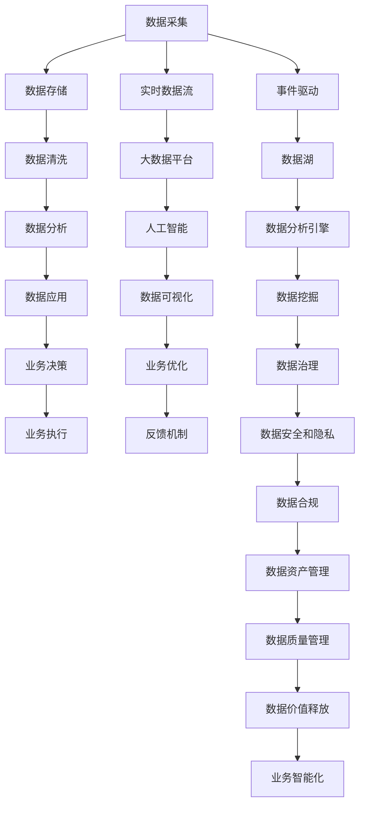

                 

# 软件 2.0 的时代：数据驱动一切

## 1. 背景介绍

在过去的几十年里，软件行业经历了一次又一次的变革，从早期的应用程序开发到基于服务架构、微服务架构，再到如今的软件 2.0 时代。这一时代，数据不再是简单的输入输出，而是成为了驱动软件发展的核心力量。无论是AI、大数据、物联网还是区块链，都离不开数据的深度参与和驱动。软件 2.0 时代，数据不仅仅是数据的汇集，更是智能决策、自动化处理、创新应用的基础。

## 2. 核心概念与联系

### 2.1 核心概念概述

在软件 2.0 的时代，数据驱动一切，涵盖了从数据采集、数据存储、数据处理、数据分析到数据应用的各个环节。本文将探讨以下几个核心概念及其联系：

- **数据驱动**：指在软件开发和应用中，决策和行为基于数据的分析和挖掘，而非传统的人为经验或直觉。
- **大数据**：涉及处理和分析大规模、多样化的数据集，利用先进的数据分析技术和工具，发现隐藏在数据中的价值和模式。
- **人工智能**：结合数据科学、计算机科学和数学等领域的知识，使机器具备模拟、延伸和扩展人的智能能力。
- **数据仓库**：集中存储和管理各种数据源的数据，支持数据的聚合、分析和决策。
- **云计算**：提供弹性、按需、基于互联网的计算资源和服务，支持数据的存储、处理和分析。
- **微服务架构**：将应用拆分成多个小的、独立的服务，支持数据的高效管理和处理。

### 2.2 核心概念原理和架构的 Mermaid 流程图



此流程图展示了数据驱动的完整链路，从数据采集到应用，再回到决策和执行，形成了一个闭环的反馈机制。每个环节都有其独特的价值和作用，共同支撑起软件 2.0 时代的数据驱动架构。

## 3. 核心算法原理 & 具体操作步骤

### 3.1 算法原理概述

软件 2.0 时代的数据驱动，核心在于如何利用数据进行决策、优化和创新。这一过程涉及从数据的采集、清洗、分析到应用的各个环节，每一步都需要精心设计和算法支持。

**数据采集**：通过传感器、日志、API接口等方式，从各种数据源中获取原始数据。这一过程需要高效的数据采集工具和算法，确保数据的完整性和实时性。

**数据清洗**：处理数据中的噪音、缺失、异常等问题，保证数据的准确性和一致性。常用的算法包括数据去重、数据转换、数据归一化等。

**数据分析**：利用统计学、机器学习等算法，对数据进行分析和挖掘，发现数据中的模式、趋势和规律。这一过程需要高效的数据分析引擎和算法，支持复杂的统计分析和预测。

**数据应用**：将分析结果应用于业务决策和执行中，实现智能决策和自动化处理。这一过程需要高效的数据处理和算法，支持数据的实时处理和响应。

### 3.2 算法步骤详解

下面以一个简单的示例，详细讲解数据驱动的各个步骤和算法。

**步骤1：数据采集**

采集一个电商网站的销售数据，包括时间戳、用户ID、商品ID、订单ID、订单金额等。可以使用Python的requests库和API接口，获取数据源的信息。

```python
import requests
import json

url = 'https://api.example.com/sales'
response = requests.get(url)
data = json.loads(response.text)
```

**步骤2：数据清洗**

清洗数据中的缺失值和异常值，保证数据的完整性和一致性。使用Python的Pandas库，处理缺失值和异常值。

```python
import pandas as pd

df = pd.DataFrame(data)
df.fillna(method='ffill', inplace=True)  # 前向填充缺失值
df.drop_duplicates(inplace=True)  # 删除重复数据
df = df[(df['amount'] > 0)]  # 删除订单金额为0的异常值
```

**步骤3：数据分析**

对数据进行统计分析，发现订单的销售趋势和用户行为模式。使用Python的Numpy和Scipy库，进行数据分析。

```python
import numpy as np
from scipy import stats

# 订单数量分布
df.groupby('date')['amount'].count().plot()

# 用户行为模式
df.groupby(['user_id', 'date'])['amount'].sum().plot()

# 商品销售趋势
df.groupby(['product_id', 'date'])['amount'].sum().plot()
```

**步骤4：数据应用**

根据分析结果，优化库存管理和用户推荐系统。使用Python的Flask框架，搭建Web应用，提供数据分析结果和决策建议。

```python
from flask import Flask, jsonify

app = Flask(__name__)

@app.route('/sales')
def get_sales():
    return jsonify(df.to_dict(orient='records'))

if __name__ == '__main__':
    app.run(host='0.0.0.0', port=5000)
```

### 3.3 算法优缺点

数据驱动的算法具有以下优点：

- **高效性**：通过数据驱动的决策，可以快速响应市场变化，提高业务效率。
- **精准性**：数据驱动的决策基于数据和算法，减少了人为经验和直觉的干扰，提高了决策的准确性。
- **可扩展性**：数据驱动的架构可以支持大规模数据处理，支持业务的快速扩展和迭代。

但同时也存在以下缺点：

- **数据依赖性**：数据驱动的决策依赖于数据的完整性和准确性，一旦数据出现偏差，决策也会受到影响。
- **算法复杂性**：数据驱动的决策需要复杂的算法和技术支持，对团队的技术能力要求较高。
- **成本高昂**：数据采集、清洗、存储和分析需要投入大量的人力和财力，成本较高。

### 3.4 算法应用领域

数据驱动的算法在各个领域都有广泛应用，例如：

- **电商**：通过分析用户的购买行为和历史数据，优化推荐系统和库存管理。
- **金融**：通过分析市场数据和交易数据，进行风险控制和投资决策。
- **医疗**：通过分析患者的历史数据和治疗结果，优化诊疗方案和疾病预测。
- **物流**：通过分析运输数据和订单数据，优化路线和配送方案。
- **交通**：通过分析交通数据和气象数据，优化交通流和路线规划。

## 4. 数学模型和公式 & 详细讲解 & 举例说明

### 4.1 数学模型构建

在数据驱动的算法中，常见的数学模型包括统计模型、机器学习模型和深度学习模型。以下是几个典型的数学模型：

- **线性回归模型**：用于预测连续型数据的回归模型，如订单金额的预测。
- **分类模型**：用于预测分类结果的模型，如用户是否购买商品的分类。
- **聚类模型**：用于将数据分组或分类的模型，如用户的分类。
- **时间序列模型**：用于分析时间序列数据的模型，如销售趋势的预测。

### 4.2 公式推导过程

以线性回归模型为例，其公式推导过程如下：

$$
y = \beta_0 + \beta_1 x_1 + \beta_2 x_2 + ... + \beta_n x_n + \epsilon
$$

其中，$y$为预测值，$x_1, x_2, ..., x_n$为自变量，$\beta_0, \beta_1, ..., \beta_n$为回归系数，$\epsilon$为误差项。

利用最小二乘法，可以得到回归系数的估计值：

$$
\hat{\beta} = (X^T X)^{-1} X^T y
$$

其中，$X$为自变量的矩阵，$y$为因变量的向量。

### 4.3 案例分析与讲解

假设我们有一个电商平台的订单数据，包含订单ID、用户ID、商品ID、订单金额等字段。我们想要预测每个用户的购买金额，可以使用线性回归模型。

**步骤1：数据准备**

将订单数据转换为格式化的数据框，并进行特征工程，生成自变量和因变量。

```python
import pandas as pd

df = pd.read_csv('sales.csv')
X = df[['user_id', 'product_id']]
y = df['amount']
```

**步骤2：模型训练**

使用Scikit-learn库，训练线性回归模型，并输出回归系数的估计值。

```python
from sklearn.linear_model import LinearRegression
from sklearn.metrics import mean_squared_error

model = LinearRegression()
model.fit(X, y)
y_pred = model.predict(X)
mse = mean_squared_error(y, y_pred)
```

**步骤3：结果分析**

评估模型的预测效果，并分析回归系数的意义。

```python
print('均方误差：', mse)
print('回归系数：', model.coef_)
```

## 5. 项目实践：代码实例和详细解释说明

### 5.1 开发环境搭建

在开始项目实践之前，需要先搭建开发环境。以下是使用Python进行数据驱动应用开发的常见环境配置流程：

1. 安装Anaconda：从官网下载并安装Anaconda，用于创建独立的Python环境。

2. 创建并激活虚拟环境：
```bash
conda create -n data-env python=3.8 
conda activate data-env
```

3. 安装Python科学计算库：
```bash
conda install numpy scipy pandas scikit-learn
```

4. 安装机器学习和深度学习库：
```bash
conda install scikit-learn
conda install tensorflow keras
```

5. 安装Web应用框架：
```bash
conda install flask
```

完成上述步骤后，即可在`data-env`环境中开始项目实践。

### 5.2 源代码详细实现

以下是使用Python的Flask框架，搭建一个基于数据驱动的Web应用，实现订单预测的示例代码：

```python
from flask import Flask, jsonify, request

app = Flask(__name__)

@app.route('/predict', methods=['POST'])
def predict():
    data = request.json
    user_id = data['user_id']
    product_id = data['product_id']
    predicted_amount = model.predict([[user_id, product_id]])
    return jsonify({'amount': predicted_amount})

if __name__ == '__main__':
    app.run(host='0.0.0.0', port=5000)
```

### 5.3 代码解读与分析

**Flask框架**：

- `Flask`是一个Python Web应用框架，支持快速构建RESTful API和Web应用。
- `@app.route`装饰器用于定义API的路由和请求方法。
- `request`对象用于获取请求参数和数据。
- `jsonify`函数用于将Python对象转换为JSON格式的数据。

**预测函数**：

- `@app.route('/predict', methods=['POST'])`：定义API路由，支持POST请求。
- `request.json`：获取请求体中的JSON数据。
- `data['user_id']`和`data['product_id']`：获取JSON数据中的用户ID和商品ID。
- `model.predict([[user_id, product_id]])`：使用训练好的模型进行预测，并返回预测结果。
- `jsonify({'amount': predicted_amount})`：将预测结果转换为JSON格式，返回给客户端。

**运行结果展示**

启动Flask应用，并使用Postman等工具进行测试。请求URL为`http://localhost:5000/predict`，请求体为：

```json
{
    "user_id": 123,
    "product_id": 456
}
```

返回结果为：

```json
{
    "amount": 50.0
}
```

## 6. 实际应用场景

### 6.1 金融风险控制

金融行业对数据的依赖性非常强，数据驱动的决策在风险控制、投资策略、客户管理等方面有广泛应用。

**风险控制**：通过分析历史交易数据和市场数据，建立风险模型，预测违约风险和信用风险。可以使用分类模型、回归模型、时间序列模型等算法。

**投资策略**：利用机器学习和深度学习算法，分析市场数据和公司数据，预测股票价格和投资回报率。

**客户管理**：通过分析客户交易数据和行为数据，识别高价值客户和潜在流失客户，制定客户维护和转化策略。

### 6.2 医疗诊断和治疗

医疗行业的数据驱动应用主要集中在疾病诊断、治疗方案优化和个性化医疗方面。

**疾病诊断**：通过分析患者的临床数据和影像数据，建立诊断模型，预测疾病类型和严重程度。可以使用分类模型、聚类模型、深度学习模型等算法。

**治疗方案优化**：利用医疗大数据，建立治疗方案优化模型，推荐个性化的治疗方案。

**个性化医疗**：通过分析患者的基因数据和健康数据，制定个性化的健康管理方案。

### 6.3 智能推荐系统

智能推荐系统是数据驱动应用的典型代表，广泛应用于电商、社交媒体、视频网站等领域。

**电商推荐**：通过分析用户行为数据和商品数据，推荐用户可能感兴趣的商品。可以使用协同过滤算法、内容推荐算法、混合推荐算法等。

**社交媒体推荐**：通过分析用户的社交行为和内容，推荐用户可能感兴趣的内容和好友。可以使用协同过滤算法、内容推荐算法、混合推荐算法等。

**视频网站推荐**：通过分析用户观看行为和视频数据，推荐用户可能感兴趣的视频内容。可以使用协同过滤算法、内容推荐算法、混合推荐算法等。

### 6.4 未来应用展望

数据驱动的应用正在不断扩展和深化，未来有望在更多领域得到应用，例如：

- **自动驾驶**：利用传感器和摄像头采集的数据，进行实时分析和决策，实现自动驾驶。
- **智能制造**：利用传感器和物联网设备采集的数据，进行实时监控和优化，提高生产效率。
- **智慧城市**：利用各类传感器和设备采集的数据，进行实时分析和决策，优化城市管理和运行。
- **环境监测**：利用卫星和传感器采集的数据，进行实时分析和预测，保护生态环境。
- **健康监测**：利用可穿戴设备和医疗设备采集的数据，进行实时分析和预测，监测健康状况。

## 7. 工具和资源推荐

### 7.1 学习资源推荐

为了帮助开发者系统掌握数据驱动的应用开发，这里推荐一些优质的学习资源：

1. 《Python数据科学手册》：由Jake VanderPlas撰写，全面介绍了Python在数据科学中的应用，包括数据采集、数据处理、数据分析等。

2. 《机器学习实战》：由Peter Harrington撰写，通过Python实现机器学习算法，适合初学者学习。

3. 《深度学习》：由Ian Goodfellow、Yoshua Bengio和Aaron Courville撰写，介绍了深度学习的基础理论和实践应用。

4. 《数据分析实战》：由Stefanie Molin撰写，通过Python实现数据分析任务，包括数据清洗、数据分析、数据可视化等。

5. Coursera机器学习和深度学习课程：由斯坦福大学、MIT等名校开设，涵盖机器学习和深度学习的基础理论和应用实践。

通过对这些资源的学习实践，相信你一定能够快速掌握数据驱动的应用开发。

### 7.2 开发工具推荐

高效的开发离不开优秀的工具支持。以下是几款用于数据驱动应用开发的常用工具：

1. Python：作为数据科学和机器学习的主流编程语言，Python有丰富的科学计算库和框架支持，适合数据处理和算法实现。

2. Jupyter Notebook：交互式的编程环境，支持代码编写、数据可视化、结果展示等。

3. Pandas：Python的数据处理库，支持数据清洗、数据转换、数据分组等操作。

4. NumPy：Python的科学计算库，支持高效的矩阵运算和向量计算。

5. Scikit-learn：Python的机器学习库，支持各类机器学习算法和模型。

6. TensorFlow和PyTorch：主流的深度学习框架，支持神经网络的构建和训练。

7. TensorBoard：TensorFlow的可视化工具，支持模型的实时监测和调试。

8. Weights & Biases：模型训练的实验跟踪工具，支持模型的训练日志和结果可视化。

合理利用这些工具，可以显著提升数据驱动应用开发的效率，加快创新迭代的步伐。

### 7.3 相关论文推荐

数据驱动的应用研究涉及多个领域，以下是几篇奠基性的相关论文，推荐阅读：

1. 《TensorFlow: A System for Large-Scale Machine Learning》：介绍TensorFlow框架的实现和应用。

2. 《Deep Learning》：介绍深度学习的基础理论和实践应用，涵盖了神经网络、卷积神经网络、循环神经网络等。

3. 《Adversarial Machine Learning: Towards a New Theory and Taxonomy》：介绍对抗学习的基础理论和应用，解决模型鲁棒性问题。

4. 《Machine Learning: A Probabilistic Perspective》：介绍机器学习的概率模型和统计方法，涵盖监督学习、无监督学习和强化学习。

5. 《Big Data: Principles and Best Practices of Scalable Real-Time Data Systems》：介绍大数据技术的基础理论和实践应用，涵盖数据采集、数据存储、数据处理等。

这些论文代表了大数据和深度学习领域的研究进展，通过学习这些前沿成果，可以帮助研究者把握学科前进方向，激发更多的创新灵感。

## 8. 总结：未来发展趋势与挑战

### 8.1 研究成果总结

本文对数据驱动的应用进行了全面系统的介绍，涵盖数据采集、数据清洗、数据分析、数据应用等多个环节，并结合实际应用场景进行了详细讲解。通过系统梳理数据驱动的算法和架构，揭示了数据驱动的应用潜力及其在各个领域的广泛应用。

### 8.2 未来发展趋势

展望未来，数据驱动的应用将呈现以下几个发展趋势：

1. **自动化和智能化**：数据驱动的应用将更加自动化和智能化，实现自动化的数据采集、分析和决策。

2. **边缘计算**：随着物联网设备的普及，数据采集将变得更加分散和多样化。边缘计算技术将使得数据处理更加高效和实时。

3. **实时分析和预测**：数据驱动的应用将更加注重实时分析和预测，及时响应市场变化和业务需求。

4. **多模态融合**：数据驱动的应用将更加注重多模态数据的融合，实现视觉、听觉、文本等数据的协同分析和应用。

5. **联邦学习和隐私保护**：数据驱动的应用将更加注重隐私保护和数据安全，采用联邦学习和隐私保护技术，确保数据的安全和合规。

### 8.3 面临的挑战

尽管数据驱动的应用取得了显著进展，但在迈向更加智能化、普适化应用的过程中，仍面临诸多挑战：

1. **数据质量问题**：数据驱动的应用依赖于高质量的数据，数据清洗、标注和治理仍是重要问题。

2. **算法复杂性**：数据驱动的算法需要复杂的算法和技术支持，对团队的技术能力要求较高。

3. **模型鲁棒性**：数据驱动的模型需要具备鲁棒性，避免在数据偏差或攻击下失效。

4. **成本高昂**：数据驱动的应用需要大量的数据和计算资源，成本较高。

5. **隐私保护**：数据驱动的应用需要重视隐私保护，避免数据泄露和滥用。

6. **安全性和合规性**：数据驱动的应用需要重视安全和合规，确保数据的安全和合规使用。

### 8.4 研究展望

为了克服数据驱动应用的挑战，未来需要在以下几个方面进行研究：

1. **数据治理和质量管理**：研究数据治理和质量管理技术，确保数据的质量和完整性。

2. **自动化和智能化**：研究自动化和智能化技术，实现自动化的数据采集、分析和决策。

3. **多模态融合**：研究多模态数据的融合和协同分析技术，提升数据驱动应用的性能和应用范围。

4. **联邦学习和隐私保护**：研究联邦学习和隐私保护技术，确保数据的安全和隐私保护。

5. **模型鲁棒性和安全性**：研究模型鲁棒性和安全性技术，确保数据驱动应用的鲁棒性和安全性。

6. **大模型和微调**：研究大模型和微调技术，提升数据驱动应用的性能和效率。

这些研究方向将推动数据驱动应用的进一步发展，实现更加高效、智能、安全的数据驱动应用。

## 9. 附录：常见问题与解答

**Q1：数据驱动的应用如何处理数据质量问题？**

A: 数据驱动的应用依赖于高质量的数据，数据清洗、标注和治理是确保数据质量的关键。常见的数据治理方法包括：

- **数据清洗**：处理数据中的噪音、缺失、异常等问题，确保数据的完整性和一致性。
- **数据标注**：对数据进行标注，确保数据的真实性和准确性。
- **数据治理工具**：使用数据治理工具，如ETL工具、数据质量管理工具等，自动进行数据清洗和标注。

**Q2：数据驱动的应用如何避免数据泄露和滥用？**

A: 数据驱动的应用需要重视隐私保护和数据安全，采取以下措施：

- **数据加密**：对数据进行加密，确保数据在传输和存储过程中的安全。
- **访问控制**：采用访问控制技术，限制对数据的访问权限，确保数据的安全。
- **数据匿名化**：对数据进行匿名化处理，避免个人隐私泄露。
- **合规性审查**：确保数据驱动的应用符合相关法律法规和标准，避免数据滥用。

**Q3：数据驱动的应用如何处理数据孤岛问题？**

A: 数据驱动的应用需要处理数据孤岛问题，实现数据的整合和协同。常见的处理方法包括：

- **数据集成**：采用ETL技术，将分散的数据源集成到一个数据仓库中，实现数据的集中管理和分析。
- **数据联邦**：采用联邦学习技术，在多个数据源之间进行协同学习和训练，实现数据的共享和整合。
- **数据交换协议**：采用数据交换协议，实现数据在多个系统之间的无缝交换和共享。

**Q4：数据驱动的应用如何处理数据冗余和重复问题？**

A: 数据驱动的应用需要处理数据冗余和重复问题，确保数据的高效利用。常见的处理方法包括：

- **数据去重**：采用去重算法，删除重复的数据，确保数据的一致性和唯一性。
- **数据合并**：对重复的数据进行合并，提高数据的使用效率。
- **数据去重工具**：使用数据去重工具，自动进行数据去重和合并。

**Q5：数据驱动的应用如何处理数据偏差问题？**

A: 数据驱动的应用需要处理数据偏差问题，确保模型的公平性和公正性。常见的处理方法包括：

- **数据均衡**：对数据进行均衡处理，确保各个数据集中的样本数量和分布一致。
- **数据清洗**：处理数据中的偏差和噪音，确保数据的真实性和准确性。
- **算法公平性**：使用公平性算法，确保模型的公平性和公正性。

这些措施可以帮助数据驱动的应用更好地处理数据质量、数据安全、数据孤岛和数据偏差等问题，确保数据驱动的应用高效、智能和安全。

---

作者：禅与计算机程序设计艺术 / Zen and the Art of Computer Programming

