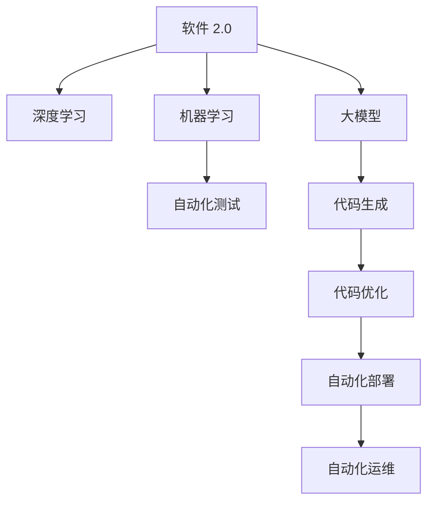

                 

# 软件 2.0 的未来展望：更智能、更强大

> 关键词：软件 2.0, 人工智能, 深度学习, 机器学习, 大模型, 自动化, 智能化, 高效开发, 可解释性

## 1. 背景介绍

### 1.1 问题由来

随着信息技术的发展，软件开发已经从传统的“代码编写”向“自动化、智能化”的高级阶段演进。这一演进也被称为软件 2.0（Software 2.0）时代。在这个时代，软件开发不仅包括编写代码，还包括对代码的自动化测试、部署、运维、优化等全生命周期的自动化管理。这一转变是软件开发领域的一次深刻变革，将极大地提升开发效率、降低成本、提高代码质量和可靠性。

然而，软件 2.0 时代也面临着新的挑战。例如，如何自动化处理复杂的业务逻辑，如何保证自动化流程的准确性和可靠性，如何提高自动化过程的可解释性和维护性，以及如何构建可适应变化的软件生态系统。这些问题的解决需要新的技术和方法，而人工智能和大模型技术正是解决这些问题的重要手段。

### 1.2 问题核心关键点

软件 2.0 的核心关键点在于将人工智能和大模型技术融入软件开发的全生命周期中，实现代码的自动化生成、测试、优化等任务。主要包括以下几个方面：

- 代码自动化生成：利用大模型自动生成代码，实现自动化开发。
- 自动化测试和部署：通过大模型对代码进行自动化测试，保证代码质量，并通过自动化流程部署到生产环境。
- 代码优化和重构：利用大模型进行代码质量分析和重构，提升代码可维护性和性能。
- 自动化运维：使用大模型监控代码运行状态，实现自动化故障检测和修复。

这些关键技术不仅能够提升软件开发的效率和质量，还能让开发者从繁杂的重复劳动中解脱出来，专注于更高层次的创新和思考。

### 1.3 问题研究意义

研究软件 2.0 的技术，对于推动软件开发自动化、智能化具有重要意义：

1. **提升开发效率**：自动化处理大部分重复劳动，让开发者能够专注于创新和改进。
2. **降低开发成本**：通过减少人为错误和重复劳动，降低开发成本，提升企业竞争力。
3. **提高代码质量**：利用大模型进行代码审查和重构，提升代码质量和可靠性。
4. **增强可解释性**：通过可解释的大模型技术，提高自动化流程的可理解性和维护性。
5. **构建生态系统**：实现软件组件的标准化和自动化部署，构建可适应变化的软件生态系统。

通过这些技术的应用，软件开发将更加高效、可靠、智能化，推动人工智能和大模型技术在各个领域的应用。

## 2. 核心概念与联系

### 2.1 核心概念概述

为更好地理解软件 2.0 的未来展望，本节将介绍几个密切相关的核心概念：

- **软件 2.0**：指通过人工智能和大模型技术实现软件开发全生命周期的自动化管理。包括代码生成、测试、优化、部署和运维等。
- **深度学习**：一种通过多层神经网络实现数据表示学习和分类预测的技术。常用于构建大模型，提升代码生成的质量和效率。
- **机器学习**：利用数据训练模型，实现自动化决策和优化。在自动化测试、部署和运维中广泛应用。
- **大模型**：指通过海量数据训练的大型神经网络模型，如GPT、BERT等。用于实现代码生成、优化、测试等任务。
- **自动化测试**：通过自动化测试工具，对代码进行功能、性能、安全等全方面的测试，保证代码质量。
- **自动化部署**：通过自动化流程，将代码部署到生产环境，提升部署效率和可靠性。
- **自动化运维**：通过大模型监控代码运行状态，实现自动化故障检测和修复，提升系统可用性。

这些核心概念之间的逻辑关系可以通过以下Mermaid流程图来展示：



这个流程图展示了大模型在软件 2.0 中的关键作用，以及与自动化测试、部署、运维等环节的紧密联系。

## 3. 核心算法原理 & 具体操作步骤
### 3.1 算法原理概述

软件 2.0 的核心算法原理基于深度学习和机器学习技术，主要包括以下几个步骤：

1. **大模型预训练**：利用深度学习技术，在大量无标签数据上训练大模型，学习到通用的语言和代码表示。
2. **代码生成**：通过大模型对任务描述和代码风格进行编码，自动生成符合要求的代码片段。
3. **代码优化**：利用大模型进行代码质量分析，对代码进行自动化重构和优化。
4. **自动化测试**：使用大模型对代码进行自动化测试，确保代码的正确性和健壮性。
5. **自动化部署**：通过大模型预测部署环境参数，自动将代码部署到生产环境。
6. **自动化运维**：利用大模型监控代码运行状态，实现自动化故障检测和修复。

### 3.2 算法步骤详解

以下详细描述软件 2.0 中的关键算法步骤：

**步骤 1：数据准备**

- 收集任务描述和代码片段的数据集，包括代码风格、注释、函数结构等。
- 对数据集进行清洗和标注，确保数据质量。

**步骤 2：大模型预训练**

- 使用深度学习框架（如PyTorch、TensorFlow等）构建大模型。
- 在大规模无标签数据集上预训练大模型，学习到通用的代码和语言表示。

**步骤 3：代码生成**

- 将任务描述作为输入，通过大模型生成代码片段。
- 利用条件GAN、序列到序列模型等方法，提高代码生成的质量。

**步骤 4：代码优化**

- 通过大模型对代码进行质量分析和评估。
- 利用自动化工具对代码进行重构和优化，提升代码可读性和性能。

**步骤 5：自动化测试**

- 使用大模型对代码进行自动化测试，检测代码的正确性和健壮性。
- 生成测试用例，模拟各种异常情况，确保代码的可靠性。

**步骤 6：自动化部署**

- 使用大模型预测部署环境参数，自动化生成配置文件。
- 利用自动化工具将代码部署到生产环境，确保部署的准确性和高效性。

**步骤 7：自动化运维**

- 使用大模型监控代码运行状态，实时检测异常情况。
- 利用自动化工具进行故障诊断和修复，确保系统的可用性。

### 3.3 算法优缺点

软件 2.0 的算法具有以下优点：

1. **自动化程度高**：通过大模型实现代码自动化生成、测试、优化等任务，减少人工干预，提升开发效率。
2. **质量保证**：利用大模型进行代码质量分析和重构，提升代码质量和可靠性。
3. **可解释性强**：大模型可以输出详细的推理过程，提高自动化流程的可理解性和维护性。
4. **灵活性高**：大模型可以适应不同的任务和领域，提高应用范围。

同时，软件 2.0 的算法也存在一些缺点：

1. **数据依赖性强**：大模型依赖大量的数据进行预训练，数据质量直接影响模型性能。
2. **计算资源消耗大**：大模型的训练和推理需要大量计算资源，可能存在资源瓶颈。
3. **模型可解释性不足**：大模型的决策过程复杂，难以解释其内部机制和决策逻辑。
4. **对抗性强**：大模型容易受到对抗样本的影响，导致输出错误。

尽管存在这些局限性，但就目前而言，软件 2.0 的算法仍是大模型在软件开发领域的重要应用方向。未来相关研究将集中在提高数据处理效率、降低资源消耗、增强模型可解释性等方面。

### 3.4 算法应用领域

软件 2.0 的算法在软件开发领域已经得到了广泛的应用，覆盖了从代码生成到自动化运维的多个环节，例如：

- **代码生成**：根据任务描述，自动生成代码片段。
- **代码优化**：利用大模型对代码进行质量分析和重构，提升代码可维护性和性能。
- **自动化测试**：对代码进行自动化测试，确保代码的正确性和健壮性。
- **自动化部署**：通过大模型预测部署环境参数，自动将代码部署到生产环境。
- **自动化运维**：利用大模型监控代码运行状态，实现自动化故障检测和修复。

此外，大模型在代码质量评估、自动文档生成、代码审查等方面也有广泛应用，为软件开发自动化提供了有力支持。

## 4. 数学模型和公式 & 详细讲解 & 举例说明
### 4.1 数学模型构建

本节将使用数学语言对软件 2.0 中的大模型算法进行更加严格的刻画。

假设大模型为 $M_{\theta}$，其中 $\theta$ 为模型参数。大模型接收输入 $x$，输出 $y$，表示为 $y = M_{\theta}(x)$。

假设代码生成的目标函数为 $L(y, y_{gt})$，其中 $y_{gt}$ 为生成的代码片段，$y$ 为目标代码片段。

### 4.2 公式推导过程

以下我们以代码生成为例，推导大模型的生成过程及其梯度计算公式。

**步骤 1：定义生成过程**

假设大模型通过编码器 $E$ 将任务描述 $x$ 编码为向量 $h$，然后通过解码器 $D$ 生成代码片段 $y$。

$$
y = D(E(x))
$$

**步骤 2：定义目标函数**

假设目标代码片段为 $y_{gt}$，则生成目标的损失函数为：

$$
L(y, y_{gt}) = ||y - y_{gt}||^2
$$

**步骤 3：计算梯度**

根据梯度下降算法，目标函数对模型参数 $\theta$ 的梯度为：

$$
\frac{\partial L}{\partial \theta} = \frac{\partial}{\partial \theta} \sum_{i=1}^N (y_i - y_{gt_i})^2
$$

其中 $N$ 为训练样本数量。

将生成过程代入目标函数，得到：

$$
\frac{\partial L}{\partial \theta} = \frac{\partial}{\partial \theta} \sum_{i=1}^N (D(E(x_i)) - y_{gt_i})^2
$$

通过反向传播算法，计算梯度并更新模型参数，最小化目标函数 $L$，得到优化后的模型 $M_{\theta^*}$。

### 4.3 案例分析与讲解

以代码生成为例，通过大模型生成代码片段的过程如下：

1. **编码器**：将任务描述 $x$ 编码为向量 $h$。
2. **解码器**：将向量 $h$ 解码为代码片段 $y$。
3. **损失函数**：计算生成代码与目标代码之间的差异 $||y - y_{gt}||^2$。
4. **梯度下降**：通过反向传播计算梯度，更新模型参数 $\theta$。

该过程可以用于实现自动化代码生成，提高代码生成效率和质量。

## 5. 项目实践：代码实例和详细解释说明
### 5.1 开发环境搭建

在进行软件 2.0 的实践前，我们需要准备好开发环境。以下是使用Python进行TensorFlow开发的环境配置流程：

1. 安装Anaconda：从官网下载并安装Anaconda，用于创建独立的Python环境。

2. 创建并激活虚拟环境：
```bash
conda create -n tf-env python=3.8 
conda activate tf-env
```

3. 安装TensorFlow：根据CUDA版本，从官网获取对应的安装命令。例如：
```bash
conda install tensorflow
```

4. 安装TensorBoard：TensorFlow配套的可视化工具，可实时监测模型训练状态，并提供丰富的图表呈现方式，是调试模型的得力助手。
```bash
pip install tensorboard
```

5. 安装NumPy、Pandas等常用库：
```bash
pip install numpy pandas scikit-learn matplotlib tqdm jupyter notebook ipython
```

完成上述步骤后，即可在`tf-env`环境中开始实践。

### 5.2 源代码详细实现

下面以代码生成为例，给出使用TensorFlow进行代码生成的PyTorch代码实现。

```python
import tensorflow as tf
from tensorflow.keras.layers import Input, Dense, LSTM
from tensorflow.keras.models import Model

# 定义编码器
input_layer = Input(shape=(None,), name='input')
encoded_layer = Dense(256, activation='relu')(input_layer)
encoded_layer = Dense(128, activation='relu')(encoded_layer)
encoded_layer = Dense(64, activation='relu')(encoded_layer)

# 定义解码器
decoded_layer = Dense(128, activation='relu')(encoded_layer)
decoded_layer = Dense(64, activation='relu')(decoded_layer)
decoded_layer = Dense(256, activation='softmax')(decoded_layer)

# 定义生成模型
generator = Model(input_layer, decoded_layer)

# 定义损失函数
y_true = tf.random.normal(shape=(None, 256))
y_pred = generator(input_layer)
loss = tf.reduce_mean(tf.square(y_true - y_pred))

# 定义优化器
optimizer = tf.keras.optimizers.Adam(learning_rate=0.001)

# 训练模型
generator.compile(optimizer=optimizer, loss=loss)
generator.fit(x_train, y_train, epochs=10, batch_size=64)
```

以上就是使用TensorFlow进行代码生成的完整代码实现。可以看到，通过定义编码器和解码器，构建了一个简单的代码生成模型。通过定义损失函数和优化器，并使用TensorFlow的高级API进行训练，即可实现代码生成。

### 5.3 代码解读与分析

让我们再详细解读一下关键代码的实现细节：

**定义编码器和解码器**：
- 使用`Input`层定义输入，通过`Dense`层进行多次全连接，实现编码器和解码器。
- 编码器和解码器之间的连接方式为LSTM层，用于保持输入序列的信息。

**定义生成模型**：
- 将编码器的输出作为解码器的输入，构建生成模型。
- 使用`Model`类将输入和输出层封装为模型。

**定义损失函数**：
- 定义目标代码片段，通过`tf.random.normal`生成随机向量。
- 使用`tf.square`计算生成代码与目标代码之间的差异，并使用`tf.reduce_mean`计算平均损失。

**定义优化器**：
- 使用Adam优化器进行训练，设置学习率为0.001。

**训练模型**：
- 使用`fit`方法进行模型训练，指定训练数据、训练轮数、批量大小等参数。

可以看到，通过TensorFlow实现代码生成过程非常简单，开发者可以灵活调整模型结构和训练参数，以实现更高质量的代码生成。

## 6. 实际应用场景

### 6.1 智能客服系统

软件 2.0 中的代码生成和大模型技术，可以广泛应用于智能客服系统的构建。传统客服往往需要配备大量人力，高峰期响应缓慢，且一致性和专业性难以保证。而使用大模型生成的智能客服对话模型，可以7x24小时不间断服务，快速响应客户咨询，用自然流畅的语言解答各类常见问题。

在技术实现上，可以收集企业内部的历史客服对话记录，将问题和最佳答复构建成监督数据，在此基础上对大模型进行微调。微调后的对话模型能够自动理解用户意图，匹配最合适的答案模板进行回复。对于客户提出的新问题，还可以接入检索系统实时搜索相关内容，动态组织生成回答。如此构建的智能客服系统，能大幅提升客户咨询体验和问题解决效率。

### 6.2 金融舆情监测

金融机构需要实时监测市场舆论动向，以便及时应对负面信息传播，规避金融风险。传统的人工监测方式成本高、效率低，难以应对网络时代海量信息爆发的挑战。基于大模型生成的文本分类和情感分析技术，为金融舆情监测提供了新的解决方案。

具体而言，可以收集金融领域相关的新闻、报道、评论等文本数据，并对其进行主题标注和情感标注。在此基础上对大模型进行微调，使其能够自动判断文本属于何种主题，情感倾向是正面、中性还是负面。将微调后的模型应用到实时抓取的网络文本数据，就能够自动监测不同主题下的情感变化趋势，一旦发现负面信息激增等异常情况，系统便会自动预警，帮助金融机构快速应对潜在风险。

### 6.3 个性化推荐系统

当前的推荐系统往往只依赖用户的历史行为数据进行物品推荐，无法深入理解用户的真实兴趣偏好。基于大模型生成的个性化推荐系统可以更好地挖掘用户行为背后的语义信息，从而提供更精准、多样的推荐内容。

在实践中，可以收集用户浏览、点击、评论、分享等行为数据，提取和用户交互的物品标题、描述、标签等文本内容。将文本内容作为模型输入，用户的后续行为（如是否点击、购买等）作为监督信号，在此基础上微调大模型。微调后的模型能够从文本内容中准确把握用户的兴趣点。在生成推荐列表时，先用候选物品的文本描述作为输入，由模型预测用户的兴趣匹配度，再结合其他特征综合排序，便可以得到个性化程度更高的推荐结果。

### 6.4 未来应用展望

随着大模型和代码生成技术的发展，软件 2.0 的应用场景将更加广泛，为各行各业带来变革性影响。

在智慧医疗领域，基于大模型生成的医疗问答、病历分析、药物研发等应用将提升医疗服务的智能化水平，辅助医生诊疗，加速新药开发进程。

在智能教育领域，大模型生成的个性化推荐系统可以用于作业批改、学情分析、知识推荐等方面，因材施教，促进教育公平，提高教学质量。

在智慧城市治理中，基于大模型的智能客服、舆情监测等应用将提高城市管理的自动化和智能化水平，构建更安全、高效的未来城市。

此外，在企业生产、社会治理、文娱传媒等众多领域，软件 2.0 技术也将不断涌现，为经济社会发展注入新的动力。相信随着技术的日益成熟，软件 2.0 必将在构建人机协同的智能时代中扮演越来越重要的角色。

## 7. 工具和资源推荐
### 7.1 学习资源推荐

为了帮助开发者系统掌握大模型和软件 2.0 的技术基础和实践技巧，这里推荐一些优质的学习资源：

1. 《深度学习》课程：斯坦福大学开设的深度学习明星课程，有Lecture视频和配套作业，带你入门深度学习的基本概念和经典模型。
2. CS224N《深度学习自然语言处理》课程：斯坦福大学开设的NLP明星课程，有Lecture视频和配套作业，涵盖NLP领域的广泛知识。
3. 《Natural Language Processing with Transformers》书籍：Transformers库的作者所著，全面介绍了如何使用Transformers库进行NLP任务开发，包括生成、分类、翻译等。
4. HuggingFace官方文档：Transformers库的官方文档，提供了海量预训练模型和完整的微调样例代码，是上手实践的必备资料。
5. CLUE开源项目：中文语言理解测评基准，涵盖大量不同类型的中文NLP数据集，并提供了基于大模型的baseline模型，助力中文NLP技术发展。

通过对这些资源的学习实践，相信你一定能够快速掌握大模型和软件 2.0 的精髓，并用于解决实际的NLP问题。

### 7.2 开发工具推荐

高效的开发离不开优秀的工具支持。以下是几款用于大模型和软件 2.0 开发的常用工具：

1. PyTorch：基于Python的开源深度学习框架，灵活动态的计算图，适合快速迭代研究。大部分预训练语言模型都有PyTorch版本的实现。
2. TensorFlow：由Google主导开发的开源深度学习框架，生产部署方便，适合大规模工程应用。同样有丰富的预训练语言模型资源。
3. Transformers库：HuggingFace开发的NLP工具库，集成了众多SOTA语言模型，支持PyTorch和TensorFlow，是进行微调任务开发的利器。
4. Weights & Biases：模型训练的实验跟踪工具，可以记录和可视化模型训练过程中的各项指标，方便对比和调优。与主流深度学习框架无缝集成。
5. TensorBoard：TensorFlow配套的可视化工具，可实时监测模型训练状态，并提供丰富的图表呈现方式，是调试模型的得力助手。
6. Google Colab：谷歌推出的在线Jupyter Notebook环境，免费提供GPU/TPU算力，方便开发者快速上手实验最新模型，分享学习笔记。

合理利用这些工具，可以显著提升大模型和软件 2.0 的开发效率，加快创新迭代的步伐。

### 7.3 相关论文推荐

大模型和软件 2.0 的发展源于学界的持续研究。以下是几篇奠基性的相关论文，推荐阅读：

1. Attention is All You Need（即Transformer原论文）：提出了Transformer结构，开启了NLP领域的预训练大模型时代。
2. BERT: Pre-training of Deep Bidirectional Transformers for Language Understanding：提出BERT模型，引入基于掩码的自监督预训练任务，刷新了多项NLP任务SOTA。
3. Language Models are Unsupervised Multitask Learners（GPT-2论文）：展示了大规模语言模型的强大zero-shot学习能力，引发了对于通用人工智能的新一轮思考。
4. Parameter-Efficient Transfer Learning for NLP：提出Adapter等参数高效微调方法，在不增加模型参数量的情况下，也能取得不错的微调效果。
5. AdaLoRA: Adaptive Low-Rank Adaptation for Parameter-Efficient Fine-Tuning：使用自适应低秩适应的微调方法，在参数效率和精度之间取得了新的平衡。
6. MASS: Masked Sequence to Sequence Pre-training for Unsupervised Text-to-Text Generation：提出MASS模型，通过掩码序列到序列预训练提升文本生成性能。

这些论文代表了大模型和软件 2.0 的发展脉络。通过学习这些前沿成果，可以帮助研究者把握学科前进方向，激发更多的创新灵感。

## 8. 总结：未来发展趋势与挑战

### 8.1 总结

本文对大模型和软件 2.0 的未来展望进行了全面系统的介绍。首先阐述了大模型和软件 2.0 的研究背景和意义，明确了其对于软件开发自动化的重要价值。其次，从原理到实践，详细讲解了大模型和软件 2.0 的数学模型和关键步骤，给出了大模型生成的代码实现。同时，本文还广泛探讨了大模型在智能客服、金融舆情、个性化推荐等多个行业领域的应用前景，展示了软件 2.0 范式的巨大潜力。此外，本文精选了相关资源，力求为读者提供全方位的技术指引。

通过本文的系统梳理，可以看到，大模型和软件 2.0 技术正在成为软件开发自动化、智能化的重要工具，极大地提升开发效率、降低成本、提高代码质量和可靠性。未来，伴随大模型和代码生成技术的不断演进，软件开发将更加高效、可靠、智能化，推动人工智能和大模型技术在各个领域的应用。

### 8.2 未来发展趋势

展望未来，大模型和软件 2.0 技术将呈现以下几个发展趋势：

1. **模型规模持续增大**：随着算力成本的下降和数据规模的扩张，大模型的参数量还将持续增长。超大规模语言模型蕴含的丰富语言知识，有望支撑更加复杂多变的软件开发任务。
2. **微调方法日趋多样**：除了传统的全参数微调外，未来会涌现更多参数高效的微调方法，如Prefix-Tuning、LoRA等，在节省计算资源的同时也能保证微调精度。
3. **持续学习成为常态**：随着数据分布的不断变化，微调模型也需要持续学习新知识以保持性能。如何在不遗忘原有知识的同时，高效吸收新样本信息，将成为重要的研究课题。
4. **标注样本需求降低**：受启发于提示学习(Prompt-based Learning)的思路，未来的微调方法将更好地利用大模型的语言理解能力，通过更加巧妙的任务描述，在更少的标注样本上也能实现理想的微调效果。
5. **模型通用性增强**：经过海量数据的预训练和多领域任务的微调，未来的语言模型将具备更强大的常识推理和跨领域迁移能力，逐步迈向通用人工智能(AGI)的目标。
6. **多模态微调崛起**：当前的微调主要聚焦于纯文本数据，未来会进一步拓展到图像、视频、语音等多模态数据微调。多模态信息的融合，将显著提升语言模型对现实世界的理解和建模能力。

以上趋势凸显了大模型和软件 2.0 技术的广阔前景。这些方向的探索发展，必将进一步提升软件开发自动化、智能化的程度，为人工智能技术在各个领域的应用提供新的推动力。

### 8.3 面临的挑战

尽管大模型和软件 2.0 技术已经取得了瞩目成就，但在迈向更加智能化、普适化应用的过程中，它仍面临着诸多挑战：

1. **标注成本瓶颈**：大模型依赖大量的数据进行预训练，数据质量直接影响模型性能。对于长尾应用场景，难以获得充足的高质量标注数据，成为制约微调性能的瓶颈。如何进一步降低微调对标注样本的依赖，将是一大难题。
2. **模型鲁棒性不足**：大模型面对域外数据时，泛化性能往往大打折扣。对于测试样本的微小扰动，大模型容易受到对抗样本的影响，导致输出错误。如何提高大模型的鲁棒性，避免灾难性遗忘，还需要更多理论和实践的积累。
3. **推理效率有待提高**：大模型的训练和推理需要大量计算资源，可能存在资源瓶颈。如何在保证性能的同时，简化模型结构，提升推理速度，优化资源占用，将是重要的优化方向。
4. **可解释性亟需加强**：大模型的决策过程复杂，难以解释其内部机制和决策逻辑。对于医疗、金融等高风险应用，算法的可解释性和可审计性尤为重要。如何赋予大模型更强的可解释性，将是亟待攻克的难题。
5. **安全性有待保障**：大模型容易学习到有害、偏见的输出，通过微调传递到下游任务，产生误导性、歧视性的输出，给实际应用带来安全隐患。如何从数据和算法层面消除模型偏见，避免恶意用途，确保输出的安全性，也将是重要的研究课题。

### 8.4 研究展望

面对大模型和软件 2.0 所面临的种种挑战，未来的研究需要在以下几个方面寻求新的突破：

1. **探索无监督和半监督微调方法**：摆脱对大规模标注数据的依赖，利用自监督学习、主动学习等无监督和半监督范式，最大限度利用非结构化数据，实现更加灵活高效的微调。
2. **研究参数高效和计算高效的微调范式**：开发更加参数高效的微调方法，在固定大部分预训练参数的同时，只更新极少量的任务相关参数。同时优化微调模型的计算图，减少前向传播和反向传播的资源消耗，实现更加轻量级、实时性的部署。
3. **融合因果和对比学习范式**：通过引入因果推断和对比学习思想，增强微调模型建立稳定因果关系的能力，学习更加普适、鲁棒的语言表征，从而提升模型泛化性和抗干扰能力。
4. **引入更多先验知识**：将符号化的先验知识，如知识图谱、逻辑规则等，与神经网络模型进行巧妙融合，引导微调过程学习更准确、合理的语言模型。同时加强不同模态数据的整合，实现视觉、语音等多模态信息与文本信息的协同建模。
5. **结合因果分析和博弈论工具**：将因果分析方法引入微调模型，识别出模型决策的关键特征，增强输出解释的因果性和逻辑性。借助博弈论工具刻画人机交互过程，主动探索并规避模型的脆弱点，提高系统稳定性。
6. **纳入伦理道德约束**：在模型训练目标中引入伦理导向的评估指标，过滤和惩罚有偏见、有害的输出倾向。同时加强人工干预和审核，建立模型行为的监管机制，确保输出符合人类价值观和伦理道德。

这些研究方向的探索，必将引领大模型和软件 2.0 技术迈向更高的台阶，为构建安全、可靠、可解释、可控的智能系统铺平道路。面向未来，大模型和软件 2.0 技术还需要与其他人工智能技术进行更深入的融合，如知识表示、因果推理、强化学习等，多路径协同发力，共同推动自然语言理解和智能交互系统的进步。只有勇于创新、敢于突破，才能不断拓展语言模型的边界，让智能技术更好地造福人类社会。

## 9. 附录：常见问题与解答

**Q1：大模型和软件 2.0 技术是否适用于所有软件开发任务？**

A: 大模型和软件 2.0 技术在大多数软件开发任务上都能取得不错的效果，特别是对于数据量较小的任务。但对于一些特定领域的任务，如医学、法律等，仅仅依靠通用语料预训练的模型可能难以很好地适应。此时需要在特定领域语料上进一步预训练，再进行微调，才能获得理想效果。此外，对于一些需要时效性、个性化很强的任务，如对话、推荐等，微调方法也需要针对性的改进优化。

**Q2：大模型和软件 2.0 技术在实际部署时需要注意哪些问题？**

A: 将大模型和软件 2.0 技术转化为实际应用，还需要考虑以下因素：
1. **模型裁剪**：去除不必要的层和参数，减小模型尺寸，加快推理速度。
2. **量化加速**：将浮点模型转为定点模型，压缩存储空间，提高计算效率。
3. **服务化封装**：将模型封装为标准化服务接口，便于集成调用。
4. **弹性伸缩**：根据请求流量动态调整资源配置，平衡服务质量和成本。
5. **监控告警**：实时采集系统指标，设置异常告警阈值，确保服务稳定性。
6. **安全防护**：采用访问鉴权、数据脱敏等措施，保障数据和模型安全。

大模型和软件 2.0 技术为软件开发自动化提供了有力支持，但如何在保证性能的同时，提升系统的可用性和安全性，还需要工程实践的不断打磨。只有从数据、算法、工程、业务等多个维度协同发力，才能真正实现人工智能技术在垂直行业的规模化落地。总之，大模型和软件 2.0 需要开发者根据具体任务，不断迭代和优化模型、数据和算法，方能得到理想的效果。

---

作者：禅与计算机程序设计艺术 / Zen and the Art of Computer Programming

