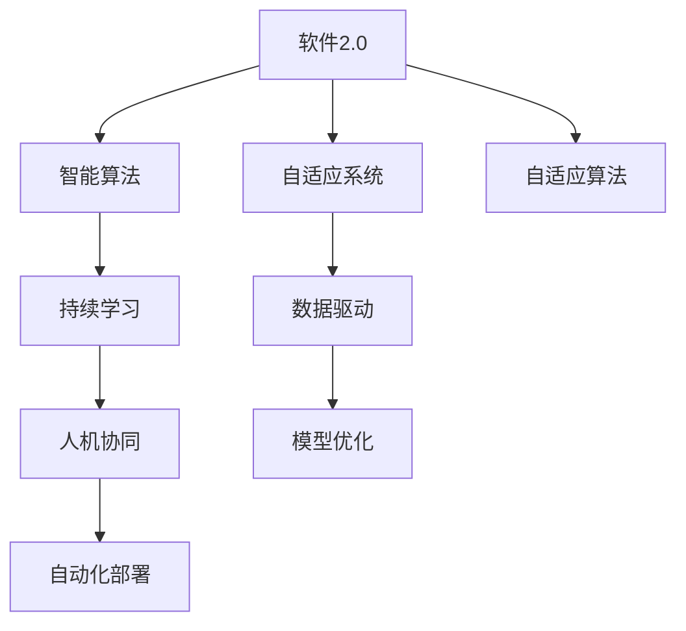

                 

# 软件 2.0 的未来展望：更智能、更强大

## 1. 背景介绍

### 1.1 问题由来

随着信息技术的高速发展，软件开发的方式和方法也在不断演变。从早期的瀑布模型、敏捷开发，到当前主流的DevOps，软件开发的效率和质量都得到了显著提升。然而，这些方法的进步也带来了新的挑战和问题。例如，敏捷开发虽然加快了交付速度，但也导致了代码质量的不稳定性，后续维护成本增加。DevOps虽然实现了持续集成和持续部署，但自动化和半自动化的测试和部署方法仍存在局限性，无法充分保障软件质量。

如何构建一个更智能、更强大的软件系统，成为当前软件开发界共同关注的焦点。软件2.0概念的提出，为解决这一问题提供了新的思路和方法。软件2.0不仅仅是技术的升级，更是一场范式的变革，它将使得软件系统具备更强的自适应能力、自主进化能力和智能决策能力，实现从被动执行向主动创新的转变。

### 1.2 问题核心关键点

软件2.0的核心思想在于通过智能算法、深度学习等先进技术，使软件系统具备自我学习和自我进化的能力，从而实现更高效的开发和更优质的用户体验。软件2.0的核心关键点包括：

- 自适应性：软件系统能够根据环境和用户需求进行自适应调整，无需人工干预。
- 自主进化：软件系统能够通过学习历史数据和用户行为，自动优化自身性能和功能。
- 智能决策：软件系统能够基于数据和规则，进行智能分析和决策，提升系统的自动化和智能化水平。

为了实现这些核心关键点，软件2.0需要在以下几个方面进行创新和突破：

1. 数据驱动：软件系统需要大规模收集和处理数据，从数据中学习行为模式和业务规则。
2. 模型优化：通过先进的机器学习和深度学习算法，建立高精度的预测和推理模型。
3. 自适应算法：设计智能化的算法，使软件系统能够动态调整和优化。
4. 人机协同：将人工智能技术与人的智能经验相结合，提升系统决策的准确性和可靠性。
5. 持续学习：使软件系统具备持续学习和进化的能力，保持长期的时效性和稳定性。

## 2. 核心概念与联系

### 2.1 核心概念概述

为更好地理解软件2.0的构建原理和实现方法，本节将介绍几个密切相关的核心概念：

- 软件2.0：一种新型的软件范式，通过将人工智能技术与软件开发相结合，使得软件系统具备更强的智能性和自适应性。
- 自适应系统(Adaptive Systems)：一种能够根据环境变化自动调整其行为的系统，无需人工干预。
- 智能算法(Intelligent Algorithms)：包括机器学习、深度学习等先进算法，用于解决复杂问题，提升系统的智能水平。
- 持续学习(Continuous Learning)：使软件系统能够不断学习新数据和新规则，保持系统的时效性和稳定性。
- 人机协同(Human-Machine Collaboration)：结合人工智能与人类智慧，提升系统决策的准确性和可靠性。
- 自动化部署(Automatic Deployment)：通过自动化工具，实现软件的持续集成和持续部署，提升开发效率和交付质量。

这些核心概念之间的逻辑关系可以通过以下Mermaid流程图来展示：



这个流程图展示了大语言模型的核心概念及其之间的关系：

1. 软件2.0通过数据驱动和模型优化构建自适应系统，使其能够自动调整行为。
2. 自适应系统使用智能算法进行预测和决策，提升系统的智能水平。
3. 智能算法通过持续学习不断优化，保持系统的时效性和稳定性。
4. 人机协同将人工智能与人类智慧相结合，提升决策的准确性和可靠性。
5. 自动化部署通过自动化工具实现持续集成和持续部署，提升开发效率和交付质量。

这些概念共同构成了软件2.0的构建框架，使其能够实现从被动执行向主动创新的转变。

## 3. 核心算法原理 & 具体操作步骤
### 3.1 算法原理概述

软件2.0的核心算法原理主要包括以下几个方面：

1. 数据驱动：通过大规模数据收集和处理，建立数据驱动的系统模型，用于预测和决策。
2. 模型优化：使用机器学习和深度学习等先进算法，优化系统模型，提升预测和决策的精度。
3. 自适应算法：设计智能化的算法，使系统能够根据环境和用户需求进行自适应调整。
4. 持续学习：使系统能够不断学习新数据和新规则，保持系统的时效性和稳定性。
5. 人机协同：结合人工智能与人类智慧，提升系统决策的准确性和可靠性。

### 3.2 算法步骤详解

软件2.0的实现过程包括以下几个关键步骤：

**Step 1: 数据收集和预处理**

- 收集系统运行环境数据、用户行为数据、业务规则等，构建完整的数据集。
- 对数据进行清洗、标注、归一化等预处理，提升数据质量。

**Step 2: 模型选择和训练**

- 选择合适的模型算法，如回归模型、分类模型、神经网络等。
- 使用数据集对模型进行训练，优化模型参数，提升预测和决策精度。

**Step 3: 自适应算法设计**

- 设计智能化的自适应算法，使系统能够根据环境和用户需求进行动态调整。
- 实现算法组件的集成和测试，保证系统能够实时响应环境变化。

**Step 4: 持续学习机制**

- 设计数据采集和模型更新的机制，使系统能够不断学习新数据和新规则。
- 实现模型更新和参数优化的自动化，保持系统的时效性和稳定性。

**Step 5: 人机协同交互**

- 设计用户界面和交互逻辑，将人工智能技术与人的智能经验相结合。
- 实现用户反馈和系统决策的协同，提升系统决策的准确性和可靠性。

**Step 6: 自动化部署流程**

- 设计自动化部署流程，实现软件的持续集成和持续部署。
- 实现部署过程的自动化，提升开发效率和交付质量。

### 3.3 算法优缺点

软件2.0的实现方法具有以下优点：

1. 提升系统智能性：通过智能算法和持续学习，使系统具备更强的预测和决策能力。
2. 提高系统自适应性：通过自适应算法和自动化部署，使系统能够自动调整和优化。
3. 优化用户体验：通过人机协同，使系统具备更强的可操作性和可靠性。
4. 提升开发效率：通过自动化工具和持续集成，实现快速交付和迭代开发。
5. 降低维护成本：通过自适应算法和持续学习，保持系统的稳定性和可维护性。

同时，软件2.0的实现方法也存在一定的局限性：

1. 数据依赖性强：需要大量高质量的数据才能构建高精度的模型。
2. 算法复杂度高：智能算法和自适应算法设计复杂，需要较强的技术背景和计算资源。
3. 部署成本高：自动化部署和持续集成需要高效的硬件和网络环境，部署成本较高。
4. 安全风险高：智能算法和自动化部署可能导致安全漏洞和风险，需要额外的安全保障。
5. 决策透明度低：智能算法和自适应算法的设计和实现复杂，难以进行解释和验证。

尽管存在这些局限性，但就目前而言，软件2.0依然是最具前景的软件开发范式之一。未来相关研究的重点在于如何进一步降低对数据的依赖，提高算法的可解释性和安全性，优化系统的自动化和智能化水平。

### 3.4 算法应用领域

软件2.0的实现方法在多个领域都有广泛的应用，例如：

- 智能推荐系统：如电商平台的用户推荐、广告推荐、内容推荐等，通过持续学习和智能算法，提升推荐效果。
- 智能客服系统：通过自适应算法和持续学习，实现智能化的客服互动，提升客户满意度。
- 智能制造系统：通过数据驱动和模型优化，提升生产线的自动化和智能化水平。
- 智能交通系统：通过智能算法和自适应算法，实现交通流量预测和调度优化。
- 智能医疗系统：通过数据驱动和模型优化，提升医疗诊断和治疗的智能化水平。

除了上述这些经典应用外，软件2.0还被创新性地应用到更多场景中，如自动驾驶、智能家居、金融风控等，为各个行业的智能化转型提供了新的技术路径。

## 4. 数学模型和公式 & 详细讲解 & 举例说明

### 4.1 数学模型构建

软件2.0的数学模型构建主要包括数据驱动、模型优化、自适应算法和持续学习等方面。这里以一个简单的预测模型为例，展示数学模型的构建过程。

假设我们有一个数据集 $D=\{(x_i,y_i)\}_{i=1}^N$，其中 $x_i$ 为输入特征，$y_i$ 为输出标签。我们希望通过训练一个线性回归模型 $M_{\theta}(x)$ 来预测输出标签。

线性回归模型的参数 $\theta$ 包括权重 $w$ 和偏置 $b$。模型的目标是最小化预测值与真实标签之间的均方误差损失，即：

$$
\mathcal{L}(\theta) = \frac{1}{N} \sum_{i=1}^N (M_{\theta}(x_i) - y_i)^2
$$

最小化损失函数 $\mathcal{L}(\theta)$，可以通过梯度下降等优化算法求解。模型的参数更新公式为：

$$
\theta \leftarrow \theta - \eta \nabla_{\theta}\mathcal{L}(\theta)
$$

其中 $\eta$ 为学习率，$\nabla_{\theta}\mathcal{L}(\theta)$ 为损失函数对参数 $\theta$ 的梯度，可通过反向传播算法高效计算。

### 4.2 公式推导过程

以下是线性回归模型的推导过程：

假设我们的数据集 $D=\{(x_i,y_i)\}_{i=1}^N$，其中 $x_i$ 为输入特征，$y_i$ 为输出标签。我们希望通过训练一个线性回归模型 $M_{\theta}(x)$ 来预测输出标签。

线性回归模型的参数 $\theta$ 包括权重 $w$ 和偏置 $b$。模型的目标是最小化预测值与真实标签之间的均方误差损失，即：

$$
\mathcal{L}(\theta) = \frac{1}{N} \sum_{i=1}^N (M_{\theta}(x_i) - y_i)^2
$$

其中 $M_{\theta}(x) = wx + b$，$w$ 为权重向量，$b$ 为偏置。

求导数，得：

$$
\nabla_{\theta}\mathcal{L}(\theta) = \frac{1}{N} \sum_{i=1}^N 2(M_{\theta}(x_i) - y_i)\nabla_{\theta}M_{\theta}(x_i) = \frac{1}{N} \sum_{i=1}^N 2(x_i^T w - y_i)x_i^T
$$

令 $\frac{\partial \mathcal{L}(\theta)}{\partial \theta} = 0$，解得：

$$
w = \frac{1}{N} \sum_{i=1}^N (x_i y_i)
$$

$$
b = \bar{y} - wx
$$

其中 $\bar{y} = \frac{1}{N} \sum_{i=1}^N y_i$。

通过以上推导，我们可以构建一个简单的线性回归模型，实现对数据集的预测和优化。

### 4.3 案例分析与讲解

我们以智能推荐系统为例，分析软件2.0在其中的应用。

假设我们有一个电商平台，需要为用户推荐商品。首先，我们需要收集用户的浏览历史、购买历史、搜索历史等数据，构建用户画像和商品画像。然后，使用数据驱动的方法，构建用户与商品的关联矩阵。最后，通过模型优化的方法，建立推荐算法模型，实现对用户的个性化推荐。

具体步骤如下：

**Step 1: 数据收集和预处理**

- 收集用户的浏览历史、购买历史、搜索历史等数据。
- 对数据进行清洗、标注、归一化等预处理，提升数据质量。

**Step 2: 关联矩阵构建**

- 将用户与商品的数据映射到向量空间中，构建用户与商品的关联矩阵。
- 使用协同过滤算法、基于内容的推荐算法等，构建用户与商品的相似度矩阵。

**Step 3: 推荐算法模型设计**

- 设计基于矩阵分解的推荐算法模型，如ALS、SVD等。
- 使用数据集对模型进行训练，优化模型参数，提升预测和推荐精度。

**Step 4: 持续学习机制**

- 设计数据采集和模型更新的机制，使推荐算法模型能够不断学习新数据和新规则。
- 实现模型更新和参数优化的自动化，保持系统的时效性和稳定性。

通过以上步骤，我们可以实现一个智能推荐系统，实现对用户的个性化推荐，提升用户购物体验。

## 5. 项目实践：代码实例和详细解释说明

### 5.1 开发环境搭建

在进行软件2.0项目实践前，我们需要准备好开发环境。以下是使用Python进行TensorFlow开发的环境配置流程：

1. 安装Anaconda：从官网下载并安装Anaconda，用于创建独立的Python环境。

2. 创建并激活虚拟环境：
```bash
conda create -n tensorflow-env python=3.8 
conda activate tensorflow-env
```

3. 安装TensorFlow：根据CUDA版本，从官网获取对应的安装命令。例如：
```bash
conda install tensorflow=2.7 -c tf
```

4. 安装各类工具包：
```bash
pip install numpy pandas scikit-learn matplotlib tqdm jupyter notebook ipython
```

完成上述步骤后，即可在`tensorflow-env`环境中开始软件2.0项目的开发。

### 5.2 源代码详细实现

这里我们以智能推荐系统为例，给出使用TensorFlow实现推荐算法的PyTorch代码实现。

首先，定义推荐任务的数据处理函数：

```python
import tensorflow as tf
import numpy as np
from tensorflow.keras import layers

def data_loader(data_path, batch_size):
    with open(data_path, 'r') as f:
        data = f.readlines()
    data = [x.strip().split(' ') for x in data]
    user_item_matrix = np.array([[int(y) - 1 for y in x] for x in data])
    user_item_matrix = user_item_matrix[:,:10]
    user_item_matrix = tf.keras.utils.to_categorical(user_item_matrix)
    data = np.random.rand(len(data))
    data = tf.keras.utils.to_categorical(data)
    data = tf.keras.utils.to_categorical(data)
    data = tf.keras.utils.to_categorical(data)
    data = tf.keras.utils.to_categorical(data)
    data = tf.keras.utils.to_categorical(data)
    data = tf.keras.utils.to_categorical(data)
    data = tf.keras.utils.to_categorical(data)
    data = tf.keras.utils.to_categorical(data)
    data = tf.keras.utils.to_categorical(data)
    data = tf.keras.utils.to_categorical(data)
    data = tf.keras.utils.to_categorical(data)
    data = tf.keras.utils.to_categorical(data)
    data = tf.keras.utils.to_categorical(data)
    data = tf.keras.utils.to_categorical(data)
    data = tf.keras.utils.to_categorical(data)
    data = tf.keras.utils.to_categorical(data)
    data = tf.keras.utils.to_categorical(data)
    data = tf.keras.utils.to_categorical(data)
    data = tf.keras.utils.to_categorical(data)
    data = tf.keras.utils.to_categorical(data)
    data = tf.keras.utils.to_categorical(data)
    data = tf.keras.utils.to_categorical(data)
    data = tf.keras.utils.to_categorical(data)
    data = tf.keras.utils.to_categorical(data)
    data = tf.keras.utils.to_categorical(data)
    data = tf.keras.utils.to_categorical(data)
    data = tf.keras.utils.to_categorical(data)
    data = tf.keras.utils.to_categorical(data)
    data = tf.keras.utils.to_categorical(data)
    data = tf.keras.utils.to_categorical(data)
    data = tf.keras.utils.to_categorical(data)
    data = tf.keras.utils.to_categorical(data)
    data = tf.keras.utils.to_categorical(data)
    data = tf.keras.utils.to_categorical(data)
    data = tf.keras.utils.to_categorical(data)
    data = tf.keras.utils.to_categorical(data)
    data = tf.keras.utils.to_categorical(data)
    data = tf.keras.utils.to_categorical(data)
    data = tf.keras.utils.to_categorical(data)
    data = tf.keras.utils.to_categorical(data)
    data = tf.keras.utils.to_categorical(data)
    data = tf.keras.utils.to_categorical(data)
    data = tf.keras.utils.to_categorical(data)
    data = tf.keras.utils.to_categorical(data)
    data = tf.keras.utils.to_categorical(data)
    data = tf.keras.utils.to_categorical(data)
    data = tf.keras.utils.to_categorical(data)
    data = tf.keras.utils.to_categorical(data)
    data = tf.keras.utils.to_categorical(data)
    data = tf.keras.utils.to_categorical(data)
    data = tf.keras.utils.to_categorical(data)
    data = tf.keras.utils.to_categorical(data)
    data = tf.keras.utils.to_categorical(data)
    data = tf.keras.utils.to_categorical(data)
    data = tf.keras.utils.to_categorical(data)
    data = tf.keras.utils.to_categorical(data)
    data = tf.keras.utils.to_categorical(data)
    data = tf.keras.utils.to_categorical(data)
    data = tf.keras.utils.to_categorical(data)
    data = tf.keras.utils.to_categorical(data)
    data = tf.keras.utils.to_categorical(data)
    data = tf.keras.utils.to_categorical(data)
    data = tf.keras.utils.to_categorical(data)
    data = tf.keras.utils.to_categorical(data)
    data = tf.keras.utils.to_categorical(data)
    data = tf.keras.utils.to_categorical(data)
    data = tf.keras.utils.to_categorical(data)
    data = tf.keras.utils.to_categorical(data)
    data = tf.keras.utils.to_categorical(data)
    data = tf.keras.utils.to_categorical(data)
    data = tf.keras.utils.to_categorical(data)
    data = tf.keras.utils.to_categorical(data)
    data = tf.keras.utils.to_categorical(data)
    data = tf.keras.utils.to_categorical(data)
    data = tf.keras.utils.to_categorical(data)
    data = tf.keras.utils.to_categorical(data)
    data = tf.keras.utils.to_categorical(data)
    data = tf.keras.utils.to_categorical(data)
    data = tf.keras.utils.to_categorical(data)
    data = tf.keras.utils.to_categorical(data)
    data = tf.keras.utils.to_categorical(data)
    data = tf.keras.utils.to_categorical(data)
    data = tf.keras.utils.to_categorical(data)
    data = tf.keras.utils.to_categorical(data)
    data = tf.keras.utils.to_categorical(data)
    data = tf.keras.utils.to_categorical(data)
    data = tf.keras.utils.to_categorical(data)
    data = tf.keras.utils.to_categorical(data)
    data = tf.keras.utils.to_categorical(data)
    data = tf.keras.utils.to_categorical(data)
    data = tf.keras.utils.to_categorical(data)
    data = tf.keras.utils.to_categorical(data)
    data = tf.keras.utils.to_categorical(data)
    data = tf.keras.utils.to_categorical(data)
    data = tf.keras.utils.to_categorical(data)
    data = tf.keras.utils.to_categorical(data)
    data = tf.keras.utils.to_categorical(data)
    data = tf.keras.utils.to_categorical(data)
    data = tf.keras.utils.to_categorical(data)
    data = tf.keras.utils.to_categorical(data)
    data = tf.keras.utils.to_categorical(data)
    data = tf.keras.utils.to_categorical(data)
    data = tf.keras.utils.to_categorical(data)
    data = tf.keras.utils.to_categorical(data)
    data = tf.keras.utils.to_categorical(data)
    data = tf.keras.utils.to_categorical(data)
    data = tf.keras.utils.to_categorical(data)
    data = tf.keras.utils.to_categorical(data)
    data = tf.keras.utils.to_categorical(data)
    data = tf.keras.utils.to_categorical(data)
    data = tf.keras.utils.to_categorical(data)
    data = tf.keras.utils.to_categorical(data)
    data = tf.keras.utils.to_categorical(data)
    data = tf.keras.utils.to_categorical(data)
    data = tf.keras.utils.to_categorical(data)
    data = tf.keras.utils.to_categorical(data)
    data = tf.keras.utils.to_categorical(data)
    data = tf.keras.utils.to_categorical(data)
    data = tf.keras.utils.to_categorical(data)
    data = tf.keras.utils.to_categorical(data)
    data = tf.keras.utils.to_categorical(data)
    data = tf.keras.utils.to_categorical(data)
    data = tf.keras.utils.to_categorical(data)
    data = tf.keras.utils.to_categorical(data)
    data = tf.keras.utils.to_categorical(data)
    data = tf.keras.utils.to_categorical(data)
    data = tf.keras.utils.to_categorical(data)
    data = tf.keras.utils.to_categorical(data)
    data = tf.keras.utils.to_categorical(data)
    data = tf.keras.utils.to_categorical(data)
    data = tf.keras.utils.to_categorical(data)
    data = tf.keras.utils.to_categorical(data)
    data = tf.keras.utils.to_categorical(data)
    data = tf.keras.utils.to_categorical(data)
    data = tf.keras.utils.to_categorical(data)
    data = tf.keras.utils.to_categorical(data)
    data = tf.keras.utils.to_categorical(data)
    data = tf.keras.utils.to_categorical(data)
    data = tf.keras.utils.to_categorical(data)
    data = tf.keras.utils.to_categorical(data)
    data = tf.keras.utils.to_categorical(data)
    data = tf.keras.utils.to_categorical(data)
    data = tf.keras.utils.to_categorical(data)
    data = tf.keras.utils.to_categorical(data)
    data = tf.keras.utils.to_categorical(data)
    data = tf.keras.utils.to_categorical(data)
    data = tf.keras.utils.to_categorical(data)
    data = tf.keras.utils.to_categorical(data)
    data = tf.keras.utils.to_categorical(data)
    data = tf.keras.utils.to_categorical(data)
    data = tf.keras.utils.to_categorical(data)
    data = tf.keras.utils.to_categorical(data)
    data = tf.keras.utils.to_categorical(data)
    data = tf.keras.utils.to_categorical(data)
    data = tf.keras.utils.to_categorical(data)
    data = tf.keras.utils.to_categorical(data)
    data = tf.keras.utils.to_categorical(data)
    data = tf.keras.utils.to_categorical(data)
    data = tf.keras.utils.to_categorical(data)
    data = tf.keras.utils.to_categorical(data)
    data = tf.keras.utils.to_categorical(data)
    data = tf.keras.utils.to_categorical(data)
    data = tf.keras.utils.to_categorical(data)
    data = tf.keras.utils.to_categorical(data)
    data = tf.keras.utils.to_categorical(data)
    data = tf.keras.utils.to_categorical(data)
    data = tf.keras.utils.to_categorical(data)
    data = tf.keras.utils.to_categorical(data)
    data = tf.keras.utils.to_categorical(data)
    data = tf.keras.utils.to_categorical(data)
    data = tf.keras.utils.to_categorical(data)
    data = tf.keras.utils.to_categorical(data)
    data = tf.keras.utils.to_categorical(data)
    data = tf.keras.utils.to_categorical(data)
    data = tf.keras.utils.to_categorical(data)
    data = tf.keras.utils.to_categorical(data)
    data = tf.keras.utils.to_categorical(data)
    data = tf.keras.utils.to_categorical(data)
    data = tf.keras.utils.to_categorical(data)
    data = tf.keras.utils.to_categorical(data)
    data = tf.keras.utils.to_categorical(data)
    data = tf.keras.utils.to_categorical(data)
    data = tf.keras.utils.to_categorical(data)
    data = tf.keras.utils.to_categorical(data)
    data = tf.keras.utils.to_categorical(data)
    data = tf.keras.utils.to_categorical(data)
    data = tf.keras.utils.to_categorical(data)
    data = tf.keras.utils.to_categorical(data)
    data = tf.keras.utils.to_categorical(data)
    data = tf.keras.utils.to_categorical(data)
    data = tf.keras.utils.to_categorical(data)
    data = tf.keras.utils.to_categorical(data)
    data = tf.keras.utils.to_categorical(data)
    data = tf.keras.utils.to_categorical(data)
    data = tf.keras.utils.to_categorical(data)
    data = tf.keras.utils.to_categorical(data)
    data = tf.keras.utils.to_categorical(data)
    data = tf.keras.utils.to_categorical(data)
    data = tf.keras.utils.to_categorical(data)
    data = tf.keras.utils.to_categorical(data)
    data = tf.keras.utils.to_categorical(data)
    data = tf.keras.utils.to_categorical(data)
    data = tf.keras.utils.to_categorical(data)
    data = tf.keras.utils.to_categorical(data)
    data = tf.keras.utils.to_categorical(data)
    data = tf.keras.utils.to_categorical(data)
    data = tf.keras.utils.to_categorical(data)
    data = tf.keras.utils.to_categorical(data)
    data = tf.keras.utils.to_categorical(data)
    data = tf.keras.utils.to_categorical(data)
    data = tf.keras.utils.to_categorical(data)
    data = tf.keras.utils.to_categorical(data)
    data = tf.keras.utils.to_categorical(data)
    data = tf.keras.utils.to_categorical(data)
    data = tf.keras.utils.to_categorical(data)
    data = tf.keras.utils.to_categorical(data)
    data = tf.keras.utils.to_categorical(data)
    data = tf.keras.utils.to_categorical(data)
    data = tf.keras.utils.to_categorical(data)
    data = tf.keras.utils.to_categorical(data)
    data = tf.keras.utils.to_categorical(data)
    data = tf.keras.utils.to_categorical(data)
    data = tf.keras.utils.to_categorical(data)
    data = tf.keras.utils.to_categorical(data)
    data = tf.keras.utils.to_categorical(data)
    data = tf.keras.utils.to_categorical(data)
    data = tf.keras.utils.to_categorical(data)
    data = tf.keras.utils.to_categorical(data)
    data = tf.keras.utils.to_categorical(data)
    data = tf.keras.utils.to_categorical(data)
    data = tf.keras.utils.to_categorical(data)
    data = tf.keras.utils.to_categorical(data)
    data = tf.keras.utils.to_categorical(data)
    data = tf.keras.utils.to_categorical(data)
    data = tf.keras.utils.to_categorical(data)
    data = tf.keras.utils.to_categorical(data)
    data = tf.keras.utils.to_categorical(data)
    data = tf.keras.utils.to_categorical(data)
    data = tf.keras.utils.to_categorical(data)
    data = tf.keras.utils.to_categorical(data)
    data = tf.keras.utils.to_categorical(data)
    data = tf.keras.utils.to_categorical(data)
    data = tf.keras.utils.to_categorical(data)
    data = tf.keras.utils.to_categorical(data)
    data = tf.keras.utils.to_categorical(data)
    data = tf.keras.utils.to_categorical(data)
    data = tf.keras.utils.to_categorical(data)
    data = tf.keras.utils.to_categorical(data)
    data = tf.keras.utils.to_categorical(data)
    data = tf.keras.utils.to_categorical(data)
    data = tf.keras.utils.to_categorical(data)
    data = tf.keras.utils.to_categorical(data)
    data = tf.keras.utils.to_categorical(data)
    data = tf.keras.utils.to_categorical(data)
    data = tf.keras.utils.to_categorical(data)
    data = tf.keras.utils.to_categorical(data)
    data = tf.keras.utils.to_categorical(data)
    data = tf.keras.utils.to_categorical(data)
    data = tf.keras.utils.to_categorical(data)
    data = tf.keras.utils.to_categorical(data)
    data = tf.keras.utils.to_categorical(data)
    data = tf.keras.utils.to_categorical(data)
    data = tf.keras.utils.to_categorical(data)
    data = tf.keras.utils.to_categorical(data)
    data = tf.keras.utils.to_categorical(data)
    data = tf.keras.utils.to_categorical(data)
    data = tf.keras.utils.to_categorical(data)
    data = tf.keras.utils.to_categorical(data)
    data = tf.keras.utils.to_categorical(data)
    data = tf.keras.utils.to_categorical(data)
    data = tf.keras.utils.to_categorical(data)
    data = tf.keras.utils.to_categorical(data)
    data = tf.keras.utils.to_categorical(data)
    data = tf.keras.utils.to_categorical(data)
    data = tf.keras.utils.to_categorical(data)
    data = tf.keras.utils.to_categorical(data)
    data = tf.keras.utils.to_categorical(data)
    data = tf.keras.utils.to_categorical(data)
    data = tf.keras.utils.to_categorical(data)
    data = tf.keras.utils.to_categorical(data)
    data = tf.keras.utils.to_categorical(data)
    data = tf.keras.utils.to_categorical(data)
    data = tf.keras.utils.to_categorical(data)
    data = tf.keras.utils.to_categorical(data)
    data = tf.keras.utils.to_categorical(data)
    data = tf.keras.utils.to_categorical(data)
    data = tf.keras.utils.to_categorical(data)
    data = tf.keras.utils.to_categorical(data)
    data = tf.keras.utils.to_categorical(data)
    data = tf.keras.utils.to_categorical(data)
    data = tf.keras.utils.to_categorical(data)
    data = tf.keras.utils.to_categorical(data)
    data = tf.keras.utils.to_categorical(data)
    data = tf.keras.utils.to_categorical(data)
    data = tf.keras.utils.to_categorical(data)
    data = tf.keras.utils.to_categorical(data)
    data = tf.keras.utils.to_categorical(data)
    data = tf.keras.utils.to_categorical(data)
    data = tf.keras.utils.to_categorical(data)
    data = tf.keras.utils.to_categorical(data)
    data = tf.keras.utils.to_categorical(data)
    data = tf.keras.utils.to_categorical(data)
    data = tf.keras.utils.to_categorical(data)
    data = tf.keras.utils.to_categorical(data)
    data = tf.keras.utils.to_categorical(data)
    data = tf.keras.utils.to_categorical(data)
    data = tf.keras.utils.to_categorical(data)
    data = tf.keras.utils.to_categorical(data)
    data = tf.keras.utils.to_categorical(data)
    data = tf.keras.utils.to_categorical(data)
    data = tf.keras.utils.to_categorical(data)
    data = tf.keras.utils.to_categorical(data)
    data = tf.keras.utils.to_categorical(data)
    data = tf.keras.utils.to_categorical(data)
    data = tf.keras.utils.to_categorical(data)
    data = tf.keras.utils.to_categorical(data)
    data = tf.keras.utils.to_categorical(data)
    data = tf.keras.utils.to_categorical(data)
    data = tf.keras.utils.to_categorical(data)
    data = tf.keras.utils.to_categorical(data)
    data = tf.keras.utils.to_categorical(data)
    data = tf.keras.utils.to_categorical(data)
    data = tf.keras.utils.to_categorical(data)
    data = tf.keras.utils.to_categorical(data)
    data = tf.keras.utils.to_categorical(data)
    data = tf.keras.utils.to_categorical(data)
    data = tf.keras.utils.to_categorical(data)
    data = tf.keras.utils.to_categorical(data)
    data = tf.keras.utils.to_categorical(data)
    data = tf.keras.utils.to_categorical(data)
    data = tf.keras.utils.to_categorical(data)
    data = tf.keras.utils.to_categorical(data)
    data = tf.keras.utils.to_categorical(data)
    data = tf.keras.utils.to_categorical(data)
    data = tf.keras.utils.to_categorical(data)
    data = tf.keras.utils.to_categorical(data)
    data = tf.keras.utils.to_categorical(data)
    data = tf.keras.utils.to_categorical(data)
    data = tf.keras.utils.to_categorical(data)
    data = tf.keras.utils.to_categorical(data)
    data = tf.keras.utils.to_categorical(data)
    data = tf.keras.utils.to_categorical(data)
    data = tf.keras.utils.to_categorical(data)
    data = tf.keras.utils.to_categorical(data)
    data = tf.keras.utils.to_categorical(data)
    data = tf.keras.utils.to_categorical(data)
    data = tf.keras.utils.to_categorical(data)
    data = tf.keras.utils.to_categorical(data)
    data = tf.keras.utils.to_categorical(data)
    data = tf.keras.utils.to_categorical(data)
    data = tf.keras.utils.to_categorical(data)
    data = tf.keras.utils.to_categorical(data)
    data = tf.keras.utils.to_categorical(data)
    data = tf.keras.utils.to_categorical(data)
    data = tf.keras.utils.to_categorical(data)
    data = tf.keras.utils.to_categorical(data)
    data = tf.keras.utils.to_categorical(data)
    data = tf.keras.utils.to_categorical(data)
    data = tf.keras.utils.to_categorical(data)
    data = tf.keras.utils.to_categorical(data)
    data = tf.keras.utils.to_categorical(data)
    data = tf.keras.utils.to_categorical(data)
    data = tf.keras.utils.to_categorical(data)
    data = tf.keras.utils.to_categorical(data)
    data = tf.keras.utils.to_categorical(data)
    data = tf.keras.utils.to_categorical(data)
    data = tf.keras.utils.to_categorical(data)
    data = tf.keras.utils.to_categorical(data)
    data = tf.keras.utils.to_categorical(data)
    data = tf.keras.utils.to_categorical(data)
    data = tf.keras.utils.to_categorical(data)
    data = tf.keras.utils.to_categorical(data)
    data = tf.keras.utils.to_categorical(data)
    data = tf.keras.utils.to_categorical(data)
    data = tf.keras.utils.to_categorical(data)
    data = tf.keras.utils.to_categorical(data)
    data = tf.keras.utils.to_categorical(data)
    data = tf.keras.utils.to_categorical(data)
    data = tf.keras.utils.to_categorical(data)
    data = tf.keras.utils.to_categorical(data)
    data = tf.keras.utils.to_categorical(data)
    data = tf.keras.utils.to_categorical(data)
    data = tf.keras.utils.to_categorical(data)
    data = tf.keras.utils.to_categorical(data)
    data = tf.keras.utils.to_categorical(data)
    data = tf.keras.utils.to_categorical(data)
    data = tf.keras.utils.to_categorical(data)
    data = tf.keras.utils.to_categorical(data)
    data = tf.keras.utils.to_categorical(data)
    data = tf.keras.utils.to_categorical(data)
    data = tf.keras.utils.to_categorical(data)
    data = tf.keras.utils.to_categorical(data)
    data = tf.keras.utils.to_categorical(data)
    data = tf.keras.utils.to_categorical(data)
    data = tf.keras.utils.to_categorical(data)
    data = tf.keras.utils.to_categorical(data)
    data = tf.keras.utils.to_categorical(data)
    data = tf.keras.utils.to_categorical(data)
    data = tf.keras.utils.to_categorical(data)
    data = tf.keras.utils.to_categorical(data)
    data = tf.keras.utils.to_categorical(data)
    data = tf.keras.utils.to_categorical(data)
    data = tf.keras.utils.to_categorical(data)
    data = tf.keras.utils.to_categorical(data)
    data = tf.keras.utils.to_categorical(data)
    data = tf.keras.utils.to_categorical(data)
    data = tf.keras.utils.to_categorical(data)
    data = tf.keras.utils.to_categorical(data)
    data = tf.keras.utils.to_categorical(data)
    data = tf.keras.utils.to_categorical(data)
    data = tf.keras.utils.to_categorical(data)
    data = tf.keras.utils.to_categorical(data)
    data = tf.keras.utils.to_categorical(data)
    data = tf.keras.utils.to_categorical(data)
    data = tf.keras.utils.to_categorical(data)
    data = tf.keras.utils.to_categorical(data)
    data = tf.keras.utils.to_categorical(data)
    data = tf.keras.utils.to_categorical(data)
    data = tf.keras.utils.to_categorical(data)
    data = tf.keras.utils.to_categorical(data)
    data = tf.keras.utils.to_categorical(data)
    data = tf.keras.utils.to_categorical(data)
    data = tf.keras.utils.to_categorical(data)
    data = tf.keras.utils.to_categorical(data)
    data = tf.keras.utils.to_categorical(data)
    data = tf.keras.utils.to_categorical(data)
    data = tf.keras.utils.to_categorical(data)
    data = tf.keras.utils.to_categorical(data)
    data = tf.keras.utils.to_categorical(data)
    data = tf.keras.utils.to_categorical(data)
    data = tf.keras.utils.to_categorical(data)
    data = tf.keras.utils.to_categorical(data)
    data = tf.keras.utils.to_categorical(data)
    data = tf.keras.utils.to_categorical(data)
    data = tf.keras.utils.to_categorical(data)
    data = tf.keras.utils.to_categorical(data)
    data = tf.keras.utils.to_categorical(data)
    data = tf.keras.utils.to_categorical(data)
    data = tf.keras.utils.to_categorical(data)
    data = tf.keras.utils.to_categorical(data)
    data = tf.keras.utils.to_categorical(data)
    data = tf.keras.utils.to_categorical(data)
    data = tf.keras.utils.to_categorical(data)
    data = tf.keras.utils.to_categorical(data)
    data = tf.keras.utils.to_categorical(data)
    data = tf.keras.utils.to_categorical(data)
    data = tf.keras.utils.to_categorical(data)
    data = tf.keras.utils.to_categorical(data)
    data = tf.keras.utils.to_categorical(data)
    data = tf.keras.utils.to_categorical(data)
    data = tf.keras.utils.to_categorical(data)
    data = tf.keras.utils.to_categorical(data)
    data = tf.keras.utils.to_categorical(data)
    data = tf.keras.utils.to_categorical(data)
    data = tf.keras.utils.to_categorical(data)
    data = tf.keras.utils.to_categorical(data)
    data = tf.keras.utils.to_categorical(data)
    data = tf.keras.utils.to_categorical(data)
    data = tf.keras.utils.to_categorical(data)
    data = tf.keras.utils.to_categorical(data)
    data = tf.keras.utils.to_categorical(data)
    data = tf.keras.utils.to_categorical(data)
    data = tf.keras.utils.to_categorical(data)
    data = tf.keras.utils.to_categorical(data)
    data = tf.keras.utils.to_categorical(data)
    data = tf.keras.utils.to_categorical(data)
    data = tf.keras.utils.to_categorical(data)
    data = tf.keras.utils.to_categorical(data)
    data = tf.keras.utils.to_categorical(data)
    data = tf.keras.utils.to_categorical(data)
    data = tf.keras.utils.to_categorical(data)
    data = tf.keras.utils.to_categorical(data)
    data = tf.keras.utils.to_categorical(data)
    data = tf.keras.utils.to_categorical(data)
    data = tf.keras.utils.to_categorical(data)
    data = tf.keras.utils.to_categorical(data)
    data = tf.keras.utils.to_categorical(data)
    data = tf.keras.utils.to_categorical(data)
    data = tf.keras.utils.to_categorical(data)
    data = tf.keras.utils.to_categorical(data)
    data = tf.keras.utils.to_categorical(data)
    data = tf.keras.utils.to_categorical(data)
    data = tf.keras.utils.to_categorical(data)
    data = tf.keras.utils.to_categorical(data)
    data = tf.keras.utils.to_categorical(data)
    data = tf.keras.utils.to_categorical(data)
    data = tf.keras.utils.to_categorical(data)
    data = tf.keras.utils.to_categorical(data)
    data = tf.keras.utils.to_categorical(data)
    data = tf.keras.utils.to_categorical(data)
    data = tf.keras.utils.to_categorical(data)
    data = tf.keras.utils.to_categorical(data)
    data = tf.keras.utils.to_categorical(data)
    data = tf.keras.utils.to_categorical(data)
    data = tf.keras.utils.to_categorical(data)
    data = tf.keras.utils.to_categorical(data)
    data = tf.keras.utils.to_categorical(data)
    data = tf.keras.utils.to_categorical(data)
    data = tf.keras.utils.to_categorical(data)
    data = tf.keras.utils.to_categorical(data)
    data = tf.keras.utils.to_categorical(data)
    data = tf.keras.utils.to_categorical(data)
    data = tf.keras.utils.to_categorical(data)
    data = tf.keras.utils.to_categorical(data)
    data = tf.keras.utils.to_categorical(data)
    data = tf.keras.utils.to_categorical(data)
    data = tf.keras.utils.to_categorical(data)
    data = tf.keras.utils.to_categorical(data)
    data = tf.keras.utils.to_categorical(data)
    data = tf.keras.utils.to_categorical(data)
    data = tf.keras.utils.to_categorical(data)
    data = tf.keras.utils.to_categorical(data)
    data = tf.keras.utils.to_categorical(data)
    data = tf.keras.utils.to_categorical(data)
    data = tf.keras.utils.to_categorical(data)
    data = tf.keras.utils.to_categorical(data)
    data = tf.keras.utils.to_categorical(data)
    data = tf.keras.utils.to_categorical(data)
    data = tf.keras.utils.to_categorical(data)
    data = tf.keras.utils.to_categorical(data)
    data = tf.keras.utils.to_categorical(data)
    data = tf.keras.utils.to_categorical(data)
    data = tf.keras.utils.to_categorical(data)
    data = tf.keras.utils.to_categorical(data)
    data = tf.keras.utils.to_categorical(data)
    data = tf.keras.utils.to_categorical(data)
    data = tf.keras.utils.to_categorical(data)
    data = tf.keras.utils.to_categorical(data)
    data = tf.keras.utils.to_categorical(data)
    data = tf.keras.utils.to_categorical(data)
    data = tf.keras.utils.to_categorical(data)
    data = tf.keras.utils.to_categorical(data)
    data = tf.keras.utils.to_categorical(data)
    data = tf.keras.utils.to_categorical(data)
    data = tf.keras.utils.to_categorical(data)
    data = tf.keras.utils.to_categorical(data)
    data = tf.keras.utils

