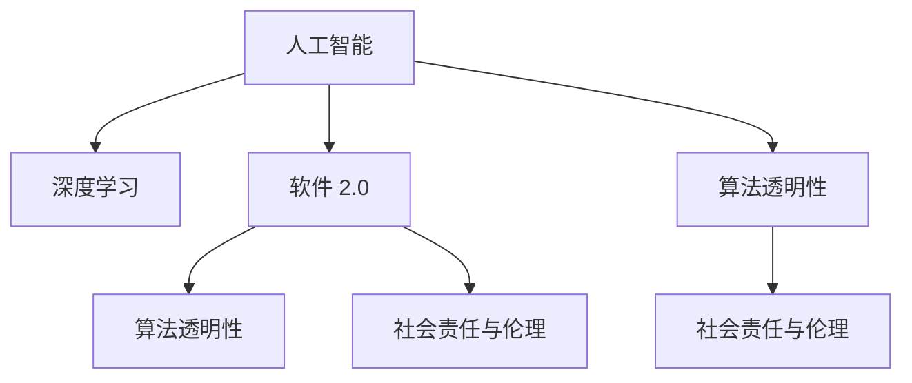

                 

# 软件 2.0 的未来愿景：创造更美好的世界

## 1. 背景介绍

### 1.1 问题由来

随着人工智能技术的迅猛发展，特别是深度学习模型的广泛应用，我们正处于一个前所未有的信息化时代。这个时代，我们见证了从软件 1.0 到软件 2.0 的转变，软件开始拥有更高的自主性和创造性，能够像人类一样思考和行动。但是，随之而来的挑战也日益凸显。

软件 2.0 的应用涉及各种领域，从自动驾驶、医疗健康、金融服务到教育娱乐，它的智能化和自动化水平正在快速提升，这不仅提高了工作效率，也为人类的生活带来了深远的影响。然而，这同时也引发了一系列社会、伦理和道德问题。如何在技术进步的同时，确保社会的公平、安全和可持续发展，成为了当下亟需解决的问题。

### 1.2 问题核心关键点

软件 2.0 的关键在于如何平衡技术进步与社会需求之间的关系。以下几个核心问题值得关注：

- **数据隐私与安全**：软件 2.0 依赖于大量数据进行训练和优化，如何在保障数据隐私的同时，提升模型性能？
- **算法透明性与可解释性**：软件 2.0 模型的决策过程往往是黑箱，如何在复杂情况下提供透明的解释，增强公众信任？
- **社会责任与伦理**：软件 2.0 模型在决策过程中可能会产生偏见，如何避免算法偏见，确保决策公正？
- **人机协作**：如何实现人机协作的最佳效果，提升用户体验，同时避免机器替代人类工作岗位？
- **跨领域应用**：软件 2.0 模型在跨领域应用中面临的挑战，如自然语言处理、计算机视觉、机器人技术等。

这些问题不仅关系到技术的发展，更关系到社会的进步和未来。

## 2. 核心概念与联系

### 2.1 核心概念概述

要理解软件 2.0 的未来愿景，首先需要明确几个核心概念：

- **人工智能**：通过计算机程序来模拟、延伸和扩展人类智能的理论、方法、技术及应用系统。
- **深度学习**：一种基于神经网络的人工智能技术，通过多层非线性映射，学习数据的复杂特征。
- **软件 2.0**：指具备自我学习、自我优化能力，能够主动适应环境变化的软件系统。
- **算法透明性**：指算法的决策过程和结果可以被透明理解和解释。
- **社会责任与伦理**：指软件系统在开发和应用过程中，应遵循的社会价值观和道德规范。

这些概念之间存在着紧密的联系，共同构成了软件 2.0 的框架。

### 2.2 核心概念原理和架构的 Mermaid 流程图



这个流程图展示了人工智能、深度学习、软件 2.0、算法透明性以及社会责任与伦理之间的关系。深度学习作为人工智能的一个子集，通过学习复杂的数据模式，赋能软件 2.0 系统。软件 2.0 通过算法透明性，提升系统的可解释性和公众信任。社会责任与伦理则是软件 2.0 系统设计的重要考量因素。

## 3. 核心算法原理 & 具体操作步骤

### 3.1 算法原理概述

软件 2.0 的核心算法原理基于深度学习和强化学习。深度学习模型通过大量数据进行训练，学习数据中的复杂关系，从而实现数据的自动处理和分析。强化学习则通过与环境的交互，不断优化决策策略，提升系统的自主性和适应性。

### 3.2 算法步骤详解

软件 2.0 的构建过程一般包括以下步骤：

1. **数据准备**：收集并清洗大量数据，选择合适的数据集和标注方法。
2. **模型训练**：使用深度学习算法，如卷积神经网络（CNN）、循环神经网络（RNN）、变分自编码器（VAE）等，对数据进行训练。
3. **模型优化**：通过调整超参数、引入正则化技术、应用迁移学习等手段，提升模型性能。
4. **部署与监控**：将训练好的模型部署到实际应用环境中，实时监控模型性能和数据流，确保系统稳定运行。
5. **持续改进**：根据实时反馈数据，不断优化模型和算法，提升系统的适应性和可靠性。

### 3.3 算法优缺点

软件 2.0 算法具有以下优点：

- **自主学习**：能够自动从数据中学习，无需人工干预，提升效率和准确性。
- **高适应性**：能够根据环境变化和需求，自我调整和优化，具备强大的适应能力。
- **数据驱动**：通过数据驱动的决策，提升系统的科学性和可信度。

同时，也存在一些缺点：

- **数据依赖性强**：依赖于高质量、大样本的数据，获取数据成本高。
- **算法复杂度高**：模型结构和参数复杂，难以理解和调试。
- **资源消耗大**：训练和部署需要高性能计算资源，硬件成本高。

### 3.4 算法应用领域

软件 2.0 在多个领域都有广泛应用，例如：

- **自动驾驶**：通过深度学习和强化学习，实现自动驾驶车辆的自主导航和决策。
- **医疗健康**：利用深度学习模型，进行疾病诊断、药物研发和个性化治疗。
- **金融服务**：应用深度学习算法，进行信用评估、欺诈检测和投资策略优化。
- **教育娱乐**：通过智能推荐系统，个性化推荐学习内容和娱乐内容。
- **智能客服**：利用自然语言处理技术，实现智能问答和自动化服务。
- **工业自动化**：通过智能控制和预测维护，提升工业生产效率和安全性。

## 4. 数学模型和公式 & 详细讲解 & 举例说明

### 4.1 数学模型构建

软件 2.0 的构建依赖于数学模型，常见的模型包括：

- **卷积神经网络（CNN）**：用于图像处理和计算机视觉任务，通过卷积层和池化层提取特征。
- **循环神经网络（RNN）**：用于序列数据处理，如自然语言处理和语音识别。
- **变分自编码器（VAE）**：用于生成模型，能够生成与训练数据分布相似的新样本。
- **对抗生成网络（GAN）**：用于生成高质量图像和音频，通过对抗训练提升生成效果。

### 4.2 公式推导过程

以卷积神经网络为例，其基本结构如图：


卷积神经网络的主要操作包括卷积、池化、全连接等。卷积操作通过卷积核提取特征，池化操作用于减小特征图大小，全连接层用于分类或回归。

### 4.3 案例分析与讲解

假设我们要构建一个手写数字识别的软件 2.0 系统，步骤如下：

1. **数据准备**：收集大量手写数字图片，进行预处理和标注。
2. **模型构建**：搭建卷积神经网络模型，包括卷积层、池化层和全连接层。
3. **模型训练**：使用训练数据对模型进行训练，调整超参数和正则化系数。
4. **模型评估**：在测试集上评估模型性能，优化模型结构和参数。
5. **模型部署**：将训练好的模型部署到实际应用中，实时处理手写数字图片。

## 5. 项目实践：代码实例和详细解释说明

### 5.1 开发环境搭建

1. **安装Python和相关库**：
   ```bash
   sudo apt-get update
   sudo apt-get install python3-pip python3-dev
   pip3 install numpy scipy matplotlib tensorboard tensorflow-gpu
   ```

2. **安装TensorFlow**：
   ```bash
   pip3 install tensorflow-gpu
   ```

3. **安装Keras**：
   ```bash
   pip3 install keras
   ```

### 5.2 源代码详细实现

以下是一个手写数字识别的卷积神经网络模型的实现：

```python
import tensorflow as tf
from tensorflow.keras import layers, models

# 定义模型结构
model = models.Sequential()
model.add(layers.Conv2D(32, (3, 3), activation='relu', input_shape=(28, 28, 1)))
model.add(layers.MaxPooling2D((2, 2)))
model.add(layers.Conv2D(64, (3, 3), activation='relu'))
model.add(layers.MaxPooling2D((2, 2)))
model.add(layers.Flatten())
model.add(layers.Dense(64, activation='relu'))
model.add(layers.Dense(10))

# 编译模型
model.compile(optimizer='adam',
              loss=tf.keras.losses.SparseCategoricalCrossentropy(from_logits=True),
              metrics=['accuracy'])

# 训练模型
model.fit(train_images, train_labels, epochs=10, validation_data=(test_images, test_labels))

# 评估模型
test_loss, test_acc = model.evaluate(test_images, test_labels, verbose=2)
print('Test accuracy:', test_acc)
```

### 5.3 代码解读与分析

- **模型结构**：包括卷积层、池化层和全连接层，用于提取特征和分类。
- **编译模型**：选择Adam优化器，使用交叉熵损失函数，并设置评估指标为准确率。
- **训练模型**：在训练集上训练模型，设定训练轮数为10。
- **评估模型**：在测试集上评估模型性能，输出准确率。

## 6. 实际应用场景

### 6.1 自动驾驶

自动驾驶是软件 2.0 的重要应用领域之一。通过深度学习和强化学习算法，自动驾驶车辆可以实现自主导航和决策，提升行车安全性和效率。

**技术实现**：
1. **环境感知**：使用摄像头、激光雷达等传感器，构建车辆周围环境的3D模型。
2. **路径规划**：基于地图和实时交通数据，规划最优路径。
3. **决策控制**：通过深度学习模型，预测其他车辆和行人的行为，进行决策和控制。

**应用场景**：
- **高速公路**：在高速公路上实现自动巡航和车道保持。
- **城市道路**：在城市道路上实现自动驾驶，避开障碍物和行人。
- **物流配送**：在物流配送中心，实现自动化驾驶和智能调度。

### 6.2 医疗健康

在医疗健康领域，软件 2.0 系统可以通过深度学习算法，辅助医生进行疾病诊断和治疗决策。

**技术实现**：
1. **医学影像分析**：通过深度学习模型，自动分析X光片、CT扫描和MRI图像。
2. **疾病预测**：利用深度学习算法，预测患者的疾病风险和病程发展。
3. **个性化治疗**：通过分析患者的历史数据，制定个性化的治疗方案。

**应用场景**：
- **早期筛查**：在早期筛查中，辅助医生进行癌症、糖尿病等疾病的早期发现。
- **疾病管理**：在疾病管理中，辅助医生制定个性化的治疗方案和药物使用计划。
- **远程医疗**：在远程医疗中，辅助医生进行远程诊断和治疗。

### 6.3 金融服务

金融服务领域，软件 2.0 系统可以通过深度学习算法，进行风险评估、欺诈检测和投资策略优化。

**技术实现**：
1. **风险评估**：利用深度学习模型，分析客户的信用记录和行为数据，评估其信用风险。
2. **欺诈检测**：通过深度学习算法，识别异常交易和欺诈行为。
3. **投资策略**：应用深度学习模型，优化投资组合和交易策略，提升收益。

**应用场景**：
- **贷款审批**：在贷款审批中，辅助银行评估客户的信用风险。
- **信用卡管理**：在信用卡管理中，识别和预防信用卡欺诈行为。
- **资产管理**：在资产管理中，制定个性化的投资策略和风险控制方案。

## 7. 工具和资源推荐

### 7.1 学习资源推荐

为了更好地掌握软件 2.0 的知识，推荐以下学习资源：

1. **《深度学习》**：Ian Goodfellow等著，介绍了深度学习的基本概念和算法。
2. **《TensorFlow实战》**：Shreya Seshamani等著，介绍了TensorFlow的深度学习应用。
3. **《软件工程：构建可维护的可靠性软件》**：Rogers Cadenhead等著，介绍了软件工程的基本方法和工具。
4. **《人工智能伦理》**：Nikolas P. L. Travers等著，介绍了人工智能伦理的案例和原则。

### 7.2 开发工具推荐

以下是几款用于软件 2.0 开发的工具：

1. **TensorFlow**：由Google开发的深度学习框架，支持分布式计算和GPU加速。
2. **PyTorch**：由Facebook开发的深度学习框架，支持动态计算图和灵活的模型构建。
3. **Keras**：高层次的深度学习API，简单易用，支持多种深度学习框架。
4. **Jupyter Notebook**：交互式编程环境，支持Python和R等多种编程语言。

### 7.3 相关论文推荐

软件 2.0 领域的研究论文众多，以下是几篇重要的论文推荐：

1. **《ImageNet Classification with Deep Convolutional Neural Networks》**：Alex Krizhevsky等著，介绍了深度卷积神经网络在图像分类中的应用。
2. **《A Survey of Recent Trends in Deep Learning-based Multimodal Machine Learning》**：Vikas Subramaniam等著，介绍了多模态深度学习的最新进展。
3. **《Towards General Artificial Intelligence with Multimodal Models》**：Leon A. Gatys等著，介绍了多模态模型在通用人工智能中的应用。

## 8. 总结：未来发展趋势与挑战

### 8.1 研究成果总结

软件 2.0 已经在多个领域展示了其强大的潜力，通过深度学习和强化学习算法，实现了自主学习和自主优化。但同时，也面临着数据隐私、算法透明性和社会责任等方面的挑战。

### 8.2 未来发展趋势

未来，软件 2.0 将呈现以下几个发展趋势：

1. **自动化和智能化**：通过深度学习算法，实现更高级别的自动化和智能化。
2. **跨领域应用**：软件 2.0 将广泛应用于各个领域，提升生产力和效率。
3. **数据驱动**：通过数据驱动的方法，提升系统的可靠性和科学性。
4. **人机协作**：实现人机协作的最佳效果，提升用户体验。
5. **伦理和道德**：在软件开发过程中，重视伦理和道德问题，确保系统的公平性和透明性。

### 8.3 面临的挑战

软件 2.0 的发展也面临着诸多挑战：

1. **数据隐私与安全**：如何保障数据隐私和安全，防止数据泄露和滥用。
2. **算法透明性与可解释性**：如何提高算法的透明性和可解释性，增强公众信任。
3. **社会责任与伦理**：如何避免算法偏见，确保决策公正，提升社会公平。
4. **资源消耗与成本**：如何降低资源消耗和成本，实现高效、低成本的软件开发。
5. **系统鲁棒性与可靠性**：如何提升系统的鲁棒性和可靠性，应对各种异常情况。

### 8.4 研究展望

未来，软件 2.0 的研究方向将包括：

1. **深度学习和强化学习的融合**：将深度学习和强化学习算法相结合，提升系统的自主性和适应性。
2. **多模态融合**：将视觉、听觉、语言等多模态信息融合，提升系统的感知和理解能力。
3. **跨领域应用**：将软件 2.0 应用于更多领域，提升各行业的工作效率和生产力。
4. **伦理与道德**：在软件 2.0 的开发和应用中，重视伦理和道德问题，确保系统的公平性和透明性。

## 9. 附录：常见问题与解答

### Q1：软件 2.0 与软件 1.0 的区别是什么？

**A1**：软件 2.0 与软件 1.0 的区别在于，软件 2.0 具有自我学习、自我优化的能力，能够自动从数据中学习，并进行自主决策，而软件 1.0 则需要人工干预，依赖于预设的规则和逻辑。

### Q2：软件 2.0 在实际应用中需要考虑哪些问题？

**A2**：软件 2.0 在实际应用中需要考虑的问题包括：

1. **数据隐私与安全**：如何保护数据隐私，防止数据泄露和滥用。
2. **算法透明性与可解释性**：如何提高算法的透明性和可解释性，增强公众信任。
3. **社会责任与伦理**：如何避免算法偏见，确保决策公正，提升社会公平。
4. **资源消耗与成本**：如何降低资源消耗和成本，实现高效、低成本的软件开发。
5. **系统鲁棒性与可靠性**：如何提升系统的鲁棒性和可靠性，应对各种异常情况。

### Q3：如何保障软件 2.0 的数据隐私和安全？

**A3**：保障软件 2.0 的数据隐私和安全，可以通过以下措施：

1. **数据加密**：对敏感数据进行加密处理，防止数据泄露。
2. **访问控制**：设置严格的访问控制权限，防止未经授权的访问。
3. **数据匿名化**：对数据进行匿名化处理，防止数据识别和滥用。
4. **安全审计**：定期进行安全审计，发现和修复安全漏洞。

### Q4：软件 2.0 的算法透明性如何实现？

**A4**：实现软件 2.0 的算法透明性，可以通过以下方法：

1. **模型可视化**：使用可视化工具，展示模型的决策过程和特征重要性。
2. **模型解释**：使用模型解释技术，生成可解释的决策路径和结果。
3. **可解释模型**：使用可解释模型，如决策树、规则引擎等，提供透明的决策依据。

### Q5：软件 2.0 如何避免算法偏见？

**A5**：避免软件 2.0 的算法偏见，可以通过以下方法：

1. **数据多样化**：收集多样化的数据，避免数据偏见。
2. **公平性约束**：在模型训练中，引入公平性约束，确保决策公正。
3. **透明度**：提高算法的透明性，方便检测和纠正偏见。
4. **人工干预**：引入人工干预和监督，确保决策公正和透明。

---

作者：禅与计算机程序设计艺术 / Zen and the Art of Computer Programming

