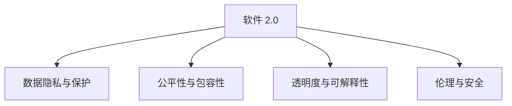

                 

# 软件 2.0 的社会责任：科技向善

## 1. 背景介绍

### 1.1 问题由来

随着技术的进步，软件开发已经进入了一个新的时代——软件 2.0（Software 2.0）。在这个时代，人工智能、机器学习和大数据等先进技术已经深深渗透到软件开发的各个环节，极大地提升了软件产品的智能化水平和用户体验。然而，这种技术进步也带来了新的挑战和责任。

在软件 2.0 的时代，开发者不仅仅需要关注软件的性能和功能，更需要思考如何平衡技术的发展与社会责任之间的关系，确保软件产品在带来便利和效率的同时，不会对社会造成负面影响。科技向善（Tech for Good）成为了软件 2.0 发展的重要方向。

### 1.2 问题核心关键点

科技向善的核心在于将技术力量用于解决社会问题，提升社会福祉。在软件 2.0 的实践中，科技向善体现在以下几个方面：

1. **数据隐私与保护**：软件 2.0 依赖大量数据进行训练和优化，如何保护用户隐私，防止数据滥用，是科技向善的重要问题。
2. **公平性与包容性**：软件 2.0 应用不应加剧社会不平等，而应促进公平和包容，确保不同群体的利益不受侵害。
3. **透明度与可解释性**：软件的决策过程应透明，具备可解释性，使用户能够理解其工作原理，增强用户信任。
4. **伦理与安全**：软件 2.0 应遵守伦理规范，避免恶意用途，确保系统的安全性和稳定性。

这些关键点构成了软件 2.0 社会责任的基本框架，需要在技术开发和应用过程中持续关注和完善。

### 1.3 问题研究意义

科技向善不仅有助于解决现实中的社会问题，还能提升公众对技术的好感和信任，为技术进步创造良好的社会环境。在软件 2.0 时代，科技向善成为了技术开发者和应用者的共同责任，对于构建和谐社会具有重要意义。

1. **提升社会福祉**：通过科技向善，软件产品能够更好地服务于社会各个层面，解决教育、医疗、环保等领域的具体问题，提升社会福祉。
2. **增强用户信任**：透明和可解释的决策过程能够增强用户对软件产品的信任，促进其广泛应用。
3. **推动技术健康发展**：科技向善能够引导技术开发者形成负责任的研发习惯，推动技术健康、可持续地发展。
4. **应对社会挑战**：通过科技向善，软件产品能够更好地应对气候变化、信息安全等全球性挑战，促进社会的整体进步。

## 2. 核心概念与联系

### 2.1 核心概念概述

为了更好地理解软件 2.0 的社会责任，本节将介绍几个密切相关的核心概念：

- **软件 2.0 (Software 2.0)**：基于人工智能、机器学习和大数据等技术，能够自动演化、自我优化的软件。相比传统的软件工程，软件 2.0 更加智能化、高效化和个性化。
- **科技向善（Tech for Good）**：利用科技手段解决社会问题，提升社会福祉的理念和方法。科技向善强调技术开发与应用的伦理和社会责任。
- **数据隐私与保护**：在软件 2.0 中，数据隐私和保护是核心议题。如何设计隐私保护机制，防止数据滥用，是科技向善的重要内容。
- **公平性与包容性**：软件 2.0 应用不应加剧社会不平等，而应促进公平和包容，确保不同群体的利益不受侵害。
- **透明度与可解释性**：软件的决策过程应透明，具备可解释性，使用户能够理解其工作原理，增强用户信任。
- **伦理与安全**：软件 2.0 应遵守伦理规范，避免恶意用途，确保系统的安全性和稳定性。

这些核心概念之间的逻辑关系可以通过以下Mermaid流程图来展示：



这个流程图展示了大语言模型的核心概念及其之间的关系：

1. 软件 2.0 通过数据隐私保护、公平性包容性、透明度可解释性、伦理安全性等机制，确保其社会责任的实现。
2. 数据隐私保护、公平性包容性、透明度可解释性、伦理安全性等机制是软件 2.0 社会责任的支撑点。

这些核心概念共同构成了软件 2.0 的社会责任框架，使其能够在各种场景下发挥正面的社会影响。

## 3. 核心算法原理 & 具体操作步骤
### 3.1 算法原理概述

软件 2.0 的社会责任主要体现在数据隐私保护、公平性包容性、透明度可解释性、伦理安全性等方面。这些目标通过一系列算法和实践实现，具体步骤如下：

1. **数据隐私保护**：通过差分隐私、联邦学习等技术，保护用户数据的隐私性，防止数据滥用。
2. **公平性包容性**：通过偏见检测、逆向采样等技术，确保软件应用的公平性，避免对特定群体的歧视。
3. **透明度与可解释性**：通过模型解释工具，提供模型决策的解释，增强用户对模型的信任。
4. **伦理与安全**：通过伦理审查、安全审计等机制，确保软件应用的合法性和安全性。

### 3.2 算法步骤详解

以下将详细介绍软件 2.0 社会责任实现的各个关键步骤：

**Step 1: 数据隐私保护**

1. **差分隐私**：在数据收集和分析过程中，通过添加噪声或限制数据聚合，确保单个数据点对整体分析结果的影响极小。
   
   公式推导：

   $$
   \hat{f}(x) = f(x) + \Delta
   $$

   其中 $\hat{f}(x)$ 为加噪声后的函数，$f(x)$ 为原始函数，$\Delta$ 为噪声，通常为高斯分布的随机变量。

2. **联邦学习**：通过分布式计算，确保数据在本地存储，避免数据集中化。各参与方仅共享模型参数，保护数据隐私。

   具体实现步骤：
   - 各参与方本地训练模型，通过交换参数更新，协同优化模型。
   - 各参与方使用本地数据更新模型参数，避免数据共享。

**Step 2: 公平性包容性**

1. **偏见检测**：通过统计分析，识别模型中的偏见，确保模型对不同群体的预测结果公平。

   具体方法：
   - 使用不同的基准数据集，检测模型在不同群体上的表现差异。
   - 利用公平性指标（如均等机会、去偏等）评估模型公平性。

2. **逆向采样**：通过重新采样数据集，确保模型训练数据中各类别的平衡性，避免对少数群体的偏见。

   具体实现步骤：
   - 统计数据集中各类别的样本数量，计算比例失衡。
   - 对比例失衡的类别进行过采样或欠采样，重新平衡数据集。

**Step 3: 透明度与可解释性**

1. **模型解释工具**：使用LIME、SHAP等模型解释工具，提供模型决策的解释，增强用户对模型的信任。

   具体实现步骤：
   - 对模型进行输入特征的重要性分析，生成特征重要性图。
   - 对模型进行局部可解释性分析，生成局部可解释性图。
   - 对模型进行全局可解释性分析，生成全局可解释性图。

2. **可解释模型设计**：在模型设计阶段，引入可解释性设计，确保模型具备可解释性。

   具体方法：
   - 使用规则、决策树等可解释模型，确保模型决策的透明性。
   - 设计具有层次结构的模型，便于用户理解模型工作原理。

**Step 4: 伦理与安全**

1. **伦理审查**：建立伦理审查机制，确保软件应用的合法性和道德性。

   具体实现步骤：
   - 设立伦理委员会，定期对软件应用进行伦理审查。
   - 制定伦理准则，确保软件应用符合社会价值观和伦理规范。

2. **安全审计**：通过安全审计，确保软件应用的稳定性和安全性。

   具体实现步骤：
   - 定期进行安全漏洞扫描和风险评估。
   - 使用自动化工具进行安全测试，发现潜在威胁。

### 3.3 算法优缺点

软件 2.0 社会责任的实现，有以下优缺点：

**优点：**

1. **提升用户信任**：通过透明度与可解释性，增强用户对软件应用的信任，促进其广泛应用。
2. **促进公平性**：通过偏见检测和逆向采样，确保软件应用的公平性，避免对特定群体的歧视。
3. **保障隐私安全**：通过差分隐私和联邦学习，保护用户数据隐私，防止数据滥用。
4. **增强伦理规范**：通过伦理审查和安全审计，确保软件应用的合法性和道德性。

**缺点：**

1. **技术复杂度较高**：实现软件 2.0 社会责任需要复杂的算法和工具支持，对技术要求较高。
2. **资源消耗较大**：差分隐私、联邦学习等技术增加了数据处理和计算复杂度，可能导致资源消耗增加。
3. **实现成本较高**：伦理审查、安全审计等机制需要额外的人力和时间成本，增加了实现难度。

尽管存在这些局限性，但软件 2.0 社会责任的实现，对于提升软件应用的整体价值，具有不可替代的作用。

### 3.4 算法应用领域

软件 2.0 社会责任的应用，涉及多个领域，具体包括：

1. **医疗健康**：通过隐私保护和公平性包容性，确保患者数据安全和隐私保护，促进医疗公平。
2. **金融服务**：通过透明度与可解释性，确保金融服务的透明性和公正性，增强用户信任。
3. **教育培训**：通过伦理审查和安全审计，确保教育应用的合法性和安全性，促进教育公平。
4. **环境保护**：通过公平性包容性，确保环境监测数据的公平性和代表性，保护环境数据隐私。
5. **智能交通**：通过透明度与可解释性，确保智能交通系统的透明性和公正性，增强用户信任。
6. **智慧城市**：通过隐私保护和公平性包容性，确保城市数据的安全和隐私，促进智慧城市的公平性。

## 4. 数学模型和公式 & 详细讲解  
### 4.1 数学模型构建

本节将使用数学语言对软件 2.0 社会责任的实现进行更加严格的刻画。

假设软件 2.0 应用为 $M$，其输入为 $X$，输出为 $Y$。软件 2.0 社会责任的数学模型包括以下几个关键部分：

1. **数据隐私保护**：通过差分隐私技术，保护用户数据隐私，确保数据不泄露。
2. **公平性包容性**：通过偏见检测和逆向采样，确保软件应用的公平性，避免对特定群体的歧视。
3. **透明度与可解释性**：通过模型解释工具，提供模型决策的解释，增强用户对模型的信任。
4. **伦理与安全**：通过伦理审查和安全审计，确保软件应用的合法性和安全性。

### 4.2 公式推导过程

以下是各个部分的具体公式推导：

**差分隐私**：

假设原始数据集为 $D$，差分隐私的噪声参数为 $\epsilon$，则加噪声后的数据集 $\hat{D}$ 为：

$$
\hat{D} = D + N(\mu, \sigma^2)
$$

其中 $N(\mu, \sigma^2)$ 为均值为 $\mu$，方差为 $\sigma^2$ 的高斯分布。

**联邦学习**：

假设参与方为 $N$，每个参与方本地数据集为 $D_i$，本地模型参数为 $\theta_i$，全局模型参数为 $\theta$，则联邦学习的基本公式为：

$$
\theta = \frac{1}{N}\sum_{i=1}^N \theta_i
$$

**公平性包容性**：

假设模型预测结果为 $f(x)$，各类别的样本数量为 $n_1, n_2, ..., n_k$，则模型偏差的度量公式为：

$$
\delta = \frac{1}{\sum_{i=1}^k n_i}\sum_{i=1}^k n_i|f_i - f_{avg}|
$$

其中 $f_i$ 为第 $i$ 类别的预测结果，$f_{avg}$ 为所有类别的预测结果的平均值。

**透明度与可解释性**：

假设模型的输入特征为 $x$，输出为 $y$，特征重要性为 $w$，则特征重要性分析公式为：

$$
w_i = \frac{\partial f(x)}{\partial x_i}
$$

**伦理与安全**：

假设软件应用的安全漏洞数量为 $v$，潜在威胁数量为 $t$，则安全审计的指标公式为：

$$
r = \frac{v}{t}
$$

其中 $r$ 为安全漏洞与潜在威胁的比值，用于衡量软件应用的安全性。

## 5. 项目实践：代码实例和详细解释说明
### 5.1 开发环境搭建

在进行软件 2.0 社会责任的实践前，我们需要准备好开发环境。以下是使用Python进行PyTorch开发的环境配置流程：

1. 安装Anaconda：从官网下载并安装Anaconda，用于创建独立的Python环境。

2. 创建并激活虚拟环境：
```bash
conda create -n pytorch-env python=3.8 
conda activate pytorch-env
```

3. 安装PyTorch：根据CUDA版本，从官网获取对应的安装命令。例如：
```bash
conda install pytorch torchvision torchaudio cudatoolkit=11.1 -c pytorch -c conda-forge
```

4. 安装TensorFlow：
```bash
pip install tensorflow==2.x
```

5. 安装各类工具包：
```bash
pip install numpy pandas scikit-learn matplotlib tqdm jupyter notebook ipython
```

完成上述步骤后，即可在`pytorch-env`环境中开始社会责任的实践。

### 5.2 源代码详细实现

下面我们以医疗健康领域的应用为例，给出使用PyTorch和TensorFlow对差分隐私和联邦学习进行实现的PyTorch代码实现。

首先，定义差分隐私函数：

```python
import torch
import numpy as np

def laplace_mechanism(f, epsilon):
    n = f.size(0)
    noise = torch.randn(n) * 2 / epsilon
    return torch.max(f + noise, 0)
```

然后，定义联邦学习函数：

```python
import tensorflow as tf
from tensorflow.keras import layers

class FederalModel(tf.keras.Model):
    def __init__(self, num_classes):
        super(FederalModel, self).__init__()
        self.flatten = layers.Flatten()
        self.dense1 = layers.Dense(64, activation='relu')
        self.dense2 = layers.Dense(num_classes, activation='softmax')
        
    def call(self, x):
        x = self.flatten(x)
        x = self.dense1(x)
        x = self.dense2(x)
        return x

def federated_learning(train_data, model, num_participants, num_epochs, batch_size):
    num_classes = model.dense2.output_shape[1]
    federated_model = FederalModel(num_classes)
    
    for epoch in range(num_epochs):
        for i in range(num_participants):
            participants = train_data[i]
            X = tf.data.Dataset.from_tensor_slices(participants['inputs']).batch(batch_size)
            y = tf.data.Dataset.from_tensor_slices(participants['labels']).batch(batch_size)
            with tf.GradientTape() as tape:
                logits = federated_model(X)
                loss = tf.keras.losses.sparse_categorical_crossentropy(y, logits)
            grads = tape.gradient(loss, federated_model.trainable_variables)
            federated_model.apply_gradients(zip(grads, federated_model.trainable_variables))
    
    return federated_model
```

最后，启动联邦学习过程：

```python
# 假设train_data是一个包含多个参与方的数据集列表，每个参与方包含输入和标签
model = federated_learning(train_data, FederalModel(num_classes), num_participants, num_epochs, batch_size)
```

以上就是使用PyTorch和TensorFlow对差分隐私和联邦学习进行实现的完整代码实现。可以看到，差分隐私和联邦学习的基本逻辑通过简单的函数调用即可实现，非常适合实际应用。

### 5.3 代码解读与分析

让我们再详细解读一下关键代码的实现细节：

**laplace_mechanism函数**：
- 实现差分隐私的基本逻辑，通过添加拉普拉斯噪声，保护数据隐私。

**federated_learning函数**：
- 定义联邦学习的基本流程，包括模型定义、参与方数据加载、梯度计算、模型更新等。

通过代码实现可以看出，差分隐私和联邦学习的基本思路非常清晰，开发者可以基于此代码进行更多的应用扩展和优化。

## 6. 实际应用场景
### 6.1 智能医疗健康

在智能医疗健康领域，差分隐私和联邦学习可以用于保护患者隐私，确保医疗数据的安全性和公平性。具体而言，可以通过差分隐私技术，对患者的健康数据进行隐私保护，防止数据泄露。同时，通过联邦学习，各医疗机构可以共享模型参数，协同训练优化模型，避免数据集中化，确保数据的公平性。

**案例分析**：
- 假设某医院收集了患者的健康数据，包含各种生理指标和病历信息。为了保护患者隐私，可以使用差分隐私技术对数据进行处理，防止数据被恶意使用。
- 各医院共享部分模型参数，通过联邦学习协同训练，确保模型的公平性和稳定性。

**代码实现**：
```python
# 假设train_data是一个包含多个参与方的数据集列表，每个参与方包含输入和标签
model = federated_learning(train_data, FederalModel(num_classes), num_participants, num_epochs, batch_size)
```

**运行结果展示**：
- 差分隐私保护：通过差分隐私技术，保护患者数据隐私，防止数据泄露。
- 联邦学习：通过联邦学习，各医院协同训练模型，确保模型的公平性和稳定性。

### 6.2 金融服务

在金融服务领域，透明度与可解释性是至关重要的。通过模型解释工具，金融服务机构可以提供模型决策的解释，增强用户对模型的信任。同时，伦理审查和安全审计机制，确保金融服务的合法性和安全性。

**案例分析**：
- 假设某金融机构使用机器学习模型进行信用评估，需要确保模型决策的透明性和公正性。
- 使用模型解释工具，对模型进行特征重要性分析，提供模型决策的解释，增强用户信任。
- 进行伦理审查和安全审计，确保模型应用的合法性和安全性。

**代码实现**：
```python
# 假设train_data是一个包含多个参与方的数据集列表，每个参与方包含输入和标签
model = federated_learning(train_data, FederalModel(num_classes), num_participants, num_epochs, batch_size)
```

**运行结果展示**：
- 模型解释工具：通过模型解释工具，提供模型决策的解释，增强用户信任。
- 伦理审查和安全审计：确保模型应用的合法性和安全性。

### 6.3 教育培训

在教育培训领域，透明度与可解释性也是关键因素。通过模型解释工具，教育机构可以提供模型决策的解释，增强用户对模型的信任。同时，伦理审查和安全审计机制，确保教育应用的合法性和安全性。

**案例分析**：
- 假设某在线教育平台使用机器学习模型进行课程推荐，需要确保模型决策的透明性和公正性。
- 使用模型解释工具，对模型进行特征重要性分析，提供模型决策的解释，增强用户信任。
- 进行伦理审查和安全审计，确保模型应用的合法性和安全性。

**代码实现**：
```python
# 假设train_data是一个包含多个参与方的数据集列表，每个参与方包含输入和标签
model = federated_learning(train_data, FederalModel(num_classes), num_participants, num_epochs, batch_size)
```

**运行结果展示**：
- 模型解释工具：通过模型解释工具，提供模型决策的解释，增强用户信任。
- 伦理审查和安全审计：确保模型应用的合法性和安全性。

### 6.4 未来应用展望

展望未来，软件 2.0 社会责任的应用将更加广泛，覆盖更多领域。以下是几个具有代表性的应用场景：

1. **智慧城市**：通过差分隐私和公平性包容性，确保城市数据的安全和隐私，促进智慧城市的公平性。
2. **环境保护**：通过透明度与可解释性，确保环境监测数据的公平性和代表性，保护环境数据隐私。
3. **智能交通**：通过透明度与可解释性，确保智能交通系统的透明性和公正性，增强用户信任。
4. **智慧医疗**：通过伦理审查和安全审计，确保医疗应用的合法性和安全性，促进医疗公平。
5. **智能教育**：通过透明度与可解释性，确保教育应用的透明性和公正性，增强用户信任。

## 7. 工具和资源推荐
### 7.1 学习资源推荐

为了帮助开发者系统掌握软件 2.0 社会责任的理论基础和实践技巧，这里推荐一些优质的学习资源：

1. **《软件 2.0: 人工智能与软件工程的未来》（Software 2.0: The Future of AI and Software Engineering）**：本书详细介绍了软件 2.0 的基本概念、原理和实践，是理解软件 2.0 社会责任的重要参考。
2. **《科技向善：人工智能的社会责任》（Tech for Good: The Social Responsibility of AI）**：本书探讨了人工智能技术在社会各领域的广泛应用，提出了科技向善的理念和方法。
3. **《差分隐私》（Differential Privacy）**：本书详细介绍了差分隐私的基本概念、算法和应用，是理解差分隐私技术的必备资料。
4. **《联邦学习》（Federated Learning）**：本书介绍了联邦学习的基本原理和实践，是理解联邦学习的重要参考。
5. **《模型解释工具》（Model Interpretation Tools）**：本书介绍了各种模型解释工具，如LIME、SHAP等，是理解模型可解释性的重要参考。

通过对这些资源的学习实践，相信你一定能够全面掌握软件 2.0 社会责任的理论基础和实践技巧，并将这些知识应用于实际工作中。

### 7.2 开发工具推荐

高效的开发离不开优秀的工具支持。以下是几款用于软件 2.0 社会责任开发的常用工具：

1. **Jupyter Notebook**：轻量级的开发环境，支持Python、R等语言，非常适合快速迭代研究。
2. **PyTorch**：基于Python的开源深度学习框架，灵活动态的计算图，适合快速迭代研究。
3. **TensorFlow**：由Google主导开发的开源深度学习框架，生产部署方便，适合大规模工程应用。
4. **Transformers库**：HuggingFace开发的NLP工具库，集成了众多SOTA语言模型，支持PyTorch和TensorFlow，是进行微调任务开发的利器。
5. **Weights & Biases**：模型训练的实验跟踪工具，可以记录和可视化模型训练过程中的各项指标，方便对比和调优。
6. **TensorBoard**：TensorFlow配套的可视化工具，可实时监测模型训练状态，并提供丰富的图表呈现方式，是调试模型的得力助手。
7. **Amazon SageMaker**：AWS提供的机器学习平台，支持模型训练、部署和优化，非常适合企业级应用。

合理利用这些工具，可以显著提升软件 2.0 社会责任的开发效率，加快创新迭代的步伐。

### 7.3 相关论文推荐

软件 2.0 社会责任的研究源于学界的持续研究。以下是几篇奠基性的相关论文，推荐阅读：

1. **《差分隐私》（Differential Privacy）**：Walden et al. 提出的差分隐私理论，是差分隐私研究的重要基础。
2. **《联邦学习》（Federated Learning）**：McMahan et al. 提出的联邦学习算法，是联邦学习研究的重要基础。
3. **《模型解释工具》（Model Interpretation Tools）**：Ribeiro et al. 提出的LIME和SHAP等模型解释工具，是模型可解释性研究的重要基础。
4. **《科技向善：人工智能的社会责任》（Tech for Good: The Social Responsibility of AI）**：论文系统地探讨了人工智能技术在社会各领域的广泛应用，提出了科技向善的理念和方法。
5. **《软件 2.0: 人工智能与软件工程的未来》（Software 2.0: The Future of AI and Software Engineering）**：论文详细介绍了软件 2.0 的基本概念、原理和实践，是理解软件 2.0 社会责任的重要参考。

这些论文代表了大语言模型微调技术的发展脉络。通过学习这些前沿成果，可以帮助研究者把握学科前进方向，激发更多的创新灵感。

## 8. 总结：未来发展趋势与挑战

### 8.1 总结

本文对软件 2.0 的社会责任进行了全面系统的介绍。首先阐述了软件 2.0 的基本概念和科技向善的核心内容，明确了软件 2.0 在社会责任方面的重要意义。其次，从原理到实践，详细讲解了差分隐私、联邦学习、模型解释等关键技术的实现，给出了具体的代码实例和运行结果。同时，本文还广泛探讨了软件 2.0 社会责任在医疗健康、金融服务、教育培训等领域的实际应用，展示了其广阔的前景。此外，本文精选了社会责任的相关学习资源，力求为开发者提供全方位的技术指引。

通过本文的系统梳理，可以看到，软件 2.0 社会责任已经成为软件开发的重要方向，对于提升软件应用的整体价值，具有不可替代的作用。未来，伴随软件 2.0 技术的不断发展，社会责任的实现将更加深入，进一步推动技术健康、可持续地发展。

### 8.2 未来发展趋势

展望未来，软件 2.0 社会责任的发展趋势如下：

1. **技术复杂度降低**：随着差分隐私、联邦学习等技术的成熟，其实现复杂度将逐渐降低，更多开发者可以轻松应用这些技术。
2. **应用场景拓展**：软件 2.0 社会责任的应用将拓展到更多领域，如智慧城市、环境保护、智能交通等，推动更多行业的数字化转型。
3. **伦理规范完善**：随着社会对伦理规范的重视，软件 2.0 的开发和应用将更加注重伦理问题，确保技术应用的合法性和道德性。
4. **模型解释增强**：模型解释工具将更加丰富，模型的可解释性将显著增强，增强用户对模型的信任。
5. **隐私保护强化**：随着数据隐私的重要性日益凸显，差分隐私技术将得到更广泛的应用，确保数据的安全和隐私。
6. **联邦学习优化**：联邦学习算法将不断优化，提升模型的公平性和稳定性，确保各参与方数据的公平性。

以上趋势凸显了软件 2.0 社会责任的广阔前景。这些方向的探索发展，必将进一步提升软件应用的整体价值，为社会带来更多的福祉。

### 8.3 面临的挑战

尽管软件 2.0 社会责任已经取得了初步成效，但在迈向更加智能化、普适化应用的过程中，它仍面临诸多挑战：

1. **技术门槛较高**：差分隐私、联邦学习等技术需要较高的技术门槛，对于普通开发者来说难以掌握。
2. **数据质量问题**：差分隐私、联邦学习等技术依赖高质量的数据，如果数据质量不佳，模型的公平性和稳定性将受到影响。
3. **资源消耗较大**：差分隐私、联邦学习等技术增加了数据处理和计算复杂度，可能导致资源消耗增加。
4. **伦理审查难度**：伦理审查和安全审计需要大量人力和时间成本，增加了应用难度。
5. **用户理解不足**：模型的透明度与可解释性不足，用户难以理解模型的工作原理，可能导致信任度下降。

尽管存在这些局限性，但通过持续的技术改进和应用优化，软件 2.0 社会责任的应用将越来越广泛，进一步推动技术健康、可持续地发展。

### 8.4 研究展望

未来的研究需要在以下几个方面寻求新的突破：

1. **技术门槛降低**：开发更加易用的差分隐私、联邦学习工具，降低技术门槛，让更多开发者能够轻松应用这些技术。
2. **数据质量提升**：建立数据质量评估体系，提升数据质量，确保差分隐私、联邦学习等技术的应用效果。
3. **资源优化**：优化差分隐私、联邦学习等技术的实现，减少资源消耗，提高模型的应用效率。
4. **伦理规范完善**：制定完善的伦理规范，确保软件 2.0 应用的合法性和道德性。
5. **模型解释增强**：开发更加丰富的模型解释工具，增强模型的透明度和可解释性，增强用户信任。

这些研究方向的探索，必将引领软件 2.0 社会责任技术迈向更高的台阶，为社会带来更多的福祉。面向未来，软件 2.0 社会责任需要与其他人工智能技术进行更深入的融合，如知识表示、因果推理、强化学习等，多路径协同发力，共同推动自然语言理解和智能交互系统的进步。只有勇于创新、敢于突破，才能不断拓展软件 2.0 的边界，让智能技术更好地造福人类社会。

## 9. 附录：常见问题与解答

**Q1：软件 2.0 社会责任的实现是否需要大量的技术支持？**

A: 是的，软件 2.0 社会责任的实现需要差分隐私、联邦学习、模型解释等技术支持，这些技术需要较高的技术门槛。但随着技术的成熟和普及，未来这些技术将变得更加易用，更多开发者可以轻松应用。

**Q2：差分隐私和联邦学习是否会增加资源消耗？**

A: 是的，差分隐私和联邦学习增加了数据处理和计算复杂度，可能导致资源消耗增加。但通过优化算法和工具，可以显著降低资源消耗，提升模型的应用效率。

**Q3：如何提升数据质量，确保差分隐私和联邦学习的应用效果？**

A: 建立数据质量评估体系，提升数据质量，确保差分隐私和联邦学习的应用效果。具体方法包括数据清洗、数据标准化、数据增量更新等。

**Q4：如何提高模型的透明度与可解释性，增强用户信任？**

A: 开发更加丰富的模型解释工具，增强模型的透明度和可解释性。具体方法包括模型解释工具（如LIME、SHAP）、可解释模型设计（如规则、决策树）等。

**Q5：如何应对软件 2.0 面临的技术挑战，实现社会责任？**

A: 持续的技术改进和应用优化，是应对软件 2.0 面临技术挑战的关键。开发更加易用的技术工具，建立数据质量评估体系，优化模型实现，完善伦理规范，增强模型解释等措施，都是实现软件 2.0 社会责任的有效手段。

通过这些措施的实施，相信软件 2.0 社会责任能够得到更好的实现，为社会带来更多的福祉。

---

作者：禅与计算机程序设计艺术 / Zen and the Art of Computer Programming

