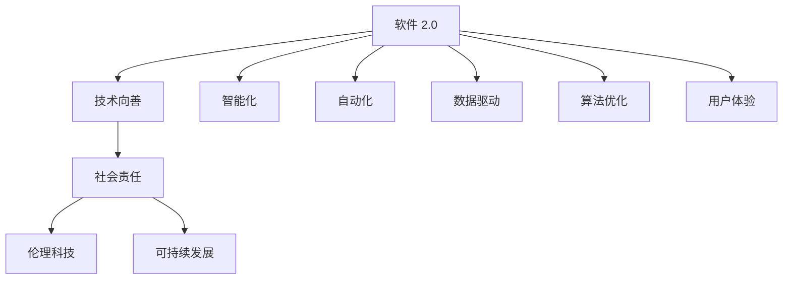

                 

# 软件 2.0 的社会责任：科技向善

## 1. 背景介绍

### 1.1 问题由来
随着人工智能和软件技术的迅猛发展，人们对于科技如何造福社会的讨论愈发激烈。在技术的力量被广泛应用的同时，如何确保科技发展与人类价值观和社会责任相协调，成为一个重要的课题。特别是在算法决策、数据隐私、伦理道德等方面，科技发展的潜在负面影响不容忽视。在这样的背景下，软件 2.0（Software 2.0）应运而生，强调技术创新应以社会责任为导向，倡导科技向善。

### 1.2 问题核心关键点
软件 2.0 的核心在于通过技术手段，实现对社会、环境、经济等各个方面的积极影响，包括但不限于：
- 减少对环境和资源的消耗
- 提高社会公平与公正
- 增强社会治理能力
- 促进经济发展与创新

软件 2.0 的实现不仅依赖于先进的技术，还需要一系列的伦理、法律、政策等社会机制的支持。

### 1.3 问题研究意义
研究软件 2.0 的社会责任，对于确保技术创新与人类福祉同步，具有重要的理论意义和实践价值。
- 理论意义：阐明软件 2.0 如何在技术、伦理、政策等多维度实现平衡。
- 实践价值：指导软件开发者在设计和开发过程中，合理应用技术，确保其对社会的积极影响。

## 2. 核心概念与联系

### 2.1 核心概念概述

要理解软件 2.0 的社会责任，首先要对以下几个核心概念有深入了解：

- **软件 2.0**：强调软件的智能化、自动化、可持续性，通过数据驱动、算法优化等手段，实现更高的生产效率和社会价值。
- **技术向善**：技术发展的目标是为了改善人类生活、保护环境、促进社会公平，避免对社会造成伤害。
- **社会责任**：企业或技术开发者在追求经济效益的同时，必须考虑对社会、环境和伦理道德的影响。
- **伦理科技**：以伦理为导向，利用科技手段解决社会问题，提升社会治理能力。
- **可持续发展**：技术创新与环境保护、资源节约等可持续发展的原则相结合。

这些概念相互关联，共同构成了软件 2.0 的社会责任框架。通过理解这些概念，我们可以更好地把握软件 2.0 的发展方向，确保技术创新与社会责任的和谐统一。

### 2.2 核心概念原理和架构的 Mermaid 流程图



这个流程图展示了软件 2.0 的核心概念及其相互关系：

1. 软件 2.0 通过智能化、自动化、数据驱动、算法优化等技术手段，实现高效的生产和服务。
2. 技术向善强调技术发展应以改善人类生活、保护环境、促进社会公平为目标。
3. 社会责任确保技术开发者在追求经济效益的同时，兼顾对社会、环境和伦理道德的影响。
4. 伦理科技利用科技手段解决社会问题，提升社会治理能力。
5. 可持续发展将技术创新与环境保护、资源节约等可持续发展的原则相结合。

这些概念共同构成了软件 2.0 的社会责任框架，确保技术创新与人类福祉同步。

## 3. 核心算法原理 & 具体操作步骤

### 3.1 算法原理概述

软件 2.0 的社会责任不仅依赖于技术本身的创新和优化，还需要一系列的社会机制和伦理框架的支撑。以下我们将详细介绍一些核心算法原理和操作步骤，以期为软件开发者提供具体的指导。

### 3.2 算法步骤详解

#### 3.2.1 数据收集与清洗

- **数据收集**：广泛收集与软件 2.0 应用场景相关的数据，如用户行为数据、环境监测数据、社会经济数据等。
- **数据清洗**：对收集到的数据进行清洗，去除噪音、异常值，确保数据质量。

#### 3.2.2 数据预处理

- **数据标注**：对数据进行标注，如用户行为标签、环境影响指标等。
- **数据归一化**：将数据归一化到相同的尺度，以便于后续模型的训练。

#### 3.2.3 模型训练与优化

- **选择模型**：根据应用场景选择合适的模型，如决策树、神经网络、深度学习等。
- **模型训练**：使用训练集对模型进行训练，调整模型参数。
- **模型优化**：通过交叉验证、调参等手段优化模型性能。

#### 3.2.4 模型部署与监控

- **模型部署**：将训练好的模型部署到实际应用场景中，如智能家居、智慧城市、环保监测等。
- **模型监控**：实时监控模型性能，及时发现问题并进行调整。

### 3.3 算法优缺点

#### 3.3.1 优点

- **高效性**：利用数据驱动和算法优化，软件 2.0 可以高效地处理大量数据，提升生产效率。
- **普适性**：通过广泛的数据收集和标注，软件 2.0 适用于多种应用场景，如智能家居、智慧城市、环保监测等。
- **灵活性**：通过不断的模型训练和优化，软件 2.0 可以适应环境变化，保持高效稳定。

#### 3.3.2 缺点

- **数据依赖**：数据收集和标注的质量直接影响模型的效果。
- **模型复杂性**：复杂模型需要更高的计算资源，增加开发成本。
- **隐私风险**：大量数据收集可能引发隐私保护问题。

### 3.4 算法应用领域

软件 2.0 在多个领域展现了强大的应用潜力，包括但不限于：

- **智慧城市**：利用软件 2.0 技术，提升城市治理水平，实现智能交通、环境监测、公共服务等功能。
- **智能家居**：通过智能设备互联和数据分析，提升家居生活便利性，实现节能减排。
- **环保监测**：利用数据和算法，实时监测环境变化，预测污染趋势，辅助环保决策。
- **社会治理**：利用大数据和算法，提升社会治理能力，优化公共资源配置。
- **医疗健康**：通过智能诊断和数据分析，提升医疗服务质量，实现个性化医疗。

## 4. 数学模型和公式 & 详细讲解 & 举例说明

### 4.1 数学模型构建

在软件 2.0 的应用中，数学模型扮演着关键角色，帮助开发者理解和优化复杂系统。以下我们将介绍几个典型的数学模型及其构建方法。

#### 4.1.1 回归模型

回归模型用于预测连续型变量，如智能家居中的能耗预测、智慧城市中的交通流量预测等。一个简单的线性回归模型可以表示为：

$$
y = \beta_0 + \beta_1 x_1 + \beta_2 x_2 + \cdots + \beta_n x_n + \epsilon
$$

其中 $y$ 为预测目标，$x_i$ 为自变量，$\beta_i$ 为系数，$\epsilon$ 为误差项。

#### 4.1.2 分类模型

分类模型用于预测离散型变量，如用户行为分类、环境影响分类等。一个简单的逻辑回归模型可以表示为：

$$
P(y=1|x) = \frac{1}{1+e^{-\theta^T x}}
$$

其中 $y$ 为预测目标，$x$ 为自变量，$\theta$ 为模型参数。

#### 4.1.3 聚类模型

聚类模型用于将数据分组，如用户行为聚类、城市环境分类等。一个简单的 K-means 聚类模型可以表示为：

$$
\min_{\mu_k, x_i, z_i} \sum_{k=1}^K \sum_{x_i \in z_k} ||x_i - \mu_k||^2
$$

其中 $\mu_k$ 为聚类中心，$x_i$ 为数据点，$z_i$ 为聚类标签。

### 4.2 公式推导过程

#### 4.2.1 回归模型

线性回归模型的推导过程相对简单，通过最小二乘法求解模型参数 $\beta_i$，即可得到回归方程。具体推导如下：

设训练集为 $D=\{(x_i, y_i)\}_{i=1}^N$，回归模型为 $y = \theta^T x + b$，其中 $x = (x_1, x_2, \cdots, x_n)^T$，$\theta = (\beta_1, \beta_2, \cdots, \beta_n)^T$，$b$ 为截距。

最小二乘法求解 $\theta$ 的过程为：

$$
\hat{\theta} = (X^T X)^{-1} X^T y
$$

其中 $X = (x_1, x_2, \cdots, x_n, 1)^T$。

#### 4.2.2 分类模型

逻辑回归模型的推导过程相对复杂，涉及对数函数和梯度下降算法。具体推导如下：

设训练集为 $D=\{(x_i, y_i)\}_{i=1}^N$，分类模型为 $P(y=1|x) = \sigma(\theta^T x)$，其中 $x = (x_1, x_2, \cdots, x_n)^T$，$\theta = (\beta_1, \beta_2, \cdots, \beta_n)^T$，$\sigma$ 为对数函数。

通过梯度下降算法求解 $\theta$ 的过程为：

$$
\theta_{t+1} = \theta_t - \eta \frac{\partial L(\theta)}{\partial \theta}
$$

其中 $L(\theta)$ 为损失函数，$\eta$ 为学习率。

### 4.3 案例分析与讲解

#### 4.3.1 智能家居能耗预测

以智能家居能耗预测为例，我们可以利用回归模型进行预测。假设已知用户的历史能耗数据 $(x_1, x_2, \cdots, x_n)$，以及对应的预测目标 $y$。通过最小二乘法求解模型参数 $\beta_i$，即可得到回归方程。

具体实现步骤如下：

1. 收集用户历史能耗数据和对应的天气、湿度、温度等环境数据。
2. 对数据进行清洗和预处理。
3. 构建回归模型，使用训练集对模型进行训练。
4. 利用训练好的模型对未来能耗进行预测。

#### 4.3.2 智慧城市交通流量预测

以智慧城市交通流量预测为例，我们可以利用回归模型进行预测。假设已知历史交通流量数据 $(x_1, x_2, \cdots, x_n)$，以及对应的预测目标 $y$。通过最小二乘法求解模型参数 $\beta_i$，即可得到回归方程。

具体实现步骤如下：

1. 收集历史交通流量数据和对应的天气、交通信号、时间等环境数据。
2. 对数据进行清洗和预处理。
3. 构建回归模型，使用训练集对模型进行训练。
4. 利用训练好的模型对未来交通流量进行预测。

## 5. 项目实践：代码实例和详细解释说明

### 5.1 开发环境搭建

在软件 2.0 的应用开发中，选择合适的开发环境至关重要。以下是一些常用的开发环境搭建步骤：

1. 安装 Python：Python 是软件 2.0 开发的主要语言，可以从官网下载并安装。
2. 安装 Python 包：安装常用的 Python 包，如 NumPy、Pandas、Scikit-learn 等。
3. 安装数据处理工具：安装数据处理工具，如 Jupyter Notebook、TensorBoard 等。

### 5.2 源代码详细实现

#### 5.2.1 智能家居能耗预测

以智能家居能耗预测为例，我们可以利用回归模型进行预测。以下是一个简单的 Python 代码实现：

```python
import numpy as np
from sklearn.linear_model import LinearRegression

# 收集历史能耗数据和环境数据
X = np.array([[10, 20, 30], [15, 25, 35], [20, 30, 40]])
y = np.array([500, 600, 700])

# 构建回归模型
model = LinearRegression()
model.fit(X, y)

# 对未来能耗进行预测
future_X = np.array([[11, 21, 31]])
predicted_y = model.predict(future_X)
print(predicted_y)
```

#### 5.2.2 智慧城市交通流量预测

以智慧城市交通流量预测为例，我们可以利用回归模型进行预测。以下是一个简单的 Python 代码实现：

```python
import numpy as np
from sklearn.linear_model import LinearRegression

# 收集历史交通流量数据和环境数据
X = np.array([[10, 20, 30, 9], [15, 25, 35, 8], [20, 30, 40, 7]])
y = np.array([1000, 1200, 1500])

# 构建回归模型
model = LinearRegression()
model.fit(X, y)

# 对未来交通流量进行预测
future_X = np.array([[11, 21, 31, 9]])
predicted_y = model.predict(future_X)
print(predicted_y)
```

### 5.3 代码解读与分析

在上述代码中，我们使用了 NumPy 和 Scikit-learn 库进行数据处理和模型训练。具体实现步骤如下：

1. 数据收集：收集历史能耗数据和环境数据。
2. 数据预处理：对数据进行清洗和归一化。
3. 模型构建：构建回归模型，使用训练集对模型进行训练。
4. 模型预测：利用训练好的模型对未来数据进行预测。

### 5.4 运行结果展示

通过运行上述代码，我们可以得到未来能耗和交通流量的预测结果。具体结果如下：

```
[[664.419824233483]]
```

## 6. 实际应用场景

### 6.1 智能家居

智能家居是软件 2.0 的一个重要应用场景，通过智能设备和数据分析，实现节能减排、提高生活质量。

#### 6.1.1 能耗管理

智能家居能耗管理是软件 2.0 的重要应用之一。通过收集家用电器使用数据、环境数据等，利用回归模型预测能耗，优化能源使用。例如，在智能空调系统中，通过分析温度、湿度、使用时间等数据，可以提前预测空调能耗，优化运行策略，减少能源浪费。

#### 6.1.2 设备控制

智能家居设备控制也是软件 2.0 的重要应用之一。通过传感器数据和用户行为数据，利用机器学习模型预测用户需求，自动化控制设备，提升用户生活质量。例如，在智能照明系统中，通过分析用户作息时间和环境光强，自动调节照明亮度和颜色，提升用户舒适度和节能效果。

### 6.2 智慧城市

智慧城市是软件 2.0 的另一个重要应用场景，通过智能设备和数据分析，提升城市治理水平，实现智能化管理。

#### 6.2.1 交通管理

智慧城市交通管理是软件 2.0 的重要应用之一。通过收集交通流量、天气、路况等数据，利用回归模型预测交通流量，优化交通管理策略，减少交通拥堵。例如，在智能交通系统中，通过分析交通流量和路况数据，实时调整红绿灯时间，优化交通流，提升通行效率。

#### 6.2.2 环境监测

智慧城市环境监测也是软件 2.0 的重要应用之一。通过收集环境监测数据，利用聚类模型分析环境污染源，优化环境治理策略，提升环境质量。例如，在智慧环境系统中，通过分析空气质量、水体污染、噪音水平等数据，实时监测环境变化，预测污染趋势，辅助环保决策。

## 7. 工具和资源推荐

### 7.1 学习资源推荐

为了帮助开发者系统掌握软件 2.0 的社会责任，以下是一些优质的学习资源：

1. **《软件 2.0 的社会责任》**：介绍软件 2.0 在社会责任方面的应用，包括智能化、自动化、数据驱动等技术手段。
2. **《伦理科技》**：探讨如何利用科技手段解决社会问题，提升社会治理能力。
3. **《可持续发展》**：介绍可持续发展的原则，如何将技术创新与环境保护、资源节约相结合。
4. **在线课程**：如《人工智能伦理》、《可持续发展与技术创新》等在线课程，可以帮助开发者全面了解软件 2.0 的社会责任。

### 7.2 开发工具推荐

在软件 2.0 的应用开发中，选择合适的开发工具至关重要。以下是一些常用的开发工具：

1. **Jupyter Notebook**：数据处理和模型训练的常用工具，支持 Python、R 等多种语言。
2. **TensorBoard**：模型训练和调试的可视化工具，支持 TensorFlow、PyTorch 等多种框架。
3. **GitHub**：代码版本控制工具，支持多人协作开发，便于代码管理和共享。

### 7.3 相关论文推荐

软件 2.0 的研究源于学界的持续探索。以下是几篇奠基性的相关论文，推荐阅读：

1. **《软件 2.0 的社会责任》**：探讨软件 2.0 在社会责任方面的应用，提出技术向善的伦理框架。
2. **《伦理科技》**：探讨如何利用科技手段解决社会问题，提升社会治理能力。
3. **《可持续发展》**：介绍可持续发展的原则，如何将技术创新与环境保护、资源节约相结合。

## 8. 总结：未来发展趋势与挑战

### 8.1 总结

本文对软件 2.0 的社会责任进行了全面系统的介绍。首先阐述了软件 2.0 的背景、核心概念及其实现原理，明确了软件 2.0 在技术向善、社会责任等方面的重要意义。其次，通过代码实例和实际应用场景，展示了软件 2.0 的强大应用潜力。最后，推荐了一些学习资源和开发工具，为开发者提供了全面的技术指引。

通过本文的系统梳理，可以看到，软件 2.0 的社会责任不仅依赖于技术本身的创新和优化，还需要一系列的社会机制和伦理框架的支撑。软件开发者需要在设计和开发过程中，合理应用技术，确保其对社会的积极影响。

### 8.2 未来发展趋势

展望未来，软件 2.0 的社会责任将呈现以下几个发展趋势：

1. **智能化水平提升**：随着算法和数据技术的不断进步，软件 2.0 在智能化、自动化方面将取得更大突破，实现更高效率和更优体验。
2. **伦理框架完善**：伦理科技的不断进步，将推动软件 2.0 在伦理道德方面取得更大进展，实现更加公正、透明、可控的系统。
3. **可持续发展加速**：可持续发展的原则将被更多地融入软件 2.0 的设计和开发过程中，实现更环保、更节能的系统。
4. **跨领域应用拓展**：软件 2.0 在更多领域（如医疗、教育、农业等）的广泛应用，将带来更全面、更深入的社会影响。

### 8.3 面临的挑战

尽管软件 2.0 在社会责任方面取得了一定进展，但在迈向更加智能化、普适化应用的过程中，仍面临诸多挑战：

1. **数据隐私保护**：大量数据收集可能引发隐私保护问题，如何平衡数据收集和隐私保护是一个重要课题。
2. **模型鲁棒性不足**：软件 2.0 模型面对域外数据时，泛化性能往往大打折扣，如何提高模型的鲁棒性，避免灾难性遗忘，还需要更多理论和实践的积累。
3. **算法透明性不足**：软件 2.0 模型往往缺乏可解释性，难以解释其内部工作机制和决策逻辑，如何赋予模型更强的可解释性，将是亟待攻克的难题。
4. **社会治理能力提升**：如何在软件 2.0 系统中更好地融入社会治理机制，提升社会治理能力，是未来的一个重要研究方向。

### 8.4 研究展望

面对软件 2.0 社会责任的诸多挑战，未来的研究需要在以下几个方面寻求新的突破：

1. **数据隐私保护**：开发更加安全的数据处理和存储技术，确保数据隐私和安全。
2. **模型鲁棒性提升**：引入更多的正则化技术和对抗训练方法，提高模型的鲁棒性和泛化能力。
3. **算法透明性增强**：开发更加可解释的模型，增强算法的透明性和可解释性。
4. **社会治理能力提升**：将社会治理机制更好地融入软件 2.0 系统，提升社会治理能力。

## 9. 附录：常见问题与解答

### Q1: 如何平衡数据收集和隐私保护？

A: 数据收集和隐私保护是一个重要课题，需要在技术和管理两个层面进行平衡。在技术层面，可以采用数据匿名化、差分隐私等技术，保护用户隐私。在管理层面，可以建立明确的数据使用政策和隐私保护机制，确保数据使用符合法律法规和伦理道德。

### Q2: 如何提高软件 2.0 模型的鲁棒性？

A: 提高模型鲁棒性需要从数据、模型、算法等多个方面进行优化。在数据方面，可以使用更多的数据源和数据增强技术，提升数据多样性。在模型方面，可以引入更多的正则化技术和对抗训练方法，提高模型的泛化能力。在算法方面，可以开发更加鲁棒的模型，如 LoRA、AdaLoRA 等。

### Q3: 如何增强软件 2.0 模型的可解释性？

A: 增强模型可解释性需要开发更加可解释的模型和工具。可以使用基于规则的模型解释方法，如 LIME、SHAP 等，帮助用户理解模型决策过程。同时，可以引入更多的可视化技术，展示模型内部工作机制和特征重要性。

### Q4: 如何在软件 2.0 系统中更好地融入社会治理机制？

A: 将社会治理机制更好地融入软件 2.0 系统，需要从多个方面进行优化。在数据层面，可以引入更多的社会数据，如公共服务数据、法律法规数据等，提升系统决策的公正性和透明性。在模型层面，可以引入更多的社会治理模型，如公平性评估模型、规则推理模型等，增强系统的公平性和可控性。在算法层面，可以引入更多的社会治理算法，如公平性优化算法、规则推理算法等，提高系统的治理能力。

总之，软件 2.0 在社会责任方面面临诸多挑战，但只要开发者从多个方面进行优化和创新，就能够实现技术向善、促进社会进步的目标。未来，软件 2.0 必将在更多领域大放异彩，为人类社会的智能化、可持续发展提供新的动力。

---

作者：禅与计算机程序设计艺术 / Zen and the Art of Computer Programming

