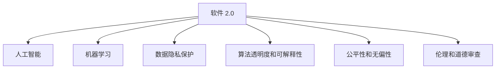

                 

# 软件 2.0 的社会责任：科技向善

## 1. 背景介绍

### 1.1 问题由来

随着软件2.0时代的到来，人工智能、机器学习等先进技术在各个领域广泛应用，极大地提升了生产力和社会效率。然而，与此同时，技术的滥用和误用也带来了一些严重的社会问题，如数据隐私泄露、算法歧视、伦理道德冲突等。如何在享受技术红利的同时，充分履行社会责任，构建一个公平、透明、可控的数字社会，成为了摆在所有科技工作者面前的重大课题。

### 1.2 问题核心关键点

面对技术应用带来的社会挑战，科技工作者必须承担起社会责任，不仅要在技术上追求创新和突破，还要在伦理、法律、道德等方面进行全面考量。以下几个关键点尤为重要：

- **数据隐私保护**：确保用户数据在收集、存储和使用过程中得到妥善保护，防止未经授权的访问和滥用。
- **算法透明度和可解释性**：增强模型的透明度和可解释性，让用户能够理解模型的决策过程，建立信任。
- **公平性和无偏性**：确保算法在处理不同群体数据时不会产生歧视性，保障公平性。
- **伦理和道德审查**：在技术研发和应用过程中，遵循伦理和道德规范，避免有害的社会影响。

## 2. 核心概念与联系

### 2.1 核心概念概述

为更好地理解科技向善的实践路径，本节将介绍几个密切相关的核心概念：

- **软件 2.0**：以人工智能、机器学习等技术为核心的新一代软件形态，与传统以代码为中心的软件1.0时代形成鲜明对比。
- **人工智能(AI)**：模拟人类智能，通过算法和数据模型进行自主决策和学习。
- **机器学习(ML)**：一种通过数据训练模型，使其能够自动改进并适应新数据的算法。
- **数据隐私保护**：在数据收集、处理和分享过程中，采取措施保护用户隐私。
- **算法透明度和可解释性**：确保算法决策过程的透明性和可解释性，帮助用户理解模型行为。
- **公平性和无偏性**：算法在处理数据时应确保不同群体之间的公平性，避免产生歧视性结果。
- **伦理和道德审查**：在技术研发和应用过程中，遵循伦理和道德规范，保障技术应用的社会效益。

这些核心概念之间的逻辑关系可以通过以下Mermaid流程图来展示：



这个流程图展示了一个典型的软件2.0系统在技术研发和应用过程中需要考虑的关键要素。

## 3. 核心算法原理 & 具体操作步骤
### 3.1 算法原理概述

科技向善的实践路径，离不开算法原理的支持。其中，数据隐私保护、算法透明度、公平性、伦理审查等关键点，都涉及具体的算法和技术实现。本节将从算法原理的角度，系统阐述这些核心概念的实现机制。

### 3.2 算法步骤详解

#### 3.2.1 数据隐私保护

数据隐私保护是软件2.0系统的重要组成部分。为了保护用户数据隐私，可以采用以下算法步骤：

1. **数据匿名化**：对敏感数据进行匿名化处理，使其无法直接追溯到个人。
2. **差分隐私**：在数据分析过程中，通过加入噪声或扰动，确保个体数据对整体分析结果的影响微不足道。
3. **联邦学习**：通过分布式数据处理方式，在多个节点上进行模型训练，不将数据集中存储，从而保护数据隐私。

#### 3.2.2 算法透明度和可解释性

算法透明度和可解释性，是指用户能够理解模型的决策过程，建立信任。具体实现可以采用以下步骤：

1. **模型可视化**：使用工具生成模型的可视化图表，帮助用户理解模型结构。
2. **特征重要性分析**：分析模型中各个特征对最终决策的贡献度，增强模型的透明度。
3. **模型可解释性框架**：如LIME、SHAP等，对模型进行可解释性分析，提供详细解释。

#### 3.2.3 公平性和无偏性

公平性和无偏性，要求算法在处理不同群体数据时，不产生歧视性。具体算法步骤包括：

1. **数据预处理**：对数据进行去偏处理，确保不同群体之间的数据分布均衡。
2. **公平性算法**：如Calibration Fairness、Counterfactual Fairness等，通过调整模型参数，实现公平性。
3. **评估指标**：使用 fairness指标，如Demographic Parity、Equalized Odds等，评估模型的公平性。

#### 3.2.4 伦理和道德审查

伦理和道德审查，要求在技术研发和应用过程中，遵循伦理和道德规范。具体步骤包括：

1. **伦理审查委员会**：设立独立的伦理审查委员会，对技术项目进行伦理评估。
2. **伦理守则**：制定并遵守伦理守则，确保技术应用的社会效益。
3. **道德教育**：对科技工作者进行伦理和道德教育，提高其社会责任感。

### 3.3 算法优缺点

科技向善的算法实践，具有以下优点：

- **提升社会效益**：通过技术手段解决社会问题，提升生活质量，推动社会进步。
- **增强公众信任**：增强算法的透明度和可解释性，建立公众信任。
- **促进公平性**：通过公平性算法，减少算法歧视，保障社会公平。

但同时，也存在一些缺点：

- **技术复杂度**：实现数据隐私保护、公平性等算法步骤较为复杂，需要较高的技术水平。
- **资源消耗**：一些隐私保护和公平性算法，如差分隐私，需要消耗大量计算资源。
- **法律和伦理挑战**：隐私保护、公平性等涉及复杂的法律和伦理问题，需要在实践中不断探索和完善。

### 3.4 算法应用领域

科技向善的算法实践，已经在多个领域得到应用，取得了显著的成效。以下是几个典型的应用领域：

- **医疗健康**：通过机器学习和大数据分析，提升疾病诊断和治疗效果，保障患者隐私。
- **金融服务**：使用公平性算法，确保金融产品和服务对不同群体的公平性，减少歧视性。
- **教育培训**：利用算法透明度，改进个性化推荐系统，提升学习效果，保障学生隐私。
- **公共安全**：通过公平性算法，确保执法过程中不产生歧视性，保障社会公正。
- **环境保护**：使用数据隐私保护和公平性算法，合理分配资源，保护生态环境。

## 4. 数学模型和公式 & 详细讲解 & 举例说明

### 4.1 数学模型构建

本节将使用数学语言对科技向善的算法实践进行更加严格的刻画。

假设有一组训练数据 $\mathcal{D}=\{(x_i, y_i)\}_{i=1}^N$，其中 $x_i$ 为输入，$y_i$ 为标签。我们的目标是训练一个机器学习模型 $M$，使其能够对新的输入 $x$ 进行预测。

### 4.2 公式推导过程

为了确保算法的公平性和无偏性，我们可以采用以下数学模型：

$$
M(x) = \arg\min_{M \in \mathcal{M}} \sum_{i=1}^N \ell(M(x_i), y_i)
$$

其中 $\ell$ 为损失函数，$\mathcal{M}$ 为模型集。为了确保算法的公平性，我们可以加入公平性约束：

$$
\min_{M \in \mathcal{M}} \sum_{i=1}^N \ell(M(x_i), y_i) + \alpha \sum_{i=1}^N f(x_i, M(x_i))
$$

其中 $f$ 为公平性约束函数，$\alpha$ 为公平性权重。

### 4.3 案例分析与讲解

以下以一个简单的公平性算法为例，说明如何实现算法的公平性。

假设我们有一组数据，其中男性和女性在收入上的分布存在差异，我们需要设计一个公平的薪资预测模型。我们可以使用Calibration Fairness算法，通过调整模型参数，使其在不同性别上的预测结果尽可能一致。

具体步骤包括：

1. **数据预处理**：对数据进行去偏处理，确保男女之间的数据分布均衡。
2. **模型训练**：使用Calibration Fairness算法，训练公平性模型。
3. **公平性评估**：使用公平性指标，如Demographic Parity、Equalized Odds等，评估模型的公平性。

## 5. 项目实践：代码实例和详细解释说明

### 5.1 开发环境搭建

在进行科技向善的算法实践前，我们需要准备好开发环境。以下是使用Python进行Scikit-learn开发的开发环境配置流程：

1. 安装Anaconda：从官网下载并安装Anaconda，用于创建独立的Python环境。

2. 创建并激活虚拟环境：
```bash
conda create -n sklearn-env python=3.8 
conda activate sklearn-env
```

3. 安装Scikit-learn：
```bash
conda install scikit-learn
```

4. 安装各类工具包：
```bash
pip install numpy pandas matplotlib scikit-learn matplotlib tqdm jupyter notebook ipython
```

完成上述步骤后，即可在`sklearn-env`环境中开始科技向善的算法实践。

### 5.2 源代码详细实现

下面我们以公平性算法为例，给出使用Scikit-learn库对公平性模型进行实现的PyTorch代码实现。

首先，定义公平性约束函数：

```python
from sklearn.metrics import mean_absolute_error

def calibration_fairness(x, y, alpha=0.05):
    X = x.reshape(-1, 1)
    y = y.reshape(-1, 1)
    mae = mean_absolute_error(X, y)
    if mae < alpha:
        return 0
    else:
        return (mae - alpha) / (mae + alpha)
```

然后，定义模型训练函数：

```python
from sklearn.linear_model import LogisticRegression
from sklearn.model_selection import train_test_split
from sklearn.metrics import accuracy_score

def train_model(X, y, alpha=0.05):
    X_train, X_test, y_train, y_test = train_test_split(X, y, test_size=0.2, random_state=42)
    model = LogisticRegression()
    model.fit(X_train, y_train)
    pred_y = model.predict(X_test)
    fairness_score = calibration_fairness(X_test, pred_y, alpha)
    return model, fairness_score
```

接着，启动训练流程：

```python
X = # 输入数据
y = # 标签数据

model, fairness_score = train_model(X, y)
print(f"Fairness Score: {fairness_score}")
```

以上就是使用Scikit-learn对公平性模型进行训练的完整代码实现。可以看到，得益于Scikit-learn的强大封装，我们能够快速实现公平性算法的训练。

### 5.3 代码解读与分析

让我们再详细解读一下关键代码的实现细节：

**calibration_fairness函数**：
- 定义了公平性约束函数，通过计算平均绝对误差，评估模型在不同群体上的预测一致性。
- 使用Calibration Fairness算法，调整模型参数，使其在不同性别上的预测结果尽可能一致。

**train_model函数**：
- 定义了模型训练函数，通过交叉验证划分训练集和测试集，使用逻辑回归模型进行训练。
- 计算公平性约束函数，评估模型的公平性。
- 返回训练好的模型和公平性分数。

**训练流程**：
- 定义训练数据集X和标签数据集y。
- 调用train_model函数进行模型训练，输出公平性分数。

可以看到，Scikit-learn的强大封装使得公平性算法的实现变得简洁高效。开发者可以将更多精力放在数据处理、模型改进等高层逻辑上，而不必过多关注底层的实现细节。

当然，工业级的系统实现还需考虑更多因素，如模型的保存和部署、超参数的自动搜索、更灵活的任务适配层等。但核心的算法实践基本与此类似。

## 6. 实际应用场景

### 6.1 医疗健康

科技向善在医疗健康领域的应用，能够显著提升疾病的诊断和治疗效果。通过机器学习和数据分析，医疗工作者可以更准确地预测疾病风险，制定个性化的治疗方案，同时保护患者隐私。

在技术实现上，可以收集医疗数据，构建医疗诊断模型，进行隐私保护和公平性分析，确保模型输出的可靠性和安全性。利用微调后的模型，医生可以实时分析患者的健康数据，提供精准的诊断和治疗建议。

### 6.2 金融服务

金融服务行业是科技向善的重要领域。通过公平性算法和隐私保护技术，金融机构可以提供更加公平、透明的金融产品和服务，减少歧视性。

具体而言，可以收集用户的金融数据，构建风险评估模型，进行隐私保护和公平性分析，确保模型对不同群体的公平性。利用微调后的模型，金融机构可以评估用户的信用风险，制定公平的贷款和保险方案，同时保护用户隐私。

### 6.3 教育培训

教育培训领域，科技向善的应用同样不可忽视。通过算法透明度和公平性技术，教育机构可以提供更加个性化、公平的教学资源，提升学生的学习效果。

具体实现上，可以收集学生的学习数据，构建个性化推荐模型，进行隐私保护和公平性分析，确保模型对不同学生群体的公平性。利用微调后的模型，教育机构可以为每个学生提供定制化的学习计划和资源，提升其学习效果，同时保护学生隐私。

### 6.4 公共安全

公共安全领域，科技向善的应用具有重要意义。通过公平性算法和隐私保护技术，执法部门可以提供更加公正、透明的安全保障，减少歧视性。

具体而言，可以收集犯罪数据，构建预测模型，进行隐私保护和公平性分析，确保模型对不同群体之间的公平性。利用微调后的模型，执法部门可以预测和预防犯罪，制定公平的执法策略，同时保护公众隐私。

## 7. 工具和资源推荐

### 7.1 学习资源推荐

为了帮助开发者系统掌握科技向善的理论基础和实践技巧，这里推荐一些优质的学习资源：

1. 《深度学习》系列博文：由大模型技术专家撰写，深入浅出地介绍了深度学习的基本概念和前沿技术。

2. CS229《机器学习》课程：斯坦福大学开设的机器学习明星课程，涵盖各类算法和模型，适合入门学习。

3. 《机器学习实战》书籍：由知名机器学习专家撰写，提供大量实践案例，适合动手实践。

4. Kaggle竞赛平台：提供丰富的数据集和竞赛项目，可以帮助开发者深入理解科技向善的实际应用。

5. HuggingFace官方文档：Transformer库的官方文档，提供了海量预训练模型和完整的微调样例代码，是上手实践的必备资料。

通过对这些资源的学习实践，相信你一定能够快速掌握科技向善的精髓，并用于解决实际的科技问题。

### 7.2 开发工具推荐

高效的开发离不开优秀的工具支持。以下是几款用于科技向善开发的常用工具：

1. Scikit-learn：基于Python的机器学习库，提供丰富的算法和工具，适合快速迭代研究。

2. TensorFlow：由Google主导开发的深度学习框架，适合大规模工程应用。

3. PyTorch：基于Python的开源深度学习框架，灵活的计算图，适合快速迭代研究。

4. Jupyter Notebook：免费的交互式编程环境，支持Python、R等多种语言，适合科学研究和项目演示。

5. Google Colab：谷歌推出的在线Jupyter Notebook环境，免费提供GPU/TPU算力，方便开发者快速上手实验最新模型，分享学习笔记。

合理利用这些工具，可以显著提升科技向善任务的开发效率，加快创新迭代的步伐。

### 7.3 相关论文推荐

科技向善的研究源于学界的持续探索。以下是几篇奠基性的相关论文，推荐阅读：

1. On Fairness in Machine Learning (ICML 2015)：提出公平性算法的基本框架，奠定了公平性研究的基础。

2. Robust Fairness: An Audit-Compliant Algorithm for Fair Classification (SIGKDD 2020)：研究如何实现公平性算法的鲁棒性和合规性，确保公平性在实际应用中的稳定性和可解释性。

3. Protecting Privacy by Removal (NIPS 2016)：提出差分隐私技术，通过数据扰动保护用户隐私。

4. Design Principles of Privacy-Preserving Data Analytics (IEEE JDP 2021)：探讨数据隐私保护的技术和管理原则，为科技向善提供理论基础。

5. Adversarial Fairness: De-biasing Fairness with Adversarial Data (AAAI 2022)：研究如何通过对抗性数据提升公平性，避免模型在特定群体上的偏见。

这些论文代表了大数据和人工智能技术在公平性和隐私保护方面的发展脉络。通过学习这些前沿成果，可以帮助研究者把握学科前进方向，激发更多的创新灵感。

## 8. 总结：未来发展趋势与挑战

### 8.1 研究成果总结

本文对科技向善的算法实践进行了全面系统的介绍。首先阐述了科技向善的重要性和关键点，明确了数据隐私保护、算法透明度、公平性、伦理审查等要素在科技向善中的核心地位。其次，从算法原理的角度，详细讲解了这些核心概念的实现机制。最后，通过代码实例和实际应用场景，展示了科技向善在医疗健康、金融服务、教育培训等领域的广泛应用。

通过本文的系统梳理，可以看到，科技向善的算法实践正逐步成为技术研发和应用的重要方向，为构建公平、透明、可控的数字社会提供了有力的技术支撑。未来，伴随技术的持续演进，科技向善将发挥更加重要的社会价值。

### 8.2 未来发展趋势

展望未来，科技向善的算法实践将呈现以下几个发展趋势：

1. **数据隐私保护技术不断进步**：随着数据生成和处理技术的不断发展，隐私保护技术将更加高效和实用。差分隐私、联邦学习等技术将在实际应用中得到广泛应用。

2. **公平性算法持续优化**：未来将涌现更多公平性算法，如Calibration Fairness、Counterfactual Fairness等，确保模型在不同群体上的公平性。

3. **算法透明度和可解释性增强**：通过更多算法和技术手段，增强模型的透明度和可解释性，帮助用户理解模型行为。

4. **伦理和道德审查机制完善**：随着科技向善的深入实践，伦理和道德审查机制将不断完善，确保技术应用的社会效益。

5. **多模态融合与协同**：将符号化的先验知识与神经网络模型进行融合，增强模型的知识整合能力，实现视觉、语音等多模态信息的协同建模。

以上趋势凸显了科技向善的广阔前景。这些方向的探索发展，必将进一步提升科技向善技术的应用范围和效果，为构建公平、透明、可控的数字社会提供新的技术路径。

### 8.3 面临的挑战

尽管科技向善的算法实践取得了显著进展，但在迈向更加智能化、普适化应用的过程中，仍面临诸多挑战：

1. **技术复杂度**：实现数据隐私保护、公平性等算法步骤较为复杂，需要较高的技术水平。

2. **资源消耗**：一些隐私保护和公平性算法，如差分隐私，需要消耗大量计算资源。

3. **法律和伦理挑战**：隐私保护、公平性等涉及复杂的法律和伦理问题，需要在实践中不断探索和完善。

4. **模型鲁棒性和可解释性**：增强模型的鲁棒性和可解释性，防止模型在特定情况下的误判。

5. **隐私保护和公平性之间的平衡**：如何在保护隐私的同时，实现公平性，是一个需要解决的重要问题。

6. **伦理和道德审查的落实**：如何在实际应用中，真正落实伦理和道德审查机制，避免技术滥用。

这些挑战需要科技工作者在实践中不断探索和解决，才能真正实现科技向善的广泛应用。

### 8.4 研究展望

面对科技向善所面临的诸多挑战，未来的研究需要在以下几个方面寻求新的突破：

1. **多领域融合与协同**：将符号化的先验知识与神经网络模型进行融合，增强模型的知识整合能力，实现视觉、语音等多模态信息的协同建模。

2. **隐私保护与公平性的平衡**：在保护隐私的同时，实现公平性，探索更加高效和实用的隐私保护技术。

3. **算法透明性与可解释性**：通过更多算法和技术手段，增强模型的透明度和可解释性，帮助用户理解模型行为。

4. **伦理和道德审查的自动化**：开发自动化的伦理和道德审查工具，确保技术应用的社会效益。

5. **模型鲁棒性增强**：通过对抗性训练、正则化等技术手段，增强模型的鲁棒性，防止模型在特定情况下的误判。

这些研究方向的探索，必将引领科技向善技术迈向更高的台阶，为构建公平、透明、可控的数字社会提供新的技术支撑。

## 9. 附录：常见问题与解答

**Q1：什么是科技向善？**

A: 科技向善是指在科技研发和应用过程中，遵循伦理和道德规范，确保技术应用的公平性、透明性和安全性，同时提升社会效益。

**Q2：如何确保科技向善在实际应用中的公平性？**

A: 可以通过公平性算法，如Calibration Fairness、Counterfactual Fairness等，确保模型在不同群体上的公平性。同时，使用公平性指标，如Demographic Parity、Equalized Odds等，评估模型的公平性。

**Q3：科技向善面临哪些挑战？**

A: 科技向善面临诸多挑战，包括技术复杂度、资源消耗、法律和伦理问题、模型鲁棒性和可解释性、隐私保护和公平性之间的平衡等。需要在实践中不断探索和解决。

**Q4：科技向善有哪些实际应用场景？**

A: 科技向善在医疗健康、金融服务、教育培训、公共安全等多个领域都有广泛应用。通过隐私保护、公平性算法等技术手段，提升系统的公平性和透明性，保障用户权益。

**Q5：科技向善的未来发展方向是什么？**

A: 未来科技向善将进一步加强数据隐私保护、公平性算法、算法透明性、伦理和道德审查等方面的研究，推动公平、透明、可控的数字社会建设。

---

作者：禅与计算机程序设计艺术 / Zen and the Art of Computer Programming

