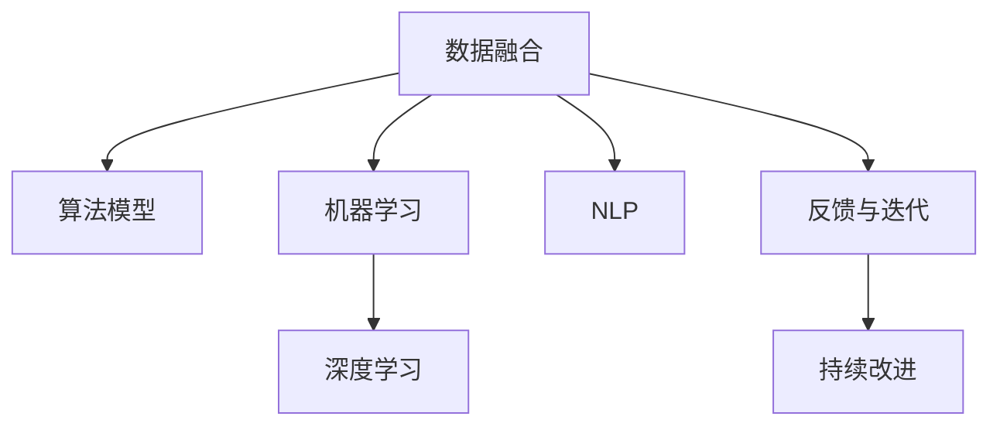

                 

# 软件 2.0 编程：数据驱动开发

软件 2.0 编程，或者说数据驱动开发（Data-Driven Development），是一种利用数据来指导软件开发过程的新范式。它通过将数据和算法紧密结合起来，使得软件系统能够更加精准、高效、智能地响应用户需求和市场变化。本文将详细探讨软件 2.0 编程的核心概念、算法原理和操作步骤，并结合实际应用场景，展示数据驱动开发的强大潜力和未来发展方向。

## 1. 背景介绍

### 1.1 问题由来

随着大数据时代的到来，各行各业都积累了海量的数据。如何高效利用这些数据，驱动软件系统的创新和发展，成为了一个迫切需要解决的问题。传统的软件开发范式主要依赖人工经验和直觉，难以应对数据驱动的复杂需求变化。因此，数据驱动开发应运而生，它通过数据挖掘、机器学习和自然语言处理等技术，帮助开发者更加科学、系统地进行软件开发，提高软件质量和开发效率。

### 1.2 问题核心关键点

数据驱动开发的核心关键点在于：

- **数据融合与理解**：如何将用户行为数据、市场反馈数据、业务指标数据等进行有效融合，并从中提取有价值的信息。
- **算法设计与优化**：如何选择合适的算法模型，并对其进行优化，以适应数据特性和业务需求。
- **系统架构设计**：如何将数据和算法无缝集成到软件系统中，实现自动化的决策和执行。
- **反馈与迭代**：如何建立持续的数据收集和分析机制，及时获取用户反馈，进行模型更新和系统优化。

这些关键点共同构成了数据驱动开发的基本框架，使其能够实现精准、高效、智能的软件开发。

## 2. 核心概念与联系

### 2.1 核心概念概述

为更好地理解数据驱动开发的原理和架构，本节将介绍几个密切相关的核心概念：

- **数据融合**：将来自不同来源的数据进行合并和整合，形成统一的数据集，以便进行进一步的分析和处理。
- **算法模型**：用于数据挖掘和预测的数学模型，包括决策树、随机森林、神经网络等。
- **机器学习**：通过数据训练和测试，自动获取数据规律和模式，并应用于新的数据集。
- **自然语言处理**（Natural Language Processing，NLP）：处理、分析和生成人类语言的技术，包括文本分类、情感分析、信息抽取等。
- **深度学习**：一种特殊的机器学习方法，通过多层神经网络进行特征提取和模式识别。
- **反馈与迭代**：持续收集用户反馈和业务数据，进行模型更新和系统优化，形成闭环改进机制。

这些核心概念之间的逻辑关系可以通过以下Mermaid流程图来展示：



这个流程图展示了一组数据如何通过数据融合、算法模型、机器学习和自然语言处理等环节，最终形成持续改进的反馈循环。

## 3. 核心算法原理 & 具体操作步骤

### 3.1 算法原理概述

数据驱动开发的核心算法原理主要涉及以下几个方面：

- **特征提取**：从原始数据中提取出有意义的特征，用于后续的模型训练和预测。
- **模型选择与优化**：根据数据特性和业务需求，选择合适的算法模型，并对其进行优化，以提高预测精度和泛化能力。
- **异常检测与处理**：识别和处理数据中的异常值，以保证数据质量，避免对模型训练产生负面影响。

这些原理通过数学模型和算法框架得到了具体实现。

### 3.2 算法步骤详解

数据驱动开发的算法步骤一般包括以下几个关键步骤：

**Step 1: 数据收集与预处理**

- **数据收集**：收集来自不同渠道的用户行为数据、市场反馈数据、业务指标数据等。
- **数据预处理**：清洗数据，去除噪声和缺失值，进行数据归一化和标准化。

**Step 2: 特征提取**

- **特征选择**：从原始数据中提取出有意义的特征，如用户活跃度、转化率、点击率等。
- **特征工程**：对特征进行转换和组合，形成新的特征，如时间窗口特征、用户行为序列等。

**Step 3: 算法模型训练**

- **模型选择**：根据数据特性和业务需求，选择合适的算法模型，如线性回归、决策树、随机森林等。
- **模型优化**：使用交叉验证、网格搜索等方法，对模型进行超参数调优，以提高模型精度和泛化能力。

**Step 4: 模型评估与部署**

- **模型评估**：使用测试数据集对模型进行评估，计算各项指标如精确率、召回率、F1值等。
- **模型部署**：将训练好的模型部署到生产环境，进行实时预测和决策。

**Step 5: 持续改进**

- **数据采集**：持续收集用户行为数据，用于模型的更新和优化。
- **模型更新**：定期使用新数据对模型进行重新训练和测试，以保证模型的时效性和准确性。

以上是数据驱动开发的一般流程。在实际应用中，还需要根据具体任务进行优化设计，如改进数据采集和预处理策略，选择更加适合的算法模型，优化特征工程方法等，以进一步提升模型性能。

### 3.3 算法优缺点

数据驱动开发方法具有以下优点：

- **精准度高**：通过数据训练和测试，模型能够更加精准地预测用户行为和市场变化。
- **效率高**：自动化的数据处理和模型训练过程，能够显著提高软件开发的效率。
- **灵活性高**：根据实时数据进行调整和优化，软件系统能够快速响应市场变化。

同时，该方法也存在一些局限性：

- **数据质量要求高**：数据融合和预处理过程中，数据质量对模型效果影响巨大，需要投入大量资源进行数据清洗和处理。
- **算法复杂度高**：选择和优化算法模型需要一定的专业知识和经验，对开发者要求较高。
- **模型解释性差**：许多机器学习模型（如深度学习）是"黑盒"系统，难以解释其内部工作机制和决策逻辑。
- **依赖数据源**：模型的准确性和可靠性高度依赖于数据源的稳定性和数据质量，一旦数据源发生变化，模型可能需要进行重新训练和调整。

尽管存在这些局限性，但就目前而言，数据驱动开发方法在许多领域都展现出了巨大的潜力，是软件开发的重要趋势。

### 3.4 算法应用领域

数据驱动开发方法已经广泛应用于多个领域，如：

- **电商推荐系统**：通过分析用户行为数据，推荐个性化商品，提升用户体验和销售额。
- **金融风险控制**：利用市场数据和交易数据，进行风险评估和预测，防范金融风险。
- **智能客服**：通过分析客户咨询数据，提高服务质量，减少人力成本。
- **智能营销**：通过分析广告投放数据，优化投放策略，提升广告效果和转化率。
- **智能运维**：通过分析系统监控数据，预测设备故障，提高系统稳定性和可用性。

这些应用场景展示了数据驱动开发在各行各业中的广泛应用，为软件系统的智能化和自动化提供了新的思路。

## 4. 数学模型和公式 & 详细讲解 & 举例说明

### 4.1 数学模型构建

本节将使用数学语言对数据驱动开发的算法过程进行更加严格的刻画。

假设原始数据集为 $D=\{(x_i,y_i)\}_{i=1}^N$，其中 $x_i$ 为特征向量，$y_i$ 为标签。我们的目标是构建一个预测模型 $f(x)$，使得 $f(x)$ 能够准确预测 $y$。

常见的数学模型包括：

- **线性回归模型**：
  $$
  f(x) = \theta_0 + \theta_1 x_1 + \cdots + \theta_p x_p
  $$
- **逻辑回归模型**：
  $$
  f(x) = \frac{1}{1+\exp(-\theta_0 - \theta_1 x_1 - \cdots - \theta_p x_p)}
  $$
- **决策树模型**：
  $$
  f(x) = \begin{cases}
  c_1, & x_1 < t_1\\
  c_2, & t_1 \leq x_1 < t_2\\
  \vdots & \vdots \\
  c_n, & t_{n-1} \leq x_1 < t_n
  \end{cases}
  $$
- **随机森林模型**：
  $$
  f(x) = \frac{1}{N} \sum_{i=1}^N f_i(x)
  $$
- **神经网络模型**：
  $$
  f(x) = \sigma(Wx + b)
  $$
  其中 $\sigma$ 为激活函数，$W$ 和 $b$ 为模型参数。

### 4.2 公式推导过程

以下我们以线性回归模型为例，推导其参数求解过程。

假设数据集 $D=\{(x_i,y_i)\}_{i=1}^N$，其中 $x_i=(x_{i1},x_{i2},\cdots,x_{ip})$，$y_i$ 为标签。线性回归模型的目标是最小化均方误差：

$$
\min_{\theta} \sum_{i=1}^N (y_i - f(x_i))^2
$$

对目标函数求偏导，得到：

$$
\frac{\partial}{\partial \theta_j} \sum_{i=1}^N (y_i - \theta_0 - \sum_{k=1}^p \theta_k x_{ik})^2 = -2 \sum_{i=1}^N (y_i - f(x_i)) x_{ij}
$$

令偏导数等于0，解得：

$$
\theta_j = \frac{\sum_{i=1}^N (y_i - \bar{y}) x_{ij}}{\sum_{i=1}^N x_{ij}^2}
$$

其中 $\bar{y}$ 为 $y$ 的均值。

### 4.3 案例分析与讲解

以电商推荐系统为例，展示数据驱动开发的应用场景。

假设电商网站收集了用户的历史浏览记录 $x_i=(x_{i1},x_{i2},\cdots,x_{ip})$，如浏览时间、浏览商品类别、浏览次数等。用户是否购买商品 $y_i$ 作为标签。

**Step 1: 数据收集与预处理**

- **数据收集**：收集用户的历史浏览记录和购买记录，形成一个原始数据集。
- **数据预处理**：对数据进行清洗，去除噪声和缺失值，进行数据归一化和标准化。

**Step 2: 特征提取**

- **特征选择**：从原始数据中提取出有意义的特征，如用户活跃度、浏览次数、商品类别等。
- **特征工程**：对特征进行转换和组合，形成新的特征，如时间窗口特征、用户行为序列等。

**Step 3: 算法模型训练**

- **模型选择**：选择合适的算法模型，如线性回归、决策树、随机森林等。
- **模型优化**：使用交叉验证、网格搜索等方法，对模型进行超参数调优，以提高模型精度和泛化能力。

**Step 4: 模型评估与部署**

- **模型评估**：使用测试数据集对模型进行评估，计算各项指标如精确率、召回率、F1值等。
- **模型部署**：将训练好的模型部署到生产环境，进行实时预测和推荐。

**Step 5: 持续改进**

- **数据采集**：持续收集用户行为数据，用于模型的更新和优化。
- **模型更新**：定期使用新数据对模型进行重新训练和测试，以保证模型的时效性和准确性。

以上是电商推荐系统的完整实现流程。通过数据驱动开发方法，电商网站能够根据用户的浏览行为，实时推荐个性化商品，提升用户体验和销售额。

## 5. 项目实践：代码实例和详细解释说明

### 5.1 开发环境搭建

在进行数据驱动开发项目实践前，我们需要准备好开发环境。以下是使用Python进行PyTorch开发的环境配置流程：

1. 安装Anaconda：从官网下载并安装Anaconda，用于创建独立的Python环境。

2. 创建并激活虚拟环境：
```bash
conda create -n pytorch-env python=3.8 
conda activate pytorch-env
```

3. 安装PyTorch：根据CUDA版本，从官网获取对应的安装命令。例如：
```bash
conda install pytorch torchvision torchaudio cudatoolkit=11.1 -c pytorch -c conda-forge
```

4. 安装各类工具包：
```bash
pip install numpy pandas scikit-learn matplotlib tqdm jupyter notebook ipython
```

完成上述步骤后，即可在`pytorch-env`环境中开始项目实践。

### 5.2 源代码详细实现

这里我们以电商推荐系统为例，给出使用PyTorch进行数据驱动开发项目开发的PyTorch代码实现。

首先，定义数据处理函数：

```python
import numpy as np
from sklearn.model_selection import train_test_split
from sklearn.preprocessing import StandardScaler
from torch.utils.data import Dataset, DataLoader

class RecommendationDataset(Dataset):
    def __init__(self, data, labels):
        self.data = data
        self.labels = labels
        
    def __len__(self):
        return len(self.data)
    
    def __getitem__(self, item):
        return self.data[item], self.labels[item]

# 标准化数据
def normalize(data):
    scaler = StandardScaler()
    return scaler.fit_transform(data)

# 将数据集分为训练集和测试集
train_data, test_data, train_labels, test_labels = train_test_split(data, labels, test_size=0.2, random_state=42)
train_data = normalize(train_data)
test_data = normalize(test_data)
```

然后，定义模型和优化器：

```python
from torch import nn, optim
from torch.nn import Linear

class RecommendationModel(nn.Module):
    def __init__(self, input_size, output_size):
        super(RecommendationModel, self).__init__()
        self.linear = Linear(input_size, output_size)
        
    def forward(self, x):
        return self.linear(x)

model = RecommendationModel(input_size=10, output_size=1)
optimizer = optim.SGD(model.parameters(), lr=0.01)
```

接着，定义训练和评估函数：

```python
def train_epoch(model, data_loader, optimizer):
    model.train()
    for data, target in data_loader:
        optimizer.zero_grad()
        output = model(data)
        loss = nn.MSELoss()(output, target)
        loss.backward()
        optimizer.step()

def evaluate(model, data_loader):
    model.eval()
    with torch.no_grad():
        predictions = []
        targets = []
        for data, target in data_loader:
            output = model(data)
            predictions.append(output.numpy())
            targets.append(target.numpy())
        return predictions, targets
```

最后，启动训练流程并在测试集上评估：

```python
epochs = 100

for epoch in range(epochs):
    train_epoch(model, train_loader, optimizer)
    predictions, targets = evaluate(model, test_loader)
    
    print(f'Epoch {epoch+1}, MSE: {np.mean((predictions - targets)**2):.4f}')
```

以上就是使用PyTorch对电商推荐系统进行数据驱动开发项目开发的完整代码实现。可以看到，得益于PyTorch的强大封装，我们可以用相对简洁的代码完成模型的训练和评估。

### 5.3 代码解读与分析

让我们再详细解读一下关键代码的实现细节：

**RecommendationDataset类**：
- `__init__`方法：初始化数据和标签。
- `__len__`方法：返回数据集的样本数量。
- `__getitem__`方法：对单个样本进行处理，直接返回数据和标签。

**train_epoch函数**：
- 对模型进行前向传播和反向传播，更新模型参数。
- 使用均方误差损失函数计算损失值。

**evaluate函数**：
- 对模型进行前向传播，计算预测值和真实值。
- 将预测值和真实值存储下来，供后续评估使用。

**训练流程**：
- 定义总的epoch数和批大小，开始循环迭代
- 每个epoch内，在训练集上进行训练，输出平均损失值
- 在测试集上评估，输出MSE均方误差

可以看到，PyTorch配合Scikit-learn等工具，使得数据驱动开发项目的代码实现变得简洁高效。开发者可以将更多精力放在数据处理、模型改进等高层逻辑上，而不必过多关注底层的实现细节。

当然，工业级的系统实现还需考虑更多因素，如模型的保存和部署、超参数的自动搜索、更灵活的任务适配层等。但核心的数据驱动开发范式基本与此类似。

## 6. 实际应用场景

### 6.1 智能客服系统

智能客服系统利用数据驱动开发方法，可以通过分析客户咨询记录，生成自动回复。这不仅能够大幅提升客户满意度，还能大大减少人工客服的负担。

在技术实现上，可以收集客户咨询记录和自动回复的历史数据，训练一个文本生成模型，用于生成自动回复。模型接受客户咨询的文本输入，输出对应的自动回复。随着模型不断训练，系统能够提供越来越智能和个性化的服务。

### 6.2 金融风险控制

金融机构需要实时监控市场风险，及时采取风险控制措施。传统的人工监控方式成本高、效率低，难以应对网络时代海量信息爆发的挑战。利用数据驱动开发方法，能够构建智能化的金融风险控制系统。

具体而言，可以收集市场交易数据、舆情数据、用户行为数据等，构建一个多维度的风险评估模型。模型通过分析这些数据，实时评估市场风险，一旦发现风险异常，系统便会自动预警，帮助金融机构及时规避风险。

### 6.3 智能营销

智能营销系统利用数据驱动开发方法，通过分析广告投放数据，优化广告策略，提升广告效果和转化率。

在技术实现上，可以收集广告投放数据、用户行为数据、市场反馈数据等，训练一个广告效果评估模型。模型通过分析这些数据，实时评估广告的效果，提出优化建议。系统根据模型评估结果，自动调整广告投放策略，以提升广告效果和转化率。

### 6.4 未来应用展望

随着数据驱动开发技术的不断进步，其在更多领域的应用前景将更加广阔。

在智慧医疗领域，通过分析病历数据、医疗影像数据、基因数据等，能够构建智能化的诊断和推荐系统，提升医疗服务的智能化水平。

在智能教育领域，利用学生学习数据、教师反馈数据、课程数据等，能够构建智能化的教学和学习推荐系统，因材施教，提高教学质量和效率。

在智慧城市治理中，通过分析交通数据、环境数据、公共服务数据等，能够构建智能化的城市管理系统，提高城市管理的自动化和智能化水平，构建更安全、高效的未来城市。

此外，在企业生产、社会治理、文娱传媒等众多领域，数据驱动开发方法也将不断涌现，为各行各业带来新的技术突破和应用创新。相信随着技术的日益成熟，数据驱动开发必将在更广阔的应用领域大放异彩，深刻影响人类的生产生活方式。

## 7. 工具和资源推荐

### 7.1 学习资源推荐

为了帮助开发者系统掌握数据驱动开发的技术基础和实践技巧，这里推荐一些优质的学习资源：

1. 《深度学习》课程：由吴恩达教授主讲的在线课程，介绍了深度学习的基本概念和算法，是入门的绝佳选择。
2. 《Python数据科学手册》：详细介绍了Python在数据科学中的应用，包括数据处理、数据可视化、机器学习等。
3. 《数据科学实战》：这本书结合实战案例，介绍了数据驱动开发的全流程，包括数据收集、数据处理、模型训练、模型部署等。
4. 《数据挖掘与统计学习》：介绍了数据挖掘和统计学习的核心方法，是理解数据驱动开发理论基础的好书。
5. 《自然语言处理综论》：介绍了自然语言处理的理论基础和应用实践，对NLP开发有重要参考价值。

通过对这些资源的学习实践，相信你一定能够快速掌握数据驱动开发的核心技术，并将其应用到实际项目中。

### 7.2 开发工具推荐

高效的数据驱动开发离不开优秀的工具支持。以下是几款用于数据驱动开发开发的常用工具：

1. PyTorch：基于Python的开源深度学习框架，灵活动态的计算图，适合快速迭代研究。
2. TensorFlow：由Google主导开发的开源深度学习框架，生产部署方便，适合大规模工程应用。
3. Scikit-learn：Python机器学习库，提供了丰富的机器学习算法和工具，适合数据处理和模型训练。
4. Pandas：Python数据分析库，提供了高效的数据处理和分析工具，适合大规模数据集处理。
5. Jupyter Notebook：Python开发环境，支持多种语言和库，适合数据驱动开发项目的原型设计和迭代优化。
6. Scrapy：Python爬虫框架，能够快速抓取和处理网络数据，是数据驱动开发项目的常用工具。

合理利用这些工具，可以显著提升数据驱动开发项目的开发效率，加快创新迭代的步伐。

### 7.3 相关论文推荐

数据驱动开发技术的发展源于学界的持续研究。以下是几篇奠基性的相关论文，推荐阅读：

1. 《Google Brain》系列论文：介绍了Google Brain团队在深度学习和大规模数据处理方面的最新研究进展。
2. 《大规模文本分类与聚类》：介绍了大规模文本分类和聚类的方法和应用，是理解NLP开发理论基础的好书。
3. 《大规模广告效果评估》：介绍了大规模广告效果评估的理论与实践，是智能营销开发的重要参考资料。
4. 《智能推荐系统》：介绍了智能推荐系统的理论和实践，是电商推荐系统开发的重要参考资料。
5. 《智能客服系统》：介绍了智能客服系统的理论和实践，是智能客服开发的重要参考资料。

这些论文代表了大数据驱动开发技术的发展脉络。通过学习这些前沿成果，可以帮助研究者把握学科前进方向，激发更多的创新灵感。

## 8. 总结：未来发展趋势与挑战

### 8.1 总结

本文对数据驱动开发的核心概念、算法原理和操作步骤进行了详细讲解，并结合实际应用场景，展示了数据驱动开发的强大潜力和未来发展方向。首先阐述了数据驱动开发的核心关键点，明确了数据融合、算法模型、系统架构和反馈迭代等基本框架。其次，通过数学模型和算法框架，对数据驱动开发的过程进行了严格推导。最后，通过实际应用场景，展示了数据驱动开发在电商推荐系统、智能客服、金融风险控制、智能营销等多个领域的应用前景。

通过本文的系统梳理，可以看到，数据驱动开发技术已经广泛应用于各行各业，为软件系统的智能化和自动化提供了新的思路。未来，伴随数据技术的不断进步，数据驱动开发必将在更广阔的应用领域大放异彩，深刻影响人类的生产生活方式。

### 8.2 未来发展趋势

展望未来，数据驱动开发技术将呈现以下几个发展趋势：

1. **数据融合与处理**：数据量的不断增长将促使数据融合和处理技术不断发展，提升数据质量，为模型训练提供更加精准的输入。
2. **算法模型优化**：随着算法研究的深入，将涌现更多高效、鲁棒的算法模型，提升模型预测精度和泛化能力。
3. **深度学习与NLP融合**：深度学习和自然语言处理技术的结合，将带来更加智能和个性化的软件系统。
4. **联邦学习与边缘计算**：联邦学习和边缘计算技术的结合，将使得数据驱动开发更加高效、安全。
5. **跨领域知识融合**：将符号化的先验知识，如知识图谱、逻辑规则等，与神经网络模型进行融合，增强模型的知识整合能力。
6. **持续学习与优化**：持续学习机制将使得数据驱动开发系统能够不断学习新数据，保持系统的时效性和准确性。

以上趋势凸显了数据驱动开发技术的广阔前景。这些方向的探索发展，必将进一步提升数据驱动开发系统的性能和应用范围，为人类认知智能的进化带来深远影响。

### 8.3 面临的挑战

尽管数据驱动开发技术已经取得了一定的成功，但在迈向更加智能化、普适化应用的过程中，仍面临诸多挑战：

1. **数据质量与隐私保护**：数据驱动开发对数据质量要求极高，如何保证数据隐私和安全是一个重要挑战。
2. **模型解释性与透明性**：许多深度学习模型是"黑盒"系统，难以解释其内部工作机制和决策逻辑，影响模型应用的信任度和可控性。
3. **跨领域知识融合**：不同领域的数据和知识存在异构性，如何将多源异构数据进行有效融合，是一个复杂的工程难题。
4. **模型高效性与可扩展性**：大规模数据集和复杂模型的训练和推理，对计算资源和时间效率提出了高要求。
5. **系统鲁棒性与鲁棒性**：如何在数据源变化和异常情况下，保持系统的鲁棒性和稳定性，是一个需要深入研究的问题。

这些挑战需要通过技术创新和工程实践，逐步克服和解决，以实现数据驱动开发技术的广泛应用。

### 8.4 研究展望

面对数据驱动开发所面临的诸多挑战，未来的研究需要在以下几个方面寻求新的突破：

1. **数据治理与隐私保护**：研究数据治理机制和隐私保护技术，确保数据的安全性和用户隐私。
2. **模型解释性与透明性**：研究模型解释性技术和透明性方法，提升模型的可解释性和可控性。
3. **跨领域知识融合**：研究跨领域知识融合技术，提升模型的知识整合能力和泛化能力。
4. **高效性与可扩展性**：研究高效模型和分布式训练技术，提升模型的训练和推理效率，满足大规模应用需求。
5. **鲁棒性与鲁棒性**：研究鲁棒性评估和优化技术，提高系统的稳定性和鲁棒性。

这些研究方向的探索，必将引领数据驱动开发技术迈向更高的台阶，为构建安全、可靠、可解释、可控的智能系统铺平道路。面向未来，数据驱动开发技术还需要与其他人工智能技术进行更深入的融合，如知识表示、因果推理、强化学习等，多路径协同发力，共同推动自然语言理解和智能交互系统的进步。只有勇于创新、敢于突破，才能不断拓展数据驱动开发技术的边界，让智能技术更好地造福人类社会。

## 9. 附录：常见问题与解答

**Q1：数据驱动开发是否适用于所有业务场景？**

A: 数据驱动开发在许多业务场景中已经取得了显著成效，但并不是所有业务场景都适合采用数据驱动开发。对于依赖人工直觉和经验的任务，如创意写作、艺术创作等，数据驱动开发的效果可能不如传统方法。对于数据量较小或数据质量较差的业务场景，数据驱动开发的效果也可能有限。因此，需要根据具体业务场景进行评估和选择。

**Q2：如何选择适合的算法模型？**

A: 选择适合的算法模型需要考虑数据特性、任务类型和业务需求等因素。一般来说，对于数据量较小或特征较少的任务，可以选择简单的线性回归、决策树等模型。对于数据量较大或特征较多的任务，可以选择复杂的深度学习模型，如神经网络、随机森林等。同时，需要结合模型的可解释性、泛化能力、训练时间等综合因素进行评估和选择。

**Q3：如何评估数据驱动开发的效果？**

A: 评估数据驱动开发的效果通常需要综合考虑多个指标，如准确率、召回率、F1值、AUC值等。可以通过训练集、验证集和测试集进行评估，以避免过拟合和模型泛化能力的评估。同时，需要根据具体业务场景进行综合评估，考虑模型的实际应用效果和用户反馈。

**Q4：数据驱动开发中的数据清洗和预处理需要注意哪些问题？**

A: 数据驱动开发中的数据清洗和预处理需要注意以下问题：
1. 数据缺失处理：对缺失数据进行补全或删除，保证数据完整性。
2. 噪声处理：识别和去除数据中的噪声和异常值，提高数据质量。
3. 数据归一化和标准化：对数据进行归一化和标准化，保证数据一致性。
4. 特征选择与工程：从原始数据中提取出有意义的特征，并进行特征组合和转换，提高数据利用率。

**Q5：数据驱动开发中的模型调优和优化需要注意哪些问题？**

A: 模型调优和优化需要注意以下问题：
1. 超参数调优：通过交叉验证、网格搜索等方法，进行模型超参数调优，提高模型泛化能力。
2. 正则化技术：使用L2正则、Dropout等技术，防止过拟合，提高模型鲁棒性。
3. 数据增强和扩充：通过数据增强、数据扩充等技术，提高模型泛化能力。
4. 模型评估和验证：通过多种评估指标和验证集，评估模型效果，防止过拟合。

这些关键点在实际应用中都需要仔细考虑和优化，以确保数据驱动开发的效果和性能。

---

作者：禅与计算机程序设计艺术 / Zen and the Art of Computer Programming

