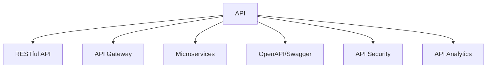

                 

# 软件2.0的API设计与管理

## 1. 背景介绍

随着软件行业的快速发展，API（应用程序编程接口）的重要性日益凸显。API作为软件系统的核心组件，负责对外提供服务，定义了系统的功能和交互方式。从传统的Web API到如今的软件2.0时代，API的设计和管理已经发生了深刻的变化。本文将深入探讨软件2.0背景下的API设计与管理，帮助读者理解API的重要性和最新进展。

### 1.1 软件2.0的兴起

软件2.0是指在软件1.0的基础上，通过AI、云计算、区块链等新技术的加持，实现了更高水平的自动化、智能化、协同化，使软件系统的性能、效率和用户体验得以显著提升。软件2.0的核心在于其动态、自适应、自组织的特点，能够根据环境变化和用户需求实时调整，从而提供更加灵活、高效的服务。

### 1.2 API设计的关键性

在软件2.0时代，API设计变得尤为重要。API不仅需要满足传统的功能需求，还要具备更强的可扩展性、可定制性和安全性，能够灵活适应各种新兴技术和应用场景。因此，API设计已经成为软件2.0开发和管理的核心任务之一。

## 2. 核心概念与联系

### 2.1 核心概念概述

为更好地理解软件2.0背景下的API设计与管理，本节将介绍几个关键概念：

- API（Application Programming Interface）：提供一组规则和协议，允许不同的软件系统之间进行通信和数据交互。
- RESTful API：遵循REST架构风格的API，强调资源的定义和操作，适用于Web服务架构。
- API Gateway：作为API的集中管理点，负责路由、身份验证、负载均衡、缓存等功能。
- Microservices：由一组独立、自治的服务组成，通过API进行通信和协作，强调服务的模块化和解耦。
- OpenAPI/Swagger：一种API描述语言，用于定义API的端点和操作，支持自动生成API文档和客户端代码。
- API Security：保护API免受未授权访问、数据泄露等安全威胁，确保系统的安全性。
- API Analytics：通过数据分析，监控API的使用情况和性能表现，提供优化建议和决策支持。

这些概念之间的逻辑关系可以通过以下Mermaid流程图来展示：



这个流程图展示了一个典型的API生态系统：

1. API是所有应用的基础。
2. RESTful API是API的一种特定风格，强调资源的定义和操作。
3. API Gateway是API的管理中心，负责路由、安全等核心功能。
4. Microservices通过API进行通信和协作，强调服务的模块化和解耦。
5. OpenAPI/Swagger用于定义API，自动生成文档和客户端代码。
6. API Security确保API的安全性。
7. API Analytics监控API的使用情况和性能表现。

## 3. 核心算法原理 & 具体操作步骤

### 3.1 算法原理概述

在软件2.0背景下，API的设计和管理需要考虑更多的技术和业务因素。其核心算法原理包括以下几点：

1. **功能建模**：将业务功能建模为API，确保每个API只负责单一的业务逻辑。
2. **资源抽象**：将业务对象抽象为资源，通过RESTful风格定义资源的操作。
3. **安全性设计**：采用OAuth2、API密钥等机制，确保API的访问安全。
4. **性能优化**：通过缓存、负载均衡等手段，提升API的响应速度和吞吐量。
5. **监控与分析**：利用API Analytics工具，监控API的使用情况和性能表现，提供优化建议。

### 3.2 算法步骤详解

基于上述核心算法原理，API设计与管理可以分为以下几个关键步骤：

1. **需求分析**：与业务团队沟通，明确API所需支持的功能和业务场景，确定API的功能范围。
2. **资源设计**：基于业务需求，设计API的资源和操作，遵循RESTful风格。
3. **接口设计**：定义API的端点和接口规范，包括参数、返回值等，确保API的可扩展性和可定制性。
4. **安全性实现**：引入OAuth2、API密钥等机制，确保API的访问安全，防止未授权访问和数据泄露。
5. **性能优化**：通过缓存、负载均衡等手段，提升API的响应速度和吞吐量，确保系统的稳定性。
6. **监控与分析**：利用API Analytics工具，监控API的使用情况和性能表现，提供优化建议和决策支持。

### 3.3 算法优缺点

基于软件2.0背景下的API设计与管理，其优缺点如下：

**优点**：

1. **灵活性**：API设计遵循RESTful风格，具有良好的灵活性和可扩展性，能够适应各种新兴技术和应用场景。
2. **安全性**：通过OAuth2、API密钥等机制，确保API的访问安全，防止未授权访问和数据泄露。
3. **可扩展性**：采用微服务架构，各服务通过API进行通信和协作，使得系统具有更好的可扩展性。
4. **性能优化**：通过缓存、负载均衡等手段，提升API的响应速度和吞吐量，确保系统的稳定性。

**缺点**：

1. **复杂性**：API设计和管理的复杂度较高，需要考虑更多的技术和业务因素。
2. **开发成本**：API设计和管理的开发成本较高，需要投入大量的人力和时间。
3. **维护难度**：API的维护和管理需要持续投入，特别是在API数量庞大、变更频繁的情况下。

### 3.4 算法应用领域

软件2.0背景下的API设计与管理在以下几个领域得到了广泛应用：

1. **云服务**：云计算平台通过API对外提供计算、存储、网络等资源服务。
2. **物联网(IoT)**：物联网设备通过API进行数据交互和控制。
3. **移动应用**：移动应用通过API与后端服务进行数据交互和功能调用。
4. **人工智能(AI)**：AI模型通过API提供推理、预测、分析等服务。
5. **区块链**：区块链平台通过API进行智能合约的部署和执行。

## 4. 数学模型和公式 & 详细讲解 & 举例说明

### 4.1 数学模型构建

在软件2.0背景下，API设计和管理的数学模型可以概括为以下几个方面：

1. **资源抽象模型**：将业务对象抽象为资源，定义资源的属性、操作和关系。
2. **接口设计模型**：定义API的端点和接口规范，包括参数、返回值等。
3. **安全性模型**：定义API的访问控制机制，如OAuth2、API密钥等。
4. **性能优化模型**：通过缓存、负载均衡等手段，提升API的响应速度和吞吐量。
5. **监控与分析模型**：利用API Analytics工具，监控API的使用情况和性能表现，提供优化建议和决策支持。

### 4.2 公式推导过程

以下是API设计和管理的数学模型和公式推导过程：

1. **资源抽象模型**：
   $$
   R = \{R_i\}^{N}_{i=1}
   $$
   其中，$R_i$表示第$i$个资源，$N$表示资源的总数。

2. **接口设计模型**：
   $$
   E = \{E_i\}^{M}_{i=1}
   $$
   其中，$E_i$表示第$i$个接口，$M$表示接口的总数。

3. **安全性模型**：
   $$
   A = \{A_i\}^{K}_{i=1}
   $$
   其中，$A_i$表示第$i$个访问控制机制，$K$表示访问控制机制的总数。

4. **性能优化模型**：
   $$
   P = \{P_i\}^{P}_{i=1}
   $$
   其中，$P_i$表示第$i$个性能优化措施，$P$表示性能优化措施的总数。

5. **监控与分析模型**：
   $$
   M = \{M_i\}^{N}_{i=1}
   $$
   其中，$M_i$表示第$i$个监控指标，$N$表示监控指标的总数。

### 4.3 案例分析与讲解

以云服务为例，分析API设计和管理的数学模型和公式：

1. **资源抽象模型**：
   - 定义云服务中的资源，如虚拟机、存储桶、数据库等。
   - 对每个资源进行属性、操作和关系的定义，如虚拟机的状态、生命周期等。

2. **接口设计模型**：
   - 定义API的端点和接口规范，如获取虚拟机信息、创建虚拟机等。
   - 定义接口的参数、返回值和错误码，确保API的可扩展性和可定制性。

3. **安全性模型**：
   - 采用OAuth2机制进行访问控制，确保API的访问安全。
   - 定义API密钥机制，对关键操作进行身份验证和权限控制。

4. **性能优化模型**：
   - 采用缓存机制，减少数据库查询次数，提升API的响应速度。
   - 使用负载均衡技术，分散服务器负载，提升系统的吞吐量。

5. **监控与分析模型**：
   - 监控API的使用情况，如请求次数、响应时间等。
   - 分析API的性能表现，如吞吐量、错误率等，提供优化建议和决策支持。

## 5. 项目实践：代码实例和详细解释说明

### 5.1 开发环境搭建

在进行API设计与管理的项目实践前，我们需要准备好开发环境。以下是使用Python进行Flask框架开发的环境配置流程：

1. 安装Anaconda：从官网下载并安装Anaconda，用于创建独立的Python环境。

2. 创建并激活虚拟环境：
```bash
conda create -n flask-env python=3.8 
conda activate flask-env
```

3. 安装Flask：
```bash
pip install flask
```

4. 安装Flask-RESTful：
```bash
pip install flask-restful
```

5. 安装Flask-Security：
```bash
pip install flask-security
```

6. 安装Flask-Caching：
```bash
pip install flask-caching
```

完成上述步骤后，即可在`flask-env`环境中开始API设计和管理的项目实践。

### 5.2 源代码详细实现

我们以一个简单的API设计和管理的项目为例，展示如何通过Flask框架实现API的接口设计、安全性控制和性能优化。

**5.2.1 接口设计**

首先，定义API的接口规范，使用Flask-RESTful框架进行接口的路由和请求处理。

```python
from flask import Flask
from flask_restful import Resource, Api

app = Flask(__name__)
api = Api(app)

class HelloWorld(Resource):
    def get(self):
        return {'message': 'Hello World!'} 

api.add_resource(HelloWorld, '/')

if __name__ == '__main__':
    app.run(debug=True)
```

**5.2.2 安全性控制**

在接口设计的基础上，使用Flask-Security框架实现API的安全性控制，包括身份验证和权限控制。

```python
from flask_security import Security, SQLAlchemyUserDatastore, UserMixin, RoleMixin

# 定义模型
class Role(db.Model, RoleMixin):
    id = db.Column(db.Integer(), primary_key=True)
    name = db.Column(db.String(80), unique=True)
    description = db.Column(db.String(255))

class User(db.Model, UserMixin):
    id = db.Column(db.Integer(), primary_key=True)
    email = db.Column(db.String(255), unique=True)
    password = db.Column(db.String(255))
    active = db.Column(db.Boolean())
    roles = db.relationship('Role', secondary=roles_users, backref=db.backref('users', lazy='dynamic'))

# 初始化用户数据
user_datastore = SQLAlchemyUserDatastore(db, User, Role)
security = Security(app, user_datastore)

# 定义角色和权限
user_datastore.create_all()

# 添加测试用户
user_datastore.create_user(email='admin', password='admin', roles=['admin'])

# 保护API
@app.before_request
@auth.login_required
def before_request():
    pass

class HelloWorld(Resource):
    @auth.login_required
    def get(self):
        return {'message': 'Hello World!'} 
```

**5.2.3 性能优化**

在安全性控制的基础上，使用Flask-Caching框架实现API的性能优化，包括缓存和负载均衡。

```python
from flask_caching import Cache

# 配置缓存
cache = Cache(app, config={'CACHE_TYPE': 'simple', 'CACHE_DEFAULT_TIMEOUT': 500})

# 添加缓存
@app.route('/hello')
@cache.cached(timeout=500)
def hello():
    return {'message': 'Hello World!'}
```

### 5.3 代码解读与分析

让我们再详细解读一下关键代码的实现细节：

**接口设计**：
- 使用Flask-RESTful框架，定义`HelloWorld`类，实现`get`方法，返回`Hello World!`的JSON数据。
- 使用`api.add_resource`方法，将`HelloWorld`类绑定到`/api`路径上，实现路由处理。

**安全性控制**：
- 使用Flask-Security框架，定义`User`和`Role`模型，实现用户和角色的关联。
- 通过`SQLAlchemyUserDatastore`类，初始化用户数据，创建测试用户。
- 使用`@auth.login_required`装饰器，保护API，确保只有登录用户才能访问。

**性能优化**：
- 使用Flask-Caching框架，配置缓存类型为`simple`，默认缓存时间为500秒。
- 使用`@cache.cached`装饰器，对`/hello`路径进行缓存，缓存时间为500秒。

完成以上步骤后，即可在本地运行Flask应用程序，通过访问`http://localhost:5000/api`，获取`Hello World!`的JSON数据。

## 6. 实际应用场景

### 6.1 云服务

在云服务场景中，API设计和管理的实践可以大幅提升系统的可扩展性和安全性。通过API设计和管理的数学模型和公式，云服务能够提供更加灵活、高效、安全的服务。

**功能建模**：定义云服务中的资源和操作，如虚拟机、存储桶、数据库等，确保每个API只负责单一的业务逻辑。

**资源抽象模型**：将云服务中的资源抽象为资源，定义资源的属性、操作和关系，确保资源的清晰和易于理解。

**接口设计模型**：定义API的端点和接口规范，确保API的可扩展性和可定制性，能够适应各种新兴技术和应用场景。

**安全性模型**：采用OAuth2、API密钥等机制，确保API的访问安全，防止未授权访问和数据泄露。

**性能优化模型**：通过缓存、负载均衡等手段，提升API的响应速度和吞吐量，确保系统的稳定性。

**监控与分析模型**：监控API的使用情况和性能表现，提供优化建议和决策支持，确保系统的可靠性和高效性。

### 6.2 物联网(IoT)

在物联网场景中，API设计和管理的实践可以增强设备的互联互通和数据交换。通过API设计和管理的数学模型和公式，物联网设备能够实现更加灵活、高效、安全的数据交互。

**功能建模**：定义物联网设备的功能和操作，确保每个API只负责单一的业务逻辑。

**资源抽象模型**：将物联网设备抽象为资源，定义资源的属性、操作和关系，确保资源的清晰和易于理解。

**接口设计模型**：定义API的端点和接口规范，确保API的可扩展性和可定制性，能够适应各种新兴技术和应用场景。

**安全性模型**：采用OAuth2、API密钥等机制，确保API的访问安全，防止未授权访问和数据泄露。

**性能优化模型**：通过缓存、负载均衡等手段，提升API的响应速度和吞吐量，确保系统的稳定性。

**监控与分析模型**：监控API的使用情况和性能表现，提供优化建议和决策支持，确保系统的可靠性和高效性。

### 6.3 移动应用

在移动应用场景中，API设计和管理的实践可以提升应用的交互体验和数据安全性。通过API设计和管理的数学模型和公式，移动应用能够实现更加灵活、高效、安全的数据交互。

**功能建模**：定义移动应用的功能和操作，确保每个API只负责单一的业务逻辑。

**资源抽象模型**：将移动应用的数据和服务抽象为资源，定义资源的属性、操作和关系，确保资源的清晰和易于理解。

**接口设计模型**：定义API的端点和接口规范，确保API的可扩展性和可定制性，能够适应各种新兴技术和应用场景。

**安全性模型**：采用OAuth2、API密钥等机制，确保API的访问安全，防止未授权访问和数据泄露。

**性能优化模型**：通过缓存、负载均衡等手段，提升API的响应速度和吞吐量，确保系统的稳定性。

**监控与分析模型**：监控API的使用情况和性能表现，提供优化建议和决策支持，确保系统的可靠性和高效性。

## 7. 工具和资源推荐

### 7.1 学习资源推荐

为了帮助开发者系统掌握API设计与管理的理论基础和实践技巧，这里推荐一些优质的学习资源：

1. **Flask官方文档**：Flask框架的官方文档，提供了详细的API设计和管理的指导和示例。

2. **RESTful API设计指南**：详细介绍RESTful API的设计原则和最佳实践，帮助开发者设计高效、安全的API。

3. **API Security with Flask-Security**：Flask-Security框架的官方文档，提供了Flask应用程序的安全性控制方案。

4. **API Performance Optimization**：详细介绍API性能优化的技术和方法，帮助开发者提升API的响应速度和吞吐量。

5. **API Analytics with Flask-Caching**：Flask-Caching框架的官方文档，提供了API性能监控和分析的解决方案。

通过对这些资源的学习实践，相信你一定能够快速掌握API设计与管理的精髓，并用于解决实际的API设计和管理问题。

### 7.2 开发工具推荐

高效的开发离不开优秀的工具支持。以下是几款用于API设计和管理的常用工具：

1. **Flask**：基于Python的开源Web框架，轻量级、易用性强，适合快速迭代研究。

2. **RESTful API**：遵循REST架构风格的API，强调资源的定义和操作，适用于Web服务架构。

3. **Flask-Security**：Flask应用程序的安全性控制框架，提供OAuth2、API密钥等访问控制机制。

4. **Flask-Caching**：提供缓存功能，提升API的响应速度和吞吐量，确保系统的稳定性。

5. **Swagger UI**：API设计和管理的可视化工具，自动生成API文档和客户端代码，帮助开发者设计高效的API。

6. **Postman**：API调试和测试工具，提供丰富的API请求功能，便于API的调试和测试。

合理利用这些工具，可以显著提升API设计和管理的开发效率，加快创新迭代的步伐。

### 7.3 相关论文推荐

API设计和管理的理论研究已经持续数十年，以下是几篇奠基性的相关论文，推荐阅读：

1. **RESTful Web Services: Architectural Style and Characteristics**：介绍RESTful架构风格，成为RESTful API设计的理论基础。

2. **The Evolution of Web APIs**：回顾Web API的发展历程，探讨API设计和管理的演变和未来趋势。

3. **RESTful API Design with Swagger**：介绍Swagger UI和OpenAPI/Swagger技术，提供API设计和管理的最佳实践。

4. **API Security and Protection**：详细介绍API安全性的设计和实现，帮助开发者构建安全的API。

5. **API Performance Optimization**：探讨API性能优化的技术和方法，帮助开发者提升API的响应速度和吞吐量。

这些论文代表了大语言模型微调技术的发展脉络。通过学习这些前沿成果，可以帮助研究者把握学科前进方向，激发更多的创新灵感。

## 8. 总结：未来发展趋势与挑战

### 8.1 总结

本文对软件2.0背景下的API设计与管理进行了全面系统的介绍。首先阐述了API设计和管理在软件2.0时代的重要性和挑战，明确了API设计和管理的核心任务。其次，从原理到实践，详细讲解了API设计和管理的数学模型和公式，给出了API设计和管理的完整代码实例。同时，本文还广泛探讨了API设计和管理在云服务、物联网、移动应用等多个领域的应用前景，展示了API设计和管理的广泛应用价值。最后，本文精选了API设计和管理的各类学习资源，力求为读者提供全方位的技术指引。

通过本文的系统梳理，可以看到，API设计和管理的实践已经成为软件2.0开发和管理的核心任务之一，API设计和管理的质量和效率直接决定了软件系统的性能和可靠性。未来，伴随API设计和管理技术的不懈探索，软件2.0必将在更广阔的领域落地应用，推动人工智能技术在各个行业中的应用和发展。

### 8.2 未来发展趋势

展望未来，API设计和管理技术将呈现以下几个发展趋势：

1. **自动化设计**：利用AI技术自动生成API接口规范和文档，减少开发者的人工干预，提升设计效率。
2. **安全性增强**：引入更多安全机制，如多因素认证、API沙箱等，确保API的安全性，防止未授权访问和数据泄露。
3. **性能优化**：通过缓存、负载均衡、CDN等技术，进一步提升API的响应速度和吞吐量，确保系统的稳定性和可靠性。
4. **监控与分析**：利用AI和机器学习技术，实现API的智能监控和分析，提供更准确的优化建议和决策支持。
5. **多渠道集成**：实现API在Web、移动、IoT等多个渠道的集成和互操作，提升API的可扩展性和适用性。

以上趋势凸显了API设计和管理技术的广阔前景。这些方向的探索发展，必将进一步提升API设计和管理的质量，为软件2.0的落地应用提供更坚实的基础。

### 8.3 面临的挑战

尽管API设计和管理技术已经取得了瞩目成就，但在迈向更加智能化、普适化应用的过程中，仍面临诸多挑战：

1. **设计复杂度**：API设计和管理的复杂度较高，需要考虑更多的技术和业务因素，对开发者的要求也更高。
2. **性能瓶颈**：大规模API系统的性能瓶颈问题，如响应速度、吞吐量等，需要持续优化和改进。
3. **安全性问题**：API的安全性问题，如未授权访问、数据泄露等，需要持续投入，加强防护措施。
4. **持续维护**：API的维护和管理需要持续投入，特别是在API数量庞大、变更频繁的情况下，维护成本较高。

### 8.4 研究展望

面对API设计和管理所面临的挑战，未来的研究需要在以下几个方面寻求新的突破：

1. **自动化设计工具**：开发更多自动化的API设计工具，利用AI技术自动生成API接口规范和文档，减少开发者的人工干预，提升设计效率。
2. **性能优化技术**：引入更多性能优化技术，如边缘计算、CDN等，进一步提升API的响应速度和吞吐量，确保系统的稳定性和可靠性。
3. **智能监控与分析**：利用AI和机器学习技术，实现API的智能监控和分析，提供更准确的优化建议和决策支持。
4. **多渠道集成方案**：实现API在Web、移动、IoT等多个渠道的集成和互操作，提升API的可扩展性和适用性。
5. **安全性增强机制**：引入更多安全机制，如多因素认证、API沙箱等，确保API的安全性，防止未授权访问和数据泄露。

这些研究方向的探索，必将引领API设计和管理技术迈向更高的台阶，为构建安全、可靠、可扩展的软件2.0系统提供更坚实的基础。面向未来，API设计和管理技术还需要与其他AI技术进行更深入的融合，如知识表示、因果推理、强化学习等，多路径协同发力，共同推动软件2.0技术的发展。只有勇于创新、敢于突破，才能不断拓展API设计和管理的边界，让智能技术更好地造福人类社会。

## 9. 附录：常见问题与解答

**Q1：API设计和管理的核心任务是什么？**

A: API设计和管理的核心任务包括以下几点：
1. 功能建模：将业务功能建模为API，确保每个API只负责单一的业务逻辑。
2. 资源抽象：将业务对象抽象为资源，定义资源的属性、操作和关系。
3. 接口设计：定义API的端点和接口规范，确保API的可扩展性和可定制性。
4. 安全性设计：采用OAuth2、API密钥等机制，确保API的访问安全。
5. 性能优化：通过缓存、负载均衡等手段，提升API的响应速度和吞吐量。
6. 监控与分析：利用API Analytics工具，监控API的使用情况和性能表现，提供优化建议和决策支持。

**Q2：API设计和管理的开发成本如何？**

A: API设计和管理的开发成本较高，需要投入大量的人力和时间。主要体现在以下几个方面：
1. 功能建模和资源抽象：需要与业务团队充分沟通，明确API所需支持的功能和业务场景，设计清晰的资源模型。
2. 接口设计和安全性控制：需要定义详细的API端点和接口规范，实现OAuth2、API密钥等访问控制机制。
3. 性能优化和监控分析：需要进行缓存、负载均衡等性能优化，并监控API的使用情况和性能表现。

**Q3：API设计和管理的实际应用场景有哪些？**

A: API设计和管理的实际应用场景非常广泛，包括但不限于以下几个方面：
1. 云服务：通过API设计和管理的数学模型和公式，云服务能够提供更加灵活、高效、安全的服务。
2. 物联网(IoT)：通过API设计和管理的数学模型和公式，物联网设备能够实现更加灵活、高效、安全的数据交互。
3. 移动应用：通过API设计和管理的数学模型和公式，移动应用能够实现更加灵活、高效、安全的数据交互。
4. 人工智能(AI)：通过API设计和管理的数学模型和公式，AI模型能够提供推理、预测、分析等服务。
5. 区块链：通过API设计和管理的数学模型和公式，区块链平台能够实现智能合约的部署和执行。

通过以上对软件2.0背景下的API设计与管理的全面阐述，希望能够帮助读者深入理解API设计和管理的核心任务、挑战和未来发展趋势，为API设计和管理的实践提供更加全面、深入的指导。

