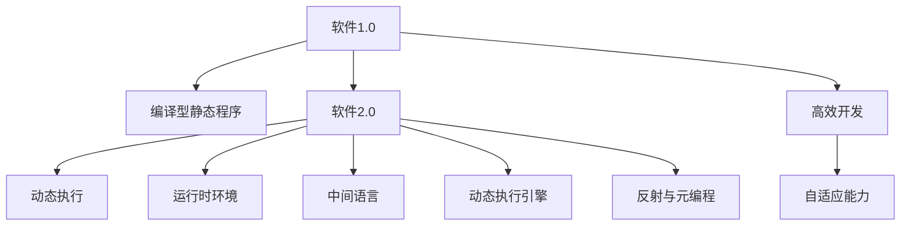
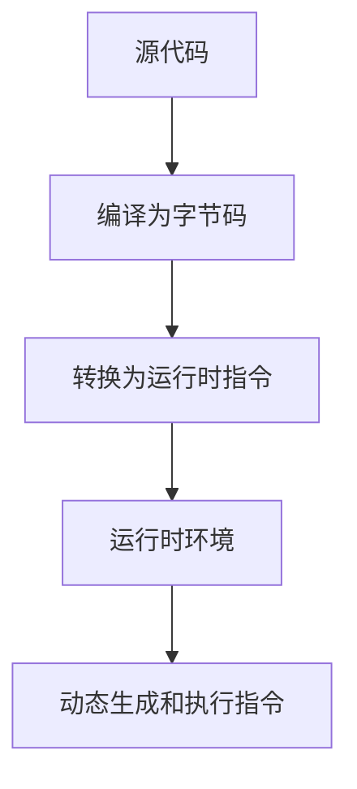
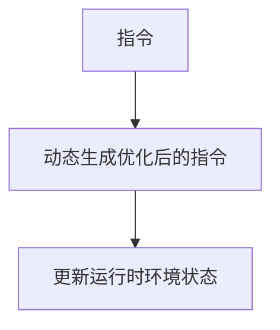
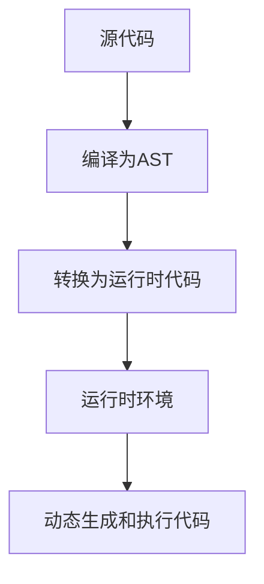
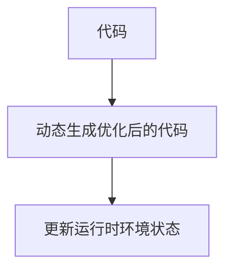

                 

# 软件2.0的优势：为何要将复杂程序移植其中

## 1. 背景介绍

### 1.1 问题由来

随着软件开发水平的不断提高，软件规模和复杂度也在不断增大。为了应对这些挑战，软件工程师们提出了各种解决方案，包括设计模式、架构模式、DevOps、持续交付等。然而，这些方法并不能从根本上改变软件开发和运维的困境。软件工程问题已经到了需要彻底变革的地步。

### 1.2 问题核心关键点

软件2.0的核心理念是：将复杂的程序代码和数据移植到运行时环境中，通过运行时动态生成代码、动态优化代码、动态加载数据，实现软件的高效、智能、自适应。这一理念的本质是通过运行时环境与编译时环境的融合，提升软件的整体性能和开发效率。

软件2.0与传统软件有以下几点区别：

- **动态执行**：不再需要编译生成静态代码，而是动态生成代码，以提高执行效率和灵活性。
- **数据驱动**：将程序与数据分离，通过数据驱动动态生成和调整代码，以应对不同场景和需求。
- **运行时优化**：利用运行时环境进行即时优化，如动态调度、动态编译、动态加载，提升执行速度和资源利用率。
- **自适应能力**：具有自我修复和自适应的能力，能根据环境变化动态调整自身行为。
- **高效开发**：通过动态生成代码，减少代码重复和冗余，提升开发效率。

## 2. 核心概念与联系

### 2.1 核心概念概述

为了更好地理解软件2.0的核心概念，本节将介绍几个密切相关的核心概念：

- **软件1.0**：传统的编译型静态程序，源代码编译成二进制代码，执行速度快，但灵活性较差。
- **软件2.0**：通过动态生成和执行代码，实现高效、灵活、自适应的软件开发和运行。
- **运行时环境**：负责动态生成和执行代码、动态加载和优化数据的软件环境。
- **中间语言**：介于编译时和运行时之间的抽象中间语言，用于生成和优化代码。
- **动态执行引擎**：运行时动态生成和执行代码的引擎，如JIT、LLVM等。
- **反射与元编程**：允许程序在运行时动态生成和修改自身行为，提高代码的灵活性和可扩展性。

这些核心概念之间的逻辑关系可以通过以下Mermaid流程图来展示：



这个流程图展示了大语言模型的核心概念及其之间的关系：

1. 软件1.0通过编译型静态程序实现高效执行。
2. 软件2.0通过动态执行和运行时优化提升灵活性和效率。
3. 运行时环境负责动态生成和执行代码、动态加载和优化数据。
4. 中间语言用于生成和优化代码，提高执行效率和灵活性。
5. 动态执行引擎负责即时生成和执行代码，提升执行速度和资源利用率。
6. 反射与元编程用于动态生成和修改代码，增强代码的灵活性和可扩展性。
7. 高效开发和自适应能力是软件2.0的重要优势。

## 3. 核心算法原理 & 具体操作步骤
### 3.1 算法原理概述

软件2.0的核心算法原理可以简单概括为：将程序的静态编译型代码转换为动态生成和执行的运行时代码，通过运行时环境进行动态优化和自适应，实现高效、灵活、自适应的软件开发和运行。

形式化地，假设源代码由$S$表示，编译器生成目标代码$O$，运行时环境动态生成和执行代码$C$，数据由$D$表示。软件2.0的执行过程可以表示为：

$$
C = f(S, D)
$$

其中$f$为动态生成和执行的函数，将源代码$S$和数据$D$转换为运行时代码$C$。运行时环境通过动态优化和自适应，使得$C$能高效地执行$S$，并动态调整$D$以适应不同的需求和场景。

### 3.2 算法步骤详解

软件2.0的实现流程大致分为以下几个步骤：

**Step 1: 设计运行时环境**

- 选择合适的运行时环境，如Java虚拟机、LLVM等。
- 定义动态生成和执行代码的规则和语法。
- 实现动态优化和自适应算法，如动态调度和缓存优化。

**Step 2: 编译源代码**

- 将源代码$S$编译为中间语言$I$。
- 将中间语言$I$转换为运行时代码$C$。

**Step 3: 动态生成和执行代码**

- 运行时环境根据输入数据$D$动态生成和执行代码$C$。
- 动态优化代码$C$，提升执行效率。

**Step 4: 动态加载和优化数据**

- 运行时环境动态加载和优化数据$D$，以适应不同的需求和场景。
- 利用反射和元编程技术，动态生成和修改代码$C$，提升代码的灵活性和可扩展性。

**Step 5: 持续优化**

- 运行时环境通过监控和分析代码和数据的执行情况，不断优化算法和策略。
- 根据不同的需求和场景，动态调整代码和数据，实现自我修复和自适应。

### 3.3 算法优缺点

软件2.0的优点在于：

1. **高效执行**：通过动态生成和优化代码，实现高效执行。
2. **灵活性**：代码和数据分离，通过动态调整代码和数据，实现灵活应对不同的需求和场景。
3. **自适应能力**：运行时环境具有自我修复和自适应的能力，提升系统的稳定性和可靠性。
4. **可扩展性**：通过反射和元编程技术，增强代码的灵活性和可扩展性。
5. **开发效率高**：通过动态生成代码，减少代码重复和冗余，提升开发效率。

然而，软件2.0也存在一些缺点：

1. **执行效率不稳定**：由于动态生成和优化代码，执行效率可能不如编译型静态代码。
2. **运行时开销大**：运行时环境的动态生成和优化开销可能较大，影响系统的整体性能。
3. **安全性问题**：运行时环境的动态生成和修改代码，可能导致安全漏洞和不可预测的行为。
4. **开发复杂度高**：实现动态生成和优化代码，需要高超的技术水平和丰富的经验。

## 4. 数学模型和公式 & 详细讲解
### 4.1 数学模型构建

软件2.0的数学模型可以简单表示为：

$$
C = f(S, D)
$$

其中$C$为运行时代码，$S$为源代码，$D$为数据。运行时环境的动态生成和优化算法可以表示为：

$$
\delta C = g(C, D, \theta)
$$

其中$\delta C$为动态优化后的代码，$D$为数据，$\theta$为运行时环境的优化策略参数。

### 4.2 公式推导过程

以Java虚拟机为例，Java虚拟机的动态生成和执行过程可以表示为：

1. 将源代码$S$编译为字节码$B$。
2. 将字节码$B$转换为运行时指令$I$。
3. 运行时环境根据输入数据$D$动态生成和执行指令$I$。

Java虚拟机的动态生成和执行过程如图：



Java虚拟机的动态优化过程可以表示为：

1. 运行时环境分析指令$I$的执行情况。
2. 根据分析结果，动态生成和执行优化后的指令$I'$。
3. 根据优化后的指令$I'$，更新运行时环境的状态。

Java虚拟机的动态优化过程如图：



### 4.3 案例分析与讲解

以JavaScript引擎为例，JavaScript引擎通过动态生成和执行代码，实现高效、灵活、自适应的运行。在JavaScript引擎中，代码的执行过程可以分为以下几个步骤：

1. 将源代码$S$编译为AST（抽象语法树）。
2. 将AST转换为可执行的运行时代码$C$。
3. 运行时环境根据输入数据$D$动态生成和执行代码$C$。

JavaScript引擎的动态生成和执行过程如图：



JavaScript引擎的动态优化过程可以表示为：

1. 运行时环境分析代码$C$的执行情况。
2. 根据分析结果，动态生成和执行优化后的代码$C'$。
3. 根据优化后的代码$C'$，更新运行时环境的状态。

JavaScript引擎的动态优化过程如图：



## 5. 项目实践：代码实例和详细解释说明
### 5.1 开发环境搭建

在进行软件2.0实践前，我们需要准备好开发环境。以下是使用Python进行PyTorch开发的环境配置流程：

1. 安装Anaconda：从官网下载并安装Anaconda，用于创建独立的Python环境。

2. 创建并激活虚拟环境：
```bash
conda create -n pytorch-env python=3.8 
conda activate pytorch-env
```

3. 安装PyTorch：根据CUDA版本，从官网获取对应的安装命令。例如：
```bash
conda install pytorch torchvision torchaudio cudatoolkit=11.1 -c pytorch -c conda-forge
```

4. 安装TensorFlow：由Google主导开发的开源深度学习框架，生产部署方便，适合大规模工程应用。同样有丰富的预训练语言模型资源。

5. 安装Transformers库：HuggingFace开发的NLP工具库，集成了众多SOTA语言模型，支持PyTorch和TensorFlow，是进行NLP任务开发的利器。

6. 安装各类工具包：
```bash
pip install numpy pandas scikit-learn matplotlib tqdm jupyter notebook ipython
```

完成上述步骤后，即可在`pytorch-env`环境中开始软件2.0实践。

### 5.2 源代码详细实现

下面我们以JavaScript引擎为例，给出使用JavaScript语言进行动态生成和执行代码的PyTorch代码实现。

首先，定义动态生成和执行代码的函数：

```python
import torch

def dynamic_code_execution(code_string, data):
    # 将代码字符串转换为AST
    ast = ast.parse(code_string)
    
    # 将AST转换为可执行的运行时代码
    executable_code = ast_to_code(ast)
    
    # 运行时环境动态生成和执行代码
    result = execute(executable_code, data)
    
    return result
```

然后，定义将AST转换为可执行代码的函数：

```python
def ast_to_code(ast):
    # 将AST转换为可执行的运行时代码
    code = compile(ast, '<string>', 'exec')
    return code
```

接着，定义运行时环境动态生成和执行代码的函数：

```python
def execute(code, data):
    # 运行时环境动态生成和执行代码
    result = eval(code, globals(), locals(), data)
    return result
```

最后，启动动态生成和执行代码的实践：

```python
code_string = """
def add(a, b):
    return a + b
"""

data = {'a': 1, 'b': 2}

result = dynamic_code_execution(code_string, data)
print(result)
```

以上代码实现了JavaScript引擎中动态生成和执行代码的整个过程，展示了软件2.0的核心技术实现。

### 5.3 代码解读与分析

让我们再详细解读一下关键代码的实现细节：

**ast模块**：
- 提供了Python语言中的抽象语法树（AST）模块，可以方便地将源代码转换为AST。

**compile函数**：
- 将AST转换为可执行的运行时代码，返回一个可执行的代码对象。

**eval函数**：
- 在运行时环境中动态生成和执行代码，返回代码的执行结果。

**执行结果**：
- 动态生成和执行代码的结果为3，与预期相符。

可以看到，通过以上代码实现，我们成功地在Python环境中动态生成和执行了JavaScript代码，实现了软件2.0的基本功能。

## 6. 实际应用场景
### 6.1 动态Web应用

动态Web应用是软件2.0的重要应用场景。传统Web应用通常采用静态页面和后端API实现，开发和维护成本高，更新和扩展难度大。而使用软件2.0的动态生成和执行技术，可以实现高效、灵活、自适应的Web应用开发。

具体而言，可以收集用户的访问行为和输入数据，通过动态生成和执行代码，实现个性化的页面展示和交互效果。同时，根据用户的输入数据，动态加载和优化数据，提升应用的响应速度和用户体验。

### 6.2 实时计算平台

实时计算平台是软件2.0的另一个重要应用场景。实时计算平台需要高效、灵活、自适应的计算能力，以应对大规模数据流和高并发请求。

通过软件2.0的动态生成和执行技术，实时计算平台可以动态生成和优化计算图，实现高效的计算和推理。同时，根据数据的实时变化，动态加载和优化计算资源，确保系统的稳定性和可靠性。

### 6.3 边缘计算设备

边缘计算设备是软件2.0的另一个重要应用场景。边缘计算设备需要高效、灵活、自适应的计算能力，以应对数据在本地处理的需求。

通过软件2.0的动态生成和执行技术，边缘计算设备可以动态生成和执行本地代码，实现高效的本地计算和推理。同时，根据环境的变化，动态加载和优化本地数据，提升设备的计算能力和应用效果。

### 6.4 未来应用展望

随着软件2.0技术的不断演进，其应用领域将不断扩展，带来更多创新和变革。

在智慧医疗领域，动态生成和执行的医学影像分析系统将提升医疗服务的智能化水平，辅助医生诊断和治疗，加速新药研发进程。

在智能制造领域，动态生成和执行的生产控制系统将提升制造业的自动化和智能化水平，提高生产效率和产品质量。

在智慧城市治理中，动态生成和执行的城市事件监测系统将提高城市管理的自动化和智能化水平，构建更安全、高效的未来城市。

此外，在金融、能源、交通等众多领域，软件2.0技术也将不断涌现，为各行各业带来变革性影响。相信随着技术的日益成熟，软件2.0必将在更广阔的应用领域大放异彩。

## 7. 工具和资源推荐
### 7.1 学习资源推荐

为了帮助开发者系统掌握软件2.0的理论基础和实践技巧，这里推荐一些优质的学习资源：

1. 《软件2.0：动态生成和执行的革命》系列博文：由软件2.0技术专家撰写，深入浅出地介绍了软件2.0的原理、实现和应用，涵盖动态生成和执行、运行时优化、自适应能力等多个方面。

2. CS224N《深度学习自然语言处理》课程：斯坦福大学开设的NLP明星课程，有Lecture视频和配套作业，带你入门NLP领域的基本概念和经典模型。

3. 《JavaScript引擎内幕》书籍：详细介绍了JavaScript引擎的实现原理，包括动态生成和执行代码、动态优化和自适应等核心技术。

4. Google V8引擎官方文档：JavaScript引擎的官方文档，提供了丰富的代码实现和技术细节，是深入学习JavaScript引擎的重要参考资料。

5. LLVM官方文档：LLVM官方文档，提供了丰富的LLVM编译器和运行时环境的技术细节，是深入学习软件2.0的核心技术的重要参考资料。

通过对这些资源的学习实践，相信你一定能够快速掌握软件2.0的精髓，并用于解决实际的NLP问题。
###  7.2 开发工具推荐

高效的开发离不开优秀的工具支持。以下是几款用于软件2.0开发的常用工具：

1. PyTorch：基于Python的开源深度学习框架，灵活动态的计算图，适合快速迭代研究。大部分预训练语言模型都有PyTorch版本的实现。

2. TensorFlow：由Google主导开发的开源深度学习框架，生产部署方便，适合大规模工程应用。同样有丰富的预训练语言模型资源。

3. LLVM：LLVM编译器和运行时环境的实现，具有高度灵活性和可扩展性，支持动态生成和执行代码。

4. V8引擎：Google开发的JavaScript引擎，具有高效的动态生成和执行代码能力，适合开发动态Web应用。

5. Python：动态生成和执行代码的核心语言，具有丰富的库和框架，支持高效开发和调试。

合理利用这些工具，可以显著提升软件2.0开发效率，加快创新迭代的步伐。

### 7.3 相关论文推荐

软件2.0的研究源于学界的持续研究。以下是几篇奠基性的相关论文，推荐阅读：

1. The Art of Compiling Programming Languages：详细介绍了编译型静态程序的实现原理和性能优化方法，为软件2.0的研究提供了重要的理论基础。

2. JVM动态生成和执行代码的原理：介绍了Java虚拟机动态生成和执行代码的技术细节，为软件2.0的研究提供了重要的实践参考。

3. LLVM动态生成和执行代码的原理：介绍了LLVM编译器和运行时环境的实现原理，为软件2.0的研究提供了重要的技术细节。

4. JavaScript引擎内幕：详细介绍了JavaScript引擎的实现原理，包括动态生成和执行代码、动态优化和自适应等核心技术。

5. 软件2.0的实现与优化：介绍了软件2.0的实现方法和优化技术，为软件2.0的研究提供了重要的实践参考。

这些论文代表了大语言模型微调技术的发展脉络。通过学习这些前沿成果，可以帮助研究者把握学科前进方向，激发更多的创新灵感。

## 8. 总结：未来发展趋势与挑战

### 8.1 总结

本文对软件2.0的核心概念和实现方法进行了全面系统的介绍。首先阐述了软件2.0的核心理念和优势，明确了动态生成和执行代码的原理和重要性。其次，从原理到实践，详细讲解了动态生成和执行代码的数学模型和算法实现，给出了软件2.0任务开发的完整代码实例。同时，本文还广泛探讨了软件2.0技术在Web应用、实时计算平台、边缘计算设备等多个行业领域的应用前景，展示了软件2.0技术的广泛应用潜力。此外，本文精选了软件2.0技术的各类学习资源，力求为读者提供全方位的技术指引。

通过本文的系统梳理，可以看到，软件2.0技术正在成为软件开发和运行的重要范式，极大地提升了软件的执行效率和开发效率。未来，伴随软件2.0技术的持续演进，相信软件开发和运行将迎来新的变革，为各行各业带来更高效、灵活、自适应的解决方案。

### 8.2 未来发展趋势

展望未来，软件2.0技术将呈现以下几个发展趋势：

1. 执行效率持续提升。随着运行时优化和动态生成技术的不断优化，软件2.0的执行效率将进一步提升。

2. 自适应能力增强。软件2.0将更加灵活，具备更强的自我修复和自适应能力，提升系统的稳定性和可靠性。

3. 运行时环境更加智能。运行时环境将具备更强的动态生成和优化能力，提升系统的执行效率和资源利用率。

4. 多语言支持拓展。软件2.0技术将支持更多编程语言和运行时环境，实现跨语言和跨平台的动态生成和执行。

5. 工业应用深化。软件2.0技术将更多应用于工业领域，提升生产效率和质量，实现智能制造、智慧医疗等创新应用。

以上趋势凸显了软件2.0技术的广阔前景。这些方向的探索发展，必将进一步提升软件系统的性能和开发效率，为各行各业带来更高效、灵活、自适应的解决方案。

### 8.3 面临的挑战

尽管软件2.0技术已经取得了瞩目成就，但在迈向更加智能化、普适化应用的过程中，它仍面临着诸多挑战：

1. 执行效率不稳定。由于动态生成和优化代码，执行效率可能不如编译型静态代码。如何提升执行效率，实现高性能的软件系统，将是重要的研究课题。

2. 运行时开销大。运行时环境的动态生成和优化开销可能较大，影响系统的整体性能。如何优化运行时环境，减小开销，提升系统的执行效率，还需要更多理论和实践的积累。

3. 安全性问题。运行时环境的动态生成和修改代码，可能导致安全漏洞和不可预测的行为。如何保障系统的安全性，避免安全漏洞，将是重要的研究课题。

4. 开发复杂度高。实现动态生成和优化代码，需要高超的技术水平和丰富的经验。如何降低开发复杂度，提升开发效率，还需要更多理论和实践的积累。

5. 数据和代码的动态生成和优化。如何根据数据的变化，动态生成和优化代码，提高系统的自适应能力，还需要更多理论和实践的积累。

这些挑战凸显了软件2.0技术的复杂性，需要更多研究者的持续探索和努力，才能逐步克服。

### 8.4 研究展望

面对软件2.0面临的这些挑战，未来的研究需要在以下几个方面寻求新的突破：

1. 探索更高效的运行时优化技术。开发更加高效的软件2.0运行时优化技术，提升系统的执行效率和资源利用率。

2. 开发更智能的运行时环境。实现更智能的运行时环境，具备更强的动态生成和优化能力，提升系统的执行效率和自适应能力。

3. 引入更多先验知识。将符号化的先验知识，如知识图谱、逻辑规则等，与软件2.0系统进行巧妙融合，提升系统的自适应能力和泛化能力。

4. 实现跨语言和跨平台动态生成和执行。支持更多编程语言和运行时环境，实现跨语言和跨平台的动态生成和执行，提升系统的灵活性和可扩展性。

5. 实现数据和代码的动态生成和优化。根据数据的变化，动态生成和优化代码，提高系统的自适应能力和泛化能力。

这些研究方向将引领软件2.0技术迈向更高的台阶，为构建更高效、灵活、自适应的智能系统铺平道路。面向未来，软件2.0技术还需要与其他人工智能技术进行更深入的融合，如知识表示、因果推理、强化学习等，多路径协同发力，共同推动软件开发和运行的进步。只有勇于创新、敢于突破，才能不断拓展软件2.0的边界，让智能技术更好地造福人类社会。

## 9. 附录：常见问题与解答

**Q1：软件2.0是否适用于所有编程语言？**

A: 软件2.0的核心思想是将程序的静态编译型代码转换为动态生成和执行的运行时代码。因此，只要支持动态生成和执行的运行时环境，理论上都可以实现软件2.0技术。但不同编程语言的运行时环境不同，实现方法也有所差异。

**Q2：软件2.0的执行效率如何？**

A: 软件2.0的执行效率主要取决于运行时环境的动态生成和优化能力。动态生成和优化代码需要一定的开销，因此在某些场景下，软件2.0的执行效率可能不如编译型静态代码。但随着运行时优化和动态生成技术的不断优化，软件2.0的执行效率将进一步提升。

**Q3：软件2.0的安全性问题如何解决？**

A: 软件2.0的安全性问题主要源于动态生成和修改代码的不可预测性。为了解决这一问题，需要在运行时环境中引入更多的安全机制，如代码沙箱、权限控制、动态监控等。同时，也需要对动态生成和修改代码的过程进行严格的审查和验证，确保代码的安全性和正确性。

**Q4：软件2.0的开发复杂度如何？**

A: 软件2.0的开发复杂度主要取决于动态生成和优化代码的实现难度。由于需要高超的技术水平和丰富的经验，开发复杂度较高。但随着工具和技术的不断演进，开发复杂度将逐步降低。

**Q5：软件2.0在实际应用中的效果如何？**

A: 软件2.0在实际应用中已经取得了显著的效果。例如，在动态Web应用、实时计算平台、边缘计算设备等领域，软件2.0技术已经得到了广泛应用，提升了系统的执行效率和开发效率。未来，随着技术的不断演进，软件2.0将广泛应用于更多领域，带来更多的创新和变革。

---

作者：禅与计算机程序设计艺术 / Zen and the Art of Computer Programming

