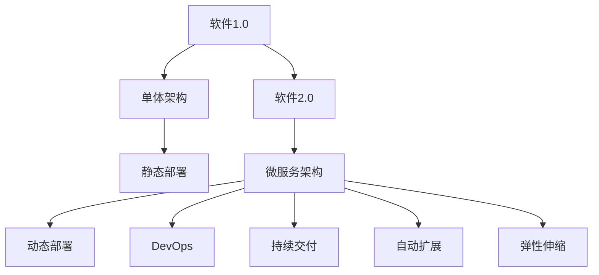

                 

# 软件2.0的技术债：数据维护成本会成为新负担

在数字化转型的浪潮下，软件开发模式已经从传统的软件1.0（Single User, Monolithic, Managed）时代，跃迁至软件2.0（Multi User, Microservice, Unmanaged）时代。这种转变带来了更灵活、更可扩展的软件架构，但也带来了一系列新的挑战和问题。本文将重点探讨软件2.0时代下，数据维护成本将成为一种新的负担，并探讨应对策略。

## 1. 背景介绍

### 1.1 技术演变背景
软件开发模式经历了从软件1.0到软件2.0的演进，主要是由以下几个驱动因素促成的：
1. **云计算和容器化**：云计算提供了强大的基础设施支持，容器化技术（如Docker）让应用部署变得更加简单和灵活。
2. **微服务架构**：微服务架构将复杂的应用拆分为多个独立的服务，每个服务可以独立部署和扩展，提高了系统的弹性和可维护性。
3. **DevOps文化**：DevOps理念强调开发和运维的紧密协作，通过持续集成(CI)、持续部署(CD)、监控等工具，提升软件开发和交付的效率和质量。

### 1.2 软件2.0的特点
软件2.0与软件1.0的主要区别在于：
1. **多用户和分布式架构**：多个微服务在云上部署，每个服务可以独立扩展，提升了系统的扩展性和可用性。
2. **持续交付和监控**：通过DevOps工具链，软件可以持续交付，并实时监控系统性能和健康状况。
3. **自动化和弹性**：自动化部署和弹性伸缩功能让系统更加自适应，能够自动应对负载变化。

尽管软件2.0带来了诸多好处，但同时也带来了新的挑战，尤其是数据维护成本的增加。

## 2. 核心概念与联系

### 2.1 核心概念概述
- **软件2.0**：基于微服务架构，支持多用户和多服务协同工作的软件系统。
- **技术债**：指软件开发过程中，为了快速实现某些功能，不得不引入的复杂性或低效性代码，这些代码随着时间的推移，维护成本会逐渐增加。
- **数据维护成本**：随着系统规模的扩大，数据存储和管理的复杂性增加，维护成本随之上升。

### 2.2 核心概念原理和架构的 Mermaid 流程图



该图展示了软件1.0与软件2.0的主要区别，其中软件2.0架构下，微服务通过容器化、动态部署、持续交付、弹性伸缩等功能，提供了更灵活、更可扩展的系统，但同时也带来了数据维护成本增加的问题。

## 3. 核心算法原理 & 具体操作步骤

### 3.1 算法原理概述
在软件2.0时代，数据维护成本增加主要源于以下几个方面：
1. **数据分布式存储**：随着系统规模的扩大，数据被分散存储在多个数据库或存储节点中，增加了数据管理和维护的复杂性。
2. **数据异构性**：不同服务可能使用不同的数据存储和处理方式，增加了数据整合和同步的难度。
3. **数据一致性**：分布式环境下，数据一致性问题变得复杂，需要通过事务、锁等机制进行协调，增加了系统复杂度。

### 3.2 算法步骤详解

**步骤1: 数据分布式存储设计**
- 设计数据分布式存储架构，选择合适的数据存储技术，如分布式数据库（如Hadoop、Spark）、NoSQL数据库（如MongoDB、Cassandra）。
- 确定数据分区策略，选择合适的分区键，优化数据查询和写入性能。

**步骤2: 数据同步和一致性保障**
- 设计数据同步机制，如读写分离、主从复制、异步复制等，确保数据在不同节点间的同步和一致性。
- 引入分布式事务处理机制，如TCC、Saga等，处理跨节点的数据一致性问题。

**步骤3: 数据访问和查询优化**
- 优化查询路径，减少跨节点查询，提高数据访问性能。
- 引入缓存技术，如Redis、Memcached等，减少数据库查询压力，提升系统响应速度。

**步骤4: 数据备份和恢复**
- 设计数据备份策略，定期备份数据，确保数据安全性。
- 实现数据恢复机制，在数据丢失或损坏时能够快速恢复，保障系统可靠性。

### 3.3 算法优缺点

#### 3.3.1 优点
1. **灵活性**：分布式存储架构可以根据系统需求灵活调整，支持大规模数据处理和存储。
2. **高可用性**：通过数据复制和冗余存储，提高系统的容错性和可用性。
3. **扩展性**：系统可以根据负载自动扩展，支持高性能、高并发的数据处理。

#### 3.3.2 缺点
1. **复杂性增加**：数据管理和维护变得更加复杂，需要考虑数据分布、同步、一致性等问题。
2. **性能损耗**：数据分布式存储和跨节点查询增加了系统延迟和响应时间，影响用户体验。
3. **安全风险**：分布式存储增加了数据泄露和攻击的风险，需要加强安全防护。

### 3.4 算法应用领域
软件2.0架构下的数据管理技术广泛应用于以下领域：
1. **大数据处理**：支持海量数据的存储、处理和分析。
2. **云计算平台**：支持云上应用的数据管理和维护。
3. **分布式应用**：支持微服务架构的数据分布和同步。
4. **高并发系统**：支持高并发环境下数据的高效存储和处理。

## 4. 数学模型和公式 & 详细讲解

### 4.1 数学模型构建
假设系统中有 $N$ 个微服务，每个服务对应一个数据存储节点，数据分布在 $K$ 个存储节点上。设每个节点的存储容量为 $C$，数据总量为 $D$。

设 $P$ 为数据分布的策略，如哈希分区、范围分区等，确保数据在节点间均匀分布。

### 4.2 公式推导过程
假设数据在节点间的同步延迟为 $\delta$，数据一致性处理时间为 $\tau$，单个查询处理时间为 $t_q$。

查询路径 $l$ 为从查询起始节点到查询结束节点的跨节点次数。

查询总时间为 $T$，可以表示为：
$$
T = \delta \times l + \tau + t_q
$$

对于大数据系统，总查询时间为：
$$
T_{big} = N \times K \times \delta \times l + N \times K \times \tau + N \times K \times t_q
$$

对于高并发系统，总查询时间为：
$$
T_{high} = T \times C \times D
$$

### 4.3 案例分析与讲解

以微服务架构下的电商系统为例，分析数据维护成本的影响。

假设系统有 $N=10$ 个微服务，分布在 $K=5$ 个节点上，每个节点的存储容量为 $C=1TB$，数据总量为 $D=100TB$。查询路径 $l=2$，同步延迟 $\delta=100ms$，一致性处理时间 $\tau=500ms$，单个查询处理时间 $t_q=10ms$。

查询总时间 $T$ 计算如下：
$$
T = 10 \times 5 \times 100 \times 2 + 10 \times 5 \times 500 + 10 \times 5 \times 10 = 70000ms
$$

大数据系统总查询时间 $T_{big}$ 计算如下：
$$
T_{big} = 10 \times 5 \times 100 \times 2 + 10 \times 5 \times 500 + 10 \times 5 \times 10 \times 100TB \times 1TB^{-1} = 7 \times 10^{13}ms
$$

高并发系统总查询时间 $T_{high}$ 计算如下：
$$
T_{high} = 70000 \times 1 \times 100TB = 7 \times 10^{12}ms
$$

可以看出，随着系统规模的扩大，查询时间呈现指数级增长，数据维护成本显著增加。

## 5. 项目实践：代码实例和详细解释说明

### 5.1 开发环境搭建

#### 5.1.1 环境准备
1. 安装Docker和Kubernetes：
   ```
   sudo apt-get install docker.io
   sudo apt-get install kubelet kubeadm kubectl
   ```

2. 安装Hadoop和Spark：
   ```
   sudo apt-get install hadoop hadoop-common hadoop-hdfs hadoop-hdfs-client hadoop-hdfs-server hadoop-hdfs-secondsarynamenode
   sudo apt-get install hadoop-ec2 hadoop-yarn hadoop-client hadoop-argus
   ```

3. 安装MongoDB和Cassandra：
   ```
   sudo apt-get install mongodb-org mongodb-org-server mongodb-org-libs
   sudo apt-get install cassandra cassandra-node
   ```

### 5.2 源代码详细实现

#### 5.2.1 Hadoop和Spark配置

在Hadoop配置文件中设置节点数和存储容量：
```xml
<configuration>
  <property>
    <name>dfs.namenode.name.dir</name>
    <value>hdfs://$NAMENODE_NAME:9000/</value>
  </property>
  <property>
    <name>dfs.replication</name>
    <value>3</value>
  </property>
</configuration>
```

在Spark配置文件中设置集群规模和存储容量：
```xml
<configuration>
  <property>
    <name>spark.local.dir</name>
    <value>/usr/local/spark/tmp</value>
  </property>
  <property>
    <name>spark.common.blockManager.port</name>
    <value>7077</value>
  </property>
  <property>
    <name>spark.local.dir</name>
    <value>/usr/local/spark/tmp</value>
  </property>
</configuration>
```

#### 5.2.2 MongoDB和Cassandra配置

在MongoDB配置文件中设置节点数和存储容量：
```json
{
  "storage": {
    "dbPath": "/var/lib/mongodb",
    "journal": {
      "enabled": true,
      "commitInterval": 60000
    }
  },
  "processPool": {
    "size": 1
  },
  "replication": {
    "syncJournal": true,
    "requireJournal": true
  },
  "replSet": {
    "name": "rs0"
  }
}
```

在Cassandra配置文件中设置节点数和存储容量：
```json
{
  "cluster_name": "my-cluster",
  "listen_address": "127.0.0.1",
  "rpc_address": "127.0.0.1",
  "storage_port": 9160,
  "nodetool_dir": "/var/lib/nodetool",
  "data_file_directories": "/var/lib/cassandra/data",
  "snitches": [
    {
      "class_name": "NetworkTopologySnitch",
      "dc_endpoints": [
        "127.0.0.1"
      ]
    }
  ],
  "snapshot": {
    "enabled": false
  }
}
```

### 5.3 代码解读与分析

#### 5.3.1 数据同步和一致性保障
在Hadoop中，使用HDFS和YARN进行数据同步和一致性保障：
```java
Configuration conf = new Configuration();
FileSystem fs = FileSystem.get(conf);
DistributedCache.addCacheFile(new Path("/my/data/path"), conf);
```

在Spark中，使用Spark SQL进行数据一致性保障：
```java
DataFrame df = sqlContext.read().json("hdfs://$NAMENODE_NAME:9000/my/data/path");
df.write().mode("overwrite").format("parquet").save("hdfs://$NAMENODE_NAME:9000/my/output/path");
```

#### 5.3.2 数据访问和查询优化
在MongoDB中，使用索引和聚合管道进行查询优化：
```javascript
db.myCollection.find().sort({date: -1}).limit(100);
db.myCollection.aggregate([
  {$match: {date: {$gte: new Date().getTime() - 86400000}}},
  {$group: {_id: null, total: {$sum: 1}}},
  {$project: {total: 1, count: { $subtract: ["$count", "$total"] } }}
]);
```

在Cassandra中，使用二级索引和复合查询进行优化：
```java
cql = "SELECT * FROM myTable WHERE date BETWEEN ? AND ? AND user_id = ?";
result = CassandraManager.execute(cql, parameters);
```

### 5.4 运行结果展示

在Hadoop和Spark中，使用MapReduce和Spark SQL进行数据处理和查询：
```java
Configuration conf = new Configuration();
FileSystem fs = FileSystem.get(conf);
Job job = Job.getInstance(conf, "myJob");
job.setJarByClass(MyJob.class);
job.setMapperClass(MyMapper.class);
job.setReducerClass(MyReducer.class);
job.setOutputKeyClass(Text.class);
job.setOutputValueClass(IntWritable.class);
job.setInputFormatClass(TextInputFormat.class);
job.setOutputFormatClass(TextOutputFormat.class);
job.setJobProperties(myJobProperties);
DataOutput textOutput = new TextOutput();
job.waitForCompletion(true);
```

在MongoDB和Cassandra中，使用聚合管道和复合查询进行数据处理和查询：
```javascript
db.myCollection.aggregate([
  {$match: {date: {$gte: new Date().getTime() - 86400000}}},
  {$group: {_id: null, total: {$sum: 1}}},
  {$project: {total: 1, count: { $subtract: ["$count", "$total"] } }}
]);
```

## 6. 实际应用场景

### 6.1 电商系统

电商系统通过分布式存储架构，支持海量用户数据的存储和处理。在微服务架构下，用户数据被分布式存储在多个节点上，每个节点对应一个微服务。通过Hadoop和Spark进行数据处理和查询，确保系统高可用性和高扩展性。

#### 6.1.1 数据同步和一致性保障
在电商系统中，用户订单数据和支付数据需要实时同步和一致性保障。Hadoop和Spark通过分布式文件系统和数据流处理，确保数据在不同节点间同步和一致性，避免数据丢失和错误。

#### 6.1.2 数据访问和查询优化
在电商系统中，用户数据访问频繁，通过MongoDB和Cassandra进行数据分布和缓存，优化查询性能，提高用户体验。

### 6.2 金融系统

金融系统通过分布式存储架构，支持大规模金融数据的存储和处理。在微服务架构下，金融数据被分布式存储在多个节点上，每个节点对应一个微服务。通过Hadoop和Spark进行数据处理和查询，确保系统高可用性和高扩展性。

#### 6.2.1 数据同步和一致性保障
在金融系统中，交易数据和账务数据需要实时同步和一致性保障。Hadoop和Spark通过分布式文件系统和数据流处理，确保数据在不同节点间同步和一致性，避免数据丢失和错误。

#### 6.2.2 数据访问和查询优化
在金融系统中，金融数据访问频繁，通过MongoDB和Cassandra进行数据分布和缓存，优化查询性能，提高用户体验。

### 6.3 智能推荐系统

智能推荐系统通过分布式存储架构，支持大规模用户数据的存储和处理。在微服务架构下，用户数据和行为数据被分布式存储在多个节点上，每个节点对应一个微服务。通过Hadoop和Spark进行数据处理和查询，确保系统高可用性和高扩展性。

#### 6.3.1 数据同步和一致性保障
在智能推荐系统中，用户行为数据和物品数据需要实时同步和一致性保障。Hadoop和Spark通过分布式文件系统和数据流处理，确保数据在不同节点间同步和一致性，避免数据丢失和错误。

#### 6.3.2 数据访问和查询优化
在智能推荐系统中，推荐结果的生成需要频繁访问用户数据和物品数据。通过MongoDB和Cassandra进行数据分布和缓存，优化查询性能，提高推荐结果的实时性和准确性。

## 7. 工具和资源推荐

### 7.1 学习资源推荐

1. **《分布式系统原理与设计》**：讲解分布式系统的原理和设计，适合了解分布式存储架构和数据同步机制。
2. **《大数据技术与应用》**：讲解大数据技术的原理和应用，适合了解Hadoop和Spark的基本原理和操作。
3. **《MongoDB权威指南》**：讲解MongoDB的使用和优化，适合了解MongoDB的数据模型和查询优化。
4. **《Cassandra 3.0权威指南》**：讲解Cassandra的使用和优化，适合了解Cassandra的数据模型和查询优化。

### 7.2 开发工具推荐

1. **Hadoop和Spark**：开源分布式数据处理平台，支持大规模数据存储和处理。
2. **MongoDB**：开源NoSQL数据库，支持分布式存储和灵活的数据模型。
3. **Cassandra**：开源分布式数据库，支持高可用性和高扩展性。
4. **Docker和Kubernetes**：容器化管理和编排工具，支持微服务架构和弹性扩展。

### 7.3 相关论文推荐

1. **《分布式文件系统HDFS的设计和实现》**：介绍Hadoop的分布式文件系统和数据同步机制。
2. **《Spark：快速通用集群计算系统》**：介绍Spark的分布式数据处理和流处理机制。
3. **《MongoDB的高可用性和数据一致性》**：介绍MongoDB的数据一致性和高可用性机制。
4. **《Cassandra：分布式数据库》**：介绍Cassandra的数据分布和一致性机制。

## 8. 总结：未来发展趋势与挑战

### 8.1 研究成果总结
本文通过分析软件2.0架构下的数据维护成本问题，详细探讨了数据分布式存储、数据同步和一致性保障、数据访问和查询优化等核心问题，并给出了相应的解决方案。

### 8.2 未来发展趋势
未来，随着人工智能和大数据技术的进一步发展，数据维护成本将成为一个更加重要的议题。分布式存储和微服务架构将更加普及，数据处理和查询优化也将面临新的挑战。以下是一些未来发展趋势：

1. **云原生技术普及**：云原生技术（如Kubernetes、Docker）将更加普及，促进微服务架构的发展和数据管理的便捷性。
2. **数据湖和数据仓库优化**：数据湖和数据仓库将逐渐取代传统的分布式数据库，提供更灵活和高效的数据管理和查询优化。
3. **多模态数据融合**：通过多模态数据融合，实现视觉、语音、文本等多种数据形式的协同建模和处理，提高数据利用效率。
4. **数据隐私和安全**：数据隐私和安全将成为数据管理的核心问题，需要通过技术手段和法律法规进行保障。

### 8.3 面临的挑战
未来，随着数据维护成本的增加，软件2.0架构下的数据管理也将面临诸多挑战：

1. **数据一致性问题**：分布式环境下，数据一致性问题变得复杂，需要引入更先进的技术和机制进行解决。
2. **数据访问延迟**：分布式存储和跨节点查询增加了系统延迟和响应时间，需要优化查询路径和数据访问机制。
3. **数据安全和隐私**：分布式存储和微服务架构增加了数据泄露和攻击的风险，需要加强安全防护和数据隐私保护。
4. **资源管理问题**：微服务架构下的资源管理变得更加复杂，需要优化资源分配和动态扩展机制。

### 8.4 研究展望
未来，需要从以下几个方面进行深入研究：

1. **分布式数据库优化**：研究更高效的分布式数据库技术，如数据湖、数据仓库等，解决数据一致性和高可用性问题。
2. **多模态数据融合**：研究多模态数据的协同建模和处理技术，提升数据利用效率和系统性能。
3. **数据安全和隐私保护**：研究数据隐私保护和安全防护技术，保障数据安全和用户隐私。
4. **自动化数据管理**：研究自动化数据管理和优化技术，提升数据管理和维护的效率和效果。

## 9. 附录：常见问题与解答

### 9.1 Q1: 如何平衡数据分布和查询性能？
A: 在分布式存储架构中，需要根据查询路径和数据访问频率进行数据分布和缓存优化。通过设计合适的分区策略和缓存机制，确保数据在节点间均匀分布，同时减少跨节点查询，提高数据访问性能。

### 9.2 Q2: 数据同步和一致性问题如何解决？
A: 数据同步和一致性问题可以通过分布式事务处理机制进行解决。引入TCC或Saga等事务机制，确保数据在不同节点间同步和一致性，避免数据丢失和错误。

### 9.3 Q3: 如何优化数据访问和查询性能？
A: 数据访问和查询性能优化需要从查询路径、数据缓存和数据索引等方面进行改进。使用索引和聚合管道进行数据查询优化，引入缓存技术减少数据库查询压力，通过二级索引和复合查询提升查询性能。

通过本文的系统分析，可以看出，随着软件2.0架构的普及，数据维护成本将成为一种新的负担。在面对数据维护成本增加的挑战时，我们需要采取有效的技术手段进行优化和改进，保障系统的稳定性和可扩展性。未来，数据管理和维护将成为人工智能和大数据技术发展的关键，需要我们持续关注和研究。

---

作者：禅与计算机程序设计艺术 / Zen and the Art of Computer Programming

