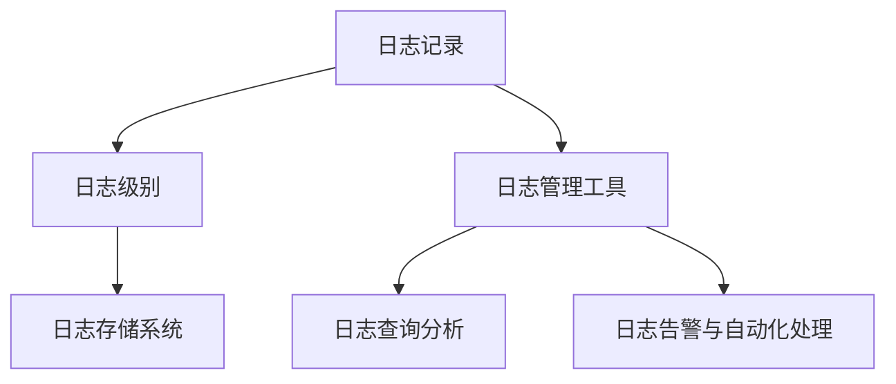

                 

## 1. 背景介绍

### 1.1 问题由来

在过去的几十年里，软件工程经历了从软件1.0到软件2.0的跨越。软件1.0时代，程序员通过编写代码来解决具体问题，但随着系统复杂度的增加，对代码的可维护性、可扩展性和可重用性的要求越来越高。软件2.0时代，随着机器学习、人工智能等新技术的兴起，软件开发更加注重数据驱动、智能分析，数据已经成为了软件系统的核心资产。在这样的背景下，日志管理作为软件系统的基础架构之一，其重要性和复杂度也在不断提升。

### 1.2 问题核心关键点

现代软件系统通常庞大而复杂，包含成千上万行代码和数千个组件。一个典型的分布式系统，如电商、金融、物联网、大数据等，可能每秒产生数万条日志记录，这些日志记录存储在各种不同的系统中，包括文件、数据库、日志存储系统等。有效管理和利用这些日志记录，对于确保系统稳定运行、优化性能、诊断问题、改进用户体验等方面具有至关重要的作用。

如何高效、安全、可扩展地管理日志，成为了软件开发和运维中的一大挑战。本文将深入探讨软件2.0时代日志管理的最佳实践，包括核心概念、核心算法、操作步骤、数学模型、实际应用、工具和资源推荐、未来发展趋势与挑战等，为读者提供全面的指导。

## 2. 核心概念与联系

### 2.1 核心概念概述

为更好地理解软件2.0时代日志管理的方法和技术，本节将介绍几个关键概念：

- 日志记录(Log Record)：软件开发和运维过程中记录的重要信息，包括时间戳、模块名、函数名、线程ID、异常信息、性能指标等。
- 日志级别(Log Level)：用于标识日志记录的重要性和紧急程度，如ERROR、WARN、INFO、DEBUG、TRACE等。
- 日志存储系统(Log Store)：用于存储和管理日志数据的系统，包括文件系统、数据库、日志存储服务(如ELK Stack、Splunk)等。
- 日志管理工具(Log Management Tool)：用于收集、聚合、分析、可视化日志数据的软件工具，如Logstash、Log Monitor、Prometheus等。
- 日志查询分析(Log Query Analysis)：利用日志管理工具，通过预设规则或自定义查询，对日志数据进行统计分析和性能监控。
- 日志告警与自动化处理(Log Alert and Automation)：根据日志记录中的特定事件和规则，通过日志管理工具自动化地发送告警，并执行相应的处理操作。

这些核心概念之间的逻辑关系可以通过以下Mermaid流程图来展示：



这个流程图展示了一个典型的日志管理流程：从生成日志记录开始，经过级别过滤和存储系统，再到日志管理工具进行收集、分析和告警，形成了一个完整的日志管理闭环。

## 3. 核心算法原理 & 具体操作步骤

### 3.1 算法原理概述

软件2.0时代的日志管理，不仅关注日志记录的生成、存储和检索，还强调日志数据的分析、告警和自动化处理。其核心算法原理可以归纳为以下几个方面：

- **数据存储与检索**：通过日志级别和关键字等筛选条件，快速检索需要的日志记录。
- **数据聚合与分析**：通过统计分析和性能监控，识别系统瓶颈和潜在问题。
- **告警与自动化处理**：根据预设的规则和阈值，及时发现和处理系统异常情况。

### 3.2 算法步骤详解

基于软件2.0的日志管理，一般包括以下几个关键步骤：

**Step 1: 日志记录生成**
- 确定日志记录的格式和内容，记录系统的关键事件和状态。
- 设置日志级别，确保重要事件的日志记录能够及时被捕获。
- 选择合适的日志存储系统，将日志记录存储在分布式、高可用、可扩展的系统中。

**Step 2: 日志数据收集与聚合**
- 通过日志管理工具（如Logstash、ELK Stack），收集分布在不同系统中的日志记录，并进行统一聚合。
- 利用日志查询分析工具（如Kibana、Prometheus），对聚合后的日志数据进行统计分析和性能监控。

**Step 3: 告警与自动化处理**
- 根据预设的规则和阈值，利用日志管理工具（如Alertmanager、Grafana），及时发现系统异常情况，并发送告警。
- 根据告警信息，自动执行相应的处理操作，如重启服务、发送邮件通知、自动备份等。

**Step 4: 日志数据可视化与分析**
- 利用数据可视化工具（如Grafana），将日志数据分析结果以图表的形式展示，帮助开发者和运维人员快速定位问题。
- 通过预设的监控指标和规则，对系统性能进行实时监控，提前预警潜在风险。

### 3.3 算法优缺点

软件2.0时代的日志管理，相对于传统的日志管理方法，具有以下优点：
1. 统一管理和分析，减少日志分散和冗余。
2. 自动化处理告警，提升系统稳定性和运维效率。
3. 数据可视化展示，增强问题定位和分析能力。

同时，该方法也存在一定的局限性：
1. 对日志记录格式和内容的要求较高，需要预定义和标准化。
2. 日志管理工具的配置和管理复杂，需要专业知识。
3. 数据存储和查询性能的瓶颈可能影响系统的实时性。

尽管存在这些局限性，但就目前而言，软件2.0的日志管理方法仍是大数据和分布式系统中的主流范式。未来相关研究的重点在于如何进一步降低日志管理的复杂度，提高系统的实时性和自动化水平，同时兼顾数据安全性和隐私保护等因素。

### 3.4 算法应用领域

软件2.0时代的日志管理，已经被广泛应用于各种现代软件系统中，例如：

- 分布式系统：如电商、金融、物联网、大数据等，需要对成千上万台机器的日志进行统一管理和分析。
- 云平台：如AWS、Azure、Google Cloud等，需要通过日志管理工具对云服务中的日志进行实时监控和告警。
- 容器化平台：如Kubernetes、Docker等，需要对容器化应用的日志进行统一管理和自动化处理。
- 应用监控：如网站流量监控、应用性能监控等，通过日志管理工具对应用行为进行实时分析。

## 4. 数学模型和公式 & 详细讲解 & 举例说明

### 4.1 数学模型构建

为了更好地理解软件2.0的日志管理，我们将构建一个简单的数学模型。假设我们有一系列分布式日志记录 $R=\{r_1,r_2,\dots,r_N\}$，每个记录包含时间戳 $t_i$、日志级别 $l_i$、模块名 $m_i$、函数名 $f_i$、线程ID $t_i$、异常信息 $e_i$ 和性能指标 $p_i$。我们的目标是：

- 快速检索特定时间范围内的日志记录。
- 统计特定日志级别的记录数量。
- 分析系统性能指标，识别瓶颈和异常情况。

### 4.2 公式推导过程

**日志检索**

为了快速检索特定时间范围内的日志记录，我们可以使用时间戳 $t_i$ 进行索引。设 $t_{min}$ 和 $t_{max}$ 分别为时间范围的起始和结束时间，则检索公式为：

$$
R_{t_{min} \leq t_i \leq t_{max}}
$$

**日志统计**

为了统计特定日志级别的记录数量，我们可以对日志级别 $l_i$ 进行计数。设 $L=\{l_1,l_2,\dots,l_N\}$，则统计公式为：

$$
Count(L) = \sum_{i=1}^N \delta(l_i = l_j)
$$

其中 $\delta$ 为Kronecker delta函数，当 $l_i = l_j$ 时为1，否则为0。

**性能监控**

为了分析系统性能指标，我们可以利用最小二乘法对性能指标 $p_i$ 进行回归分析。设 $P=\{p_1,p_2,\dots,p_N\}$，则回归模型为：

$$
\hat{p_i} = \alpha_0 + \alpha_1 t_i + \epsilon_i
$$

其中 $\alpha_0$ 和 $\alpha_1$ 为回归系数，$\epsilon_i$ 为随机误差项。通过求解最小二乘法，可以得到最优的回归系数。

### 4.3 案例分析与讲解

以一个电商系统的日志记录为例，我们进行具体分析：

**案例1: 日志检索**

电商系统每秒产生数万条日志记录，我们需要快速检索特定时间段内的订单日志。设时间范围为 2023-01-01 00:00:00 至 2023-01-01 01:00:00，则检索公式为：

$$
R_{2023-01-01 00:00:00 \leq t_i \leq 2023-01-01 01:00:00}
$$

**案例2: 日志统计**

电商系统中有多种日志级别，包括ERROR、WARN、INFO、DEBUG、TRACE等。我们需要统计每日系统错误日志的数量。设日期为2023-01-01，则统计公式为：

$$
Count(ERROR) = \sum_{i=1}^N \delta(l_i = ERROR)
$$

**案例3: 性能监控**

电商系统的平均响应时间为 200ms，但在高峰期响应时间可能会增加。我们需要监控响应时间的变化趋势，识别瓶颈和异常情况。设响应时间为 $p_i$，则回归模型为：

$$
\hat{p_i} = \alpha_0 + \alpha_1 t_i + \epsilon_i
$$

通过最小二乘法求解，可以得到最优的回归系数 $\alpha_0$ 和 $\alpha_1$，从而预测响应时间的变化趋势。

## 5. 项目实践：代码实例和详细解释说明

### 5.1 开发环境搭建

在进行日志管理实践前，我们需要准备好开发环境。以下是使用Python进行日志管理开发的常见环境配置流程：

1. 安装Python：从官网下载并安装最新版本的Python，安装过程中需要根据系统位数选择合适的安装文件。

2. 安装Pip：在命令行中输入 `python -m ensurepip --default-pip` 命令，安装pip工具。

3. 安装日志管理工具：安装Logstash、ELK Stack、Prometheus等日志管理工具。

4. 安装可视化工具：安装Grafana、Kibana等可视化工具。

5. 安装告警工具：安装Alertmanager、Nagios等告警工具。

完成上述步骤后，即可在本地环境中进行日志管理的开发和测试。

### 5.2 源代码详细实现

下面我们以使用ELK Stack进行日志管理的Python代码实现为例，给出详细代码实现。

首先，安装ELK Stack的Python客户端：

```bash
pip install elasticsearch
```

然后，编写日志管理脚本：

```python
from elasticsearch import Elasticsearch
import datetime
import time

# 连接Elasticsearch
es = Elasticsearch(['localhost:9200'])

# 获取当前时间戳
now = datetime.datetime.now().strftime('%Y-%m-%d %H:%M:%S')

# 设置日志级别和检索时间范围
log_level = 'INFO'
start_time = (datetime.datetime(2023, 1, 1, 0, 0, 0) - datetime.timedelta(hours=24)).strftime('%Y-%m-%d %H:%M:%S')
end_time = now

# 构建查询条件
query = {
    "query": {
        "range": {
            "timestamp": {
                "gte": start_time,
                "lte": end_time
            }
        }
    }
}

# 检索日志记录
result = es.search(index='log-index', body=query)

# 统计日志级别数量
count = result['hits']['total']['value']

# 输出统计结果
print(f'{log_level} 日志数量：{count}条')

# 性能监控示例
# 获取系统平均响应时间
response_time = 200  # 单位为毫秒
start_time = datetime.datetime.now()
for i in range(100):
    time.sleep(0.1)
    end_time = datetime.datetime.now()
    p_i = (end_time - start_time).total_seconds() * 1000 / 100
    print(f'响应时间：{p_i}ms')
```

在这个例子中，我们通过Python代码连接了Elasticsearch，构建了查询条件，检索了指定时间范围内的日志记录，并统计了日志级别数量。同时，我们也演示了如何获取系统平均响应时间，并进行性能监控。

### 5.3 代码解读与分析

让我们再详细解读一下关键代码的实现细节：

**连接Elasticsearch**

首先，我们通过 `Elasticsearch` 类连接了Elasticsearch，指定了连接的主机地址和端口号。

**时间戳转换**

然后，我们获取了当前时间戳，并将其转换为字符串格式。这是为了构建查询条件，以便在指定时间范围内检索日志记录。

**构建查询条件**

接着，我们定义了日志级别和检索时间范围，并构建了查询条件。查询条件包括时间戳的范围，使用了 `range` 关键字。

**检索日志记录**

然后，我们通过 `es.search` 方法进行日志记录的检索，指定了索引名称和查询条件。查询结果包含日志记录的总数和具体的记录数据。

**统计日志级别数量**

最后，我们统计了指定日志级别的记录数量，并输出了统计结果。

**性能监控**

为了演示性能监控的实现，我们计算了系统平均响应时间，并通过循环模拟了100次请求，每次请求间隔0.1秒。通过计算每次请求的响应时间，可以构建响应时间的回归模型，从而预测未来的响应时间趋势。

## 6. 实际应用场景

### 6.1 电商系统的日志管理

电商系统是典型的分布式系统，需要处理成千上万台机器的日志记录。通过使用ELK Stack，可以统一管理和分析这些日志记录，快速定位问题和优化性能。

具体而言，电商系统中的日志记录包含了订单生成、支付、配送等关键事件。通过设置不同的日志级别，可以在不同场景下记录不同详细程度的日志信息。例如，支付成功的订单可以使用INFO级别的日志记录，而支付失败的订单则可以使用ERROR级别的日志记录。利用Elasticsearch的查询语言（EQL），可以灵活地检索和统计这些日志记录，并生成可视化的仪表盘和告警，帮助运维人员快速定位问题。

### 6.2 云平台的日志管理

云平台中的日志记录非常丰富，包括系统日志、应用日志、审计日志等。通过使用Prometheus和Grafana，可以实时监控云平台中的系统性能和异常情况，及时发现和处理问题。

具体而言，Prometheus可以收集云平台中的各种监控数据，包括CPU使用率、内存占用率、网络流量等。利用Grafana的数据可视化功能，可以将这些数据以图表的形式展示，帮助运维人员快速识别系统瓶颈和异常情况。例如，当CPU使用率超过80%时，可以自动触发告警，并发送邮件通知运维人员。

### 6.3 容器化平台的日志管理

容器化平台如Kubernetes中，日志记录非常复杂，涉及Docker容器、Pod、Service等多种组件。通过使用Kubernetes的日志插件和ELK Stack，可以统一管理和分析这些日志记录，提升系统的运维效率。

具体而言，Kubernetes中的日志记录包含了容器的启动、运行、停止等关键事件。通过设置日志级别，可以在不同场景下记录不同详细程度的日志信息。利用ELK Stack的统一日志管理和分析功能，可以灵活地检索和统计这些日志记录，并生成可视化的仪表盘和告警，帮助运维人员快速定位问题。例如，当某个容器无法启动时，可以自动触发告警，并发送邮件通知运维人员。

## 7. 工具和资源推荐

### 7.1 学习资源推荐

为了帮助开发者系统掌握软件2.0时代日志管理的技术基础和实践技巧，这里推荐一些优质的学习资源：

1. **《日志管理实战指南》**：这是一本经典的日志管理书籍，详细介绍了日志记录的生成、存储、检索、统计和分析等各个方面。

2. **ELK Stack官方文档**：ELK Stack的官方文档，提供了丰富的教程和示例代码，帮助开发者快速上手。

3. **Prometheus官方文档**：Prometheus的官方文档，提供了完整的配置和管理指南，帮助开发者构建高效的系统监控解决方案。

4. **Grafana官方文档**：Grafana的官方文档，提供了丰富的数据可视化功能和插件，帮助开发者灵活展示系统数据。

5. **日志管理最佳实践视频教程**：B站、YouTube等平台上有许多高质量的日志管理视频教程，帮助开发者快速学习和实践。

通过对这些资源的学习实践，相信你一定能够快速掌握软件2.0时代日志管理的精髓，并用于解决实际的日志问题。

### 7.2 开发工具推荐

高效的开发离不开优秀的工具支持。以下是几款用于日志管理开发的常用工具：

1. **Elasticsearch**：分布式日志存储和查询引擎，支持海量数据的存储和快速检索。

2. **Logstash**：日志收集和处理工具，支持多源数据的收集和转换，可以将日志数据实时发送到Elasticsearch等日志存储系统。

3. **Prometheus**：开源的监控系统，支持实时数据收集和处理，并提供了多种告警和可视化的功能。

4. **Grafana**：开源的数据可视化工具，支持多种数据源，可以与Prometheus、Elasticsearch等集成，生成各种图表和仪表盘。

5. **Alertmanager**：开源的告警系统，支持多渠道告警通知，可以将告警信息发送给运维团队。

6. **Nagios**：经典的企业级监控系统，支持多种告警和可视化功能，可以与ELK Stack等集成。

合理利用这些工具，可以显著提升日志管理任务的开发效率，加快创新迭代的步伐。

### 7.3 相关论文推荐

软件2.0时代的日志管理技术的发展源于学界的持续研究。以下是几篇奠基性的相关论文，推荐阅读：

1. **《分布式系统中的日志记录和分析》**：这篇论文详细介绍了分布式系统中的日志记录格式、存储和分析方法，是日志管理的基础。

2. **《基于ELK Stack的日志管理解决方案》**：这篇论文介绍了如何使用ELK Stack进行日志记录的统一管理和分析，是日志管理的经典案例。

3. **《Prometheus的分布式系统监控》**：这篇论文介绍了如何使用Prometheus进行分布式系统的实时监控和告警，是监控领域的经典论文。

4. **《基于Kubernetes的日志管理》**：这篇论文介绍了如何使用Kubernetes的日志插件和ELK Stack进行日志记录的统一管理和分析，是日志管理在容器化平台的应用案例。

这些论文代表了大数据和分布式系统中的日志管理发展脉络。通过学习这些前沿成果，可以帮助研究者把握学科前进方向，激发更多的创新灵感。

## 8. 总结：未来发展趋势与挑战

### 8.1 总结

本文对软件2.0时代日志管理的方法和技术进行了全面系统的介绍。首先阐述了日志管理在软件2.0时代的重要性和复杂性，明确了日志管理在数据驱动、智能分析中的核心作用。其次，从原理到实践，详细讲解了日志管理的数学模型和操作步骤，给出了日志管理任务开发的完整代码实例。同时，本文还广泛探讨了日志管理方法在电商系统、云平台、容器化平台等多个行业领域的应用前景，展示了日志管理范式的巨大潜力。此外，本文精选了日志管理技术的各类学习资源，力求为读者提供全方位的技术指引。

通过本文的系统梳理，可以看到，软件2.0时代的日志管理技术已经成为大数据和分布式系统中的重要组成部分，对于确保系统稳定运行、优化性能、诊断问题、改进用户体验等方面具有至关重要的作用。未来，伴随日志管理技术和工具的持续演进，相信日志管理将为构建安全、可靠、可扩展的软件系统铺平道路，为大数据和分布式系统的健康发展提供坚实的保障。

### 8.2 未来发展趋势

展望未来，软件2.0时代的日志管理技术将呈现以下几个发展趋势：

1. **数据实时性提升**：随着分布式系统的发展，日志数据的实时性和一致性要求越来越高。未来，日志管理技术将进一步提升数据的实时性和一致性，确保系统能够快速响应和处理各种事件。

2. **数据质量提高**：日志管理不仅要关注数据量的收集，还要关注数据质量，确保日志记录的准确性和完整性。未来，日志管理技术将引入更多元化、自动化的数据质量控制手段，提升日志数据的可信度和可靠性。

3. **数据安全性加强**：日志数据往往包含敏感信息，如何保护日志数据的安全性和隐私性，将成为日志管理的重要挑战。未来，日志管理技术将引入更多的数据加密和访问控制手段，确保日志数据的安全性和隐私性。

4. **数据可视化和自动化处理**：日志数据的可视化和自动化处理，对于系统运维和问题定位至关重要。未来，日志管理技术将进一步提升数据可视化和自动化处理能力，帮助运维人员更快速、准确地发现和处理问题。

5. **多源数据融合**：日志记录不仅来自于系统内部，还可能来自于外部数据源（如日志存储服务、监控系统等）。未来，日志管理技术将引入更多的数据融合和协同处理手段，构建更全面、更高效的数据处理体系。

6. **分布式系统优化**：日志管理技术不仅要关注单一系统，还要关注整个分布式系统的优化。未来，日志管理技术将引入更多分布式系统优化手段，提升系统的稳定性和可用性。

以上趋势凸显了软件2.0时代日志管理技术的广阔前景。这些方向的探索发展，必将进一步提升系统性能和运维效率，为构建安全、可靠、可扩展的软件系统提供坚实的保障。

### 8.3 面临的挑战

尽管软件2.0时代的日志管理技术已经取得了瞩目成就，但在迈向更加智能化、普适化应用的过程中，它仍面临着诸多挑战：

1. **数据量激增**：现代软件系统每秒产生数万条日志记录，数据量呈现指数级增长，如何高效存储和处理这些日志数据，成为一大难题。

2. **数据质量参差不齐**：日志记录可能存在格式不统一、内容不完整、噪音数据等问题，如何提高日志数据的质量，确保数据的准确性和完整性，还需要进一步改进。

3. **数据安全问题**：日志数据包含敏感信息，如何保护日志数据的安全性和隐私性，防止数据泄露和滥用，将是未来的重要挑战。

4. **数据可视化难度**：日志数据格式多样，如何将其转化为可视化的图表和仪表盘，提供直观的数据展示，仍需进一步研究。

5. **数据处理复杂性**：日志管理不仅要处理系统内部的日志数据，还要处理来自外部数据源的多源数据，如何实现多源数据的融合和协同处理，是未来的重要方向。

6. **数据实时性挑战**：日志数据的实时性和一致性要求越来越高，如何提升日志数据的实时性和一致性，满足系统的实时监控和告警需求，仍需进一步优化。

正视日志管理面临的这些挑战，积极应对并寻求突破，将是大数据和分布式系统健康发展的必由之路。相信随着学界和产业界的共同努力，这些挑战终将一一被克服，软件2.0时代的日志管理技术必将在构建安全、可靠、可扩展的软件系统中扮演越来越重要的角色。

### 8.4 研究展望

面对软件2.0时代日志管理所面临的挑战，未来的研究需要在以下几个方面寻求新的突破：

1. **数据质量控制**：引入更多元化、自动化的数据质量控制手段，确保日志记录的准确性和完整性。

2. **数据实时性和一致性**：提升数据的实时性和一致性，确保系统能够快速响应和处理各种事件。

3. **数据加密和访问控制**：引入更多的数据加密和访问控制手段，确保日志数据的安全性和隐私性。

4. **数据可视化和自动化处理**：提升数据可视化和自动化处理能力，帮助运维人员更快速、准确地发现和处理问题。

5. **多源数据融合**：引入更多的数据融合和协同处理手段，构建更全面、更高效的数据处理体系。

6. **分布式系统优化**：引入更多分布式系统优化手段，提升系统的稳定性和可用性。

这些研究方向的探索，必将引领软件2.0时代日志管理技术迈向更高的台阶，为构建安全、可靠、可扩展的软件系统提供坚实的保障。面向未来，日志管理技术还需要与其他人工智能技术进行更深入的融合，如知识表示、因果推理、强化学习等，多路径协同发力，共同推动软件系统的发展。

## 9. 附录：常见问题与解答

**Q1：日志管理对系统性能的影响有哪些？**

A: 日志管理对系统性能的影响主要体现在以下几个方面：

1. **磁盘IO**：日志数据通常存储在磁盘上，频繁的写入操作会影响磁盘IO性能。需要选择合适的日志存储系统，优化磁盘读写性能。

2. **内存占用**：日志数据通常需要缓存，以便快速检索和统计。需要合理配置缓存大小，避免内存溢出。

3. **网络带宽**：日志数据通常需要跨系统传输，频繁的网络传输会影响网络带宽。需要优化网络传输协议，减少网络延迟和带宽消耗。

4. **CPU和GPU资源**：日志数据的处理和分析需要计算资源。需要合理配置计算资源，避免系统资源过度消耗。

**Q2：日志管理中如何处理噪音数据？**

A: 日志管理中处理噪音数据的方法主要包括：

1. **日志过滤**：通过日志级别和关键字等筛选条件，过滤掉无关紧要的日志记录。

2. **数据清洗**：对日志数据进行去重、去噪、纠错等处理，确保数据的准确性和完整性。

3. **异常检测**：利用机器学习和数据分析技术，识别和排除异常日志记录。

4. **数据聚合**：对日志数据进行聚合和统计，减少噪音数据的影响。

**Q3：日志管理中如何保障数据安全？**

A: 日志管理中保障数据安全的方法主要包括：

1. **数据加密**：对日志数据进行加密处理，确保数据传输和存储的安全性。

2. **访问控制**：利用身份认证和权限控制技术，限制对日志数据的访问权限。

3. **审计和监控**：对日志数据的访问和处理进行审计和监控，防止数据泄露和滥用。

4. **数据脱敏**：对日志数据进行脱敏处理，确保数据的隐私性。

**Q4：日志管理中如何提高数据的实时性和一致性？**

A: 日志管理中提高数据的实时性和一致性的方法主要包括：

1. **分布式存储**：利用分布式存储系统，提高日志数据的存储和检索效率。

2. **高可用系统**：利用高可用系统，确保日志数据的可靠性。

3. **实时数据处理**：利用实时数据处理系统，如Apache Kafka、Apache Storm等，实现数据的实时传输和处理。

4. **数据同步机制**：利用数据同步机制，确保日志数据的同步和一致性。

**Q5：日志管理中如何优化数据可视化？**

A: 日志管理中优化数据可视化的方法主要包括：

1. **选择合适的可视化工具**：选择合适的数据可视化工具，如Grafana、Tableau等，提供直观的数据展示。

2. **定制可视化模板**：根据具体的业务需求，定制可视化模板，提供定制化的数据展示。

3. **数据聚合和归纳**：对数据进行聚合和归纳，减少数据量和复杂度，提高可视化的效率。

4. **交互式可视化**：利用交互式可视化技术，提升用户对数据的理解和操作。

**Q6：日志管理中如何实现多源数据融合？**

A: 日志管理中实现多源数据融合的方法主要包括：

1. **统一数据格式**：将多源数据转换为统一的数据格式，方便数据的融合和处理。

2. **数据同步机制**：利用数据同步机制，确保多源数据的同步和一致性。

3. **数据融合算法**：利用数据融合算法，如加权平均、多源插值等，实现多源数据的融合。

4. **数据源治理**：对数据源进行治理，确保数据源的可靠性和稳定性。

通过这些问题的解答，可以看到，软件2.0时代的日志管理技术不仅关注日志数据的生成、存储和检索，还强调日志数据的统计、分析和可视化。未来，伴随日志管理技术和工具的持续演进，相信日志管理将为构建安全、可靠、可扩展的软件系统提供坚实的保障，进一步推动软件工程的发展。

