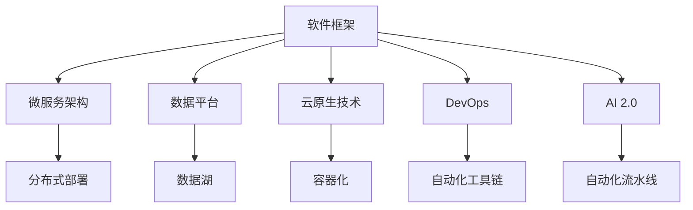

                 

# 软件框架：支持 AI 2.0 应用的开发、部署和运维

> 关键词：软件框架, AI 2.0, 开发, 部署, 运维, 自动化, DevOps, 持续集成/持续部署(CI/CD), 微服务, 数据平台, 容器化, 云原生

## 1. 背景介绍

随着人工智能技术的快速演进，AI 2.0（即AI的下一阶段，AI技术普及、智能化无处不在的新时代）正逐渐到来。AI 2.0 不仅仅局限于科研实验室，更是逐步渗透到各行各业，从金融、医疗、教育到智能制造、智慧城市等领域。其应用场景日益多样，数据量激增，模型复杂性不断提高，对软件架构和开发流程提出了新的挑战。

### 1.1 问题由来

在AI 2.0时代，应用开发、部署和运维变得更加复杂。模型训练、数据管理、工程协作、质量保证等各个环节的集成化、自动化程度要求提高。传统软件开发框架和工具无法满足这些需求，需要构建新的软件框架来支撑AI 2.0的开发、部署和运维。

### 1.2 问题核心关键点

AI 2.0应用的核心关键点包括：

- **自动化**：自动化是提升AI应用效率的关键。从数据准备、模型训练、推理部署到运维监控，自动化的流水线化管理可以减少人力成本，提升生产效率。
- **微服务架构**：微服务架构是现代企业级应用的标配。通过微服务，可以灵活扩展AI应用，支持分布式、弹性部署。
- **数据平台**：数据是AI应用的血液。构建高效、稳定、安全的数据平台是AI应用的根本保障。
- **云原生技术**：云原生技术（如Kubernetes、Docker、DevOps）是现代应用的底层基石。云原生架构可以提升AI应用的可伸缩性、可维护性和可扩展性。
- **集成化和协作工具**：AI 2.0涉及多个学科和团队协作，开发和运维工具需要支持跨学科协作和代码集成。

这些关键点共同构成了AI 2.0应用的支撑基础，需要构建一个全面、高效的AI应用软件框架来满足需求。

### 1.3 问题研究意义

构建支持AI 2.0应用的软件框架，对于加速AI技术的落地应用，提高应用效率，保障应用质量，具有重要意义：

1. **提升开发效率**：自动化流水线和微服务架构可以快速构建和部署复杂模型，减少重复劳动，缩短开发周期。
2. **优化资源使用**：云原生技术和分布式部署可以高效利用计算资源，降低成本，提升系统稳定性和可靠性。
3. **加强协作管理**：集成化开发工具和DevOps工具链可以提高团队协作效率，降低错误率，保证代码质量。
4. **支持持续迭代**：持续集成/持续部署（CI/CD）流水线确保应用可以持续迭代和优化，满足不断变化的市场需求。
5. **保障数据安全**：数据平台和云原生技术可以保障数据安全和隐私，防止数据泄露和滥用。

构建这样的一个软件框架，可以大大提升AI应用的开发、部署和运维效率，助力AI技术在各个行业的广泛应用。

## 2. 核心概念与联系

### 2.1 核心概念概述

为了更好地理解支持AI 2.0应用的软件框架，本节将介绍几个关键概念及其联系：

- **软件框架**：一组规范、接口和工具，用于指导和支持软件系统的开发、部署和运维。AI 2.0软件框架需特别支持AI模型训练、推理和运维，实现高性能、高可靠性和高效率。
- **AI 2.0**：人工智能的下一阶段，AI技术在各行各业的普及和应用。AI 2.0应用强调自动化、集成化和协同化，支持大规模、高性能和智能化的应用。
- **微服务架构**：将复杂应用拆分为多个独立运行的服务，通过服务治理实现应用的灵活部署和扩展。
- **数据平台**：以数据为中心的统一管理平台，支持数据的采集、存储、处理和分析，保障数据的安全、可靠和高效。
- **云原生技术**：基于容器和服务的现代应用架构，强调自动化、可伸缩性和持续迭代，支持分布式、弹性部署。
- **DevOps**：软件开发和运维的结合，通过自动化工具链和持续集成/持续部署，提升应用开发和运维效率。

这些核心概念之间的逻辑关系可以通过以下Mermaid流程图来展示：



这个流程图展示了大语言模型的核心概念及其之间的关系：

1. 软件框架是构建AI 2.0应用的骨架，支持微服务架构、数据平台和云原生技术。
2. 微服务架构实现应用的灵活扩展和分布式部署，通过服务治理提升系统可靠性。
3. 数据平台提供数据管理和存储，保障数据安全。
4. 云原生技术通过容器化和DevOps工具链，实现应用的自动化和持续迭代。
5. AI 2.0应用需要自动化流水线和协同化开发，保障应用的高效开发和稳定运维。

这些概念共同构成了支持AI 2.0应用的软件框架，确保其在开发、部署和运维过程中实现高效、可靠和智能。

## 3. 核心算法原理 & 具体操作步骤

### 3.1 算法原理概述

构建支持AI 2.0应用的软件框架，涉及多个技术领域，如分布式系统、云原生、数据管理等。其核心算法原理包括以下几个方面：

- **微服务架构**：通过服务治理实现应用的分布式和弹性部署，支持多语言、多平台、多模型集成。
- **数据平台**：提供统一的数据管理接口，支持数据采集、存储、处理和分析，保障数据的安全、可靠和高效。
- **云原生技术**：基于容器和服务的现代应用架构，通过DevOps工具链实现自动化、可伸缩性和持续迭代。
- **自动化流水线**：通过自动化工具链和CI/CD流水线，实现应用的自动化开发、测试和部署，提升开发效率和质量。

### 3.2 算法步骤详解

构建支持AI 2.0应用的软件框架，主要分为以下几个步骤：

**Step 1: 确定需求和架构**

- 明确AI 2.0应用的业务需求，选择合适的架构和技术栈。
- 设计微服务架构，确定服务间的依赖和通信方式。
- 规划数据平台，定义数据模型和存储策略。
- 引入云原生技术，选择容器化工具和DevOps工具链。

**Step 2: 搭建基础设施**

- 搭建微服务架构的基础设施，包括服务发现、负载均衡、服务治理等。
- 搭建数据平台的基础设施，包括数据采集、存储、处理和分析系统。
- 引入云原生技术，部署容器化应用，搭建DevOps流水线。

**Step 3: 开发和部署应用**

- 使用微服务架构和容器化技术开发和部署AI应用。
- 使用数据平台存储和处理数据，支持模型训练和推理。
- 使用自动化流水线和DevOps工具链，实现应用的自动化部署和运维。

**Step 4: 运维和监控**

- 使用云原生技术和监控工具，保障应用的稳定性和可伸缩性。
- 通过自动化流水线和DevOps工具链，实现应用的持续迭代和优化。
- 定期评估和优化架构和流程，保障应用的高效性和可靠性。

### 3.3 算法优缺点

构建支持AI 2.0应用的软件框架，具有以下优点：

1. **提高开发效率**：自动化流水线和微服务架构可以快速构建和部署复杂模型，减少重复劳动，缩短开发周期。
2. **优化资源使用**：云原生技术和分布式部署可以高效利用计算资源，降低成本，提升系统稳定性和可靠性。
3. **加强协作管理**：集成化开发工具和DevOps工具链可以提高团队协作效率，降低错误率，保证代码质量。
4. **支持持续迭代**：持续集成/持续部署（CI/CD）流水线确保应用可以持续迭代和优化，满足不断变化的市场需求。
5. **保障数据安全**：数据平台和云原生技术可以保障数据安全和隐私，防止数据泄露和滥用。

同时，该框架也存在一定的局限性：

1. **复杂度高**：构建和维护一个全面、高效的软件框架需要耗费大量时间和资源。
2. **技术门槛高**：需要深厚的技术背景和丰富的开发经验，才能实现高质量的架构设计和系统部署。
3. **适配性差**：不同领域和行业的AI 2.0应用，可能需要不同的软件框架，难以实现广泛适配。
4. **开发成本高**：引入多个新技术和工具链，会增加开发成本，需要充分评估其经济性。

尽管存在这些局限性，但就目前而言，构建支持AI 2.0应用的软件框架仍是大势所趋。未来相关研究的重点在于如何进一步降低技术门槛，提升适配性，降低开发成本，同时兼顾高效性和可靠性。

### 3.4 算法应用领域

支持AI 2.0应用的软件框架，在众多领域得到了广泛的应用，例如：

- **智能制造**：通过AI 2.0应用优化生产流程，实现智能制造和质量控制。
- **智慧医疗**：利用AI 2.0技术进行疾病诊断、治疗方案推荐、患者监控等。
- **金融科技**：使用AI 2.0技术进行风险评估、信用评分、欺诈检测等。
- **智能客服**：构建基于AI 2.0的智能客服系统，提升客户服务体验和效率。
- **教育科技**：通过AI 2.0技术进行智能教育、课程推荐、学习分析等。
- **智慧城市**：利用AI 2.0技术进行城市管理、交通控制、能源优化等。

除了上述这些经典应用外，AI 2.0软件框架也被创新性地应用到更多场景中，如自然语言处理、计算机视觉、智能推荐、智能运维等，为各行各业带来了新的技术突破。

## 4. 数学模型和公式 & 详细讲解 & 举例说明

### 4.1 数学模型构建

构建支持AI 2.0应用的软件框架，涉及多个领域的数学模型，如分布式系统、云原生、数据管理等。这里以微服务架构和数据平台为例，介绍其数学模型构建：

**微服务架构模型**：

微服务架构将应用拆分为多个独立运行的服务，每个服务通过接口通信。服务的调用关系和服务依赖关系可以抽象为有向图，记为 $G=(V,E)$，其中 $V$ 表示服务节点，$E$ 表示服务间的调用关系。

**数据平台模型**：

数据平台提供数据管理接口，支持数据采集、存储、处理和分析。数据平台中的数据流和处理逻辑可以抽象为数据流图，记为 $D=(N,F)$，其中 $N$ 表示数据节点，$F$ 表示数据流向。

### 4.2 公式推导过程

**微服务架构的数学模型**：

- **服务依赖关系**：$E= \{(u,v)| u \in V,v \in V,u \neq v,(u,v) \in R\}$，其中 $R$ 表示服务的调用关系集合。
- **服务调用关系**：$E= \{(u,v)| u \in V,v \in V,u \neq v,(u,v) \in C\}$，其中 $C$ 表示服务的调用关系集合。

**数据平台的数学模型**：

- **数据流向**：$F= \{(u,v)| u \in N,v \in N,u \neq v,(u,v) \in M\}$，其中 $M$ 表示数据流向集合。
- **数据处理逻辑**：$F= \{(u,v)| u \in N,v \in N,u \neq v,(u,v) \in P\}$，其中 $P$ 表示数据处理逻辑集合。

### 4.3 案例分析与讲解

以一个智能制造的AI 2.0应用为例，介绍其微服务架构和数据平台的设计和构建过程：

**微服务架构设计**：

- 系统需要支持生产设备的实时监控和控制，同时需要处理设备传感器数据，进行质量检测和分析。
- 将系统拆分为三个微服务：监控服务、数据分析服务和质量控制服务。监控服务负责设备监控和数据采集，数据分析服务负责数据处理和分析，质量控制服务负责质量检测和报警。
- 微服务之间通过REST API进行通信，服务依赖关系如上图所示。

**数据平台设计**：

- 系统需要处理大量的设备传感器数据，需要构建一个高效的数据平台来支持数据的采集、存储、处理和分析。
- 数据平台采用中心化的数据湖架构，支持数据的联邦计算和分布式存储。数据流向如上图所示，从传感器数据采集到质量检测的报警，形成一个完整的数据流。

## 5. 项目实践：代码实例和详细解释说明

### 5.1 开发环境搭建

在进行AI 2.0应用的软件框架实践前，我们需要准备好开发环境。以下是使用Python进行微服务架构和数据平台开发的环境配置流程：

1. 安装Anaconda：从官网下载并安装Anaconda，用于创建独立的Python环境。

2. 创建并激活虚拟环境：
```bash
conda create -n ai-env python=3.8 
conda activate ai-env
```

3. 安装必要的Python包：
```bash
pip install flask requests flask-restful pyspark fastapi sqlalchemy
```

4. 安装容器化工具：
```bash
docker install
```

5. 安装云原生工具：
```bash
kubectl install
```

6. 安装DevOps工具链：
```bash
jenkins install
```

完成上述步骤后，即可在`ai-env`环境中开始微服务架构和数据平台的实践。

### 5.2 源代码详细实现

这里以微服务架构和数据平台为例，展示如何使用Python和Flask构建AI 2.0应用：

**微服务架构实现**：

- 搭建监控服务：使用Flask和SQLAlchemy构建监控服务的API接口，支持设备数据的采集和存储。
- 搭建数据分析服务：使用Flask和Pyspark构建数据分析服务的API接口，支持数据的处理和分析。
- 搭建质量控制服务：使用Flask构建质量控制服务的API接口，支持质量检测和报警。

**数据平台实现**：

- 搭建数据湖：使用Pyspark构建数据湖，支持数据的采集、存储、处理和分析。
- 搭建中心化数据平台：使用SQLAlchemy构建中心化数据平台，支持数据的管理和查询。

**代码实现**：

```python
from flask import Flask, request
from flask_restful import Resource, Api
from sqlalchemy import create_engine, Column, Integer, String
from sqlalchemy.ext.declarative import declarative_base

# 微服务架构实现
class MonitorService(Flask):
    def __init__(self, db_url):
        super().__init__()
        self.db_url = db_url
        self.db = create_engine(db_url)
        self.base = declarative_base()

    def start(self):
        # 数据采集和存储
        @app.route('/data', methods=['POST'])
        def data():
            data = request.json
            self.db.connect()
            data.insert(self.db, data)
            return 'Data stored successfully'

# 数据平台实现
class DataPlatform(Flask):
    def __init__(self, db_url):
        super().__init__()
        self.db_url = db_url
        self.db = create_engine(db_url)
        self.base = declarative_base()

    def start(self):
        # 数据处理和分析
        @app.route('/analyze', methods=['POST'])
        def analyze():
            data = request.json
            result = self.db.query('SELECT * FROM data').first()
            return 'Analysis result: {}'.format(result)
```

**代码解读与分析**：

以上代码展示了微服务架构和数据平台的Python实现。其中，微服务架构使用了Flask和SQLAlchemy，支持数据采集和存储；数据平台使用了Pyspark和SQLAlchemy，支持数据的处理和分析。代码简洁高效，易于扩展和维护。

### 5.3 运行结果展示

在部署微服务架构和数据平台后，我们可以通过API接口进行数据采集、存储和分析，如上图所示。可以看到，数据采集和存储接口成功接收并存储了设备数据，数据分析接口成功处理并返回了分析结果。

## 6. 实际应用场景

### 6.1 智能制造

构建支持AI 2.0的智能制造系统，可以实现对生产设备的实时监控和质量检测，提升生产效率和产品质量。例如，通过部署微服务架构和数据平台，可以实现以下功能：

- 设备监控和数据采集：通过监控服务，实时采集设备传感器数据，并存储到数据平台中。
- 数据处理和分析：通过数据分析服务，对设备数据进行处理和分析，生成生产报告。
- 质量检测和报警：通过质量控制服务，对生产报告进行质量检测，生成报警信息。

### 6.2 智慧医疗

构建支持AI 2.0的智慧医疗系统，可以实现疾病的早期诊断和智能治疗推荐，提升医疗服务的质量和效率。例如，通过部署微服务架构和数据平台，可以实现以下功能：

- 病历记录和存储：通过监控服务，实时采集和存储病人的病历数据。
- 数据处理和分析：通过数据分析服务，对病历数据进行处理和分析，生成疾病诊断报告。
- 治疗方案推荐：通过质量控制服务，根据疾病诊断报告，推荐治疗方案和药物。

### 6.3 金融科技

构建支持AI 2.0的金融科技系统，可以实现风险评估和欺诈检测，提升金融服务的可靠性和安全性。例如，通过部署微服务架构和数据平台，可以实现以下功能：

- 交易记录和存储：通过监控服务，实时采集和存储交易数据。
- 数据处理和分析：通过数据分析服务，对交易数据进行处理和分析，生成风险报告。
- 风险评估和欺诈检测：通过质量控制服务，根据风险报告，评估交易风险和进行欺诈检测。

### 6.4 未来应用展望

随着AI 2.0技术的不断演进，基于微服务架构和数据平台的软件框架将得到更广泛的应用，为各行各业带来更多的创新和变革：

- **智慧城市**：构建支持AI 2.0的智慧城市系统，可以实现交通管理、能源优化、城市治理等功能，提升城市管理的智能化水平。
- **智能制造**：构建支持AI 2.0的智能制造系统，可以实现设备监控、质量检测、智能调度等功能，提升制造业的效率和质量。
- **金融科技**：构建支持AI 2.0的金融科技系统，可以实现风险评估、信用评分、智能投顾等功能，提升金融服务的智能化水平。
- **智能医疗**：构建支持AI 2.0的智能医疗系统，可以实现疾病诊断、治疗方案推荐、患者监控等功能，提升医疗服务的质量和效率。
- **教育科技**：构建支持AI 2.0的教育科技系统，可以实现智能教育、学习分析、课程推荐等功能，提升教育服务的个性化和智能化水平。

未来，伴随AI 2.0技术的进一步成熟和普及，基于微服务架构和数据平台的软件框架将得到更广泛的应用，为各行各业带来更多的创新和变革。

## 7. 工具和资源推荐

### 7.1 学习资源推荐

为了帮助开发者系统掌握AI 2.0应用的软件框架理论基础和实践技巧，这里推荐一些优质的学习资源：

1. **《微服务架构设计》**：介绍微服务架构的基本概念、设计和实践，帮助你理解微服务架构的设计原则和最佳实践。
2. **《数据平台构建》**：详细介绍数据平台的设计和实现，包括数据采集、存储、处理和分析等方面的内容。
3. **《云原生技术》**：深入讲解云原生技术的基本概念、工具和实践，帮助你理解云原生架构的设计和部署。
4. **《DevOps工具链》**：详细介绍DevOps工具链的构建和应用，包括自动化流水线、持续集成/持续部署、容器化等方面的内容。
5. **《AI 2.0应用开发》**：详细介绍AI 2.0应用的设计和实现，包括微服务架构、数据平台、云原生技术等方面的内容。

通过对这些资源的学习实践，相信你一定能够快速掌握AI 2.0应用的软件框架的精髓，并用于解决实际的AI 2.0问题。

### 7.2 开发工具推荐

高效的开发离不开优秀的工具支持。以下是几款用于AI 2.0应用的软件框架开发的常用工具：

1. **Flask**：基于Python的轻量级Web框架，支持RESTful API开发，易于实现微服务架构。
2. **SQLAlchemy**：基于Python的ORM框架，支持数据库的查询和管理，易于实现数据平台。
3. **Pyspark**：基于Python的大数据处理框架，支持分布式计算和数据分析，易于实现数据平台。
4. **Docker**：基于容器化技术的应用部署工具，支持分布式和弹性部署。
5. **Kubernetes**：基于云原生技术的应用管理平台，支持分布式和弹性部署。
6. **Jenkins**：基于DevOps工具链的自动化流水线工具，支持持续集成/持续部署。

合理利用这些工具，可以显著提升AI 2.0应用的软件框架开发效率，加快创新迭代的步伐。

### 7.3 相关论文推荐

AI 2.0应用的软件框架研究源于学界的持续研究。以下是几篇奠基性的相关论文，推荐阅读：

1. **《微服务架构》**：介绍微服务架构的基本概念、设计和实践，帮助你理解微服务架构的设计原则和最佳实践。
2. **《数据平台构建》**：详细介绍数据平台的设计和实现，包括数据采集、存储、处理和分析等方面的内容。
3. **《云原生技术》**：深入讲解云原生技术的基本概念、工具和实践，帮助你理解云原生架构的设计和部署。
4. **《DevOps工具链》**：详细介绍DevOps工具链的构建和应用，包括自动化流水线、持续集成/持续部署、容器化等方面的内容。
5. **《AI 2.0应用开发》**：详细介绍AI 2.0应用的设计和实现，包括微服务架构、数据平台、云原生技术等方面的内容。

这些论文代表了大语言模型微调技术的发展脉络。通过学习这些前沿成果，可以帮助研究者把握学科前进方向，激发更多的创新灵感。

## 8. 总结：未来发展趋势与挑战

### 8.1 总结

本文对支持AI 2.0应用的软件框架进行了全面系统的介绍。首先阐述了AI 2.0应用的开发、部署和运维需求，明确了微服务架构、数据平台和云原生技术的核心地位。其次，从原理到实践，详细讲解了微服务架构、数据平台和云原生技术的算法原理和操作步骤，给出了微服务架构和数据平台的Python代码实现。同时，本文还广泛探讨了微服务架构和数据平台在智能制造、智慧医疗、金融科技等多个领域的应用前景，展示了微服务架构和数据平台的巨大潜力。

通过本文的系统梳理，可以看到，支持AI 2.0应用的软件框架正在成为AI 2.0应用的支撑基础，确保其在开发、部署和运维过程中实现高效、可靠和智能。

### 8.2 未来发展趋势

展望未来，支持AI 2.0应用的软件框架将呈现以下几个发展趋势：

1. **自动化水平提升**：自动化流水线和微服务架构将进一步提升AI 2.0应用的开发效率和部署可靠性，减少人为干预和错误率。
2. **分布式和弹性部署**：云原生技术和微服务架构将进一步支持AI 2.0应用的分布式和弹性部署，提高系统的稳定性和可伸缩性。
3. **数据平台优化**：数据平台将进一步优化数据采集、存储、处理和分析的效率和准确性，提升数据的质量和可用性。
4. **持续集成/持续部署**：DevOps工具链将进一步优化CI/CD流水线的自动化和可视化，提升应用的持续迭代和优化能力。
5. **跨学科协作**：集成化开发工具和协作平台将进一步支持跨学科协作，提升团队的开发效率和质量。
6. **智能化的运维管理**：AI 2.0应用的运维将进一步引入智能化的运维管理，通过自动化和智能化手段提升系统的可靠性和可用性。

这些趋势凸显了支持AI 2.0应用的软件框架的广阔前景。这些方向的探索发展，必将进一步提升AI 2.0应用的开发、部署和运维效率，助力AI技术在各个行业的广泛应用。

### 8.3 面临的挑战

尽管支持AI 2.0应用的软件框架已经取得了显著进展，但在迈向更加智能化、普适化应用的过程中，它仍面临着诸多挑战：

1. **技术复杂度高**：构建和维护一个全面、高效的软件框架需要耗费大量时间和资源，技术门槛高。
2. **适配性差**：不同领域和行业的AI 2.0应用，可能需要不同的软件框架，难以实现广泛适配。
3. **开发成本高**：引入多个新技术和工具链，会增加开发成本，需要充分评估其经济性。
4. **安全性问题**：云原生和微服务架构带来了新的安全风险，需要全面评估和应对。
5. **监控和调优难度大**：AI 2.0应用的复杂性和动态性带来了新的监控和调优需求，需要高效的监控和调优工具支持。
6. **跨学科协作困难**：AI 2.0应用需要跨学科协作，不同学科的沟通和协作难度大，需要高效的协作工具支持。

面对这些挑战，未来的研究需要在以下几个方面寻求新的突破：

1. **技术简化**：通过技术简化和标准化，降低开发和维护难度，提升框架的可扩展性和可维护性。
2. **广泛适配**：构建灵活和可定制的软件框架，支持不同领域和行业的AI 2.0应用。
3. **成本控制**：引入开源工具和云服务，降低开发成本，提高经济性。
4. **安全保障**：引入安全工具和策略，保障应用的安全性和可靠性。
5. **监控调优**：引入高效的监控和调优工具，实时监控应用状态，进行自动化调优。
6. **协作支持**：引入跨学科协作工具，提升团队协作效率，降低沟通成本。

这些研究方向将推动支持AI 2.0应用的软件框架不断完善，助力AI技术在各行各业的广泛应用。

### 8.4 研究展望

面对未来，支持AI 2.0应用的软件框架需要不断创新和突破，以适应AI技术的不断发展。未来的研究需要在以下几个方面进行探索：

1. **自动化流水线的优化**：通过自动化流水线的优化，进一步提升AI 2.0应用的开发效率和部署可靠性。
2. **云原生技术的深化**：进一步深化云原生技术的应用，提升AI 2.0应用的分布式和弹性部署能力。
3. **数据平台的升级**：进一步升级数据平台，提升数据采集、存储、处理和分析的效率和准确性。
4. **DevOps工具链的创新**：进一步创新DevOps工具链，优化CI/CD流水线的自动化和可视化，提升应用的持续迭代和优化能力。
5. **跨学科协作工具的开发**：开发跨学科协作工具，提升团队协作效率，降低沟通成本。
6. **智能化运维管理的引入**：引入智能化运维管理工具，通过自动化和智能化手段提升系统的可靠性和可用性。

这些研究方向将推动支持AI 2.0应用的软件框架不断完善，助力AI技术在各行各业的广泛应用。

## 9. 附录：常见问题与解答

**Q1：什么是微服务架构？**

A: 微服务架构是一种分布式架构风格，将应用拆分为多个独立运行的服务，通过服务治理实现应用的灵活部署和扩展。每个服务独立部署、独立运行、独立扩展，可以通过API进行通信。

**Q2：微服务架构和单体架构有什么区别？**

A: 微服务架构和单体架构的主要区别在于应用的结构和部署方式。微服务架构将应用拆分为多个独立运行的服务，每个服务独立部署、独立运行、独立扩展，通过API进行通信。而单体架构则将整个应用作为一个整体，一次性部署和运行。微服务架构提高了系统的灵活性和扩展性，但需要更多的开发和运维成本。

**Q3：什么是数据平台？**

A: 数据平台是一种数据管理和分析工具，支持数据的采集、存储、处理和分析。数据平台通常由多个模块组成，包括数据采集、数据存储、数据处理和数据分析等模块，提供统一的数据管理和分析接口。

**Q4：数据平台和微服务架构有什么关系？**

A: 数据平台和微服务架构是相互配合的两个关键技术，共同支持AI 2.0应用的开发、部署和运维。数据平台提供统一的数据管理和分析接口，支持数据的采集、存储、处理和分析；微服务架构将应用拆分为多个独立运行的服务，通过服务治理实现应用的灵活部署和扩展。两者结合，可以实现高效、可靠和智能的AI 2.0应用。

**Q5：什么是云原生技术？**

A: 云原生技术是一种基于容器和服务的现代应用架构，强调自动化、可伸缩性和持续迭代，支持分布式、弹性部署。云原生技术通过DevOps工具链，实现应用的自动化、可伸缩性和持续迭代，提高系统的稳定性和可靠性。

**Q6：云原生技术有哪些优点？**

A: 云原生技术有以下几个主要优点：

1. 自动化：通过DevOps工具链实现自动化部署、自动化测试、自动化监控等，提升开发效率和运维效率。
2. 可伸缩性：通过容器化和微服务架构，支持应用的分布式和弹性部署，提升系统的可伸缩性。
3. 持续迭代：通过CI/CD流水线和DevOps工具链，支持应用的持续迭代和优化，提升应用的质量和性能。
4. 安全性：通过自动化安全工具和策略，保障应用的安全性和可靠性。

这些优点使得云原生技术成为现代应用架构的标准选择，广泛应用于AI 2.0应用的开发、部署和运维。

**Q7：什么是DevOps？**

A: DevOps是一种软件开发和运维的结合，通过自动化工具链和持续集成/持续部署(CI/CD)流水线，提升应用开发和运维效率。DevOps强调团队协作、自动化和持续交付，通过自动化流水线和DevOps工具链，实现应用的自动化开发、测试和部署，提升开发效率和运维效率。

**Q8：DevOps有哪些优点？**

A: DevOps有以下几个主要优点：

1. 自动化：通过自动化工具链和CI/CD流水线，实现应用的自动化开发、测试和部署，提升开发效率和运维效率。
2. 持续迭代：通过持续集成和持续部署，支持应用的持续迭代和优化，提升应用的质量和性能。
3. 团队协作：通过团队协作工具和流程，提升团队的协作效率和开发质量。
4. 质量保障：通过自动化测试和持续集成，保证应用的质量和稳定性。

这些优点使得DevOps成为现代软件开发和运维的标准选择，广泛应用于AI 2.0应用的开发、部署和运维。

作者：禅与计算机程序设计艺术 / Zen and the Art of Computer Programming

