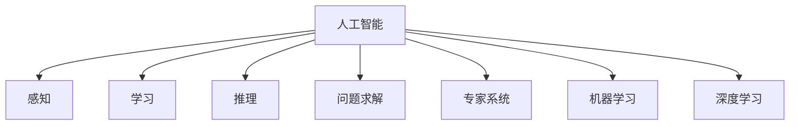

                 

## 1. 背景介绍

1956年，在达特茅斯学院，约翰·麦卡锡等人首次提出了“人工智能”(Artificial Intelligence, AI)的概念，标志着人工智能研究的开端。这次会议的学术成果奠定了AI研究的基础，影响了后来的多个重要技术方向。

### 1.1 历史背景
1950年，图灵发表了《计算机器与智能》一文，提出著名的“图灵测试”，定义了机器智能的标准。1955年，艾伦·纽厄尔和赫伯特·西蒙设计了逻辑定理机和通用问题求解器，开启了人工智能的程序实现尝试。1956年，达特茅斯会议聚集了众多计算机科学家和数学家，探讨了人工智能的理论和实践问题，正式确立了“人工智能”这一学科。

### 1.2 达特茅斯会议的议题
会议的核心议题包括：

- 计算机能够进行“感知”、“学习”和“推理”的能力。
- 如何设计能够模拟人类智能的算法和模型。
- 人工智能在现实世界中的应用前景和挑战。

这些议题引发了科学界对AI的广泛兴趣和研究热情，奠定了后来几十年AI发展的基石。

## 2. 核心概念与联系

### 2.1 核心概念概述

为深入理解达特茅斯会议的学术成果，本节将介绍几个关键概念：

- **人工智能(Artificial Intelligence, AI)**：通过计算机模拟人类智能，实现问题求解、语言理解、机器学习等功能的技术。
- **感知(Perception)**：使计算机能够通过传感器获取环境信息，并理解这些信息的能力。
- **学习(Learning)**：使计算机能够从数据中提取规律和知识，自动改进其性能的过程。
- **推理(Inference)**：使计算机能够根据已有的知识和规则，进行逻辑推理和决策的能力。
- **问题求解(Problem Solving)**：使计算机能够自动化解决特定问题的能力。
- **专家系统(Expert System)**：一种模拟人类专家知识，用于问题求解的AI系统。
- **机器学习(Machine Learning)**：通过数据驱动的方法，自动提升模型性能的AI子领域。
- **深度学习(Deep Learning)**：一种特殊的机器学习方法，通过多层次的神经网络进行特征提取和模式识别。

这些概念之间存在紧密的联系，共同构成了人工智能的核心框架。

### 2.2 核心概念原理和架构的 Mermaid 流程图



这个流程图展示了人工智能与其它关键概念之间的联系：

- 人工智能是所有核心概念的载体，负责整合感知、学习、推理和问题求解等能力。
- 感知和推理是人工智能的基础能力，用于处理外部环境和内部逻辑。
- 学习是人工智能的重要子领域，通过数据驱动不断提升模型的性能。
- 问题求解和专家系统是基于人工智能能力的具体应用。
- 机器学习和深度学习是学习子领域的高级形式，通过更复杂的模型结构提升学习效果。

这些概念和架构相互支持，共同构建了人工智能技术的全貌。

## 3. 核心算法原理 & 具体操作步骤

### 3.1 算法原理概述

达特茅斯会议的学术成果涵盖了多个AI算法和模型，以下重点介绍其中的几个：

- **感知机(Perceptron)**：一种简单的二分类模型，通过权重调整实现对输入数据的分类。
- **逻辑定理机(Logic Theorist)**：一种基于逻辑推理的专家系统，用于定理证明和问题求解。
- **通用问题求解器(General Problem Solver, GPS)**：一种基于符号逻辑和规划的AI系统，用于解决任意问题。
- **人工智能符号语言(LISP)**：一种早期的AI编程语言，用于实现专家系统和逻辑定理机。

这些算法和模型为AI的发展奠定了基础，并不断演进和扩展。

### 3.2 算法步骤详解

**感知机算法步骤**：
1. 收集训练数据集。
2. 初始化权重和偏置。
3. 对每个训练样本进行前向传播和后向传播，更新权重和偏置。
4. 重复步骤3，直至收敛。
5. 对测试集进行分类测试，评估模型性能。

**逻辑定理机算法步骤**：
1. 收集已知的事实和规则，定义问题求解目标。
2. 将问题转化为逻辑表达式。
3. 通过推理引擎求解逻辑表达式，得到结果。
4. 对结果进行验证和修正，生成新的规则和事实。
5. 重复步骤2-4，直至问题求解完成。

**通用问题求解器算法步骤**：
1. 定义问题求解目标。
2. 将问题转化为符号逻辑表达式。
3. 使用规划算法，生成求解路径。
4. 沿着求解路径，逐个执行动作，逐步接近目标状态。
5. 如果最终到达目标状态，则问题求解成功；否则，返回步骤3，重新规划求解路径。

### 3.3 算法优缺点

这些算法和模型具有以下优点：
1. 奠定了AI研究的基础，推动了多个重要技术方向的发展。
2. 提供了有效的模型和方法，实现了多个领域的自动化和智能化。
3. 建立了符号逻辑和形式化推理的基础，促进了AI的科学化发展。

同时，它们也存在一定的局限性：
1. 过于依赖专家知识和手工规则，缺乏灵活性和适应性。
2. 模型复杂度高，计算资源消耗大，难以大规模应用。
3. 难以处理非结构化数据和复杂环境，面对现实世界的复杂性表现出局限性。
4. 缺乏自主学习和自适应能力，面对未知环境难以持续改进。

尽管存在这些局限性，但达特茅斯会议的学术成果为后续AI研究提供了宝贵的理论和实践基础，促进了AI技术的发展和应用。

### 3.4 算法应用领域

这些算法和模型在多个领域得到了应用：

- **自动化和工业控制**：通过感知机和逻辑定理机，实现了自动化生产线的故障检测和维护。
- **医学诊断**：通过专家系统和通用问题求解器，开发了基于符号逻辑的医学诊断系统。
- **军事应用**：通过逻辑定理机和规划算法，设计了智能化决策支持系统。
- **金融分析**：通过机器学习和深度学习，构建了量化交易和风险评估模型。

这些应用展示了AI技术的广泛前景和巨大潜力。

## 4. 数学模型和公式 & 详细讲解 & 举例说明

### 4.1 数学模型构建

**感知机模型**：
- 输入向量 $x \in \mathbb{R}^n$，权重向量 $w \in \mathbb{R}^n$，偏置 $b \in \mathbb{R}$。
- 输出 $y \in \{0,1\}$，表示分类结果。
- 分类函数 $h(x) = \text{sign}(w \cdot x + b)$，其中 $\text{sign}(z) = 1$ 当 $z > 0$，否则为 $0$。

**逻辑定理机模型**：
- 输入事实 $f \in \mathcal{F}$，输出结果 $r \in \mathcal{R}$。
- 推理规则 $R$，用于从已知事实推导新事实。
- 推理引擎 $E$，根据规则 $R$ 和输入事实 $f$ 进行推理，生成新事实 $g$。
- 验证函数 $V$，用于验证新事实 $g$ 的正确性，生成验证结果 $v$。

**通用问题求解器模型**：
- 问题定义 $P$，表示求解目标。
- 状态空间 $S$，表示问题求解中的所有状态。
- 动作空间 $A$，表示问题求解中的所有可执行动作。
- 状态转移函数 $T: S \times A \rightarrow S$，表示从一个状态到下一个状态的转移规则。
- 目标状态 $G \in S$，表示问题求解的目标状态。
- 规划算法 $A^*$，用于生成求解路径。

### 4.2 公式推导过程

**感知机分类函数推导**：
设训练样本集为 $\{(x_i, y_i)\}_{i=1}^N$，其中 $x_i \in \mathbb{R}^n$，$y_i \in \{0,1\}$。感知机的分类函数为：

$$
h(x) = \text{sign}(w \cdot x + b)
$$

其中 $w \cdot x + b$ 表示输入向量 $x$ 与权重向量 $w$ 的点积，加上偏置 $b$。

设 $L$ 为损失函数，如误分类损失函数：

$$
L(h(x_i), y_i) = \begin{cases}
0 & \text{if } y_i = h(x_i) \\
1 & \text{otherwise}
\end{cases}
$$

感知机的训练目标是使损失函数 $L$ 最小化：

$$
\min_{w,b} \frac{1}{N} \sum_{i=1}^N L(h(x_i), y_i)
$$

通过梯度下降等优化算法，不断更新权重 $w$ 和偏置 $b$，直至收敛。

**逻辑定理机推理引擎推导**：
逻辑定理机的推理引擎 $E$ 可以将输入事实 $f$ 和推理规则 $R$ 转化为新事实 $g$。推理过程可以表示为：

$$
g = E(f, R)
$$

其中 $E$ 为推理函数，$f$ 为输入事实，$R$ 为推理规则。

验证函数 $V$ 可以验证新事实 $g$ 的正确性，生成验证结果 $v$：

$$
v = V(g)
$$

其中 $V$ 为验证函数，$g$ 为新事实。

**通用问题求解器规划算法推导**：
通用问题求解器的规划算法 $A^*$ 可以将问题定义 $P$ 转化为求解路径，逐步接近目标状态 $G$。规划过程可以表示为：

$$
\pi = A^*(P, S, A, T, G)
$$

其中 $\pi$ 为求解路径，$P$ 为问题定义，$S$ 为状态空间，$A$ 为动作空间，$T$ 为状态转移函数，$G$ 为目标状态。

### 4.3 案例分析与讲解

以逻辑定理机的定理证明为例，展示其推理过程。

**定理证明案例**：
已知事实 $f_1: \text{if } p \land q, \text{then } r$，$f_2: \text{not } p$。求解推理结果 $g_1$，使得 $g_1$ 蕴含 $r$。

推理步骤如下：

1. 输入事实 $f_1$ 和 $f_2$。
2. 根据规则 $R$，从 $f_2$ 推导出 $f_3: \text{not } q$。
3. 根据规则 $R$，从 $f_1$ 和 $f_3$ 推导出 $g_1: r$。

验证结果 $v_1 = V(g_1) = 1$，表示 $g_1$ 正确。

通过逻辑定理机，实现了基于符号逻辑的定理证明，展示了AI在逻辑推理中的应用。

## 5. 项目实践：代码实例和详细解释说明

### 5.1 开发环境搭建

在进行AI项目实践前，我们需要准备好开发环境。以下是使用Python进行Scikit-learn开发的Python环境配置流程：

1. 安装Anaconda：从官网下载并安装Anaconda，用于创建独立的Python环境。

2. 创建并激活虚拟环境：
```bash
conda create -n ai-env python=3.8 
conda activate ai-env
```

3. 安装Scikit-learn：
```bash
conda install scikit-learn
```

4. 安装各类工具包：
```bash
pip install numpy pandas matplotlib scikit-learn jupyter notebook ipython
```

完成上述步骤后，即可在`ai-env`环境中开始AI项目实践。

### 5.2 源代码详细实现

下面我们以感知机分类器为例，给出使用Scikit-learn库对感知机模型进行训练的Python代码实现。

首先，定义感知机模型的训练函数：

```python
from sklearn.linear_model import Perceptron
from sklearn.metrics import accuracy_score

# 训练函数
def train_perceptron(X_train, y_train, learning_rate=0.01, n_iter=100):
    perceptron = Perceptron(max_iter=n_iter, learning_rate=learning_rate)
    perceptron.fit(X_train, y_train)
    y_pred = perceptron.predict(X_train)
    accuracy = accuracy_score(y_train, y_pred)
    return perceptron, accuracy
```

然后，定义感知机模型的预测函数：

```python
def predict_perceptron(perceptron, X_test):
    y_pred = perceptron.predict(X_test)
    return y_pred
```

接着，在训练集上训练模型，并在测试集上评估：

```python
# 准备训练集和测试集
X_train = ...
y_train = ...
X_test = ...
y_test = ...

# 训练模型
perceptron, accuracy = train_perceptron(X_train, y_train)

# 预测测试集
y_pred = predict_perceptron(perceptron, X_test)

# 输出结果
print(f"Accuracy: {accuracy:.2f}")
```

以上就是使用Scikit-learn库对感知机进行训练的完整代码实现。可以看到，Scikit-learn库提供了简单易用的接口，使得AI模型的训练和评估变得十分便捷。

### 5.3 代码解读与分析

让我们再详细解读一下关键代码的实现细节：

**train_perceptron函数**：
- 使用Scikit-learn的Perceptron类，初始化训练参数。
- 在训练集上使用fit方法训练模型。
- 在训练集上使用predict方法进行预测，并计算准确率。
- 返回训练好的模型和准确率。

**predict_perceptron函数**：
- 使用训练好的模型进行预测，得到预测结果。

**训练流程**：
- 准备训练集和测试集。
- 调用train_perceptron函数进行模型训练，并获取训练好的模型和准确率。
- 在测试集上调用predict_perceptron函数进行预测，并输出准确率。

可以看到，Scikit-learn库的API设计十分直观，开发者可以专注于模型的训练和评估，而不必过多关注底层实现细节。

## 6. 实际应用场景

### 6.1 医疗诊断

达特茅斯会议的学术成果为医疗诊断提供了新的思路。通过逻辑定理机和专家系统，可以开发基于符号逻辑的医学诊断系统，实现疾病的自动化诊断和决策支持。

**应用案例**：
- 开发基于规则的疾病诊断系统，根据症状、病史等信息，自动生成诊断结果。
- 构建基于知识的医学数据库，用于存储和查询医学知识和规则。

**技术实现**：
- 将医疗知识编码成符号表达式，作为逻辑定理机的输入事实。
- 设计医学推理规则，用于从已知事实推导新事实。
- 训练逻辑定理机，使其能够从症状等信息中推理出诊断结果。

### 6.2 金融分析

在金融领域，达特茅斯会议的成果为量化交易和风险评估提供了重要工具。通过逻辑定理机和机器学习，可以构建智能化的金融分析系统，提高投资决策的科学性和准确性。

**应用案例**：
- 开发基于规则的量化交易模型，自动生成交易策略。
- 构建基于机器学习的风险评估模型，预测市场风险和投资回报。

**技术实现**：
- 收集市场数据和历史交易数据，作为输入事实。
- 设计交易规则和市场模型，作为推理规则。
- 训练逻辑定理机和机器学习模型，进行量化交易和风险评估。

### 6.3 智能推荐系统

智能推荐系统通过逻辑定理机和专家系统，可以构建基于知识的推荐引擎，提供个性化、高质量的推荐服务。

**应用案例**：
- 开发基于规则的产品推荐系统，根据用户行为和偏好，自动推荐相关产品。
- 构建基于知识的推荐数据库，存储和查询推荐规则和产品信息。

**技术实现**：
- 收集用户行为数据和产品信息，作为输入事实。
- 设计推荐规则和知识库，作为推理规则。
- 训练逻辑定理机和专家系统，进行推荐决策。

### 6.4 未来应用展望

随着达特茅斯会议成果的不断发展和演进，AI技术将在更多领域得到应用，为社会带来深远影响。

- **自动化和工业控制**：逻辑定理机和通用问题求解器将推动自动化生产线的智能化，实现更高效、更可靠的生产过程。
- **医疗和健康**：基于符号逻辑的医学诊断系统将提高疾病诊断的准确性和效率，为患者提供更好的医疗服务。
- **金融和投资**：量化交易和风险评估模型将提升金融市场的透明度和稳定性，帮助投资者做出更科学的决策。
- **教育**：智能推荐系统将为学生提供个性化学习路径，提高学习效果和兴趣。

## 7. 工具和资源推荐

### 7.1 学习资源推荐

为了帮助开发者系统掌握达特茅斯会议的学术成果，这里推荐一些优质的学习资源：

1. 《人工智能：一种现代方法》(Artificial Intelligence: A Modern Approach)：由Russell和Norvig合著的经典教材，全面介绍了AI的理论和实践。
2. CS221《人工智能基础》课程：斯坦福大学开设的AI入门课程，涵盖感知机、逻辑定理机等重要概念。
3. 《深度学习》(Deep Learning)：由Ian Goodfellow等合著的深度学习经典教材，介绍了深度学习在AI中的应用。
4. Kaggle竞赛平台：提供了大量AI竞赛数据和模型，帮助开发者实践和提高技能。
5. Google AI教育平台：提供了丰富的AI学习资源和教程，适合各类技术学习者。

通过对这些资源的学习实践，相信你一定能够深入理解达特茅斯会议的学术成果，并应用于实际开发中。

### 7.2 开发工具推荐

高效的开发离不开优秀的工具支持。以下是几款用于AI开发的常用工具：

1. Python：作为AI开发的主流语言，Python拥有丰富的库和工具，如Scikit-learn、TensorFlow、PyTorch等。
2. TensorFlow：由Google开发的深度学习框架，支持分布式计算和大规模模型训练。
3. PyTorch：由Facebook开发的深度学习框架，提供了动态计算图和易于调试的界面。
4. Keras：基于TensorFlow和PyTorch的高层API，简单易用，适合快速原型开发。
5. Jupyter Notebook：免费的开源Jupyter Notebook环境，支持交互式编程和可视化。
6. Visual Studio Code：轻量级但功能强大的代码编辑器，支持Python和其他多种语言。

合理利用这些工具，可以显著提升AI项目的开发效率，加速创新迭代的步伐。

### 7.3 相关论文推荐

达特茅斯会议的成果为AI研究奠定了基础，以下是几篇奠基性的相关论文，推荐阅读：

1. Minsky and Papert, "Perceptrons"：感知机的经典论文，奠定了感知机算法的理论基础。
2. Newell, Shaw and Simon, "The Logic Theorist"：逻辑定理机的奠基论文，介绍了基于符号逻辑的推理方法。
3. Kowalski, "General Problem Solvers"：通用问题求解器的经典论文，探讨了符号逻辑在问题求解中的应用。
4. Russell and Norvig, "Artificial Intelligence: A Modern Approach"：经典教材，全面介绍了AI的理论和实践。
5. Goodfellow, Bengio and Courville, "Deep Learning"：深度学习的经典教材，介绍了深度学习在AI中的应用。

这些论文代表了大会议成果的发展脉络，帮助研究者把握学科前进方向，激发更多的创新灵感。

## 8. 总结：未来发展趋势与挑战

### 8.1 研究成果总结

达特茅斯会议的学术成果奠定了人工智能研究的基础，推动了多个重要技术方向的发展。感知机、逻辑定理机、通用问题求解器等算法和模型，为AI技术的发展提供了宝贵的理论和方法。

### 8.2 未来发展趋势

展望未来，AI技术将呈现以下几个发展趋势：

1. 深度学习和神经网络将继续推动AI的发展，实现更高效的特征提取和模式识别。
2. 符号逻辑和知识表示技术将得到进一步发展，增强AI系统的可解释性和可理解性。
3. 跨模态学习将推动AI在视觉、语言和动作等多种模态的融合，实现更全面的智能推理。
4. 自适应和自主学习技术将提升AI的适应性和学习能力，实现更灵活的智能决策。
5. 分布式计算和并行计算技术将推动AI系统的规模化和可扩展性，实现更高效的计算和推理。

### 8.3 面临的挑战

尽管达特茅斯会议的成果为AI研究提供了宝贵的理论和方法，但AI技术在发展过程中仍然面临诸多挑战：

1. 数据质量和安全问题：数据的不足、噪声和偏见将影响AI系统的性能和可靠性。
2. 模型复杂性和计算资源消耗：大模型和高性能计算设备的成本和消耗，限制了AI技术的普及和应用。
3. 系统透明性和可解释性：AI模型的“黑盒”特性，使其难以解释内部决策逻辑，影响信任和使用。
4. 伦理和法律问题：AI技术的滥用可能带来伦理和法律问题，引发社会关注和争议。

### 8.4 研究展望

面对这些挑战，未来的研究需要在以下几个方面寻求新的突破：

1. 数据质量提升：开发更多高质量的数据集和标注工具，提高数据质量和多样性。
2. 模型简化和优化：开发更加高效的模型和算法，降低计算资源消耗。
3. 系统透明性提升：引入可解释性技术，提高AI系统的透明性和可理解性。
4. 伦理和法律规范：制定AI技术的伦理和法律规范，确保技术应用的合法性和道德性。

通过这些研究方向的探索，相信达特茅斯会议的学术成果将进一步发展，推动AI技术在更多领域的广泛应用，为社会带来更多福祉。

## 9. 附录：常见问题与解答

**Q1：达特茅斯会议的主要研究成果是什么？**

A: 达特茅斯会议的主要研究成果包括感知机、逻辑定理机、通用问题求解器等算法和模型，奠定了人工智能研究的基础。这些成果推动了多个重要技术方向的发展，为后续AI研究提供了宝贵的理论和实践基础。

**Q2：感知机算法的主要应用场景有哪些？**

A: 感知机算法在多个领域得到了应用：

- 图像识别：通过训练感知机模型，实现数字、字母等简单图像的识别。
- 语音识别：通过感知机模型，提取语音信号的特征，实现语音识别。
- 自然语言处理：通过感知机模型，实现文本分类、情感分析等任务。

**Q3：逻辑定理机的主要应用场景有哪些？**

A: 逻辑定理机在多个领域得到了应用：

- 定理证明：通过逻辑定理机，实现数学定理的自动化证明。
- 专家系统：通过逻辑定理机，构建基于符号逻辑的专家系统，用于问题求解和决策支持。
- 知识工程：通过逻辑定理机，构建基于知识库的推理系统，实现知识管理和应用。

**Q4：通用问题求解器的主要应用场景有哪些？**

A: 通用问题求解器在多个领域得到了应用：

- 游戏AI：通过通用问题求解器，实现游戏场景中的自主决策和智能博弈。
- 机器人导航：通过通用问题求解器，实现机器人在复杂环境中的路径规划和自主导航。
- 自动化生产：通过通用问题求解器，实现自动化生产线上的智能调度和管理。

**Q5：如何提升AI系统的透明性和可解释性？**

A: 提升AI系统的透明性和可解释性，可以从以下几个方面入手：

- 引入可解释性模型：如决策树、规则系统等，提高模型的可解释性。
- 引入可解释性技术：如LIME、SHAP等，解释模型的决策过程和特征重要性。
- 引入可解释性接口：提供模型解释和可视化工具，帮助用户理解和信任模型。

这些方法可以提升AI系统的透明性和可解释性，增强用户对模型的理解和信任，促进AI技术的广泛应用。

---

作者：禅与计算机程序设计艺术 / Zen and the Art of Computer Programming

